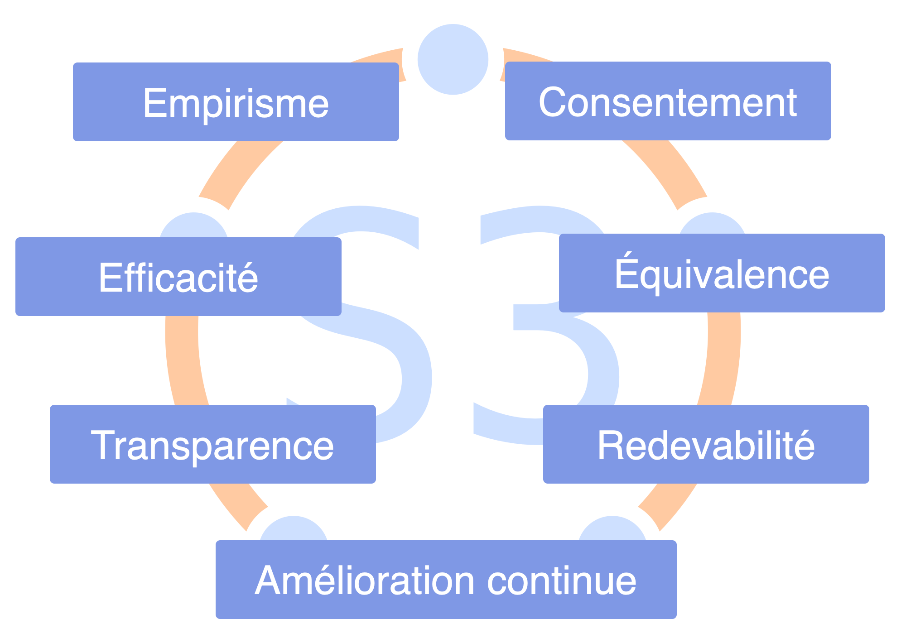

<strong>Respectez les Sept Principes dans vos collaborations.</strong>

L'adoption des sept principes réduit le nombre d'ententes explicites requises et guide l'adaptation des pratiques S3 au contexte particulier de l'organisation.

Les valeurs d'une organisation doivent supporter les sept principes.

[&#9654; S'entendre sur les valeurs](agree-on-values.html) [&#9664; Participation élégante](artful-participation.html) [&#9650; Catalyser la collaboration](enablers-of-collaboration.html)

