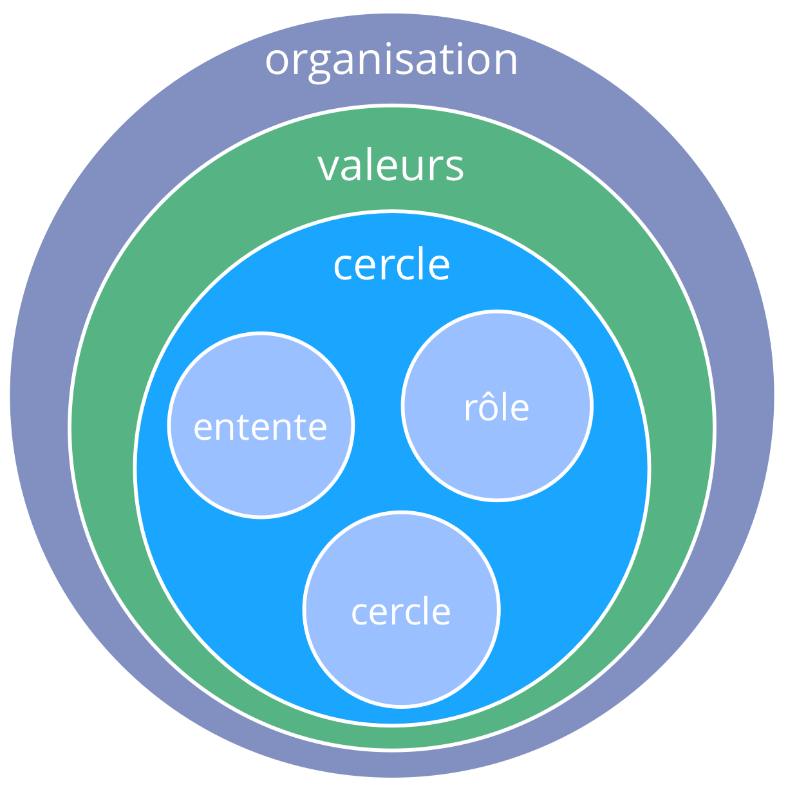
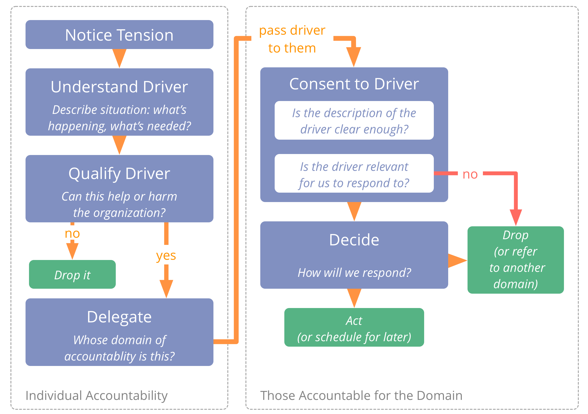
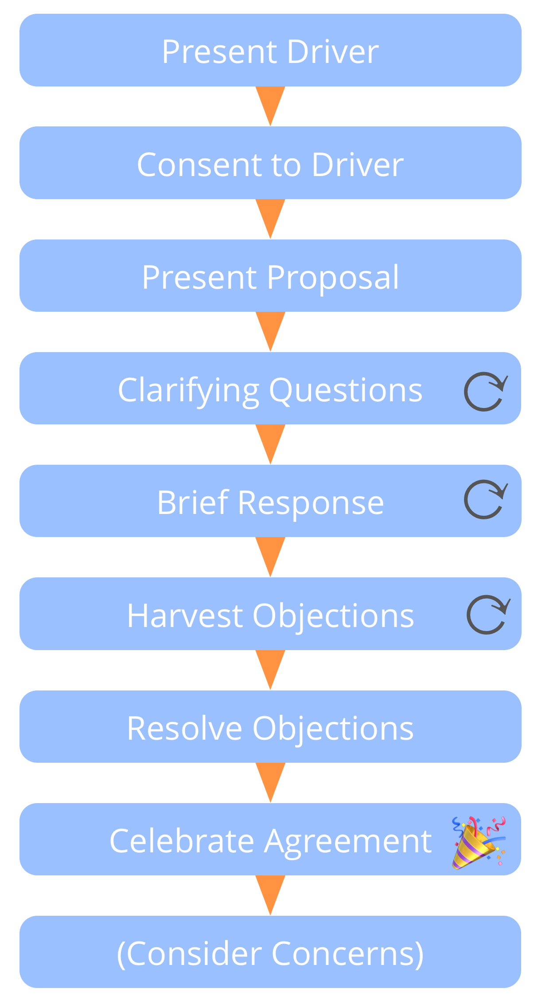
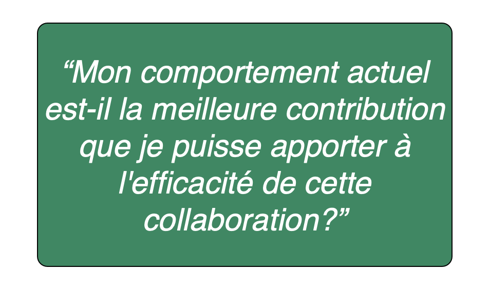
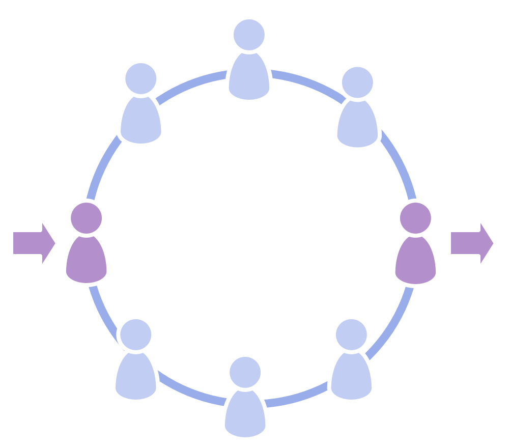
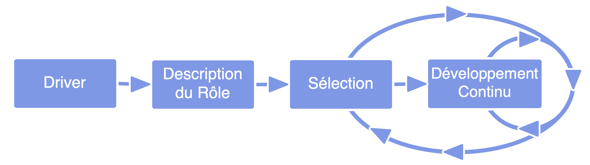
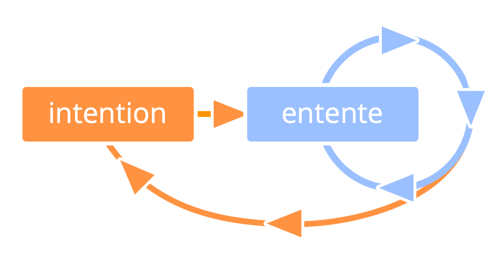
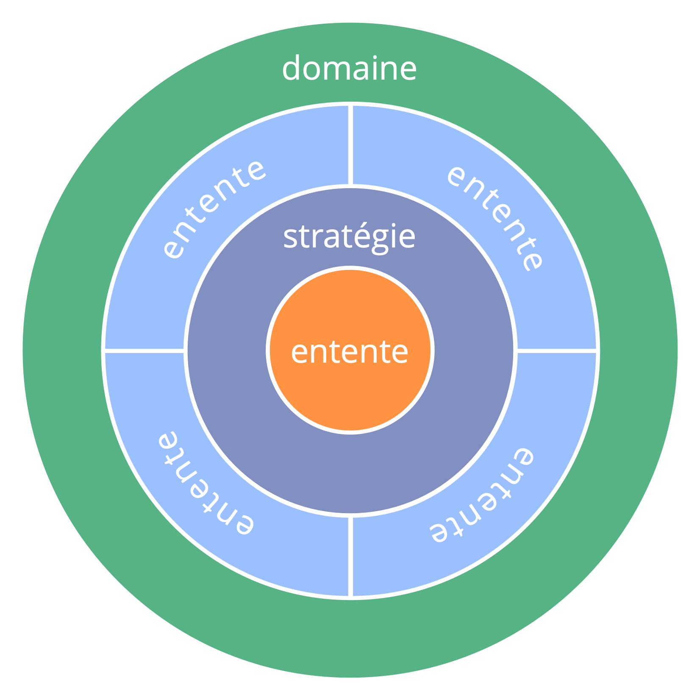
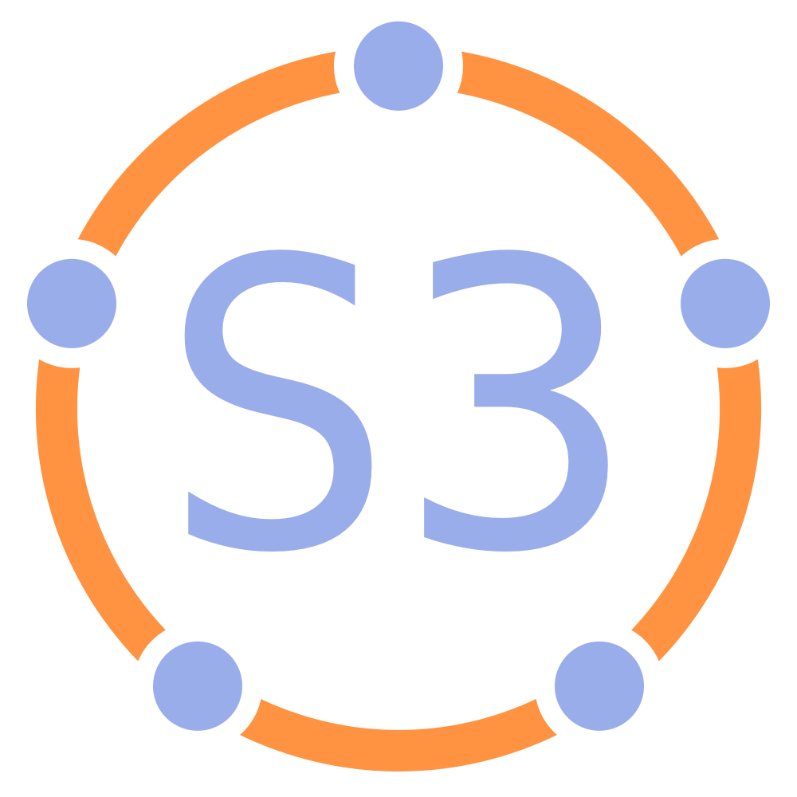

# Introduction

## Sociocratie 3.0 - Un guide pratique pour évoluer des organisations agiles et endurantes

### Une collaboration efficace à tous niveaux

- **Basée sur les principes** : une façon cohérente pour cultiver l'intégrité organisationnelle et développer un état d'esprit agile et sociocratique
- **flexible**: adaptable patterns, independent and mutually reinforcing, to help you with all aspects of collaboration
- **Libre** : licence Creative Commons Free Culture License

## Quelle est son utilité ?

Sociocratie 3.0 - **a.k.a. "S3"** - vous apporte une collection exhaustive de règles et de pratiques ayant prouvé leur efficacité auprès de différentes organisations, pour ** améliorer les performances, l'alignement, la complétion et le bien-être.
 

S3 vous aide à découvrir comment atteindre vos objectifs et naviguer dans la complexité d'un projet de manière optimale, **sans le besoin d'une réorganisation radicale ou d'une initiative de changements massifs**:

- Démarrez par votre zone d'activité recelant les plus grands besoins, sélectionnez une pratique ou plus à essayer, **avancez à votre rythme** et développez vos compétences au fur et à mesure.

- **Peu importe votre situation hiérarchique dans l'organisation**, vous découvrirez des pratiques pertinentes et utiles.

## Contenus

- un bref récapitulatif des concepts basiques sur lesquels S3 se repose
- une description de toutes les pratiques S3
- une annexe contenant les changements apportés, les remerciements, des informations sur nos auteur.e.s et licences, un glossaire et un index

## Influences et histoire

## Les concepts de base

Avant de se plonger dans nos contenus, prenez le temps de vous familiariser avec des concepts simples de S3 :

- qu'est-ce qu'une pratique ?
- s'approprier les sept principes
- moteurs, valeur et gaspillage
- domaines, délégation et responsabilisation
- gouvernance, auto-organisation et semi-autonomie

Si vous ne comprenez pas un des termes, consultez notre glossaire.

## Pratiques

_Une **pratique** est un modèle pour appréhender correctement un contexte spécifique._

- Les pratiques S3 sont découvertes par l'observation de la manière dont plusieurs organisations résolvent leurs problèmes et répondent aux opportunités potentielles
- Les pratiques S3 peuvent être évoluées et adaptées pour convenir à différents contextes
- Les pratiques sont regroupées par sujets en 10 catégories différentes

## Toutes les pratiques sont basées sur les Sept Principes

## Les sept principes

**Efficacité** *Dédier du temps seulement à ce qui vous rapproche de la réalisation des objectifs.*

**Consentement:** *Faire des choses quand il n'y a pas de raisons de ne pas les faire.*

**Empirisme:** *Tester toutes les hypothèses par des expériences, des révisions continuelles et des falsifications.*

## Les sept principes (cont.)

**Amélioration continue:** *Évoluer par incréments pour faciliter un apprentissage empirique constant.*

**Équivalence:** *Impliquer les personnes impactées dans les prises de décisions et les évolutions.*

**Transparence:** *Rendre toutes les informations accessibles à tous les membres d'une organisation, à moins qu'il faille préserver leur confidentialité.*

**Responsabilisation:** *Répondre lorsque nécessaire, faire ce qu'on s'est engagé de faire et assumer la responsabilité de l'avancement de l'organisation.*

## Moteurs

_Un **moteur** est la motivation d'un groupe ou d'une personne pour répondre à une situation particulière._

Moteurs :

- peuvent être utilisés pour déduire des buts, objectifs, missions, visions, finalités
- peuvent changer au fil du temps

### Moteurs, valeur et gaspillage

_La **valeur** est l'importance ou l'utilité d'un élément en relation à un moteur._

_Le **gaspillage** est tout ce qui n'est pas nécessaire (essentiel) pour - ou qui empêche - la réponse à un moteur._

L'adoption des concepts de valeur et gaspillage permet l'accès à plusieurs outils et idées du **Lean Management** et du **développement logiciel Lean (Lean Software Development)** pour aider les organisations à fonctionner avec la Sociocratie 3.0 :

- cartographie de flux de valeur
- différentes stratégies pour éliminer le gaspillage
- la Méthode Kanban

## Domaines

_Un **domaine** est une zone d'influence, activité et prise de décisions distincte au sein d'une organisation._

Tous les domaines se situent dans le domaine global d'une organisation et peut chevaucher et / ou être pleinement contenus au sein d'autres domaines.

Les domaines sont délégués à des responsables (une unité, un département, une équipe ou des individus) du domaine, au sein de ses contraintes prédéfinies sur l'influence et l'autonomie.

## Déléguer les domaines

Ceux qui délèguent un domaine (les * déléguants *) restent responsables de ce domaine, et définissent souvent :

- les **responsabilités clés** (tâches essentielles et délégation des prises de décision)
- les **contraintes pour l'autonomie et l'influence** pour les délégués au domaine, souvent liées à l'organisation (budget, ressources, niveaux de délégation, compte-rendus)

## Moteurs et Domaines

Un domaine peut être défini par rapport à un moteur organisationnel - soit le **moteur principal** du domaine - par l'ensemble des sous-domaines qu'il pourrait être intéressant d'examiner en répondant au moteur principal :

- les **responsabilités clés** découlent directement du moteur principal du domaine
- les **contraintes** se rapportent au contexte général de l'organisation

## Domaines et Responsabilisation

- la responsabilisation s'applique à toutes les ententes, incluant l'organisation elle-même, les cercles, et les rôles
- la responsabilité première de chaque membre est de collaborer efficacement pour répondre aux moteurs organisationnels
- les individus et les groupes sont responsables du travail qu'ils accomplissent, ainsi que de leur apprentissage et de leur développement. L'organisation doit fournir un soutien adéquat
- chaque membre d'une organisation est responsable de l'alignement de ses actions avec ses valeurs organisationnelles

## Gouvernance, semi-autonomie et auto-organisation

**Gouvernance**: Continuellement décider des actions nécessaire pour atteindre les objectifs et définir des contraintes sur la façon de procéder.

**Auto-gouvernance**: Ensemble de personnes se gouvernant elles-mêmes selon les contraintes d'un domaine.

**Auto-organisation**: Des personnes coordonnant leur travail selon des contraintes définies par la gouvernance.

**Opérations** (Faire le travail) : Des gens accomplissant ce qui doit être fait, guidés par leur coordination et leur gouvernance.

**Semi-autonomie**: Des personnes étant autonomes pour créer de la valeur, limitées par les contraintes de leur domaine.

## Gouvernance vs Opérations

Repérer, évaluer et évoluer les décisions prises en vue d'atteindre les objectifs permet à une organisation d'apprendre et s'améliorer en continu.

*Est-ce que cela demande ou profite d'une décision de groupe ou individuelle ?*

- oui : gouvernance 
    - non couverte par une entente préalable
    - doit être acceptée, décidée ou amendée
- non : opérations 
    - couvertes par les ententes précédentes (les responsables peuvent agir librement)
    - doivent être réalisées

# The Patterns

## Co-création et évolution 

### Répondre aux moteurs organisationnels

*Clarifiez ce qu'il se passe et ce dont vous avez besoin dans le contexte de l'organisation, et agissez comme nécessaire.*

Réponses à un moteur :

- action
- décision (y compris créer un rôle, un cercle, une équipe de soutien ou un domaine ouvert)

#### Qualifier les moteurs organisationnels

Certains moteurs sont (directement ou indirectement) liés au moteur primaire d'une organisation. Ce sont les **moteurs organisationnels**. Les autres moteurs ne sont pas inclus dans le domaine de l'organisation.

Une méthode simple pour qualifier les moteurs organisationnels est de vérifier :

*Est-ce que répondre à ce moteur améliore - ou évite d'entraver - le flux de valeur vers un moteur organisationnel existant? Est-ce que cela nous aidera ou nous pénalisera ?*

#### Évaluation des moteurs

La réponse à un moteur est habituellement une expérience développée au fil du temps, selon l'apprentissage du groupe.

- Est-ce que la description de la situation est encore correcte ?
- Est-ce qu'on associe toujours les mêmes besoins à la situation ?
- Le moteur est-il toujours dans notre domaine ?
- Le moteur est-il toujours pertinent ?

### Naviguer par tension

**Identifier et s'occuper des motivations organisationnelles.**

Tous les membres cherchent à identifier ce qui pourrait aider ou nuire à l'organisation, et à s'occuper des motivations efficacement.

Une tension est une expérience personnelle, le signal d'une dissonance entre la perception d'une situation et nos attentes ou préférences.

Les défis et les possibilités d'une organisation sont révélés quand ses membres deviennent conscients des tensions vécues.

Pour découvrir les motivations, examiner la tension en décrivant la situation et ce qui serait requis. Parfois, l'analyse dissout une incompréhension et la tension disparaît.

Connaissance des **motivations organisationnelles** peut être transmis au domaine approprié.

### Décrire les moteurs

**Décrivez les moteurs pour comprendre, communiquer à leur sujet et vous en souvenir.**

Une façon simple de décrire un moteur est émettre une déclaration contenant :

- une brève description de la situation (observation) 
- une description des besoins (déficit) par rapport à la situation 

Lorsqu'il y a un désaccord sur les besoins, il peut être utile de prendre du recul par rapport à des solutions spécifiques.

> Exemple de déclaration d'un moteur :
> 
> *"La cuisine est bien sale : aucun verre n'est propre, l'évier est rempli à ras-bord et c'est impossible de juste prendre un café, puis retourner au boulot. Il faut qu'on arrive à garder la cuisine dans un état correct, pour qu'on puisse l'utiliser sans efforts."*

La **déclaration du moteur** contient juste assez d'informations pour transmettre le besoin d'une action ou d'une décision. Vous pouvez révéler plus d'informations sur l'échelle et les détails du moteur dans un annexe à sauvegarder.

Un moteur peut être décrit comme un problème ou une opportunité, selon la perspective de la personne ou du groupe.

### Prise de décision par consentement

**Un processus (facilité) de prise de décision en groupe.**

- invite les objections et intègre leur sagesse pour développer des propositions ou améliorer les ententes existantes
- ignorer les objections pourrait porter atteinte aux buts d'un cercle ou de l'organisation
- les objections non traitées empêchent les propositions de devenir des ententes
- consentir signifie qu'une proposition est suffisamment bonne et sûre pour l'essayer (“Good enough for now, safe enough to try”). On qu’on “peut vivre avec" jusqu'à l'évaluation

#### Contrat implicite du consentement

- En l'absence d'objection à une entente, j'ai l'intention de donner suite à l'accord au meilleur de mes capacités.
- Je partagerai les objections lorsque j'en prendrai conscience.

### Objection

_Une **objection** est une raison expliquant pourquoi faire quelque chose entraverait une réponse plus efficace à un moteur._

Les objections contiennent des informations révélant :

- une conséquence certaine ou probable de préjudice (l'action n'est pas assez sécuritaire pour être essayée)
- des façons d'améliorer les propositions, les décisions, les ententes existantes ou les actions

#### Qualifier les objections

Il est de la responsabilité de chacun d'émettre ses objections potentielles.

Les responsables de l'action ou de l'entente proposée en question sont responsables de * la réflexion quant aux arguments et les réponses aux objections qualifiées.*

Se retenir d'objecter peut nuire à la capacité des individus, groupes ou l'organisation entière à répondre aux moteurs organisationnels.

Pouvoir faire remonter des objections *potentielles* à tout moment signifie que les décisions n'ont besoin que *d'être correctes au moment présent et assez sécuritaires pour être tentées*.

*Comment cela entraverait - ou escamoterait une opportunité d'améliorer - le flux de valeur vers un moteur organisationnel ?*

Les objections arrêtent :

- les actions en cours et planifiées
- l'exécution des décisions
- les ententes existantes avant qu'elles ne soient reconsidérées
- les propositions de devenir des ententes

#### Comprendre les objections

Quelques questions utiles :

- En quoi l'objection est-elle relative à cette proposition ou accord spécifique ?
- Est-ce que l'argument révèle comment des **actions ou ententes**: 
    - empêchent une bonne réponse aux moteurs organisationnels?
    - peuvent être améliorées dans l'immédiat ?
    - ... empêchent ou diminuent les contributions de quelqu'un pour répondre à un moteur ?
    - ... sont en conflit avec les valeurs de l'organisation ?
    - sont considérées trop risquées ?

#### Préoccupations

Une **préoccupation** est une *opinion* stipulant qu'une action (même si elle est considérée *correctes au moment présent et assez sécuritaires pour être tentées*) **pourrait** entraver - ou faire perdre une opportunité d'améliorer - le flux de valeur vers un moteur organisationnel.

Dans la prise de décision par consentement, les préoccupations :

- peuvent informer sur les moyens de faire évoluer les ententes ( y compris les critères d'évaluation et la fréquence d'évaluation) 
- sont entendues s'il y a le temps, ou sont considérées importantes
- ... peuvent être enregistrées dans le journal de bord

Si les gens croient qu'une proposition n'est 'pas assez sécuritaire pour être tentée', elles peut faire apparaître des préoccupations sous la forme d'objections, pour consulter les pairs sur la probabilité d'un préjudice.

### Résoudre les objections

#### Une méthode pour résoudre les objections

### Évaluer les ententes

L'examen continuel des ententes est une pratique essentielle pour une organisation évolutive ; constamment développer le corps des ententes, et éliminer le gaspillage :

- s'adapte aux changements de contexte
- intègre l'apprentissage: 
    - *Comment cette entente nous a-t-elle aidée ?*
    - *Comment cette entente peut être améliorée ?*
    - *Y a-t-il une quelconque raison de ne pas conserver cette entente ?*

- préparation
    
    - évaluez le planning
    - assurez-vous que les informations nécessaires sont disponibles

- suivi
    
    - entendez-vous sur la prochaine date d'évaluation
    - documentation / notifications
    - suivi des tâches et décisions
    - effets sur les ententes reliées

- évaluer les ententes peut être une simple vérification de leur pertinence, et qu'il n'y a aucune objection à conserver la forme actuelle de l'entente 
- les ententes sont souvent évaluées dans des *Réunions de Gouvernance* 
- il est parfois efficace de planifier une session dédiée à l'évaluation d'une entente 
- ajustez la fréquence d'évaluation comme nécessaire
- évaluez au plus tôt si besoin
- les éléments de ce processus peuvent aussi être utilisés par des individus pour évaluer les décisions prises

### Les personnes concernées décident

Impliquez chaque personne affectée par une décision, pour maintenir l'équivalence et les responsabilités, et augmenter la quantité d'informations disponibles sur le sujet.

Pour de plus grands groupes :

- facilitez les différentes étapes du processus et créez de plus petits groupes, qui sélectionneront les délégués
- instituez un processus virtuel, asynchrone, limité dans le temps et agissant par étapes

Pensez à inclure les personnes concernées dans l'évaluation et l'évolution des décisions.

### Élaboration d'une proposition

**Un processus de groupe (facilité) pour co-créer une réponse à un moteur.**

- repose sur l'intelligence collective et la diversité des perspectives au sein d'un groupe
- ... implique les participants dans la co-création d'un accord
- ... encourage la prise de responsabilité et l'appropriation

L'élaboration de propositions peut aussi être employée par un individu.

#### Processus d'élaboration d'une proposition

- **Consentement au moteur** : *Est-ce qu'il est pertinent de répondre à ce moteur ? Est-ce que la déclaration motrice est une description exacte du contexte et des besoins ?*
- **Approfondir la compréhension partagée du moteur** : invitez vos pairs à poser des questions essentielles pour mieux comprendre les détails du moteur.
- **Récoltez les réflexions** sous forme de questions, reliées à de possibles solutions. Les questions révèlent des contraintes (questions récoltant des informations) ou des possibilités (questions génératrices).
- **Répondez** à toutes les questions demandant des informations si possible.
- **Priorisez** les considérations.
- **Récoltez des idées** comme ingrédients possibles pour une proposition.
- **Créez une proposition** pour gérer un moteur, en prenant en compte les idées créatives et les informations récoltes. En général, c'est un groupe plus restreint qui gère cette étape (les accordeurs).

#### Sélectionner les accordeurs

- qui devrait y être ?
- qui veut y être ?
- qui d'autre pourrait apporter une contribution utile ?
- considérez l'expertise, le point de vue et l'inspiration
- y a-t-il des objections à constituer ce groupe ?

### Élection des rôles

**Un processus de groupe pour sélectionner les détenteurs des rôles.**

- Les personnes évitent d'afficher leur intérêt avant la sélection
- Les nominations sont effectuées par la force de la raison, pas selon la majorité
- Vous pouvez vous nominer vous-même ou passer votre tour
- Lorsque vous vérifiez qu'il n'y ait pas d'objections, demandez à la personne nominée en dernier

Les objections à un nominé peuvent être résolues de multiples façons, y compris amender les descriptions du domaine du rôle ou la nomination d'une autre personne.

**Note:** Cette pratique peut aussi être utilisée pour sélectionner une option parmi d'autres dans d'autres circonstances.

### Cartographier les moteurs

Un atelier pour identifier une réponse efficace à une situation complexe: démarrer une compagnie, des nouveaux projets, s'attaquer à des entraves ou des ooportunités, aligner la structure organisationnelle au flux de valeur.

Les groupes grands ou petits identifient et priorisent les moteurs, passant rapidement du concept abstrait à l'action concrète dans des équipes autonomes.

#### Cartographier les moteurs : modèle pour les domaines

## Développement des pairs 

### Demander de l’aide

**Un protocole simple pour apprendre, partager ses compétences et établir des liens, par respect pour l'autonomie des autres personnes.**

Demandez à n'importe qui : "*pourriez-vous m'aider pour... *?" La personne vous répond alors simplement par "*oui*" ou "*non*".

- si votre requête est déclinée, la personne qui demande accepte cette réponse sans négocier ou demander pourquoi
- si la requête n'est pas claire, demandez plus d'informations
- si vous acceptez une demande d'aide, soutenez votre pair au mieux de vos capacités

### Évaluation par les pairs

Invitez un pair à vous donner des critiques constructives sur :

- votre performance dans votre rôle
- des retours sur votre participation et votre collaboration
- tout aspect spécifique qui pourrait vous intéresser

Considérations :

- demandez à vos pairs de ne pas répondre à froid et de se préparer
- invitez à donner des **appréciations** comme des **suggestions d'améliorations implémentables**
- posez des questions pour mieux comprendre les retours, et évitez de les discuter ou de les juger
- décidez vous-même comment prendre en compte ces retours

### Examen par les pairs

**Les gens doivent se soutenir mutuellement pour apprendre et s'améliorer dans les rôles et groupes qui leurs sont attribués.**

Le détenteur du rôle - ou le groupe - mène l'examen par les pairs en préparant le processus, et en ouvrant le dialogue à chaque étape.

Soyez sûr d'inviter les personnes ayant des perspectives complémentaires à contribuer à l'examen, et invitez aussi un facilitateur.

Il est possible de suggérer des améliorations concernant le développement personnel, la collaboration, des mises à jour sur la description du domaine (y compris la déclaration motrice) et la stratégie.

### Examen par les pairs (cont.)

#### L'amélioration continue des capacités des gens à remplir efficacement leur rôle ou collaborer en groupe.

### Plan d'évolution

**Un plan pour développer des méthodes plus efficaces pour prendre un domaine en compte, et arriver à un accord entre déléguant et délégué.**

Le plan d'évolution peut être créé peut une personne occupant un rôle précis, ou pour un groupe (par ex., un département, un cercle, une équipe ou un domaine ouvert).

Un développement peut prendre la forme d'une description plus précise du moteur et du domaine, d'amendements à une stratégie, des ententes inédites ou mises à jour et d'actions spécifiques à effectuer, soit dans le domaine du déléguant ou dans le domaine du délégué.

Un plan d'évolution (et toutes les recommandations associées pour les modifications de la description du domaine et de la définition du moteur) requiert le consentement du déléguant et du délégué.

## Facilitateurs de co-création 

### Participation élégante

Un **engagement individuel** pour développer des interactions utiles et une collaboration efficace :

- activement **respecter les ententes et les suivres** de la meilleure façon possible compte tenu des circonstances
- **prendre conscience et comprendre** les besoins individuels et collectifs
- **développer les compétences nécessaires** pour le faire
- **soutenir les autres** à faire de même 
- si nécessaire, partager les difficultés avec le cercle

Une participation élégante peut inclure l'interruption, l'objection à ou la rupture d'ententes.

#### Avantages de la participation élégante

- permet la co-création et évolution des ententes
- aide à souder des équipes plus fortes
- construit l'auto-responsabilisation, l'intégrité et la confiance
- génère une culture de soutien mutuel et d'étroite collaboration
- encore plus efficace lorsque cette méthode est partagée par le groupe

#### Participation élégante : auto-évaluation

- Comment s'entraider dans la participation élégante? 
- Lesquelles de mes interactions avec mes pairs sont inefficaces, ou inutiles ?
- Quelles sont les ententes que je peine à respecter ou à faire ma part du travail? Que puis-je faire pour changer cette situation?
- Quelles compétences pourrais-je développer qui m'aideraient à participer plus élégamment ?
- Que signifierait une participation élégante en regard de : 
    - mes activités quotidiennes ?
    - ma collaboration et mes interactions avec les autres ?
    - l'organisation ? les clients ou les bénéficiaires ?
    - l'environnement en général ?

### Adopter les sept principes

### S'approprier les sept principes (cont.)

- aligner la collaboration sur les Sept Principes
- adopter les Sept Principes réduit le nombre d'ententes explicites requises, et guide l'adaptation des principes S3 selon les besoins de l'organisation
- les valeurs effectives d'une organisation doivent répondre aux principes de la Sociocratie 3.0

### S'approprier les valeurs

**Modelez la culture de votre organisation selon votre volonté.**

*Une ** valeur ** est un principe guidant le comportement. Les valeurs définissent la portée de l'action et les contraintes éthiques.*

- chaque membre apporte ses propres valeurs à une organisation, selon ses expériences personnelles et ses croyances
- un groupe ou une organisation peut **choisir d'adopter collectivement des valeurs** pour donner un cap à leur collaboration

### S'entendre sur les valeurs (cont.)

- les valeurs sont un guide pour choisir les bonnes actions, même en l'absence d'entente explicites
- la définition de valeurs est une **stratégie** qui soutient l'efficacité de l'organisation : 
    - elle réduit les risques d'**incompréhension**
    - elle **aligne** la prise de décision et l'action
    - elle **attire de nouveaux membres, partenaires et clients** qui sont alignés avec l'organisation
- les valeurs relèvent d'une entente, elles sont sujettes à des réexamens **réguliers**

### Facilitateur de la gouvernance (rôle)

Un facilitateur de gouvernance :

- est responsable de la facilitation des réunions de gouvernance, de leur évaluation ainsi que du respect de l'ordre du jour
- est (normalement) sélectionné au sein d'un groupe par les membres de ce groupe
- se familiarise avec les items de gouvernance en attente
- invite souvent les autres à faciliter les problèmes à l'ordre du jour

### Facilitateur de la gouvernance (cont.)

S'il suit les règles de gouvernance de S3, le facilitateur se familiarise avec les pratiques suivantes :

- rondes
- élaboration de propositions
- prise de décision par consentement
- élection sociocratique
- évaluation des réunions
- résolution des objections
- examen par les pairs

### Enfreindre les ententes

- c'est parfois **nécessaire**...
- ... mais peut **coûter cher** à la communauté
- soyez responsable ! 
    - **résolvez** les perturbations
    - **faites le point** dès que possible avec les personnes affectées ou responsables
    - **initiez des changements** au lieu de rompre régulièrement la même entente

### Contracter et prendre ses responsabilités

Lorsque vous agréez à une entente formelle ou informelle :

- assurez-vous que toutes les parties comprennent ce qu'on attend d'elles, et qu'elles ont l'intention de respecter les termes de l'entente
- vérifiez que l'entente est bénéfique pour toutes les parties, et que les attentes sont réalistes

Lorsque vous enfreignez vos ententes, prenez vos responsabilités.

### Contracter et prendre ses responsabilités (cont.)

Pour préserver la culture organisationnelle, maintenez l'auto-responsabilisation et aidez les nouveaux membres d'une organisation ou d'un cercle à partir du bon pied :

- définissez les attentes pour les nouveaux membres (compatibilité culturelle et compétences requises)
- adaptez les contrats à la culture organisationnelle et aux exigences légales
- pensez à établir une période probatoire
- établissez des procédures claires pour gérer les ruptures de contrat

### Transparence salariale

- les salaires transparents doivent être équitables
- l'équité a plusieurs facettes indépendantes 
- la perception d'équité est spécifique à chaque organisation
- prendre en compte les membres et les divers intervenants (e.g. les investisseurs)
- créez une formule de salaire : 
    - fixe : garantie de subsistance
    - variable : distribution équitable des gains et pertes
- prendre en compte la rémunération dans les changements de rôles
- créez une stratégie pour faire la transition vers de nouvelles ententes de salaire

#### Deux façons d'ouvrir les salaires

### Rôle de soutien

**Appliquez la pratique des rôles aux contractants externes.**

- clarifiez et décrivez le moteur pour le rôle attribué
- créez une description du domaine
- implémentez un processus de sélection
- limitez les termes du contrat
- établissez des examens par les pairs réguliers

Les rôles de soutien peuvent n'être qu'opérationnels, et les contractants externes consentent aux responsabilités de leur rôle.

### Statuts et règlements

Intégrez les principes et pratiques S3 dans vos statuts et règlements pour protéger **l'intégrité légale** et la **culture organisationnelle**

Faites attention :

- au consentement et à l'équivalence dans la prise de décisions
- au processus de sélection pour les rôles de direction / management
- à la structure organisationnelle, aux valeurs et aux principes
- influence des propriétaires ou des actionnaires
- à partager les gains et les coûts

## Évolution des organisations 

### Déléguer son influence

Décentraliser le pouvoir d’influence au sein de contraintes définies. Permettre aux gens de décider et d’agir par eux-mêmes en réponse aux facteurs organisationnels.

Le délégant soutient la production de valeur par ses collègues en :

- définissant les domaines de responsabilités et d'autonomie avec clarté
- assurant l'apprentissage et le développement en continu
- procurant tout le soutien nécessaire

Ajustez les contraintes par incrémentation, en prenant en compte les capacités, la fiabilité et le résultat.

Décentralisez autant que possible, et gardez autant d'influence que nécessaire.

### Cercle

_Un **cercle** est un groupe auto-géré et semi-autonome de personnes équivalentes, collaborant et portant la responsabilité d'un domain._

Un cercle:

- peut être permanent ou temporaire
- peut s'auto-organiser
- est responsable de son propre développement et de l'ensemble de ses ententes

- **semi-autonome** 
    - un cercle agit dans les contraintes de son domaine
    - chaque cercle peut créer de la valeur en autonomie
- **auto-gouverné** : 
    - un cercle décide en permanence comment gérer son domaine, et définit des contraintes sur les méthodes et la temporalité des actions.

### Rôle

**Déléguez la responsabilité d'un domaine à des individus.**

Un rôle est une zone de responsabilités définie par un domaine et assignée à un individu (le **détenteur du rôle**), qui a toute l'autonomie nécessaire pour décider et agir selon les contraintes du domaine du rôle.

Le détenteur du rôle est le stratège principal de son domaine, et fait évoluer sa stratégie en travaillant avec le délégant.

Un rôle est une façon simple pour un groupe de déléguer les tâches récurrentes ou une tâche spécifique à l'un de ses membres.

- les personnes peuvent détenir plus d'un rôle, et les rôles peuvent être remplis par plus d'une personne
- les détenteurs des rôles sont élus par consentement, et pour une durée limitée
- les pairs se soutiennent mutuellement pour évoluer au mieux dans les rôles qu'ils assurent

Un détenteur du rôle peut maintenir un carnet de bord et un backlog de gouvernance pour développeur leur technique de production de valeur.

**Note**: Dans S3, les lignes directrices, les processus et les protocoles créés par les individus occupant certains rôles sont traités comme des ententes.

#### Rôle : une façon de prendre un domaine en compte

### Liaison

**Facilite l’échange d’information et d’influence entre deux cercles (ou équipes).**

Un cercle (ou équipe) sélectionne l’un de ses membres pour représenter leurs intérêts dans les décisions de gouvernance d’un autre groupe.

### Double lien

**Facilite l'interaction entre deux cercles (ou équipes) par un flux d'information *à deux sens*.**

Deux cercles (ou équipes) interdépendantes choisissent un de leurs membres pour représenter leurs intérêts dans des décisions de gouvernance de l'autre groupe.

- crée une équivalence entre les deux groupes
- peut être utiliser pour tirer de l'information utile dans les structures hiéarchiques

### Représentant (rôle)

Représentants (ou liens):

- ... représentent les intérêts d'un cercle dans un autre cercle
- ... sont élus pour une durée limitée
- participer comme membres à part entière dans **les décisions de gouvernance** du cercle ou ils sont délégués et peuvent: 
    - faire ajouter des points à l'ordre du jour
    - participer à l'élaboration des propositions
    - s'objecter aux ententes et propositions (quand il y a une raison)

### Équipe de soutien

Un groupe de personnes mandatées pour exécuter un groupe spécifique de conditions définies par un délégant.

Une équipe de soutien :

- est une façon pour le délégant de développer ses capacités
- peut être auto-organisatrice, ou guidée par un coordinateur désigné par le délégant
- est gouvernée par le délégant
- bénéficie d'un domaine clairement défini

Les membres de l'équipe de soutien :

- peuvent objecter aux décisions du délégant qui les affectent
- peuvent ajouter des éléments au backlog de gouvernance du délégant
- peuvent être invités à sélectionner un représentant pour participer aux décisions de gouvernance du délégant

### Ouvrir les domaines

**Une façon de gérer un domaine par invitation plutôt que par désignation.**

Le délégant du domaine ouvert clarifie :

- le moteur primaire, les responsabilités clés et les contraintes du domaine ouvert
- qui est invité à contribuer au domaine ouvert
- les contraintes relatives à la participation du délégant dans la gouvernance du domaine ouvert

Le délégant du domaine ouvert est tenu responsable de l'évaluation régulière du domaine ouvert.

Selon les contraintes définies par les délégants, les contributeurs peuvent avoir à rendre compte d'une tâche et/ou gouvernance du domaine ouvert.

### Systèmes ouverts

Une organisation peut bénéficier d'une communication intentionnelle et d'un apprentissage auprès d'autres personnes.

Reconnaissant son interdépendance, une organisation peut consciemment inviter des **informations externes, influences ou compétences** pour aider à la prise de décision et pour soutenir l'apprentissage collectif.

- Les **experts externes** peuvent offrir une perspective extérieure et apporter des connaissances, leur compréhension et des compétences
- Les **représentants des parties affectées** peuvent informer et influencer la prise de décision afin d'atteindre plus aisément les objectifs principaux (consulter Les personnes concernées décident)

## Introduire S3 

### Adapter les pratiques au contexte

**Adaptez et évoluez les pratiques de S3 pour correspondre à votre contexte particulier.**

- s’assurer que chaque personne touchée par l’adaptation : 
    - comprenne pourquoi il est nécessaire d’adapter la pratique
    - soit présente ou représentée lors de l'adaptation
- applique les principes S3 pour guider l’adaptation
- tester les adaptations suffisamment longtemps pour en identifier les avantages et les inconvénients
- envisagez de partager les adaptations utiles avec la communauté S3

### Changement organisationnel basé sur les demandes (ou les besoins)

**Créez un environnement qui encourage les membres d'une organisation et leur permet d'amorcer des changements.**

Apportez des modifications si elles ajoutent de la valeur :

- introduire les pratiques permettant de surmonter les plus importants problèmes importants du moment 
  - ne remettez pas en question ce qui fonctionne!
  - prenez les gens où ils sont …
  - ... et laissez-les choisir leur propre rythme
- envisager que tous les changements soient volontaires!

### Soyez le changement

**Menez par l'exemple.**

Agissez comme vous souhaitez que les autres agissent.

### Inviter le changement

**Une façon pour les personnes d’initier et de faciliter le changement.**

- initiez les changements que vous désirez
- utiliser et adapter les pratiques S3 pour répondre aux motivations au moment opportun
- raconter l’histoire de comment et pourquoi vous utilisez les pratiques S3, en documentant les résultats, les réussites et les échecs
- inviter les autres à experimenter avec vous

### Ouvrir l'adoption S3

**Invitez chacun à créer et mener des expériences visant à faire évoluer l'organisation.**

- identifier la motivation pour adopter les pratiques S3
- planifier des forums ouverts régulièrement (Open Space Technology): 
    - inviter tous les membres à expérimenter
    - définir des contraintes pour des expériences : par exemple les principes S3
    - évaluer et tirer des leçons des expériences au prochain forum ouvert
    - répéter

### Amélioration continue des méthodes de travail

**Pour révéler les moteurs et établir un système basé sur les demandes et les mesures, en vue d'un changement organisationnel.**

- introduire le principe du consentement et de *Naviguer par Tension* pour faire évoluer les processus de travail dans une équipe
- envisager la sélection d’un facilitateur et s’entendre sur les valeurs
- commencer l’amélioration continue (p. e., avec un Kanban)
- les membres de l'équipe adoptent des pratiques S3 selon les besoins
- élargir la portée de l’expérience de manière itérative
- intentionnellement chercher les entraves 

#### Gaspillage et Amélioration continue

Le **gaspillage** *est tout ce qui n'est pas nécessaire pour - ou est un obstacle pour accomplir - la réponse efficace à un moteur.*

- le gaspillage existe sous différentes formes et à différents niveaux d’abstraction (tâches, processus, structure organisationnelle, modèles mentaux...)
- mettez en place un processus d'élimination du gaspillage permet à l'organisation de toujours améliorer son efficacité
- l'adaptation à un environnement changeant est incluse dans le processus

## Élaborer les ententes 

### Cycle de vie d'un accord

### Accord

_Une **entente** est une ligne directrice, un processus ou protocole établi de le but de guider le flux de valeur._

- les ententes sont créées pour répondre aux moteurs 
- les ententes sont de la **responsabilité du cercle** qui les a créées
- les ententes sont **régulièrement ré-examinées.**

**Note**: Dans S3, les lignes directrices, les processus et les protocoles créés par les individus occupant certains rôles sont traités comme des ententes.

#### Modèle d'entente

### Développer la stratégie

_Une **stratégie** est une approche de haut niveau définissant comment créer de la valeur pour répondre aux contraintes d'un domaine._

- une organisation, groupe ou détenteur de rôle développent leur propre stratégie
- une stratégie inclut souvent une description des résultats attendus
- comme le déléguant partage la responsabilité du domaine, il est utile d'examiner la stratégie, d'identifier les obstacles potentiels et suggérer des améliorations 
- la stratégie est une entente partagée entre le déléguant et le délégué qui est régulièrement ré-examinée et mise à jour comme nécessaire (*"pivotez ou persévérez"*)

### Stratégie (cont.)

#### Les stratégies sont implémentées et améliorées par les expériences et l'apprentissage.

### Clarifier les domaines

Comprendre clairement les zones de responsabilités de chacun et leur autonomie permet d'être plus efficient, de collaborer efficacement et de garder une organisation agile.

Un moyen simple de clarifier les domaines est une **description du domaine** qui contient :

- moteur principal
- les responsabilités principales
- contraintes
- les critères d'évaluations pour l'évaluation par les pairs
- durée (pour un rôle)
- (versions précédentes)

### Clarifier les domaines (cont.)

Les descriptions de domaines peuvent être créées pour un rôle, un grade, un cercle, une équipe, un domaine ouvert, un département, une unité, ou l'organisation entière.

Vous pouvez commencer par clarifier les domaines existants, ou au moins clarifier les nouveaux.

### Résultat attendu

- une description concise du résultat attendu d'une entente, d'une action, d'un projet ou d'une stratégie
- des *critères d'évaluation* spécifiques et des outils de mesure peuvent être utiles pour évaluer le résultat obtenu

### Décrire les livrables

Un **livrable** est quelque chose qui est produit et résulte d'une entente en réponse à un moteur. Les livrables incluent des produits, matériaux bruts, services, expériences et transformations.

Dans le contexte d'une entente, décrire clairement les livrables soutient une compréhension partagée :

- inclure la quantité nécessaire de détails
- se référer aux autres documents lorsqu'il est nécessaire ou pratique de le faire

### Décrire les livrables (cont.)

Définir explicitement les livrables peut être utile pour améliorer :

- stratégie organisationnelle
- stratégie du cercle
- plans d'évolution
- description du domaine
- toute autre entente (buts professionnels, politique de confidentialité, service client...)

### Critères d'évaluation

Des critères d'évaluation clairement définis peuvent aider à comprendre si une entente a eu l'effet escompté.

- choisissez des critères **simples et sans ambiguïté** et documentez-les (pour éviter des discussions superflues lorsque vous évaluez vos accords)
- définissez des **indicateurs exploitables** pour traquer continuellement les effets et repérer les déviations par rapport aux résultats attendus

### Journal de bord (carnet)

Un carnet est un système numérique pour conserver toutes les informations pertinentes au fonctionnement de l'organisation ou d'un cercle. Tous les membres de l'organisation ont accès aux carnets. Mais l'information peut être gardée secrète s'il y a une bonne raison de le faire.

Les carnets peuvent prendre différentes formes telles des Wikis (Dokuwiki, MediaWiki), CMS (Wordpress, Drupal...) ou d'autres systèmes (Google Drive, Evernote, Trello, etc.).

#### Contenu des carnets

- Organisation :
    
    - moteur primaire, stratégie et valeurs organisationnelles
    - structure organisationnelle (domaines et connexions)
    - ententes 

- Cercle :
    
    - description du cercle et stratégie
    - ententes (y compris les descriptions des domaines des délégués, les stratégies et les plans d'évolution)
    - les demandes en attente (backlog) et les autres informations liées au travail d'un cercle et sa gouvernance

- Carnets personnels 
    - descriptions des domaines, stratégies et plans d'évolution
    - gouvernance et backlogs opérationnels pour les rôles
    - décisions liées à la production de valeur dans un rôle

### Secrétaire du carnet (rôle)

Le secrétaire de réunion est responsable du maintien du carnet du cercle via :

- l'enregistrement des détails des ententes, descriptions des domaines, sélections, dates d'évaluation, compte-rendus des réunions, etc.
- l'organisation des informations pertinentes et l'amélioration du système quand cela apporte de la valeur
- garder les dossiers et enregistrements à jour
- rendre le journal de bord accessible à tous les membres du cercle (et au reste de l'organisation comme convenu)
- s'occuper de tous les aspects techniques reliés à la mise à jour du carnet

## Interactions ciblées 

### Réunion de gouvernance

Les groupes se réunissent à intervalles régulier pour décider des actions à mener pour atteindre les objectifs, et pour fixer des contraintes sur le "quand" et le "comment" des actions à réaliser.

Une réunion de gouvernance est habituellement :

- facilitée 
- préparée à l'avance 
- dure entre 90 à 120 minutes
- mensuelle

### Réunion de gouvernance (cont.)

Une réunion de gouvernance typique inclut :

- ronde d'ouverture : les participants se mettent sur la même longueur d'onde que leurs collègues et les objectifs (ou moteurs) du groupe
- sujets administratifs 
    - consentement aux derniers compte-rendus, date de la prochaine réunion, etc.
    - vérification d'évolutions de dernière minute et consentement à l'ordre du jour
- ordre du jour 
- évaluation de la réunion : réfléchissez aux interactions, célébrez les succès et partagez vos suggestions d'amélioration
- conclusion

### Réunion de gouvernance (cont.)

Un ordre du jour typique inclut :

- des rapports courts 
- l'évaluation des ententes existantes
- les nouveaux moteurs requérant la prise de décisions, y compris : 
    - la compréhension et l'accord sur les différentes situations demandant de l'attention 
    - la formation de propositions et la réalisation d'ententes 
    - la création et la définition de nouveaux rôles et groupes 
    - l'examen de rôles et groupes existants
    - la sélection de candidats pour des rôles précis

### Rétrospective

Élaborer l'amélioration continue des méthodes de travail par l'introspection et l'apprentissages des expériences passées.

- production : changement du processus de travail, nouvelles tâches, ententes à la volée, et moteurs requérant une entente
- réunion facilitée (environ 1h)
- à intervalles réguliers (1 à 4 semaines)
- adaptation à la situation et au contexte

#### Production d'une rétrospective

#### Cinq phases d’une réunion rétrospective

1. Situer le contexte 
2. Rassembler les données
3. Tirer des leçons
4. Décider quoi faire
5. Clore la rétrospective

Les activités pour chaque phase peuvent être trouvées à l'adresse [plans-for-retrospectives.com](http://www.plans-for-retrospectives.com/)

### Mêlée quotidienne

**Une réunion pour coordonner le travail, faciliter l'apprentissage, améliorer la productivité et l'efficacité.**

- courtes sessions (environ 15 minutes)
- tous les jours à la même heure
- le groupe se réunit autour d'un outil de gestion de projet ou d'un tableau visible pour tous pour : 
    - la coordination du travail quotidien
    - aborder les obstacles/entraves
    - ajustement des ententes existantes ou créations de nouvelles ententes, sur le champ

### Réunions de planification et d'évaluation

Les collègues se rencontrent à intervalles réguliers (1 à 4 semaines) dans des meetings courts pour planifier et évaluer le travail.

- sélectionnez et estimez les outils de travail pour la prochaine itération de la réunion de planification
- évaluez les outils de travail complétez et décidez des révisions et changements à apporter à la prochaine itération

### Réunion de coordination

**Réunissez-vous régulièrement (de façon hebdomadaire en général) pour débriefer et coordonner les tâches à effectuer.**

- facilitez les réunions en rondes plutôt qu'en discussions
- si possible, compilez l'ordre du jour avant la réunion 
    - incluez tous les prérequis à préparer par les membres de la réunion
    - attendez-vous à faire émerger de nouveaux ordres du jour au fil des rapports et des événements

### Réunion de coordination (cont.)

- états d'avancement: 
    - mesures du cercle (le cas échéant)
    - projets et tâches
- ordre du jour: 
    - partage d'information
    - ajout ou mise à jour des tâches et projets
    - proposer de nouvelles ententes ou des mises à jour

## Pratiques de réunion 

### Rondes

**Une technique de facilitation de groupe pour maintenir l'équivalence.**

- parcourez le cercle en permettant à chacun de s'exprimer
- débutez chaque ronde par une personne différente, et changez le sens de rotation (sens des aiguilles du montre ou sens contraire) pour varier le premier et dernier orateur, et l'ordre des contributions des participants.

Les groupes expérimentés souhaiteront peut-être accélérer certaines rondes dans les processus de groupe S3.

### Faciliter les réunions

Choisissez quelqu'un qui devra faciliter la prochaine réunion. Même un facilitateur inexpérimenté peut aider à garder une réunion sur le droit chemin, et faire la différence.

- préparer un ordre du jour
- sélectionner un facilitateur qui : 
    - facilite une activité adéquate ou un format pour chaque sujet
    - occupe l’espace, garde le temps et mantient l’ordre du jour lors de la réunion
    - facilite une évaluation de la réunion pour conclure

### Evaluer les réunions

**A la fin de chaque réunion ou travail de groupe, prenez le temps d'en tirer des leçons et d'apprendre.**

Réfléchissez aux interactions, célébrez les succès et partagez vos suggestions d'amélioration.

- avant la ronde de fermeture
- garder 5 minutes pour chaque heure; 15 minutes pour un atelier d'une journée complète
- apprenez les récapitulatifs et évaluations avant la prochaine réunion
- formats courts: 
    - plus de / moins de / commencer à / arrêter de / garder
    - améliorations positives / critiques / suggérées

#### Evaluer les réunions : format long

Demandez à tous les participants d'une ronde de réfléchir à n'importe lequel (ou chacun) de ces sujets durant une brève discussion :

- efficacité et format
- facilitation et participation
- le climat émotionnel
- appréciations et réussites (j'ai aimé...)
- croissance progressive et suggestions d'améliorations (j'aimerais...)
- idées débridées et suggestions radicales (et si...)

### Hôte de la réunion (rôle)

L'hôte de la réunion s'occupe de la préparation et du suivi des réunions, ateliers et autres événements.

Le rôle peut être assigné temporairement (par exemple, pour un événement précis) ou pour une durée précise.

#### Responsabilités d'un hôte de réunion

- préparation 
    - identifier les objectifs et résultats attendus
    - préparer et distribuer l’ordre du jour et l'horaire
    - estimer le temps nécessaire
    - identifier et inviter des participants
    - planifier la réunion/atelier
    - réserver un endroit (et le transport, si nécessaire)
    - logistique: préparer la salle et fournir le matériel et l'information
    - assurer la sélection d'un facilitateur et d'un preneur de notes pour rédiger un compte-rendu si approprié
- suivi 
    - nettoyer l’endroit, remettre les clés, etc.
    - s'assurer que le compte-rendu est distribué à chacun

### Items de gouvernance en attente

_Un **backlog de gouvernance** est une liste explicite ordonnée par priorité de tâches en attente de traitement (drivers) en lien à la gouvernance d'un domaine._

- rapports à venir
- décisions à prendre
- propositions à créer et considérer
- ententes à évaluer
- sélection de candidats pour des rôles précis

## Organiser le travail 

### Backlog

_Un **backlog** (liste des demandes en attente) est une liste explicite (souvent ordonnée par priorité) d'éléments de travail non-achevés (drivers) en attente de traitement._

Les types de backlog incluent :

- opérations en attente
- backlogs de sprint
- backlog de produit
- backlog des obstacles

### Backlog (cont.)

- **Mise en oeuvre** 
    - **backlog analogique**: "post-it" ou fiches sur un mur, aimants sur un tableau blanc
    - **backlog virtuel**: Google Sheets, Trello, Kanban Flow, Jira

### Backlog (cont.)

Chaque élément d'un backlog (priorisé) contient :

- une **courte description** ou une déclaration motrice
- un **numéro de référence unique** (ou lien) pour chaque item de travail
- (l'ordre des **éléments de travail**)
- **dépendances** aux autres éléments de travail ou projets
- **date butoir** (si nécessaire)
- (optionnel) une unité de mesure de **valeur** 
- (optionnel) une unité de mesure des **investissements** (souvent une estimation de temps ou complexité)

### Backlog priorisé

Ordonnez **tous les éléments de travail inachevés** avec les éléments les plus importants en premier :

- quand des ressources sont disponibles, elles sont assignées aux items prioritaires
- deux éléments ne peuvent être d’importance égale, il est donc essentiel de s’entendre sur les priorités et faire des choix, même si c'est difficile
- **Avantages** 
    - se concentrer sur les éléments les plus importants
    - une compréhension commune des priorités permet une collaboration plus efficace

### Visualisation du travail

Transparence sur l'état des tâches planifiées, en cours et complétées.

- précieux pour l'auto-organisation et les systèmes par demande
- le système est accessible à toutes les personnes concernées
- **analogique**: "post-it" ou fiches sur un mur, aimants sur un tableau blanc
- **numérique** : Trello, Kanbanery, Leankit, Google Sheets, etc.

#### Éléments à suivre:

- **types de demandes** (i.e. demande du client, tâches de projets, rapports de tâches, retouches)
- **date de départ** (et **date butoir** si nécessaire)
- **priorités**
- **étapes** du travail (par exemple « à faire », « en cours », « revoir » et « complétées »)
- obstacles / entraves
- qui fait quoi
- accords et attentes guidant le flux de travail (par exemple la définition de fait, politique, normes de qualité)
- utiliser des couleurs, des symboles, du surlignement, etc.

### Système de travail basé sur les demandes

- les membres prennent des tâches lorsqu'ils le peuvent (plutôt que de se faire assigner des tâches)
- priorisez les tâches disponibles pour vous assurer que les plus importantes soient réalisées rapidement
- empêche une surcharge du système, surtout lorsque le travail en cours par personne est limité

### Limiter le travail en cours

**Limitez la quantité d'éléments de travail au cours des étapes.**

Le travail en cours inclut :

- la quantité d'éléments dans le backlog
- des projets simultanés ou les tâches des groupes ou individus
- projets dans un portfolio

Lorsqu'une action excéderait l'entente sur la limite des éléments de travail en cours, elle doit être débattue au sein du groupe avant de progresser.

### Aligner les flux

- dans une organisation efficace, le **flux d'information et d'influence facilite le flux continu de la valeur**
- l'alignement est réalisé et maintenu grâce à des politiques d'amélioration continue

#### Flux de valeur

- le flux de valeur est dirigé par les accords (explicites et implicites), et les suppositions
- le travail en cours (Work In Progress) est considéré comme du gaspillage car il bloque des ressources
- un flux continu de valeur empêche l'accumulation de gaspillage 
    - cela permet également des retours rapides et amplifie l'apprentissage

### Coordinateur (rôle)

Une personne détenant le rôle de coordinateur est responsable de **la coordination des opérations d'un domaine** et est **sélectionné pour un mandat limité**

- le coordinateur peut être sélectionné par le groupe même, ou par le délégateur
- plusieurs coordinateurs peuvent collaborer pour synchroniser les tâches de différents domaines
- plutôt que de sélectionner un coordinateur, un groupe peut choisir de s'auto-organiser

## Structure organisationnelle 

Une structure organisationnelle est l'arrangement actuels des domaines et de leurs connexions. Elle indique où les pouvoirs influents se situent, et les canaux par lesquels les informations et l'influence circulent.

Une structure organisationnelle efficace :

- prend en charge les flux de valeur
- permet la collaboration
- gère les dépendances et les rend explicites
- s'assure que l'information est disponible pour ceux qui en ont besoin
- distribue le pouvoir d'influence à ceux qui en ont besoin
- évolue continuellement pour s'adapter à des contextes en plein changement

## Structure organisationnelle (cont.)

The basic building blocks for organizational structure are interdependent, connected domains.

Les domaines peuvent être liés pour constituer une hiérarchie ou **hétérarchie** (système adaptatif complexe, ou réseau, ou de multiples structures fonctionnelles peuvent co-exister).

### Principes structurants

La Sociocratie 3.0 décrit une variété de principes pour développer une structure organisationnelle.

- les pratiques s'appliquent à différents niveaux d'abstraction
- différentes pratiques structurelles servent différents moteurs
- les pratiques structurelles peuvent être adaptées et combinées si besoin
- d'autres pratiques existent et seront découvertes
### Cercle de service

**Faites appel à des prestataires externes pour des services requis par deux domaines ou plus.**

Un cercle de service peut être constitué des membres des domaines qu'il sert, et / ou par d'autres personnes.

### Cercle délégué

**Décidez-vous et alignez-vous sur la méthode de traitement des moteurs affectant plusieurs domaines.**

Les décisions d'un cercle délégué sont actées dans les différents domaines gérés par ce cercle.

Chaque cercle sélectionne un membre ou plus comme représentant(s) au cercle délégué.

Les cercles délégués permettent de contrôler les organisations pour les mettre en phase avec les flux de valeur, et apporter des perspectives diverses dans les décisions de gouvernance.

### Organisation centrifuge

Apportez de la valeur aux environnements complexes et compétitifs à travers la **décentralisation** (des ressources et de l'influences) et **l'interaction directe** entre les créateurs de valeur et les clients qu'ils servent.

- les cercles périphériques apportent de la valeur en échangeant directement avec le monde extérieur (clients, partenaires, communautés, municipalités, etc.) 
- le centre procure des services internes pour soutenir l'organisation
- la périphérie s'occupe des ressources monétaires et dirige l'organisation
- liez les domaines autant que nécessaire pour créer un flux d'informations et d'influences, et gérer les dépendances

### Hiérarchie à double lien

**Apportez des équivalences de gouvernance dans une hiérarchie organisationnelle typique.**

- l'organisation est bâtie sur des cercles auto-gouvernés
- les cercles élisent un membre pour représenter leurs intérêts dans les décisions du cercle supérieur, et vice-versa
- une hiérarchie fonctionnelle peut tout de même être mise en place si elle présente un intérêt

### Organisation de service

**Collaboration impliquant de multiples parties prenantes, s'alignant vers un moteur commun.**

- améliore le potentiel d'équivalence entre diverses entités
- augmente l'alignement organisationnelle / inter-départementale
- soutient les collaborations entre les agences, départements et organisations avec différents motivateurs primaires, ou en conflit
- pertinent pour des projets intempestifs, ou une collaboration sur le long-terme

**Note :** une organisation de service est souvent appelée **organisation vertébrale**.

### Organisation fractale

Une pratique à suivre pour de multiples organisations (ou domaines) partageant un moteur, et permettant de partager l'apprentissage. Si c'est intéressant, cela permet aussi de coordonner et aligner les actions.

- une façon d'organiser, aligner et diriger l'action dès le départ, en préservant l'autonomie et les intérêts des différentes entités impliquées
- une structure pour faciliter l'innovation et l'échange d'apprentissages à travers une grande communauté selon les besoins

# Appendix

## Historique des maj

### Changements du 2017-11-16

- légères corrections
- les entrées du glossaire pour *Cercle* et *Rôle* ont été alignées sur le texte des pratiques
- *Plan de développement* : clarification des responsabilités
- *Rôle* : l’évolution de la stratégie a été clarifiée

### Changements du 2017-11-10

- diverses petites précisions et corrections
- *Cercle* : la relation entre le cercle et le domaine a été clarifiée
- *Rôle* : description clarifiée
- *Rondes* : mise à jour de la description
- *Ouvrir les domaines*, *Equipe de soutien* et *Systèmes ouverts* ont été déplacés dans la catégorie «construction d'organisations »
- des termes ont été ajoutés au Glossaire

### Changements du 2017-10-21

- Liliana David a été ajoutée aux auteurs
- abandon du terme "framework" (remplacé par "guide pratique")
- mise à jour de l'ordre des pratiques
- ajout d'un index des pratiques 
- ajout d'un glossaire 
- ajout de remerciements
- diverses petites précisions et corrections apportées au texte et illustrations
- modèles mis à jour pour l'entente et le plan d'évolution

- Introduction : 
    - ajouté "en quoi cela peut m'aider?"
    - ajout de définitions pour la gouvernance, l’auto-organisation, semi-autonomie, opérations d’introduction
    - clarification des domaines et relation aux moteurs
    - concepts fondamentaux développés
    - tous les principes sont maintenant actionnables

- *Participation Élégante*: description améliorée
- *Entente*: clarification que le concept d'entente est applicable aux détenteurs de rôles
- *Clarification des domaines*: description améliorée
- *Cercle*: définition mise à jour et améliorée
- *Moteur* : mise à jour de la description
- *Plan d'évolution*: modèle amélioré et description
- *Développement de la stratégie*: définition clarifiée et améliorée de la stratégie
- *Hiérarchie avec double-lien*: nouvelle illustration

- *Evaluer les ententes* : aligner les questions sur l'examen par les pairs
- *Items de gouvernance en attente* : définition mise à jour
- *Carnet* : ajout de détails sur la gouvernance au carnet personnel
- *Objections* : clarification de la qualification des objections
- *Examen par les pairs*: description améliorée
- *Répondre aux moteurs organisationnels* : intégration d'informations sur la qualification des moteurs
- *Rôle* : le détenteur du rôle peut garder à jour un backlog de gouvernance, introduction du terme "détenteur du rôle" pour la personne détenant un rôle
- *Elaboration d'une proposition* : ajout de critères pour la sélection d'accordeurs, ajout d'étapes pour la priorisation des considérations, petites clarifications
- *Résoudre les objections* : illustration mise à jour pour mieux refléter le processus

**Modèles associés:**

- * Organisation vertébrale* a *organisation de services*
- *Évaluation d'efficacité* a *Examen par les pairs</li> 
    
    - *Stratégie* à *Développer la stratégie*
    - *Description du domaine* à *Clarifier les domaines*
    - *Description des livrables* à *Décrire les livrables*</ul> 
    
    
    
    **Pratiques ajoutées :**
    
    - *Déléguer son influence*
    - *Décrire les moteurs*
    - *Ouvrir les domaines*
    
    **Pratiques supprimées :**
    
    - *Cercle de coordination*
    - *Domaines imbriqués*
    - *Qualification des moteurs*

## Liens

**Dernière version de ce guide**: <http://sociocracy30.org/guide/>

**Site de S3**: <http://sociocracy30.org>

Suivez-nous sur **Twitter**: [@sociocracy30](http://twitter.com/@sociocracy30)

## Licence

Ce travail de Bernhard Bockelbrink, Liliana David et James Priest est disponible sous licence Creative Commons Attribution-ShareAlike 4.0 International License. Pour voir une copie de cette licence, visitez <http://creativecommons.org/licenses/by-sa/4.0/>.

La version la plus récente de ce document est disponible à <http://sociocracy30.org>

## Remerciements

Le contenu de sociocratie 3.0 reflète l’expérience accumulée et la sagesse de contributeurs de plusieurs générations. Ces personnes ont fait cause commune pour créer des manières plus efficaces, harmonieuses et conscientes de collaborer.

Une reconnaissante toute particulière est due à Gerard Endenburg et d'autres sur plusieurs années, qui ont investi un temps significatif pour améliorer et documenter la Méthode d'Organisation en Cercles Sociocratiques (Sociocratic Circle Organization Method), laquelle a contribué et inspiré l'évolution de Sociocratie 3.0.

Nous sommes également reconnaissants à tous ceux qui ont travaillé intensivement pour faciliter l'émergence d'un état d'esprit plus agile et lean, et ceux qui ont développé et partagé diverses pratiques avec le reste du monde.

Finalement, nous remercions nos nombreux collègues, utilisateurs, clients et élèves des cours de Sociocratie 3.0 qui ont choisi d'expérimenter ces pratiques. Merci de contribuer par vos retours constants à l'amélioration des pratiques et nous permettre à tous d'apprendre et grandir.

Sans être une liste exhaustive, nous aimerions ici prouver notre gratitude aux personnes qui ont directement contribué au développement de la Sociocratie 3.0 où dont le travail l'a influencé dans sa forme actuelle :

Gojko Adzic, Lysa Adkins, Christopher Alexander, David J. Anderson, Ruth Andrade, Jurgen Appelo, Kent Beck, Sue Bell, Jesper Boeg, Kees Boeke, Mary Boone, John Buck, Betty Cadbury, Diana Leafe Christian, Mike Cohn, Stephen Covey, Gigi Coyle, Jef Cumps, David Deida, Esther Derby, Kourosh Dini, Jutta Eckstein, Frands Frydendal, Gerard Endenburg, Andreas Hertel, Andrei Iuoraia, Francois Knuckel, Diana Larsen, Helmut Leitner, Jim and Michele McCarthy, Pieter van der Meche, Daniel Mezick, Susanne Mühlbauer, Niels Pfläging, Mary and Tom Poppendieck, Karl Popper, Brian Robertson, Marshall Rosenberg, Dave Snowden, Hal and Sidra Stone, Ken Schwaber, Jeff Sutherland, Sharon Villines, Nathaniel Whitestone, Ken Wilber, Jack Zimmerman.

## James Priest

... intervient à l'international, fournit des conseils de développement organisationnel, facilite l’apprentissage et l’encadrement des personnes souhaitant développer des organisations plus collaboratives et adaptatives à grande échelle.

[thriveincollaboration.com](http://thriveincollaboration.com)

<james@thriveincollaboration.com>

## Bernhard Bockelbrink

... est un coach agile, un formateur et un consultant pour individus, équipes et organisations faisant face à des défis complexes et les aide à développer une culture de collaboration efficace, consciente et joyeuse.

[evolvingcollaboration.com](http://evolvingcollaboration.com)

<bernhard.bockelbrink@gmail.com>

## Liliana David

intervient à l'international par des formations, de la facilitation et du mentorat à destination de groupes et organisations désirant développer plus d'efficacité et d'équivalence dans leurs pratiques collaboratives.

[thriveincollaboration.com](http://thriveincollaboration.com)

<lili@thriveincollaboration.com>

## Glossaire 

**Alignement**: Le processus d'aligner les actions de l'ensemble des parties d'une organisation aux objectifs de l'organisation.

**Amélioration continue**: Évoluer par incréments pour faciliter un apprentissage empirique constant.

**Auto-gouvernance**: Ensemble de personnes se gouvernant elles-mêmes selon les contraintes d'un domaine.

**Auto-organisation**: Des personnes coordonnant leur travail selon des contraintes définies par la gouvernance.

**Backlog de gouvernance**: Une liste explicite ordonnée par priorité de tâches en attente de traitement (moteurs) en lien à la gouvernance d'un domaine.

**Cercle**: Un groupe auto-géré et semi-autonome de personnes équivalentes, collaborant et portant la responsabilité d'un domain.

**Complexité**: Un environnement où les inconnus sont inconnus, les liens de cause à effets ne peuvent être compris que rétrospectivement, et où les actions mènent à des changements imprévisibles. [Snowden and Boone]

**Consentement**: Faire des choses quand il n'y a pas de raisons de ne pas les faire.

**Demandes en attente**: Une liste explicite (souvent ordonnée par priorité) de tâches non-achevées (drivers) en attente de traitement.

**Domaine**: Une zone d'influence, activité et prise de décisions distincte au sein d'une organisation.

**Domaines pairs**: Deux domaines pairs sont contenus dans le même super-domaine immédiat, et peuvent se recouper.

**Déléguant**: Un individu ou groupe déléguant un domaine à d'autres groupes ou individus.

**Délégué**: Un individu ou groupe acceptant la responsabilité pour un domaine leur étant délégué.

**Efficacité**: Dédier du temps seulement à ce qui vous rapproche de la réalisation des objectifs.

**Empirisme**: Tester toutes les hypothèses par des expériences, des révisions continuelles et des falsifications.

**Endosser la responsabilité (v.)**: prendre la responsabilité sur une chose nécessitant d'être traitée.

**Entente**: Une ligne directrice, un processus ou protocole établi de le but de guider le flux de valeur.

**Gaspillage**: Tout ce qui n'est pas nécessaire pour - ou qui empêche - la réponse à un moteur.

**Gouvernance**: Continuellement décider des actions nécessaire pour atteindre les objectifs et définir des contraintes sur la façon de procéder.

**Journal**: Le journal est un système (numérique) de documentation des informations pertinentes au fonctionnement de l'organisation et des cercles.

**Livrable**: Quelque chose à fournir suite à une entente, en réponse à un moteur. Les livrables incluent des produits, matériaux bruts, services, expériences et transformations.

**Moteur**: La motivation d'un groupe ou d'une personne pour répondre à une situation particulière.

**Moteur organisationnel**: Un moteur qui est lié (directement ou indirectement) au moteur principal d'une organisation.

**Moteur principal**: Le moteur qui définit un domaine est le moteur principal de ce domaine.

**Moteurs pairs**: Deux moteurs existant en tant que conséquence directe d'une réponse au même super-moteur sont appelés moteurs pairs.

**Objection**: Une raison expliquant pourquoi faire quelque chose entraverait une réponse plus efficace à un moteur.

**Opérations (accomplir le travail)**: Des gens accomplissant ce qui doit être fait, guidés par leur coordination et leur gouvernance.

**Organisation **: Un groupe de personnes collaborant pour atteindre un objectif commun (moteur).

**Pratique**: Un modèle pour appréhender correctement un contexte spécifique.

**Principe**: L'idée ou la règle qui explique ou contrôle le fonctionnement ou déroulement de quelque chose.

**Préoccupation**: Une opinion selon laquelle quelque chose pourrait entraver - ou empêcher d'améliorer - le flux de valeurs vers un moteur organisationnel.

**Responsabilités clés**: Un travail essentiel ou une prise de décision cruciale dans le contexte d'un domaine.

**Responsabilté**: Répondre lorsque nécessaire, faire ce qu'on s'est engagé de faire et assumer la responsabilité de l'avancement de l'organisation.

**Rôle**: Une zone de responsabilisation définie par un domaine et assignée à un individu.

**SCM**: (la Méthode Sociocratique d'Organisation en Cercle) Une méthode de gouvernance égalitariste pour les organisations basée sur la sociocratie, développée aux Pays-Bas par Gerard Endenburg.

**Semi-autonomie**: Des personnes étant autonomes pour créer de la valeur, limitées par les contraintes de leur domaine.

**Sociocratie**: Un état d'esprit où les personnes affectées par des décisions peuvent les influencer, en se basant sur des raisons justifiées.

**Sous-domaine**: Un domaine entièrement contenu au sein d'un autre domaine.

**Sous-moteur**: Un sous-moteur apparaît lorsque des personnes réagissent à un autre moteur (le super-moteur) et qu'il est nécessaire de résoudre un problème pour gérer le super-moteur.

**Stratégie**: Une approche de haut niveau définissant comment créer de la valeur pour répondre aux contraintes d'un domaine.

**Super-domaine**: Un domaine contenant entièrement un autre domaine.

**Supermoteur**: voir sous-moteur.

**Transparence**: Rendre toutes les informations accessibles à tous les membres d'une organisation, à moins qu'il faille préserver leur confidentialité.

**Valeur**: L'importance ou l'utilité d'un élément en relation à un moteur. Aussi "un principe significatif guidant le comportement" (principalement utilisé au pluriel, "valeurs" ou "valeurs organisationnelles").

**Valeurs**: Un ensemble de principes significatifs guidant le comportement. Ne doit pas être confondu avec la "valeur" au singulier, qui est dans le contexte d'un moteur.

**Valeurs choisies**: Un ensemble de principes qu'un groupe (ou organisation) a collectivement adopté afin de guider actions et collaboration en son sein.

**Équivalence**: Impliquer les personnes impactées dans les prises de décisions et les évolutions.

