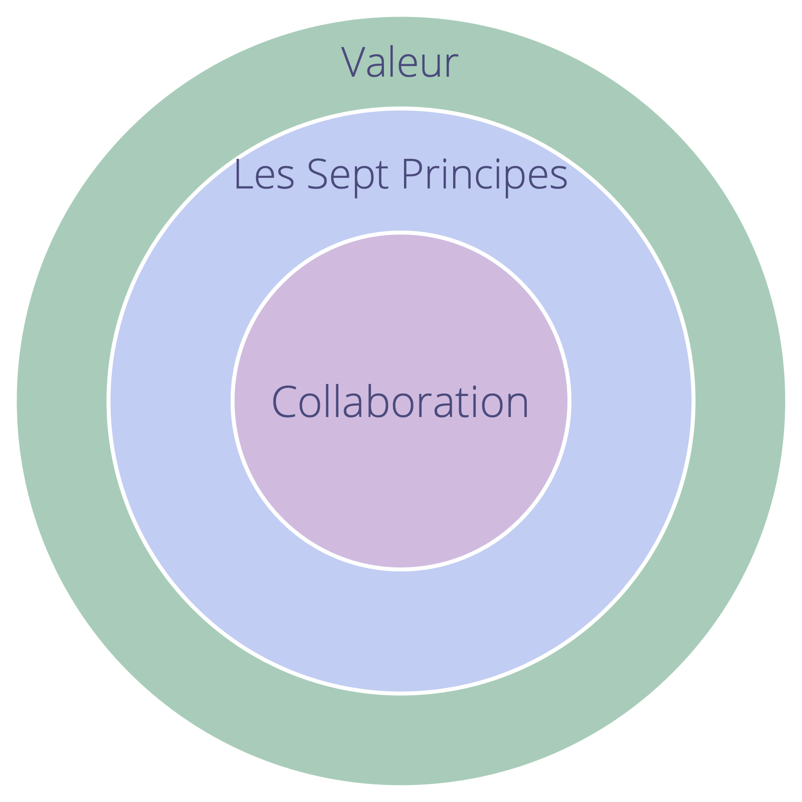
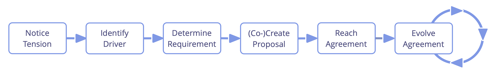

# Introduction

## Sociocratie 3.0 - Un guide pratique pour développer des organisations agiles et résilientes

### Collaboration efficace à n'importe quelle échelle

La Sociocratie 3.0 — **ou “S3”** — est un guide pratique pour développer des organisations agiles et résilientes de toute taille, des petites start-ups jusqu'aux grands réseaux internationaux, et la collaboration nationale inter-services. Elle fournit une manière cohérente de renforcer l'intégrité organisationnelle et **de développer une mentalité sociocratique et agile**.

S3 vous apporte une vaste collection de consignes et de pratiques qui ont démontré leur utilité pour les organisations en **améliorant leur performance, leur alignement interne, le sentiment d'accomplissement et le bien-être**.

Ces pratiques vous aident à découvrir comment atteindre au mieux vos objectifs et à naviguer dans la complexité, une étape à la fois, **sans nécessiter de réorganisation radicale soudaine ni de planifier une initiative de changement à long terme**:

Démarrez simplement où le besoin est le plus important, sélectionnez une ou des pratiques à essayer, **avancez à votre rythme** et développez vos compétences au fur et à mesure.

**Peu importe votre position dans l'organisation**, vous découvrirez des pratiques pertinentes et utiles pour vous-mêmes.

La Sociocratie 3.0 est :

- **flexible:** des pratiques adaptables, indépendantes et se renforçant mutuellement, pour vous aider dans tous les aspects de la collaboration
- **basée sur des principes :** sept principes fondamentaux de collaboration agile et sociocratique se reflètent dans chaque pratique
- **libre de droits :** sous licence Creative Commons Free Culture License

### Qu'est-ce que j'y gagne ?

**La Sociocratie 3.0 :**

- fournit une collection cohérente de pratiques de collaboration basées sur des principes, pour naviguer dans la complexité, s'adapter et évoluer.
- aide les personnes à traiter de manière incrémentale les informations disponibles en améliorant continuellement les processus de travail, les produits, les services et les compétences.
- aide les organisations à utiliser au mieux les talents déjà présents et à développer des structures organisationnelles flexibles pour aligner le flux d’informations et d’influence avec le flux de valeur.
- fournit une approche organique et itérative du changement qui répond aux organisations où elles sont et les aide à progresser à leur propre rythme et en fonction de leur contexte et de leurs besoins uniques.
- s’appuie sur l’intelligence collective du groupe.
- facilite le développement de stratégies qui sont « suffisamment bonnes pour l’instant » et « suffisamment sûres pour essayer ».
- favorise la responsabilité et le sens de l'engagement.
- est un mécanisme de transformation à la fois pour les individus et pour l'ensemble de l'organisation.

**La Sociocratie 3.0 peut être appliquée dans :**

- les startups
- les petites et moyennes entreprises
- les grands réseaux d'organisations internationales
- les familles
- les organisations financées par des investisseurs
- des communautés
- et d'autres…

### Contenu de ce guide

- un petit historique et un bref aperçu de certains concepts de base derrière S3
- une description de toutes les pratiques S3
- une annexe 
    - historique des modifications
    - des infos sur les auteurs et des remerciements
    - la licence
    - l'engagement intentionnel des praticiens et des enseignants de la Sociocratie 3.0
    - un glossaire et un index

## Influences et historique de la Sociocratie 3.0

La signification littérale du terme **sociocratie** est "la règle des compagnons": *socio* — du latin *socius* — qui signifie "companion", ou "ami", et le suffixe *-cracy* — du grec ancien κράτος (krátos) — qui signifie "puissance", ou "règle".

Le mot sociocratie peut être retracé en 1851, quand **Auguste Comte** a suggéré d'appliquer une approche scientifique à la société: les États seraient régis par un corps de scientifiques qui sont des experts de la société (qu'il a appelé "sociologues"). Selon lui, ce futur, bien qu'il n'ait pas encore été réalisable, serait inévitable.

Quelques décennies plus tard, **Lester Frank Ward**, a utilisé le mot "sociocratie" pour décrire la loi des personnes ayant des relations entre elles. Au lieu d’avoir des sociologues au centre, il voulait donner plus de pouvoir et de responsabilité à l’individu, il imaginait les sociologues dans un rôle de chercheurs et de consultant.

En 1926, l'éducateur réformiste néerlandais et Quaker **Kees Boeke**, a établi une école résidentielle basée sur le principe de consentement. Le personnel et les élèves étaient traités comme des participants égaux à la gouvernance de l'école, toutes les décisions devaient être acceptables par tous. Il a construit cette version de la sociocratie sur les principes et les pratiques de Quaker, et décrit la sociocratie comme une évolution de la démocratie dans son essai de 1945 "La démocratie comme elle pourrait être".

**Gerard Endenburg**, également un Quaker et un étudiant dans l'école de Boeke, voulaient appliquer la sociocratie dans l'entreprise de sa famille, Endenburg Elektrotechniek. Il a créé et developpé la *méthode sociocratique d’organisation par cercles (SCM)* (devenant plus tard la “méthode sociocratique”), en intégrant la forme de sociocratie de Boeke avec l'ingénierie et le cybernétique. En 1978, Endenburg a fondé le Centre Sociocratique d'Utrecht (qui est maintenant le Centre Sociocratique de Rotterdam) comme un moyen de promouvoir la sociocratie aux Pays-Bas et au-delà. Depuis 1994, les organisations néerlandaises utilisant la SCM sont exemptées de l'obligation légale d'avoir un comité d’entreprise.

À la fin des années 1990 et au début des années 2000, plusieurs personnes non-néerlandaises ont découvert la sociocratie, mais ce n'est qu'en 2007 que **Sharon Villines et John Buck** ont lancé leur livre, "We the People", que la sociocratie est devenue largement accessible au monde anglophone, et qu'elle a commencé à migrer dans plusieurs autres langues.

La Sociocratie s'est avérée efficace pour de nombreuses organisations et communautés du monde entier, mais elle tarde encore à devenir virale.

En 2014 **James Priest et Bernhard Bockelbrink** se sont réunis pour co-créer un corps de ressources d'apprentissage sous licence Creative Commons, synthétisant les idées de la Sociocratie, de l’Agile et du Lean. Ils ont découvert que les organisations de toutes tailles ont besoin d’un menu flexible de pratiques et de structures – adaptées à leur contexte spécifique – qui permettent l’évolution d’une mentalité sociocratique et agile pour obtenir une plus grande efficacité, de l’alignement, le sentiment d’accomplissement et le bien-être. La première version de **Sociocratie 3.0.** a été lancée en mars 2015.

**Liliana David** rejoint l'équipe rapidement après et ensemble, ils collaborent régulièrement pour développer le cadre et le site web.

Ensemble, ils cherchent à rendre S3 disponible et applicable au plus grand nombre d'organisations possible et fournissent des ressources sous une licence **Creative Commons Free Culture License** pour les gens qui veulent apprendre, appliquer et parler aux autres de la Sociocratie 3.0.

### Le Mouvement Sociocratie 3.0

L’intérêt pour la Sociocratie 3.0 augmente, car il y a une communauté de personnes provenant de divers milieux qui se développe rapidement — des consultants pionniers, des coaches, des facilitateurs d’apprentissage et des personnes qui appliquent S3 dans leurs divers contextes — qui partagent l’appréciation du potentiel transformationnel de la Sociocratie 3.0 pour aider les organisations et leurs membres à prospérer. Beaucoup consacrent une part de leur temps à expérimenter et échanger sur S3, et collaborent pour apprendre les uns des autres et documenter leurs expériences afin de nourrir le développement et l’évolution du cadre et de ses applications diverses.

## Pourquoi la Sociocratie 3.0?

La Sociocratie en tant que forme de gouvernance est évoquée depuis 1851. Par la suite, elle a été développée et adaptée par de nombreuses personnes et organisations différentes, dont Gerard Endenburg, The Sociocracy Group (TSG) et Brian Robertson (HolacracyOne).

Pourtant, en dehors des Pays-Bas, la sociocratie est restée jusqu'à récemment largement inconnue.

Nous adorons la sociocratie parce que nous voyons des organisations et leurs membres prospérer lorsqu'ils utilisent ses éléments pour enrichir ou transformer leurs façons de faire courantes.

Nous aimons aussi l'agile, le lean, Kanban, The Core Protocols, La CNV, et bien d'autres idées encore. Nous pensons que le monde sera un meilleur endroit, à mesure que plus d'organisations apprendront à puiser dans cette corne d'abondance de pratiques fantastiques qui émergent aujourd'hui dans le monde, et qu'elles apprendront à les intégrer avec ce qu'elles savent déjà.

Nous avons donc décidé de consacrer une partie de notre temps à développer et à faire évoluer la Sociocratie, en l'intégrant avec beaucoup de ces autres idées puissantes, de la rendre disponible et applicable au plus grand nombre d'organisations possible.

À cette fin, nous croyons en l'importance d'avoir une identité forte, d'une manière radicalement différente de distribuer et d'adapter la *méthode sociocratique d'organisation par cercles* afin d'améliorer son applicabilité.

### Le nom

Le nom «*Sociocratie 3.0*» montre à la fois le respect des origines et un pas en avant significatif.

Il permet également d'éviter la perception que nous dénaturons *méthode sociocratique d'organisation par cercles* (SCM) telle que promue par The Sociocracy Group.

### Le nouveau modèle de distribution

*Sociocratie 3.0* utilise un modèle non centralisé de distribution. Il s'agit d'un changement de paradigme dans la manière dont la sociocratie est apportée aux gens et aux organisations, et qui parle à de nombreuses personne.

Nous soutenons la distribution « virale » par deux stratégies clés :

* **La Sociocratie 3.0 est ouverte :** Nous voulons encourager la croissance d’un écosystème dynamique de mises en applications et de variantes de la sociocratie, où les gens partagent et discutent de leurs points de vue et des adaptations qu’ils apportent dans leur contexte spécifique. À cette fin, la Sociocratie 3.0 met l’accent sur la communication des principes sous-jacents et invite explicitement la créativité de chacun à mélanger, étendre et adapter les choses à leurs besoins.
* **La Sociocratie 3.0 est libre :** Pour éliminer la barrière à l'entrée pour les personnes et les organisations, nous fournissons des ressources gratuites sous la licence * Creative Commons Free Culture License* afin d'apprendre, pratiquer et enseigner *Sociocratie 3.0*. Tout le monde peut utiliser nos ressources sans notre permission explicite, même dans un contexte commercial, ou comme base pour construire ses propres ressources [^tant qu'elles partagent leurs nouvelles ressources sous la même licence]. Nous encourageons d'autres organisations, des consultants, des coachs, des facilitateurs d'apprentissage et des formateurs à suivre notre exemple et à libérer leurs ressources également.

### L'évolution de la méthode de sociocratique d'organisation par cercles

Il nous faut sans doute préciser ceci explicitement : la Sociocratie 3.0 n'est pas spécifiquement destinée à la communauté existante des personnes qui explorent la *méthode sociocratique d'organisation en cercles*, ni au Sociocracy Group (TSG). La *méthode sociocratique d'organisation par cercles* (SCM) est déjà bien développée et beaucoup de personnes semblent en être globalement satisfaites.

Pourtant, d'après notre expérience directe, même pour les organisations qui ont entendu parler de sociocratie, il existe de nombreux obstacles pour s'y investir. Avec *Sociocratie 3.0* nous travaillons activement à adresser et à éliminer qui s'y oppose.

#### Réduire le risque et la résistance

La *Sociocratie 3.0* prends des organisations où elles sont et les emmène dans un voyage d’amélioration continue. Il n’y a pas de changement radical ni de réorganisation. La *Sociocratie 3.0* fournit une collection de pratiques indépendantes et basées sur des principes qu’une organisation peut amener une à une pour devenir plus efficace. Tous les modèles sont liés à un ensemble de principes fondamentaux, de sorte qu'ils peuvent facilement être adaptés au contexte.

#### Passer d'une concentration sur l'objectif vers le besoin

La *Sociocratie 3.0* déplace la focale de la vision, la mission, les objectifs ou le but, vers la source de motivation, et aligne l’organisation vers la découverte et la résolution de ce dont elle a besoin. Les organisations qui sont déjà centrées sur les besoins, portées par des valeurs ou centrées sur leurs clients trouvent ceci immédiatement accessible.

En *Sociocratie 3.0*, le but est implicite dans tous les cas – pour faire circuler la valeur vers les intentions de l’organisation.

#### Réduite aux fondamentaux

En regardant les normes, la *méthode sociocratique d'organisation par cercles* peut sembler grande et effrayante. En se concentrant sur les fondamentaux seulement, *Sociocratie 3.0* offre un cadre léger pour s’adapter et d'où construire selon les besoins.

Cela ne veut pas dire que c’est tout simple : choisir de puiser dans les pratiques *Sociocratie 3.0* nécessite un investissement dans l’apprentissage et le de-apprentissage. C’est pourquoi il est important de ne puiser que ce dont vous avez besoin, car il n’est pas utile de changer les choses si ce que vous faites est déjà assez bon.

#### Intégration avec la pensée Agile et Lean

La *méthode sociocratique d'organisation par cercles* est une méthode « vide »en ce qui concerne les opérations la création d'une culture de collaboration étroite. De nombreuses organisations mettent déjà en œuvre ou font preuve de préférence pour la pensée lean et agile pour leurs opérations et la collaboration. Nous pensons que c’est une idée formidable, donc la *Sociocratie 3.0* est conçue pour une adoption facile dans les organisations lean et agiles.

#### Une nouvelle façon de développer la structure organisationnelle

La structure organisationnelle selon la *méthode sociocratique d'organisation par cercles* est modelée sur une hiérarchie de domaines. Nous constatons une émergence croissante d’environnements collaboratifs multi-parties prenantes et la nécessité d’une plus grande variété de modèles de structure organisationnelle. L'évolution de la structure organisationnelle se produit naturellement lorsque le flux d'information et l'influence au sein d'une organisation est graduellement alignée sur le flux de valeur. La *Sociocratie 3.0* fournit une variété de modèles de structures qui peuvent être combinées pour faire évoluer la structure selon le besoin et de manière flexible.

*James Priest, Bernhard Bockelbrink, Liliana David*

## Les concepts de base

Avant d'aller plus loin, prenez le temps de vous familiariser avec des concepts de base derrière la S3 :

- Qu'est-ce qu'une pratique ?
- Les sept principes
- Comprendre les organisations : 
    - Intentions, valeur et gaspillage
    - Domaines, délégation et responsabilité
    - Gouvernance et opérations

Si vous ne comprenez pas l'un de ces termes, consultez notre glossaire à la fin.

### Pratiques

_Une **pratique** est un modèle pour traverser correctement un contexte particulier._

- Les pratiques S3 sont découvertes en observant la manière dont les organisations répondent aux problèmes et réagissent aux opportunités
- Les pratiques S3 peuvent être développées et adaptées pour convenir à différents contextes
- les pratiques sont regroupées en 10 catégories

### Les sept principes

La Sociocratie est fondée sur sept principes qui façonnent la culture organisationnelle. Puisque les sept principes se reflètent dans toutes les pratiques, la compréhension de ces principes est utile pour adopter et primordiale pour adapter les pratiques de Sociocratie 3.0.

La pratique de la Sociocratie 3.0 aide les gens à apprécier la valeur essentielle que ces principes fondamentaux apportent, tant aux individus qu'aux organisations.

**Le Principe d'Efficacité:** *Allouer du temps seulement à ce qui vous rapproche d'atteindre vos objectifs.*

**Le Principe de Consentement:** *Lever, chercher et résoudre les objections aux décisions et aux actions.*

**Le Principe de l'Empirisme:** *Testez toutes les hypothèses grâce à l'expérimentation et l'évaluation continue.*

**Le Principe de l'Amélioration Continue:** *Évoluer par incréments pour faciliter un apprentissage empirique constant.*

**Le Principe d'Equivalence:** *Impliquer les personnes impactées dans les prises de décisions et les évolutions.*

**Le Principe de Transparence:** *Rendre toutes les informations accessibles à tous les membres d'une organisation, à moins qu'il faille préserver leur confidentialité.*

**Le Principe Responsabilité:** *Agir lorsque nécessaire, faire ce qu'on s'est engagé de faire et assumer la responsabilité de l'avancement de l'organisation.*

#### Le Principe de Responsabilité

*Agir lorsque nécessaire, faire ce qu'on s'est engagé de faire et assumer la responsabilité de l'avancement de l'organisation.*

Agissez dans le cadre des contraintes de toutes ententes régissant les domaines dont vous êtes responsable, y compris l'organisation elle-même, les équipes dont vous faites partie et les rôles que vous portez.

Chaque membre de l'organisation est responsable de répondre efficacement aux intentions organisationnelles, tant pour faire le travail que pour assurer (soutenir) une collaboration efficace.

Les individus sont également responsables de leur travail, de leur apprentissage et de leur développement, et de se soutenir mutuellement.

Tout le monde dans une organisation est responsable de l'alignement des activités avec les valeurs organisationnelles.

### Comprendre les organisations

#### Intentions

_Un **moteur** est la motivation d'un groupe ou d'une personne pour répondre à une situation particulière._

Intentions :

- peuvent être utilisés pour formuler des buts, objectifs, aspirations, une mission, une vision, une raison d’être
- peuvent changer au fil du temps

##### Intentions, valeur et gaspillage

_La **valeur** est l'importance ou l'utilité d'un élément en relation à un moteur._

_Le **gaspillage** est tout ce qui n'est pas nécessaire pour - ou qui s'oppose - à une réponse (plus) efficace à une intention._

En adoptant les concepts de valeur et de gaspillage, de nombreuses pratiques et idées issues de la **production lean** et du **développement de logiciel lean** peuvent être utilisées par les organisations introduisant les patterns S3:

- cartographie de la chaîne de valeur
- différentes stratégies pour éliminer le gaspillage
- la méthode Kanban

#### Domaines

_Un **domaine** est une zone d'influence, activité et prise de décisions distincte au sein d'une organisation._

Tous les domaines se situent dans le domaine général d'une organisation. Ils peuvent se chevaucher et/ou être pleinement inclus au sein d'autres domaines.

Les domaines sont délégués à des personnes (ex: à une unité, un département, une équipe ou des individus), qui prennent la responsabilité du domaine, et agissent selon les contraintes qu'il impose en terme d'influence et d'autonomie.

##### Déléguer les domaines

Ceux qui délèguent un domaine (les *déléguants*) conservent néanmoins la responsabilité de ce domaine, allouent des **ressources** et définissent souvent :

- le **besoin organisationnel** auquel le domaine supposé répondre
- des **responsabilités clés** (les livrables clés, tout risque critique à gérer, tout autre travail essentiel et les prises de décision étant délégués)
- des **contraintes sur l'autonomie et l'influence** pour ceux à qui sont délégués le domaine (les *délégués*), souvent liées à l'organisation elle-même (dépendances, implication du déléguant, reporting, etc.)

##### Intentions et domaines

Il est également possible de comprendre un domaine par rapport aux intentions organisationnelles :

- l' **intention primaire** - l'intention principale à laquelle les gens qui s'occupent de ce domaine (les *délégués*) répondent
- l'ensemble des sous-intentions qu'il peut être bénéfique pour l'organisation d'adresser pour répondre à l'intention primaire, ce qui comprend : 
    - les **responsabilités clés** (n'importe quelle intention dérivant directement de l'intention primaire)
    - les intentions pour les **contraintes du domaine** (qui se rapportent généralement au contexte de l'organisation entière)

### Gouvernance et opérations

S3 cherche à permettre la productivité en laissant les gens libres de faire et de décider autant que possible par eux-même, tout en assurant la cohérence de la collaboration pour une organisation efficace et qui réussit.

Une plus grande autonomie des individus et des équipes nécessite des ententes clairs (c'est-à-dire des lignes directrices et des contraintes) qui permettent une collaboration harmonieuse entre ces équipes et ces individus, et qui soutiennent la réalisation d'objectifs à long terme et à court terme. Des évaluations périodiques et l'évolution progressive des ententes assurent qu'elles restent adaptées à la finalité.

Bien qu’une décision ayant des conséquences à court terme puisse facilement être modifiée sur-le-champ, créer des ententes plus conséquentes qui contraignent le comportement et l’activité des gens, bénéficie souvent d’un _processus de décision_ plus participatif et plus délibéré.

Te telle ententes doivent être documentées, à la fois pour se les rappeler et pour permettre une _évaluation_ efficace, et doivent être communiquées aux personnes impactées (qui sont idéalement aussi _impliquées dans la création et l'évolution_ de ces ententes).

Il est donc utile de distinguer deux catégories d’activités dans une organisation, l'une que nous appelons la gouvernance, et l’autre que nous appelons les opérations :

_La **Gouvernance** dans une organisation (ou un de ses domaines) est l'acte de fixer des objectifs, et de prendre et faire évoluer des décisions qui guident les gens à les atteindre._

_Les **Opérations** consistent à faire le travail et organiser les activités quotidiennes selon les contraintes définies par la gouvernance._

Pour chaque domaine dans une organisation il y a un *instance gouvernante*: les personnes ayant un mandat de faire et d'évoluer des accords qui régissent la manière dont les personnes qui font le travail dans ce domaine créent de la valeur.

Il existe de nombreuses façons de distribuer le travail et la gouvernance. Parfois, l’instance gouvernante est une personne unique, par exemple dans le cas d’un chef d’équipe, et parfois c’est un groupe de personnes, par exemple dans un cercle où tous les membres partagent la responsabilité de la gouvernance selon les contraintes du domaine.

**Les décisions de gouvernance** fixent des contraintes sur l'activité et guident les décisions futures.

Ceci inclut :

- définir les domaines
- déléguer l'influence aux gens
- allouer des ressources et des capacités
- spécifier les livrables et prioriser leur livraison.

Les décisions de gouvernance peuvent être prises à tout moment et à n'importe quel endroit, pas seulement dans des réunions spécifiques, bien qu'une _réunion régulière pour la création et l'évolution des ententes_ soit souvent une bonne idée.

#### Concepts associés

**Auto-gouvernance**: Ensemble de personnes se gouvernant elles-mêmes selon les contraintes d'un domaine.

**Semi-autonomie**: L'autonomie des personnes à créer de la valeur dans leur domaine, contrainte par leurs propres décisions de gouvernance, et les objections (y compris celles du déléguant et des représentants).

**Auto-Organisation:** Toute activité ou processus à travers lequel les gens organisent leur travail quotidien sans l'influence d'un agent externe, et selon les contraintes définies par la gouvernance. Dans toute organisation ou équipe, l'auto-organisation et l'influence externe coexistent.

Selon les contraintes imposées par le déléguant, les équipes ont plus ou moins de l'autorisation de mener la gouvernance et de décider de comment elles organisent leurs opérations, et sont par conséquent plus ou moins auto-gouvernées et auto-organisées.

# Les Pratiques

## Co-création et évolution 

###  Pattern 1.1: Répondre aux intentions organosationnelles

**Clarifiez les intentions organisationnelles (c'est-à-dire ce qui se passe et ce qui est nécessaire pour l'organisation) et répondez au besoin.**

Les réponses possibles à des intentions organisationnelle sont :

- l’action directe (opérations)
- organiser comment le travail sera fait 
- prendre des décisions de gouvernance

La réponse à une intention organisationnelle est généralement traitée comme une expérience évaluée et améliorée au fil du temps.

#### Qualifier les intentions organisationnelles

Une intention est le motif d’une personne ou d’un groupe à répondre à une situation particulière. Une intention est considérée comme une **intention organisationnelle** si y répondre aiderait l’organisation à générer de la valeur, à éliminer du gaspillage ou à éviter des dégâts.

Une façon simple de se déterminer si une intention tombe ou non dans le domaine d'une organisation est de vérifier :

*Est-ce que cela aiderait l'organisation si nous répondions à cette intention? Ou serait-ce que cela nous nuirait si nous ne le faisons pas?*

###  Pattern 1.2: Naviguer par tension

**Prêtez attention aux tensions que vous éprouvez par rapport à l'organisation, enquêtez sur leur cause et transmettez toute intention organisationnelle que vous découvrez aux personnes responsables du domaine approprié.**

**Les défis et les opportunités** pour une organisation sont révélés par des gens qui expriment les raisons pour lesquelles ils éprouvent des tensions.

**Note:** Dans ce contexte, une *tension* est une expérience personnelle: un signe de dissonance entre sa perception d'une situation, et ses attentes (ou préférences).

Pour **découvrir les intentions**, recherchez ce qui stimule la tension, et décrivez ce qui se passe et ce qui est nécessaire. Parfois, une question révèle des idées fausses et la tension disparaît.

###  Pattern 1.3: Décrire les intentions organisationnelles

**Décrivez les intentions pour mieux les comprendre, les communiquer et s'en souvenir.**

Décrivez les intentions peut être fait par un groupe ou par un individu. Selon leur perspective, ils peuvent décider d'expliquer une intention comme un **problème** à résoudre ou une **opportunité** à saisir.

Un moyen simple de décrire une intention est d'expliquer :

- **Ce qui se passe...:** 
    - la **situation actuelle**
    - l'**effet** de cette situation sur l'organisation
- ...et **ce qui est nécessaire:** 
    - le **besoin** de l'organisation par rapport à cette situation
    - l'**impact** de répondre à ce besoin

Créez un résumé bref mais complet contenant juste assez d'informations pour communiquer clairement la nécessité d'une action ou d'une décision.

#### Exemple:

> *"La cuisine est en désordre: il n'y a pas de tasses propres, l'évier est plein de vaisselle et il n'est pas possible de se faire rapidement un café et se remettre directement au travail. Nous avons besoin d'une cuisine dans un état utilisable pour rester concentrés sur notre travail."*

#### 1. Situation actuelle

> *"La cuisine est en désordre: il n'y a pas de tasses propres, l'évier est plein..."*

Décrire la situation actuelle:

- Capturez brièvement les éléments essentiels de ce qui se passe et, si nécessaire, le contexte dans lequel cela se produit.
- Soyez objectif - décrivez les observations et évitez de juger.

#### 2. Effet

> *"... et il n'est pas possible de se faire rapidement un café et se remettre directement au travail."*

Expliquer l'effet de cette situation sur l'organisation:

- Clarifiez **pourquoi** la situation nécessite de l'attention : comment cela affecte-t-il l'organisation ? 
- Précisez si les effets sont actuels ou anticipés. 
- Expliquez les défis, les pertes, les opportunités ou les gains. 

#### 3. Besoin

> *"Nous avons besoin d'une cuisine dans un état utilisable..."*

Expliquez le besoin de l'organisation par rapport à cette situation :

- Un **besoin d'une organisation** est tout ce qu'une équipe (ou une personne) nécessite pour s'occuper efficacement d'un domaine. 
- Soyez précis sur qui a ce besoin ("nous avons besoin", "ils ont besoin", "j'ai besoin").
- En cas de désaccord sur le besoin, il est utile de prendre du recul par rapport à une solution particulière et se concentrer sur ce qui manque à l'organisation dans cette situation.

#### 4. Impact

> *"...pour rester concentrés sur notre travail".*

Décrivez l'impact de répondre à ce besoin :

- Expliquez le résultat attendu, les bénéfices potentiels ou les opportunités.
- L’impact peut être évident ou implicite, en particulier lorsque les effets de la situation actuelle sont déjà décrits.

#### Résumer l'intention

Visez une ou deux phrases, afin que l'information soit facile à retenir et à traiter.

En plus du résumé, plus de détails sur l'intention peuvent être conservés dans le registre.

#### Évaluer les intentions

Assurez-vous de revoir régulièrement les intentions, pour approfondir votre compréhension de ce qui se passe et qui est nécessaire.

Quelques questions utiles pour une évaluation :

- La description de la situation est-elle (toujours) correcte ?
- Avons-nous encore les mêmes besoins face à la situation?
- La tension est-elle toujours dans notre domaine?
- L'intention est-elle toujours pertinente ?

###  Pattern 1.4: Prise de décision par consentement

**Un processus de groupe (facilité) pour la prise de décision : inviter les participants à lever des objections et considérer les informations et connaissances révélées pour faire évoluer davantage les propositions ou les ententes existantes.**

Les propositions deviennent des ententes quand elles sont considérées *suffisamment bonnes pour l'instant et suffisamment sûres à essayer* jusqu'à la prochaine évaluation.

Des objections non résolues empêchent les propositions de devenir des ententes.

Taire des objections peut nuire aux objectifs d’une équipe ou d’une organisation.

#### Contrat de consentement implicite

1. En l'absence d'objections à un accord, je m’engage à le respecter au mieux de ma capacité.
2. J’accepte de faire part de mes objections lorsque j'en prendrai conscience.

###  Pattern 1.5: Objection

_Une **objection** est un argument démontrant (ou révélant) comment une entente ou une activité (proposée) peut entraîner des conséquences imprévues, ou qu'il existe des moyens intéressants de l'améliorer._

Les objections apportent des informations sur **des conséquences non désirées**, ou sur **des façons viables d'apporter des améliorations**.

Il est de la responsabilité des individus de soulever des objections potentielles à des propositions, des décisions, des ententes existantes ou des activités.

Ne pas exprimer les objections peut nuire à la capacité des individus, des groupes ou de l'organisation de répondre aux intentions organisationnelles.

Pouvoir soulever des objections *potentielles* à tout moment signifie que les décisions n'ont besoin que *d'être suffisantes à l'instant présent et d'être juste assez sûres pour les essayer*.

Les responsables de l'activité ou de l'accord (ou proposition) en question sont tenus d' *examiner les arguments soulevés et d'adresser les objections.*

Lorsque vous cherchez des objections potentielles, considérez :

- pourquoi le résultat prévu ne serait pas (entièrement) atteint : **efficacité**
- pourquoi il serait inutile de procéder comme proposé (ou convenu précédemment): **efficience**
- les conséquences négatives que quelque chose aurait par ailleurs (dans le même domaine, dans l'ensemble de l'organisation, ou au-delà): **effets secondaires**

Les informations apportées par les objections peuvent être utilisées pour améliorer :

- les actions en cours et planifiées
- la façon dont les gens exécutent les décisions
- les ententes existantes
- les propositions
- la compréhension commune des intentions

#### Qualifier les objections

Tous les arguments soulevés ne sont pas des objections. Il convient de distinguer les objections, qui contiennent toujours des informations utiles, des arguments basés seulement sur des suppositions ou des préférences.

Pour savoir si un argument est une objection, dans un contexte de groupe, un facilitateur pourrait demander :

*« Pensez-vous que cet argument est une objection ? »*

Si personne ne conteste l'argument, c'est habituellement une objection. Sinon, essayez de découvrir la véritable objection réelle ou de mettre en évidence toute fausse idée.

#### Comprendre les objections

Quelques questions utiles :

- En quoi l'argument est-il relatif à cette proposition ou à cet accord en particulier ?
- L'argument indique-t-il comment telle **activité ou tel accord (proposé ou en vigueur)**: 
    - empêche de répondre aux intentions organisationnelles?
    - peut être amélioré immédiatement ?
    - empêche ou réduit la contribution de quelqu'un envers une intention ?
    - est en conflit avec les valeurs de l'organisation ?
    - est considéré comme trop 'risqué' pour essayer?

#### Préoccupations

_Un **préoccupation** est une hypothèse selon laquelle faire quelque chose (même en l'absence d'objections) **pourrait** se présenter comme une réponse (plus) efficace à une intention organisationnelle._

Dans la _Prise de Décision par Consentement_, les préoccupations peuvent suggérer des moyens de faire avancer les ententes (y compris leurs critères et fréquence d'évaluation).

Faites part de vos préoccupations si vous les considérez importantes et proposez des critères d'évaluation correspondant.

Si vous n'êtes pas sûr d'avoir une objection ou une préoccupation, vérifiez avec les autres si ils pensent qu'elle est bien une objection recevable.

###  Pattern 1.6: Intégrer les objections

**Intégrer les objections une à la fois en utilisant les informations qu'elles contiennent et développer les amendements.**

Choisissez une option pour intégrer l'objection qui semble la plus prometteuse et, si cela échoue, choisissez en simplement une autre. Chaque tentative vous aidera à mieux comprendre les informations que contient l'objection et à rapprocher le groupe de proposer un amendement qui intègrera l'objection.

Souvent, demander à la personne qui fait l'objection de proposer un amendement est un bon point de départ.

Généralement, il est plus efficace de **prendre une objection à la fois**, d'intégrer toutes les objections à un amendement proposé, puis de continuer avec la prochaine objection.

###  Pattern 1.7: Évaluer et développer les ententes

**Développer continuellement l'ensemble des ententes et éliminer le gaspillage.**

L'examen régulier des ententes est une pratique essentielle pour une organisation apprenante :

- adapter les ententes à un contexte changeant
- intégrer l'apprentissage pour les rendre plus efficaces

Assurez-vous que toutes les ententes ont une date d'évaluation appropriée.

Évaluer une entente peut être aussi simple que de vérifier qu'elle est toujours pertinente, et qu'il n'y a pas d'objection à la conserver en l'état.

Les ententes sont souvent examinées dans des _réunions de gouvernance_, cependant il est parfois plus performant de planifier une session dédiée.

Ajustez la fréquence d'examen au besoin et examinez tôt si nécessaire.

Les éléments de cette pratique peuvent également être utilisés par des individus pour évaluer leurs propres décisions.

#### Format court

- *Comment cette entente nous a-t-elle aidée ?*
- *Y a-t-il une quelconque raison d'abandonner cette entente?*
- *Comment cette entente peut-elle être améliorée ?*
- Se mettre d'accord sur la prochaine date d'évaluation.

#### Format long

Préparation :

- Planifier l'évaluation.
- S'assurer que toutes les informations nécessaires sont disponibles.

Suivi :

- Se mettre d'accord sur la prochaine date d'évaluation.
- Documenter les décisions et les tâches, et les partager avec les personnes concernées.
- Prendre en considération les effets de toute entente connexe.

###  Pattern 1.8: Les personnes concernées décident

**Impliquez les personnes dans les décisions qui les concernent, pour maintenir équivalence et responsabilité, et pour augmenter la quantité d'informations disponibles sur le sujet.**

Pour de plus grands groupes :

- facilitez le processus en plusieurs étapes et créez des sous-groupes, qui sélectionneront des délégués
- utilisez un outil en ligne et mener un processus asynchrone, _limité dans le temps_ et par étapes

Pensez également à inclure les personnes impactées dans l'évaluation et l'évolution des décisions.

###  Pattern 1.9: Co-créer des propositions

**Réunir les gens pour co-créer des propositions en réponse aux intentions organisationnelles : exploiter l’intelligence collective, bâtir un sentiment d'appropriation et accroître l’engagement et la responsabilité.**

Il existe de nombreuses façons de co-créer des propositions. Elles suivent généralement un modèle similaire :

1. Se mettre d'accord sur une intention (ou un problème / une opportunité / un besoin)
2. Explorer le sujet et comprendre les contraintes
3. Générer des idées
4. Concevoir une proposition (souvent fait par un groupe plus restreint)

Une façon de cocréer des propositions est d'utiliser la pratique _Élaboration d'une proposition_ de S3.

Pour les étapes 2 et 3, inspirez-vous des techniques classiques de facilitation de groupe ou des ateliers de Design Thinking.

En plus d'un atelier en face à face, vous pouvez adapter ce processus pour fonctionner dans des réunions en ligne. Vous pouvez même l'utiliser de façon asynchrone (et pendant une longue période) pour inclure de nombreuses personnes.

###  Pattern 1.10: Élaboration d'une proposition

**Un processus de groupe (facilité) pour co-créer une réponse à une intention.**

- s’appuie sur l’intelligence collective et la diversité des perspectives au sein d’un groupe
- implique les participants dans la co-création des ententes
- encourage la responsabilisation et le sens de l'appropriation

L'*élaboration d'une proposition* peut également être utilisé par un individu.

#### Étapes d'élaboration d'une proposition

**Consentir à l'intention:** Présenter brièvement l'intention. *Est-il pertinent pour nous de répondre à cette intention? Y a-t-il des amendements essentiels à ce qui a été présenté?*

**Approfondir la compréhension collective de l'intention** : recueillir les questions essentielles à une meilleure compréhension de l'intention.

**Récolter les remarques** sous forme de questions évoquant de possibles solutions. Les questions révèlent des contraintes (questions informatives) ou des possibilités (questions génératives).

**Répondre** à toutes les questions demandant des informations, si possible.

**Prioriser** les remarques.

**Récolter les idées** comme constituants possibles d'une proposition.

**Rédiger une proposition** pour répondre à l'intention, en prenant en compte les idées créatives et les informations récoltées jusqu'ici. En général, c'est un groupe plus restreint de "rédacteurs" qui s'occupe de cette étape.

#### Choisir les rédacteurs

Considérez :

- qui devrait y être ?
- qui veut en être ?
- qui d'autre pourrait apporter une contribution utile ?
- l'expertise, les points de vue externes, et l'inspiration

Deux ou trois rédacteurs suffisent généralement. Vérifiez qu'il n'y ait pas d'objections au(x) rédacteur(s) proposé(s).

###  Pattern 1.11: Sélections des rôles

**Un processus de groupe pour sélectionner une personne pour un rôle sur la force de la raison.**

Au lieu de simplement affecter des personnes aux _rôles_, ou de faire un choix basé uniquement sur la majorité, utilisez le processus de sélection de rôles pour :

- exploiter l'intelligence collective en entendant et en délibérant sur les raisons de la nomination
- augmenter l'appropriation de la décision
- assurer le soutien des personnes impactées au porteur de rôle.

Une condition préalable au processus de sélection est une _description claire_ du domaine.

#### Sélection de rôles - Étapes

1. **Présenter la description du rôle:** Si possible, envoyez la description de domaine du rôle à l'avance.
2. **Consigner les nominations:** Les participants mettent le nom de leur candidat sur un bout de papier. Les gens peuvent se nominer eux-mêmes, un autre, ou passer.
3. **Raisons pour les nominations:** Chaque personne montre qui elle a proposé et explique pourquoi.
4. **Collecte d'informations:** Les participants partagent ou demandent des informations qui pourraient soutenir le groupe a faire une sélection appropriée.
5. **Changements de nomination:** Vérifiez si quelqu'un veut changer sa candidature à la lumière des raisons et des informations partagées jusqu'à présent, et entendre les raisons de chaque changement.
6. **Proposer un candidat** pour le rôle : Le facilitateur guide le processus pour identifier un candidat adéquat sur la force des raisons entendues, par exemple en : 
    - proposant un candidat lui-même ou en demandant à un membre du groupe
    - invitant (certains) candidats à s'entendre sur qui devrait être proposé
    - invitant le dialogue de groupe pour révéler le candidat le plus solide
7. **Vérifier les objections:** Demandez aux participants (y compris au candidat proposé) de signaler simultanément s'ils ont une objection. 
8. **Adresser et intégrer les objections,** en commençant par n'importe quel candidat proposé. _Les objections peuvent être résolues_ de plusieurs façons, y compris la modification de la description de domaine du rôle ou en nommant quelqu'un d'autre. Lorsque toutes les objections sont résolues, vérifiez à nouveau avec le candidat (final) s'il accepte le rôle.
9. **Célébrer:** Saluez l'entente obtenue et remerciez la personne qui va maintenant porter le rôle.

Pour éviter d'influencer les autres, abstenez-vous d'exprimer un intérêt personnel ou des opinions avant qu'une sélection ne se produise.

Parfois, une sélection de rôles révèle un manque de capacité, une expérience pertinente, des qualités ou des compétences. Un groupe devra alors envisager des candidats extérieurs, reconsidérer les priorités ou trouver une autre façon de s'occuper du domaine.

Cette pratique peut également être utilisée dans toute situation où il est nécessaire de choisir entre plusieurs options.

###  Pattern 1.12: Cartographier les intentions

Un format d'atelier pour identifier une réponse efficace à une situation complexe : organiser des start-ups, des nouveaux projets, s'attaquer aux obstacles majeurs ou aux opportunités, développer une structure organisationnelle pour mieux permettre le flux de valeur.

Un groupe (petit ou grand) identifie et regroupe des intentions, pour ensuite progresser rapidement du concept à l'action dans des équipes plus petites et auto-organisées.

## Se développer entre pairs 

###  Pattern 2.1: Demander un soutien

**Un protocole simple pour apprendre, partager ses compétences et établir des liens, en respectant les tâches et attributions de chacun.**

Demandez à quelqu'un : "*voudrais-tu bien m'aider sur... *?" La personne accepte ou décline avec un simple "*oui*" ou "*non*".

- si la requête est déclinée, la personne qui demande accepte cette réponse sans négocier ou demander pourquoi
- si la requête n'est pas claire, demandez plus d'informations
- si vous acceptez une demande d'aide, soutenez votre pair au mieux de vos capacités

###  Pattern 2.2: Retour de ses pairs

Invitez un pair à vous donner des critiques constructives sur :

- votre performance dans un rôle
- votre participation et votre contribution en général
- tout point particulier qui pourrait vous intéresser

Considérations :

- invitez les pairs à prendre un peu de temps pour se préparer
- recueillez à la fois des **appréciations** et des **suggestions d'améliorations applicables**
- posez des questions pour mieux comprendre le retour, et évitez de le discuter ou de le juger
- décider de vous-même ce que vous allez faire des retours que vous recevez

###  Pattern 2.3: Évaluation par les pairs

**Soutenez-vous mutuellement pour apprendre et vous améliorer dans les rôles et équipes où vous servez.**

Le porteur de rôle - ou l'équipe - mène l'évaluation par les pairs en préparant le processus et en ouvrant le dialogue à chaque étape.

Assurez-vous d'inviter des personnes ayant des perspectives complémentaires à contribuer à l'évaluation, ainsi qu'un _facilitateur_.

Les suggestions d'améliorations peuvent porter sur le développement personnel, la collaboration, une mise à jour de la description du domaine (y compris l'intention) et la stratégie.

###  Pattern 2.4: Plan de développement

**Un plan pour développer des façons plus efficaces de s'occuper d'un domaine, convenu entre déléguant et délégué.**

Le plan de développement peut être créé pour une personne dans un rôle, ou pour une équipe (ex: un département, un _cercle_ ou un _domaine ouvert_).

Le développement prendre la forme d'un raffinement de la description de l'_intention_ et du domaine, en apportant des modifications à stratégie, ou par la mise à jour d'ententes existantes ou la création de nouvelles et des actions spécifiques à prendre, soit dans le domaine du déléguant, soit dans le domaine du délégué.

Un plan de développement (et toutes les recommandations accompagnant les changements aux descriptions du domaine et de l'intention) nécessite le consentement à la fois du délégué et du déléguant.

## Catalyseurs de collaboration 

###  Pattern 3.1: Participation élégante

**Engagez-vous à faire de votre mieux pour agir et interagir de manière à permettre une collaboration efficace.**

*"Mon comportement actuel est-il la meilleure contribution que je puisse apporter à l'efficacité de cette collaboration?"*

Participer avec élégance peut signifier interrompre, objecter ou enfreindre des ententes.

*La participation élégante* est un **engagement individuel** à :

- activement **respecter et suivre toutes les ententes** créées, de la meilleure façon possible, compte tenu des circonstances
- **prendre conscience et comprendre** les besoins individuels et collectifs
- **développer les compétences nécessaires**
- **soutenir les autres** à participer élégamment
- soulever les obstacles et faire des suggestions d'amélioration à l'attention des autres si nécessaire

#### Avantages de la participation élégante

La participation élégante :

- permet la co-création et l'évolution des ententes
- aide à renforcer les équipes
- développe l'auto-responsabilisation, l'intégrité et la confiance
- génère une culture de soutien mutuel et d'étroite collaboration
- est encore plus puissante lorsqu'elle est adoptée à plusieurs

#### Participation élégante : auto-évaluation

- Comment puis-je me soutenir moi-même et les autres pour participer plus élégamment? 
- Quand mes interactions avec les autres sont-elles inutiles ou inefficaces ?
- Quelles ententes ai-je du mal à respecter ? Que puis-je faire pour y remédier ?
- Quelles compétences puis-je développer, qui m'aideraient à participer plus élégamment?
- Que signifierai participer plus élégamment dans : 
    - mes activités quotidiennes ?
    - ma collaboration et mes interactions avec les autres ?
    - l'organisation ? ...nos clients ?
    - le reste de mon environnement ?

###  Pattern 3.2: Adopter les sept principes

**Aligner la collaboration avec les sept principes.**

L'adoption des sept principes réduit le nombre d'ententes explicites requises et guide l'adaptation des pratiques S3 au contexte particulier de l'organisation.

Les valeurs d'une organisation doivent supporter les sept principes.

###  Pattern 3.3: S'entendre sur les valeurs

**Développez volontairement la culture de votre organisation.**

_Les **Valeurs** sont des principes importants qui guident le comportement. Les valeurs définissent une portée d'action et des contraintes éthiques._

- chaque membre apporte ses propres valeurs à une organisation, selon ses expériences personnelles et ses croyances
- une équipe ou une organisation peut **choisir d'adopter collectivement des valeurs** pour guider leur collaboration

Les valeurs donnent des orientations pour déterminer les actions adéquates, même en l'absence d'ententes explicites.

Adopter collectivement un ensemble de valeurs soutient l'efficacité d'une organisation :

- réduit les risques d'**malentendus**
- aide à **aligner** prise de décision et action
- **attire de nouveaux membres, partenaires et clients** qui sont en phase avec l'organisation

Les valeurs choisies sont une entente qui profite d'une**évaluation régulière**.

###  Pattern 3.4: Facilitateur de la gouvernance

**Sélectionnez quelqu'un pour faciliter les réunions de gouvernance.**

Un facilitateur de _gouvernance_ :

- s'assure que _réunions de gouvernance_ restent sur la bonne voie et sont évaluées
- est (habituellement) sélectionné par une équipe parmi ses membres (et pour une durée spécifique)
- se familiarise avec le _backlog de gouvernance_
- invite souvent d'autres à faciliter certains points de l'ordre du jour

En tant que facilitateur de la gouvernance, envisagez d'apprendre et d'utiliser les pratiques S3 suivantes pour gérer efficacement la gouvernance :

- _Rondes_
- _Élaboration d'une proposition_
- _Prise de décision par consentement_
- _Sélections des rôles_
- _Evaluer les réunions_
- _Intégrer les objections_
- _Évaluation par ses pairs_

###  Pattern 3.5: Enfreindre les ententes

Enfreindre les ententes est parfois **nécessaire** mais peut **nuire** à la communauté.

Soyez responsable :

- **remédiez aux** perturbations
- **faites le point** le plus tôt possible avec les personnes impactées
- **modifiez l'entente** au lieu de l'enfreindre à plusieurs reprises

###  Pattern 3.6: Contrat de collaboration réussie

**Soutenez une collaboration réussie dès le début et bâtissez une confiance mutuelle entre des parties en co-créant des contrats qui soient mutuellement bénéfiques et juridiquement solides.**

Un **contrat** est un corpus de promesses que deux ou plusieurs parties acceptent de rendre juridiquement contraignantes, c'est-à-dire que si ces promesses sont violées, la partie lésée disposent des recours juridiques (ou alternatifs).

Le développement d'une compréhension commune des besoins et des attentes est essentiel pour une collaboration réussie.

En négociant et en acceptant un contrat, modélisez la culture de la collaboration que vous voulez réaliser et établissez une relation positive avec les autres parties concernées.

Cette pratique se réfère aux contrats relatifs à la collaboration autour de toute transaction commerciale entre une organisation et d'autres parties (par exemple les employés, les consultants, les fournisseurs de services, les actionnaires ou les clients). Elle est particulièrement pertinente pour les contrats qui ont une influence significative sur l'avenir d'une organisation ou d'un de ses partenaires, comme :

- les contrats de salarié et les contrats avec des entrepreneurs ou des consultants externes dans des _rôles de soutien_ (y compris toute entente qui entraîne un changement de rémunération ou d'heures de travail)
- les contrats régissant la collaboration avec les clients, les fournisseurs ou les fournisseurs de services
- les accords d'actionnariat

**Note:** De nombreuses ententes de collaboration au sein d'une organisation ne nécessitent pas de contrats dédiés, car elles sont déjà régies par ou soumises à des contrats existants.

#### Critères de succès pour une négociation de contrat

Lors de la négociation d'un contrat, assurez-vous:

- d'avoir une compréhension partagée de la raison de la collaboration, ainsi que des résultats attendus et des contraintes importantes
- que toutes les parties comprennent ce qu'on attend d'elles
- que toutes les parties concernées par un contrat sont impliquées dans la création du contrat et y souscrivent volontairement
- que les attentes sont réalistes
- que cet accord profite à toutes les parties
- que tout le monde a l'intention de respecter l'accord conclu

Si, pour quelque raison que ce soit, un ou plusieurs de ces critères ne peuvent être remplis, il est probablement sage de ne pas procéder.

#### Co-création du contrat

La façon dont un contrat est négocié peut contribuer de manière significative à bâtir la confiance entre les parties. Envisagez la contractualisation comme une entente entre partenaires, et non entre adversaires: co-créez le contrat, adaptez-le à son contexte spécifique, et assurez-vous qu'il soit juridiquement solide.

- le contrat doit inclure toutes les attentes des parties concernées, chacune expliquée avec le détail adéquat
- utiliser un langage clair et simple que toutes les parties peuvent comprendre et être sans ambiguïté quant aux conséquences juridiques
- si vous devez utiliser des termes techniques ou juridiques spécifiques qui pourraient être peu familiers à l'une des parties, expliquer-les dans un glossaire qui fait partie du contrat
- consulter un avocat qui soutient la culture à laquelle vous aspirez et est compétent dans le domaine où vous négociez

#### Lors de la Co-création d'un contrat :

- assurez-vous que toutes les parties ont une délégation qui inclut la représentation pour tous les domaines concernés (ex: pas seulement les ventes, mais aussi le développement / la production / le support, etc)
- décrivez explicitement la culture que vous voulez développer, en tenant compte des points communs comme des différences culturelles entre les parties
- indiquez les raisons de la collaboration proposée, et soyez transparent sur les attentes et les besoins de toutes les parties
- divulguez toutes les informations pertinentes (si nécessaire via un accord de confidentialité)
- entendez-vous d'abord sur les termes de la relation et les attentes de toutes les parties, puis examinez comment vous pouvez les rendre juridiquement robustes
- rassemblez une liste de lois et de règlements spécifiques auxquels le contrat doit se conformer
- négociez en plusieurs itérations, pour laisser le temps d'examiner les implications et de proposer des amendements
- gardez les procès-verbaux de chaque réunion pour réduire le risque de méprises

#### Soutenez le cycle de vie complet de la collaboration :

Tout contrat peut être modifié à tout moment, à condition que tous les signataires soient d'accord. Cependant, cela réduit considérablement le potentiel de conflit plus tard si vous considérez le cycle de vie complet de la collaboration dans le contrat :

- établissez des dispositions pour démarrer avec succès en définissant les procédures de démarrage
- définissez période de probation, où toutes le parties peuvent essayer la collaboration, et un protocole clair sur la façon dont chaque partie peut résilier le contrat pendant la période de probation
- définissez et intégrez dans le contrat des réunions d'évaluation régulières où les signataires se réunissent pour tirer des leçons et décider comment le contrat pourrait être modifié pour s'adapter au contexte changeant
- intégrez des procédures pour les cas de violation de contrat
- envisagez de mettre à disposition des moyens alternatifs pour résoudre les différends, par exemple la médiation, la conciliation ou l'arbitrage
- envisagez de limiter le contrat à une durée fixe après laquelle le contrat expire et peut être renouvelé si nécessaire

#### Culture 

Chaque contrat influence la culture de la collaboration qu'il régit, même lorsqu'il semble seulement décrire *ce* qui doit être livré :

- créez volontairement la culture de la collaboration que vous voulez voir en incluant les attentes sur *comment* les choses doivent être faites 
- alignez le contrat sur la culture organisationnelle (de toutes les parties) et aux exigences légales
- construisez des contrats qui permettent et encouragent la responsabilité

si vous trouvez que les contrats standard dans votre secteur ne sont pas en harmonie avec la culture que vous voulez créer, construisez votre propre référentiel de modèles de contrats et clauses et envisagez de le partager avec d'autres, afin que vous puissiez bénéficier de l'expérience passée lors de la création de nouveaux contrats.

###  Pattern 3.7: Transparence salariale

**Créez une formule salariale équitable et rendez la transparente.**

La transparence salariale (aussi appelée "salaire ouvert") est la pratique de déterminer la rémunération de chaque employé selon un ensemble de règles — la *formule salariale* — au lieu de faire une rémunération soumise à des négociations individuelles entre l'employeur et l'employé. La formule salariale — et souvent la rémunération individuelle aussi — est transparente pour tous les membres d’une organisation, et parfois pour le public.

Une formule salariale transparente doit correspondre au contexte d'une organisation et être perçue comme suffisamment juste par toutes les parties prenantes.

La perception de l'équité varie d'une personne à l'autre et selon le contexte, de sorte que la création d'une formule salariale nécessite une compréhension partagée de ce qui est considéré comme juste.

Lorsque vous décidez (ou vous accordez sur) d'une formule salariale pour une organisation ou un département, envisagez :

- qui serait une garantie de subsistance fixe appropriée
- comment calculer la rémunération selon le besoin, l'investissement, la productivité ou le mérite
- comment distribuer les profits de l'organisation et couvrir les pertes en fonction des attentes et des besoins des diverses partie-prenantes

Décidez comment gérer la rémunération pour les changements de rôles et _développez une stratégie_ pour la transition vers de nouveaux contrats et accords de rémunération.

###  Pattern 3.8: Rôle de soutien

**Appliquez cette pratique pour les contractuels externes.**

- clarifiez et décrivez l'intention pour le _rôle_
- créez une _description de domaine_
- si c'est utile, organisez un processus de sélection
- limitez la durée du contrat
- faites des _évaluations par les pairs_ régulièrement

Les contractuels externes acceptent de prendre leur rôle.

**Voir aussi:** _Contrat de collaboration réussie_

###  Pattern 3.9: Statuts et règlements

Intégrez les principes et pratiques S3 dans vos statuts et règlements pour protéger **l'intégrité légale** et la **culture organisationnelle**

Consignez :

- le consentement et l'équivalence pour la prise de décision
- le processus de sélection pour les rôles de leadership
- la structure organisationnelle, les valeurs et les principes
- l'influence des propriétaires ou actionnaires
- le partage des gains et des coûts

## Construire les organisations 

###  Pattern 4.1: Déléguer l'influence

**Distribuer le pouvoir d'influencer, pour permettre aux gens de décider et d'agir pour eux-mêmes dans des contraintes définies.**

Un déléguant peut soutenir des délégués pour livrer de la valeur en :

- Définissant clairement des domaines d'autonomie et de responsabilité
- S'assurant qu'il existe des opportunités d'apprentissage et de développement
- Procurant tout le soutien nécessaire

Ajustez les contraintes graduellement, en tenant compte des capacités, de la fiabilité et du résultat attendu.

Décentralisez autant que possible, et conservez autant d'influence que nécessaire.

###  Pattern 4.2: Cercle

_Un **cercle** est une équipe auto-gouvernée et semi-autonome de personnes équivalentes qui collaborent pour rendre compte d'un domaine._

Un cercle:

- peut être permanent ou temporaire
- peut être auto-organisé
- est redevable de son propre développement et de son corpus d’ententes

- **semi-autonome:**
    
    - Les membres d'un cercle agissent selon les contraintes de leur domaine.
    - Chaque cercle peut créer de la valeur en autonomie.
- **auto-gouverné:** 
    - Les membres d'un cercle décident continuellement ensemble comment gérer leur domaine, et définissent les contraintes sur comment et quand les choses seront faites.
- **équivalence des membres du cercle :** 
    - Tous les membres d'un cercle sont également responsables de la gouvernance du domaine du cercle.

###  Pattern 4.3: Rôle

**Déléguer la responsabilité d'un domaine à des individus.**

Un rôle est une zone de responsabilité (un domaine) qui est déleguée à un individu (le **porteur de rôle**), qui est autonome pour décider et agir selon les contraintes du domaine du rôle.

Les porteurs de rôle mènent la création d'une stratégie sur la façon dont ils tiendront leur domaine. Ils développent leur stratégie en collaboration avec le déléguant.

Un rôle est un moyen simple pour une organisation (ou une équipe) de déléguer les tâches récurrentes ou une partie du travail ainsi que les prises de décisions à l'un de ses membres.

- les gens peuvent assumer plus d'un rôle
- plutôt que de constituer formellement une nouvelle équipe, il est parfois plus simple de partager un rôle entre plusieurs personnes
- les porteurs de rôle sont sélectionnés par consentement pour une durée limitée
- les pairs se soutiennent mutuellement pour évoluer dans les rôles qu'ils portent

Les porteurs de rôle peuvent garder à jour un backlog de gouvernance, et un journal de bord pour consigner et les aider à faire évoluer leur approche pour apporter de la valeur.

**Note:** Dans S3, les consignes, les processus ou protocoles créés par des individus dans leurs rôles sont traités comme des ententes.

###  Pattern 4.4: Lien

**Permet l’échange d’information et d’influence entre deux équipes.**

Une équipe sélectionne l'un de ses membres pour représenter ses intérêts dans les décisions gouvernance d'une autre équipe.

###  Pattern 4.5: Double lien

**Permet l’échange d’informations et l’influence *bi-directionnels* entre deux équipes.**

Deux équipes interdépendantes sélectionnent chacune un de leurs membres pour représenter leurs intérêts dans les décisions de gouvernance de l’autre équipe.

Le double lien permet une équivalence entre deux équipes et peut être utilisé pour révéler des informations précieuses dans les structures hiérarchiques.

###  Pattern 4.6: Représentant

**Sélectionnez un membre de l'équipe pour participer aux décisions de gouvernance d'une autre équipe pour permettre la circulation d'informations et d'influence.**

Représentant (ou lien):

- défend les intérêts d'une équipe dans une autre
- est élu pour une durée limitée
- participe aux **décisions de gouvernance** de l'équipe avec laquelle il est relié, et peut : 
    - insérer des points à l'ordre du jour
    - participer à l'élaboration des propositions
    - soulever des objections aux propositions et aux ententes existantes

###  Pattern 4.7: Équipe de soutien

**Rassembler une équipe de personnes équivalentes pour répondre à un ensemble particulier d'exigences définies par un déléguant.**

Une équipe de soutien :

- est un moyen pour un déléguant d'étendre sa capacité
- peut être auto-organisée, ou guidée par un _coordinateur_ choisi par le déléguant
- est gouvernée par le délégant
- bénéficie d'un domaine clairement défini

Les membres de l'équipe de soutien :

- peuvent objecter les décisions du délégant qui les affectent
- peuvent ajouter des entrées au backlog de gouvernancedu déléguant
- peuvent être invités à sélectionner un _représentant_ pour participer aux décisions de gouvernance du délégant

###  Pattern 4.8: Domaine ouvert

**S'occuper d'un domaine délibérément sur invitation plutôt que par affectation et demander que ceux qui sont invités contribuent quand ils peuvent.**

Le déléguant du domaine ouvert clarifie :

- l'intention primaire, les responsabilités clés et les contraintes du domaine ouvert
- qui est invité à contribuer au domaine ouvert
- les contraintes liées à la participation du déléguant à la gouvernance du domaine ouvert

Selon les contraintes définies par le déléguant, les contributeurs peuvent se contenter d'organiser faire du travail, ou de prendre aussi part à la gouvernance.

Un déléguant est responsable de mener des évaluations régulières pour soutenir l'efficacité du travail et de toute décision prise dans un domaine ouvert.

###  Pattern 4.9: Systèmes ouverts

**Communiquez sciemment et apprenez auprès d'autres personnes en dehors de votre système.**

Les individus, les équipes et les organisations entières peuvent reconnaître l'interdépendance et inviter sciemment des personnes de l'extérieur de leur système à introduire **connaissance, expérience et influence** pour aider à prendre des décisions et soutenir l'apprentissage collectif.

- Les **experts externes** peuvent offrir une perspective extérieure et apporter des connaissances, leur compréhension et des compétences
- **Les représentants des parties concernées** peuvent informer et influencer la prise de décision de manière à concourir aux objectifs globaux (voir _les concernés décident_)

## Introduire S3 

###  Pattern 5.1: Adapter les pratiques au contexte

**Adaptez et faites évoluer vos pratiques S3 pour correspondre à votre contexte particulier.**

Assurez-vous que tous ceux qui sont concernés :

- comprennent pourquoi modifier la pratique est nécessaire (ou utile)
- sont présents ou sont représentés lorsque la décision est prise de la modifier
- utilisent les principes S3 comme guide pour l'adaptation.

Expérimentez les adaptions suffisamment longtemps pour en identifier les avantages et les inconvénients.

Partagez les adaptations intéressantes avec la communauté S3.

###  Pattern 5.2: Créez un système à flux tirés pour le changement organisationnel

**Créez un environnement qui invite les membres d'une organisation à mener des changements.**

Changez les choses lorsqu'il y a un intérêt à le faire :

- Introduisez les pratiques permettant de surmonter les problèmes importants du moment.
- Ne cassez pas ce qui fonctionne déjà !
- Allez à la rencontre des gens…
- …et laissez-les choisir leur propre rythme.

###  Pattern 5.3: Soyez le changement

**Menez par l'exemple.**

Comportez-vous et agissez de la façon dont vous voudriez que les autres le fassent.

###  Pattern 5.4: Encourager le changement

**Clarifiez la raison du changement et invitez les gens à participer.**

Encourager au lieu d'imposer des changements contribue à réduire la résistance et permet aux gens de choisir par eux-mêmes.

Pour encourager :

- soyez transparent sur la raison du changement
- clarifiez les attentes et les contraintes
- évitez la coercition ou la manipulation
- entendez tout scepticisme et doute

Incluez les personnes concernées et affectées à une évaluation régulière des résultats.

###  Pattern 5.5: Forum ouvert pour le changement

**Encouragez tout le monde à créer et à exécuter des expériences pour faire évoluer l'organisation.**

- clarifiez l'intention du changement
- planifiez des événements réguliers de forums ouverts : 
    - encouragez tous les membres à concevoir et réaliser des expériences
    - définissez les contraintes imposées aux expériences qui permettent le développement d'un état d'esprit sociocratique et agile (ex : les principes S3)
    - évaluez et tirer des enseignements des expériences pour le prochain forum ouvert

###  Pattern 5.6: Amélioration continue du processus de travail

**Révélez les intentions et établissez un système à flux tiré basé sur des métriques pour le changement organisationnel en améliorant et en affinant continuellement le processus de travail.**

- introduisez le principe de consentement et de _naviguer par tension_ pour faire évoluer le processus de travail dans un groupe
- envisagez de sélectionner un facilitateur pour guider les processus de groupe, et choisissez des valeurs pour guider le comportement
- initiez un processus d'amélioration continue, ex: avec Kanban ou des _rétrospectives_ régulières
- les membres de l'équipe puisent dans les pratiques S3 au besoin
- si cela présente un intérêt, étendez itérativement le champ de l'expérience à d'autres équipes
- cherchez sciemment des obstacles 

#### Gaspillage et Amélioration continue

_Le **gaspillage** est tout ce qui n'est pas nécessaire pour - ou qui s'oppose - à une réponse (plus) efficace à une intention._

Le gaspillage existe sous différentes formes et à différents niveaux d’abstraction (tâches, processus, structure organisationnelle, modèles mentaux...)

Mettre en place un processus d'élimination continu du gaspillage permet l'évolution naturelle d'une organisation vers une plus grande efficacité, et l'adaptation à un contexte évolutif.

## Élaborer des ententes 

###  Pattern 6.1: Entente

_Une **entente** est une ligne directrice, un processus, protocole ou politique établi de le but de guider le flux de valeur._

Les ententes sont créées en réponse à des intentions organisationnelles, elles sont **régulièrement évaluées**, et évoluent si nécessaire.

**La responsabilité générale** d'une entente appartient aux personnes qui la créent.

Une entente peut inclure la **délégation de responsabilités particulières** à des individus ou à des groupes.

Consignez toutes les **attentes** liées à des livrables, des comportements ou des ressources en rapport avec l'entente.

**Note:** Dans S3, les consignes, les processus ou les protocoles créés par des individus dans des rôles sont également traités comme des ententes.

###  Pattern 6.2: Développer la stratégie

_Une **stratégie** est une approche générale définissant comment les personnes vont créer de la valeur pour s'occuper avec succès d'un domaine._

Il est généralement plus efficace qu'une équipe ou un porteur de rôle dirigent l'élaboration de leur propre stratégie.

Une stratégie comprend souvent une description du résultat attendu par la mise en œuvre de cette stratégie.

Puisque le déléguant partage la responsabilité des domaines qu'ils délèguent, il est précieux qu'ils évaluent la stratégie d'un délégué pour vérifier les obstacles potentiels et pour suggérer des façons de l'améliorer.

Une stratégie est une entente partagée entre déléguants(s) et délégué(s) qui est régulièrement examinée et mise à jour si nécessaire (*changer de cap ou persévérer*)

Les stratégies sont validées et affinées par l'expérimentation et l'apprentissage.

###  Pattern 6.3: Clarifier les domaines

**Une compréhension claire des zones de responsabilités et de l'autonomie des personnes permet plus d'efficacité, optimise la collaboration et l'agilité dans toute une organisation.**

Un moyen simple de clarifier les domaines est d'établir une **description du domaine** qui contient :

- l'intention primaire (le **besoin organisationnel** auquel le domaine doit répondre)
- les **responsabilités clés** (les livrables clés, tout risque critique à gérer, tout autre travail essentiel et les prises de décision étant délégués)
- les **contraintes sur l'autonomie et l'influence** pesant sur ceux à qui sont délégués le domaine (les *délégués*), souvent liées à l'organisation elle-même (dépendances, implication du déléguant, reporting, etc.)
- des **ressources** (temps, argent, installations, privilèges, outils)
- des **critères d'évaluation** et une fréquence d'évaluation
- une durée (pour un rôle)

Les descriptions de domaine peuvent être créées pour un _rôle_, une position, un _cercle_, une équipe, un _domaine ouvert_, un département, une unité ou toute l'organisation.

Une autre façon de clarifier un domaine est de remplir un [Canevas de Délégation S3](http://s3canvas.sociocracy30.org/s3-delegation-canvas.html).

###  Pattern 6.4: Clarifier le résultat attendu

**Soyez précis sur les résultats attendus par les ententes, les activités, les projets et les stratégies.**

Entendez-vous et consignez une description concise des résultats attendus.

Le résultat attendu peut être utilisé pour définir les _critères d'évaluation_ et les métriques d'évaluation des résultats obtenus.

###  Pattern 6.5: Décrire les livrables

**Indiquez clairement les livrables liés à une entente pour soutenir la compréhension partagée des attentes.**

_Un **livrable** est un produit, un service, un composant ou un matériel fourni en réponse à une intention organisationnelle._

Lorsque vous décrivez les livrables :

- apportez la quantité nécessaire de détails
- référencez d'autres documents lorsque c'est utile ou nécessaire

Décrire précisément les livrables peut être utile pour améliorer la communication et la collaboration au sein de l'organisation, avec le client et avec des partenaires externes.

**Exemple:** Une façon répandue de décrire les livrables dans l'ingénierie logicielle est ce qu'on appelle des **user stories**, qui se concentrent sur le besoin des utilisateurs par rapport à un système logiciel. Les user stories sont développées par le dialogue entre un client (ou leur représentant, le chef de produit ou « product owner ») et le(s) développeur(s) du logiciel. Ce qui est écrit est généralement une phrase pour rappeler à l'équipe le besoin de l'utilisateur besoin, et les critères d'acceptation, une liste des exigences pour la nouvelle fonctionnalité, que le client utilisera ensuite dans une réunion de présentation pour décider s'il accepte ou non la nouvelle fonctionnalité tel quel.

###  Pattern 6.6: Critères d'évaluation

**Développez des critères d'évaluation bien définis pour déterminer si agir selon une entente a eu l'effet souhaité.**

- choisissez des critères **simples et sans ambiguïté** et documentez les (pour éviter des discussions ou un dialogue inutile lors de l'évaluation de vos ententes)
- définissez des**métriques actionnables** pour suivre en permanence les effets et repérer les écarts du résultat attendu
- envisagez d'ajouter des critères qui précisent lorsque le résultat d'une entente serait considéré comme **non réussi**
- lors de l'évaluation d'une entente, pensez à **faire évoluer les critères d'évaluation** en fonction de ce que vous avez appris

###  Pattern 6.7: Registre

**Maintenir un système cohérent et accessible qui conserve toutes les informations nécessaires à la collaboration.**

Un registre est un système (numérique) pour conserver toutes les informations pertinentes au fonctionnement d'un organisation et de ses équipes. Tous les membres de l'organisation ont accès au registre et l'information n'est gardée confidentielle que s'il y a une bonne raison de le faire.

Les outils typiques pour tenir les registres sont les wikis (par exemple [Dokuwiki](https://www.dokuwiki.org/), [MediaWiki](https://www.mediawiki.org/), [Confluence](https://www.atlassian.com/software/confluence)), les systèmes de gestion de contenu (par exemple[Wordpress](https://wordpress.org/)), [G Suite](https://gsuite.google.com), [Evernote](https://evernote.com/business) ou même [Trello](https://trello.com/).

#### Contenu du journal de bord

Contenu relatif à l'ensemble de l'organisation :

- intention primaire, stratégie et valeurs de l'organisation
- structure organisationnelle (domaines et les connexions entre eux)
- ententes 

Contenu relatif à une équipe particulière ou un rôle:

- la description et la stratégie du domaine
- ententes (y compris les délégataires, les descriptions de domaine, stratégies et _plans de développement_)
- Les backlogs et autres informations relatives au travail et à la gouvernance

###  Pattern 6.8: Gardien du registre

**Sélectionnez un membre de votre équipe pour être spécifiquement redevable de la tenue des enregistrements de toutes les informations dont l'équipe a besoin.**

Le gardien du registre est responsable de maintenir le journal de bord d'une équipe en :

- enregistrant les détails desententes, du domaine des descriptions, _des sélections_, des dates d'évaluation, des procès-verbaux de réunions, etc.
- organisant les informations pertinentes et en améliorant le système lorsque cela apporte de la valeur
- gardant les enregistrements à jour
- assurant l'accessibilité à tous les membres de l'équipe (et au reste de l'organisation comme convenu)
- s'occupant de tous les aspects techniques liés à la conservation du registre

## Interactions ciblées 

###  Pattern 7.1: Réunion de gouvernance

**Les équipes se rencontrent à intervalles réguliers pour décider de ce qu'il faut faire pour atteindre les objectifs et pour définir des contraintes sur la façon et le moment de faire.**

Une réunion de gouvernance est habituellement :

- facilitée 
- préparée à l'avance 
- _en temps limité_ pendant une durée de 90 à 120 minutes
- récurrente à toutes les 2 à 4 semaines

Une réunion de gouvernance typique inclut :

- ouverture: _tour d'accueil_ et rappel de l'objectif de la réunion
- questions administratives 
    - vérifier le consentement au procès-verbal de la dernière réunion
    - s'entendre sur une date pour la prochaine réunion
    - vérifiez s'il y a des points de dernière minute à l'ordre du jour et qu'il y a consentement
- points de l'ordre du jour 
- _évaluation de réunion_: réfléchissez à vos interactions, célébrez les succès et faites part de vos suggestions d'amélioration
- fermeture : ronde de départ avant de quitter la réunion

Un ordre du jour typique inclut :

- de brefs rapports 
- l'évaluation des ententes qui doivent être revues
- la sélection de personnes pour les rôles 
- de nouvelles intentions requérant une prise de décisions, y compris : 
    - _élaborer des propositions_
    - _créer des ententes_
    - _conception de domaines_ et décider comment s'en occuper (ex: de nouveaux _rôles_, _cercles_, équipes ou _domaines ouverts_)

###  Pattern 7.2: Rétrospective

**Allouez du temps à réfléchir à une expérience passée, apprenez et décidez comment améliorer le processus de travail.**

- en sortie : modifications du processus de travail, nouvelles tâches, ententes à la volée, et intentions nécessitant une entente
- réunion facilitée (environ 1h)
- à intervalles réguliers (1 à 4 semaines)
- s'adapter à la situation et au contexte

#### Les cinq phases d’une réunion de rétrospective

1. Préparer le terrain 
2. Rassembler les données
3. En tirer des connaissances
4. Décider quoi faire
5. Clore la rétrospective

De nombreuses activités pour chaque phase peuvent être trouvées sur [plans-for-retrospectives.com](http://www.plans-for-retrospectives.com/)

###  Pattern 7.3: Standup quotidien

**Réunissez-vous chaque jour pour coordonner le travail, faciliter l'apprentissage, et améliorer votre productivité et votre efficacité.**

- temps limité (habituellement 15 minutes)
- tenu chaque jour à la même heure
- l'équipe se réunit autour d'un tableau/outil de gestion de projet visible pour : 
    - organiser le travail quotidien
    - adresser les obstacles/entraves
    - adapter les ententes existantes ou en créer de nouvelles sur-le-champ

###  Pattern 7.4: Réunions de planification et d'évaluation

**Les gens se rencontrent à intervalles réguliers (1-4 semaines) lors de réunions pour planifier et évaluer le travail.**

**Réunion de planification** : sélectionnez et estimez les éléments de travail pour la prochaine itération.

**Réunion d'évaluation** : examinez les éléments de travail terminés et décidez quels changements apporter pour la prochaine itération.

###  Pattern 7.5: Réunion de coordination

**Se rencontrer régulièrement (généralement chaque semaine) pour rendre compte et coordonner le travail dans les domaines.**

- faciliter la réunion (limitez le temps de dialogue et utilisez des rondes quand c'est utile)
- quand c'est utile, rédiger un ordre du jour avant la réunion et partagez-le avec les participants à l'avance 
    - indiquer tous les prérequis qui peuvent aider les participants à se préparer
    - d'autres points pourront émerger suite à l'écoute des compte-rendus

Ordre du jour:

- synchronisation et alignement des domaines
- priorisation et distribution du travail 
- répondre aux difficultés

## Pratiques de réunion 

###  Pattern 8.1: Rondes

**Lors d'une réunion de groupe, donnez la parole à chacun à son tour.**

Les rondes sont une technique de facilitation de groupe pour maintenir l'équivalence et soutenir un dialogue efficace.

Soyez clairs sur la finalité et le résultat attendu de chaque tour de table.

Asseyez-vous en cercle, commencez chaque tour par une personne différente, et changez le sens de rotation (horaire ou anti-horaire) pour faire varier qui parle en premier et dernier ainsi que l'ordre des contributions.

###  Pattern 8.2: Faciliter les réunions

**Choisissez quelqu'un pour faciliter une réunion afin d'aider le groupe rester concentré, à garder le cap de la réunion et à tirer parti de la créativité et de la sagesse des participants.**

Avant chaque réunion, préparez un ordre du jour de sujets et sélectionnez un facilitateur pour :

- garder une distance, surveiller le temps et avancer sur l'ordre du jour pendant la réunion
- faciliter une activité appropriée pour chaque sujet
- faciliter une _évaluation_ à la fin de la réunion

Pensez à choisir un facilitateur pour une période spécifique. Même un facilitateur inexpérimenté peut faire une différence positive.

**Voir aussi:** _Préparer les réunions_, _Sélection des rôles_

###  Pattern 8.3: Préparer les réunions

**Préparez-vous à l'avance pour rendre les réunions plus efficaces.**

Quelques considérations pour préparer avec succès une réunion :

- clarifiez et communiquez l'intention, et le résultat attendu de la réunion
- décidez qui inviter 
- créer un ordre du jour
- planifier la réunion suffisamment à l'avance, pour que les gens aient le temps de se préparer
- choisissez une durée appropriée pour la réunion 
- soyez clair sur qui va _faciliter la réunion_, qui prendra de notes et qui prendra soin de tout suivi

#### Préparer un ordre du jour

Impliquez les gens dans la préparation et la priorisation de l'ordre du jour envoyez-le à l'avance

Pour chaque point de l'ordre du jour, convenez :

- de l'intention 
- des résultats attendus
- du processus
- le temps que vous voulez y passer 
- ce que les gens doivent faire pour se préparer

#### Soutenir la préparation des participants

- envisagez ce qui peut être fait à l'avance pour préparer la réunion
- informez les gens de toutes les attentes et prérequis
- rendez disponible toutes les ressources dont les gens pourraient nécessiter pour se préparer

#### En tant que participant

- considérez la _Participation élégante_
- examinez l'ordre du jour et réfléchissez à comment vous pouvez contribuer à chaque point
- mettez des objections à l'ordre du jour et, si possible, résolvez-les avant la réunion
- examinez les suggestions d'amélioration de l'évaluation de la dernière réunion et réfléchissez à comment **vous** pourriez les prendre en compte

###  Pattern 8.4: Ronde d'accueil

**Aidez les gens à prendre conscience d'eux même et des autres, à être concentrés, à être présents et à s'impliquer.**

A votre tour, divulguez brièvement quelque chose à propos de vous et sur la façon dont vous vous sentez, révélez des pensées, des sentiments, des distractions ou des besoins.

Le tour d'accueil peut prendre la forme d'un tour d'ouverture ou de fermeture dans une réunion de groupe ou juste un bref échange dans une réunion 1 à 1.

Vous pouvez également demander un tour d'accueil en groupe lors d'une réunion ou même choisir de vous lancer individuellement chaque fois que vous pensez que c'est utile pour le groupe.

Dans une ronde d'accueil en groupe, permettez aux gens de passer s'ils le souhaitent.

Lors de la ronde d'accueil, dans un environnement nouveau, les personnes peuvent aussi dire leur nom et d'où elles viennent, comme façon de se présenter. (Conseil : Évitez de parler de fonction, de rang, etc. à moins qu'il y ait une raison de le faire.)

###  Pattern 8.5: Evaluer les réunions

**Prenez le temps de tirer des enseignements à la fin de chaque réunion ou atelier.**

Réfléchissez aux interactions, célébrez les succès et partagez vos suggestions d'amélioration avant de clore la réunion.

- prévoyez 5 minutes pour 1 heure et 15 minutes pour un atelier d'une journée complète
- notez les enseignements et revoyez-les avant la prochaine réunion

Quelques formats courts que vous pouvez utiliser :

- plus de / moins de / commencer à / arrêter de / continuer à
- points positifs / critiques / améliorations suggérées

#### Evaluer les réunions : format long

Faites une _ronde_ pour réfléchir à n'importe lequel des sujets suivants dans un bref partage, et signalez les points clés dont vous souhaitez vous souvenir pour la prochaine fois :

- efficacité et format
- facilitation et participation
- le climat émotionnel
- appréciations et avancées (j'ai aimé...)
- axes et suggestions d'amélioration (j'aimerais...)
- idées folles et suggestions radicales (et si...)

###  Pattern 8.6: Hôte de réunion

**Sélectionnez quelqu'un pour prendre la responsabilité de la préparation et du suivi des réunions, ateliers ou autres événements.**

Une personne peut prendre le rôle d'hôte de réunion pour un événement particulier ou pour plusieurs événements sur une période de temps.

#### Responsabilités d'un hôte de réunion

Préparation :

- identifier les objectifs et les livrables
- préparer et distribuer l'ordre du jour
- identifier et inviter les participants
- estimer le temps requis et planifier la réunion/atelier
- réserver l'emplacement (et le transport si nécessaire)
- installer l'endroit et fournir le matériel et les informations requis
- assurer la sélection d'un facilitateur et d'un secrétaire pour rédiger un procès-verbal, si nécessaire

**Après la réunion:** nettoyage de l'emplacement, rendre les clés, régler tous les détails, et s'assurer que le procès-verbal est distribué.

**Voir aussi : ** _Faciliter les réunions_, _Préparer les réunions_

###  Pattern 8.7: Backlog de gouvernance

_Un **backlog de gouvernance** est une liste explicite ordonnée par priorité de tâches en attente de traitement (drivers) en lien à la gouvernance d'un domaine._

Un backlog de gouvernance contient :

- des questions nécessitant une décision
- des propositions à créer et considérer
- des sélection de candidats pour des rôles

**Note:** Les compte-rendus à venir et les ententes à revoir sont généralement ajoutés directement à l'ordre du jour (plutôt que dans le backlog).

## Organiser le travail 

###  Pattern 9.1: Backlog

_Un **backlog** (liste des demandes en attente) est une liste explicite et priorisée de tâches (livrables) ou d'intention en attente de traitement._

Pensez à rendre les backlogs visibles, pas seulement aux membres de l'équipe, mais aussi à toute l'organisation.

Les types de backlog incluent :

- backlog de gouvernance
- backlog des opérations
- backlog de _sprint_
- backlog de produit
- backlog des obstacles

**Implémentation :**

- **backlog physique : ** post-its sur le mur, fiches cartonées, magnets et tableau blanc
- **backlog numérique:** e.g. [Google Sheets](https://www.google.com/sheets/about/), [Trello](https://trello.com/), [Kanban Flow](https://kanbanflow.com/), [Jira](https://www.atlassian.com/software/jira), [Asana](https://asana.com/)

Chaque entrée d'un backlog (priorisé) contient typiquement :

- une **brève description** d'un livrable ou d'une intention
- un **numéro de référence unique** (ou lien) pour chaque élément de travail
- (l'ordre des **éléments de travail**)
- les **dépendances** envers d'autres éléments de travail ou projets
- une **date butoir** (si nécessaire)
- (optionnel) une estimation de **valeur** 
- (optionnel) une estimation des **investissements** (souvent de temps ou de complexité)

###  Pattern 9.2: Backlog priorisé

**Ordonnez tous les éléments de travail non terminés en partant des plus importants, puis dépilez par le haut lorsqu'il y a une nouvelle capacité.**

Il ne peut y avoir deux éléments de même importance, ce qui signifie qu'il est nécessaire de s'entendre sur les priorités et faire des choix difficiles.

Un backlog priorisé aide à **rester concentré** sur les éléments les plus importants.

###  Pattern 9.3: Visualisation du travail

**Maintenez un système qui permet à toutes les parties prenantes d'évaluer l'état de tous les éléments de travail actuellement en attente, en cours ou terminés.**

- précieux pour l'auto-organisation et les systèmes à flux tirés
- le système doit être accessible à toutes les personnes concernées
- **physique :** post-its sur un mur, ou fiches cartonnées, magnets et tableau blanc
- **numérique :** [Trello](https://trello.com/), [Kanbanery](https://kanbanery.com/), [Leankit](https://leankit.com/), [Jira](https://www.atlassian.com/software/jira), [Google Sheets](https://www.google.com/sheets/about/), etc.

#### Choses à suivre:

- **types de demandes** (i.e. demande du client, tâches de projets, rapports de tâches, retouches)
- **date de démarrage** (et **date d'échéance** si nécessaire)
- **priorités**
- **étapes** du travail (ex « à faire », « en cours », « à revoir » et « terminé »)
- obstacles / entraves
- qui travaille sur quoi
- ententes et attentes guidant le flux de travail (ex. définition de terminée, politique, normes de qualité)
- utiliser des couleurs, des symboles, du surlignement, etc.

###  Pattern 9.4: Système de travail à flux tiré

**Les personnes tirent de nouveaux éléments de travail lorsqu'il y ont la capacité de les traiter (plutôt que travail leur soit poussé ou affecté).**

Priorisez les éléments de travail pour assurer que les éléments importants soient traités en premier.

Tirer le travail évite de surcharger le système, en particulier lorsque le _travail en cours (WIP) par personne ou par équipe est limité_.

###  Pattern 9.5: Limiter le travail en cours

**Limitez le nombre d'éléments de travail à toute étape de votre processus de travail.**

Le travail en cours inclut :

- le nombre d'éléments dans un backlog
- les projets simultanés ou les tâches des équipes ou individus
- le produits d'un portefeuille

Lorsqu'une nouvelle action ferait dépasser la limite du nombre d'éléments en cours de travail celà doit être porté à l'attention de l'équipe avant de continuer.

###  Pattern 9.6: Activités en temps contraint

**Définissez une contrainte de temps pour rester concentré, prenez conscience du temps dont vous disposez et de comment vous l'utilisez.**

_Un **bloc de temps** est une période de temps fixée pour se concentrer sur une activité particulière (qui ne sera pas nécessairement terminée à la fin du temps limite)._

- pour valoriser le bloc de temps, soyez clair sur ce que vous souhaitez accomplir
- entendez-vous sur la durée du bloc de temps et visualisez le temps
- négociez et entendez-vous pour étendre un bloc de temps avant qu'il ne soit écoulé
- décomposez les activités plus longues dans des blocs de temps gérables
- envisagez une évaluation fréquente de l'avancement
- envisagez de choisir quelqu'un (le "gardien du temps") afin d'aider les autres à rester conscients du temps

Vous pouvez utiliser les blocs de temps pour :

- les réunions, les appels, les discussions
- les tâches
- les expérimentations
- une tentative de résoudre un problème
- vérifier vos emails
- les pauses
- une période de travail plus longue (un sprint)

###  Pattern 9.7: Aligner les flux

**Pour soutenir un flux continu de valeur, déplacez la prise de décision pour la rapprocher de là où est créée la valeur, et alignez les flux d'information en conséquence.**

**Flux de valeur:** Les livrables voyageant traversant une organisation vers les clients ou d'autres intervenants.

Atteignez et maintenez l'alignement des flux à travers l'amélioration continue du corpus des ententes d'une organisation :

- assurez-vous que toutes les décisions affectant le flux de valeur soutiennent réellement le flux de valeur
- permettez aux personnes dont les compétences et savoirs sont pertinents d'influencer les prises de décisions
- rendez disponible tout information utile
- visez à raccourcir les boucles de retour pour amplifier l'apprentissage.

Lorsque les prises de décision s'effectuent près de là où est créée la valeur, et que le flux d'information soutient un flux de valeur continu régulier, le potentiel d'accumulation de gaspillage est réduit.

###  Pattern 9.8: Coordinateur

Une personne remplissant le rôle de coordinateur est responsable de **la coordination des opérations d'un domaine** et est **sélectionnée pour un mandat limité**.

Le coordinateur peut être sélectionné par l'équipe elle-même, ou par le déléguant.

Plusieurs coordinateurs peuvent collaborer pour synchroniser le travail au travers de plusieurs domaines.

Plutôt que de sélectionner un coordinateur, une équipe peut choisir de s'auto-organiser.

## Structure organisationnelle 

La structure organisationnelle est le véritable arrangement des domaines et de leurs connexions. Elle reflète la localisation du pouvoir d'influence, et les canaux par lesquels l'information et l'influence circulent.

Faites évoluer votre structure organisationnelle en permanence pour :

- soutenir le flux de valeur continu
- permettre une collaboration efficace autour des dépendances
- assurer que les informations sont disponibles à ceux qui en ont besoin
- distribuer le pouvoir d'influence au besoin

The basic building blocks for organizational structure are interdependent, connected domains.

Les domaines peuvent être liés pour constituer une hiérarchie ou une **hétéraorchie** (c.à.d un système adaptatif complexe, ou réseau, ou de multiples structures fonctionnelles peuvent co-exister).

La Sociocratie 3.0 décrit une variété de **modèles de structure** pour développer une structure organisationnelle.

- les modèles de structure S3 s'appliquent à différents niveaux d'abstraction
- différents modèles structurels servent différentes intentions
- les modèles de structure peuvent être adaptés et combinés au besoin
- d'autres pratiques existent et seront découvertes

###  Pattern 10.1: Cercle de service

**Externalisez les services requis au minimum deux domaines.**

Un cercle de service peut être constitué par des membres des domaines qu'ils servent, et/ou par d'autres personnes aussi.

###  Pattern 10.2: Cercle délégué

**Déléguer la prise de décisions de gouvernance impactant plusieurs domaines aux représentants sélectionnés par ces domaines.**

Pour prendre des décisions gouvernance en leur nom, les parties prenantes envoient des _représentants_ pour former un cercle délégué.

Les décisions de gouvernance prises dans un cercle délégué mènent à agir dans les différents domaines qu'il sert.

Les cercles délégués fournissent un moyen de piloter les organisations en phase avec le flux de valeur, et d'apporter des perspectives diverses dans les décisions de gouvernance.

Un cercle délégué peut amener d'autres personnes (ex: des experts externes) pour l'aider à prendre des décisions particulières, ou même en tant que membre du cercle.

###  Pattern 10.3: Organisation centrifuge

**Délivrez de la valeur dans les environnements complexes et compétitifs à travers la *décentralisation* (des ressources et de l'influence) et *l'interaction directe* entre ceux qui créent la valeur et les clients qu'ils servent.**

Les équipes en périphérie :

- délivrent de la valeur par des échanges directs avec le monde extérieur (clients, partenaires, communautés, municipalités, etc.) 
- administrent les ressources financières et pilotent l'organisation

Le centre fournit des services internes pour soutenir l'organisation.

Les domaines sont liés si nécessaire pour que l'information circule et pour s'influencer, et pour collaborer autour des dépendances.

###  Pattern 10.4: Hiérarchie à double lien

**Déléguez toute autorité pour prendre des décisions de gouvernance à des cercles auto-gérés, reliés par deux liens à tous les niveaux de la hiérarchie, pour transiter d'une hiérarchie traditionnelle vers une structure plus appropriée à exploiter l'intelligence collective, pour assurer l'équivalence et construire l'engagement.**

1. Déplacez les prises de décision de gouvernance des individus vers des équipes en formant des cercles auto-gérés à tous les niveaux de votre organisation.
2. Les membres de chaque cercle choisissent l'un de leurs groupes pour représenter leurs intérêts et participer aux prises de décision de la gouvernance du prochain cercle supérieur, et vice versa.

Une hiérarchie à double lien :

- apporte de l'équivalence à la gouvernance
- conserve la possibilité d'avoir une hiérarchie fonctionnelle (si elle permet le flux de valeur).

**Voir aussi :** _Cercle_, _Double Lien_, _Représentant_

###  Pattern 10.5: Organisation de service

**Collaboration impliquant de multiples parties prenantes, s'alignant vers une intention commune (ou un objectif).**

- améliore le potentiel d'équivalence entre diverses entités
- augmente l'alignement inter-départemental / organisationnel
- permet des collaborations plurielles entre des départements ou des organisations ayant des motivations primaires différentes, ou étant en conflit
- convient pour les projets ponctuels, ou la collaboration continue

**Note :** une organisation de service est souvent appelée **organisation vertébrale**.

###  Pattern 10.6: Organisation fractale

**De multiples constituants (organisations ou projets) avec une intention primaire et une structure commune (ou similaire) peuvent partager des savoirs à travers des domaines, aligner leurs actions et prendre des décisions de gouvernance de haut niveau (ex: la stratégie générale)**.

Créer une organisation fractale peut permettre à un vaste réseau de s’adapter rapidement à des contextes changeants.

Si nécessaire, la pratique peut être répétée pour connecter plusieurs organisations fractales en une seule.

#### Prérequis

Une organisation fractale peut être constituée soit de multiples organisations in(ter-)dépendantes qui partagent une intention (primaire) commune, soit par de multiples branches, départements, ou projets au sein d'une organisation plus large.

Ces constituants (ex : organisations, branches, départements ou projets) ont besoin de partager au moins une partie - et souvent la majorité - des domaines fonctionnels (ex : comptabilité, gestion de produits, ou développement).

#### Niveaux

Une organisation fractale a au moins trois niveaux :

- premier niveau : les **constituants** (ex : organisations, branches, départements ou projets)
- second niveau : **_les cercles délégués_ fonctionnels** pour partager les savoirs et créer et faire évoluer des ententes au nom des domaines fonctionnels
- troisième niveau : un **cercle délégué transverse** pour créer et faire évoluer les ententes en réponse aux intentions affectant l'ensemble des constituants

#### Formation d'une organisation fractale

1. Former le **deuxième niveau** : dans chaque constituant, les membres de chaque domaine fonctionnel commun (et significatif) décident qui parmi eux les représentera dans un **cercle délégué fonctionnel**, où ils partagent leur savoir et leur apprentissage, et contribuent à constituer et faire évoluer les ententes. Les représentants sont sélectionnés pour un mandat limité (après quoi une nouvelle sélection est faite).
2. Former le **troisième niveau** : les cercles délégués de second niveau sélectionnent chacun un délégué pour former le **cercle délégué transverse**.

#### Impact sur les organisations

Chaque constituant :

- bénéficie d'un large éventail d'expériences, de sagesse et de compétences pour accroître l'efficacité et l'innovation.
- peut partager des ressources, des infrastructures et de l'expérience avec d'autres constituants en fonction des capacités et des besoins

Les deuxième et troisième niveaux :

- peuvent tester simultanément les décisions dans plusieurs instances d'un domaine fonctionnel, en offrant de nombreux retours et un apprentissage rapide
- organisent, alignent et pilotent le système entier tout en préservant l'autonomie et les buts de chaque constituant

# Annexe

## Historique des modifications

### Changements du 27-06-2019

- _Objection_: définition plus raffinée de objection, et mise à jour du glossaire pour objection en conséquence
- remplacé "action" par activité dans quelques endroits où ça faisait plus de sens
- correction de quelques typos

### Changements du 03-05-2019

- termes glossaires raffinés pour entente, organisation et équipe, terme ajouté au glossaire pour objectif
- Principe de responsabilité : clarification de la responsabilité individuelle pour le travail et la collaboration
- _Contrat de collaboration réussie_: texte révisé
- _Décrire les Livrables_: ajouts des User Stories comme exemple pour décrire les livrables
- _Hiérarchie à double lien_: résumé révisé
- _Circle Délégué_: résumé raffiné
- _Objection_: définition raffinée de objection et de préoccupation, illustration ajoutée pour un processus de qualification d'une objection
- _Elaboration se proposition_: illustration de processus manquante
- _Sélection de rôle_: petit amendement à l'illustration
- _Salaire Transparent_: expliqué ce qu’est une formule salariale

### Changements du 08-03-2019

**Changements généraux**

- élargissement de l'introduction avec plus d'informations sur S3 et l'historique de la sociocratie qui n'était auparavant disponibles que sur le site principal de S3
- mise à jour de la section sur la gouvernance dans l’introduction
- légendes ajoutées à toutes les illustrations
- renommé du groupe de pratiques “Catalyseurs de co-creation” en “catalyseurs de collaboration”
- suppression de la version du slide deck et amélioration de l’agencement et du formatage des versions pdf et ePub
- version site : ajout d’une carte cliquable des pratiques pour une navigation plus simple et des références au glossaire à de nombreuses pratiques

**Glossaire :**

- ajouté équipe au glossaire (et remplacé le groupe par l'équipe tout au long du guide pratique le cas échéant)
- mise à jour de la définition de livrable
- suppression de **déclaration d’intention** du texte et du glossaire
- miss à jour des définitions gouvernance, opérations, et auto-organisation

**Illustrations :**

- mise à jour des modèles de description de domaine et de la description des rôles
- mise à jour des illustrations pour _Lien_ et _Double-lien_

**Modifications des pratiques :**

- _Entente_: la description indique maintenant que toutes les attentes doivent être enregistrées
- _Décrire les Livrables_: Résumé mis à jour
- _Décrire les intentions organisationnelles_: plus d'informations sur le résumé des intentions
- _Résoudre les Objections_: résumé et description ajoutés

### Changements du 17-08-2018

**Changements généraux**

- ajout et révision du court résumé d'un bon nombre des pratiques
- suppression de listes à puces en faveur de phrases complètes dans de nombreuses pratiques
- beaucoup de petites améliorations de grammaire et de langue
- unclusion de l'URL de la version web du guide pratique 

**Glossaire :**

- **mis à jour:** s'occuper de (v.), préoccupation, livrable, gouvernance, objection, opérations, intention primaire, principe, rôle, auto-organisation, semi-autonomie, sous-intention, valeurs
- **ajoutés:** constituant, coordination, délégation, déclaration d'intention, évoluer (v.), flux de valeur, équipe d'aide, domaine ouvert
- **supprimé :** intention de pair

**Modifications de l'introduction**

- ajout de l'intention pour créer Sociocratie 3.0
- Les sept principes: 
    - *Le Principe de l'Empirisme*: référence supprimée à la “falsification” 
    - *Le principe de consentement* est maintenant expliqué plus clairement comme « soulever, chercher et résoudre les objections aux décisions et aux actions » 
- *Gouvernance, semi-autonomie et auto-organisation*: nous avons affiné les définitions de gouvernance, d'opérations et d'auto-organisation, supprimé toute référence à la “coordination” et clarifié la distinction entre gouvernance et opérations
- *Intentions et Domaines* - nous avons clarifié comment les domaines peuvent être compris par rapport aux intentions organisationnelles

**Modifications des pratiques :**

- _S'entendre sur les valeurs_: description améliorée
- _Aligner les flux_: description et illustration améliorées
- _Adapter les pratiques_: description améliorée
- _Entente_: description améliorée, modèle mis à jour
- _Participation élégante_: Résumé amélioré
- _Clarifier le résultat attendu_ (renommé de *Résultat attendu*): description améliorée
- _Décision par consentement_: description améliorée, illustration mise à jour
- _Amélioration continue des méthodes de travail_: description améliorée
- _Contrat de collaboration réussie_: pratique renommée pour être plus descriptive, et explication du processus de création de contrats, et ce qui doit s'y trouver
- _Réunion de coordination_: éléments de l'ordre du jour clarifiés, illustration mise à jour
- _Cercle délégué_: description améliorée
- _Déléguer l'Influence_: description améliorée
- _Décrire les livrables_: description améliorée
- _Décrire les intentions organisationnelles_: rendu explicite qu'une déclaration d'intention est typiquement juste 1-2 phrases, section sur l'explication du besoin révisée, déplacement de la section sur l'examen des déclarations d'intention de *Répondre aux intentions organisationnelles * vers cette pratique, et ajout d'une nouvelle illustration qui explique *comment* décrire les intentions organisationnelles
- _Double lien_: description alignée à *Lien*
- _Hiérarchie à double-lien_: explication détaillée de ce qu'est une hiérarchie à double lien, et comment elle est créée
- _Évaluer et accepter les ententes_: réorganisation du texte afin qu'il soit clair qu'il y a un format long et court
- _Critères d'évaluation_: suggéré de clarifier un seuil de réussite, et nous avons expliqué que nous faisons évoluer également les critères d'évaluation avec les ententes
- _Faciliter les réunions_: description améliorée
- _Organisation Fractale_: description étendue et améliorée
- _Backlog de gouvernance_: description améliorée
- _Réunion de gouvernance_: description améliorée, éléments de l'ordre du jour clarifiés
- _Encourager le changement_: la description se concentre maintenant sur *comment* encourager le changement
- _Lien_: description alignée à _Double lien_
- _Registre_: précisé qu'il n'y a pas de différence entre les registres pour les groupes et les registres pour les rôles
- _Naviguer par tension_: description améliorée, ajout d'une nouvelle illustration pour clarifier la distinction entre *Naviguer par tension*, *Décrire les intentions organisationnelles* et *Répondre aux intentions organisationnelles*
- _Objection_: clarification de la différence entre objection et préoccupation, clarification de ce qui est qualifié d'objection, et comment qualifier les objections dans un contexte de groupe
- _Domaine ouvert_: description améliorée et illustration mise à jour
- _Systèmes ouverts_: description améliorée
- _Forum ouvert pour le changement_: nouveau nom de *Adoption ouverte de la S3*, description améliorée
- _Organisation centrifuge_: relation clarifiée entre la périphérie et le centre
- _Élaboration d'une proposition_: texte révisé et illustration pour rendre le processus de choix des rédacteurs plus clair, mise à jour du modèle de proposition pour aligner avec le modèle pour les ententes
- _Représentant_: description améliorée
- _Intégrer les objections_: mise à jour des deux illustrations
- _Répondre aux intentions organisationnelles_: description améliorée, qualification simplifiée des intentions organisationnelles
- _Rôle_: description améliorée
- _Sélection des rôle_: description améliorée, ajout de la description de chaque étape
- _Rounds_: description améliorée
- _Salaire Transparent_: ajout de plus de détails sur l'équité, et sur la façon de développer une formule salariale

**Pratiques renommées :**

- *Évaluer les ententes* en *Évaluer et faire évoluer les ententes*
- *Résultat attendu* en *Clarifier le résultat attendu* 
- *Adoption ouverte de la S3* en *Forum ouvert pour le changement*
- *Engagement et responsabilité* en *Contrat de collaboration réussie*

**Pratiques ajoutées :**

- _Tour d'accueil_
- _Co-créer des propositions_
- _Préparer les réunions_
- _Activités par bloc de temps_

### Changements du 21-03-2018

- renommage de *Descendre les intentions* en *Décrire les intentions organisationnelles*
- _Décrire les intentions organisationnelles_: explication des quatre aspects d'une intention : situation actuelle, effet de la situation sur l'organisation, besoin de l'organisation en rapport avec cette situation, et impact d'adresser le besoin
- ajout de *besoin* au glossaire

### Changements du 16-11-2017

- petites corrections
- entrées du glossaire pour *Cercle* et *Rôle* alignées sur le texte de la pratique
- *Plan de développement* : clarification des responsabilités
- *Rôle* : l’évolution de la stratégie a été clarifiée

### Changements du 10-11-2017

- diverses petites clarifications et corrections
- *Cercle* : la relation entre le cercle et le domaine a été clarifiée
- *Rôle* : description améliorée
- *Rounds*: description améliorée
- déplacement de *Domaine ouvert*, *Équipe de soutien* et *Systèmes ouverts* vers la catégorie "Construire les organisations"
- ajout de plusieurs termes au glossaire

### Changements du 21-10-2017

- ajout de Liliana David aux auteurs
- abandon du terme "cadre" (remplacé par "guide pratique")
- changement de l'ordre des pratiques
- ajout d'un index des pratiques 
- ajout d'un glossaire 
- ajout des remerciements
- diverses petites clarifications et corrections au texte et aux illustrations
- mise à jour des modèles d'entente et de plan de développement

**Modifications de l'introduction**

- ajout de "Qu'est-ce que j'y gagne?"
- ajout de définitions pour gouvernance, auto-organisation, semi-autonomie, opérations à l’introduction
- clarification des domaines et relation aux intentions
- dégagé de nouveaux concepts
- tous les principes sont maintenant actionnables

**Modifications des pratiques :**

- *Participation élégante*: description améliorée
- *Entente*: clarification que le concept d'entente est applicable aux porteurs de rôles
- *Clarifier les domaines*: description améliorée
- *Cercle*: mise à jour de la définition de "cercle", description améliorée
- *Intention*: mise à jour de la définition de "intention"
- *Plan de développement*: description améliorée, modèle mis à jour
- *Développer la stratégie*: mise à jour de la définition de "stratégie", description améliorée
- *Hiérarchie à double lien*: nouvelle illustration
- *Évaluer les ententes*: alignement des questions avec l'évaluation par les pairs
- *Backlog de gouvernance*: description améliorée
- *Registre*: ajouts de détails sur la gouvernance au journal personnel
- *Objections* : clarification de la qualification des objections
- *Evaluation par ses pairs*: description améliorée
- *Répondre aux intentions organisationnelles*: intégration d'informations sur la qualification des intentions
- *Rôle* : clarification que le porteur de rôle peur maintenir un backlog de gouvernance, introduction du terme "porteur de rôle" pour une personne dans un rôle
- *Élaboration d'une proposition* : ajout de critères pour la sélection des rédacteurs, ajout d'étapes pour la priorisation des considérations, petites clarifications
- *Intégrer les objections* : illustration mise à jour pour mieux refléter le processus

**Pratiques renommées :**

- * Organisation vertébrale* en *organisation de service*
- *Évaluation d'efficacité* en *Évaluation par ses pairs*
- *Stratégie* en *Développer la stratégie*
- *Description du domaine* en *Clarifier les domaines*
- *Description des livrables* en *Décrire les livrables*

**Pratiques ajoutées :**

- *Déléguer l'influence*
- *Décrire les intentions*
- *Domaine ouvert*

**Pratiques supprimées :**

- *Cercle de coordination*
- *Domaines imbriqués*
- *Qualifier l’intention*

## Liens

La **dernière version en ligne** du Guide Pratique située à <http://patterns.sociocracy30.org> peut être annotée via hypothes.is et est accompagnée d'un index alphabétique et d'une cartographie des pratiques pour une navigation facilitée.

Divers autres formats et langues du guide pratique peuvent être trouvés à <http://sociocracy30.org/guide/>

**Plus de ressources S3:** <http://sociocracy30.org/resources/>

**Site principal S3:** <http://sociocracy30.org>

**Suivez-nous sur twitter:** *@sociocracy30*

## Licence

"Sociocratie 3.0 - Un Guide Pratique" de Bernhard Bockelbrink, James Priest et Liliana David est sous licence **Creative Commons Attribution-ShareAlike 4.0 International License**, qui est une **licence Free Culture**.

Fondamentalement cette licence vous accorde :

1. La liberté d'utiliser l’œuvre elle-même.
2. La liberté d'utiliser les informations dans le travail à toutes fins, même commercialement.
3. La liberté de partager des copies de l'œuvre à toutes fins, même commercialement.
4. La liberté de faire et de partager des remixes et d'autres dérivés à toutes fins.

Vous devez **attribuer le créateur original des matériaux**, et **tous les dérivés doivent être partagés sous la même licence**.

Pour afficher le texte complet de cette licence, visitez <https://creativecommons.org/licenses/by-sa/4.0/legalcode>

Il y a plus sur le thème de la culture libre sur le site [Creative Commons](https://creativecommons.org/freeworks).

### Attribution des travaux dérivés

Si vous créez un travail dérivé, vous devez donner le crédit adéquat et indiquer quelles modifications vous avez apportées. Une bonne attribution contient le titre, l'auteur, la source et la licence, comme ceci :

> Cette œuvre, intitulée « [nom de votre œuvre] », est dérivée de la « Sociocratie 3.0 - Un Guide Pratique » de James Priest, Bernhard Bockelbrink et Liliana David utilisée sous CC BY SA. « [nom de votre œuvre]» est sous licence CC BY SA par [votre nom].

Vous pouvez en savoir plus sur l'attribution sur la [page Creative Commons des meilleures pratiques pour l'attribution](https://wiki.creativecommons.org/wiki/best_practices_for_attribution).

## L'engagement intentionnel pour les praticiens et les enseignants de la Sociocratie 3.0 (ICPT)

Cet engagement support :

**Praticiens et enseignants** avec des conseils clairs sur la façon de développer continuellement leur expérience et leurs compétences en partageant et en appliquant les pratiques S3, en améliorant leur connaissance et leur compréhension de S3 au fur et à mesure qu'elle évolue.

**Clients et étudiants** en sélectionnant les personnes avec lesquelles ils souhaitent travailler et apprendre, selon leur niveau d'expérience et la qualité et l'intégrité de leur travail.

Si vous suivez l'engagement volontaire, vous pouvez ajouter nos bannières à votre site Web, ou à d'autres documents qui vous présentent comme praticien ou enseignant de la Sociocratie 3.0. Veuillez envisager de signer l'engagement afin que nous puissions vous informer des modifications proposées à l'ICPT et recherchez toute objection ou préoccupation que vous pourriez avoir. Merci.

Vous pouvez en savoir plus sur l'ICPT à l’adresse <https://sociocracy30.org/s3-intentional-commitment/>

### Texte complet de l'ICPT

**Engagement intentionnel pour les praticiens et les enseignants de la Sociocratie 3.0**

Je m'engage à développer une mentalité sociocratique et agile, et je me tiens comme responsable de la pratique et de l'enseignement de la Sociocratie 3.0 avec intégrité, en suivant ces consignes :

Je m'efforce de suivre les sept principes de ma vie quotidienne. Je m'engage à participer de manière élégante à ma collaboration avec d'autres.

Je pratique et facilite les pratiques S3.

Je maintiens une confidentialité adéquate sur les questions relatives à mes clients.

Je travaillerai conformément à mon niveau de compétence et aux besoins du client, et j’informerai lorsque je serai au delà de mes compétences.

Je reste à jour avec les développements actuels de la S3 et la manière dont elle est présentée. (par exemple en suivant l’historique des modifications dans la dernière version du guide pratique)

Je continuerai à apprendre sur S3, approfondir ma compréhension et explorer des sujets connexes.

Je suis transparent au sujet de mon niveau d'expérience, de ma compréhension de S3, des commentaires que je reçois et de mon plan de développement.

Je fais régulièrement des évaluations par les pairs et j’intègre les commentaires des clients et de mes pairs pour faire évoluer ce que je fais.

Je donnerai à tous les clients/pairs la possibilité de partager publiquement des retours.

Je fais partie d'un groupe d'intervision organisé (d'au moins 3 personnes, par exemple une triade ou un cercle) d’apprentissage collaboratif pour soutenir mon développement, où je partage ma pratique et j’offre et reçois de l'aide de mes pairs, y compris en ce qui concerne les ressources que chacun de nous créons.

Je consacre un certain temps à soutenir activement les autres de la communauté S3 pour apprendre et grandir.

Je mettrai toutes les ressources S3 que j'adapterai ou créerai sous une licence Creative Commons Attribution-ShareAlike.

Je discuterai d'éventuelles objections concernant les pratiques S3 dans mon groupe d’intervision, et je les transmettrai aux développeurs S3 si je crois qu'elles sont qualifiées.

## Remerciements

Le contenu de Sociocratie 3.0 reflète l’expérience accumulée et la sagesse de contributeurs sur plusieurs générations. Ces personnes ont partagé une quête commune : développer des moyens plus efficaces, harmonieux et conscients de collaborer ensemble.

Une reconnaissante toute particulière envers Gerard Endenburg et d'autres, qui, sur plusieurs années, ont investi un temps considérable afin d'améliorer et de documenter la méthode d’organisation en cercles sociocratiques, qui a contribué et a inspiré le développement de la Sociocratie 3.0.

Nous aimerions également reconnaître tous ceux qui ont travaillé de manière approfondie pour faciliter l’émergence d’un état d'esprit plus agile et plus lean, et ceux qui ont développé et partagé diverses pratiques avec le monde.

Enfin, nous sommes reconnaissants envers nos nombreux collègues, clients, et participants aux cours de Sociocratie 3.0 qui ont choisi d'expérimenter la Sociocratie 3.0. Merci d'avoir contribué vos retours constants pour aider à développer les pratiques et nous permettre à tous d'apprendre et de grandir.

En aucun cas une liste exhaustive, nous aimerions témoigner notre appréciation aux personnes suivantes qui ont directement contribué au développement de la Sociocratie 3.0, ou dont le travail a influencé ce qu'elle est aujourd’hui :

Gojko Adzic, Lyssa Adkins, Christopher Alexander, David J. Anderson, Ruth Andrade, Jurgen Appelo, Kent Beck, Sue Bell, Angelina Bockelbrink, Jesper Boeg, Kees Boeke, Mary Boone, John Buck, Betty Cadbury, Diana Leafe Christian, Mike Cohn, Stephen Covey, Gigi Coyle, Jef Cumps, David Deida, Esther Derby, Kourosh Dini, Jutta Eckstein, Frands Frydendal, Gerard Endenburg, Andreas Hertel, Andrei Iuoraia, François Knuchel, Diana Larsen, Helmut Leitner, Jim and Michele McCarthy, Pieter van der Meche, Daniel Mezick, Susanne Mühlbauer, Niels Pfläging, Mary and Tom Poppendieck, Karl Popper, Brian Robertson, Marshall Rosenberg, Dave Snowden, Hal and Sidra Stone, Ken Schwaber, Jeff Sutherland, Sharon Villines, Nathaniel Whitestone, Ken Wilber, Jack Zimmerman.

## Auteurs

Nous vendons du conseil, des cours de facilitation, du coaching et du mentorat, y compris mais pas limité à *Sociocratie 3.0*. Nous consacrons une partie de notre temps et de notre argent à créer des ressources gratuites sur *Sociocratie 3.0* dans le cadre de notre engagement continu à rendre la sociocratie et ses idées connexes plus accessibles au monde entier.

### James Priest

... ... intervient partout dans le monde, en proposant du conseil en développement organisationnel, l'apprentissage de la facilitation et le mentorat des personnes souhaitant développer des organisations collaboratives et adaptatives à grande échelle.

<https://thriveincollaboration.com>

<james@thriveincollaboration.com>

### Bernhard Bockelbrink

... est un coach agile, un formateur et un consultant pour les individus, équipes et organisations faisant face à des défis complexes et les aide à développer une culture de collaboration efficace, consciente et joyeuse.

<https://evolvingcollaboration.com>

<bernhard.bockelbrink@evolvingcollaboration.com>

### Liliana David

... intervient partout dans le monde, en proposant de la formation, de la facilitation et du mentorat aux équipes et aux organisations qui souhaitent développer une plus grande efficacité et une plus grande équivalence en collaboration.

<https://thriveincollaboration.com>

<lili@thriveincollaboration.com>

## Glossaire 

**Alignement:** Le processus d'aligner les actions de l'ensemble des parties d'une organisation aux objectifs de l'organisation.

**Amélioration continue (principe):** Évoluer par incréments pour faciliter un apprentissage empirique constant.

**Auto-gouvernance:** Ensemble de personnes se gouvernant elles-mêmes selon les contraintes d'un domaine.

**Auto-organisation:** Toute activité ou processus à travers lequel les gens organisent leur travail quotidien sans l'influence d'un agent externe, et selon les contraintes définies par la gouvernance. Dans toute organisation ou équipe, l'auto-organisation et l'influence externe coexistent.

**Backlog de gouvernance:** Une liste explicite ordonnée par priorité de tâches en attente de traitement (moteurs) en lien à la gouvernance d'un domaine.

**Backlog des opérations:** Une liste (typiquement priorisée) visible d'éléments de travail inachevés (livrables).

**Besoin:** L'absence de quelque chose de voulu ou jugé nécessaire (une exigence).

**Bloc de temps:** Une période de temps fixée pour se concentrer sur une activité particulière (qui ne sera pas nécessairement terminée à la fin du temps limite).

**Cercle:** Une équipe auto-gouvernée et semi-autonome de personnes équivalentes qui collaborent pour rendre compte d'un domaine.

**Complexité:** Un environnement où les inconnus sont inconnus, les liens de cause à effets ne peuvent être compris que rétrospectivement, et où les actions mènent à des changements imprévisibles. [Snowden and Boone]

**Consentement (principe):** Lever, chercher et résoudre les objections aux décisions et aux actions.

**Constituant:** Une équipe (par exemple un cercle, une équipe, un département, une branche, un projet ou une organisation) qui délègue l'autorité à un représentant pour agir en leur nom dans d'autres équipes ou organisations.

**Coordination:** Le processus de permettre aux individus et aux équipes de collaborer efficacement dans différents domaines pour atteindre des objectifs communs.

**Demandes en attente:** Une liste explicite et priorisée de tâches (livrables) ou d'intention en attente de traitement.

**Domaine:** Une zone d'influence, activité et prise de décisions distincte au sein d'une organisation.

**Domaine ouvert:** Un domaine dont s'occupent un ensemble de personnes invitées à contribuer quand elles le peuvent.

**Domaines pairs:** Deux domaines pairs sont contenus dans le même super-domaine immédiat, et peuvent se recouper.

**Délégation:** L'octroi d'autorité par une partie (le déléguant) à une autre (le délégué) de s'occuper d'un domaine, (c'est-à-dire de faire certaines choses et/ou de prendre certaines décisions) pour lesquelles le déléguant maintient la responsabilité globale.

**Déléguant:** Un individu ou groupe déléguant un domaine à d'autres groupes ou individus.

**Délégué:** Un individu ou groupe acceptant la responsabilité pour un domaine leur étant délégué.

**Efficacité (principe):** Allouer du temps seulement à ce qui vous rapproche d'atteindre vos objectifs.

**Empirisme (principe):** Testez toutes les hypothèses grâce à l'expérimentation et l'évaluation continue.

**Endosser la responsabilité (v.):** prendre la responsabilité de quelque chose.

**Entente:** Une ligne directrice, un processus ou protocole établi de le but de guider le flux de valeur.

**Equivalence (principe):** Impliquer les personnes impactées dans les prises de décisions et les évolutions.

**Evoluer (v.):** développer graduellement.

**Flux de valeur:** Les livrables voyageant traversant une organisation vers les clients ou d'autres intervenants.

**Gaspillage:** Tout ce qui n'est pas nécessaire pour - ou qui empêche - de (mieux) répondre à une intention.

**Gouvernance:** L'acte de fixer des objectifs et de prendre et de modifier des décisions qui guident les gens à les atteindre.

**Livrable:** Un produit, un service, un composant ou un matériel fourni en réponse à une intention organisationnelle.

**Moteur:** La motivation d'un groupe ou d'une personne pour répondre à une situation particulière.

**Moteur organisationnel:** Une intention est le motif d’une personne ou d’un groupe à répondre à une situation particulière. Une intention est considérée comme une **intention organisationnelle** si y répondre aiderait l’organisation à générer de la valeur, à éliminer du gaspillage ou à éviter des dégâts.

**Moteur principal:** L'intention primaire d'un domaine est l'intention principale à laquelle les personnes qui s'occupent de ce domaine répondent.

**Méthode sociocratique d'organisation par cercles (SCM):** Une méthode de gouvernance égalitaire pour les organisations basée sur une mentalité sociocratique, développée aux Pays-Bas par Gerard Endenburg.

**Objectif:** Un résultat (particulier) qu'une personne ou une équipe ou une organisation veut atteindre; une cible ou un objectif.

**Objection:** Un argument démontrant (ou révélant) comment une entente ou une activité (proposée) peut entraîner des conséquences imprévues, ou qu'il y a des moyens intéressants d'améliorer cette entente.

**Opérations:** Faire le travail et organiser les activités quotidiennes selon les contraintes définies par la gouvernance.

**Organisation :** Un groupe de personnes qui collaborent dans une intention partagée (ou un objectif). Souvent une organisation se divise en plusieurs équipes.

**Pratique:** Un modèle pour appréhender correctement un contexte spécifique.

**Principe:** Une idée ou une règle de base qui guide le comportement, ou explique ou contrôle comment quelque chose se déroule ou fonctionne.

**Préoccupation:** Une supposition que faire quelque chose (même dans l'absence d'objections) pourrait s'opposer à une façon (plus) efficace de répondre à une intention organisationnelle.

**Registre:** Un système (numérique) pour stocker toutes les informations pertinentes pour une organisation.

**Responsabilité (principe):** Agir lorsque nécessaire, faire ce qu'on s'est engagé de faire et assumer la responsabilité de l'avancement de l'organisation.

**Responsabilités clés:** Un travail essentiel ou une prise de décision cruciale dans le contexte d'un domaine.

**Ronde d'accueil:** Une bref moment authentique où vous partagez quelque chose sur ce qui vous attend et sur la façon dont vous êtes, révélant des pensées, des sentiments, des distractions ou des besoins.

**Résultat attendu:** Le résultat escompté d'une entente, d'une action, d'un projet ou d'une stratégie.

**Rôle:** Un domaine qui est délégué à un individu.

**Semi-autonomie:** L'autonomie des personnes à créer de la valeur dans leur domaine, contrainte par leurs propres décisions de gouvernance, et les objections (y compris celles du déléguant et des représentants).

**Sociocratie:** Un état d'esprit où les personnes affectées par des décisions peuvent les influencer, en se basant sur des raisons justifiées.

**Sous-domaine:** Un domaine entièrement contenu dans un autre domaine.

**Sous-moteur:** Une sous-intention surgit comme la conséquence d'une autre intention (la super-intention) et est fondamentale pour répondre efficacement à la super-intention.

**Stratégie:** Une approche générale définissant comment créer de la valeur pour s'occuper avec succès d'un domaine.

**Super-domaine:** Un domaine contenant entièrement un autre domaine.

**Supermoteur:** voir sous-moteur.

**Tensions:** Une expérience personnelle, un symptôme de dissonance entre la perception d'une situation par un individu, et ses attentes ou préférences.

**Transparence (principe):** Rendre toutes les informations accessibles à tous les membres d'une organisation, à moins qu'il faille préserver leur confidentialité.

**Valeur:** L'importance ou l'utilité d'un élément en relation à un moteur. Aussi "un principe significatif guidant le comportement" (principalement utilisé au pluriel, "valeurs" ou "valeurs organisationnelles").

**Valeurs:** Principes importants qui guident le comportement. A ne pas confondre avec “valeur“ (singulier) dans le contexte d'une intention.

**Valeurs choisies:** Un ensemble de principes qu'un groupe (ou organisation) a collectivement adopté afin de guider ses actions et collaboration en son sein.

**Équipe:** Un groupe de personnes qui collaborent vers une intention commune (ou un objectif). Généralement, une équipe fait partie d'une organisation, ou est formée pour la collaboration entre plusieurs organisations.

**Équipe de soutien:** Une équipe de personnes équivalentes ayant le mandat d'agir sur un ensemble de besoins spécifiques.

