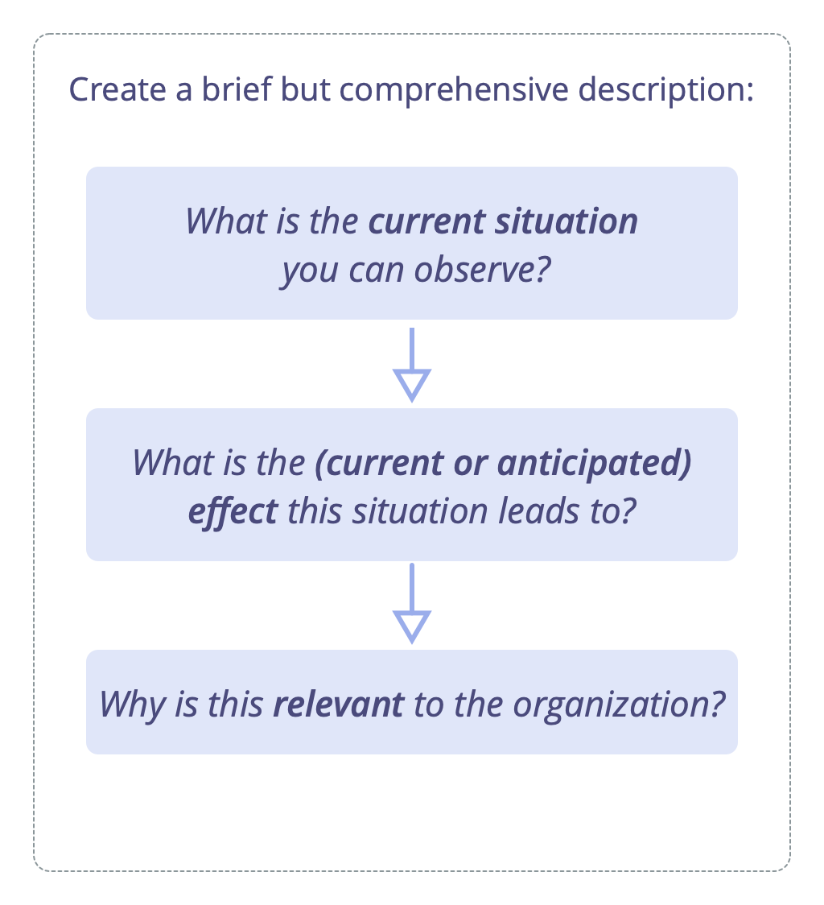
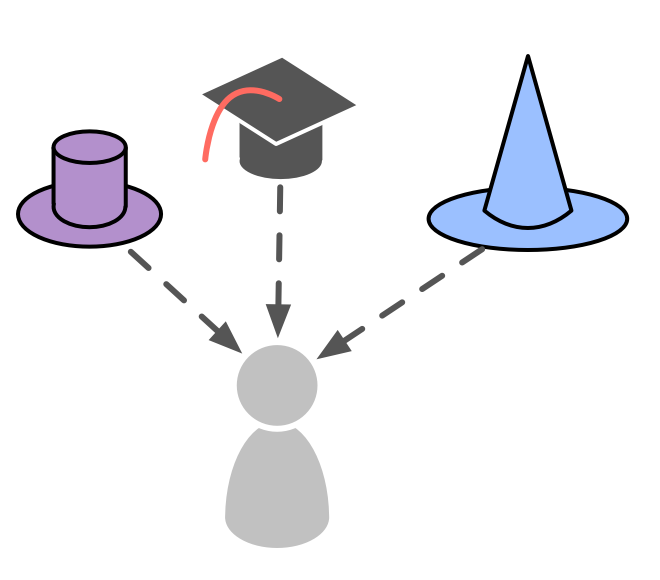
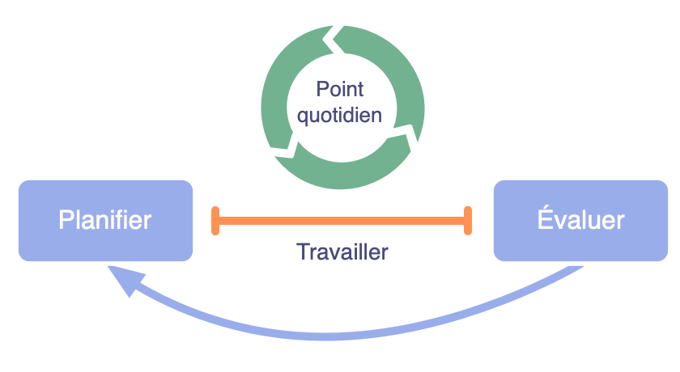
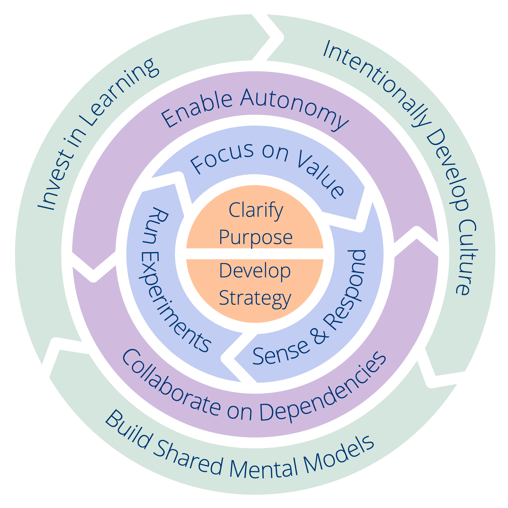

## Qu'est-ce que la Sociocratie 3.0 ?

La Sociocratie 3.0 — ou "S3" — est une <dfn data-info="Technologie sociale: La technologie sociale est tout processus, toute technique, toute méthode, toute compétence ou toute autre approche que les gens peuvent utiliser pour influencer les systèmes sociaux — organisations, sociétés, communautés, etc. — pour soutenir l'atteinte d'objectifs communs et mener des interactions et échanges sensés.">technologie sociale</dfn> pour développer des organisations agiles et résilientes de toute taille, allant des petites start-ups jusqu'aux grands réseaux internationaux, ou des collaborations interministérielles.

A l’intérieur de ce guide pratique, vous découvrirez une collection complète de **concepts, de principes et de pratiques éprouvés et testés pour améliorer la performance, l'engagement et le bien-être** au sein des organisations.

Depuis leur lancement en 2015, les pratiques S3 ont aidé des personnes dans une grande variété de contextes organisationnels à tirer le meilleur parti de la collaboration. Aussi bien des start-ups que des petites et moyennes entreprises, de grandes organisations internationales, des organisations qu'elles soient financées par des investisseurs ou à but non lucratif, des familles et des communautés.

L'utilisation de S3 peut **vous aider à atteindre vos objectifs** et traverser la complexité avec succès. Vous pouvez faire des changements pas à pas, **sans nécessiter une réorganisation radicale soudaine** ni un grand plan de transformation à long terme :

-   Vous commencez simplement par identifier là où le besoin est le plus grand et vous sélectionnez les pratiques ou consignes qui peuvent aider.
-   Avancez à votre propre rythme et développez vos compétences et compétences au fur et à mesure.

**Quelque soit votre position dans l'organisation**, vous découvrirez des pratiques pertinentes et utiles pour vous.

**Sociocratie 3.0 est libre**, et sous licence Creative Commons Free Culture License.

### Comment la Sociocratie 3.0 peut-elle aider ?

S3 est une technologie de transformation à la fois pour les individus et l'ensemble de l'organisation qui vous aidera à trouver comment relever les plus grands défis de votre organisation, profiter des occasions qui se présentent et résoudre les problèmes les plus tenaces.

La Sociocratie 3.0 est conçue pour être flexible et encourage l'expérimentation et l'apprentissage. Vous pouvez prendre juste ce dont vous avez besoin, adapter les choses à votre contexte et enrichir votre approche existante.

S3 intègre des concepts de base et des pratiques que vous retrouverez dans les méthodologies agiles, le lean management, Kanban (et KMM), le Design Thinking, les organisations opales et la famille des méthodes de gouvernance basées sur la sociocratie (SCM/Dynamic Governance, Holacracy® etc.). Elle est complémentaire et compatible avec n'importe quel framework agile ou lean, comme Scrum (mais pas seulement) et ses différents frameworks de passage à l'échelle.

### Une approche pratique du changement organisationnel

S3 offre une approche pratique du changement organisationnel.

Une **pratique** est un processus, une façon de faire ou une ligne directrice qui sert de modèle pour répondre avec succès à un type spécifique de défi ou d'opportunité. Les pratiques S3 sont découvertes en observant la manière dont les gens qui travaillent dans des organisations résolvent les problèmes et répondent aux opportunités qui se présentent à eux. Quand vous trouvez que vos méthodes habituelles de faire des choses ne produisent pas les résultats escomptés, cherchez des pratiques S3 qui pourraient vous aider.

Elles sont modulaires et adaptables. Elles peuvent être utilisées indépendamment mais se renforcent mutuellement, en se complétant si vous les combinez. Les pratiques S3 peuvent être développées et adaptées à vos besoins spécifiques.

Dans ce guide, les pratiques sont regroupées en dix catégories pour vous aider à repérer plus facilement celles qui vous seront utiles :

- Cocréer et évoluer
- Se développer entre pairs
- Catalyser la collaboration
- Construire les organisations
- Intégrer la S3
- Élaborer des accords
- Cibler les interactions
- Se réunir
- Organiser le travail
- Structurer l'organisation

En fournissant un menu de pratiques à choisir en fonction des besoins, S3 encourage une **approche organique et itérative du changement sans nécessiter un énorme investissement initial** . Elle prend les gens où ils se trouvent et les aide à progresser en ajoutant des pratiques à leur rythme et en fonction de leur contexte particulier.

### Que contient ce guide ?

À l'intérieur de ce guide pratique, vous découvrirez :

-   Des concepts utiles qui vous aideront à **donner plus de sens à votre organisation** et à communiquer efficacement sur l'endroit où le changement est nécessaire.
-   Une **approche organique et itérative du changement** qui prend les organisations où elles sont et les aide à progresser à leur propre rythme en fonction de leur contexte et de leurs besoins uniques.
-   **Sept principes de base** de collaboration agile et sociocratique
-   Un ensemble cohérent de **plus de 70 pratiques et consignes** pour vous aider à aborder la complexité et améliorer la collaboration :
    -   **Des formats simples, facilités** qui aident les équipes à utiliser l'intelligence collective du groupe et à traiter progressivement les informations disponibles en améliorant en continu les processus de travail, produits, services et compétences.
    -   **Des pratiques de groupe** pour aider les organisations à faire le meilleur usage de leurs talents, en faisant en sorte que **les personnes se soutiennent mutuellement** pour développer leurs compétences, le sens des responsabilités et l'engagement.
    -   **Des outils simples pour clarifier qui fait quoi**, laissant les personnes libres de décider et d'agir autant que possible par elles-même et à l'intérieur d'un cadre clairement défini permettant d'expérimenter et de se développer.
    -   Des modèles pour **structurer votre organisation au-delà des hiérarchies** vers des réseaux flexibles et décentralisés où les flux d'informations et d'influence soutiennent directement la création de valeur.
-   Le **Framework du Sens Commun**, un outil pour comprendre les équipes et le organisations et trouver comment démarrer avec S3.
-   Un **glossaire** avec des explications pour tous les termes que vous ne connaissez peut-être pas.

Ce guide pratique est écrit et publié par les trois co-développeurs de la Sociocratie 3.0.

Fidèle à l'état d'esprit S3, ce livre restera perpétuellement en chantier évoluant au fur et à mesure que nous apprenons auprès des personnes qui expérimentent S3 dans les organisations du monde entier. Depuis que nous avons commencé il y a 5 ans, nous avons publié plusieurs mises à jour par an et nous continuerons à le faire dans les années à venir.

Même si plusieurs sections de ce livre sont succinctes et parfois peu abouties, son contenu et ses explications se sont avérés suffisant pour que de nombreuses personnes puissent débuter avec S3 et réaliser des changements positifs dans leurs organisations. Nous espérons que vous le trouverez également utile.

### Influences et historique de la Sociocratie 3.0

La signification littérale du terme **sociocratie** est "la règle des compagnons" : *socio* — du latin *socius* — qui signifie "companion", ou "ami", et le suffixe *-cracy* — du grec ancien κράτος (krátos) — qui signifie "puissance", ou "règle".

Le mot sociocratie remonte à 1851, quand **Auguste Comte** a suggéré d'appliquer une approche scientifique à la société : les états seraient gouvernés par un corps de scientifiques experts de la société (qu'il nommait les « sociologues »). Selon lui, ce futur, bien qu'il ne fût pas encore réalisable, était inévitable.

Quelques décennies plus tard, **Lester Frank Ward**, utilisa le mot "sociocratie" pour décrire la loi des personnes ayant des relations entre elles. Au lieu d'avoir des sociologues au centre, il voulait donner plus de pouvoir et des responsabilités aux individus, il imaginait les sociologues dans un rôle de chercheurs et de consultants.

En 1926, l'éducateur réformiste néerlandais et quaker **Kees Boeke**, établissait un pensionnat fonctionnant sur le principe de consentement. Le personnel et les élèves étaient traités comme des participants égaux à la gouvernance de l'école, toutes les décisions devaient être acceptables par tous. Il construisit cette version de la sociocratie sur les principes et les pratiques des quakers, et décrivit la sociocratie comme une évolution de la démocratie dans son essai de 1945 "La démocratie comme elle pourrait être".

**Gerard Endenburg**, également quaker et étudiant dans l'école de Boeke, voulait appliquer la sociocratie dans son entreprise familiale, Endenburg Elektrotechniek. Il créa et développa la *Méthode Sociocratique d'Organisation par Cercles (SCM)* (qui deviendra plus tard la "méthode sociocratique"), en appliquant la sociocratie de Boeke à l'ingénierie et à la cybernétique. En 1978, Endenburg fonda le Centre Sociocratique d'Utrecht (qui est maintenant le Centre Sociocratique de Rotterdam) afin de promouvoir la sociocratie aux Pays-Bas et au-delà. Depuis 1994, les organisations néerlandaises utilisant la SCM sont exemptées de l'obligation légale d'avoir un comité d’entreprise.

À la fin des années 1990 et au début des années 2000, plusieurs personnes non-néerlandaises découvrirent la sociocratie, mais ce n'est qu'en 2007 lorsque **Sharon Villines et John Buck** publièrent leur livre, "We the People", que la sociocratie devint largement accessible au monde anglophone, et qu'elle commença à migrer dans plusieurs autres langues.

La Sociocratie s'est avérée efficace pour de nombreuses organisations et communautés du monde entier, mais elle tarde encore à devenir virale.

En 2014 **James Priest et Bernhard Bockelbrink** se réunirent pour cocréer un corpus de ressources d'apprentissage sous licence Creative Commons, synthétisant les idées de la Sociocratie, de l’Agile et du Lean. Ils ont découvert que les organisations de toutes tailles ont besoin d’un menu flexible de pratiques et de structures – adaptées à leur contexte particulier – qui permettent d’évoluer vers une approche plus sociocratique et plus agile pour plus d’efficacité, de cohérence, d’accomplissement et de bien-être. La première version de la **Sociocratie 3.0** fût lancée en mars 2015.

**Liliana David** a rejoint l'équipe peu après. Ensemble, ils oeuvrent à rendre la S3 accessible et applicable au plus grand nombre d'organisations possible et publient des ressources sous une licence **Creative Commons Free Culture License** pour ceux qui veulent apprendre, appliquer et parler aux autres de la Sociocratie 3.0.

#### Le mouvement Sociocratie 3.0

Avec l’intérêt grandissant pour la Sociocratie 3.0, une communauté de personnes d’origines diverses se développe rapidement — des consultants pionniers, des coaches, des facilitateurs d’apprentissage et des personnes qui appliquent S3 dans différents contextes — tous reconnaissent le potentiel transformationnel de la Sociocratie 3.0 pour aider les organisations et leurs membres à prospérer. Beaucoup consacrent une part de leur temps à expérimenter et échanger sur S3, et collaborent pour apprendre les uns des autres et documenter leurs expériences afin de nourrir le développement et l’évolution de la S3 et de ses applications diverses.

### Pourquoi "3.0"?

La Sociocratie comme forme de gouvernance fût évoquée dès 1851. Par la suite, elle a été développée et adaptée par de nombreuses personnes et organisations différentes, dont Gerard Endenburg, The Sociocracy Group (TSG) et Brian Robertson (HolacracyOne).

Pourtant, en dehors des Pays-Bas, la sociocratie est restée jusqu'à récemment largement inconnue.

Nous adorons la sociocratie parce que nous voyons des organisations et leurs membres prospérer lorsqu'ils en utilisent les éléments pour enrichir ou transformer leurs façons de faire.

Nous aimons aussi l'Agile, le Lean, le Kanban, les Core Protocols, la CNV, et bien d'autres idées aussi. Nous pensons que le monde sera un meilleur endroit, à mesure que plus d'organisations apprendront à puiser dans cette corne d'abondance de pratiques fantastiques qui émergent aujourd'hui dans le monde, et qu'elles apprendront à les intégrer avec ce qu'elles savent déjà.

C'est pourquoi nous avons décidé de consacrer une partie de notre temps à développer et à faire évoluer la Sociocratie, en l'intégrant avec de nombreuses autres idées puissantes, afin de la rendre accessible et applicable au plus grand nombre d'organisations possible.

Nous croyons en l'importance d'avoir une identité forte, à une manière radicalement différente de distribuer et d'adapter la *Méthode d'Organisation en Cercles Sociocratique * afin d'améliorer son applicabilité.

#### Le nom

Le nom "*Sociocratie 3.0*" montre à la fois le respect des origines et un pas en avant significatif.

Il permet également d'éviter la perception que nous dénaturons la *Méthode d'Organisation en Cercles Sociocratique (SCM)* telle que promue par The Sociocracy Group.

#### Le nouveau modèle de distribution

*Sociocratie 3.0* utilise un modèle de distribution décentralisé. Il s'agit d'un changement de paradigme dans la manière dont la sociocratie est apportée aux gens et aux organisations, et qui parle à de nombreuses personnes.

Nous supportons la distribution "virale" à travers deux stratégies clés :

* **La Sociocratie 3.0 est ouverte :** Nous voulons encourager la croissance d’un écosystème dynamique d’applications et de variantes de la sociocratie, où les personnes partagent et discutent de leurs points de vue et des adaptations qu’ils apportent pour leur contexte spécifique. À cette fin, la Sociocratie 3.0 met l’accent sur la communication des principes sous-jacents et invite explicitement la créativité de chacun à mélanger, étendre et en adapter les éléments ses besoins.
* **La Sociocratie 3.0 est libre :** Afin de faciliter le démarrage pour les individus et les organisations, nous publions gratuitement sous licence *Creative Commons Free Culture License* des ressources permettant d'apprendre, pratiquer et enseigner *Sociocratie 3.0*. Tout le monde peut utiliser nos ressources sans notre permission explicite, même dans un contexte commercial, ou comme base pour construire ses propres ressources tant qu'elles sont partagées sous la même licence. Nous attendons et encourageons d'autres organisations, des consultants, des coachs, des facilitateurs d'apprentissage et des formateurs à suivre notre exemple et à libérer leurs ressources également.

#### Evolution de la Méthode d'Organisation en Cercles Sociocratiques

Il nous faut sans doute préciser ceci explicitement : la Sociocratie 3.0 n'est pas spécifiquement destinée à la communauté existante des personnes qui explorent la *Méthode d'Organisation en Cercles Sociocratique (SCM)* , ni au Sociocracy Group (TSG). La *SCM* est déjà bien développée et beaucoup de personnes semblent en être globalement satisfaites.

Pourtant, d'après notre expérience directe, même pour les organisations qui ont entendu parler de sociocratie, il existe de nombreux obstacles pour s'y investir. Avec la *Sociocratie 3.0* nous travaillons activement à traiter et à éliminer tout ce qui fait obstacle.

##### Réduire le risque et la résistance

La *Sociocratie 3.0* prend les organisations là où elles en sont et les emmène dans un voyage d’amélioration continue. Il n’y a pas de changement radical ni de réorganisation. La *Sociocratie 3.0* fournit un catalogue de pratiques indépendantes qu'une organisation peut amener une à une afin de gagner en efficacité. Toutes les pratiques s’appuient sur un ensemble de principes fondamentaux, de sorte qu'elles puissent facilement être adaptées à chaque contexte.

##### Se focaliser sur le besoin plutôt que sur l'objectif (ou la raison d'être)

Avec la *Sociocratie 3.0*, plutôt que la vision, la mission, les objectifs ou le but, l'organisation se focalise sur la source de motivation, et s'aligne pour découvrir et adresser ses besoins. Les organisations qui sont déjà centrées sur les besoins, portées par des valeurs ou centrées sur leurs clients trouvent cela naturel.

##### Réduite à l'essentiel

Lorsqu'on regarde ses normes, la *Méthode d'Organisation en Cercles Sociocratique*, peut sembler imposante et effrayante. En se concentrant sur les fondamentaux seulement, la *Sociocratie 3.0* offre un cadre léger pour s’adapter et d'où l'on peut construire selon ses besoins.

Cela ne veut pas dire que c’est facile : choisir de puiser dans les pratiques de la *Sociocratie 3.0* nécessite de s'investir pour apprendre et désapprendre. C’est pourquoi il est important de ne piocher que ce dont vous avez besoin, car il n’est pas utile de changer les choses si ce que vous faites marche assez bien.

##### Intégration avec la pensée Agile et Lean

La *Méthode d'Organisation en Cercles Sociocratiques (SCM)* ne dit "rien" sur la façon d'organiser vos activités ni de créer une culture de collaboration étroite. De nombreuses organisations mettent déjà en œuvre ou tendent vers la pensée lean et agile dans leurs opérations et dans leur collaboration. Nous pensons que ce sont des idées puissantes, donc la *Sociocratie 3.0* est conçue pour une adoption facile dans les organisations lean et agiles.

##### Une nouvelle façon de structurer l'organisation

La structure organisationnelle selon la *Méthode d'Organisation en Cercles Sociocratiques (SCM)* est modélisée selon une hiérarchie de domaines. Nous constatons une émergence croissante d’environnements collaboratifs multi-parties prenantes et la nécessité d’une plus grande variété de modèles de structure organisationnelle. Une structure organisationnelle évolue naturellement lorsque les flux d'information et l'influence sont graduellement alignés sur le flux de valeur. La *Sociocratie 3.0* propose une variété de modèles de structures qui peuvent être combinés pour faire évoluer de manière flexible la structure de votre organisation lorsque c'est nécessaire.

## Les sept principes

La Sociocratie 3.0 est construite sur sept principes fondamentaux qui permettent une collaboration sociocratique et agile . Puisque les sept principes se reflètent dans toutes les pratiques, la compréhension de ces principes est utile pour adopter les pratiques de la Sociocratie 3.0 et primordiale si l'on souhaite les adapter .

Pratiquer la Sociocratie 3.0 aide les gens à comprendre la valeur essentielle que ces principes fondamentaux apportent – tant aux individus qu’aux organisations – et à soutenir leur intégration dans la culture organisationnelle.

**Le Principe d'Efficacité:** *Ne consacrer du temps qu'à ce qui vous rapproche de la réalisation des objectifs généraux de votre organisation,* afin de faire le meilleur usage de votre précieux temps, de votre énergie et de vos ressources.

**Le Principe de Consentement:** *Signalez, rechercher et résoudre les objections aux décisions et aux actions,* afin de réduire le risque de conséquences indésirables et de découvrir des améliorations utiles.

**Le Principe d'Empirisme:** *Testez toutes les suppositions sur lesquelles vous vous appuyez, à travers des expériences et une évaluation continue,* afin d'apprendre rapidement, comprendre et appréhender la complexité aussi efficacement que possible.

**Le Principe d'Amélioration Continue:** *Examinez régulièrement le résultat de ce que vous faites, puis apportez des améliorations progressives à ce que vous faites et à comment vous le faites, en fonction de ce que vous apprendrez,* afin de vous adapter aux changements quand c'est nécessaire, et de maintenir ou d'améliorer votre efficacité au fil du temps.

**Le Principe d'Equivalence:** *Impliquer les personnes dans la prise et l'évolution des décisions qui les affectent,* afin d'augmenter l'engagement et la redevabilité, et d'utiliser l'intelligence distribuée pour atteindre et faire évoluer vos objectifs.

**Le Principe de Transparence:** *Enregistrez toutes les informations qui sont précieuses pour l'organisation rendez-les accessibles à tous les membres de l'organisation, à moins qu'il n'y ait une raison de confidentialité,* afin que chacun ait les informations dont il a besoin pour comprendre comment faire son travail d'une manière qui contribue le plus efficacement à l'ensemble.

**Le Principe Redevabilité:** *Réagissez lorsque quelque chose est nécessaire, faites ce que vous avez accepté de faire et prenez votre part de responsabilité dans  l'organisation,* pour que ce qui doit être fait le soit, que rien ne soit négligé et que tout le monde fasse ce qu'il peut pour contribuer à l'efficacité et à l'intégrité de l'organisation.

## Concepts clés pour comprendre les organisations

Dans cette section, vous apprendrez les concepts clés suivants :

- Driver
- Domaine
- Accord
- Objection
- Gouvernance et Opérations

Vous découvrirez également comment ces concepts se rapportent à la valeur (et au gaspillage), à la délégation (et à la responsabilité), à l'auto-organisation, à l'auto-gouvernance et à la semi-autonomie.

Lorsque les gens comprennent ces concepts, cela leur donne un langage commun pour décrire clairement ce qui se passe au sein de l’organisation. Cela contribue à accroître la compréhension partagée et permet un dialogue constructif sur ce qui doit être fait.

Si vous ne comprenez pas l'un de ces termes, consultez notre glossaire à la fin.

### Drivers

_Un **driver** (aussi appelé "une intention" en français) est le motif d'un groupe ou d'un individu pour réagir à une situation donnée._

Drivers :

- peuvent être utilisées pour formuler des buts, objectifs, aspirations, une mission, une vision, une raison d’être
- peuvent changer au fil du temps

#### Drivers, valeur et gaspillage

_La **valeur** est l'importance ou l'utilité de quelque chose lié à un driver._

_Le **gaspillage** est tout ce qui n'est pas nécessaire pour - ou qui fait obstacle à  une réponse (plus) efficace à un driver._

En adoptant les concepts de valeur et de gaspillage, de nombreuses pratiques et idées issues de la **production lean** et du **développement logiciel lean** sont applicables aux organisations pratiquant S3:

- cartographie de la chaîne de valeur
- différentes stratégies pour éliminer le gaspillage
- la méthode Kanban

### Domaines

_Un **domaine** est une zone d'influence, d’activité et de prise de décisions distincte au sein d'une organisation._

Pour mieux utiliser leur temps, leur énergie et leurs ressources limités, les personnes dans les organisations se répartissent le travail en créant des rôles ou en formant des équipes, des unités ou des départements. Pour celà, elles définissent explicitement ou implicitement des domaines - des périmètres distincts de responsabilité et d'autonomie. Tous les domaines sont dans le domaine général d'une organisation et peuvent se chevaucher et/ou être entièrement contenus dans d'autres domaines.

Tout rôle ou équipe a pour but de contribuer à l'objectif général de l'organisation en s'occupant d'un besoin organisationnel spécifique. Les domaines mal définis conduisent généralement à ce que les parties prenantes aient des attentes différentes sur des domaines de responsabilité et d'autonomie. En conséquence, tant la collaboration que la répartition du travail souffrent à cause des dépendances manquées, du travail en double ou du travail qui n'est pas fait du tout.

_Clarifier les domaines_ rend le contrat entre le *délégant* (qui délègue la responsabilité d'un domaine) et le(s) *délégué(s)* (auquel le domaine est délégué) explicite, ce qui permet à tout le monde de savoir ce qui fonctionne et ce qui ne fonctionne pas, et de comprendre qui est responsable de quoi. Une description de domaine claire avec une quantité raisonnable de détails est une condition préalable nécessaire pour que les gens puissent évaluer et améliorer continuellement leur travail.

#### Évaluer et faire évoluer régulièrement les domaines

Les gens ont une compréhension limitée de l'organisation et l'environnement est en constante évolution. Il est donc essentiel que le délégant, le(s) délégué(s) et les autres parties prenantes concernées prennent régulièrement le temps d'évaluer et de faire évoluer à la fois la conception du domaine et la façon dont les gens s’en occupent à mesure que leur compréhension du domaine s’approfondit.

Les gens peuvent s’occuper excellement d'un domaine, mais la conception du domaine peut être primitive ou défectueuse. D'un autre côté, même si la conception d'un domaine est médiocre lors de sa première itération, à travers ce processus, elle s'améliorera avec le temps.

#### Déléguer la responsabilité des domaines

_La délégation est l’octroi par une partie (le délégant) à une autre (le délégué) de l’autorité de s'occuper d'un domaine, (c'est-à-dire de faire certaines choses et/ou de prendre certaines décisions) pour lesquelles le délégant maintient la redevabilité globale._

La responsabilité des domaines est déléguée à des groupes ou à des individus, qui agissent ensuite dans le cadre des contraintes définies sur leur autonomie et leur influence.

Lorsqu'un domaine est délégué à un groupe de personnes, ils deviennent une <dfn data-info="Équipe: Un groupe de personnes qui collaborent vers un driver commun (ou un objectif). Généralement, une équipe fait partie d'une organisation, ou est formée pour la collaboration entre plusieurs organisations.">équipe</dfn>, quand il est délégué à un individu, ils devient un <dfn data-info="Porteur de rôle: Une personne qui assume la responsabilité d'un rôle.">porteur de rôle</dfn>.

Les <dfn data-info="Délégué: Un individu ou un groupe acceptant la responsabilité d'un domaine qui lui est délégué, devenant un porteur de rôle ou une équipe.">délégués</dfn> peuvent faire toutes les choses qu'ils pensent pouvoir les aider à atteindre leur but, sauf si elle sont en dehors du domaine de l'organisation, explicitement interdites, si elles violent le domaine (explicite) de quelqu'un d'autre ou si elles entravent la contribution d'autres personnes à l'organisation d'une toute autre manière.

**Remarque :** *Les choses qui sont interdites incluent des contraintes explicitement exposées dans la description du domaine, toute autre entente que le(s) délégué(s) doit respecter, ainsi que les exigences légales et réglementaires.*

Le <dfn data-info="Délégant: Un individu ou un groupe déléguant la responsabilité d'un domaine à autrui.">délégant</dfn> conserve toujours la redevabilité globale de ce domaine, alloue **les ressources** et définit souvent :

- le **besoin organisationnel** auquel le domaine doit répondre
- les **responsabilités clés** (livrables, risques critiques à gérer, autre travail essentiel et prises de décision délégués)
- **des contraintes à l'autonomie et à l'influence** du ou des délégués, généralement liées à l'organisation elle-même (dépendances, implication du délégant, rapports, etc.)

#### Drivers et domaines

Il est également possible de comprendre un domaine par rapport aux drivers organisationnels :

- le **driver primaire** du domaine - le principal driver auquel le(s) délégué(s) répond(ent)
- l'ensemble des sous-drivers que l'organisation peut avoir à traiter en répondant au driver primaire du domaine, notamment : 
    - les **responsabilités clés** (n'importe quel driver dérivant directement du driver primaire)
    - les **dépendances** et les **contraintes externes** (drivers liés à d'autres domaines ou à l'environnement extérieur à l'organisation) qui contraignent l'autonomie des délégués

### Objections

_Une **objection** est un argument relatif à un accord (proposé) ou une activité qui révèle des conséquences inattendues que vous préfèreriez éviter, ou qui pourrait être améliorée._

Les objections révèlent des informations sur  des **conséquences involontaires** (potentielles), ou sur **des moyens utiles de s'améliorer**.

Sachez que ne pas exprimer des objections peut nuire à la capacité des individus, des équipes ou de l'ensemble de l'organisation à atteindre leurs objectifs.

Il est de la responsabilité de chaque individu de lever des objections potentielles aux propositions, aux décisions, aux <dfn data-info="Accord: Une ligne directrice, un processus ou protocole établi de le but de guider le flux de valeur.">accords</dfn> existants ou aux activités.

Ceux qui sont redevables d'une activité ou d'un accord (proposé) en question, sont responsables de *la prise en compte des arguments et d'adresser les objections* qui sont levés en vue d'aider à atteindre les objectifs de l'organisation.

Lorsque vous cherchez des objections potentielles, considérez :

- **l'efficacité**: pourquoi le <dfn data-info="Résultat attendu: Le résultat escompté d'un accord, d'une action, d'un projet ou d'une stratégie.">résultat souhaité</dfn> ne serait pas (entièrement) atteint ?
- **l'efficience**: pourquoi ce serait un gâchis de procéder comme proposé (ou convenu précédemment) ?
- **les effets secondaires**: quelles conséquences négatives cela pourrait avoir par ailleurs (dans le même <dfn data-info="Domaine: Une zone d'influence, d’activité et de prise de décisions distincte au sein d'une organisation.">domaine</dfn>, dans l'ensemble de l'organisation, ou au-delà)?

Les informations apportées par les objections peuvent être utilisées pour améliorer :

-   les actions en cours et planifiées
-   la façon dont les gens exécutent les décisions
-   les accords existants
-   les propositions
-   la compréhension commune des drivers

Créer une culture où les gens se sentent à l'aise pour lever des objections *potentielles* à tout moment, afin qu'ils puissent tranquillement prendre des décisions qui sont *suffisamment bonnes pour l'instant, et suffisamment sûres à essayer*. Cela encourage le développement d'une préférence pour essayer, au lieu d'essayer d'anticiper et de tenir compte de toutes les possibilités à l'avance.

Tirez parti de la diversité des perspectives et soyez ouvert à challenger les vôtres, à découvrir quand et quoi changer, et appréciez d'itérer plus rapidement, en expérimentant et en apprenant des résultats obtenus en chemin.

#### Préoccupations

**Tous les arguments invoqués ne sont pas des objections. Faites la distinction entre les objections, qui révèlent toujours des informations utiles, et d'autres arguments qui ne sont fondés que sur des hypothèses, ou sur une préférence ou une opinion personnelle.**

_Une **préoccupation** est une supposition - ou une opinion - selon laquelle faire quelque chose (même en l'absence d'objections) **pourrait** entraver une réponse (plus) efficace à un driver organisationnel._

Dans la _Décision par Consentement_, les préoccupations peuvent suggérer des moyens de faire avancer les accords (y compris leurs critères et fréquence d'évaluation). Faites part de vos préoccupations si vous pensez qu’il est utile de les prendre en considération, et au moins de les inscrire avec l'accord, et de surveiller les résultats dans le temps.

Si vous avez des doutes quant à savoir si vous avez une objection ou une vigilance, soyez proactif et vérifiez avec les autres pour voir ce qu'ils en pensent. (voir _Tester les objections potentielles_).

### Accords

_Un **accord** est une ligne directrice, un processus, un protocole ou une politique établis de le but de guider le flux de valeur._

Des directives partagées sur pourquoi, comment et quand agir, et ce qui est spécifiquement nécessaire, permettant une collaboration efficace.

Les accords sont créés en réponse à des <dfn data-info="Driver organisationnel: Un driver (aussi appelée "intention" en français) est le motif d’une personne ou d’un groupe à répondre à une situation particulière. Un driver est considéré comme un **driver organisationnel** si le fait d'y répondre aiderait l’organisation à générer de la valeur, à éliminer du gaspillage ou à éviter des conséquences inattendues.">drivers organisationnels</dfn>, ils sont **régulièrement évalués**, et évoluent si nécessaire.

**La redevabilité générale** d'un accord appartient aux personnes qui le créent.

Un accord peut inclure la **délégation de responsabilités particulières** à des individus ou à des groupes.

### Gouvernance et Opérations

S3 cherche à libérer la productivité en laissant les personnes libres de faire et de décider autant que possible par elles-même, tout en collaborant de manière cohérente dans une organisation efficace et qui réussit.

Une plus grande autonomie des individus et des équipes nécessite des accords clairs (c'est-à-dire des consignes et des contraintes) qui permettent une collaboration harmonieuse entre ces équipes et ces individus, et qui soutiennent la réalisation d'objectifs à court et long terme. Des évaluations périodiques et l'évolution progressive des accords assurent qu'ils restent adaptés à la finalité.

Bien qu'une décision ayant des conséquences à court terme puisse facilement être prise sur-le-champ, pour créer des accords plus conséquents qui contraignent le comportement et l’activité des gens, il est souvent bénéfique d’adopter un _processus de décision_ plus participatif et plus délibéré.

De tels accords doivent être documentés, à la fois pour s'en souvenir mais aussi pour en faire efficacement une _évaluation_, et pour être communiqués aux personnes impactées (qui sont idéalement aussi _impliquées dans la création et l'évolution_ de ces accords).

Il est donc utile de distinguer deux catégories d’activités dans une organisation, l'une que nous appelons la gouvernance, et l’autre que nous appelons les opérations :

_La **Gouvernance** dans une organisation (ou l'un de ses domaines) est le processus de fixer des objectifs, de prendre et faire évoluer des décisions qui guident les gens pour les atteindre._

_Les **Opérations** consistent à faire le travail et organiser les activités du quotidien selon les contraintes définies par la gouvernance._

Pour chaque domaine dans une organisation il y a une *instance gouvernante*: les personnes ayant un mandat pour sceller et pour faire évoluer des accords régissant la manière dont ceux qui font le travail dans ce domaine créent de la valeur.

Il existe de nombreuses façons de distribuer le travail et la gouvernance. Parfois, l’instance gouvernante est une personne unique, par exemple dans le cas d’un chef d’équipe, et parfois c’est un groupe de personnes, par exemple dans un cercle où tous les membres sont responsables collectivement de la gouvernance selon les contraintes du domaine.

**Les décisions de gouvernance** fixent des contraintes sur l'activité et guident les décisions futures.

Ceci inclut :

- définir les domaines
- déléguer l'influence aux gens
- allouer des ressources et des capacités
- spécifier les livrables et prioriser leur livraison.

Les décisions de gouvernance peuvent être prises à tout moment et à n'importe quel endroit, pas seulement dans des réunions spécifiques, bien qu'une _réunion régulière pour la création et l'évolution des accords_ soit souvent une bonne idée.

#### Concepts connexes

**Auto-gouvernance**: Ensemble de personnes se gouvernant elles-mêmes selon les contraintes d'un domaine.

**Semi-autonomie**: L'autonomie des personnes à décider par elles-mêmes comment elles créent de la valeur, limitée par les contraintes de leur domaine, et par les objections formulées par le délégant, les représentants ou d'autres.

**Auto-organisation:** Toute activité ou processus par le biais duquel les personnes organisent leur travail. L'auto-organisation se produit dans les contraintes d'un domaine, mais sans l'influence directe des agents externes. Dans toute organisation ou équipe, l'auto-organisation coexiste avec l'influence externe (par exemple, des objections externes ou des décisions de gouvernance qui affectent le domaine).

Selon les contraintes imposées par le délégant, les équipes ont plus ou moins de latitude à mener la gouvernance et à décider comment elles organisent leurs opérations, et sont par conséquent plus ou moins auto-gouvernées et auto-organisées.

## Les Pratiques

<only presets="jekyll">

<strong>Remarque :</strong> Si vous recherchez une pratique en particulier, utilisez l'index des pratiques <a href="pattern-index.html" >&nbsp;</a> ou la <a href="map.html" >&nbsp;carte des pratiques</a>, qui sont disponibles en haut de chaque page, et dans le menu "Liens rapides".

</only>

S3 offre une approche pratique du changement organisationnel.

_Une **pratique** est un processus, une façon de faire ou une ligne directrice qui sert de modèle pour répondre avec succès à un type spécifique de défi ou d'opportunité._

Les pratiques S3 sont modulaires et adaptables. Elles peuvent être utilisées indépendamment mais se renforcent mutuellement, en se complétant si vous les combinez. Les pratiques S3 peuvent être adaptées et peuvent évoluer vers vos besoins spécifiques.

Dans ce guide, les pratiques sont regroupées en dix catégories pour vous aider à repérer plus facilement celles qui vous seront utiles :

- [Cocréer et évoluer](co-creation-and-evolution.html)
- [Se développer entre pairs](peer-development.html)
- [Catalyser la collaboration](enablers-of-collaboration.html)
- [Construire les organisations](building-organizations.html)
- [Intégrer la S3](bringing-in-s3.html)
- [Élaborer des accords](defining-agreements.html)
- [Cibler les interactions](focused-interactions.html)
- [Se réunir](meeting-practices.html)
- [Organiser le travail](organizing-work.html)
- [Structurer l'organisation](organizational-structure.html)

### Cocréer et évoluer

#### Répondre aux drivers organisationnels

<strong>Clarifiez les drivers organisationnels (c'est-à-dire ce qui se passe et ce qui est nécessaire pour l'organisation) et agissez en conséquence.</strong>

Les réponses possibles à des <dfn data-info="Driver organisationnel: Un driver (aussi appelée "intention" en français) est le motif d’une personne ou d’un groupe à répondre à une situation particulière. Un driver est considéré comme un **driver organisationnel** si le fait d'y répondre aiderait l’organisation à générer de la valeur, à éliminer du gaspillage ou à éviter des conséquences inattendues.">drivers organisationnels</dfn> sont :

- l’action directe (<dfn data-info="Opérations: Faire le travail et organiser les activités du quotidien selon les contraintes définies par la gouvernance.">opérations</dfn>)
- organiser comment le travail sera fait
- prendre des décisions de gouvernance

La réponse à un driver organisationnel est généralement traitée comme une expérimentation évaluée et sera améliorée au fil du temps.

##### Qualifier les drivers en drivers organisationnels

Un driver (aussi appelée "intention" en français) est le motif d’une personne ou d’un groupe à répondre à une situation particulière. Un driver est considéré comme un **driver organisationnel** si le fait d'y répondre aiderait l’organisation à générer de la valeur, à éliminer du gaspillage ou à éviter des conséquences inattendues.

Une façon simple de déterminer si un driver appartient bien au <dfn data-info="Domaine: Une zone d'influence, d’activité et de prise de décisions distincte au sein d'une organisation.">domaine</dfn> d'une organisation est de se demander :

*Est-ce que cela aiderait l'organisation si nous répondions à cet driver? Ou est-ce que cela nous nuirait si nous ne le faisions pas?*

#### Naviguer par tension

<strong>Prêtez attention aux tensions que vous ressentez par rapport à l'organisation, explorez leur cause et transmettez aux personnes redevables du domaine approprié tout driver organisationnel que vous découvrez .</strong>

**Les défis et les opportunités** d'une organisation sont révélés par des gens qui expriment les raisons des tensions qu'ils éprouvent.

**Note:** Dans ce contexte, une *tension* est une expérience personnelle: un signe de dissonance entre sa perception d'une situation, et ses attentes (ou préférences).

Pour **découvrir les drivers**, recherchez ce qui stimule la tension, et décrivez ce qui se passe et ce qui est nécessaire. Parfois, une question révèle des idées fausses et la tension disparaît.

#### Décrire les drivers organisationnels

<strong>Décrivez les drivers pour mieux les comprendre, les communiquer et vous en souvenir.</strong>

Décrire les <dfn data-info="Driver organisationnel: Un driver (aussi appelée "intention" en français) est le motif d’une personne ou d’un groupe à répondre à une situation particulière. Un driver est considéré comme un **driver organisationnel** si le fait d'y répondre aiderait l’organisation à générer de la valeur, à éliminer du gaspillage ou à éviter des conséquences inattendues.">drivers</dfn> peut être fait en groupe ou par un individu. Selon leur perspective, ils peuvent décider d'expliquer un driver comme un **problème** à résoudre ou une **opportunité** à saisir.

Un moyen simple de décrire un driver est d'expliquer :

- **Ce qui se passe...:** 
    - la **situation actuelle**
    - l'**effet** de cette situation sur l'organisation
- ...et **ce qui est nécessaire:** 
    - le **besoin** de l'organisation par rapport à cette situation
    - l'**impact** de répondre à ce besoin

Créez un résumé bref mais complet contenant juste assez d'informations pour communiquer clairement la nécessité d'une action ou d'une décision.

Pas plus d'une ou deux phrases, afin que l'information soit facile à retenir et traiter.

En plus du résumé, d'autres détails sur le driver peuvent être conservés dans le registre.

##### Exemple:

> *"La cuisine est en désordre: il n'y a pas de vaisselle propre, l'évier est plein et il n'est pas possible d'attraper rapidement un café et de se remettre au travail. Nous avons besoin d'une cuisine dans un état utilisable pour rester concentrés sur notre travail."*

##### 1. Situation actuelle

> *"La cuisine est en désordre: il n'y a pas de tasses propres, l'évier est plein..."*

Décrivez la situation actuelle:

- Capturez brièvement les éléments essentiels de ce qui se passe et, si nécessaire, le contexte dans lequel cela se produit.
- Soyez objectif - décrivez les observations et évitez de juger.

##### 2. Effet

> *"... et il n'est pas possible de se faire rapidement un café et se remettre directement au travail."*

Expliquez l'effet de cette situation sur l'organisation :

- Clarifiez **pourquoi** la situation nécessite de l'attention : comment cela affecte-t-il l'organisation ?
- Précisez si les effets sont actuels ou anticipés.
- Expliquez les problèmes, les pertes, les opportunités ou les gains.

##### 3. Besoin

> *"Nous avons besoin d'une cuisine dans un état utilisable..."*

Expliquez le <dfn data-info="Besoin: L'absence de quelque chose de voulu ou jugé nécessaire (une exigence).">besoin</dfn> de l'organisation par rapport à cette situation :

- Le **besoin d'une organisation** est ce qu'une équipe (ou une personne) nécessite pour s'occuper efficacement d'un <dfn data-info="Domaine: Une zone d'influence, d’activité et de prise de décisions distincte au sein d'une organisation.">domaine</dfn>.
- Soyez précis sur qui a ce besoin ("nous avons besoin", "ils ont besoin", "j'ai besoin").
- En cas de désaccord sur le besoin, il est utile de prendre du recul par rapport à une solution particulière et se concentrer sur ce qui manque à l'organisation dans cette situation.

##### 4. Impact

> *"...pour rester concentrés sur notre travail".*

Décrivez l'impact de répondre à ce besoin :

- Expliquez le <dfn data-info="Résultat attendu: Le résultat escompté d'un accord, d'une action, d'un projet ou d'une stratégie.">résultat attendu</dfn>, les bénéfices potentiels ou les opportunités.
- L’impact peut être évident ou implicite, en particulier lorsque les effets de la situation actuelle sont déjà décrits.

##### Évaluer les drivers

Assurez-vous de revoir régulièrement les drivers, pour approfondir votre compréhension de ce qui se passe et ce qui est nécessaire.

Quelques questions utiles pour une évaluation :

- La description de la situation est-elle (toujours) correcte ?
- Avons-nous encore les mêmes besoins face à la situation?
- Le driver est-il toujours dans notre domaine?
- Le driver est-il toujours pertinent ?

#### Décider par consentement

<strong>Un processus de groupe (facilité) pour la prise de décision : inviter les participants à lever des objections et considérer les informations et connaissances révélées pour faire évoluer davantage les propositions ou les accords existants.</strong>

Les propositions deviennent des <dfn data-info="Accord: Une ligne directrice, un processus ou protocole établi de le but de guider le flux de valeur.">accords</dfn> quand elles sont considérées *assez bonnes pour le moment et assez sûres pour les essayer* jusqu'à la prochaine évaluation.

Des <dfn data-info="Objection: Un argument relatif à un accord (proposé) ou une activité qui révèle les conséquences inattendues que vous préféreriez éviter, ou qui pourraient être améliorées.">objections</dfn> non intégrées empêchent les propositions de devenir des accords.

Taire des objections peut nuire aux objectifs d’une équipe ou d’une organisation.

##### Contrat de consentement implicite

1. En l'absence d'objections à un accord, je m’engage à le respecter du mieux que je peux.
2. J’accepte de faire part de mes objections lorsque j'en prendrai conscience.

#### Tester les objections potentielles

Utilisez judicieusement votre temps et vos ressources limitées en testant si les arguments sont qualifiables d'objections et en agissant uniquement sur ceux qui le sont.

Quand quelqu'un propose de changer quelque chose, vérifiez que l'argument présenté révèle comment des conséquences indésirables vont ou pourraient survenir si l’on ne change rien, ou qu'il vous indique un moyen utile d'améliorer la façon de réaliser vos objectifs.

Explorez et affinez chaque argument si nécessaire pour identifier toute idée erronée ou dissiper tout malentendu, et éliminer les aspects de l'argument qui sont uniquement fondés sur des hypothèses, sur une préférence ou sur une opinion personnelle. Si vous établissez que ce qui reste de l'argument est une objection, passez à _résoudre l'objection_.

Pour savoir si un argument est une objection, dans un contexte de groupe, un facilitateur peut inviter à la réflexion en demandant :

_"Pensez-vous que cet argument est une objection ?"_

Si personne n'est en désaccord, traitez l'argument comme une objection. En cas de désaccord, proposez un dialogue pour découvrir si une objection est révélée par l'argument.

##### Comprendre les objections

Quelques questions utiles :

-   En quoi l'argument est-il relatif à cette proposition ou à cette accord en particulier ?
-   Est-ce que l'argument révèle comment une **action ou un accord** (proposé ou en vigueur) :
    -   nuit à la réponse à un driver organisationnel?
    -   peut être améliorée immédiatement ?
    -   empêche ou réduit la contribution de quelqu'un à répondre à un driver ?
    -   est en conflit avec les valeurs de l'organisation ?
    -   n'est pas considérée comme 'suffisamment sûre' pour l'essayer?

#### Intégrer les objections

<strong>Intégrez les objections une par une en utilisant les informations qu'elles contiennent et développer les amendements.</strong>

Commencez à résoudre l'<dfn data-info="Objection: Un argument relatif à un accord (proposé) ou une activité qui révèle les conséquences inattendues que vous préféreriez éviter, ou qui pourraient être améliorées.">objection</dfn> qui semble la plus prometteuse et, si cela échoue, choisissez en simplement une autre. Chaque tentative vous aidera à mieux comprendre les informations que contient l'objection et à rapprocher le groupe de proposer un amendement qui satisfera l'objection.

C'est souvent un bon point de départ de demander à la personne qui fait l'objection de proposer un amendement.

Généralement, il est plus efficace de **prendre une objection à la fois**, d'intégrer toutes les objections à un amendement proposé, puis de continuer avec la prochaine objection.

#### Évaluer et développer les accords

<strong>Développez continuellement un corpus d'accords et éliminez le gaspillage.</strong>

L'examen régulier des accords est une pratique essentielle pour une organisation apprenante :

- adapter les accords à un contexte changeant
- intégrer l'apprentissage pour les rendre plus efficaces

Assurez-vous que toutes les <dfn data-info="Accord: Une ligne directrice, un processus ou protocole établi de le but de guider le flux de valeur.">accords</dfn> ont une date d'évaluation appropriée.

Évaluer un accord peut être aussi simple que de vérifier qu'il est toujours pertinent, et qu'il n'y a pas d'objection à le conserver en l'état.

Les accords sont souvent examinés dans des _réunions de gouvernance_, cependant il est parfois plus performant de planifier une session dédiée.

Ajustez la fréquence d'évaluation au contexte et évaluez rapidement si nécessaire.

Les éléments de cette pratique peuvent également être utilisés par des individus pour évaluer leurs propres décisions.

##### Format court

- *Comment cet accord nous a-t-il aidé ?*
- *Y a-t-il une quelconque raison d'abandonner cet accord?*
- *Comment cet accord peut-il être amélioré ?*
- Se mettre d'accord sur la prochaine date d'évaluation.

##### Format long

Préparation :

- Planifier l'évaluation.
- S'assurer que toutes les informations nécessaires sont disponibles.

Suivi :

- Se mettre d'accord sur la prochaine date d'évaluation.
- Documenter les décisions et les tâches, et les partager avec les personnes concernées.
- Prendre en considération les effets de tout accord connexe.

#### Impliquer ceux qui sont impactés

<strong>Impliquez les personnes dans les décisions qui les concernent, pour maintenir équivalence et redevabilité, et pour augmenter la quantité d'informations disponibles sur le sujet.</strong>

Pour de plus grands groupes :

- facilitez le processus en plusieurs étapes et créez des sous-groupes, qui sélectionneront des délégués
- utilisez un outil en ligne et mener un processus asynchrone, _timeboxé_ et par étapes

Pensez également à inclure les personnes impactées dans l'évaluation et l'évolution des décisions.

#### Cocréer des propositions

<strong>Réunissez des personnes pour cocréer des propositions en réponse aux drivers organisationnels : exploitez l’intelligence collective, bâtissez un sentiment d'appropriation et faites augmenter leur engagement et leur responsabilisation.</strong>

Il existe de nombreuses façons de cocréer des propositions. Elles suivent généralement un modèle similaire :

1. Se mettre d'accord sur un <dfn data-info="Driver organisationnel: Un driver (aussi appelée "intention" en français) est le motif d’une personne ou d’un groupe à répondre à une situation particulière. Un driver est considéré comme un **driver organisationnel** si le fait d'y répondre aiderait l’organisation à générer de la valeur, à éliminer du gaspillage ou à éviter des conséquences inattendues.">driver</dfn> (ou un problème / une opportunité / un besoin)
2. Explorer le sujet et comprendre les contraintes
3. Générer des idées
4. Concevoir une proposition (souvent fait par un groupe plus restreint)

Une façon de cocréer des propositions est d'utiliser la pratique S3 _Élaborer une proposition_.

Pour les étapes 2 et 3, inspirez-vous des techniques classiques de facilitation de groupe ou des ateliers de Design Thinking.

En plus d'ateliers en présentiel, vous pouvez adapter ce processus pour fonctionner via des réunions à distance. Vous pouvez même l'utiliser de façon asynchrone (et pendant une longue période) pour inclure de nombreuses personnes.

#### Élaborer une proposition

<strong>Un processus de groupe (facilité) pour cocréer une réponse à un driver.</strong>

- s’appuie sur l’intelligence collective et la diversité des perspectives au sein d’un groupe
- implique les participants dans la co-création des accords
- encourage la redevabilité et le sens de l'appropriation

La pratique *Élaborer une proposition* peut également être utilisée par un individu.

##### Étapes d'élaboration d'une proposition

**Consentir au driver:** Présenter brièvement le<dfn data-info="Driver organisationnel: Un driver (aussi appelée "intention" en français) est le motif d’une personne ou d’un groupe à répondre à une situation particulière. Un driver est considéré comme un **driver organisationnel** si le fait d'y répondre aiderait l’organisation à générer de la valeur, à éliminer du gaspillage ou à éviter des conséquences inattendues.">driver</dfn>. *Est-il pertinent pour nous de répondre à ce driver? Y a-t-il des amendements essentiels à ce qui a été présenté?*

**Approfondir la compréhension collective du driver** : recueillir les questions essentielles à une meilleure compréhension du driver.

**Recueillir les considérations** formulées comme des questions relatives aux solutions possibles. Les questions révèlent des contraintes (questions informatives) ou des possibilités (questions génératives).

**Répondre** à toutes les questions demandant des informations, si possible.

**Prioriser** les remarques.

**Récolter les idées** comme constituants possibles d'une proposition.

**Rédiger une proposition** pour répondre au driver, en prenant en compte les idées créatives et les informations récoltées jusque là. En général, c'est un groupe plus restreint de "rédacteurs" qui s'occupe de cette étape.

##### Choisir les rédacteurs

Considérez :

- qui devrait participer ?
- qui veut participer ?
- qui d'autre pourrait apporter une contribution utile ?
- considérez une expertise, un point de vue ou une inspiration extérieure

Deux ou trois rédacteurs suffisent généralement. Vérifiez qu'il n'y ait pas d'objections au(x) rédacteur(s) proposé(s).

#### Sélectionner les porteurs de rôles

<strong>Un processus de groupe pour sélectionner une personne pour un rôle sur la force de la raison.</strong>

Au lieu de simplement affecter des personnes aux _rôles_, ou de faire un choix basé uniquement sur la majorité, utilisez le processus de sélection des porteurs de rôles pour :

- exploiter l'intelligence collective en entendant et en délibérant sur les raisons de la nomination
- augmenter l'appropriation de la décision
- assurer le soutien des personnes impactées au porteur de rôle.

Une condition préalable au processus de sélection est une _description claire_ du <dfn data-info="Domaine: Une zone d'influence, d’activité et de prise de décisions distincte au sein d'une organisation.">domaine</dfn>.

##### Sélection de rôles - Étapes

1. **Présenter la description du rôle:** Si possible, envoyez la description de domaine du rôle à l'avance.
2. **Consigner les nominations:** Les participants mettent le nom de leur candidat sur un bout de papier. Les gens peuvent se nominer eux-mêmes, un autre, ou passer.
3. **Raisons pour les nominations:** Chaque personne montre qui elle a proposé et explique pourquoi.
4. **Collecte d'informations:** Les participants partagent ou demandent des informations qui pourraient aider le groupe à faire une sélection appropriée.
5. **Changements de nomination:** Vérifiez si quelqu'un veut changer sa candidature à la lumière des raisons et des informations partagées jusqu'à présent, et écouter les raisons de chaque changement.
6. **Proposer un candidat** pour le rôle : Le facilitateur guide le processus pour identifier un candidat adéquat sur la force des raisons entendues, par exemple en : 
    - proposant un candidat lui-même ou en demandant à un membre du groupe
    - invitant (certains) candidats à s'entendre sur qui devrait être proposé
    - invitant le dialogue de groupe pour révéler le candidat le plus solide
7. **Vérifier les objections:** Demandez aux participants (y compris au candidat proposé) de signaler simultanément s'ils ont une <dfn data-info="Objection: Un argument relatif à un accord (proposé) ou une activité qui révèle les conséquences inattendues que vous préféreriez éviter, ou qui pourraient être améliorées.">objection</dfn>.
8. **Intégrer les objections,** en commençant par n'importe quel candidat proposé. _Les objections peuvent être résolues_ de plusieurs façons, y compris la modification de la description de domaine du rôle ou en nommant quelqu'un d'autre. Lorsque toutes les objections sont résolues, vérifiez à nouveau avec le candidat (final) s'il accepte le rôle.
9. **Célébrer:** Saluez l'accord obtenu et remerciez la personne qui va maintenant porter le rôle.

Pour éviter d'influencer les autres, abstenez-vous d'exprimer un intérêt personnel ou des opinions avant qu'une sélection ne se produise.

Parfois, une sélection de rôles révèle un manque de capacité, d'expérience significative, de qualités ou de compétences. Un groupe devra alors envisager des candidats extérieurs, reconsidérer les priorités ou trouver une autre façon de s'occuper du domaine.

Cette pratique peut également être utilisée dans toute situation où il est nécessaire de choisir entre plusieurs options.

#### Cartographier les drivers

<strong>Un format d’atelier permettant aux grands groupes de cocréer et de s’organiser en réponse à une situation complexe d’envergure.</strong>

Au cours de l’atelier, les parricipants sont pleinement responsables du processus du début à la fin, à mesure qu’elles progressent rapidement du concept à une collaboration pleinement opérationnelle.

Identifiez les parties concernées, cartographiez les exigences connexes et utilisez-les pour identifier les éléments de travail et les décisions à prendre, pour répartir le travail et définir une structure initiale de collaboration.

Vous pouvez cartographier les drivers pour :

- organiser des start-ups, 
- lancer les projets, 
- adresser des obstacles majeurs ou des opportunités, 
- mettre en œuvre une stratégie
- développer une structure organisationnelle pour fluidifier le flux de valeur.

Le résultat d'un atelier de cartographie des drivers est typiquement :

- une répartition du travail, catégorisée en plusieurs domaines, centrée sur les besoins des parties prenantes. 
- une structure organisationnelle sur mesure qui rassemble tous le monde, y compris les domaines interconnectés pour gérer les dépendances.
- une première ébauche de backlogs de gouvernance et d'opérations pour chaque sous-domaine identifié.
- la délégation d'influence et l’affectation des personnes aux sous-domaines par l'auto-sélection et nomination.

Bien que cartographier les drivers serve souvent à identifier et définir de nouveaux domaines, cette pratique permet aussi d’identifier et de distribuer la gouvernance et les drivers opérationnels parmi les domaines existants dans une organisation. Par exemple lorsqu’une initiative sera traitée par des équipes existantes dans une organisation, ou si un groupe a le sentiment qu’il est coincé dans sa structure actuelle et qu’il est à la recherche d’inspiration pour l’adapter progressivement. Le groupe peut décider de cartographier les domaines existants et déterminer quels nouveaux domaines il devrait créer, ou même créer une nouvelle structure à partir de zéro.

Dans une petite équipe ou un cercle (max. 6-8 personnes), lorsque la distribution du travail n'est pas prioritaire, l'équipe peut seulement utiliser les étapes 1-5, pour comprendre la portée et remplir le backlogs d’opérations et de gouvernance, puis utiliser "Élaborer une proposition" ou toute autre approche pour identifier la stratégie et/ou les étapes suivantes.

En préparation : 

- Invitez des personnes qui peuvent apporter une contribution pertinente à ce projet. Envoyez l'ordre du jour de l'atelier à l'avance. 
- Faites savoir le driver primaire sur lequel vous travaillerez, et dans le cas d'un domaine existant, la description de domaine pour le projet/initiative à l'avance pour que les gens puissent se familiariser avec. Essayez de résoudre toute objection avant l'atelier.
- Les participants peuvent déjà se préparer en réfléchissant et en consignant des idées d'acteurs et des besoins connexes.
- Préparez un poster avec la description du domaine à présenter dans la première étape. Vous aurez également besoin de notes adhésives A5 et rectangulaires, de stylos et d'un grand mur pour travailler. 

##### Le processus de cartographie des drivers:

Voici les étapes à suivre :

###### 1. Pourquoi sommes-nous là?

*Présentez et consentez au driver primaire*

- Présentez le driver primaire au groupe 
- Consentement au driver – *Est-ce une description suffisamment claire du driver? Est-il pertinent que nous y répondions *?
- Clarifiez les contraintes existantes du délégant, par exemple le budget, la date d'échéance, les attentes, etc. Dans le cas d'un domaine existant, présentez la description du domaine. Invitez les participants à poser des questions mieux comprendre ce qui se passe et ce qui est nécessaire. 
- Donnez explicitement le niveau d'engagement attendu des participants. Par exemple : lea personnes sont censées être ici pour la durée de l'atelier seulement, ou pour la durée de l'initiative, etc.
- Enregistrez toutes les informations pertinentes qui apparaissent.

###### 2. Qui sera impacté?

*Qui sera impacté lorsque nous répondrons au driver ? Envisagez qui peut aider / faire obstacle / bénéficier / perdre ou être négativement impacté.*

- Listez les acteurs sur les notes adhésives et les afficher sur un tableau
- Concentrez-vous sur les personnes qui seront réellement impactées par cette initiative (groupes ou individus), et évitez de faire des suppositions à propos des rôles futurs (ex. *Chef de Projet*) ou d'autres domaines (ex. *Marketing*) à ce stade.

###### 3. Que faut-il faire?

*Considérez les différents acteurs et décrivez ce qui est nécessaire : de quoi ont-ils besoin dans le contexte du driver primaire, et qu'attendons-nous d'eux?*

- Écrivez chaque suggestion sur une note adhésive séparée (carte de besoin)
- Décrivez le besoin ainsi que l'impact prévu de répondre à ce besoin
- Utilisez le format *"Nous avons/ils ont besoin de … afin …"*
- Ajoutez le nom de l'acteur dans le coin supérieur gauche de la carte
- Ajoutez votre nom dans le coin supérieur droit de la carte

###### 4. Identifier l'expérience et l'expertise

*Identifiez qui a une expérience ou une expertise pour répondre à ces besoins, de sorte que, plus tard, lorsque les personnes devront répondre à un besoin particulier, ils sauront qui solliciter.*

- Prenez le temps de vous familiariser avec les différents *cartes de besoins*.
- Ajoutez votre nom aux *cartes de besoins* pour lesquelles vous avez de l'expérience, ou des idées de comment aborder la chose, de sorte que, plus tard dans le processus, les gens pourront vous solliciter si nécessaire. 
- Pensez à ajouter des noms de personnes qui ne sont pas présentes si vous pensez qu'elles auraient une contribution précieuse à apporter.
- Écrivez le(s) nom(s) de ces personnes au bas de la *carte de besoin*.
- Ajouter votre nom à une carte à cette étape ne signifie pas que vous assumez la responsabilité du besoin, seulement que vous pouvez et voulez contribuer à trouver une solution si cela est utile plus tard.

###### 5. Identifier les domaines

*Regroupez les acteurs et/ou les besoins en fonction de la pertinence, dans des **domaines** cohérents comme point de départ pour trier et prioriser les besoins. Réfléchissez à comment optimiser la chaîne de production de valeur pour les différents acteurs que vous avez identifiés à l'étape 2.*

Moyens pour identifier les domaines:

- Regrouper les acteurs similaires (centré sur l'acteur)
- Regrouper les besoins similaires (centré sur le besoin)
- Une combinaison des deux (besoins et acteurs) est fréquente

Considérez que cette étape est terminée, dès que vous vous êtes mis d’accord sur une première itération d’une répartition significative du travail. N'oubliez pas que vous pouvez apporter des modifications aux domaines que vous avez définis à tout moment (plus tard pendant l'atelier ou après), donc il vous suffit de chercher quelque chose qui est assez bon pour commencer.

*En tant que facilitateur, soutenez doucement le groupe dans son auto-organisation et soyez attentif à ce que certains n'abandonnent pas la conversation. Ce processus comprend souvent une phase qui semble chaotique pour certains participants, ce qui pourrait les rendre mal à l'aise. Pour tester si un résultat est atteint, demandez s'il y a des objections à ce que les domaines soient suffisamment bons pour l'instant.*

###### 6. Remplir & définir des domaines

*Les participants s'organisent en plus petites équipes autour des différents domaines, puis définissent le domaine et lui donnent un nom.*

- Formez une petite équipe autour des domaines en fonction de l'expérience et de l'intérêt
- Ajoutez d'abord au moins 1 ou 2 personnes possédant une expertise en premier. Utilisez les informations sur les cartes, 
- Vérifiez que tous les domaines sont suffisamment pris en compte 
- Dans chaque groupe : 
    - accordez-vous sur un nom de domaine.
    - définissez le driver primaire du domaine (et ébauchez une brève description du domaine si nécessaire). 
- Enfin, demandez à chaque groupe de présenter brièvement son domaine, et au cours de chaque rapport, recherchez les dépendances et les chevauchements entre ces domaines.

Dans cette phase, certaines personnes peuvent errer entre les domaines jusqu'à ce qu'elles en trouvent un auquel elles ont le sentiment de pouvoir contribuer.

###### 7. Affiner les backlogs

*Organisez le travail à faire dans chaque domaine, s'assurer que les choses sont priorisées et décrites clairement.*

- Pour chaque domaine, copiez le modèle ci-dessous sur un tableau papier
- Triez tous les besoins restants dans les deux backlogs sur le tableau papier : 
    - backlog des opérations : besoins actionnables
    - backlog de gouvernance : besoins qui pourraient bénéficier ou nécessiter une décision
- Combinez et reformulez les cartes si nécessaire, de sorte que la description sur chaque carte soit claire. Consultez l'auteur de la carte en cas de doute.
- Priorisez les cartes sur chaque tableau.
- Archivez toutes les cartes « besoin » qui semblent superflues.
- Considérez le domaine et décrivez et priorisez les autres besoins qui n'ont peut-être pas été identifiés.
- Passer sur les cartes qui semblent être de la responsabilité d'un autre domaine
- Ajoutez des cartes concernant plusieurs domaines à un backlog dédié à adresser plus tard.

_En tant que facilitateur du processus de cartographie des motifs, proposez un espace pour collecter des cartes concernant plusieurs domaines afin qu'ils puissent être traités plus tard. _

Faites régulièrement des pauses pour partager les rapports entre les différents domaines. Remarque : certains domaines peuvent se dissoudre, changer ou fusionner avec d'autres.

###### 8. Connecter les domaines

*Créez une structure pour gérer les dépendances et traiter les questions qui vont au-delà de la portée d'un domaine ou qui concernent l'organisation au sens large*

- Pour une nouvelle organisation ou un nouveau projet, considérez des _Cercles délégués_, des _ Cercles de service_ ou des _Double-lien entre les domaines_.
- Pour une organisation existante, envisagez également de vous connecter à des domaines existants dans l'organisation.

###### 9. Quoi d'autre?

*Prenez un moment pour vérifier si quelque chose est manquant.*

Que devons-nous encore examiner…

- …pour fonctionner en toute sécurité?
- …pour répondre au driver primaire ? 

###### 10. Célébrez !

*Prenez un moment pour célébrer ce que vous avez accompli afin que votre organisation ou votre initiative démarre !*

### Se développer entre pairs

#### Demander un soutien

<strong>Un protocole simple pour apprendre, partager ses compétences et établir des liens, en respectant les tâches et attributions de chacun.</strong>

Demandez à quelqu'un : "*voudrais-tu bien m'aider à... *?" La personne accepte ou décline avec un simple "*oui*" ou "*non*".

- si la requête est déclinée, la personne qui demande accepte cette réponse sans négocier ou demander pourquoi
- si la requête n'est pas claire, demandez plus d'informations
- si vous acceptez une demande d'aide, soutenez votre pair au mieux de vos capacités

#### Retour par les pairs

<strong>Invitez tout membre de votre organisation à vous donner des commentaires constructifs sur votre performance dans un rôle ou dans une équipe, au sujet de votre participation générale et de votre contribution, ou de tout autre domaine que vous souhaitez développer.</strong>

Avant l'invitation, considérez qui pourrait être en mesure et prêt à fournir les commentaires que vous recherchez, et décidez d'une durée appropriée - 15 ou 30 minutes est généralement suffisant.

Planifiez la session à l'avance, afin que votre pair puisse se préparer à votre réunion, et prévoyez un peu de temps pour vous après la session pour décider comment vous allez prendre en compte les commentaires reçus.

Dans l'invitation, clarifiez le sujet sur lequel vous voulez avoir des retours, et expliquez que vous cherchez à la fois des **appréciations** et des **suggestions d'amélioration exploitables**.

Au cours de la session elle-même, considérez :

- prenez des notes pour vous assurer que vous pouvez mémoriser les détails
- en reformulant les commentaires que vous recevez avec vos propres mots pour vérifier l'exactitude de votre compréhension.
- posez une question de clarification pour mieux comprendre les commentaires si leur signification n'est pas claire pour vous 

Évitez de discuter ou de juger les commentaires que vous recevez et n'oubliez pas de remercier vos pairs d'avoir pris le temps de vous faire un retour.

Après la session, passez en revue vos notes et décidez par vous-même ce que vous ferez avec les commentaires que vous avez reçus. Partager votre décision avec votre pair si vous le souhaitez.

#### Évaluation entre pairs

<strong>Soutenez-vous mutuellement pour apprendre et vous améliorer dans les rôles et équipes où vous servez.</strong>

Le porteur de rôle - ou l'équipe - anime l'évaluation par les pairs en préparant le processus et en prenant la parole à chaque étape.

Assurez-vous d'inviter des personnes ayant des perspectives complémentaires à contribuer à l'évaluation, ainsi qu'un _facilitateur_.

Pour les appréciations et les suggestions d'amélioration, assurez-vous de prendre en compte les aspects suivants :

- La **valeur** que le délégué a apporté à l'organisation en s’occupant du <dfn data-info="Domaine: Une zone d'influence, d’activité et de prise de décisions distincte au sein d'une organisation.">domaine</dfn>.
- Les processus de travail **du porteur de rôle ou de l'équipe**, et leur **collaboration** avec le <dfn data-info="Délégant: Un individu ou un groupe déléguant la responsabilité d'un domaine à autrui.">délégant</dfn> et avec d'autres parties prenantes concernées, et – dans le cas d’une équipe – entre eux.
- Dans quelle mesure le **délégant** prend en charge ses responsabilités.
- La **conception du domaine** lui-même (et potentiellement la conception d'autres domaines liés).
- Les compétences et aptitudes **du porteur de rôle ou de l'équipe** par rapport au domaine.
- La **<dfn data-info="Stratégie: Une approche générale définissant comment créer de la valeur pour s'occuper avec succès d'un domaine.">stratégie </dfn>** que le détenteur de rôle ou l'équipe suit pour tenir compte de ce domaine.

#### Plan de développement

<strong>Un plan pour développer des façons plus efficaces de s'occuper d'un domaine, convenu entre délégant et délégué.</strong>

Le plan de développement peut être créé pour une personne dans un rôle, ou pour une équipe (ex: un département, un _cercle_ ou un _domaine ouvert_).

Le développement peut se faire en raffinant la description du _driver_ et du <dfn data-info="Domaine: Une zone d'influence, d’activité et de prise de décisions distincte au sein d'une organisation.">domaine</dfn>, en apportant des changements à la <dfn data-info="Stratégie: Une approche générale définissant comment créer de la valeur pour s'occuper avec succès d'un domaine.">stratégie</dfn>, par de nouveaux ou la modification d'accords ou encore en prenant des actions spécifiques, soit dans le domaine du délégant, soit dans le domaine du délégué.

Un plan de développement (et toutes les recommandations accompagnant les changements aux descriptions du domaine et du<dfn data-info="Driver: Le motif d'un groupe ou d'une personne pour répondre à une situation particulière.">driver</dfn>) nécessite le consentement à la fois du <dfn data-info="Délégué: Un individu ou un groupe acceptant la responsabilité d'un domaine qui lui est délégué, devenant un porteur de rôle ou une équipe.">délégué</dfn> et du <dfn data-info="Délégant: Un individu ou un groupe déléguant la responsabilité d'un domaine à autrui.">délégant</dfn>.

### Catalyser la collaboration

#### Participation active

<strong>Engagez-vous à faire de votre mieux pour agir et interagir de façon à permettre une collaboration efficace.</strong>

*"Mon comportement actuel est-il la meilleure contribution que je puisse apporter à l'efficacité de cette collaboration?"*

Participer avec élégance peut signifier interrompre, objecter ou enfreindre des <dfn data-info="Accord: Une ligne directrice, un processus ou protocole établi de le but de guider le flux de valeur.">accords</dfn>.

*La participation élégante* est un **engagement individuel** à :

- activement **respecter et suivre tous les accords** créés, de la meilleure façon possible, compte tenu des circonstances
- **prendre conscience et comprendre** les besoins individuels et collectifs
- **développer les compétences nécessaires**
- **soutenir les autres** à participer élégamment
- signaler les obstacles et faire des suggestions d'amélioration à l'attention des autres si nécessaire

##### Avantages de la participation élégante

La participation élégante :

- permet la cocréation et l'évolution des accords
- aide à renforcer les équipes
- développe l'autoresponsabilisation, l'intégrité et la confiance
- génère une culture de soutien mutuel et d'étroite collaboration
- est encore plus puissante lorsqu'elle est adoptée à plusieurs

##### Participation élégante : auto-évaluation

- Comment puis-je me soutenir moi-même et les autres pour participer plus élégamment?
- Quand mes interactions avec les autres sont-elles inutiles ou inefficaces ?
- Quels accords ai-je du mal à respecter ? Que puis-je faire pour y remédier ?
- Quelles compétences puis-je développer, qui m'aideraient à participer plus élégamment?
- Que signifierait participer plus élégamment dans : 
    - mes activités quotidiennes ?
    - ma collaboration et mes interactions avec les autres ?
    - l'organisation ? ...nos clients ?
    - le reste de mon environnement ?

#### Adopter les sept principes

<strong>Respectez les Sept Principes dans vos collaborations.</strong>

L'adoption des sept principes réduit le nombre d'accords explicites requis et guide l'adaptation des pratiques S3 au contexte particulier de l'organisation.

Les valeurs d'une organisation doivent supporter les sept principes.

#### S'entendre sur les valeurs

<strong>Faites évoluer consciemment la culture de votre organisation.</strong>

_Les **Valeurs** sont des principes importants qui guident le comportement. Les valeurs définissent une portée d'action et des contraintes éthiques._

- chaque membre apporte ses propres valeurs à une organisation, selon ses expériences personnelles et ses croyances
- une équipe ou une organisation peut **choisir d'adopter collectivement des valeurs** pour guider leur collaboration

Les valeurs donnent des orientations pour déterminer les actions adéquates, même en l'absence d'<dfn data-info="Accord: Une ligne directrice, un processus ou protocole établi de le but de guider le flux de valeur.">accords</dfn> explicites.

Adopter collectivement un ensemble de valeurs soutient l'efficacité d'une organisation :

- réduit les risques d'**malentendus**
- aide à **aligner** prise de décision et action
- **attire de nouveaux membres, partenaires et clients** qui sont en phase avec l'organisation

Les valeurs choisies sont un accord sujet à une **évaluation régulière**.

#### Facilitateur de la gouvernance

<strong>Sélectionnez quelqu'un pour faciliter les réunions de gouvernance.</strong>

Un facilitateur de <dfn data-info="Gouvernance: Le processus de fixer des objectifs et de prendre et de modifier des décisions qui guident les gens pour les atteindre.">gouvernance</dfn> :

- s'assure que les _réunions de gouvernance_ restent sur la bonne voie et sont évaluées
- est (habituellement) sélectionné par une <dfn data-info="Équipe: Un groupe de personnes qui collaborent vers un driver commun (ou un objectif). Généralement, une équipe fait partie d'une organisation, ou est formée pour la collaboration entre plusieurs organisations.">équipe</dfn> parmi ses membres (et pour une durée spécifique)
- se familiarise avec le _backlog de gouvernance_
- invite souvent d'autres à faciliter certains points de l'ordre du jour

En tant que facilitateur de gouvernance, envisagez d'apprendre et d'utiliser les pratiques S3 suivantes pour gérer efficacement la gouvernance :

- _Tours de table_
- _Élaborer une proposition_
- _Décider par consentement_
- _Sélectionner les porteurs de rôles_
- _Évaluer les réunions_
- _Intégrer les objections_
- _Évaluation entre pairs_

#### Enfreindre les accords

<strong>Enfreignez les ententes lorsque vous êtes certain que le bénéfice pour l'organisation l'emporte sur le coût d'attendre de modifier d'abord cette entente, et assumez la responsabilité de toutes les conséquences.</strong>

Enfreindre les <dfn data-info="Accord: Une ligne directrice, un processus ou protocole établi de le but de guider le flux de valeur.">accords</dfn> est parfois **nécessaire** mais peut **nuire** à la communauté.

Soyez responsable :

- **remédiez aux** perturbations engendrées
- **faites le point** le plus tôt possible avec les personnes impactées
- **modifiez l'accord** au lieu de l'enfreindre à plusieurs reprises

#### Contrat de collaboration réussie

<strong>Soutenez une collaboration réussie dès le début et bâtissez une confiance mutuelle entre des parties en co-créant des contrats qui soient mutuellement bénéfiques et juridiquement solides.</strong>

Un **contrat** est un corpus de promesses que deux ou plusieurs parties acceptent de rendre juridiquement contraignantes, c'est-à-dire que si ces promesses sont violées, la partie lésée disposent des recours juridiques (ou alternatifs).

Le développement d'une compréhension commune des besoins et des attentes est essentiel pour une collaboration réussie.

En négociant et en acceptant un contrat, modélisez la culture de la collaboration que vous voulez réaliser et établissez une relation positive avec les autres parties concernées.

Cette pratique se réfère aux contrats relatifs à la collaboration autour de toute transaction commerciale entre une organisation et d'autres parties (par exemple les employés, les consultants, les fournisseurs de services, les actionnaires ou les clients). Elle est particulièrement pertinente pour les contrats qui ont une influence significative sur l'avenir d'une organisation ou d'un de ses partenaires, comme :

- les contrats de salarié et les contrats avec des entrepreneurs ou des consultants externes dans des _rôles de soutien_ (y compris tout accord qui entraîne un changement de rémunération ou d'heures de travail)
- les contrats régissant la collaboration avec les clients, les fournisseurs ou les fournisseurs de services
- les accords d'actionnariat

**Note:** De nombreux accords de collaboration au sein d'une organisation ne nécessitent pas de contrats dédiés, car ils sont déjà régis par ou soumis à des contrats existants.

##### Critères de succès pour une négociation de contrat

Lors de la négociation d'un contrat, assurez-vous:

- d'avoir une compréhension partagée de la raison de la collaboration, ainsi que des résultats attendus et des contraintes importantes
- que toutes les parties comprennent ce qu'on attend d'elles
- que toutes les parties concernées par un contrat sont impliquées dans la création du contrat et y souscrivent volontairement
- que les attentes sont réalistes
- que cet accord profite à toutes les parties
- que tout le monde a l'intention de respecter l'accord conclu

Si, pour quelque raison que ce soit, un ou plusieurs de ces critères ne peuvent être remplis, il est probablement sage de ne pas poursuivre.

##### Co-création du contrat

La façon dont un contrat est négocié peut contribuer de manière significative à bâtir la confiance entre les parties. Envisagez la contractualisation comme un accord entre partenaires, et non entre adversaires: co-créez le contrat, adaptez-le à son contexte spécifique, et assurez-vous qu'il soit juridiquement solide.

- le contrat doit inclure toutes les attentes des parties concernées, chacune expliquée avec le détail adéquat
- utilisez un vocabulaire clair et simple que toutes les parties peuvent comprendre et soyez sans ambiguïté quant aux conséquences juridiques
- si vous devez utiliser des termes techniques ou juridiques spécifiques qui pourraient être peu familiers à l'une des parties, expliquez-les dans un glossaire qui fait partie du contrat
- consultez un avocat qui soutient la culture à laquelle vous aspirez et est compétent dans le domaine où vous négociez

##### Lors de la Co-création d'un contrat :

- assurez-vous que toutes les parties ont une délégation qui inclut la représentation pour tous les <dfn data-info="Domaine: Une zone d'influence, d’activité et de prise de décisions distincte au sein d'une organisation.">domaines</dfn> concernés (ex: pas seulement les ventes, mais aussi le développement / la production / le support, etc)
- décrivez explicitement la culture que vous voulez développer, en tenant compte des points communs comme des différences culturelles entre les parties
- indiquez les raisons de la collaboration proposée, et soyez transparent sur les attentes et les besoins de toutes les parties
- divulguez toutes les informations pertinentes (si nécessaire via un accord de confidentialité)
- entendez-vous d'abord sur les termes de la relation et les attentes de toutes les parties, puis examinez comment vous pouvez les rendre juridiquement robustes
- rassemblez une liste de textes de loi et de règlements spécifiques auxquels le contrat doit se conformer
- négociez en plusieurs itérations, pour laisser le temps d'examiner les implications et de proposer des amendements
- gardez les procès-verbaux de chaque réunion pour réduire le risque de méprises

##### Soutenez le cycle de vie complet de la collaboration :

Tout contrat peut être modifié à tout moment, à condition que tous les signataires soient d'accord. Cependant, cela réduit considérablement le potentiel de conflit plus tard si vous considérez le cycle de vie complet de la collaboration dans le contrat :

- établissez des dispositions pour démarrer avec succès en définissant les procédures de démarrage
- définissez une période de probation, où toutes le parties peuvent essayer la collaboration, ainsi qu'un protocole clair sur la façon dont chaque partie peut résilier le contrat pendant la période de probation
- définissez et intégrez dans le contrat des réunions d'évaluation régulières où les signataires se réunissent pour tirer des leçons et décider comment le contrat pourrait être modifié pour s'adapter au contexte changeant
- intégrez des procédures pour les cas de violation de contrat
- envisagez de mettre à disposition des moyens alternatifs pour résoudre les différends, par exemple la médiation, la conciliation ou l'arbitrage
- envisagez de limiter le contrat à une durée fixe après laquelle le contrat expire et peut être renouvelé si nécessaire

##### Culture 

Chaque contrat influence la culture de la collaboration qu'il régit, même lorsqu'il semble seulement décrire *ce* qui doit être livré :

- créez volontairement la culture de la collaboration que vous voulez voir en incluant les attentes sur *comment* les choses doivent être faites
- alignez le contrat sur la culture organisationnelle (de toutes les parties) et aux exigences légales
- construisez des contrats qui permettent et encouragent la redevabilité

Si vous trouvez que les contrats standard dans votre secteur ne sont pas en harmonie avec la culture que vous voulez créer, construisez votre propre référentiel de modèles de contrats et clauses et envisagez de le partager avec d'autres, afin que vous puissiez bénéficier de l'expérience passée lors de la création de nouveaux contrats.

#### Transparence salariale

<strong>Créez une formule salariale équitable et rendez-la transparente.</strong>

La transparence salariale (aussi appelée "salaire ouvert") est la pratique de déterminer la rémunération de chaque employé selon un ensemble de règles — la *formule salariale* — au lieu de faire une rémunération soumise à des négociations individuelles entre l'employeur et l'employé. La formule salariale — et souvent la rémunération individuelle aussi — est transparente pour tous les membres d’une organisation, et parfois pour le public.

Une formule salariale transparente doit correspondre au contexte d'une organisation et être perçue comme suffisamment juste par toutes les parties prenantes.

La perception de l'équité varie d'une personne à l'autre et selon le contexte, de sorte que la création d'une formule salariale nécessite une compréhension partagée de ce qui est considéré comme juste.

Lorsque vous décidez (ou vous accordez sur) d'une formule salariale pour une organisation ou un département, envisagez :

- que serait une garantie de subsistance fixe appropriée
- comment calculer la rémunération selon le besoin, l'investissement, la productivité ou le mérite
- comment distribuer les profits de l'organisation et couvrir les pertes en fonction des attentes et des besoins des diverses partie-prenantes

Décidez comment gérer la rémunération pour les changements de rôles et _développez une stratégie_ pour la transition vers de nouveaux contrats et accords de rémunération.

#### Rôle de soutien

<strong>Appliquez cette pratique pour les contractuels externes.</strong>

- clarifiez et décrivez le <dfn data-info="Driver organisationnel: Un driver (aussi appelée "intention" en français) est le motif d’une personne ou d’un groupe à répondre à une situation particulière. Un driver est considéré comme un **driver organisationnel** si le fait d'y répondre aiderait l’organisation à générer de la valeur, à éliminer du gaspillage ou à éviter des conséquences inattendues.">driver</dfn> du _rôle_
- créez une _description de domaine_
- si c'est utile, organisez un processus de sélection
- limitez la durée du contrat
- faites des _évaluations par les pairs_ régulièrement

Les contractuels externes acceptent de prendre leur rôle.

**Voir aussi:** _Contrat de collaboration réussie_

#### Statuts et règlements

Intégrez les principes et pratiques S3 dans vos statuts et règlements pour protéger <strong>l'intégrité légale</strong> et la <strong>culture organisationnelle</strong>

Consignez :

- le consentement et l'équivalence pour la prise de décision
- le processus de sélection pour les rôles de leadership
- la structure organisationnelle, les <dfn data-info="Valeurs: Principes importants qui guident le comportement. A ne pas confondre avec “valeur“ (singulier) dans le contexte d'un driver.">valeurs</dfn> et les <dfn data-info="Principe: Une idée ou une règle de base qui guide le comportement, ou explique ou contrôle comment quelque chose se déroule ou fonctionne.">principes</dfn>
- l'influence des propriétaires ou actionnaires
- le partage des gains et des coûts

### Construire les organisations

#### Déléguer l'influence

<strong>Distribuez le pouvoir d'influence, pour permettre aux gens de décider et d'agir par eux-mêmes en respectant des contraintes définies.</strong>

Un <dfn data-info="Délégant: Un individu ou un groupe déléguant la responsabilité d'un domaine à autrui.">délégant</dfn> peut soutenir des <dfn data-info="Délégué: Un individu ou un groupe acceptant la responsabilité d'un domaine qui lui est délégué, devenant un porteur de rôle ou une équipe.">délégués</dfn> à délivrer de la valeur en :

- Définir clairement les <dfn data-info="Domaine: Une zone d'influence, d’activité et de prise de décisions distincte au sein d'une organisation.">domaines</dfn> d’autonomie et de responsabilité
- s'assurant qu'il existe des opportunités d'apprentissage et de développement
- Soutenant si nécessaire

Ajustez les contraintes graduellement, en tenant compte des capacités, de la fiabilité et du résultat attendu.

Décentralisez autant que possible, et conservez autant d'influence que nécessaire.

#### Cercle

_Un **cercle** est une équipe autogouvernée et semi-autonome de personnes équivalentes qui collaborent pour s'occuper d'un domaine._

Un cercle:

- peut être permanent ou temporaire
- peut être <dfn data-info="Auto-organisation: Toute activité ou processus par le biais duquel les personnes organisent leur travail. L'auto-organisation se produit dans les contraintes d'un domaine, mais sans l'influence directe des agents externes. Dans toute organisation ou équipe, l'auto-organisation coexiste avec l'influence externe (par exemple, des objections externes ou des décisions de gouvernance qui affectent le domaine).">auto-organisé</dfn>
- est responsable de son propre développement et de son corpus d’<dfn data-info="Accord: Une ligne directrice, un processus ou protocole établi de le but de guider le flux de valeur.">accords</dfn>

- **semi-autonome:**
    
    - Les membres d'un cercle agissent selon les contraintes de leur <dfn data-info="Domaine: Une zone d'influence, d’activité et de prise de décisions distincte au sein d'une organisation.">domaine</dfn>.
    - Chaque cercle peut créer de la <dfn data-info="Valeur: L'importance ou l'utilité de quelque chose lié à un driver. C’est aussi "un principe significatif guidant le comportement" (principalement utilisé au pluriel, "valeurs" ou "valeurs organisationnelles").">valeur</dfn> en autonomie.
- **auto-gouverné:** 
    - Les membres d'un cercle décident continuellement ensemble comment gérer leur domaine, et définissent les contraintes sur comment et quand les choses seront faites.
- **équivalence des membres du cercle :** 
    - Tous les membres d'un cercle sont également redevables de la <dfn data-info="Gouvernance: Le processus de fixer des objectifs et de prendre et de modifier des décisions qui guident les gens pour les atteindre.">gouvernance</dfn> du domaine du cercle.

#### Rôle

<strong>Déléguez les responsabilités d'un domaine à des individus.</strong>

Un rôle est une zone de redevabilité (un <dfn data-info="Domaine: Une zone d'influence, d’activité et de prise de décisions distincte au sein d'une organisation.">domaine</dfn>) qui est <dfn data-info="Délégation: L'octroi par une partie (le délégant) à une autre (le délégué) de l’autorité de s'occuper d'un domaine, (c'est-à-dire de faire certaines choses et/ou de prendre certaines décisions) pour lesquelles le délégant maintient la redevabilité globale.">déleguée</dfn> à un individu (le **porteur de rôle**), agissant et décidant en autonomie selon les contraintes du domaine du rôle.

Les porteurs de rôle président à la création d'une <dfn data-info="Stratégie: Une approche générale définissant comment créer de la valeur pour s'occuper avec succès d'un domaine.">stratégie</dfn> sur la façon dont ils tiendront leur domaine. Ils développent leur stratégie en collaboration avec le <dfn data-info="Délégant: Un individu ou un groupe déléguant la responsabilité d'un domaine à autrui.">délégant</dfn>.

Un rôle est un moyen simple pour une organisation (ou une <dfn data-info="Équipe: Un groupe de personnes qui collaborent vers un driver commun (ou un objectif). Généralement, une équipe fait partie d'une organisation, ou est formée pour la collaboration entre plusieurs organisations.">équipe</dfn>) de déléguer les tâches récurrentes ou une partie du travail ainsi que les prises de décisions à l'un de ses membres.

- les personnes peuvent assumer plus d'un rôle
- plutôt que de constituer formellement une nouvelle équipe, il est parfois plus simple de partager un rôle entre plusieurs personnes
- les porteurs de rôle sont sélectionnés par consentement pour une durée limitée
- les pairs se soutiennent mutuellement pour évoluer dans les rôles qu'ils portent

Les porteurs de rôle peuvent maintenir un <dfn data-info="Backlog: Une liste (souvent priorisée)  d'éléments de travail à faire (livrables) ou de drivers en attente de traitement.">backlog</dfn> de gouvernance, et un <dfn data-info="Registre: Un système (numérique) pour stocker toutes les informations pertinentes pour une organisation.">registre</dfn> pour définir et développer leur approche de l'apport de <dfn data-info="Valeur: L'importance ou l'utilité de quelque chose lié à un driver. C’est aussi "un principe significatif guidant le comportement" (principalement utilisé au pluriel, "valeurs" ou "valeurs organisationnelles").">valeur</dfn>.

**Note:** Dans S3, les consignes, les processus ou protocoles créés par des individus dans leurs rôles sont traités comme des accords.

#### Lien

<strong>Activez un flux d’information et d’influence entre deux équipes.</strong>

Une équipe sélectionne l'un de ses membres pour représenter ses intérêts dans les décisions de <dfn data-info="Gouvernance: Le processus de fixer des objectifs et de prendre et de modifier des décisions qui guident les gens pour les atteindre.">gouvernance</dfn> d'une autre équipe.

#### Double lien

<strong>Activez des flux <em>bi-directionnels</em> d’informations et l’influence entre deux équipes.</strong>

Deux équipes interdépendantes sélectionnent chacune un de leurs membres pour représenter leurs intérêts dans les décisions de <dfn data-info="Gouvernance: Le processus de fixer des objectifs et de prendre et de modifier des décisions qui guident les gens pour les atteindre.">gouvernance</dfn> de l’autre équipe.

Le double lien permet une équivalence entre deux équipes et peut être utilisé pour révéler des informations précieuses dans les structures hiérarchiques.

#### Représentant

<strong>Sélectionnez un membre de l'équipe pour participer aux décisions de gouvernance d'une autre équipe pour activer le flux d'informations et d'influence.</strong>

Les représentants (les liens):

- défendent les intérêts d'une <dfn data-info="Équipe: Un groupe de personnes qui collaborent vers un driver commun (ou un objectif). Généralement, une équipe fait partie d'une organisation, ou est formée pour la collaboration entre plusieurs organisations.">équipe</dfn> dans une autre
- sont élus pour une durée limitée
- participent aux **décisions de gouvernance** de l'équipe avec laquelle ils sont reliés, et peuvent : 
    - porter des points à l'ordre du jour
    - participer à l'élaboration des propositions
    - lever des <dfn data-info="Objection: Un argument relatif à un accord (proposé) ou une activité qui révèle les conséquences inattendues que vous préféreriez éviter, ou qui pourraient être améliorées.">objections</dfn> aux propositions et aux <dfn data-info="Accord: Une ligne directrice, un processus ou protocole établi de le but de guider le flux de valeur.">accords</dfn> existants

#### Équipe de soutien

<strong>Rassemblez une équipe de personnes équivalentes pour répondre à un ensemble particulier d'exigences définies par un délégant.</strong>

Une équipe de soutien :

- est un moyen pour un <dfn data-info="Délégant: Un individu ou un groupe déléguant la responsabilité d'un domaine à autrui.">délégant</dfn> d'étendre sa capacité
- peut être auto-organisée, ou guidée par un _coordinateur_ choisi par le délégant
- est gouvernée par le délégant
- bénéficie d'un domaine <dfn data-info="Domaine: Une zone d'influence, d’activité et de prise de décisions distincte au sein d'une organisation.">clairement défini</dfn>

Les membres de l'équipe de soutien :

- peuvent objecter les décisions du délégant qui les affectent
- peuvent ajouter des entrées au <dfn data-info="Backlog de gouvernance: Une liste explicite ordonnée par priorité de points (drivers) d'attention à traiter se rapportant à la gouvernance d'un domaine.">backlog de gouvernance</dfn>du délégant
- peuvent être invités à sélectionner un _représentant_ pour participer aux décisions de gouvernance du délégant

#### Domaine ouvert

<strong>Occupez-vous délibérément d'un domaine sur invitation plutôt que par affectation et demandez que ceux qui sont invités contribuent quand ils peuvent.</strong>

Le <dfn data-info="Délégant: Un individu ou un groupe déléguant la responsabilité d'un domaine à autrui.">délégant</dfn> du domaine ouvert clarifie :

- le <dfn data-info="Driver Primaire: Le driver primaire d'un domaine est le driver principal auquel les personnes responsables de ce domaine répondent.">driver primaire</dfn>, les responsabilités clés et les contraintes du domaine ouvert
- qui est invité à contribuer au domaine ouvert
- les contraintes liées à la participation du délégant à la <dfn data-info="Gouvernance: Le processus de fixer des objectifs et de prendre et de modifier des décisions qui guident les gens pour les atteindre.">gouvernance</dfn> du domaine ouvert

Selon les contraintes définies par le délégant, les contributeurs peuvent simplement <dfn data-info="Opérations: Faire le travail et organiser les activités du quotidien selon les contraintes définies par la gouvernance.">organiser et faire le travail</dfn>, ou prendre aussi part à la gouvernance.

Un délégant est redevable de mener des évaluations régulières pour soutenir l'efficacité du travail et de toute décision prise dans un domaine ouvert.

#### Systèmes ouverts

<strong>Communiquez sciemment et apprenez des personnes qui sont en dehors de votre système.</strong>

Les individus, les équipes et les organisations entières peuvent reconnaître l'interdépendance et inviter sciemment des personnes externes à leur système à introduire **connaissance, expérience et influence** pour aider à prendre des décisions et soutenir l'apprentissage collectif.

- Les **experts externes** peuvent offrir une perspective extérieure et apporter des connaissances, leur compréhension et des compétences
- Les **représentants des parties concernées** peuvent informer et influencer la prise de décision de manière à contribuer aux objectifs globaux (voir _Impliquer ceux qui sont impactés_)

### Intégrer la S3

#### Adapter les pratiques au contexte

<strong>Adaptez et faites évoluer vos pratiques S3 pour correspondre à votre contexte particulier.</strong>

Assurez-vous que tous ceux qui sont concernés :

- comprennent pourquoi il est nécessaire (ou utile) de modifier la pratique
- sont présents ou sont représentés lorsque la décision est prise de la modifier
- utilisent les principes S3 comme guide pour l'adaptation.

Expérimentez les adaptions suffisamment longtemps pour en identifier les avantages et les inconvénients.

Partagez les adaptations intéressantes avec la communauté S3.

#### Changements organisationnels par flux tirés

<strong>Créez un environnement qui invite les membres d'une organisation à mener des changements.</strong>

Changez les choses lorsqu'il y a un intérêt à le faire :

- Introduisez les pratiques permettant de surmonter les problèmes importants du moment.
- Ne cassez pas ce qui fonctionne déjà !
- Allez à la rencontre des gens…
- …et laissez-les choisir leur propre rythme.

#### Incarner le changement

<strong>Menez par l'exemple.</strong>

Comportez-vous et agissez de la façon dont vous voudriez que les autres le fassent.

#### Inviter aux changements

<strong>Clarifiez la raison du changement et invitez les gens à participer.</strong>

Encourager plutôt qu'imposer contribue à réduire la résistance au changement et permet aux gens de choisir par eux-mêmes.

En faisant l'invitation :

- soyez transparent sur la raison du changement
- clarifiez les attentes et les contraintes
- évitez la coercition ou la manipulation
- entendez tout scepticisme et doute

Incluez les personnes impliquées et impactées dans l'évaluation régulière des résultats du changement.

#### Changement par forum ouvert

<strong>Encouragez tout le monde à concevoir et mener des expérimentations pour faire évoluer l'organisation.</strong>

- clarifier le<dfn data-info="Driver organisationnel: Un driver (aussi appelée "intention" en français) est le motif d’une personne ou d’un groupe à répondre à une situation particulière. Un driver est considéré comme un **driver organisationnel** si le fait d'y répondre aiderait l’organisation à générer de la valeur, à éliminer du gaspillage ou à éviter des conséquences inattendues.">driver</dfn> du changement
- prévoir des événements réguliers en espace ouverts : 
    - encouragez tous les membres à concevoir et réaliser des expérimentations
    - définissez les contraintes imposées aux expérimentations qui favorise le développement d'un état d'esprit <dfn data-info="Sociocratie: Une approche où les personnes impactées par des décisions peuvent les influencer sur la base de raisons justifiées.">sociocratique</dfn> et agile (ex : les principes S3)
    - évaluez et apprenez de ces expérimentations lors du prochain forum ouvert

#### Amélioration continue des processus de travail

<strong>Faites apparaître les drivers et établissez in système mesurable à flux tirés pour changer l'organisation en améliorant continuellement le processus de travail.</strong>

- introduire le principe de consentement et de _Naviguer par tension_ pour faire évoluer les processus de travail d'une équipe
- sélectionner un facilitateur pour guider les processus de groupe, et choisir des valeurs repère pour guider le comportement
- initier un processus d'amélioration continue, ex: avec Kanban ou des _rétrospectives_ régulières
- les membres de l'équipe puisent dans les pratiques S3 au besoin
- si cela présente un intérêt, étendre itérativement le champ d'expérimentation à d'autres équipes
- rechercher activement les freins

##### Gaspillage et amélioration continue

_Le **gaspillage** est tout ce qui n'est pas nécessaire pour - ou qui fait obstacle à  une réponse (plus) efficace à un driver._

Le gaspillage existe sous différentes formes et à différents niveaux d’abstraction (tâches, processus, structure organisationnelle, modèles mentaux...)

Mettre en place un processus continu d'élimination du gaspillage permet l'évolution naturelle d'une organisation vers une plus grande efficacité, et l'adaptation à un contexte changeant.

### Élaborer des accords

S3 promeut une approche fondée sur l'hypothèse pour les prises de décision.

#### Consigner les accords

Consignez les détails des accords que vous concluez, de sorte que vous puissiez vous en souvenir plus tard, évaluer les résultats obtenus et les faire évoluer ces accords dans le temps.

_Un **accord** est une ligne directrice, un processus, un protocole ou une politique établis de le but de guider le flux de valeur._

**Remarque:** En S3, les consignes, les processus ou les protocoles créés par des individus dans leurs rôles sont également traités comme des accords.

Tenez à jour les enregistrements des accords, par exemple dans un <dfn data-info="Registre: Un système (numérique) pour stocker toutes les informations pertinentes pour une organisation.">registre</dfn>.

##### Que consigner ?

Consignez les accords avec des détails suffisants pour pouvoir retrouver les informations importantes plus tard.

Inclure au moins un résumé du driver, une description de ce qui a été convenu, de qui est responsable de quoi, des critères d'évaluation et une date de révision.

En fonction de la portée et de l'importance de l'accord, envisagez d'inclure les éléments suivants :

-   Un titre pour l'accord
-   _La description du driver._
-   Date de création (et/ou version)
-   Date d'expiration ou d'échéance (si pertinent)
-   Date de révision (ou fréquence)
-   Qui est responsable de quoi ?
-   Une description de l'accord, comprenant :
    -   Toutes les exigences et attentes pertinentes
    -   Actions unitaires
    -   Ressources
    -   Contraintes
    -   _Résultats attendus_
    -   _Livrables_
    -   Raison
-   _Critères d'évaluation_ (et potentiellement <dfn data-info="Préoccupation: Une supposition que faire quelque chose (même en l'absence d'objections) pourrait faire obstacle à une façon (plus) efficace de répondre à un driver organisationnel.">préoccupations</dfn>)
-   Annexe (si utile)
    -   Informations contextuelles
    -   Versions précédentes des accords
    -   Références

#### Clarifier et développer la stratégie

_Une **stratégie** est une approche de haut niveau sur la façon dont les personnes vont créer de la valeur pour s'occuper avec succès d'un domaine._

Il est généralement plus efficace qu'une équipe ou un porteur de rôle mène l'élaboration de sa propre stratégie.

Une stratégie comprend souvent une description du <dfn data-info="Résultat attendu: Le résultat escompté d'un accord, d'une action, d'un projet ou d'une stratégie.">résultat attendu</dfn> par sa mise en œuvre.

Puisque le <dfn data-info="Délégant: Un individu ou un groupe déléguant la responsabilité d'un domaine à autrui.">délégant</dfn> partage la redevabilité des <dfn data-info="Domaine: Une zone d'influence, d’activité et de prise de décisions distincte au sein d'une organisation.">domaines</dfn> qu'il délègue, il est intéressant qu'il évalue la stratégie d'un <dfn data-info="Délégué: Un individu ou un groupe acceptant la responsabilité d'un domaine qui lui est délégué, devenant un porteur de rôle ou une équipe.">délégué</dfn>, afin de vérifier la présence d'obstacles potentiels et de suggérer des façons de l'améliorer.

Une stratégie est un accord partagé entre délégant(s) et délégué(s) qui est régulièrement évalué et modifié si nécessaire (*changer de cap ou persévérer*)

Les stratégies sont validées et affinées par l'expérimentation et l'apprentissage.

#### Clarifier et développer les domaines

**Une compréhension claire des zones de responsabilités et d'autonomie des personnes favorise une meilleure efficacité, optimise la collaboration et l'agilité dans toute une organisation.**

Pour mieux utiliser leur temps, leur énergie et leurs ressources limitées, les membres des organisations se répartissent le travail en créant des rôles ou en formant des équipes, des unités ou des départements. De faisant, ils définissent explicitement ou implicitement des domaines - des zones distinctes de responsabilité et d'autonomie.

Tout rôle ou équipe a pour but de contribuer à la raison d'être générale de l'organisation en répondant à un besoin organisationnel spécifique. Des domaines mal définis conduisent généralement à ce que les parties prenantes aient des attentes différentes sur des domaines de responsabilité et d'autonomie. En conséquence, tant la collaboration que la répartition du travail souffrent à cause de dépendances floues, du travail en double ou du travail qui n'est pas fait du tout.

La clarification des domaines rend explicite le contrat entre le <dfn data-info="Délégant: Un individu ou un groupe déléguant la responsabilité d'un domaine à autrui.">délégant</dfn> et <dfn data-info="Délégué: Un individu ou un groupe acceptant la responsabilité d'un domaine qui lui est délégué, devenant un porteur de rôle ou une équipe.">délégué(s)</dfn>, ce qui permet à tout le monde de savoir ce qui fonctionne et ce qui ne fonctionne pas, parce que tout le monde comprend qui est responsable de quoi. Une description de domaine claire avec une quantité raisonnable de détails est une condition préalable nécessaire pour que les gens puissent évaluer et améliorer continuellement leur travail.

Un moyen simple d'aider les parties prenantes à développer une compréhension partagée des différents aspects d'un domaine est de créer une **description de domaine** qui contient des informations sur :

-   Driver primaire (et/ ou raison d’être)
-   Responsabilités clés
-   Dépendances
-   Contraintes externes
-   Défis clés
-   Livrables clés
-   Compétences, Qualités et Aptitudes
-   Ressources clés
-   Responsabilités du délégant
-   Indicateurs clés
-   Évaluation

Envisagez de concevoir des domaines avec des contraintes minimales et choisissez toujours des contraintes qui permettent aux gens de créer un maximum de valeur.

Les délégués peuvent faire tout ce qu'ils pensent qui les aidera à atteindre leur but, sauf si cela est en dehors du domaine de l'organisation, explicitement interdit, si cela viole le domaine (explicite) de quelqu'un d'autre ou si cela entrave la contribution d'autres personnes à l'organisation d'une manière ou d'une autre. Les choses qui sont interdites incluent des contraintes explicitement énoncées dans la description du domaine, toute autre entente que le(s) délégué(s) doit respecter, ainsi que les exigences légales et réglementaires.</em>

##### Quand clarifier les domaines

Envisagez de clarifier les domaines chaque fois que vous identifiez que les parties prenantes ont des attentes différentes sur le domaine actuel d'un _rôle_, poste, équipe, service ou unité, voire même sur le domaine de l'organisation dans son ensemble.

En tant que délégant, clarifiez tout nouveau domaine que vous avez l'intention de déléguer.

En clarifiant rétrospectivement les domaines qui ont déjà été délégués à des personnes, un délégué peut obtenir des informations précieuses en invitant le(s) délégué(s) à décrire en premier lieu le domaine de leur point de vue.

##### Évaluer et faire évoluer régulièrement les domaines

Les gens ont une compréhension limitée de l'organisation et l'environnement est en constante évolution. Il est donc essentiel que le délégant, le(s) délégué(s) et les autres parties prenantes concernées prennent régulièrement le temps d'évaluer et de faire évoluer à la fois la conception du domaine et la façon dont les gens le gèrent à mesure que leur compréhension du domaine s’approfondit.

Il est possible de faire un excellent travail en gérant un domaine tel qu’il est conçu, mais il arrive aussi que la conception du domaine ait été primitive ou imparfaite.  D'un autre côté, même si la conception d'un domaine est approximative lors de sa première itération, à travers ce processus, elle s'améliorera avec le temps.

##### Clarifier le domaine général de l'organisation

Tous les domaines d'une organisation sont imbriqués dans le domaine général de l'organisation. Ils peuvent être conçus délibérément dans les premiers temps de l'organisation, ou clarifiés rétrospectivement. Le domaine d’une organisation doit permettre aux membres de l’organisation de poursuivre efficacement sa raison d’être et doit généralement évoluer au fil du temps.

Envisagez de clarifier explicitement le domaine général de l'organisation si vous découvrez que les principales partes prenantes ont une compréhension différente à ce sujet, ou lorsque des modifications doivent être apportées à ce domaine. Pour ce faire, il est nécessaire d’identifier le délégant général de l’organisation.

Le domaine d’une organisation doit être conçu en tenant compte du client et du modèle d’affaires et doit considérer des contraintes environnementales (ex:  - légales, économiques, de marché, de concurrence, etc.)

Évaluez régulièrement le domaine de l’organisation pour aider les responsables de l’organisation à apprendre et à s’adapter rapidement.

Une autre façon de clarifier un domaine est de remplir un [Canevas de Délégation S3](http://s3canvas.sociocracy30.org/s3-delegation-canvas.html).

##### Choses à clarifier dans une description de domaine

###### Driver Primaire

Expliquez comment le ou les délégués contribueront à la raison d’être générale de l'organisation, en clarifiant les besoins organisationnels spécifiques sont ils s'occupe(ro)nt.

Décrivez le driver primaire auquel les délégués (vont) répondre, par exemple en utilisant la pratique _Décrire les drivers organisationnels_.

Pas plus d'une ou deux phrases, afin que l'information soit facile à retenir et à traiter.

En plus du résumé, d'autres détails sur le driver peuvent être conservés dans le _registre_

###### Responsabilités clés

Énumérez tous les travaux essentiels et prises de décision qui sont délégués, de manière à permettre de mesurer le succès.

Les responsabilités clés sont les responsabilités que les parties prenantes considèrent comme essentielles à prendre en charge par le ou les délégués afin de bien gérer le domaine.

Décrivez explicitement pourquoi chacune de ces responsabilités est importante pour l'organisation et la valeur que la prise en charge de celles-ci apporte à l'organisation.

Les responsabilités doivent être spécifiques et mesurables afin qu'elles puissent être examinées et évoluées au besoin.

###### Dépendances

Rendre explicites les dépendances essentielles entre ce domaine et d'autres parties de l'organisation, afin que le(s) délégué(s) puisse collaborer à la gestion de ces dépendances avec les autres parties prenantes.

Considérez :

-   Les clients internes et externes (ceux qui consomment la production de l'équipe)
-   Les fournisseurs de produits ou de services essentiels au travail des délégués.
-   Les ressources partagées

###### Contraintes externes

Décrivez les contraintes importantes envers l'autonomie et l'influence du ou des délégués.

Des contraintes externes peuvent être fixées ou négociables. Elles peuvent faire référence aux exigences du client, au monde extérieur, aux autres parties prenantes essentielles de l'organisation, aux responsabilités globales que le délégué peut avoir, ou à la préférence du délégant.

Quelques exemples :

-   Décisions spécifiques nécessitant une autorisation
-   Contraintes juridiques, temporelles ou budgétaires
-   Audits et rapports attendus
-   Stratégie du délégant et de toute l'organisation
-   Valeurs organisationnelles

###### Défis clés

Quels sont les défis connus ou attendus auxquels le ou les délégués pourraient faire en s’occupant de ce domaine : liés au monde extérieur, au reste de l'organisation et parfois à un délégué spécifique?

-   risques et vulnérabilités
-   variables (ex: météo)
-   incertitude et complexité
-   manque de compétences ou de ressources.

**Remarque :** il y a toujours des risques que vous devez gérer. Essayez d’en lister au moins 3 !

###### Livrables clés

Qu’est-ce que l’équipe ou le rôle fournit pour répondre à son driver primaire, aux responsabilités et défis clés auxquels auxquels il est confronté?

En tant que délégant, examinez attentivement dans quelle mesure vous laisserez la conception des livrables au(x) délégué(s), qui pourront ensuite définir les livrables et les ajouter à la description du domaine plus tard. Laisser les délégués mener la conception des livrables leur permet souvent d’offrir de la valeur en fonction de leurs forces et de leurs intérêts. Décrivez chaque livrable avec une quantité raisonnable de détails et assurez-vous que les livrables sont utiles aux parties prenantes qui les reçoivent. Vous pouvez commencer par une phrase ou deux à propos de chaque livrable, mais au final vous pourriez avoir besoin de _les décrire plus en détail_.

###### Compétences, qualités et aptitudes

Quelles compétences, qualités et aptitudes sont requises – ou du moins préférables – pour s’occuper avec succès de ce domaine ?

###### Ressources clés

Les ressources essentielles dont le ou les délégués peuvent se servir pour s’occuper de leur domaine, par exemple le temps alloué, le budget, les privilèges, les installations, le matériel, les logiciels, etc.

###### Responsabilités du délégant

En déléguant un domaine à d'autres, le délégant conserve toujours la redevabilité générale pour le domaine et a souvent une contribution précieuse à faire pour s’occuper de ce domaine.

Énumérez les responsabilités exactes que le délégué assume pour soutenir le(s) délégué(s) qui s’occupent de ce domaine.

Considérez :

-   Les possibilités d'apprendre et de se développer ainsi que le soutien offerts aux délégués.
-   Les choses essentielles pour s’occuper avec succès du domaine que seul le délégant peut faire.
-   Les choses qui facilitent la vie des délégués et qui valent la peine d’être inclues.

Décrivez les responsabilités du délégant en des termes précis et mesurables afin de les examiner et de les faire évoluer au besoin.

###### Indicateurs clés

Les <dfn data-info="Indicateur (mesuré): Une mesure quantifiable utilisée pour suivre et évaluer les progrès, évaluer les résultats et déterminer le succès">Indicateurs</dfn> clés sont des mesures critiques de progrès. Ils concernent le driver primaire (et/ou la raison d’être), les responsabilités clés, les défis, les livrables et les responsabilités du délégant définies pour ce domaine.

Les indicateurs clés sont surveillés et analysés fréquemment. Ce sont des critères pertinents pour évaluer les résultats et la réussite lors des revues planifiées (voir « Évaluation » ci-dessous).

Pour chaque indicateur, considérez les chiffres réels qui sont surveillés, ainsi que la signification de ces chiffres par rapport au domaine (cibles, fourchette acceptable, ou tolérance).

Essayez de définir des indicateurs simples et spécifiques que vous pouvez mesurer régulièrement (de préférence quotidiennement).

###### Évaluation

Évaluez régulièrement le résultat de l'activité dans ce domaine et utilisez ce que vous apprenez pour améliorer la création de valeur.

Décrivez quand et comment les évaluations ont lieu et qui doit être impliqué.

Pendant l'évaluation, assurez-vous de prendre en compte les aspects suivants :

-   La valeur que le(s) délégué(s) a apporté à l'organisation en s’occupant du domaine.
-   Les processus de travail des délégués et leur collaboration entre eux, avec le délégant et avec le reste de l'organisation.
-   Dans quelle mesure le délégant s'acquitte de ses responsabilités.
-   La conception du domaine lui-même (et potentiellement la conception d'autres domaines liés).
-   Les compétences et apritudes des délégués par rapport au domaine.
-   La <dfn data-info="Stratégie: Une approche générale définissant comment créer de la valeur pour s'occuper avec succès d'un domaine.">stratégie </dfn> que le délégué ou l'équipe suit pour s’occuper de ce domaine.

Définissez :

-   Un calendrier ou une fréquence pour les revues.
-   D'autres critères d'évaluation utiles en plus des indicateurs clés.
-   Tous les autres aspects pertinents à prendre en considération pour l'évaluation.
-   Qui devrait participer à l'évaluation.
-   Un processus d'évaluation (par exemple _Évaluation par les pairs_).
-   Pensez à inclure une date de fin (pour un rôle).

Veillez à ajoutez au _registre_ les dates auxquelles un domaine doit être revu et à surveiller ces échéances.

###### Informations complémentaires

Envisagez également d'inclure les informations suivantes dans la description du domaine :

-   Nom du domaine
-   Délégant (nom du cercle ou du rôle; par exemple :  R&D, Chef de projet, PDG, etc.)
-   Délégués (s'ils sont connus à ce moment-là)
-   Date de la dernière mise à jour de la description du domaine
-   Noms de l'auteur
-   Durée (pour un rôle)

#### Clarifier le résultat attendu

<strong>Explicitez les résultats attendus des accords passés, des activités, des projets et des stratégies.</strong>

Se mettre d'accord et consigner une description concise des résultats attendus.

Le résultat attendu peut être utilisé pour définir les _critères d'évaluation_ et les <dfn data-info="Indicateur (mesuré): Une mesure quantifiable utilisée pour suivre et évaluer les progrès, évaluer les résultats et déterminer le succès">indicateurs (mesurés)</dfn> pour évaluer les résultats effectivement obtenus.

#### Décrire les livrables

<strong>Indiquez clairement les livrables liés à un accord pour soutenir une compréhension commune des attentes.</strong>

_Un **livrable** est un produit, un service, un composant ou un document fourni en réponse à un driver organisationnel._

Lorsque vous décrivez les livrables :

- incluez le niveau adéquat d'information
- référencez d'autres documents lorsque c'est utile ou nécessaire

Décrire précisément les livrables peut être utile pour améliorer la communication et la collaboration au sein de l'organisation, avec le client et avec des partenaires externes.

**Exemple:** Une façon répandue de décrire les livrables dans l'ingénierie logicielle est ce qu'on appelle des **user stories**, qui se concentrent sur le besoin des utilisateurs par rapport à un système logiciel. Les user stories sont développées par un dialogue entre un client (ou leur représentant, le chef de produit ou le « product owner ») et le(s) développeur(s) du logiciel. Ce qui est écrit est généralement une phrase pour rappeler à l'équipe le besoin de l'utilisateur, et les critères d'acceptation, une liste des exigences pour la nouvelle fonctionnalité, que le client utilisera ensuite dans une réunion de présentation pour décider s'il accepte ou non la nouvelle fonctionnalité telle qu'elle lui a été livrée.

#### Critères d'évaluation

<strong>Développez des critères d'évaluation bien définis pour déterminer si agir selon un accord a eu l'effet escompté.</strong>

- choisir des critères **simples et sans ambiguïté** et les documentez (pour éviter des discussions inutiles lors de l'évaluation de vos <dfn data-info="Accord: Une ligne directrice, un processus ou protocole établi de le but de guider le flux de valeur.">accords</dfn>)
- définir des **indicateurs (mesurés) <dfn data-info="Indicateur (mesuré): Une mesure quantifiable utilisée pour suivre et évaluer les progrès, évaluer les résultats et déterminer le succès">actionnables</dfn>** pour suivre en permanence les effets et repérer les écarts au <dfn data-info="Résultat attendu: Le résultat escompté d'un accord, d'une action, d'un projet ou d'une stratégie.">résultat attendu</dfn>
- envisager d'ajouter des critères qui précisent lorsque le résultat d'un accord sera considéré comme **non réussi**
- lors de l'évaluation d'un accord, pensez à **faire évoluer les critères d'évaluation** en fonction de ce que vous avez appris

#### Registre

<strong>Maintenez un système cohérent et accessible qui conserve toutes les informations nécessaires pour collaborer.</strong>

Un registre est un support (numérique) pour conserver toutes les informations pertinentes au fonctionnement d'un organisation et de ses équipes. Tous les membres de l'organisation ont accès au registre et l'information n'est gardée confidentielle que s'il y a une bonne raison de le faire.

Les outils typiques pour tenir les registres sont les wikis (par exemple [Dokuwiki](https://www.dokuwiki.org/), [MediaWiki](https://www.mediawiki.org/), [Confluence](https://www.atlassian.com/software/confluence)), les systèmes de gestion de contenu (par exemple[Wordpress](https://wordpress.org/)), [G Suite](https://gsuite.google.com), [Evernote](https://evernote.com/business) ou même [Trello](https://trello.com/).

##### Contenu du registre

Contenu relatif à l'ensemble de l'organisation :

- <dfn data-info="Driver Primaire: Le driver primaire d'un domaine est le driver principal auquel les personnes responsables de ce domaine répondent.">driver primaire</dfn>, <dfn data-info="Stratégie: Une approche générale définissant comment créer de la valeur pour s'occuper avec succès d'un domaine.">stratégie</dfn> et <dfn data-info="Valeurs: Principes importants qui guident le comportement. A ne pas confondre avec “valeur“ (singulier) dans le contexte d'un driver.">valeurs</dfn> de l'organisation
- structure organisationnelle (<dfn data-info="Domaine: Une zone d'influence, d’activité et de prise de décisions distincte au sein d'une organisation.">domaines</dfn> et les connexions entre eux)
- <dfn data-info="Accord: Une ligne directrice, un processus ou protocole établi de le but de guider le flux de valeur.">accords</dfn>

Contenu relatif à une équipe particulière ou un <dfn data-info="Rôle: Un domaine qui est délégué à un individu, qui devient alors le porteur de rôle.">rôle</dfn>:

- la description et la stratégie du domaine
- accords (en précisant les <dfn data-info="Délégué: Un individu ou un groupe acceptant la responsabilité d'un domaine qui lui est délégué, devenant un porteur de rôle ou une équipe.">délégués</dfn>, les descriptions de domaine, stratégies et _plans de développement_)
- Les <dfn data-info="Backlog: Une liste (souvent priorisée)  d'éléments de travail à faire (livrables) ou de drivers en attente de traitement.">backlogs</dfn> et autres informations relatives au travail et à la <dfn data-info="Gouvernance: Le processus de fixer des objectifs et de prendre et de modifier des décisions qui guident les gens pour les atteindre.">gouvernance</dfn>

#### Gardien du registre

<strong>Sélectionnez un membre de votre équipe pour être spécifiquement redevable de tenir à jour toutes les informations dont l'équipe a besoin.</strong>

Le gardien du registre est redevable de maintenir le <dfn data-info="Registre: Un système (numérique) pour stocker toutes les informations pertinentes pour une organisation.">registre</dfn> d'une équipe en :

- enregistrant les détails des <dfn data-info="Accord: Une ligne directrice, un processus ou protocole établi de le but de guider le flux de valeur.">accords</dfn>, <dfn data-info="Domaine: Une zone d'influence, d’activité et de prise de décisions distincte au sein d'une organisation.">du domaine</dfn> des descriptions, _des sélections_, des dates d'évaluation, des procès-verbaux de réunions, etc.
- organisant les informations utiles et en améliorant le système lorsque cela apporte de la valeur
- maintenant les informations à jour
- assurant l'accessibilité à tous les membres de l'équipe (et au reste de l'organisation comme convenu)
- s'occupant de tous les aspects techniques liés à la bonne tenue du registre

### Cibler les interactions

#### Réunion de gouvernance

<strong>Les équipes se rencontrent à intervalles réguliers pour décider de ce qu'il faut faire pour atteindre les objectifs et pour définir des contraintes sur la façon et le moment de faire les choses.</strong>

Une réunion de gouvernance est habituellement :

- facilitée
- préparée à l'avance
- _timeboxé_ pour une durée de 90 à 120 minutes
- programmée toutes les 2 à 4 semaines

Le déroulé d'une réunion de gouvernance typique comprend :

- ouverture: _accueil_ et rappel de l'objectif de la réunion
- logistique 
    - vérifier le consentement au procès-verbal de la dernière réunion
    - s'entendre sur une date pour la prochaine réunion
    - vérifier s'il y a des points de dernière minute à l'ordre du jour et confirmer l'agenda
- points de l'ordre du jour
- _évaluation de réunion_: repenser aux interactions, célébrer les succès et faire part de ses suggestions d'amélioration
- fermeture : tour de départ avant de quitter la réunion

Un ordre du jour typique inclut :

- de brefs rapports
- l'examen des <dfn data-info="Accord: Une ligne directrice, un processus ou protocole établi de le but de guider le flux de valeur.">accords</dfn> qui doivent être évalués
- la sélection des porteurs de rôles
- de nouveaux drivers nécessitant des prises de décisions, comme : 
    - _élaborer des propositions_
    - _créer des accords_
    - _concevoir des domaines_ et décider comment s'en occuper (ex: de nouveaux _rôles_, _cercles_, équipes ou _domaines ouverts_)

#### Rétrospective

<strong>Allouez du temps pour repenser à une expérience passée, apprenez et décidez comment améliorer les processus de travail.</strong>

- en sortie : modifications des processus de travail, nouvelles tâches, accords <dfn data-info="Accord: Une ligne directrice, un processus ou protocole établi de le but de guider le flux de valeur.">à la volée</dfn>, et <dfn data-info="Driver organisationnel: Un driver (aussi appelée "intention" en français) est le motif d’une personne ou d’un groupe à répondre à une situation particulière. Un driver est considéré comme un **driver organisationnel** si le fait d'y répondre aiderait l’organisation à générer de la valeur, à éliminer du gaspillage ou à éviter des conséquences inattendues.">drivers</dfn> nécessitant un accord
- réunion facilitée (environ 1h)
- à intervalles réguliers (1 à 4 semaines)
- s'adapter à la situation et au contexte

##### Les cinq phases d’une réunion de rétrospective

1. Situer le contexte
2. Rassembler les données
3. En tirer des connaissances
4. Décider quoi faire
5. Clore la rétrospective

De nombreuses activités pour chaque phase peuvent être trouvées sur [plans-for-retrospectives.com](http://www.plans-for-retrospectives.com/)

#### Point quotidien

<strong>Réunissez-vous chaque jour pour coordonner le travail, faciliter l'apprentissage, améliorer votre productivité et votre efficacité.</strong>

- <dfn data-info="Timebox (bloc de temps): Une période de temps fixée pour se concentrer sur une activité particulière (qui ne sera pas nécessairement terminée à la fin du temps limite).">timeboxé</dfn> (habituellement 15 minutes)
- chaque jour à la même heure
- l'équipe se réunit autour d'un tableau/outil de gestion de projet visible pour : 
    - organiser le travail quotidien
    - adresser les obstacles/freins
    - adapter les <dfn data-info="Accord: Une ligne directrice, un processus ou protocole établi de le but de guider le flux de valeur.">accords</dfn> existants ou en créer de nouveaux sur-le-champ

#### Réunions de planification et d'évaluation

<strong>Les gens se rencontrent à intervalles réguliers (1-4 semaines) lors de réunions timeboxées pour planifier et évaluer le travail.</strong>

**Réunion de planification** : sélectionnez et estimez les éléments de travail pour la prochaine itération.

**Réunion d'évaluation** : examinez les éléments de travail terminés et décidez quels changements apporter pour la prochaine itération.

#### Réunion de coordination

<strong>Réunissez-vous régulièrement (généralement chaque semaine) pour rendre compte et coordonner le travail dans les domaines.</strong>

- faciliter la réunion (<dfn data-info="Timebox (bloc de temps): Une période de temps fixée pour se concentrer sur une activité particulière (qui ne sera pas nécessairement terminée à la fin du temps limite).">timeboxez</dfn> le dialogue et faites des tours de table lorsque c'est pertinent)
- quand c'est utile, rédiger un ordre du jour avant la réunion et le diffuser à l'avance aux participants 
    - indiquer tous les prérequis qui peuvent aider les participants à se préparer
    - d'autres points d'agenda peuvent émerger suite à l'écoute des compte-rendus

Ordre du jour:

- synchronisation et alignement des domaines
- priorisation et distribution du travail
- adresser les difficultés

### Se réunir

#### Tours de table

<strong>Lors d'une réunion de groupe, donnez la parole à chacun son tour.</strong>

Les tours de table sont une technique de facilitation de groupe pour maintenir l'équivalence et encourager un dialogue efficace.

Soyez clairs sur la finalité et le résultat attendu de chaque tour de table.

Asseyez-vous en cercle, commencez chaque tour de table par une personne différente, et changez le sens de rotation (horaire ou anti-horaire) pour faire varier qui parle en premier et dernier ainsi que l'ordre des contributions.

#### Faciliter les réunions

<strong>Choisissez quelqu'un pour faciliter une réunion afin d'aider le groupe à rester focalisé, à garder le cap de la réunion, à libérer la créativité et la sagesse des participants.</strong>

Avant chaque réunion, préparez un ordre du jour de sujets et sélectionnez un facilitateur pour :

- préserver l'espace, surveiller le temps et avancer sur l'ordre du jour pendant la réunion
- avoir une activité appropriée pour chaque sujet
- permettre une _évaluation_ à la fin de la réunion

Pensez à choisir un facilitateur pour une période spécifique. Même un facilitateur inexpérimenté peut avoir un impact positif.

**Voir aussi:** _Préparer les réunions_, _Sélectionner les porteurs de rôles_

#### Préparer les réunions

<strong>Préparez-vous à l'avance pour rendre les réunions plus efficaces.</strong>

Quelques considérations pour préparer avec succès une réunion :

- clarifiez et communiquez le <dfn data-info="Driver: Le motif d'un groupe ou d'une personne pour répondre à une situation particulière.">driver</dfn>, et le <dfn data-info="Résultat attendu: Le résultat escompté d'un accord, d'une action, d'un projet ou d'une stratégie.">résultat attendu</dfn> de la réunion
- décidez qui inviter
- créez un ordre du jour
- planifiez la réunion suffisamment à l'avance, pour que les gens aient le temps de se préparer
- choisissez une durée appropriée pour la réunion
- soyez clair sur qui va _faciliter la réunion_, qui prendra des notes et qui fera le suivi éventuel

##### Préparer un ordre du jour

Impliquez les gens dans la préparation et la priorisation de l'ordre du jour et envoyez-le à l'avance

Pour chaque point de l'ordre du jour, convenez :

- du driver
- des résultats attendus
- du processus
- du temps que vous voulez y passer
- de ce que les gens doivent faire pour se préparer

##### Favoriser la participation des participants

- envisagez ce qui peut être fait à l'avance pour préparer la réunion
- Informez les participants des prérequis et de vos attentes
- mettez à disposition toutes les ressources que les gens pourraient nécessiter pour se préparer

##### En tant que participant

- considérez la pratique de _Participation élégante_
- examinez l'ordre du jour et réfléchissez à comment vous pouvez contribuer à chaque point
- mettez des objections à l'ordre du jour et, si possible, résolvez-les avant la réunion
- examinez les suggestions d'amélioration de l'évaluation de la dernière réunion et réfléchissez à comment **vous** pourriez les prendre en compte

#### Tour d'accueil

<strong>Aidez les gens à prendre conscience d'eux même et des autres, à se concentrer, à être présents et à s'impliquer.</strong>

A votre tour, divulguez brièvement quelque chose à propos de vous et sur la façon dont vous vous sentez, révélez vos pensées, vos sentiments, des distractions ou des besoins.

Le tour d'accueil peut prendre la forme d'un tour d'ouverture ou de fermeture dans une réunion de groupe ou juste un bref échange dans une réunion à deux.

Vous pouvez également demander un tour d'accueil en groupe lors d'une réunion ou même choisir de vous lancer individuellement chaque fois que vous pensez que c'est utile pour le groupe.

Dans un tour d'accueil en groupe, permettez aux gens de passer s'ils le souhaitent.

Lors du tour d'accueil, dans un environnement nouveau, les personnes peuvent aussi dire leur nom et d'où elles viennent, comme une façon de se présenter. (Conseil : Évitez de parler de fonction, de rang, etc. à moins qu'il y ait une raison de le faire.)

#### Évaluer les réunions

<strong>A la fin de chaque réunion ou travail de groupe, prenez le temps d'en tirer des leçons et d'apprendre.</strong>

Réfléchissez aux interactions, célébrez les succès et partagez vos suggestions d'amélioration avant de clore la réunion.

- prévoir 5 minutes d'évaluation pour 1 heure de réunion et 15 minutes pour un atelier d'une journée complète
- consigner les enseignements et les relire avant la prochaine réunion

Quelques formats courts que vous pouvez utiliser :

- plus de / moins de / commencer à / arrêter de / continuer à
- points positifs / critiques / améliorations suggérées

##### Évaluer les réunions : format long

Faites un _tour de table_ pour réfléchir à n'importe lequel des sujets suivants lors d'un bref échange, et signalez les points clés dont vous souhaitez vous souvenir pour la prochaine fois :

- efficacité et format
- facilitation et participation
- le climat émotionnel
- appréciations et avancées (j'ai aimé...)
- axes et suggestions d'amélioration (j'aimerais...)
- idées folles et suggestions radicales (et si...)

#### Hôte de réunion

<strong>Sélectionnez quelqu'un pour prendre la responsabilité de la préparation et du suivi des réunions, ateliers ou autres événements.</strong>

Une personne peut prendre le rôle d'hôte de réunion pour un événement particulier ou pour plusieurs événements sur une période de temps.

##### Responsabilités d'un hôte de réunion

Préparation :

- identifier les objectifs et les livrables
- préparer et distribuer l'ordre du jour
- identifier et inviter les participants
- estimer le temps requis et planifier la réunion/atelier
- réserver l'emplacement (et le transport si nécessaire)
- installer l'endroit et fournir le matériel et les informations requis
- assurer la sélection d'un facilitateur et d'un secrétaire pour rédiger un procès-verbal, si nécessaire

**Après la réunion:** nettoyer l'emplacement, rendre les clés, régler tous les détails, et s'assurer que le procès-verbal est distribué.

**Voir aussi : ** _Faciliter les réunions_, _Préparer les réunions_

#### Backlog de gouvernance

_Un **backlog de gouvernance** est une liste visible et priorisée, de points (drivers) qui sont en lien avec la gouvernance d'un domaine et en attente de traitement._

Un backlog de gouvernance contient :

- des questions nécessitant une décision
- des propositions à créer et considérer
- la sélection de candidats pour des rôles

**Note:** Les compte-rendus à venir et les accords à revoir sont généralement ajoutés directement à l'ordre du jour (plutôt que dans le backlog).

### Organiser le travail

#### Backlog

_Un **backlog** aussi appelé "panier" est une liste (souvent priorisée) d'éléments de travail inachevés (livrables), ou de drivers qui doivent être traités._

Pensez à rendre les backlogs visibles, pas seulement aux membres de l'équipe, mais aussi à toute l'organisation.

Plusieurs types de backlog existent :

- backlog de <dfn data-info="Gouvernance: Le processus de fixer des objectifs et de prendre et de modifier des décisions qui guident les gens pour les atteindre.">gouvernance</dfn>
- backlog des <dfn data-info="Opérations: Faire le travail et organiser les activités du quotidien selon les contraintes définies par la gouvernance.">opérations</dfn>
- backlog de _sprint_
- backlog de produit
- backlog des obstacles

**Implémentation :**

- **backlog physique : ** post-its sur le mur, fiches cartonnées, magnets et tableau blanc
- **backlog numérique:** e.g. [Google Sheets](https://www.google.com/sheets/about/), [Trello](https://trello.com/), [Kanban Flow](https://kanbanflow.com/), [Jira](https://www.atlassian.com/software/jira), [Asana](https://asana.com/)

Chaque entrée d'un backlog (priorisé) contient typiquement :

- une **brève description** d'un <dfn data-info="Livrable: Un produit, un service, un composant ou un matériel fourni en réponse à un driver organisationnel.">livrable</dfn> ou d'une <dfn data-info="Driver organisationnel: Un driver (aussi appelée "intention" en français) est le motif d’une personne ou d’un groupe à répondre à une situation particulière. Un driver est considéré comme un **driver organisationnel** si le fait d'y répondre aiderait l’organisation à générer de la valeur, à éliminer du gaspillage ou à éviter des conséquences inattendues.">intention</dfn>
- un **numéro de référence unique** (ou lien) pour chaque tâche
- (l'ordre des **éléments**)
- les **dépendances** envers d'autres éléments de travail ou projets
- une **date d'échéance** (si nécessaire)
- (optionnel) une estimation de **valeur**
- (optionnel) une estimation des **investissements** (souvent de temps ou de complexité)

#### Prioriser les backlogs

<strong>Triez tous les éléments de travail inachevés en partant des plus importants, puis dépilez par le haut lorsqu'il y a une nouvelle capacité.</strong>

Il ne peut y avoir deux éléments de même importance, ce qui signifie qu'il est nécessaire de s'entendre sur les priorités et faire des choix difficiles.

Un <dfn data-info="Backlog: Une liste (souvent priorisée)  d'éléments de travail à faire (livrables) ou de drivers en attente de traitement.">backlog</dfn> priorisé aide à **rester concentré** sur les éléments les plus importants.

#### Visualiser le travail

<strong>Maintenez un système qui permet à toutes les parties prenantes d'évaluer l'état de tous les éléments de travail actuellement en attente, en cours ou terminés.</strong>

- utile pour <dfn data-info="Auto-organisation: Toute activité ou processus par le biais duquel les personnes organisent leur travail. L'auto-organisation se produit dans les contraintes d'un domaine, mais sans l'influence directe des agents externes. Dans toute organisation ou équipe, l'auto-organisation coexiste avec l'influence externe (par exemple, des objections externes ou des décisions de gouvernance qui affectent le domaine).">l'auto-organisation</dfn> et les systèmes à flux tirés
- le système doit être accessible à toutes les personnes impactées
- **physique :** des post-its sur un mur, ou des fiches cartonnées, des magnets sur un tableau blanc
- **numérique :** [Trello](https://trello.com/), [Kanbanery](https://kanbanery.com/), [Leankit](https://leankit.com/), [Jira](https://www.atlassian.com/software/jira), [Google Sheets](https://www.google.com/sheets/about/), etc.

##### Choses à suivre:

- **types d'éléments de travail** (ex: demande client, tâches de projet, tâches de reporting, retouches)
- **date de démarrage** (et **date d'échéance** si nécessaire)
- **priorités**
- **étapes** du travail (ex « à faire », « en cours », « à revoir » et « terminé »)
- obstacles / entraves
- qui travaille sur quoi
- <dfn data-info="Accord: Une ligne directrice, un processus ou protocole établi de le but de guider le flux de valeur.">accords</dfn> et attentes guidant le flux de travail (ex. définition de "terminé", politique, normes de qualité)
- utiliser des couleurs, des symboles, du surlignement, etc.

#### Travailler en flux tirés

<strong>Les personnes tirent de nouveaux éléments de travail lorsqu'elles ont la capacité de les traiter (au lieu que travail ne leur soit poussé ou affecté).</strong>

Priorisez les éléments de travail pour assurer que les éléments importants soient traités en premier.

Tirer le travail évite de surcharger le système, en particulier lorsque le _travail en cours (WIP) par personne ou par équipe est limité_.

#### Limiter le travail en cours

<strong>Limitez le nombre d'éléments de travail à toute étape de votre processus de travail.</strong>

Le travail en cours inclut :

- le nombre d'éléments dans un <dfn data-info="Backlog: Une liste (souvent priorisée)  d'éléments de travail à faire (livrables) ou de drivers en attente de traitement.">backlog</dfn>
- les projets simultanés ou les tâches des équipes ou individus
- le produits d'un portefeuille

Lorsqu'une nouvelle action ferait dépasser la limite du nombre d'éléments en cours de travail cela doit être porté à l'attention de l'équipe avant de continuer.

#### Timeboxer les activités

<strong>Définissez une limite de temps afin de rester concentré, prenez conscience du temps dont vous disposez et de comment vous l'utilisez.</strong>

_Une **timebox (bloc de temps)** est une période de temps fixée pour se concentrer sur une activité particulière (qui ne sera pas nécessairement terminée à la fin du temps limite)._

- pour tirer partie de la timebox (bloc de temps), soyez au clair sur ce que vous souhaitez accomplir
- accordez-vous sur la durée de la timebox (bloc de temps) et visualisez le temps qui s'écoule
- négociez et soyez d'accord pour étendre une timebox (bloc de temps) avant que le temps ne soit écoulé
- décomposez les activités les plus longues en petites timeboxes (blocs de temps) gérables
- envisagez une évaluation fréquente de votre avancement
- envisagez de choisir quelqu'un (le "gardien du temps") afin d'aider les autres à rester conscients du temps

Vous pouvez utiliser les timeboxes (blocs de temps) pour :

- les réunions, les appels, les discussions
- les tâches
- les expérimentations
- une tentative de résoudre un problème
- vérifier vos emails
- les pauses
- une période de travail plus longue (un sprint)

#### Aligner les flux

<strong>Pour soutenir un flux continu de valeur, déplacez la prise de décision pour la rapprocher au plus près de là où l’on crée la valeur, et alignez les flux d'information en conséquence.</strong>

**Flux de valeur:** Les livrables voyageant traversant une organisation vers les clients ou d'autres intervenants.

Atteignez et maintenez l'alignement des flux à travers l'amélioration continue du corpus des <dfn data-info="Accord: Une ligne directrice, un processus ou protocole établi de le but de guider le flux de valeur.">accords</dfn> d'une organisation :

- assurez-vous que toutes les décisions affectant le flux de valeur soutiennent réellement le flux de valeur
- permettez aux personnes dont les compétences et savoirs sont pertinents d'influencer les prises de décisions
- mettez à disposition toute information utile
- visez à raccourcir les boucles de retour pour amplifier l'apprentissage.

Lorsque les prises de décision s'effectuent près de là où est créée la valeur, et que le flux d'information soutient un flux de valeur continu régulier, le risque de gaspillage est réduit.

#### Coordinateur

Une personne remplissant le rôle de coordinateur est redevable de <strong>la coordination des opérations d'un domaine</strong> et est <strong>sélectionnée pour un mandat limité.</strong>

Le coordinateur peut être sélectionné par l'équipe elle-même, ou par le <dfn data-info="Délégant: Un individu ou un groupe déléguant la responsabilité d'un domaine à autrui.">délégant</dfn>.

Plusieurs coordinateurs peuvent collaborer pour synchroniser le travail au travers de plusieurs <dfn data-info="Domaine: Une zone d'influence, d’activité et de prise de décisions distincte au sein d'une organisation.">domaines</dfn>.

Au lieu de choisir un coordinateur, une équipe peut choisir de s'auto-organiser.

### Structurer l'organisation

La structure organisationnelle est la disposition réelle des <dfn data-info="Domaine: Une zone d'influence, d’activité et de prise de décisions distincte au sein d'une organisation.">domaines</dfn> et de leurs connexions. Elle reflète la localisation du pouvoir d'influence, et les canaux par lesquels l'information et l'influence circulent.

Faites évoluer votre structure organisationnelle en permanence pour :

- soutenir en continu le <dfn data-info="Flux de valeur: Les livrables voyageant traversant une organisation vers les clients ou d'autres intervenants.">flux de valeur</dfn>
- permettre une collaboration efficace autour des dépendances
- assurer que les informations sont disponibles à ceux qui en ont besoin
- distribuer le pouvoir d'influence au besoin

Les éléments de base de la structure organisationnelle sont des domaines interdépendants et connectés.

Les domaines peuvent être liés pour constituer une hiérarchie ou une **hétéroarchie** (un système adaptatif complexe, ou réseau, ou de multiples structures fonctionnelles peuvent co-exister).

La Sociocratie 3.0 décrit une variété de **modèles de structure** pour structurer l'organisation.

- les modèles de structure S3 s'appliquent à différents niveaux d'abstraction
- différents modèles structurels servent différentes <dfn data-info="Driver: Le motif d'un groupe ou d'une personne pour répondre à une situation particulière.">intentions</dfn>
- les modèles de structure peuvent être adaptés et combinés au besoin
- d'autres pratiques existent et seront découvertes

#### Cercle de service

<strong>Externalisez les services requis par deux domaines ou plus.</strong>

Un cercle de service peut être constitué par des membres des <dfn data-info="Domaine: Une zone d'influence, d’activité et de prise de décisions distincte au sein d'une organisation.">domaines</dfn> qu'ils servent, et/ou par d'autres personnes aussi.

#### Cercle délégué

<strong>Déléguez la prise de décisions de gouvernance impactant plusieurs domaines aux représentants sélectionnés par ces domaines.</strong>

Pour prendre des décisions de <dfn data-info="Gouvernance: Le processus de fixer des objectifs et de prendre et de modifier des décisions qui guident les gens pour les atteindre.">gouvernance</dfn> en leur nom, les parties prenantes envoient des _représentants_ pour former un cercle délégué.

Les décisions de gouvernance prises dans un cercle délégué impactent les différents <dfn data-info="Domaine: Une zone d'influence, d’activité et de prise de décisions distincte au sein d'une organisation.">domaines</dfn> qu'il sert.

Les cercles délégués fournissent un moyen de piloter les organisations en phase avec le <dfn data-info="Flux de valeur: Les livrables voyageant traversant une organisation vers les clients ou d'autres intervenants.">flux de valeur</dfn>, et apportent des perspectives diverses dans les décisions de gouvernance.

Un cercle délégué peut amener d'autres personnes (ex: des experts externes) pour l'aider à prendre des décisions particulières, ou même en tant que membre du cercle.

#### Organisation décentralisée

<strong>Apportez de la valeur dans des environnements complexes et compétitifs grâce à la <em>décentralisation</em> (des ressources et de l'influence) et à <em>l'interaction directe</em> de ceux qui créent la valeur avec les clients qu'ils servent.</strong>

Les équipes en périphérie :

- délivrent de la valeur par des échanges directs avec le monde extérieur (clients, partenaires, communautés, municipalités, etc.)
- administrent les ressources financières et pilotent l'organisation

Le centre fournit des services internes pour soutenir l'organisation.

Les <dfn data-info="Domaine: Une zone d'influence, d’activité et de prise de décisions distincte au sein d'une organisation.">domaines</dfn> sont liés si nécessaire pour que l'information circule et pour s'influencer, et pour collaborer autour des dépendances.

#### Hiérarchie à double lien

<strong>Déléguez toute autorité pour prendre des décisions de gouvernance à des cercles auto-gérés, reliés par deux liens à tous les niveaux de la hiérarchie, pour transiter d'une hiérarchie traditionnelle vers une structure plus à même d'exploiter l'intelligence collective, assurer l'équivalence et construire l'engagement.</strong>

1. Déplacez les prises de décision de gouvernance des individus vers les équipes en formant des <dfn data-info="Gouvernance: Le processus de fixer des objectifs et de prendre et de modifier des décisions qui guident les gens pour les atteindre.">cercles</dfn> <dfn data-info="Cercle: Une équipe autogouvernée et semi-autonome de personnes équivalentes qui collaborent pour s'occuper d'un domaine.">auto-gouvernés</dfn> à tous les niveaux de votre organisation.
2. Les membres de chaque cercle choisissent l'un de leurs groupes pour représenter leurs intérêts et participer aux prises de décision de la <dfn data-info="Gouvernance: Le processus de fixer des objectifs et de prendre et de modifier des décisions qui guident les gens pour les atteindre.">gouvernance</dfn> du prochain cercle supérieur, et vice versa.

Une hiérarchie à double lien :

- apporte de l'équivalence à la gouvernance
- conserve la possibilité d'avoir une hiérarchie fonctionnelle (si elle permet le flux de valeur).

**Voir aussi :** _Cercle_, _Double Lien_, _Représentant_

#### Organisation de service

<strong>Collaboration impliquant de multiples parties prenantes, s'alignant vers un driver commun (ou un objectif).</strong>

- améliore le potentiel d'équivalence entre diverses entités
- augmente l'alignement inter-départemental / organisationnel
- permet des collaborations plurielles entre des départements ou des organisations ayant des motivations primaires différentes, ou étant en conflit
- convient pour les projets ponctuels, ou la collaboration continue

**Note :** une organisation de service est souvent appelée **organisation vertébrale**.

#### Organisation fractale

<strong>De multiples constituants (organisations ou projets) avec un driver primaire et une structure commune (ou similaire) peuvent partager des savoirs à travers des domaines, aligner leurs actions et prendre des décisions de gouvernance de haut niveau (ex: la stratégie générale)</strong>

Créer une organisation fractale peut permettre à un vaste réseau de s’adapter rapidement à des contextes changeants.

Si nécessaire, la pratique peut être répétée pour connecter plusieurs organisations fractales en une seule.

##### Prérequis

Une organisation fractale peut être constituée soit de multiples organisations in(ter-)dépendantes qui partagent une <dfn data-info="Driver: Le motif d'un groupe ou d'une personne pour répondre à une situation particulière.">intention</dfn> (primaire) commune, soit par de multiples branches, départements, ou projets au sein d'une organisation plus large.

Ces <dfn data-info="Constituant: Une équipe (par exemple un cercle, une équipe, un département, une branche, un projet ou une organisation) qui délègue l'autorité à un représentant pour agir en leur nom dans d'autres équipes ou organisations.">constituants</dfn> (ex : organisations, branches, départements ou projets) ont besoin de partager au moins une partie - et souvent la majorité - des <dfn data-info="Domaine: Une zone d'influence, d’activité et de prise de décisions distincte au sein d'une organisation.">domaines</dfn> fonctionnels (ex : comptabilité, gestion de produits, ou développement).

##### Niveaux

Une organisation fractale a au moins trois niveaux :

- premier niveau : les **constituants** (ex : organisations, branches, départements ou projets)
- second niveau : **_les cercles délégués_ fonctionnels** pour partager les savoirs et créer et faire évoluer des accords au nom des domaines fonctionnels
- troisième niveau : un **cercle délégué transverse** pour créer et faire évoluer les accords en réponse aux intentions affectant l'ensemble des constituants

##### Formation d'une organisation fractale

1. Former le **deuxième niveau** : dans chaque constituant, les membres de chaque domaine fonctionnel commun (et significatif) décident qui parmi eux les représentera dans un **cercle délégué fonctionnel**, où ils partagent leur savoir et leur apprentissage, et contribuent à constituer et faire évoluer les accords. Les représentants sont sélectionnés pour un mandat limité (après quoi une nouvelle sélection est faite).
2. Former le **troisième niveau** : les cercles délégués de second niveau sélectionnent chacun un délégué pour former le **cercle délégué transverse**.

##### Impact sur les organisations

Chaque constituant :

- bénéficie d'un large éventail d'expériences, de sagesse et de compétences pour accroître l'efficacité et l'innovation.
- peut partager des ressources, des infrastructures et de l'expérience avec d'autres constituants en fonction des capacités et des besoins

Les deuxième et troisième niveaux :

- peuvent tester simultanément les décisions dans plusieurs instances d'un domaine fonctionnel, en offrant de nombreux retours et un apprentissage rapide
- organisent, alignent et pilotent le système entier tout en préservant l'autonomie et les buts de chaque constituant

## Un Framework du Sens Commun pour les organisations et les équipes

Nous observons un l'émergence d'un sens commun qui transforme des organisations dans le monde entier, inspirant et permettant aux gens de construire des organisations réussies où les gens ET l'organisation prospèrent.

Nous avons distillé l'essence de ce _sens commun_ en un framework concis à destination des équipes et des organisations : le **Framework du Sens Commun (FSC)** est un outil pour comprendre, conçu pour aider les personnes à relever les défis et les opportunités auxquels elles sont confrontées. Il permet la construction d'une compréhension partagée de la situation globale, d'identifier et de prioriser les domaines en demande au sein d'une équipe et dans une organisation, et de comprendre sur quoi se concentrer ensuite.

Nous avons cartographié les 10 principes qui composent le framework avec les pratiques S3, afin que vous puissiez utiliser le CSF comme guide pour identifier les pratiques qui vous aideront à répondre à vos besoins spécifiques.

Le CSF peut être appliqué au niveau des équipes et de l'organisation dans son ensemble. 

### Une organisation où les collaborateurs ET l'organisation peuvent prospérer

**Observez la situation générale – identifiez ce dont vous avez besoin – priorisez par quoi commencer.**

Les gens sont confrontés à de nombreux défis et opportunités dans les organisations et identifient les améliorations potentielles, mais ils sont incertains ou incapables de s’entendre sur comment et par où commencer ni sur quoi faire pour aller de l’avant.

Ils ont besoin d'un moyen simple de construire une compréhension partagée de ce qui se passe au sein de leur organisation et de ce qui doit être fait, afin qu'ils puissent réagir efficacement et de façon durable face aux obstacles et aux opportunités qui surviennent.

Le **Framework du Sens Commun** (FSC) décrit ce qu'il faut considérer pour bâtir et maintenir des organisations où les collaborateurs ET l'organisation peuvent prospérer, et propose des pratiques et des outils spécifiques qui peuvent vous aider à y arriver.

**À travers 10 principes essentiels** qui s'appliquent tant à des équipes individuelles, qu'à l'organisation dans son ensemble, les organisations deviennent  :

-   **focalisées sur la valeur** – les efforts des collaborateurs visent à créer de la valeur pour l'organisation, son personnel, ses clients et d'autres parties prenantes.
-   **productives** – l'organisation est efficace pour identifier, développer et délivrer des produits et services nécessaires pour atteindre sa raison d'être.
-   **adaptatives** – les collaborateurs sont capables d’identifier et de répondre efficacement aux besoins organisationnels et aux changements de contexte (à court et à long terme).
-   **résilientes** – l’organisation et ses membres sont en mesure de résister à l’adversité et à l’incertitude, si nécessaire.
-   **réciproques** – l'organisation et ses membres partagent une relation de réciprocité mutuelle où l'organisation est engagée dans le développement, bien-être et le succès de ses membres, et vice versa.

### Dix principes pour développer les équipes et les organisations

**Principe 1 – Clarifier la raison d'être :** _Veillez à ce que tout le monde comprenne qui l'organisation ou l'équipe sert, pourquoi et à quelle fin, afin que les gens puissent se focaliser et unir leurs efforts pour atteindre cet objectif._

**Principe 2 – Développer la stratégie :** _Élaborez une stratégie pour guider la création de valeur, afin que les collaborateurs partagent une direction commune, et que la stratégie soit en phase avec la raison d'être._

**Principe 3 – Se concentrer sur la valeur :** _Concentrez votre travail quotidien sur l'apport de valeur afin que les choses à faire pour atteindre votre objectif le soient._

**Principe 4 – Sentir & Réagir :** _Identifiez, priorisez et réagissez aux obstacles et aux opportunités, afin de pouvoir vous adapter ou pivoter si nécessaire et améliorez partout où vous le pouvez._

**Principe 5 – Expérimenter :** _Réalisez des expériences pour relever des défis complexes, afin d'apprendre à vous rapprocher de vos objectifs._

**Principe 6 – Développer l'autonomie :** _Permettez aux individus et aux équipes de créer de la valeur de façon aussi autonome que possible, afin d'apporter de la valeur rapidement et d'éviter des dépendances inutiles._

**Principe 7 – Collaborer sur les dépendances :** _Cocréez et faites évoluer un système cohérent pour gérer toutes les dépendances, afin d'apporter de la valeur rapidement lorsque les dépendances ne peuvent pas être évitées._

**Principe 8 - Investir dans l'apprentissage :** _Veillez à ce que les gens acquièrent des compétences et des connaissances, afin d'évoluer, que leur contribution reste précieuse et que l'organisation puisse progresser._

**Principe 9 - Développer délibérément la culture :** _Collaborez sur la promotion d'une culture coopérative où les gens réalisent leur plein potentiel, afin de construire et de maintenir un environnement de travail engageant et productif._

**Principe 10 – Construire des modèles mentaux partagés :** _Construisez des modèles mentaux partagés, afin que les gens puissent entamer un dialogue significatif sur ce qui se passe et sur ce qui doit être fait, et que ce faisant ils approfondissent leur compréhension du fonctionnement de l'organisation, ce qu'elle fait et pourquoi._

### Deux principes pour s'orienter

#### Principe 1 – Clarifier l’intention

**_Veiller à ce que tout le monde comprenne qui l'organisation ou l'équipe sert, pourquoi et à quelle fin, afin que les gens puissent se focaliser et unir leurs efforts pour atteindre cet objectif._**

Des pratiques essentielles pour vous y aider :

-   _Décrire des drivers organisationnels_ – Comprendre le motif pour agir en réponse à une situation donnée est un élément essentiel pour comprendre, définir et communiquer la raison d'être d'une organisation, d'une équipe ou d'un département.

#### Principe 2 – Développer la stratégie

**_Élaborez une stratégie pour guider la création de valeur, afin que les collaborateurs partagent une direction commune, et que la stratégie soit en phase avec la raison d'être._**

Des pratiques essentielles pour vous y aider :

-   _Clarifier et développer les domaines_ – Une zone clairement définie d’influence, d'activité et de prise de décision est une condition préalable à l'élaboration d'une stratégie efficace pour une organisation, une équipe ou un rôle.
-   _Clarifier le résultat attendu_ - Définir le résultat attendu d'une stratégie est un élément essentiel pour surveiller et évaluer son efficacité, et adapter les choses lorsque c'est nécessaire.
-   _Décrire des drivers organisationnels_ – Comprendre le motif pour réagir à une situation donnée est un élément essentiel pour concevoir une stratégie de réponse efficace.
-   _Clarifier et développer la stratégie_ – Faire en sorte que les parties prenantes collaborent à la création et à l'évolution de la stratégie pour une organisation, un équipe ou un rôle, favorise la création d'une stratégie pertinente et efficace
-   _Évaluer et faire évoluer les accords_ – Évaluer la stratégie et la faire évoluer si nécessaire au fil du temps garantit qu'elle reste utile et pertinente pour l'organisation, une équipe ou un rôle.
-   _Critères d'évaluation_ – Définir de critères de succès ou d'échec est nécessaire pour déterminer si la stratégie est efficace ou non.

### Trois principes pour naviguer

#### Principe 3 - Focaliser sur la valeur

**_Concentrez votre travail quotidien sur l'apport de valeur afin que les choses à faire pour atteindre votre objectif le soient._**

Des pratiques essentielles pour vous y aider :

-   _Clarifier et développer les domaines_ – Clarifier le domaine d’influence, d’activité et de prise de décision d’une équipe ou d'un porteur de rôle, leur permet de comprendre la valeur qu'ils sont censés apporter.
-   _Répondre aux drivers organisationnels_ – Comprendre ce qui nécessite réaction et pourquoi, et veiller à ce que ces choses soient prises en charge, maximise le potentiel de création de valeur.
-   _Prioriser les backlogs_ – Lorsque vous priorisez votre liste de tâches par valeur,  ceux sur lesquels il faut travailler en premier apparaît évident.
-   _Limiter le travail en cours_ – Limiter le nombre de tâches simultanées pour les personnes et les équipes, aide à maintenir un flux constant de valeur et encourage la collaboration lorsque le travail est bloqué.
-   _Point quotidien_ – Un point quotidien fournit à une équipe l'espace d'organiser comment elle va créer de la valeur chaque jour.
-   _Tester les objections potentielles_ – Lorsque vous testez chaque argument présenté contre une décision pour savoir si oui ou non il révèle des améliorations ou des conséquences indésirables, vous focalisez votre travail sur la valeur et évitez de vous laisser détourner par des opinions non fondées ou par des préférences personnelles.

#### Principe 4 - Sentir & réagir

**_Identifiez, priorisez et réagissez aux obstacles et aux opportunités, afin de pouvoir vous adapter ou pivoter si nécessaire et améliorez partout où vous le pouvez._**

Des pratiques essentielles pour vous y aider :

-   _Amélioration continue des méthodes de travail_ – Prendre l’habitude de chercher continuellement à améliorer le processus de travail permet aux gens d’identifier et d’agir sur les possibilités d’amélioration.
-   _Décrire les drivers organisationnels_ – Avant de répondre à un obstacle ou une opportunité perçue, il est essentiel de comprendre la situation actuelle et pourquoi il est logique que l'organisation réagisse
-   _Backlog de gouvernance_ – Garder une liste priorisée de tous les obstacles et opportunités qui nécessitent une décision de gouvernance à prendre, conserve la visibilité des questions en suspens et clarifie ce qui est le plus important d'adresser en premier.
-   _Naviguer par tension_ – Lorsque tout le monde dans l'organisation prête attention aux situations qui semblent différentes de ce qui est attendu ou désiré, et porter ces renseignements à l’attention des responsables, vous maximisez les chances de l’organisation d'identifier ses obstacles et ses opportunités.
-   _Répondre aux drivers organisationnels_ – répondre uniquement aux défis et aux opportunités qui sont valables pour l'organisation, maximise le retour sur investissement de temps, d'énergie et de ressources limités.

#### Principe 5 – Expérimenter

**_Réalisez des expériences pour relever des défis complexes, afin d'apprendre à vous rapprocher de vos objectifs._**

Des pratiques essentielles pour vous y aider :

-   _Décrire les drivers organisationnels_ – Construire un modèle mental partagé de la situation que vous voulez aborder, est essentiel pour réussir à concevoir, exécuter et ultérieurement évaluer les expériences.
-   _Clarifier les résultats attendus_ – Une description claire du résultat attendu d'une expérience est essentiel pour comprendre ce que cette expérience nous a appris.
-   _Critères d'évaluation_ – Définir avant le début d'une expérience de critères clairs de succès, aide à révéler des défauts dans sa conception et favorise une analyse efficace des résultats.
-   _Décider par consentement_ – Un processus de groupe efficace pour visualiser une proposition avec une perspective diversifiée et pour tester si une expérience est suffisamment bonne et sûre pour être exécutée.
-   _Évaluer et faire évoluer les accords_ – Une expérience doit être régulièrement revue pour déterminer quels résultats elle révèle, et par conséquent, doit potentiellement être adaptée ou arrêtée.
-   _Limiter les tâches en cours_ – Limiter le nombre d’expériences simultanées pour éviter la surcharge et maintenir un flux de valeur constant.
-   _Changements organisationnels par flux tirés_ – Inviter et permettre aux gens de mener des expériences lorsqu'ils découvrent les besoins organisationnels permet une adaptation efficace et décentralisée de l'organisation. 

### Deux principes pour se structurer

#### Principe 6 – Développer l'autonomie

**_Permettez aux individus et aux équipes de créer de la valeur de façon aussi autonome que possible, afin d'apporter de la valeur rapidement et d'éviter des dépendances inutiles._**

Des pratiques essentielles pour vous y aider :

-   _Clarifier et développer des domaines_ – Lorsque les gens comprennent leurs propres domaines de responsabilité, et ceux des autres aussi, ils comprennent également où la collaboration sur les dépendances sera nécessaire.
-   _Travailler en flux tirés_ – Le fait que les gens puissent commencer de nouvelles tâches seulement quand ils ont la capacité de les traiter, élimine la surcharge et améliore la productivité.
-   _Déléguer l'influence_ – Déléguer le travail, ainsi que l'autorité de prendre des décisions associées, libère la création de valeur et supprime les dépendances inutiles.
-   _Rôle_ – Déléguer l'autonomie à une personne pour décider et agir dans le cadre de contraintes clairement définies, libère la création de valeur par les individus et permet aux délégants de conserver autant d'influence que nécessaire.
-   _Cercle_ – Déléguer l'autonomie à une équipe de s'organiser et de se gouverner dans des contraintes clairement définies, libère la création de valeur en équipe et permet à ceux qui délèguent cette autorité de conserver autant d'influence que nécessaire.
-   _Clarifier et développer la stratégie_ – Lorsqu'une équipe ou un porteur de rôle développe une stratégie pour créer de la valeur, en accord avec les parties prenantes concernées, cela favorise l'autonomie et établit de la confiance.
-   _Plan de développement_ – Collaborer avec les parties prenantes concernées pour élaborer un plan d'amélioration, aide les équipes ou les porteurs de rôle à développer leurs compétences et à renforcer la confiance entre toutes les personnes concernées.
-   _Fluidifier le travail_ – Déplacer la prise de décision auprès de la création de valeur, tout en conservant l’influence des parties prenantes pertinentes, favorise le flux de valeur, élimine les dépendances inutiles et les lenteurs.

#### Principe 7 - Collaborer sur les dépendances

**_Cocréez et faites évoluer un système cohérent pour gérer toutes les dépendances, afin d'apporter de la valeur rapidement lorsque les dépendances ne peuvent pas être évitées._**

Des pratiques essentielles pour vous y aider :

-   _Naviguer par tension_ – Tous les membres de l’organisation qui font attention aux dépendances maximisent le potentiel d’identification et de répondre à des dépendances non gérées.
-   _Clarifier et développer les domaines_ – Lorsque les gens comprennent leurs propres domaines de responsabilité, et ceux des autres aussi, ils comprennent également où la collaboration sur les dépendances sera nécessaire.
-   _Visualiser le travail_ – Visualiser les éléments de travail et les dépendances entre eux, facilite la gestion des dépendances en coopération avec les parties prenantes concernées.
-   _Répondre aux drivers organisationnels_ Comprendre pourquoi une dépendance existe en premier lieu, et veiller à ce qu'elle soit prise en charge, est essentiel pour collaborer à la gestion ou à la résolution des dépendances.
-   _Impliquer ceux qui sont impactés_ – Pour traiter les dépendances de manière efficace, il est souvent utile de rassembler les points de vue de tous les intervenants (pertinents) et de les impliquer dans le processus décisionnel.
-   _Lien_ – Les dépendances entre deux équipes peuvent souvent être traitées efficacement en envoyant un _représentant_ pour la prise de décision de l'autre équipe, veiller à ce que toutes les points de vue pertinents soient pris en considération et à ce que la propriété des décisions soit partagée.
-   _Cercle délégué_ – Déléguer le pouvoir de créer et de faire évoluer des accords pour gérer des dépendances spécifiques entre équipes, à un cercle de représentants, rassemble des perspectives pertinentes et génère une appropriation entre les parties prenantes.
-   _Fluidifier le travail_ – Déplacer la prise de décision auprès de la création de valeur, rassemble les personnes nécessaires pour prendre des décisions en réponse à des dépendances spécifiques et élimine les goulets d’étranglement décisionnels superflus.
-   _Changements organisationnels par flux tirés_ – Inviter et permettre aux personnes d'apporter des changements à la structure organisationnelle, fournit un moyen efficace de gérer les dépendances dont elles ont la responsabilité, facilite l’évolution continue d’une organisation cohérente et efficace.

### Trois principes pour se transformer

#### Principe 8 - Investir dans l'apprentissage

**_Veillez à ce que les gens acquièrent des compétences et des connaissances, afin d'évoluer, que leur contribution reste précieuse et que l'organisation puisse progresser._**

Des pratiques essentielles pour vous y aider :

-   _Naviguez par tension_ – Faire en sorte que tous les membres de l'organisation soient attentifs aux situations où la accroitre les compétences et les connaissances peut être utile, focalise l’effort d’apprentissage et facilite l’amélioration continue.
-   _Évaluer les réunions_ – Une brève évaluation à la fin de chaque réunion ou atelier aide les gens à identifier leurs forces, les dérives et les moyens d'améliorer leur contribution à l'avenir.
-   _Évaluation par les pairs_ – Une équipe ou une personne portant un rôle invitant régulièrement les parties prenantes concernées à évaluer leur efficacité, les aide à identifier leurs forces, leurs faiblesses et des façons d'améliorer leur contribution à l'avenir.
-   _Plan de développement_ – Collaborer avec les parties prenantes concernées sur un plan de développement pour développer les compétences et connaissances nécessaires, est un moyen efficace de concentrer les efforts d'apprentissage d'une personne dans un rôle, ou pour une équipe.
-   _Retour par les pairs_ – Inviter des commentaires de la part des pairs, aide les gens à comprendre leurs forces et leurs faiblesses, afin qu'ils puissent investir dans l'apprentissage là où cela est utile.

#### Principe 9 - Développer délibérément la culture

**_Collaborez à la promotion d'une culture coopérative où les gens réalisent leur plein potentiel, de sorte à construire et maintenir un environnement de travail engageant et productif._**

Des pratiques essentielles pour vous y aider :

-   _Participation élégante_ – Introduire le concept de participation élégante aux personnes, les invite à prêter une attention consciente à la façon dont ils contribuent et à apporter des changements lorsqu'ils réalisent que leur approche actuelle peut être améliorée.
-   _Adopter les sept principes_ – Les sept principes fournissent des consignes de comportement qui permettent une culture productive, engageante et coopérative.
-   _S'entendre sur les valeurs_ – S'accorder sur les consignes fondamentales de comportement dans l'organisation, définir des paramètres éthiques pour l'action et faciliter la cohérence.
-   _Évaluer et faire évoluer les accords_ – Revoir régulièrement et faire évoluer intentionnellement les accords relatifs à la culture, aide à les maintenir en vie dans la conscience des gens et à identifier quand et comment ils peuvent être améliorés.
-   _Contrat de collaboration réussie_ – Cocréer dès le début des accords mutuellement bénéfiques pour la collaboration, soutient la construction et le maintien d'un environnement de travail engageant et productif et d'une culture de confiance entre les parties.
-   _Changements organisationnels par flux tirés_ – Distribuer la responsabilité du développement de la culture à tout le monde, invite à la proactivité, à relever les défis et les opportunités au fur et à mesure qu'ils se présentent.

#### Principe 10 – Construire des modèles mentaux partagés

**_Construisez des modèles mentaux partagés, afin que les gens puissent entamer un dialogue significatif sur ce qui se passe et sur ce qui doit être fait, et que ce faisant ils approfondissent leur compréhension du fonctionnement de l'organisation, ce qu'elle fait et pourquoi._**

Des pratiques essentielles pour vous y aider :

-   _Naviguer par tension_ – Tous les membres de l’organisation étant à l'écoute des situations qui pourraient bénéficier de la construction ou du raffinement d’un modèle mental partagé s'accordent avec d'autres afin d'engager dans un dialogue productif.
-   _Clarifier et développer les domaines_ – clarifier et documenter explicitement des domaines de responsabilité garantit un modèle mental partagé concernant les attentes et les responsabilités.
-   _Clarifier le résultat attendu_ – En s'accordant d'abord sur le résultat attendu d'une activité, d'un projet ou d'un accord proposé, les personnes développent une compréhension partagée d'où aller et peuvent ensuite entamer un dialogue productif sur la façon d'y arriver.

### Par où commencer ?

Chaque principe soutient un résultat spécifique. Pour déterminer par où commencer dans votre organisation ou votre équipe, **jetez un œil aux résultats de chaque principe** (le texte après "_ afin que_") et réfléchissez à vos plus grands besoins du moment. Dans tous les cas, **vérifiez que vous êtes suffisamment clair sur les objectifs et la stratégie de votre organisation ou de votre équipe avant de continuer**.

Dans l'illustration ci-dessous, vous pouvez voir que certains des principes sont plus étroitement liés que d'autres, ce qui pourrait vous indiquer l'endroit par où commencer.

Pour chaque principe, nous avons inclus une liste de suggestions de ce que vous pouvez essayer. Ces suggestions sont tirées du menu [des pratiques contenues dans la Sociocratie 3.0](http://patterns.sociocracy30.org). Pour l'instant, nous avons seulement ajouté les pratiques les plus essentielles qui soutiennent chaque principe, dans les versions futures de ce framework, nous inclurons encore plus de pratiques. 

## Annexe

### Historique des modifications

#### Changements du 15-03-2021

- Mise à jour des Sept Principes

#### Changements du 19-02-2021

- Correction de plusieurs liens cassés dans la version en ligne
- correction de quelques fautes de frappe

#### Changements du 11-02-2021

- _Cartographier les drivers_: ajout d'explications sur les applications de la pratique et instructions détaillées pour chaque étape du format

#### Changements du 06-02-2021

- Révision des définitions du glossaire pour <dfn data-info="Semi-autonomie: L'autonomie des personnes à décider par elles-mêmes comment elles créent de la valeur, limitée par les contraintes de leur domaine, et par les objections formulées par le délégant, les représentants ou d'autres.">Semi-Autonomie</dfn>, <dfn data-info="Auto-organisation: Toute activité ou processus par le biais duquel les personnes organisent leur travail. L'auto-organisation se produit dans les contraintes d'un domaine, mais sans l'influence directe des agents externes. Dans toute organisation ou équipe, l'auto-organisation coexiste avec l'influence externe (par exemple, des objections externes ou des décisions de gouvernance qui affectent le domaine).">Auto-Organisation</dfn> et <dfn data-info="Sociocratie: Une approche où les personnes impactées par des décisions peuvent les influencer sur la base de raisons justifiées.">Sociocratie</dfn>
- Pratique renommée: *Les personnes impactées décident* en *Impliquer ceux qui décident*
- Plusieurs petites corrections et révisions

#### Changements du 03-02-2021

- Ajout du **_Common Sense Framework_** au Guide Pratique
- Une nouvelle structure du Guide Pratique pour retrouver plus facilement les parties pertinentes. 
    - _Qu'est-ce que la Sociocratie 3.0 ?_
    - _Les sept principes_
    - _Concepts clés pour comprendre les organisations_
    - _Les Pratiques_
    - _Le Framework du Sens Commun_
    - _Annexe_
- Refonte du site web pour une meilleure utilisabilité : 
    - Un nouveau menu réactif qui fournit un accès direct à toutes les pratiques et autres sections du guide
    - Une nouvelle page d'accueil qui explique où se trouvent les choses
    - Une nouvelle mise en page pour une expérience plus propre sur les appareils mobiles et de bureau

#### Changements du 12-01-2021

- **Pratiques renommées :** 
    - renommé *Clarifier les domaines* en *Clarifier et développer les domaines*
    - renommé *Développer la stratégie* en *Clarifier et développer la stratégie*
- _Clarifier et développer les domaines_: texte révisé, ajout de plus de détails et d'explications sur les descriptions de domaine
- _Évaluation par les pairs_: ajout de plus de détails sur ce qui doit être évalué
- _Retour par les pairs_: révision du texte et ajout de plus de détails
- _Enfreindre les accords_: ajout du résumé
- ajout d'une entrée au glossaire pour "indicateur"
- revue de l'entrée du glossaire pour "gouvernance"
- _Décrire les drivers organisationnels_: texte revu
- Introduction : 
    - ajout de plus de détails à la section sur les domaines et la délégation
    - suppression de l'illustration dans la section sur les pratiques et ajout des groupes de pratiques dans le texte 
- Annexe: 
    - ajout d'un avertissement 
    - ajout de plus d'informations sur les auteurs

#### Changements du 08-05-2020

- révision de toutes les illustrations pour un style plus cohérent et une lisibilité accrue
- introduction révisée : plus d'explications sur les pratiques et les concepts fondamentaux
- glossaire mis à jour : explication révisée de <dfn data-info="Délégant: Un individu ou un groupe déléguant la responsabilité d'un domaine à autrui.">Délégant</dfn>, <dfn data-info="Délégué: Un individu ou un groupe acceptant la responsabilité d'un domaine qui lui est délégué, devenant un porteur de rôle ou une équipe.">Délégué</dfn>, <dfn data-info="Rôle: Un domaine qui est délégué à un individu, qui devient alors le porteur de rôle.">Rôle</dfn> et <dfn data-info="Pratique: Un processus, une pratique ou une ligne directrice qui sert de modèle pour répondre avec succès à un type particulier de défi ou d'opportunité.">Pratique</dfn>, ajouté <dfn data-info="Porteur de rôle: Une personne qui assume la responsabilité d'un rôle.">Porteur de Rôle</dfn>

#### Changements du 29-04-2020

- Introduction : Ajout de *Objection* et *Accord* aux concepts
- pratique *Objection* renommée en _Tester les objections potentielles_
- pratique *Accord* renommée en _Consigner les Accords_
- _Tester des Arguments Qualifiés d'Objections_ : texte révisé et illustration mise à jour
- _Consigner les accords_ : texte révisé, ajout de plus de détails sur les accords qui pourraient être enregistrés, mise à jour de l'illustration

#### Changements du 22-12-2019

- ajout d'un nouveau texte d'introduction
- ajout du terme "technologie sociale" au glossaire
- le site web a désormais des pages séparées pour "Introduction" et "Concepts et Principes"
- le ePub a meilleure mine

#### Changements du 11-09-2019

- Principe de transparence : description revue pour clarifier que les informations doivent être enregistrées, puis transmises à tous les membres de l'organisation
- Principe d'empirisme : clarifié que seules les hypothèses sur lesquelles on s'appuie doivent être testées

#### Changements du 27-06-2019

- *Objection* : définition plus précise de l’objection, et mise à jour du glossaire pour <dfn data-info="Objection: Un argument relatif à un accord (proposé) ou une activité qui révèle les conséquences inattendues que vous préféreriez éviter, ou qui pourraient être améliorées.">objection</dfn> en conséquence
- remplacé "action" par activité dans quelques endroits où ça faisait plus de sens
- correction de quelques typos

#### Changements du 03-05-2019

- termes du glossaire raffinés pour <dfn data-info="Accord: Une ligne directrice, un processus ou protocole établi de le but de guider le flux de valeur.">entente</dfn>, <dfn data-info="Organisation : Un groupe de personnes qui collaborent sur un driver partagé (ou un objectif). Souvent une organisation se divise en plusieurs équipes.">organisation</dfn> et <dfn data-info="Équipe: Un groupe de personnes qui collaborent vers un driver commun (ou un objectif). Généralement, une équipe fait partie d'une organisation, ou est formée pour la collaboration entre plusieurs organisations.">équipe</dfn>, ajout du terme <dfn data-info="Objectif: Un résultat (particulier) qu'une personne ou une équipe ou une organisation veut atteindre; une cible ou un objectif.">objectif</dfn> au glossaire
- Principe de redevabilité : clarification de la redevabilité individuelle pour le travail et la collaboration
- _Contrat de collaboration réussie_: texte révisé
- _Décrire les Livrables_: ajouts des User Stories comme exemple pour décrire les livrables
- _Hiérarchie à double lien_: résumé révisé
- _Circle Délégué_: résumé raffiné
- *Objection* : définition raffinée de l'objection et du souci, illustration ajoutée pour un processus de qualification d'une objection
- _Élaboration de proposition_ : ajout d'une illustration de processus manquante
- _Sélection de rôle_: petit amendement à l'illustration
- _Salaire Transparent_: expliqué ce qu’est une formule salariale

#### Changements du 08-03-2019

**Changements généraux**

- élargissement de l'introduction avec plus d'informations sur S3 et l'historique de la sociocratie qui n'était auparavant disponibles que sur le site principal de S3
- mise à jour de la section sur la gouvernance dans l’introduction
- légendes ajoutées à toutes les illustrations
- renommé du groupe de pratiques “Catalyseurs de co-creation” en “catalyser la collaboration”
- suppression de la version du slide deck et amélioration de l’agencement et du formatage des versions pdf et ePub
- version site : ajout d’une carte cliquable des pratiques pour une navigation plus simple et des références au glossaire à de nombreuses pratiques

**Glossaire :**

- ajouté <dfn data-info="Équipe: Un groupe de personnes qui collaborent vers un driver commun (ou un objectif). Généralement, une équipe fait partie d'une organisation, ou est formée pour la collaboration entre plusieurs organisations.">équipe</dfn> au glossaire (et remplacé le groupe par l'équipe tout au long du guide pratique le cas échéant)
- mise à jour de la définition de <dfn data-info="Livrable: Un produit, un service, un composant ou un matériel fourni en réponse à un driver organisationnel.">livrable</dfn>
- suppression de **déclaration d’intention** du texte et du glossaire
- miss à jour des définitions <dfn data-info="Gouvernance: Le processus de fixer des objectifs et de prendre et de modifier des décisions qui guident les gens pour les atteindre.">gouvernance</dfn>, <dfn data-info="Opérations: Faire le travail et organiser les activités du quotidien selon les contraintes définies par la gouvernance.">opérations</dfn>, et <dfn data-info="Auto-organisation: Toute activité ou processus par le biais duquel les personnes organisent leur travail. L'auto-organisation se produit dans les contraintes d'un domaine, mais sans l'influence directe des agents externes. Dans toute organisation ou équipe, l'auto-organisation coexiste avec l'influence externe (par exemple, des objections externes ou des décisions de gouvernance qui affectent le domaine).">auto-organisation</dfn>

**Illustrations :**

- mise à jour des modèles de description de domaine et de la description des rôles
- mise à jour des illustrations pour _Lien_ et _Double-lien_

**Modifications des pratiques :**

- _Accord _ : la description mentionne maintenant que toutes les attentes doivent être enregistrées
- _Décrire les Livrables_: Résumé mis à jour
- _Décrire les drivers organisationnels_: plus d'informations sur le résumé des drivers
- _Résoudre les Objections_: résumé et description ajoutés

#### Changements du 17-08-2018

**Changements généraux**

- ajout et révision du court résumé d'un bon nombre des pratiques
- suppression de listes à puces en faveur de phrases complètes dans de nombreuses pratiques
- beaucoup de petites améliorations de grammaire et de langue
- inclusion de l'URL de la version web du guide pratique

**Glossaire :**

- **mis à jour:** s'occuper de (v.), préoccupation, livrable, gouvernance, objection, opérations, intention primaire, principe, rôle, auto-organisation, semi-autonomie, sous-intention, valeurs
- **ajoutés:** constituant, coordination, délégation, déclaration d'intention, évoluer (v.), flux de valeur, équipe d'aide, domaine ouvert
- **supprimé :** intention de pair

**Modifications de l'introduction**

- ajout de l'intention pour créer Sociocratie 3.0
- Les sept principes: 
    - *Le Principe d'Empirisme*: référence supprimée à la "falsification"
    - *Le principe de consentement* est maintenant expliqué plus clairement comme "soulever, chercher et résoudre les objections aux décisions et aux actions"
- *Gouvernance, semi-autonomie et auto-organisation*: nous avons affiné les définitions de gouvernance, d'opérations et d'auto-organisation, supprimé toute référence à la "coordination" et clarifié la distinction entre gouvernance et opérations
- *Drivers et Domaines* - nous avons clarifié comment les domaines peuvent être compris par rapport aux drivers organisationnels

**Modifications des pratiques :**

- _S'entendre sur les valeurs_: description améliorée
- _Fluidifier le travail_: description et illustration améliorées
- _Adapter les pratiques_: description améliorée
- _Accord _ : description améliorée, modèle mis à jour
- _Participation élégante_: Résumé amélioré
- _Clarifier le résultat attendu_ (renommé de *Résultat attendu*): description améliorée
- _Décision par consentement_: description améliorée, illustration mise à jour
- _Amélioration continue des méthodes de travail_: description améliorée
- _Contrat de collaboration réussie_: pratique renommée pour être plus descriptive, et explication du processus de création de contrats, et ce qui doit s'y trouver
- _Réunion de coordination_: éléments de l'ordre du jour clarifiés, illustration mise à jour
- _Cercle délégué_: description améliorée
- _Déléguer l'Influence_: description améliorée
- _Décrire les livrables_: description améliorée
- _Décrire les intentions organisationnelles_: rendu explicite qu'une déclaration d'intention est typiquement juste 1-2 phrases, section sur l'explication du besoin révisée, déplacement de la section sur l'examen des déclarations d'intention de *Répondre aux intentions organisationnelles * vers cette pratique, et ajout d'une nouvelle illustration qui explique *comment* décrire les intentions organisationnelles
- _Double lien_: description alignée à *Lien*
- _Hiérarchie à double-lien_: explication détaillée de ce qu'est une hiérarchie à double lien, et comment elle est créée
- _Evaluer et accepter les ententes_: réorganisation du texte afin qu'il soit clair qu'il y a un format long et court
- _Critères d'évaluation_: suggéré de clarifier un seuil de réussite, et nous avons expliqué que nous faisons évoluer également les critères d'évaluation avec les ententes
- _Faciliter les réunions_: description améliorée
- _Organisation Fractale_: description étendue et améliorée
- _Backlog (panier) de gouvernance_: description améliorée
- _Réunion de gouvernance_: description améliorée, éléments de l'ordre du jour clarifiés
- _Inviter aux changements_: la description se concentre maintenant sur *comment* inviter aux changements
- _Lien_: description alignée à _Double lien_
- _Registre_: précisé qu'il n'y a pas de différence entre les registres pour les groupes et les registres pour les rôles
- _Naviguer par tension_: description améliorée, ajout d'une nouvelle illustration pour clarifier la distinction entre *Naviguer par tension*, *Décrire les drivers organisationnels* et *Répondre aux drivers organisationnels*
- *Objection* : clarifié la différence entre objection et préoccupation, clarifié ce qui est qualifié comme une objection, et comment qualifier les objections dans un contexte de groupe
- _Domaine ouvert_: description améliorée et illustration mise à jour
- _Systèmes ouverts_: description améliorée
- _Changement par forum ouvert_: nouveau nom de *Adoption ouverte de la S3*, description améliorée
- _Organisation décentralisée_: relation clarifiée entre la périphérie et le centre
- _Élaborer une proposition_: texte révisé et illustration pour rendre le processus de choix des rédacteurs plus clair, mise à jour du modèle de proposition pour aligner avec le modèle pour les ententes
- _Représentant_: description améliorée
- _Intégrer les objections_: mise à jour des deux illustrations
- _Répondre aux intentions organisationnelles_: description améliorée, qualification simplifiée des intentions organisationnelles
- _Rôle_: description améliorée
- _Sélection des rôle_: description améliorée, ajout de la description de chaque étape
- _Rounds_: description améliorée
- _Salaire Transparent_: ajout de plus de détails sur l'équité, et sur la façon de développer une formule salariale

**Pratiques renommées :**

- *Evaluer les ententes* en *Évaluer et faire évoluer les ententes*
- *Résultat attendu* en *Clarifier le résultat attendu*
- *Adoption ouverte de la S3* en *Changement par forum ouvert*
- *Engagement et redevabilité* en *Contrat de collaboration réussie*

**Pratiques ajoutées :**

- _Tour d'accueil_
- _Cocréer des propositions_
- _Préparer les réunions_
- _Timeboxer les activités_

#### Changements du 21-03-2018

- renommage de *Descendre les intentions* en *Décrire les intentions organisationnelles*
- _Décrire les intentions organisationnelles_: explication des quatre aspects d'une intention : situation actuelle, effet de la situation sur l'organisation, besoin de l'organisation en rapport avec cette situation, et impact d'adresser le besoin
- ajout de *besoin* au glossaire

#### Changements du 16-11-2017

- petites corrections
- les entrées du glossaire pour *Cercle* et *Rôle* ont été alignées sur le texte des pratiques
- *Plan de développement* : clarification des responsabilités
- *Rôle* : l’évolution de la stratégie a été clarifiée

#### Changements du 10-11-2017

- diverses petites précisions et corrections
- *Cercle* : la relation entre le cercle et le domaine a été clarifiée
- *Rôle* : description améliorée
- *Tours de table*: description améliorée
- *Ouvrir les domaines*, *Equipe de soutien* et *Systèmes ouverts* ont été déplacés dans la catégorie «construction d'organisations »
- des termes ont été ajoutés au Glossaire

#### Changements du 21-10-2017

- Liliana David a été ajoutée aux auteurs
- abandon du terme "framework" (remplacé par "guide pratique")
- mise à jour de l'ordre des pratiques
- ajout d'un index des pratiques
- ajout d'un glossaire
- ajout de remerciements
- diverses petites précisions et corrections apportées au texte et illustrations
- modèles mis à jour pour l'entente et le plan d'évolution

**Modifications de l'introduction**

- ajouté "en quoi cela peut m'aider?"
- ajout de définitions pour la gouvernance, l’auto-organisation, semi-autonomie, opérations d’introduction
- clarification des domaines et relation aux moteurs
- concepts fondamentaux développés
- tous les principes sont maintenant actionnables

**Modifications des pratiques :**

- *Participation élégante*: description améliorée
- *Entente*: clarification que le concept d'entente est applicable aux détenteurs de rôles
- *Clarifier les domaines*: description améliorée
- *Cercle*: mise à jour de la définition de "cercle", description améliorée
- *Intention*: mise à jour de la définition de "intention"
- *Plan de développement*: description améliorée, modèle mis à jour
- *Développer la stratégie*: mise à jour de la définition de "stratégie", description améliorée
- *Hiérarchie avec double-lien*: nouvelle illustration
- *Evaluer les ententes* : aligner les questions sur l'examen par les pairs
- *Backlog (panier) de gouvernance*: description améliorée
- *Carnet* : ajout de détails sur la gouvernance au carnet personnel
- *Objections* : clarification de la qualification des objections
- *Evaluation entre pairs*: description améliorée
- *Répondre aux moteurs organisationnels* : intégration d'informations sur la qualification des moteurs
- *Rôle* : le détenteur du rôle peut garder à jour un backlog de gouvernance, introduction du terme "détenteur du rôle" pour la personne détenant un rôle
- *Elaboration d'une proposition* : ajout de critères pour la sélection d'accordeurs, ajout d'étapes pour la priorisation des considérations, petites clarifications
- *Résoudre les objections* : illustration mise à jour pour mieux refléter le processus

**Pratiques renommées :**

- * Organisation vertébrale* a *organisation de services*
- *Évaluation d'efficacité* a *Examen par les pairs</li> 
    
    - *Stratégie* à *Développer la stratégie*
    - *Description du domaine* à *Clarifier les domaines*
    - *Description des livrables* à *Décrire les livrables*</ul> 
    
    **Pratiques ajoutées :**
    
    - *Déléguer l'influence*
    - *Décrire les drivers*
    - *Domaine ouvert*
    
    **Pratiques supprimées :**
    
    - *Cercle de coordination*
    - *Domaines imbriqués*
    - *Qualification des moteurs*

### Liste alphabétique de toutes les pratiques

<dl>

  <dt><a href="adapt-patterns-to-context.html">Adapter les pratiques au contexte</a></dt>
  <dd>
<strong>Adaptez et faites évoluer vos pratiques S3 pour correspondre à votre contexte particulier.</strong>
</dd>

  <dt><a href="adopt-the-seven-principles.html">Adopter les sept principes</a></dt>
  <dd>
<strong>Respectez les Sept Principes dans vos collaborations.</strong>
</dd>

  <dt><a href="align-flow.html">Aligner les flux</a></dt>
  <dd>
<strong>Pour soutenir un flux continu de valeur, déplacez la prise de décision pour la rapprocher au plus près de là où l’on crée la valeur, et alignez les flux d'information en conséquence.</strong>
</dd>

  <dt><a href="continuous-improvement-of-work-process.html">Amélioration continue des processus de travail</a></dt>
  <dd>
<strong>Faites apparaître les drivers et établissez in système mesurable à flux tirés pour changer l'organisation en améliorant continuellement le processus de travail.</strong>
</dd>

  <dt><a href="backlog.html">Backlog</a></dt>
  <dd>
<em>Un <strong>backlog</strong> aussi appelé "panier" est une liste (souvent priorisée) d'éléments de travail inachevés (livrables), ou de drivers qui doivent être traités.</em>
</dd>

  <dt><a href="governance-backlog.html">Backlog de gouvernance</a></dt>
  <dd>
<em>Un <strong>backlog de gouvernance</strong> est une liste visible et priorisée, de points (drivers) qui sont en lien avec la gouvernance d'un domaine et en attente de traitement.</em>
</dd>

  <dt><a href="driver-mapping.html">Cartographier les drivers</a></dt>
  <dd>
<strong>Un format d’atelier permettant aux grands groupes de cocréer et de s’organiser en réponse à une situation complexe d’envergure.</strong>
</dd>

  <dt><a href="circle.html">Cercle</a></dt>
  <dd>
<em>Un <strong>cercle</strong> est une équipe autogouvernée et semi-autonome de personnes équivalentes qui collaborent pour s'occuper d'un domaine.</em>
</dd>

  <dt><a href="service-circle.html">Cercle de service</a></dt>
  <dd>
<strong>Externalisez les services requis par deux domaines ou plus.</strong>
</dd>

  <dt><a href="delegate-circle.html">Cercle délégué</a></dt>
  <dd>
<strong>Déléguez la prise de décisions de gouvernance impactant plusieurs domaines aux représentants sélectionnés par ces domaines.</strong>
</dd>

  <dt><a href="open-space-for-change.html">Changement par forum ouvert</a></dt>
  <dd>
<strong>Encouragez tout le monde à concevoir et mener des expérimentations pour faire évoluer l'organisation.</strong>
</dd>

  <dt><a href="create-a-pull-system-for-organizational-change.html">Changements organisationnels par flux tirés</a></dt>
  <dd>
<strong>Créez un environnement qui invite les membres d'une organisation à mener des changements.</strong>
</dd>

  <dt><a href="clarify-and-develop-strategy.html">Clarifier et développer la stratégie</a></dt>
  <dd>
<em>Une <strong>stratégie</strong> est une approche de haut niveau sur la façon dont les personnes vont créer de la valeur pour s'occuper avec succès d'un domaine.</em>
</dd>

  <dt><a href="clarify-and-develop-domains.html">Clarifier et développer les domaines</a></dt>
  <dd>
Une compréhension claire des zones de responsabilités et d'autonomie des personnes favorise une meilleure efficacité, optimise la collaboration et l'agilité dans toute une organisation.
</dd>

  <dt><a href="clarify-intended-outcome.html">Clarifier le résultat attendu</a></dt>
  <dd>
<strong>Explicitez les résultats attendus des accords passés, des activités, des projets et des stratégies.</strong>
</dd>

  <dt><a href="co-create-proposals.html">Cocréer des propositions</a></dt>
  <dd>
<strong>Réunissez des personnes pour cocréer des propositions en réponse aux drivers organisationnels : exploitez l’intelligence collective, bâtissez un sentiment d'appropriation et faites augmenter leur engagement et leur responsabilisation.</strong>
</dd>

  <dt><a href="record-agreements.html">Consigner les accords</a></dt>
  <dd>
Consignez les détails des accords que vous concluez, de sorte que vous puissiez vous en souvenir plus tard, évaluer les résultats obtenus et les faire évoluer ces accords dans le temps.
</dd>

  <dt><a href="contract-for-successful-collaboration.html">Contrat de collaboration réussie</a></dt>
  <dd>
<strong>Soutenez une collaboration réussie dès le début et bâtissez une confiance mutuelle entre des parties en co-créant des contrats qui soient mutuellement bénéfiques et juridiquement solides.</strong>
</dd>

  <dt><a href="coordinator.html">Coordinateur</a></dt>
  <dd>
Une personne remplissant le rôle de coordinateur est redevable de <strong>la coordination des opérations d'un domaine</strong> et est <strong>sélectionnée pour un mandat limité.</strong>
</dd>

  <dt><a href="evaluation-criteria.html">Critères d'évaluation</a></dt>
  <dd>
<strong>Développez des critères d'évaluation bien définis pour déterminer si agir selon un accord a eu l'effet escompté.</strong>
</dd>

  <dt><a href="ask-for-help.html">Demander un soutien</a></dt>
  <dd>
<strong>Un protocole simple pour apprendre, partager ses compétences et établir des liens, en respectant les tâches et attributions de chacun.</strong>
</dd>

  <dt><a href="open-domain.html">Domaine ouvert</a></dt>
  <dd>
<strong>Occupez-vous délibérément d'un domaine sur invitation plutôt que par affectation et demandez que ceux qui sont invités contribuent quand ils peuvent.</strong>
</dd>

  <dt><a href="double-linking.html">Double lien</a></dt>
  <dd>
<strong>Activez des flux <em>bi-directionnels</em> d’informations et l’influence entre deux équipes.</strong>
</dd>

  <dt><a href="consent-decision-making.html">Décider par consentement</a></dt>
  <dd>
<strong>Un processus de groupe (facilité) pour la prise de décision : inviter les participants à lever des objections et considérer les informations et connaissances révélées pour faire évoluer davantage les propositions ou les accords existants.</strong>
</dd>

  <dt><a href="describe-organizational-drivers.html">Décrire les drivers organisationnels</a></dt>
  <dd>
<strong>Décrivez les drivers pour mieux les comprendre, les communiquer et vous en souvenir.</strong>
</dd>

  <dt><a href="describe-deliverables.html">Décrire les livrables</a></dt>
  <dd>
<strong>Indiquez clairement les livrables liés à un accord pour soutenir une compréhension commune des attentes.</strong>
</dd>

  <dt><a href="delegate-influence.html">Déléguer l'influence</a></dt>
  <dd>
<strong>Distribuez le pouvoir d'influence, pour permettre aux gens de décider et d'agir par eux-mêmes en respectant des contraintes définies.</strong>
</dd>

  <dt><a href="breaking-agreements.html">Enfreindre les accords</a></dt>
  <dd>
<strong>Enfreignez les ententes lorsque vous êtes certain que le bénéfice pour l'organisation l'emporte sur le coût d'attendre de modifier d'abord cette entente, et assumez la responsabilité de toutes les conséquences.</strong>
</dd>

  <dt><a href="governance-facilitator.html">Facilitateur de la gouvernance</a></dt>
  <dd>
<strong>Sélectionnez quelqu'un pour faciliter les réunions de gouvernance.</strong>
</dd>

  <dt><a href="facilitate-meetings.html">Faciliter les réunions</a></dt>
  <dd>
<strong>Choisissez quelqu'un pour faciliter une réunion afin d'aider le groupe à rester focalisé, à garder le cap de la réunion, à libérer la créativité et la sagesse des participants.</strong>
</dd>

  <dt><a href="logbook-keeper.html">Gardien du registre</a></dt>
  <dd>
<strong>Sélectionnez un membre de votre équipe pour être spécifiquement redevable de tenir à jour toutes les informations dont l'équipe a besoin.</strong>
</dd>

  <dt><a href="double-linked-hierarchy.html">Hiérarchie à double lien</a></dt>
  <dd>
<strong>Déléguez toute autorité pour prendre des décisions de gouvernance à des cercles auto-gérés, reliés par deux liens à tous les niveaux de la hiérarchie, pour transiter d'une hiérarchie traditionnelle vers une structure plus à même d'exploiter l'intelligence collective, assurer l'équivalence et construire l'engagement.</strong>
</dd>

  <dt><a href="meeting-host.html">Hôte de réunion</a></dt>
  <dd>
<strong>Sélectionnez quelqu'un pour prendre la responsabilité de la préparation et du suivi des réunions, ateliers ou autres événements.</strong>
</dd>

  <dt><a href="involve-those-affected.html">Impliquer ceux qui sont impactés</a></dt>
  <dd>
<strong>Impliquez les personnes dans les décisions qui les concernent, pour maintenir équivalence et redevabilité, et pour augmenter la quantité d'informations disponibles sur le sujet.</strong>
</dd>

  <dt><a href="be-the-change.html">Incarner le changement</a></dt>
  <dd>
<strong>Menez par l'exemple.</strong>
</dd>

  <dt><a href="resolve-objections.html">Intégrer les objections</a></dt>
  <dd>
<strong>Intégrez les objections une par une en utilisant les informations qu'elles contiennent et développer les amendements.</strong>
</dd>

  <dt><a href="invite-change.html">Inviter aux changements</a></dt>
  <dd>
<strong>Clarifiez la raison du changement et invitez les gens à participer.</strong>
</dd>

  <dt><a href="linking.html">Lien</a></dt>
  <dd>
<strong>Activez un flux d’information et d’influence entre deux équipes.</strong>
</dd>

  <dt><a href="limit-work-in-progress.html">Limiter le travail en cours</a></dt>
  <dd>
<strong>Limitez le nombre d'éléments de travail à toute étape de votre processus de travail.</strong>
</dd>

  <dt><a href="navigate-via-tension.html">Naviguer par tension</a></dt>
  <dd>
<strong>Prêtez attention aux tensions que vous ressentez par rapport à l'organisation, explorez leur cause et transmettez aux personnes redevables du domaine approprié tout driver organisationnel que vous découvrez .</strong>
</dd>

  <dt><a href="service-organization.html">Organisation de service</a></dt>
  <dd>
<strong>Collaboration impliquant de multiples parties prenantes, s'alignant vers un driver commun (ou un objectif).</strong>
</dd>

  <dt><a href="peach-organization.html">Organisation décentralisée</a></dt>
  <dd>
<strong>Apportez de la valeur dans des environnements complexes et compétitifs grâce à la <em>décentralisation</em> (des ressources et de l'influence) et à <em>l'interaction directe</em> de ceux qui créent la valeur avec les clients qu'ils servent.</strong>
</dd>

  <dt><a href="fractal-organization.html">Organisation fractale</a></dt>
  <dd>
<strong>De multiples constituants (organisations ou projets) avec un driver primaire et une structure commune (ou similaire) peuvent partager des savoirs à travers des domaines, aligner leurs actions et prendre des décisions de gouvernance de haut niveau (ex: la stratégie générale)</strong>
</dd>

  <dt><a href="artful-participation.html">Participation active</a></dt>
  <dd>
<strong>Engagez-vous à faire de votre mieux pour agir et interagir de façon à permettre une collaboration efficace.</strong>
</dd>

  <dt><a href="development-plan.html">Plan de développement</a></dt>
  <dd>
<strong>Un plan pour développer des façons plus efficaces de s'occuper d'un domaine, convenu entre délégant et délégué.</strong>
</dd>

  <dt><a href="daily-standup.html">Point quotidien</a></dt>
  <dd>
<strong>Réunissez-vous chaque jour pour coordonner le travail, faciliter l'apprentissage, améliorer votre productivité et votre efficacité.</strong>
</dd>

  <dt><a href="prioritize-backlogs.html">Prioriser les backlogs</a></dt>
  <dd>
<strong>Triez tous les éléments de travail inachevés en partant des plus importants, puis dépilez par le haut lorsqu'il y a une nouvelle capacité.</strong>
</dd>

  <dt><a href="prepare-for-meetings.html">Préparer les réunions</a></dt>
  <dd>
<strong>Préparez-vous à l'avance pour rendre les réunions plus efficaces.</strong>
</dd>

  <dt><a href="logbook.html">Registre</a></dt>
  <dd>
<strong>Maintenez un système cohérent et accessible qui conserve toutes les informations nécessaires pour collaborer.</strong>
</dd>

  <dt><a href="representative.html">Représentant</a></dt>
  <dd>
<strong>Sélectionnez un membre de l'équipe pour participer aux décisions de gouvernance d'une autre équipe pour activer le flux d'informations et d'influence.</strong>
</dd>

  <dt><a href="peer-feedback.html">Retour par les pairs</a></dt>
  <dd>
<strong>Invitez tout membre de votre organisation à vous donner des commentaires constructifs sur votre performance dans un rôle ou dans une équipe, au sujet de votre participation générale et de votre contribution, ou de tout autre domaine que vous souhaitez développer.</strong>
</dd>

  <dt><a href="respond-to-organizational-drivers.html">Répondre aux drivers organisationnels</a></dt>
  <dd>
<strong>Clarifiez les drivers organisationnels (c'est-à-dire ce qui se passe et ce qui est nécessaire pour l'organisation) et agissez en conséquence.</strong>
</dd>

  <dt><a href="retrospective.html">Rétrospective</a></dt>
  <dd>
<strong>Allouez du temps pour repenser à une expérience passée, apprenez et décidez comment améliorer les processus de travail.</strong>
</dd>

  <dt><a href="coordination-meeting.html">Réunion de coordination</a></dt>
  <dd>
<strong>Réunissez-vous régulièrement (généralement chaque semaine) pour rendre compte et coordonner le travail dans les domaines.</strong>
</dd>

  <dt><a href="governance-meeting.html">Réunion de gouvernance</a></dt>
  <dd>
<strong>Les équipes se rencontrent à intervalles réguliers pour décider de ce qu'il faut faire pour atteindre les objectifs et pour définir des contraintes sur la façon et le moment de faire les choses.</strong>
</dd>

  <dt><a href="planning-and-review-meetings.html">Réunions de planification et d'évaluation</a></dt>
  <dd>
<strong>Les gens se rencontrent à intervalles réguliers (1-4 semaines) lors de réunions timeboxées pour planifier et évaluer le travail.</strong>
</dd>

  <dt><a href="role.html">Rôle</a></dt>
  <dd>
<strong>Déléguez les responsabilités d'un domaine à des individus.</strong>
</dd>

  <dt><a href="support-role.html">Rôle de soutien</a></dt>
  <dd>
<strong>Appliquez cette pratique pour les contractuels externes.</strong>
</dd>

  <dt><a href="agree-on-values.html">S'entendre sur les valeurs</a></dt>
  <dd>
<strong>Faites évoluer consciemment la culture de votre organisation.</strong>
</dd>

  <dt><a href="bylaws.html">Statuts et règlements</a></dt>
  <dd>
Intégrez les principes et pratiques S3 dans vos statuts et règlements pour protéger <strong>l'intégrité légale</strong> et la <strong>culture organisationnelle</strong>
</dd>

  <dt><a href="open-systems.html">Systèmes ouverts</a></dt>
  <dd>
<strong>Communiquez sciemment et apprenez des personnes qui sont en dehors de votre système.</strong>
</dd>

  <dt><a href="role-selection.html">Sélectionner les porteurs de rôles</a></dt>
  <dd>
<strong>Un processus de groupe pour sélectionner une personne pour un rôle sur la force de la raison.</strong>
</dd>

  <dt><a href="test-arguments-qualify-as-objections.html">Tester les objections potentielles</a></dt>
  <dd>
Utilisez judicieusement votre temps et vos ressources limitées en testant si les arguments sont qualifiables d'objections et en agissant uniquement sur ceux qui le sont.
</dd>

  <dt><a href="timebox-activities.html">Timeboxer les activités</a></dt>
  <dd>
<strong>Définissez une limite de temps afin de rester concentré, prenez conscience du temps dont vous disposez et de comment vous l'utilisez.</strong>
</dd>

  <dt><a href="check-in.html">Tour d'accueil</a></dt>
  <dd>
<strong>Aidez les gens à prendre conscience d'eux même et des autres, à se concentrer, à être présents et à s'impliquer.</strong>
</dd>

  <dt><a href="rounds.html">Tours de table</a></dt>
  <dd>
<strong>Lors d'une réunion de groupe, donnez la parole à chacun son tour.</strong>
</dd>

  <dt><a href="transparent-salary.html">Transparence salariale</a></dt>
  <dd>
<strong>Créez une formule salariale équitable et rendez-la transparente.</strong>
</dd>

  <dt><a href="pull-system-for-work.html">Travailler en flux tirés</a></dt>
  <dd>
<strong>Les personnes tirent de nouveaux éléments de travail lorsqu'elles ont la capacité de les traiter (au lieu que travail ne leur soit poussé ou affecté).</strong>
</dd>

  <dt><a href="visualize-work.html">Visualiser le travail</a></dt>
  <dd>
<strong>Maintenez un système qui permet à toutes les parties prenantes d'évaluer l'état de tous les éléments de travail actuellement en attente, en cours ou terminés.</strong>
</dd>

  <dt><a href="proposal-forming.html">Élaborer une proposition</a></dt>
  <dd>
<strong>Un processus de groupe (facilité) pour cocréer une réponse à un driver.</strong>
</dd>

  <dt><a href="helping-team.html">Équipe de soutien</a></dt>
  <dd>
<strong>Rassemblez une équipe de personnes équivalentes pour répondre à un ensemble particulier d'exigences définies par un délégant.</strong>
</dd>

  <dt><a href="peer-review.html">Évaluation entre pairs</a></dt>
  <dd>
<strong>Soutenez-vous mutuellement pour apprendre et vous améliorer dans les rôles et équipes où vous servez.</strong>
</dd>

  <dt><a href="evaluate-and-evolve-agreements.html">Évaluer et développer les accords</a></dt>
  <dd>
<strong>Développez continuellement un corpus d'accords et éliminez le gaspillage.</strong>
</dd>

  <dt><a href="evaluate-meetings.html">Évaluer les réunions</a></dt>
  <dd>
<strong>A la fin de chaque réunion ou travail de groupe, prenez le temps d'en tirer des leçons et d'apprendre.</strong>
</dd>
</dl>

### Liens

La **dernière version en ligne** du Guide Pratique située à <http://patterns.sociocracy30.org> peut être annotée via hypothes.is et est accompagnée d'un index alphabétique et d'une cartographie des pratiques pour une navigation facilitée.

Divers autres formats et langues du guide pratique peuvent être trouvés à <http://sociocracy30.org/guide/>

**Plus de ressources S3:** <http://sociocracy30.org/resources/>

**Site principal S3:** <http://sociocracy30.org>

**Suivez-nous sur twitter:** *@sociocracy30*

### Licence

"Un Guide Pratique pour Evoluer vers des Organisations Agiles et Résilientes avec la Sociocratie 3.0" par Bernhard Bockelbrink, James Priest and Liliana David est sous licence **Creative Commons Attribution-ShareAlike 4.0 International License**, qui est une **licence Free Culture**.

Fondamentalement cette licence vous accorde :

1. La liberté d'utiliser l’œuvre elle-même.
2. La liberté d'utiliser les informations dans le travail à toutes fins, même commercialement.
3. La liberté de partager des copies de l'œuvre à toutes fins, même commercialement.
4. La liberté de faire et de partager des remixes et d'autres dérivés à toutes fins.

Vous devez **attribuer le créateur original des matériaux**, et **tous les dérivés doivent être partagés sous la même licence**.

Pour afficher le texte complet de cette licence, visitez <https://creativecommons.org/licenses/by-sa/4.0/legalcode>

Vous trouverez davantage d'informations au sujet de la culture libre sur le site [Creative Commons](https://creativecommons.org/freeworks).

#### Attribution des travaux dérivés

Si vous créez un travail dérivé, vous devez donner le crédit adéquat et indiquer quelles modifications vous avez apportées. Une bonne attribution contient le titre, l'auteur, la source et la licence, comme ceci :

> Ce document, "[nom de votre travail]", est dérivé de "A Practical Guide for Evolving Agile and Resilient Organizations with Sociocracy 3.0" par James Priest, Bernhard Bockelbrink et Liliana David publié sous CC BY SA. "[nom de votre travail]" est sous licence CC BY SA par [votre nom].

Vous pouvez en savoir plus sur l'attribution sur la [page Creative Commons des meilleures pratiques pour l'attribution](https://wiki.creativecommons.org/wiki/best_practices_for_attribution).

### Avertissement

Les informations disponibles dans ce guide peuvent être utilisées par toute entité/organisation. Par conséquent, toute entité/organisation peut utiliser, les informations et les suggestions offertes qu'elle trouve utiles, en fonction des particularités de son activité. Afin de lever tout doute, les auteurs de ces informations ne seront pas tenus responsables, sous quelque forme que ce soit, de quelque manière que ce soit, en ce qui concerne la réalisation de certains objectifs et/ou l’obtention de certains résultats par ces entités/organisations suite à l'utilisation de l'information ou d'une ou plusieurs des suggestions mises à disposition dans le présent guide.

### L'engagement intentionnel pour les praticiens et les enseignants de la Sociocratie 3.0 (ICPT)

Cet engagement support :

**Praticiens et enseignants** avec des conseils clairs sur la façon de développer continuellement leur expérience et leurs compétences en partageant et en appliquant les pratiques S3, en améliorant leur connaissance et leur compréhension de S3 au fur et à mesure qu'elle évolue.

**Clients et étudiants** en sélectionnant les personnes avec lesquelles ils souhaitent travailler et apprendre, selon leur niveau d'expérience et la qualité et l'intégrité de leur travail.

Si vous suivez l'engagement volontaire, vous pouvez ajouter nos bannières à votre site Web, ou à d'autres documents qui vous présentent comme praticien ou enseignant de la Sociocratie 3.0. Veuillez envisager de signer l'engagement afin que nous puissions vous informer des modifications proposées à l'ICPT et recherchez toute objection ou préoccupation que vous pourriez avoir. Merci.

Vous pouvez en savoir plus sur l'ICPT à l’adresse <https://sociocracy30.org/s3-intentional-commitment/>

#### Texte complet de l'ICPT

**Engagement intentionnel pour les praticiens et les enseignants de la Sociocratie 3.0**

Je m'engage à développer une mentalité sociocratique et agile, et je me tiens comme redevable de la pratique et de l'enseignement de la Sociocratie 3.0 avec intégrité, en suivant ces consignes :

Je m'efforce de suivre les sept principes de ma vie quotidienne. Je m'engage à participer de manière élégante à ma collaboration avec d'autres.

Je pratique et facilite les pratiques S3.

Je maintiens une confidentialité adéquate sur les questions relatives à mes clients.

Je travaillerai conformément à mon niveau de compétence et aux besoins du client, et j’informerai lorsque je serai au delà de mes compétences.

Je me tiens à jour des développements actuels de la S3 et la manière dont elle est présentée. (par exemple en suivant l’historique des modifications dans la dernière version du guide pratique)

Je continuerai à apprendre sur S3, approfondir ma compréhension et explorer des sujets connexes.

Je suis transparent au sujet de mon niveau d'expérience, de ma compréhension de S3, des commentaires que je reçois et de mon plan de développement.

Je fais régulièrement des évaluations par les pairs et j’intègre les commentaires des clients et de mes pairs pour faire évoluer ce que je fais.

Je donnerai à tous les clients/pairs la possibilité de partager publiquement des retours.

Je fais partie d'un groupe d'intervision organisé (d'au moins 3 personnes, par exemple une triade ou un cercle) d’apprentissage collaboratif pour soutenir mon développement, où je partage ma pratique et j’offre et reçois de l'aide de mes pairs, y compris en ce qui concerne les ressources que chacun de nous créons.

Je consacre un certain temps à soutenir activement les autres de la communauté S3 pour apprendre et grandir.

Je mettrai toutes les ressources S3 que j'adapterai ou créerai sous une licence Creative Commons Attribution-ShareAlike.

Je discuterai d'éventuelles objections concernant les pratiques S3 dans mon groupe d’intervision, et je les transmettrai aux développeurs S3 si je crois qu'elles sont qualifiées.

### Remerciements

Le contenu de Sociocratie 3.0 reflète l’expérience accumulée et la sagesse de contributeurs sur plusieurs générations. Ces personnes ont partagé une quête commune : développer des moyens plus efficaces, harmonieux et conscients de collaborer ensemble.

Une reconnaissance toute particulière envers Gerard Endenburg et d'autres, qui, sur plusieurs années, ont investi un temps considérable afin d'améliorer et de documenter la Méthode d'Organisation en Cercles Sociocratique, ce qui a inspiré contribué et au développement de la Sociocratie 3.0.

Nous aimerions également reconnaître tous ceux qui ont travaillé de manière approfondie pour faciliter l’émergence d’un état d'esprit plus agile et plus lean, et ceux qui ont développé et partagé diverses pratiques avec le monde.

Enfin, nous sommes reconnaissants envers nos nombreux collègues, clients, et participants aux cours de Sociocratie 3.0 qui ont choisi d'expérimenter la Sociocratie 3.0. Merci d'avoir contribué vos retours constants pour aider à développer les pratiques et nous permettre à tous d'apprendre et de grandir.

En aucun cas une liste exhaustive, nous aimerions témoigner notre appréciation aux personnes suivantes qui ont directement contribué au développement de la Sociocratie 3.0, ou dont le travail a influencé ce qu'elle est aujourd’hui :

Gojko Adzic, Lyssa Adkins, Christopher Alexander, David J. Anderson, Ruth Andrade, Jurgen Appelo, Kent Beck, Sue Bell, Sonja Blignaut, Angelina Bockelbrink, Jesper Boeg, Kees Boeke, Mary Boone, John Buck, Betty Cadbury, Diana Leafe Christian, Mike Cohn, Stephen Covey, Gigi Coyle, Jef Cumps, David Deida, Esther Derby, Kourosh Dini, Jutta Eckstein, Frands Frydendal, Gerard Endenburg, Andreas Hertel, Andrei Iuoraia, François Knuchel, Diana Larsen, Helmut Leitner, Jim and Michele McCarthy, Pieter van der Meche, Daniel Mezick, Susanne Mühlbauer, Niels Pfläging, Mary and Tom Poppendieck, Karl Popper, Brian Robertson, Marshall Rosenberg, Dave Snowden, Hal and Sidra Stone, Ken Schwaber, Jeff Sutherland, Sharon Villines, Nathaniel Whitestone, Ken Wilber, Jack Zimmerman.

### Auteurs

Nous vendons du conseil, des cours de facilitation, du coaching et du mentorat, incluant mais non limité à la *Sociocratie 3.0*. Nous consacrons une partie de notre temps et de notre argent à créer des ressources gratuites sur *Sociocratie 3.0* dans le cadre de notre engagement continu à rendre la sociocratie et ses idées connexes plus accessibles au monde entier.

**James Priest** intervient à l'international, conseille en développement organisationnel, facilite l’apprentissage et l’encadrement des personnes souhaitant développer des organisations plus collaboratives et adaptatives à grande échelle.

<https://thriveincollaboration.com>

<james@thriveincollaboration.com>

**Bernhard Bockelbrink** est un coach agile, un formateur et un consultant auprès de personnes, équipes et organisations qui souhaitent adresser des défis complexes et développer une culture de collaboration efficace, délibérée et joyeuse.

<https://evolvingcollaboration.com>

<bernhard.bockelbrink@evolvingcollaboration.com>

**Liliana David** intervient partout dans le monde, en proposant de la formation, de la facilitation et du mentorat aux équipes et aux organisations qui souhaitent développer une plus grande efficacité et une plus grande équivalence en collaboration.

<https://thriveincollaboration.com>

<lili@thriveincollaboration.com>

#### Notre engagement envers vous

Nous consacrons une partie de notre temps et de notre argent à créer des ressources gratuites sur la Sociocratie 3.0 dans le cadre de notre engagement continu à rendre la sociocratie et ses idées connexes plus accessibles au monde entier.

Il y a un chevauchement entre ce que nous donnons gratuitement et la façon dont nous gagnons notre vie. En plus de notre travail de co-développement de la Sociocratie 3.0 , nous vendons également des services de conseil, de facilitation, de coaching et de mentorat, de conception et de prestation de cours et d'événements sur, mais pas limités à la Sociocratie 3.0.

Vous pouvez toujours considérer le Guide Pratique comme la description à jour et officielle de la Sociocratie 3.0 , et qui sera toujours disponible sous une licence iIternationale Creative Commons Attribution-ShareAlike 4.0

En plus de cela, nous mettons à la disposition sous la même licence tout le contenu de ce site Web et de tous les documents de la page Ressources.

Nous partageons la nouvelle documentation que nous créons, décrivons et expliquons les pratiques S3 et comment elles peuvent être appliquées, dans le Guide Pratique et sur le site de la Sociocratie 3.0 , lorsque ces documents sont dans un état de finition qui nous convient.

Pour savoir comment contribuer au développement de S3, remdez-vous sur <https://sociocracy30.org/contribute/>

### Glossaire

**Accord:** Une ligne directrice, un processus ou protocole établi de le but de guider le flux de valeur.

**Alignement:** Le processus d'aligner les actions de l'ensemble des parties d'une organisation aux objectifs de l'organisation.

**Amélioration continue (principe):** *Examinez régulièrement le résultat de ce que vous faites, puis apportez des améliorations progressives à ce que vous faites et à comment vous le faites, en fonction de ce que vous apprendrez,* afin de vous adapter aux changements quand c'est nécessaire, et de maintenir ou d'améliorer votre efficacité au fil du temps.

**Auto-gouvernance:** Ensemble de personnes se gouvernant elles-mêmes selon les contraintes d'un domaine.

**Auto-organisation:** Toute activité ou processus par le biais duquel les personnes organisent leur travail. L'auto-organisation se produit dans les contraintes d'un domaine, mais sans l'influence directe des agents externes. Dans toute organisation ou équipe, l'auto-organisation coexiste avec l'influence externe (par exemple, des objections externes ou des décisions de gouvernance qui affectent le domaine).

**Backlog:** Une liste (souvent priorisée)  d'éléments de travail à faire (livrables) ou de drivers en attente de traitement.

**Backlog de gouvernance:** Une liste explicite ordonnée par priorité de points (drivers) d'attention à traiter se rapportant à la gouvernance d'un domaine.

**Backlog des opérations:** Une liste (typiquement priorisée) visible d'éléments de travail inachevés (livrables).

**Besoin:** L'absence de quelque chose de voulu ou jugé nécessaire (une exigence).

**Cercle:** Une équipe autogouvernée et semi-autonome de personnes équivalentes qui collaborent pour s'occuper d'un domaine.

**Complexité:** Un environnement où les inconnus sont inconnus, les liens de cause à effets ne peuvent être compris que rétrospectivement, et où les actions mènent à des changements imprévisibles. [Snowden and Boone]

**Consentement (principe):** *Signalez, rechercher et résoudre les objections aux décisions et aux actions,* afin de réduire le risque de conséquences indésirables et de découvrir des améliorations utiles.

**Constituant:** Une équipe (par exemple un cercle, une équipe, un département, une branche, un projet ou une organisation) qui délègue l'autorité à un représentant pour agir en leur nom dans d'autres équipes ou organisations.

**Coordination:** Le processus de permettre aux individus et aux équipes de collaborer efficacement dans différents domaines pour atteindre des objectifs communs.

**Domaine:** Une zone d'influence, d’activité et de prise de décisions distincte au sein d'une organisation.

**Domaine ouvert:** Un domaine dont s'occupent un ensemble de personnes invitées à contribuer quand elles le peuvent.

**Domaines pairs:** Deux domaines pairs sont contenus dans le même super-domaine immédiat, et peuvent se recouper.

**Driver:** Le motif d'un groupe ou d'une personne pour répondre à une situation particulière.

**Driver Primaire:** Le driver primaire d'un domaine est le driver principal auquel les personnes responsables de ce domaine répondent.

**Driver organisationnel:** Un driver (aussi appelée "intention" en français) est le motif d’une personne ou d’un groupe à répondre à une situation particulière. Un driver est considéré comme un **driver organisationnel** si le fait d'y répondre aiderait l’organisation à générer de la valeur, à éliminer du gaspillage ou à éviter des conséquences inattendues.

**Délégant:** Un individu ou un groupe déléguant la responsabilité d'un domaine à autrui.

**Délégation:** L'octroi par une partie (le délégant) à une autre (le délégué) de l’autorité de s'occuper d'un domaine, (c'est-à-dire de faire certaines choses et/ou de prendre certaines décisions) pour lesquelles le délégant maintient la redevabilité globale.

**Délégué:** Un individu ou un groupe acceptant la responsabilité d'un domaine qui lui est délégué, devenant un porteur de rôle ou une équipe.

**Efficacité (principe):** *Ne consacrer du temps qu'à ce qui vous rapproche de la réalisation des objectifs généraux de votre organisation,* afin de faire le meilleur usage de votre précieux temps, de votre énergie et de vos ressources.

**Empirisme (principe):** *Testez toutes les suppositions sur lesquelles vous vous appuyez, à travers des expériences et une évaluation continue,* afin d'apprendre rapidement, comprendre et appréhender la complexité aussi efficacement que possible.

**Equivalence (principe):** *Impliquer les personnes dans la prise et l'évolution des décisions qui les affectent,* afin d'augmenter l'engagement et la redevabilité, et d'utiliser l'intelligence distribuée pour atteindre et faire évoluer vos objectifs.

**Etre redevable de (v.):** prendre la responsabilité de quelque chose.

**Evoluer (v.):** développer graduellement.

**Flux de valeur:** Les livrables voyageant traversant une organisation vers les clients ou d'autres intervenants.

**Gaspillage:** Tout ce qui n'est pas nécessaire pour - ou qui fait obstacle à une réponse (plus) efficace à un driver.

**Gouvernance:** Le processus de fixer des objectifs et de prendre et de modifier des décisions qui guident les gens pour les atteindre.

**Indicateur (mesuré):** Une mesure quantifiable utilisée pour suivre et évaluer les progrès, évaluer les résultats et déterminer le succès

**Livrable:** Un produit, un service, un composant ou un matériel fourni en réponse à un driver organisationnel.

**Méthode Sociocratique d'organisation par Cercles (MSC):** Une méthode de gouvernance égalitaire pour les organisations basée sur une mentalité sociocratique, développée aux Pays-Bas par Gerard Endenburg.

**Objectif:** Un résultat (particulier) qu'une personne ou une équipe ou une organisation veut atteindre; une cible ou un objectif.

**Objection:** Un argument relatif à un accord (proposé) ou une activité qui révèle les conséquences inattendues que vous préféreriez éviter, ou qui pourraient être améliorées.

**Opérations:** Faire le travail et organiser les activités du quotidien selon les contraintes définies par la gouvernance.

**Organisation :** Un groupe de personnes qui collaborent sur un driver partagé (ou un objectif). Souvent une organisation se divise en plusieurs équipes.

**Porteur de rôle:** Une personne qui assume la responsabilité d'un rôle.

**Pratique:** Un processus, une pratique ou une ligne directrice qui sert de modèle pour répondre avec succès à un type particulier de défi ou d'opportunité.

**Principe:** Une idée ou une règle de base qui guide le comportement, ou explique ou contrôle comment quelque chose se déroule ou fonctionne.

**Préoccupation:** Une supposition que faire quelque chose (même en l'absence d'objections) pourrait faire obstacle à une façon (plus) efficace de répondre à un driver organisationnel.

**Redevabilité (principe):** *Réagissez lorsque quelque chose est nécessaire, faites ce que vous avez accepté de faire et prenez votre part de responsabilité dans  l'organisation,* pour que ce qui doit être fait le soit, que rien ne soit négligé et que tout le monde fasse ce qu'il peut pour contribuer à l'efficacité et à l'intégrité de l'organisation.

**Registre:** Un système (numérique) pour stocker toutes les informations pertinentes pour une organisation.

**Responsabilités clés:** Un travail essentiel ou une prise de décision cruciale dans le contexte d'un domaine.

**Résultat attendu:** Le résultat escompté d'un accord, d'une action, d'un projet ou d'une stratégie.

**Rôle:** Un domaine qui est délégué à un individu, qui devient alors le porteur de rôle.

**Semi-autonomie:** L'autonomie des personnes à décider par elles-mêmes comment elles créent de la valeur, limitée par les contraintes de leur domaine, et par les objections formulées par le délégant, les représentants ou d'autres.

**Sociocratie:** Une approche où les personnes impactées par des décisions peuvent les influencer sur la base de raisons justifiées.

**Sous-domaine:** Un domaine entièrement contenu dans un autre domaine.

**Sous-driver:** Un sous-driver (ou sous-intention) surgit comme la conséquence d'un autre driver (le super-driver) et est fondamental pour répondre efficacement au super-driver.

**Stratégie:** Une approche générale définissant comment créer de la valeur pour s'occuper avec succès d'un domaine.

**Super-domaine:** Un domaine contenant entièrement un autre domaine.

**Super-driver:** voir sous-driver.

**Technologie sociale:** La technologie sociale est tout processus, toute technique, toute méthode, toute compétence ou toute autre approche que les gens peuvent utiliser pour influencer les systèmes sociaux — organisations, sociétés, communautés, etc. — pour soutenir l'atteinte d'objectifs communs et mener des interactions et échanges sensés.

**Tensions:** Une expérience personnelle, un symptôme de dissonance entre la perception d'une situation par un individu, et ses attentes ou préférences.

**Timebox (bloc de temps):** Une période de temps fixée pour se concentrer sur une activité particulière (qui ne sera pas nécessairement terminée à la fin du temps limite).

**Tour d'accueil:** Une bref moment authentique où vous partagez quelque chose sur ce qui vous attend et sur la façon dont vous êtes, révélant vos pensées, vos sentiments, des distractions ou des besoins.

**Transparence (principe):** *Enregistrez toutes les informations qui sont précieuses pour l'organisation rendez-les accessibles à tous les membres de l'organisation, à moins qu'il n'y ait une raison de confidentialité,* afin que chacun ait les informations dont il a besoin pour comprendre comment faire son travail d'une manière qui contribue le plus efficacement à l'ensemble.

**Valeur:** L'importance ou l'utilité de quelque chose lié à un driver. C’est aussi "un principe significatif guidant le comportement" (principalement utilisé au pluriel, "valeurs" ou "valeurs organisationnelles").

**Valeurs:** Principes importants qui guident le comportement. A ne pas confondre avec “valeur“ (singulier) dans le contexte d'un driver.

**Valeurs choisies:** Un ensemble de principes qu'un groupe (ou organisation) a collectivement adopté afin de guider ses actions et collaboration en son sein.

**Équipe:** Un groupe de personnes qui collaborent vers un driver commun (ou un objectif). Généralement, une équipe fait partie d'une organisation, ou est formée pour la collaboration entre plusieurs organisations.

**Équipe de soutien:** Une équipe de personnes équivalentes ayant le mandat d'agir sur un ensemble de besoins spécifiques.

