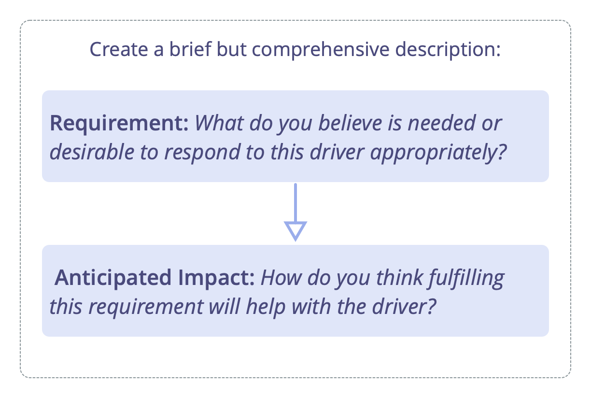
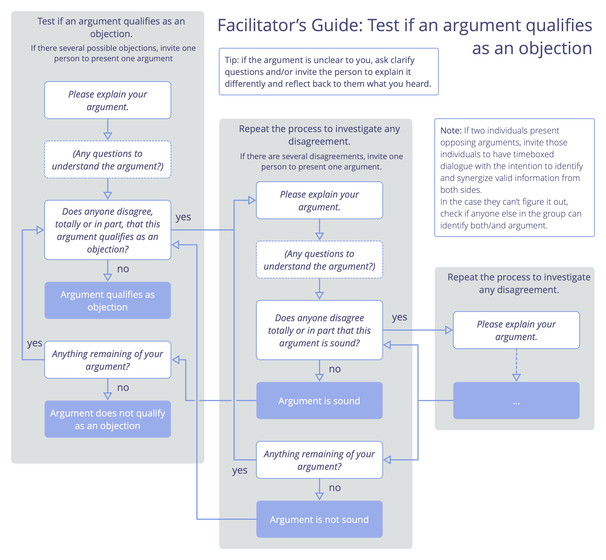
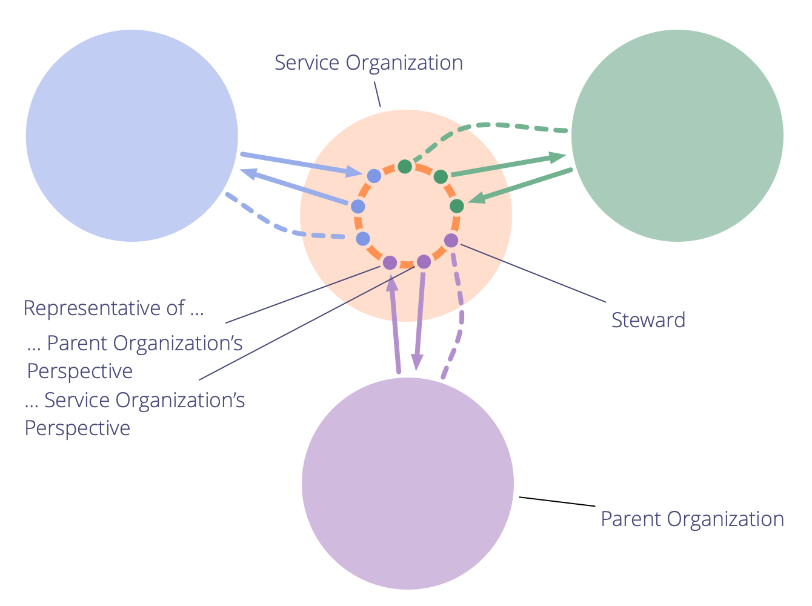
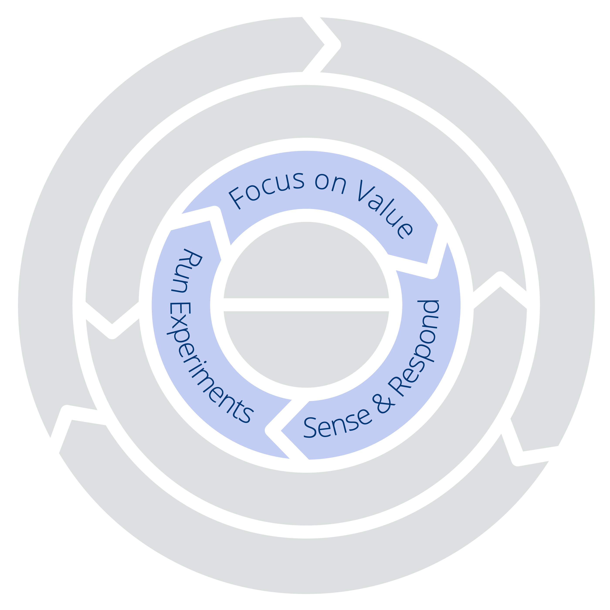
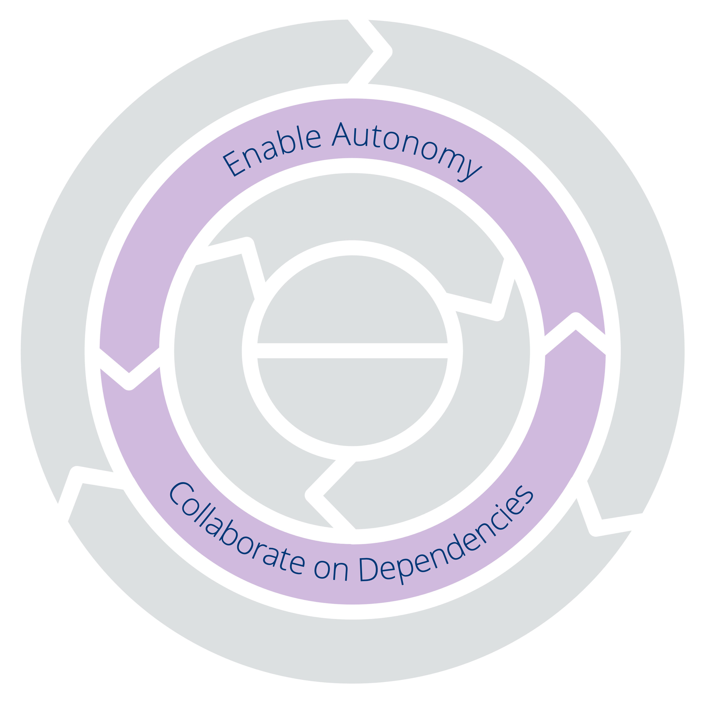

## Qu'est-ce que la Sociocratie 3.0 ?

La Sociocratie 3.0 — ou "S3" — est une <a href="glossary.html#entry-social-technology" class="glossary-tooltip" data-toggle="tooltip" title="Technologie Sociale: Tout processus, technique, méthode, compétence ou toute autre approche que les gens peuvent utiliser pour influencer les systèmes sociaux — organisations, sociétés, communautés, etc. — afin de soutenir l&#x27;atteinte d&#x27;objectifs communs et de mener des interactions et des échanges sensés.">technologie sociale</a> pour développer des organisations agiles et résilientes de toute taille, allant des petites start-ups jusqu'aux grands réseaux internationaux, ou des collaborations interministérielles.

A l'intérieur de ce guide pratique, vous découvrirez une collection complète de **concepts, de principes et de pratiques éprouvés et testés pour améliorer la performance, l'engagement et le bien-être** au sein des organisations.

Depuis leur lancement en 2015, les pratiques S3 ont aidé des persones dans un large éventail de contextes organisationnels à tirer le meilleur parti de la collaboration : des start-ups aux petites et moyennes entreprises, de grandes organisations internationales, des organisations financées par des investisseurs comme des organismes à but non lucratif, des familles et des communautés.

L'utilisation de S3 peut **vous aider à atteindre vos objectifs** et traverser des situations complexes avec succès. Vous pouvez faire des changements pas à pas, **sans nécessiter une réorganisation radicale soudaine** ni un grand plan de transformation à long terme :

-   Commencez simplement par identifier là où le besoin est le plus grand et sélectionnez quelques pratiques ou consignes qui vous aident.
-   Allez à votre rythme et développez vos aptitudes et compétences au fur et à mesure.

**Quelque soit votre position dans l'organisation**, vous découvrirez des pratiques pertinentes et utiles pour vous.

**La Sociocratie 3.0 est libre**, et sous licence Creative Commons Free Culture License.

### Comment la Sociocratie 3.0 peut m'aider ?

S3 est une technologie de transformation à la fois pour les individus et l'ensemble de l'organisation qui vous aidera à trouver comment relever les plus grands défis de votre organisation, profiter des occasions qui se présentent et résoudre les problèmes les plus tenaces.

La Sociocratie 3.0 est conçue pour être flexible et encourage l'expérimentation et l'apprentissage. Vous pouvez prendre juste ce dont vous avez besoin, adapter les choses à votre contexte et enrichir votre approche existante.

La S3 intègre des concepts de base et des pratiques que vous retrouverez dans les méthodologies agiles, le lean management, Kanban (et KMM), le Design Thinking, les organisations opales et la famille des méthodes de gouvernance basées sur la sociocratie (SCM/Dynamic Governance, Holacracy® etc.). Elle est complémentaire et compatible avec n'importe quel framework agile ou lean, comme Scrum (mais pas seulement) et ses différents frameworks de passage à l'échelle.

### Une approche pratique du changement organisationnel

La S3 présente une approche pratiques du changement organisationnel.

Une **pratique** est un processus, une façon de faire ou une ligne directrice qui sert de modèle pour répondre avec succès à un type spécifique de défi ou d'opportunité. Les pratiques S3 ont été découvertes en observant la manière dont des personnes travaillant ensemble dans des organisations résolvaient des problèmes et répondaient aux opportunités qui se présentaient à eux. Si vous trouvez que vos façons de faire ne produisent pas les résultats escomptés, vous pouvez rechercher des pratiques S3 pour vous aider.

Elles sont modulaires et adaptables. Elles peuvent être utilisées indépendamment mais se renforcent mutuellement, en se complétant si vous les combinez. Les pratiques S3 peuvent évoluer et être adaptées pour adresser vos besoins spécifiques.

Dans ce guide, les pratiques sont regroupées en onze catégories pour vous aider à identifier plus facilement celles qui vous seront utiles :

- Comprendre et Décider
- Faire Évoluer les Organisations
- Progresser entre Pairs
- Catalyser la Co-création
- Bâtir des Organisations
- Introduire la S3
- Passer des Accords
- Formats de Réunion
- Pratiques de Réunion
- Organiser le Travail
- Structurer une Organisation

Avec son menu de pratiques à la carte, la S3 encourage une **approche organique et itérative du changement sans nécessiter un énorme investissement initial**. Elle prend chacun où il se trouve et l'aide à avancer en ajoutant des pratiques à son rythme et en fonction de son contexte particulier.

### Que contient ce guide ?

À l'intérieur de ce guide pratique, vous découvrirez :

-   Des concepts utiles qui vous aideront à **donner plus de sens à votre organisation** et à communiquer efficacement sur les changements nécessaires.
-   Une **approche organique et itérative du changement** qui prend les organisations où elles sont et les aide à progresser à leur propre rythme en fonction de leur contexte et de leurs besoins uniques.
-   **Sept principes de base** de collaboration agile et sociocratique
-   Un ensemble cohérent de **plus de 70 pratiques et consignes** pour vous aider à aborder la complexité et améliorer la collaboration :
    -   **Des formats simples, facilités** qui aident les équipes à utiliser l'intelligence collective du groupe et à traiter progressivement les informations disponibles en améliorant en continu les méthodes de travail, produits, services et compétences.
    -   **Des pratiques de groupe** pour aider les organisations à faire le meilleur usage de leurs talents, en faisant en sorte que **les personnes se soutiennent mutuellement** pour développer leurs compétences, le sens des responsabilités et l'engagement.
    -   **Des outils simples pour clarifier qui fait quoi**, laissant les personnes libres de décider et d'agir autant que possible par elles-même et à l'intérieur d'un cadre clairement défini permettant d'expérimenter et de se développer.
    -   Des modèles pour **structurer votre organisation au-delà des hiérarchies** vers des réseaux flexibles et décentralisés où les flux d'informations et d'influence soutiennent directement la création de valeur.
-   Le **Framework du Sens Commun**, un outil pour comprendre les équipes et les organisations et trouver comment démarrer avec S3.
-   Un **glossaire** avec des explications pour tous les termes que vous ne connaissez peut-être pas.

Ce guide pratique est écrit et publié par les trois co-développeurs de la Sociocratie 3.0.

Fidèle à l'état d'esprit S3, ce livre restera perpétuellement en chantier évoluant au fur et à mesure que nous apprenons auprès des personnes qui expérimentent S3 dans les organisations du monde entier. Depuis que nous avons commencé en 2015, nous avons publié plusieurs mises à jour par an et nous continuerons à le faire dans les années à venir.

Même si plusieurs sections de ce livre sont succinctes et parfois peu abouties, son contenu et ses explications se sont avérés suffisant pour que de nombreuses personnes puissent débuter avec S3 et réaliser des changements positifs dans leurs organisations. Nous espérons que vous le trouverez également utile.

### Influences et historique de la Sociocratie 3.0

La signification littérale du terme **sociocratie** est "la règle des compagnons" : *socio* — du latin*socius*— qui signifie "compagnon", ou "ami", et le suffixe *-cracy* — du grec ancien κράτος (krátos) — qui signifie "puissance", ou "règle".

Le mot sociocratie remonte à 1851, quand **Auguste Comte** a suggéré d'appliquer une approche scientifique à la société : les états seraient gouvernés par un corps de scientifiques experts de la société (qu'il nommait les « sociologues »). Selon lui, ce futur, bien qu'il ne fût pas encore réalisable, était inévitable.

Quelques décennies plus tard, **Lester Frank Ward**, utilisa le mot "sociocratie" pour décrire la loi des personnes ayant des relations entre elles. Au lieu d'avoir des sociologues au centre, il voulait donner plus de pouvoir et des responsabilités aux individus, il imaginait les sociologues dans un rôle de chercheurs et de consultants.

En 1926, l'éducateur réformiste néerlandais et quaker **Kees Boeke**, établissait un pensionnat fonctionnant sur le principe de consentement. Le personnel et les élèves étaient traités comme des participants égaux à la gouvernance de l'école, toutes les décisions devaient être acceptables par tous. Il construisit cette version de la sociocratie sur les principes et les pratiques des quakers, et décrivit la sociocratie comme une évolution de la démocratie dans son essai de 1945 "La démocratie comme elle pourrait être".

**Gerard Endenburg**, également quaker et étudiant dans l'école de Boeke, voulait appliquer la sociocratie dans son entreprise familiale, Endenburg Elektrotechniek. Il créa et développa la *Méthode d'organisation par Cercles Sociocratiques (SCM)* (qui deviendra plus tard la "Méthode Sociocratique"), en appliquant la sociocratie de Boeke à l'ingénierie et à la cybernétique. En 1978, Endenburg fonda le Centre Sociocratique d'Utrecht (qui est maintenant le Centre Sociocratique de Rotterdam) afin de promouvoir la sociocratie aux Pays-Bas et au-delà. Depuis 1994, les organisations néerlandaises utilisant la SCM sont exemptées de l'obligation légale d'avoir un comité d’entreprise.

À la fin des années 1990 et au début des années 2000, plusieurs personnes non-néerlandaises découvrirent la sociocratie, mais ce n'est qu'en 2007 lorsque **Sharon Villines et John Buck** publièrent leur livre, "We the People", que la sociocratie devint largement accessible au monde anglophone, et qu'elle commença à migrer dans plusieurs autres langues.

La Sociocratie s'est avérée efficace pour de nombreuses organisations et communautés du monde entier, mais elle tarde encore à devenir virale.

En 2014 **James Priest et Bernhard Bockelbrink** se réunirent pour cocréer un corpus de ressources d'apprentissage sous licence Creative Commons, synthétisant les idées de la Sociocratie, de l’Agile et du Lean. Ils ont découvert que les organisations de toutes tailles ont besoin d’un menu flexible de pratiques et de structures – adaptées à leur contexte particulier – qui permettent d’évoluer vers une approche plus sociocratique et plus agile pour plus d’efficacité, de cohérence, d’accomplissement et de bien-être. La première version de la **Sociocratie 3.0** fût lancée en mars 2015.

**Liliana David** a rejoint l'équipe peu après. Ensemble, ils œuvrent à rendre la S3 accessible et applicable au plus grand nombre d'organisations possible et publient des ressources sous une licence **Creative Commons Free Culture License** pour ceux qui veulent apprendre, appliquer et parler aux autres de la Sociocratie 3.0.

#### Le mouvement Sociocratie 3.0

Avec l’intérêt grandissant pour la Sociocratie 3.0, une communauté de personnes d’origines diverses se développe rapidement — des consultants pionniers, des coaches, des facilitateurs d’apprentissage et des personnes qui appliquent S3 dans différents contextes — tous reconnaissent le potentiel transformationnel de la Sociocratie 3.0 pour aider les organisations et leurs membres à prospérer. Beaucoup consacrent une part de leur temps à expérimenter et échanger sur S3, et collaborent pour apprendre les uns des autres et documenter leurs expériences afin de nourrir le développement et l’évolution de la S3 et de ses applications diverses.

### Pourquoi "3.0"?

La Sociocratie comme forme de gouvernance fût évoquée dès 1851. Par la suite, elle a été développée et adaptée par de nombreuses personnes et organisations différentes, dont Gerard Endenburg, The Sociocracy Group (TSG) et Brian Robertson (HolacracyOne).

Pourtant, en dehors des Pays-Bas, la sociocratie est restée jusqu'à récemment largement inconnue.

Nous adorons la sociocratie parce que nous voyons des organisations et leurs membres prospérer lorsqu'ils en utilisent les éléments pour enrichir ou transformer leurs façons de faire.

Nous aimons aussi l'Agile, le Lean, le Kanban, les Core Protocols, la Communication Non Violente, et bien d'autres idées aussi. Nous pensons que le monde sera un meilleur endroit, à mesure que plus d'organisations apprendront à puiser dans cette corne d'abondance de pratiques fantastiques qui émergent aujourd'hui dans le monde, et qu'elles apprendront à les intégrer avec ce qu'elles savent déjà.

C'est pourquoi nous avons décidé de consacrer une partie de notre temps à développer et à faire évoluer la Sociocratie, en l'intégrant avec de nombreuses autres idées puissantes, afin de la rendre accessible et applicable au plus grand nombre d'organisations possible.

Nous croyons en l'importance d'avoir une identité forte, à une manière radicalement différente de distribuer et d'adapter la *Méthode d'organisation par Cercles Sociocratiques (SCM)* afin d'améliorer son applicabilité.

#### Le nom

Le nom "*Sociocratie 3.0*" montre à la fois le respect des origines et un pas en avant significatif.

Cela aide également à éviter la perception que nous déformerions la *Méthode d'organisation par Cercles Sociocratiques (SCM)* telle que promue parThe Sociocracy Group (TSG), le Sociocracy Consulting Group, Sociocracy For All (SoFA), Governance Alive, et plein d'autres.

#### Le nouveau modèle de distribution

*Sociocratie 3.0* utilise un modèle de distribution décentralisé. Il s'agit d'un changement de paradigme dans la manière dont la sociocratie est apportée aux gens et aux organisations, et qui parle à de nombreuses personnes.

Nous supportons la distribution "virale" à travers deux stratégies clés :

* **La Sociocratie 3.0 est ouverte :** Nous voulons encourager la croissance d’un écosystème dynamique d’applications et de variantes de la sociocratie, où les personnes partagent et discutent de leurs points de vue et des adaptations qu’ils apportent pour leur contexte spécifique. À cette fin, la Sociocratie 3.0 met l’accent sur la communication des principes sous-jacents et invite explicitement la créativité de chacun à mélanger, étendre et en adapter les éléments ses besoins.
* **La Sociocratie 3.0 est libre :** Afin de faciliter le démarrage pour les individus et les organisations, nous publions gratuitement sous licence *Creative Commons Free Culture License* des ressources permettant d'apprendre, pratiquer et enseigner *Sociocratie 3.0*. Tout le monde peut utiliser nos ressources sans notre permission explicite, même dans un contexte commercial, ou comme base pour construire ses propres ressources tant qu'elles sont partagées sous la même licence. Nous attendons et encourageons d'autres organisations, des consultants, des coachs, des facilitateurs d'apprentissage et des formateurs à suivre notre exemple et à libérer leurs ressources également.

#### Evolution de la Méthode d'Organisation en Cercles Sociocratiques

Il nous faut sans doute préciser ceci explicitement : la *Sociocratie 3.0* n'est pas spécifiquement destinée à la communauté existante des personnes qui explorent ou utilisent la *Méthode d'organisation en Cercles Sociocratique (SCM)*. La SCM est déjà bien développée et parmi ceux qui l'utilisent, beaucoup semblent en être satisfaits.

Cependant, d'après notre expérience directe, pour la plupart des organisations, la méthodologie est soit insuffisante, soit inappropriée pour répondre à bon nombre de leurs besoins. Avec la *Sociocratie 3.0* nous travaillons activement à adresser ces limitations et inadéquations en développant de nouvelles pratiques et en éliminant ce qui peut faire obstacle.

##### Réduire le risque et la résistance

La *Sociocratie 3.0* prend les organisations là où elles en sont et les emmène dans un voyage d’amélioration continue. Il n’y a pas de changement radical ni de réorganisation. La *Sociocratie 3.0* fournit un catalogue de pratiques indépendantes qu'une organisation peut amener une à une afin de gagner en efficacité. Toutes les pratiques s’appuient sur un ensemble de principes fondamentaux, de sorte qu'elles puissent facilement être adaptées à chaque contexte.

##### Passer de la vision au besoin

La *Sociocratie 3.0* se focalise moins sur la réalisation d'une vision que sur la compréhension de la réalité du moment et de ce qui est nécessaire pour atteindre les objectifs de l'organisation. Les organisations qui sont déjà centrées sur les besoins, portées par des valeurs ou centrées sur leurs clients trouvent cela naturel.

##### Réduite à l'essentiel

Lorsqu'on regarde ses normes, la *Méthode d'Organisation en Cercles Sociocratique*, peut sembler imposante et effrayante. En se concentrant sur les fondamentaux seulement, la *Sociocratie 3.0* offre un cadre plus léger pour s'adapter et construire si nécessaire.

Cela ne veut pas dire que c’est facile : choisir de puiser dans les pratiques de la *Sociocratie 3.0* nécessite de s'investir pour apprendre et désapprendre. C’est pourquoi il est important de ne piocher que ce dont vous avez besoin, car il n’est pas utile de changer les choses si ce que vous faites marche assez bien.

##### Intégration avec la pensée Agile et Lean

La *Méthode d'Organisation en Cercles Sociocratiques (SCM)* ne dit "rien" sur la façon d'organiser vos activités ni de créer une culture de collaboration étroite. De nombreuses organisations mettent déjà en œuvre ou tendent vers la pensée lean et agile dans leurs opérations et dans leur collaboration. Nous pensons que ce sont des idées puissantes, donc la *Sociocratie 3.0* est conçue pour une adoption facile dans les organisations lean et agiles.

##### Une nouvelle façon de structurer l'organisation

La structure organisationnelle selon la *Méthode d'Organisation en Cercles Sociocratiques (SCM)* est modélisée selon une hiérarchie de domaines. Nous constatons une émergence croissante d’environnements collaboratifs multi-parties prenantes et la nécessité d’une plus grande variété de modèles de structure organisationnelle. Une structure organisationnelle évolue naturellement lorsque les flux d'information et l'influence sont graduellement alignés sur le flux de valeur. La *Sociocratie 3.0* propose une variété de modèles structurels qui peuvent être combinés pour faire évoluer de manière flexible la structure de votre organisation lorsque c'est nécessaire.

## Les Sept Principes

La Sociocratie 3.0 est construite sur sept principes fondamentaux qui permettent une collaboration sociocratique et agile. Puisque les sept principes se reflètent dans toutes les pratiques, bien les comprendre facilite l'adoption des pratiques de la Sociocratie 3.0 et devient primordiale dès lors que l'on désire les adapter.

En pratiquant la Sociocratie 3.0 on comprend la valeur essentielle que ces principes fondamentaux apportent – tant aux individus qu'aux organisations – ce qui facilite leur intégration à la culture organisationnelle.

**_Le Principe d'Efficacité_ :**

***Ne consacrez du temps qu'à ce qui vous rapproche des objectifs généraux de votre organisation**, afin de faire le meilleur usage de votre temps, de votre énergie et de vos ressources limitées.*

**_Le Principe de Consentement_ :**

***Soulever, rechercher et résoudre les objections aux propositions, aux accords existants et à l'activité**, de réduire le potentiel de décisions conduisant à des conséquences indésirables et de découvrir des moyens utiles pour s'améliorer.*

**_Le Principe d'Empirisme_ :**

***Testez toutes les hypothèses sur lesquelles vous vous appuyez à l'aide d'expériences et d'évaluations en continu,** afin d'apprendre rapidement, de comprendre et d'appréhender la complexité aussi efficacement que possible.*

**_Le Principe d'Amélioration Continue_ :**

***Évaluez régulièrement vos résultats, puis apportez des améliorations progressives à ce que vous faites et à la façon dont vous le faites, en fonction de ce que vous apprendrez,** afin de vous adapter aux changements quand c'est nécessaire, et de maintenir ou d'améliorer votre efficacité au fil du temps.*

**_Le Principe d'Équivalence_ :**

***Impliquez les personnes dans la prise et l'évolution des décisions qui les affectent,** afin d'augmenter leur sens de l'engagement et de la redevabilité, et d'utiliser l'intelligence distribuée pour atteindre et faire évoluer vos objectifs.*

**_Le Principe de Transparence_ :**

***Consignez par écrit toutes les informations précieuses pour l'organisation et rendez-les accessibles à tous les membres de l'organisation, à moins qu'il n'y ait un impératif de confidentialité,** afin que chacun dispose des informations dont il a besoin pour comprendre comment faire son travail tout en contribuant efficacement à l'ensemble.*

**_Principe de Redevabilité_:**

***Réagissez lorsque c'est nécessaire, faites ce que vous avez accepté de faire et acceptez votre part de responsabilité dans  l'organisation,** afin que ce qui est à faire le soit, que rien ne soit négligé et que chacun contribue à l'efficacité et à l'intégrité de l'organisation.*

### Le Principe d'Efficacité

_**Ne consacrez du temps qu'à ce qui vous rapproche des objectifs généraux de votre organisation**, afin de faire le meilleur usage de votre temps, de votre énergie et de vos ressources limitées._

Le principe d'efficacité nous invite à réfléchir consciemment à ce que nous faisons et à comment nous le faisons. Il appelle à examiner intentionnellement à la fois les conséquences immédiates et futures de nos actions au sein de l'organisation, mais aussi son environnement élargi et le monde en général.

Rechercher l'efficacité exige d'agir en essayant de minimiser le gaspillage, d'éliminer les obstacles et, autant que possible, d'adopter des comportements qui, au fil du temps, mèneront à plus de création de valeur, en combinant notre créativité, nos ressources, notre énergie et notre temps.

#### Clarifiez le "pourquoi"

Être efficace commence par clarifier pourquoi vous voulez faire quelque chose et avoir une vague idée de ce que vous voulez réaliser. La définition de la raison pour laquelle l’organisation existe et des objectifs qu’elle tente d’atteindre aide tout le monde à mieux comprendre dans quelle direction travailler et comment contribuer de manière sensée. Sans cette clarté, il est difficile pour les individus de situer leur travail dans le contexte général. Il est également plus difficile de qualifier et de quantifier ce qui délivre de la valeur et de quelle manière.

#### Garder vos options ouvertes

Il peut y avoir de nombreuses façons de réaliser vos objectifs. Or, le premier choix ne répond pas toujours au besoin. Le temps d'apprendre à faire mieux, gardez vos options ouvertes pour ne pas rester coincé dans une mauvaise trajectoire. Évitez de converger trop tôt et adoptez une approche itérative chaque fois que vous le pouvez. Face à la complexité, essayez de vérifier rapidement vos hypothèses par des petites expériences successives. Voyagez léger pour pouvoir pivoter rapidement.

#### Soyez efficace de manière efficiente

L'efficacité consiste à atteindre le résultat souhaité, tandis que l'efficience consiste à faire les choses sans gaspiller vos efforts, vos ressources et votre temps. Il est tout à fait possible de faire la « mauvaise » chose avec efficience. Donc, avant d'optimiser par souci d'efficience, assurez-vous que le résultat est celui attendu. À ce moment-là seulement vous pourrez chercher des améliorations substantielles qui produiront le même résultat de manière plus efficiente.

#### Adoptez une vue d'ensemble, suivez, évaluez et apprenez

Guettez  de possibles effets inattendus et indésirables avant, pendant et après toutes vos interventions. Considérez les coûts directs et indirects, comme les externalités négatives, et soyez prêt à évoluer ou à modifier vos activités ou vos objectifs en fonction de ce que vous apprenez.

Le degré d'efficacité (et d'efficience) de nos actions ne peut être évalué qu'à l'aune de leurs conséquences futures dans un contexte élargi. Parfois, nos activités permettent d'atteindre les résultats attendus à court terme, mais avec des conséquences indésirables et des coûts cachés qui se révèlent à plus long terme.  Par exemple, l'agriculture industrielle à grande échelle produit des rendements énormes très efficacement. Mais à long terme, elle entraîne un appauvrissement critique des sols et une dépendance croissante aux engrais, insecticides et désherbants. Un gain à court terme qui peut engendrer un coût à long terme.

Dans des environnements complexes, il est parfois difficile de comprendre ce que signifierait l'efficacité. Recherchez la perspective des autres, même si vous prenez une décision pour vous-même.  Profitez au maximum de l'expérience et de l'expertise de votre organisation et parlez aux personnes ayant d'autres points de vue. Partager vos idées avec les autres peut vous aider à éviter des conséquences malheureuses, et à identifier des voies d'amélioration utiles.

Décidez de la façon dont vous mesurerez l’efficacité, et si vous collaborez avec les autres , développez et maintenez une compréhension commune de ce que cela signifiera. Après avoir établi un « _pourquoi_ » clair et avoir défini le résultat à atteindre, examinez comment vous mesurerez votre progression (donc l'utilité de votre action !)

L’efficacité n'est parfois apparente qu'à postériori. Soyez attentif et réfléchissez aux conséquences de vos actions, puis utilisez ce que vous apprendrez pour améliorer votre efficacité la prochaine fois.

#### Soyez attentif aux dépendances et aux contraintes

Essayez de permettre à tout le monde, y compris vous-même, d'être libre d'agir en autonomie. Officialisez les interdépendances nécessaires entre certains individus et équipes, et réunissez-vous pour co-créer et faire évoluer un système cohérent pour les gérer, afin de continuer à produire de la valeur rapidement malgré ces dépendances.

Clarifiez toutes les contraintes qui pèsent sur vos opérations. Quelles sont les attentes internes ou externes, les consignes ou les règles à suivre ? Comment les valeurs implicites ou explicites de votre organisation et le contexte élargi dans lequel vous opérez, favorisent ou contraignent les décisions et actions que vous prenez ? Dans quelles limites allez-vous opérer ? Avec qui avez-vous besoin de communiquer si vous voyez une raison de changer quelque chose, ou de faire une exception à la règle ?

#### Priorisez et choisissez judicieusement

Fixez des priorités et tenez-vous y à moins d'avoir une bonne raison de changer. Les distractions, les changements de contexte et le manque de pause et de relâchement entraîneront inévitablement des pertes.

En plus d'être clair sur ce que vous VOULEZ faire, soyez clair sur ce qu'il ne faut PAS faire et affrontez les obstacles au fur et à mesure qu'ils se présentent.

### Le Principe de Consentement

_**Soulever, rechercher et résoudre les objections aux propositions, aux accords existants et à l'activité**, de réduire le potentiel de décisions conduisant à des conséquences indésirables et de découvrir des moyens utiles pour s'améliorer._

La recherche délibérée d'objections est un moyen de puiser dans l'intelligence collective d'une organisation et de bénéficier de perpectives que nous pourrions manquer autrement. Examiner les propositions, les accords et l'activité par le prisme de différentes personnes permet d'identifier les raisons pour lesquelles procéder d'une certaine façon pourrait conduire à des conséquences indésirables, et s'il y a des moyens utiles d'améliorer les choses.

L'adoption du principe de consentement invite à un changement d'orientation dans la prise de décision, en déplaçant l'intention rechercher un accord - «_Tout le monde peut-il être d'accord avec cela?_» - vers la pratique de vérifier délibérément les objections - y a-t-il des arguments qui soutiennent que ce n'est pas assez bon, pas assez sûr, ou qu'il y a des moyens valables de l'améliorer ?

Le consentement ne signifie pas que tout le monde est activement impliqué dans la prise de toutes les décisions, car ce serait inefficace. Cela exige cependant un niveau de _transparence_ adéquat et une prise de conscience de la part des décideurs, d'informer et d'impliquer les personnes qui seraient impactées (à des degrés différents), ou d'inviter ceux qui peuvent apporter une expérience ou une expertise pertinente (voir _Le Principe d'Équivalence_).

#### Invitez le désaccord

Face à la complexité, considérer différentes perspectives, expériences et expertises est un moyen simple mais efficace de développer une compréhension commune cohérente, grâce à laquelle des décisions plus efficaces peuvent être prises.

Développer une culture qui accueille les opinions divergentes et où les gens s'appuient sur ces opinions pour découvrir toute la valeur qu'ils peuvent apporter est générateur d'engagement, de sécurité psychologique et d'adhésion  aux décisions.

#### Passez de la suprématie des personnes aux arguments solides

En comparant les paradigmes de prise de décision, la différence essentielle réside dans le lieu où le pouvoir ultime de prendre une décision est placé. Dans les systèmes autocratiques, la suprématie est assurée par un individu ou un petit groupe. Dans un système gouverné par le vote à la majorité, la suprématie dépend de la majorité (ou de ceux qui peuvent convaincre la majorité de leur position). Dans un système aspirant au consensus unanime, la suprématie incombe à quiconque décide de bloquer une proposition ou un accord existant. Dans ces trois cas, une décision est prise indépendamment du fait que le motif de ces acteurs soit aligné ou non avec l'intérêt du système.

Lorsqu'un groupe ou une organisation adopte le principe du consentement, la suprématie passe d'un individu ou groupe particulier, vers des arguments raisonnés qui révèlent des conséquences indésirables potentielles ou des moyens valables de faire mieux. De cette manière, les personnes - quelque soit leur position, leur rang, leur fonction ou leur rôle - ne peuvent pas bloquer des décisions en se basant uniquement sur une opinion, une préférence personnelle ou un rang, et elles peuvent être tenues _responsables_ dans le cas où elles le feraient. Le consentement invite tout le monde à être raisonnable, tout en laissant la place aux individus pour exprimer des perspectives, des opinions et des idées diverses.

#### Distinguez opinion ou préférence, et objections

Le consentement tire parti de l'intelligence distribuée dans une organisation, pas seulement en invitant les gens à soulever d'éventuelles _objections_, mais aussi en invitant les gens à examiner ensuite ces arguments, en éliminant ceux qui ne sont pas fondés, en faisant évoluer ceux qui s'avèrent partiellement vrais, et en révélant ceux qui sont des objections valables. Donc c'est généralement une bonne idée d'_examiner les objections_ et de n'agir que sur celles qui passent le test. Cela réduit le temps perdu à argumenter inutilement sur des opinions, des préférences personnelles ou des biais.

Les arguments qui s'avèrent des objections — du moins dans la mesure où les intervenants peuvent le dire — aident un groupe à orienter ses efforts vers des changements dans les domaines où il est nécessaire ou utile de s’adapter et de s’améliorer. L'amélioration progressive basée sur la découverte et l'apprentissage est intégrée dans le consentement et est une conséquence inévitable de l'adoption du principe.

Adopter le principe du consentement oriente la prise de décision vers l'identification d'une solution suffisamment bonne pour l'instant, et sans améliorations valables évidentes qui justifieraient d'y passer plus de temps. Cette approche est bien plus efficace que d’essayer de parvenir à un consensus unanime où l'objectif serait de répondre aux préférences et aux idées personnelles de chacun.

#### Intégrez l'apprentissage par les objections

Les objections informent les gens sur des possibilités d'amélioration. _Résoudre les Objections_ signifie typiquement faire évoluer les accords (proposés) et changer l'activité de manière à neutraliser cet argument. Parfois, cependant, après avoir considéré une objection, on peut se rendre compte que dans l'équilibre et pour une raison ou une autre, Il est plus avantageux de laisser ce qui a été objecté inchangé. En fin de compte, résoudre une objection et déterminer ce qui peut éventuellement être valable de faire, implique de peser le pour et le contre; à la fois en ce qui concerne la situation spécifique à laquelle une décision est destinée à répondre, mais aussi dans le contexte de l'organisation dans son ensemble. Dans la complexité, il n'y a généralement pas de décisions parfaites ou entièrement correctes, seulement celles qui (pour le moment au moins) semblent assez bonnes pour l'instant et suffisamment sûres pour les essayer. Souvent, tout ce qui est nécessaire est une prochaine étape suffisamment bonne  pour apprendre empiriquement et adapter et faire évoluer la décision au fil du temps.

Cette approche par apprentissage naturel et progressif s'appuie sur la diversité des connaissances, ainsi que sur l'expérience et l'expertise distribuées au sein d'une organisation. Elle aide à passer d'un paradigme enraciné dans la pensée binaire et la polarisation à un processus de synergie continu, qui, au fil du temps, favorise également de meilleures relations entre les pairs.

#### Le contrat de consentement

Adopter le principe du consentement dans une équipe, ou dans l'organisation dans son ensemble, a des répercussions sur la façon dont les gens abordent la prise de décision, le dialogue et leurs activités. Envisagez d'expliciter le contrat moral suivant, afin d'aider les membres de l'organisation à adopter et à appliquer le principe du consentement :

1. En l'absence d'objections à une proposition ou à un accord existant, je m'engage à respecter du mieux que je pourrais sur ce qui a été convenu.
2. Quand j'en prendrai conscience, je partagerai toutes objections à des propositions, des accords ou des activités en cours, avec ceux qui en sont directement responsables.
3. J’examinerai avec attention les objections aux propositions, aux accords et aux activités dont je suis responsable, et je m'efforcerai d'intégrer ces objections si je peux.
4. J'examinerai activement les accords devant faire l'objet d'une d'évaluation qui m'affectent ou dont je suis responsable afin de vérifier s'il y a des objections éventuelles à la poursuite de cet accord sous sa forme actuelle.

### Le Principe d'Empirisme

_**Testez toutes les hypothèses sur lesquelles vous vous appuyez à l'aide d'expériences et d'évaluations en continu,** afin d'apprendre rapidement, de comprendre et d'appréhender la complexité aussi efficacement que possible._

L'empirisme — fondement de la méthode scientifique — est un principe essentiel à adopter pour naviguer efficacement dans un monde complexe. Non seulement les environnements dans lesquels les organisations opèrent sont complexes, mais une organisation est en soi un système adaptatif complexe. La connaissance d'un système organisationnel et de ses interactions est souvent provisoire et fortement dépendante du contexte.

L'empirisme peut nous aider à acquérir de la certitude et à réduire nos croyances infondées afin de mieux utiliser notre temps. Lorsque nous essayons de donner du sens aux choses et d'acquérir des certitudes sur ce qui se produit, nous tirons souvent des conclusions sans vérifier si les hypothèses sur lesquelles elles sont fondées sont vraies et précises. Dans la complexité, ce que nous percevons comme une cause peut souvent se révéler être une simple corrélation ou une coïncidence, et les résultats des interventions que nous effectuons mèneront toujours à certaines conséquences imprévues.

Observer et sonder les systèmes, et utiliser l'expérimentation pour baliser une approche itérative du changement, favorise un apprentissage continu et aide une organisation à se développer continuellement afin de rester efficace et réceptive au changement.

#### Clarifiez vos hypothèses

Une hypothèse est une explication provisoire de la relation entre une cause et un effet précis qui est à la fois testable et réfutable. Elle constitue un point de départ pour des expériences qui permettront de la prouver ou de la réfuter.

Dans le contexte des organisations, vous pourriez développer des hypothèses sur la façon dont un changement d'un processus ou de la structure organisationnelle améliorerait l'efficacité ou réduirait les coûts. Ou sur la façon dont reprogrammer une réunion particulière augmenterait l'engagement, ou faire une certaine modification à un produit attirerait un nouveau segment de clients tout en gardant les clients existants heureux, etc.

Lorsque nous sommes confrontés à l'incertitude, il est utile de poser explicitement les questions et les suppositions que vous faites en décrivant une hypothèse claire qui permettra de répondre à ces questions, et de valider si vos suppositions sont exactes. Une description vague ou ambiguë rendra les hypothèses difficiles voire même impossibles à tester. De plus, essayer de tester trop d'hypothèses à la fois peut vous engager sur un chemin trop long où vous apprendrez peu choses intéressantes. Moins c'est souvent plus.

Une compétence vitale à développer lors de la conception d'expériences est la capacité de **distinguer entre les connaissances établies et les simples suppositions**. En reconnaissant ce que vous ne savez pas encore et ce que vous supposez être plus ou moins vrai, vous pouvez identifier les questions et les suppositions autour desquelles construire une hypothèse.

Dans des domaines complexes, une approche fondée sur l'hypothèse repose sur des expériences pour valider ou réfuter les hypothèses, de sorte que vous puissiez trouver des idées viables ou les réfuter rapidement. Comprendre par l'expérimentation vous permet non seulement d'atteindre plus efficacement ce dont vous avez besoin ou désiré, mais peut également vous aider à valider les suppositions que vous faites à propos des premiers objectifs à poursuivre.

#### Concevoir de bonnes expériences

Une expérience est un test contrôlé conçu pour prouver ou réfuter une hypothèse. Les expériences vous fournissent des connaissances validées sur la façon de mieux répondre aux défis et aux opportunités auxquels vous faites face. Les résultats vous donnent souvent la possibilité d'affiner votre hypothèse, ou même de développer de nouvelles hypothèses que vous pourrez ensuite tester avec d'autres expériences.

Avant de commencer une expérience, il est important de la définir et de la documenter. Dans le contexte d'une organisation, une bonne expérience consistera en une liste de ce que vous devez faire et si c'est utile, de comment le faire, ainsi qu'une liste de variables que vous allez surveiller avant, pendant et après l'expérience.

Définissez et documentez des seuils spécifiques pour la réussite et l'échec de l'expérience liée à vos variables et détaillez les dans vos critères d'évaluation. Considérez en particulier ce que vous accepteriez comme preuve que votre hypothèse est fausse. Pendant qu'une expérience est en cours d'exécution, évitez d'y apporter des modifications, et si vous changez quelque chose, documentez ces modifications, sinon vos mesures risquent de perdre du sens. Il est vital de **mesurer avant de commencer l'expérience** pour vous assurer que le seuil de réussite n'est pas déjà atteint parce que vous auriez fait une erreur dans la conception de votre expérience.

#### Traiter les décisions comme des expériences

Dans un système complexe, il est impossible de prédire comment il réagira lorsqu'un changement particulier interviendra. Pour cette raison, vous pouvez appliquer le concept d'expérimentation à la manière dont vous abordez la prise de décision. Il est intéressant de considérer toutes les décisions significatives que vous prenez en tant qu’expériences, en matière d’opérations et de gouvernance, et de documenter pour chaque chaque cas,  les résultats attendus et les critères d'évaluation prévus. Prenez une décision à la fois, en partant de là où cela vous semble le plus approprié ou logique puis faites évoluer ces décisions itérativement, en fonction de ce que vous apprendrez à chaque étape.

### Le Principe d'Amélioration Continue

_**Évaluez régulièrement vos résultats, puis apportez des améliorations progressives à ce que vous faites et à la façon dont vous le faites, en fonction de ce que vous apprendrez,** afin de vous adapter aux changements quand c'est nécessaire, et de maintenir ou d'améliorer votre efficacité au fil du temps._

Alors que les principes d'_Empirisme_ et de _Consentement_ nous offrent des opportunités d'apprendre, le principe d'Amélioration Continue est lié à ce que nous faisons avec ce que nous apprenons. L'Amélioration Continue s'applique à la manière dont nous menons nos opérations, mais aussi à la gouvernance. Tout depuis l'évolution des stratégies, des politiques, des processus et des consignes, jusqu'au développement des produits, des services, des aptitudes et des compétences, les attitudes et le comportement, les valeurs et les outils choisis,  tout peut être amélioré en permanence.

#### Adoptez une approche du changement itérative

Une évolution progressive est souvent plus efficace et durable qu'une révolution qui n'est vraiment utile que dans les cas où vous ne parvenez plus à améliorer un système qui le nécessite. Changer trop de choses en même temps dans un système peut créer un désordre qu'il est difficile de corriger, surtout dans un environnement complexe. Il est souvent difficile de mesurer efficacement les conséquences de grands bouleversements et la relation de cause à effet en sera particulièrement difficile à établir dans la complexité.

Changez les choses par petits incréments successifs à chaque occasion d'apporter une amélioration utile. Cela réduira considérablement la nécessité d'une intervention de grande ampleur. Vous vous adapterez ainsi mieux aux changements de votre environnement. Vous maintiendrez aussi plus facilement vos systèmes alignés à la raison d'être de votre organisation. Et vous limiterez plus facilement le risque que les choses ne se retrouvent dans un état qu'il est coûteux voire impossible de réparer.

**Même quand un grand changement est nécessaire, allez-y pas à pas**, déterminez comment les choses devraient être et **ajustez ce que vous faites en fonction de ce que vous apprenez**. Avec de petits changements, les hypothèses peuvent être testées rapidement et les défaillances sont plus gérables. Quand une petite expérimentation échoue, vous pouvez si nécessaire, utiliser rapidement  ce que vous venez d'apprendre pour mener une meilleure expérimentation. Mais lorsque c'est une grande expérimentation qui échoue, beaucoup de temps et d'efforts auront été dépensés sans nécessairement avoir appris grand-chose.

Sachez que si vous faites plusieurs changements en même temps, vous ne serez peut-être pas en mesure de déterminer lequel d'entre eux mène aux effets que vous observez. Donc **préférez un seul ou peu de changements simultanés**.

#### Surveillez, mesurez et changez les choses en fonction de ce que vous apprenez

**Définissez les _résultats attendus_** par un changement et soyez clair sur la façon dont vous évaluerez ce qui se passera. Lorsque vous apportez des changements, soyez clair sur les spécificités de ce que vous voulez améliorer. Quelles conséquences positives voulez-vous amplifier et quelles conséquences négatives voulez-vous atténuer ?

**Surveillez les conséquences de vos actions** et réfléchissez à ce que vous apprenez. Soyez attentif à ce qui se passe réellement et veillez à ce que les résultats de vos interventions reflètent vos hypothèses et vos intentions. Cela vous aidera à contrôler si vos changements ont conduit ou non à des améliorations.

Rappelez-vous que même si parfois les choses ne se passent pas comme attendu, cela ne signifie pas nécessairement que les résultats sont négatifs. Parfois, les choses ne se déroulent pas selon nos hypothèses ou nos intentions. Mais tous les résultats sont des opportunités d'apprendre. **Soyez donc ouvert à tout ce qui surviendra**. Analysez les avantages et les inconvénients de toute conséquence inattendue qui surviendrait. Et sachez reconnaître lorsqu'il est bénéfique de procéder autrement, ou de modifier vos attentes.

### Le Principe d'Équivalence

_**Impliquez les personnes dans la prise et l'évolution des décisions qui les affectent,** afin d'augmenter leur sens de l'engagement et de la redevabilité, et d'utiliser l'intelligence distribuée pour atteindre et faire évoluer vos objectifs._

L'équivalence est importante dans les systèmes organisationnels, précisément parce que les gens ne sont pas égaux les uns aux autres de diverses manières et selon le contexte.

L'équivalence augmente l'engagement en donnant aux personnes impactées par certaines décisions la possibilité de les influencer dans une certaine mesure.

En impliquant les personnes impactées dans la prise et l'évolution d'une décision, elles acquièrent une compréhension plus profonde de cette décision, de la situation associée, ainsi que les pour et les contre qui ont été pesés dans le processus. Il est également utile de garder les systèmes suffisamment ouverts et transparents car cela réduit le risque que des informations vitales aient été négligées ou ignorées. Selon leur niveau d'implication, les gens devraient également avoir la possibilité de façonner les choses selon leur préférence. Dans tous les cas, participer à la prise de décision conduit à un plus grand sentiment d'adhésion à ce qui est décidé.

Les personnes sont plus susceptibles de prendre la responsabilité de suivre les décisions lorsqu'elles ont été impliquées dans la prise de ces décisions. Ce sentiment se renforce lorsque les parties concernées ont une influence sur l'adaptation ultérieure d'une décision, si elles découvrent qu'elle n'est plus suffisante, ou si elles trouvent un moyen d'améliorer quelque chose.

Les décisions que nous développons ensemble seront toujours «_nos décisions_», tandis que les décisions prises par d'autres, seront toujours '_leurs_'  décisions et seront plus ou moins appréciées et soutenues par les autres, en fonction de leurs préférences personnelles et de leur point de vue.

Certaines décisions affectent un grand nombre de personnes, par exemple un département entier ou même l'organisation dans son ensemble. Inclure les personnes affectées dans le processus de décision produira des avantages qui vont bien au-delà de la décision en question. Les gens établiront des liens, de la confiance et un plus grand sens de la communauté et un sentiment d'appartenance. Pour impliquer efficacement un grand nombre d'intervenants dans le processus de décision, vous pouvez utiliser un ensemble de techniques de facilitation de groupe et d'outils en ligne.

#### Déléguez la responsabilité et le pouvoir d'influencer

Pour devenir ou rester efficaces, les organisations de toute taille ont intérêt à distribuer le travail, ainsi que le pouvoir d'influencer les décisions relatives à ce travail dans l'ensemble de l'organisation. Cela aide à éliminer les dépendances inutiles afin que les gens puissent créer de la valeur sans entrave, sans se retrouver bloqués par une hiérarchie qui décide ou par des éléments introduits par des personnes trop éloignées du travail.

Pour les questions qui concernent un grand nombre de personnes, il est logique de déléguer la responsabilité de l'élaboration et de l'évolution des accords à un groupe plus petit disposant de l'expérience et de l'expertise nécessaires et qui peut ensuite informer et consulter d'autres personnes au sein de l'organisation durant leur processus décisionnel. Avec une transparence adéquate et en informant de manière proactive les personnes impactées par les décisions, d'éventuelles objections peuvent être rapidement identifiées, qualifiées et résolues. Ainsi, l'équivalence permet de déléguer des responsabilités aux individus ou à de petits groupes, tout en laissant le système capable de découvrir et de puiser dans l'intelligence collective de toutes les personnes impliquées.

La rotation périodique de ceux qui mènent les prises de décisions contribue à renforcer la confiance, la responsabilité et une compréhension plus largement partagée du contexte dans lequel les décisions sont prises parce qu'un nombre croissant de personnes gagnera de l'expérience dans ce rôle.

#### Considérez qui doit être impliqué et comment

Tous les membres d'une organisation sont influencés dans une certaine mesure par toutes les décisions, car chaque décision aura un impact sur l'ensemble de l'entreprise. L’équivalence dans la prise de décision ne signifie pas que tout le monde doit être impliqué dans chaque décision. Cela ne signifie pas non plus que chacun doit avoir la même influence dans tous les contextes où il est affecté. L'équivalence signifie que les personnes impactées par les décisions sont au moins en mesure d'influencer ces décisions, sur la base d'arguments révélant des conséquences indésirables pour l'organisation ou des moyens pour améliorer les choses. En d'autres termes, l'exigence minimale d'équivalence est d'entendre et de prendre en considération toutes les objections potentielles présentées par les personnes impactées par les décisions et de résoudre ces objections.

Le degré d'implication utile dépend du contexte. D'un côté, il pourrait suffire que les décisions qui affectent d'autres personnes soient prises initialement par une personne ou un groupe plus restreint et que ces décisions soient ensuite examinées à la lumière des objections formulées par les personnes se trouvant impactées. De l'autre côté, l’équivalence pourrait se manifester comme un processus pleinement collaboratif où les personnes concernées participent à la prise de décision de bout en bout. Une voie intermédiaire est une approche participative permettant de tenir les gens informés du progrès et invite à des commentaires spécifiques à diverses étapes du chemin.

L'équivalence doit être équilibrée avec l'_Efficacité_, la _Transparence_ et contrainte par  le _Consentement_, pour qu'elle fonctionne au mieux. Il est important de bien peser le degré de participation par rapport au coût en termes de ressources, d'énergie et de temps.

For any decision of significance it's good to ask yourself who, if anyone, should be involved, and to what degree? Considérez ceux qui seront directement ou indirectement touchés et ceux qui auront la responsabilité d’agir sur ce que vous décidez. Bien que ce ne soit pas directement lié à l'équivalence, il pourrait également être prudent de tenir compte de ceux qui ne sont pas manifestement impactés par une décision, mais qui pourraient contribuer de leur influence, leur expérience et leur expertise.

#### Rendez les informations nécessaires disponibles

Pour que les personnes puissent contribuer de manière efficace, elles doivent avoir accès aux informations pertinentes relatives à la décision en question. Il est utile de mettre au point un système permettant de visualiser les décisions importantes et de les diffuser aux autres. La possibilité et la visibilité d'un dialogue ouvert sur ce qui se passe dans l'organisation aident à construire une compréhension partagée, qui, à son tour, contribue à des prises de décisions plus efficaces.

#### Investissez dans l'apprentissage et le développement

En impliquant des personnes dans le processus de décision, elles ont l'opportunité de mieux apprendre à distinguer les objections des préoccupations, des opinions ou des préférences - et cela les aide à contribuer aux décisions de manière plus significative et plus efficace. Mettez en place des moyens de rassembler toutes les objections potentielles que les gens soulèvent et développez un système pour les rendre facilement accessibles aux personnes directement responsables de la prise et de l'évolution de ces décisions.

Dans le cas où certaines personnes sont régulièrement responsables de conclure et de faire évoluer des accords communs, investissez dans le développement des aptitudes et compétences nécessaires. Cela inclut les compétences de base en communication et la maîtrise dans les processus de prise de décision que vous utilisez.

#### Invitez l'influence extérieure

Certaines prises de décision seront meilleures en faisant appel à des perspectives et expertises variées. Lorsque vous cherchez des personnes qui ont une perspective utile à apporter, considérez l'organisation au sens large et votre environnement extérieur aussi. Qui possède une expertise ou une expérience précieuse ailleurs dans l'organisation, et qui sont vos clients, vos investisseurs et autres parties prenantes? Toutes ces personnes sont impactées d'une certaine manière par les conséquences des décisions que vous prenez. En plus de vous montrer ouvert à leurs suggestions et leurs points de vue,  solliciter activement leur avis ou les impliquer dans certaines prises de décisions vous montrera parfois de meilleurs moyens d'atteindre vos objectifs.

### Le Principe de Transparence

_**Consignez par écrit toutes les informations précieuses pour l'organisation et rendez-les accessibles à tous les membres de l'organisation, à moins qu'il n'y ait un impératif de confidentialité,** afin que chacun dispose des informations dont il a besoin pour comprendre comment faire son travail tout en contribuant efficacement à l'ensemble._

La transparence au sein d'une organisation aide les gens à comprendre ce qui se passe, à s'attendre et à comprendre pourquoi les choses sont faites ainsi. Elle réduit l'incertitude, maintient la confiance et l'honnêteté et favorise la responsabilisation.

Une transparence adéquate signifie que les personnes ont un accès direct à l'information dont elles ont besoin, ou qu'elles savent au moins où aller ou à qui demander pour y avoir accès. La transparence aide chacun à comprendre quand décider et agir de façon sûre et efficace pour soi et quand impliquer d'autres personnes dans les dépendances partagées.

La transparence nous aide à apprendre les uns des autres, et ensemble. Elle aide à réduire le risque que de petits problèmes ne s'aggravent puisqu'elle nous permet de repérer plus rapidement les erreurs et les conséquences négatives imprévues.

La transparence facilite le développement et le maintien  en continu d'une organisation apprenante cohérente et adaptative. Avoir accès à l'information pertinente nous aide à identifier rapidement les besoins et les changements importants et à réagir rapidement.

#### Clarifiez la motivation pour la transparence

La transparence est un moyen, pas une fin en soi, Donc, si vous cherchez à accroître la transparence de votre organisation, prenez le temps de clarifier les raisons pour lesquelles vous êtes en train de le faire. Quels sont les défis que vous essayez de relever en introduisant plus de transparence et/ou quelles sont les opportunités que vous souhaitez poursuivre ?

Introduisez plus de transparence dans votre organisation comme un moyen de soutenir l'apprentissage et de libérer les gens, et non comme un moyen de les contrôler. Utilisez-la comme moyen d'améliorer la performances et évitez de laisser les gens se sentir en danger de faire quoi que ce soit parce qu'ils appréhendent d'être surveillés. La transparence peut favoriser la co-création et l'innovation, mais dans un contexte où l'échec est perçu négativement plutôt qu’une opportunité d’apprendre, cela entravera la volonté des gens de prendre des risques et d’expérimenter.

#### Considérez les raisons de confidentialité

Soyez clair sur les informations qui ne sont pas à partager. Bien que le secret puisse être associé à des affaires illicites ou douteuses, il existe de nombreuses raisons légitimes de protéger la confidentialité au sein des organisations.  Parfois, le secret est nécessaire comme pour la protection des données personnelles, la sécurité des actifs ou la protection de la propriété intellectuelle qui aide une organisation à atteindre ses objectifs.

#### Identifiez quelles informations sont précieuses à consigner et à partager

Réfléchissez bien aux informations qu'il vaut la peine de consigner. Les informations qui valent la peine d'être consignées comprennent généralement :

-   les décisions qui ont été prises, ainsi que les informations sur lesquelles elles ont été fondées, qui les a prises et les raisons pour lesquelles elles ont été prises
-   toute information qui aide les gens à prendre des décisions efficaces, telles que des détails sur le contexte, les possibilités explorées et toute contrainte importante
-   les informations qui aident à évaluer les progrès et les résultats, y compris les critères d'évaluation, les indicateurs, descriptions des résultats attendus et détails de toutes les hypothèses sur la base desquelles des décisions sont prises
-   les informations qui réduisent l'incertitude et soutiennent le développement de la confiance, comme les finances et les plans futurs
-   les perspectives et apprentissages utiles
-   les compte rendus de réunion

#### Créez et maintenez un système cohérent pour consigner les informations

Documenter les informations pertinentes d'une manière cohérente et accessible est une tâche continuelle et tous les acteurs de l'organisation y jouent leur rôle. La mise au point d'un système de documentation et de partage de l'information et son maintien à jour prend du temps et des efforts. Choisissez des outils qui facilitent la création, la mise à jour et les références croisées, ainsi que la recherche et la récupération d'informations quand c'est nécessaire. Indiquez clairement quelles informations sont consignées et mises à jour, par qui et quand, et structurez les registres en conséquence. Prenez le temps de vérifier régulièrement vos registres, de vous assurer que votre système reste utile et de conserver des archives à titre de référence.

### Le Principe de Redevabilité

_**Réagissez lorsque c'est nécessaire, faites ce que vous avez accepté de faire et acceptez votre part de responsabilité dans  l'organisation,** afin que ce qui est à faire le soit, que rien ne soit négligé et que chacun contribue à l'efficacité et à l'intégrité de l'organisation._

Chaque fois que nous faisons partie d'un système, (ex : une organisation, une communauté, une famille ou un état) la conséquence de nos actions ou de notre inaction aura un impact sur d'autres personnes dans ce même système pour le meilleur ou pour le pire. Nous portons donc une certaine responsabilité pour le bien-être du système.

En particulier, lorsque nous choisissons de faire partie d'une organisation, nous entrons dans une relation transactionnelle avec d'autres, où nous pouvons nous attendre à recevoir quelque chose en échange de la prise en charge d'un ou de plusieurs besoins spécifiques de l'organisation.

La promesse que nous faisons d'assumer la responsabilité des choses qui doivent être faites, crée une dépendance entre nous et ceux qui dépendent de la réalisation de cette promesse.

#### Reconnaissez le partage de redevabilité

Les conséquences de notre action ou de notre inaction affecteront l'organisation d'une certaine manière. Ainsi, en devenant membre d'une organisation, nous assumons une certaine responsabilité pour le bien-être de l'ensemble. De nombreuses responsabilités au sein d'une organisation sont difficiles à anticiper, indéfinies et non déléguées. Par conséquent, lorsque les membres d'une organisation reconnaissent qu'ils _partagent la redevabilité_ pour l'ensemble de l'organisation, ils sont plus enclins à progresser, à prêter attention aux problèmes importants et à assumer des responsabilités si nécessaire. Les problèmes et les opportunités sont plus susceptibles d'être reconnus et traités et vous réduisez le risque de développer une culture du "regarder ailleurs", ou pire, une culture du blâme.

En général, de nombreuses responsabilités sont réparties dans une organisation par _délégation_, ce qui signifie que les gens assument la responsabilité d'un travail précis et des décisions associées. Chaque fois qu'une responsabilité est déléguée par une partie (le <a href="glossary.html#entry-delegator" class="glossary-tooltip" data-toggle="tooltip" title="Délégant: Un individu ou un groupe déléguant la responsabilité d&#x27;un domaine à autrui.">délégant</a>) à une autre partie (le <a href="glossary.html#entry-delegatee" class="glossary-tooltip" data-toggle="tooltip" title="Délégué: Un individu ou un groupe acceptant la responsabilité d&#x27;un domaine qui lui est délégué, devenant un porteur de rôle ou une équipe.">délégué</a>), la redevabilité des résultats est partagée entre les deux parties. Cela est dû au fait que les choix et les actions  (ou l'inaction) des deux parties auront un impact sur les résultats. En outre, le délégant est responsable de sa décision de déléguer ses responsabilités ainsi que du choix du délégué.

Bien qu'il soit généralement productif pour les délégués de décider eux-mêmes comment prendre en charge leur  <a href="glossary.html#entry-domain" class="glossary-tooltip" data-toggle="tooltip" title="Domaine: Une zone de responsabilité et d&#x27;autorité bien délimitée au sein d&#x27;une organisation.">domaine</a>, une communication régulière entre le délégant et les délégués donne une perspective plus large, ce qui permets du développement stratégique et de travailler efficacement.

Lorsque les gens se considèrent responsables uniquement des choses qui ont un impact sur leur sphère de responsabilité immédiate, beaucoup de choses qui requièrent de l'attention mais qui n'ont été déléguées à personne en particulier, ou qui semblent être le problème de quelqu'un d'autre à résoudre, sont manquées.

Chaque fois que vous voyez un problème important, assurez-vous qu'il est pris en charge, soit en le portant à l'attention de ceux qui le traiteront, soit en le traitant vous-même.

#### Rendez explicite la hiérarchie des redevabilités

La plupart des organisations ont une hiérarchie de délégation et donc, une hiérarchie des redevabilités. Cela signifie que la redevabilité d'atteindre les résultats est distribuée à travers l'organisation, alors que la redevabilité globale de l’intégrité de l’organisation incombe à quiconque est porteur de la responsabilité légale. De nos jours, dans de nombreuses organisations, cela renvoie généralement à la hiérarchie de la direction, là où se trouve le patron. Cependant, dans d'autres contextes, comme une communauté, la redevabilité globale incombe à tous ceux qui sont impliqués.

Quel que soit votre contexte organisationnel, rendre explicite la hiérarchie des redevabilités est utile car cela révèle la relation entre le délégué et les délégués.

#### Passez du "tenir pour responsable" à l'auto-responsabilisation

Le principe de la redevabilité s'applique à tous. Il promeut une transition de "être tenu responsable par quelqu'un" -  qui mène souvent à une culture de la peur et du blâme -  vers une culture de l'auto-responsabilisation où chacun reconnaît l'impact de ses actions et de son inaction sur les autres, et sur le système dans son ensemble, et agit en conséquence. Dans vos relations avec les autres, il s'agit de prendre et de respecter vos engagements, gérer les attentes, faire ce que vous avez convenu et en répondre quand vous ne le faites pas.

#### Créez des conditions qui permettent à la redevabilité de prospérer

Il ne suffit pas de clarifier ce que les gens peuvent et ne peuvent pas faire pour encourager une culture où la redevabilité est acceptée. En fait, en soi, cela peut avoir l'effet inverse. Pour augmenter le niveau d'auto-responsabilisation dans une organisation, il y a plusieurs facteurs qui peuvent aider :

-   **Implication** : plus les gens sont capables d'influencer les décisions qui les impactent, plus ils se les approprient, et plus il y a de chances qu'ils se sentent redevables des résultats (voir aussi : _Le principe d'équivalence_)
-   **Accès à l'information**: quand les gens ont la possibilité de savoir ce qui se passe au sein de l'organisation et pourquoi certaines décisions sont prises, ils peuvent comprendre comment mieux contribuer à l'ensemble en étant un membre participant activement et élégamment à l'organisation (voir aussi: _Le Principe de Transparence_)
-   **Le droit au désaccord** : lorsque les gens sont libres d'exprimer leurs opinions et d'apprendre à écouter et exprimer leur désaccord de manière constructive, l’organisation peut compter sur plus de perspectives, d’expériences et d’expertise, et les gens se sentent plus en sécurité psychologique et en contrôle (voir aussi : _Le principe de Consentement_)

#### Rendez explicites les responsabilités implicites

Lorsque les responsabilités ne sont pas claires, cela peut conduire à des suppositions erronées sur qui est responsable de quoi, à du travail en double, à dépasser certaines limites importantes ou à de l'inaction face à des situations importantes. En même temps, en clarifiant les responsabilités, il est important d’éviter de d'imposer trop de contraintes aux gens, car cela limite leur capacité à prendre des décisions importantes, à innover et à agir. Cela réduit leur volonté d'accepter la redevabilité.

Trop de spécificité ou trop d'ambiguïté sur le champ d'application de l'autorité que les gens ont à influencer peut entraîner des hésitations et des gaspillages. Et dans le pire des cas, cela peut mener à ce que des choses importantes ne soient pas traitées du tout.

_Clarifier les domaines_ fournit un moyen de délimiter explicitement les domaines de responsabilité et de définir où se trouve la limite de l'autonomie des personnes.

#### Encourager l'auto-responsabilisation

Pour encourager une culture de forte auto-responsabilisation, créez un environnement où chacun peut assumer volontairement les responsabilités suivantes :

-   Agissez selon les contraintes des accords régissant vos domaines de responsabilités, qu'ils concernent l'organisation elle-même, vos équipes ou vos rôles.
-   Agissez conformément aux valeurs organisationnelles qui sont explicitement définies.
-   Soyez transparent et proactif en communiquant avec ceux avec qui vous partagez la redevabilité, si vous vous rendez compte que ce que vous avez accepté n'est pas la meilleure façon d'agir.
-   Trouvez d'autres personnes qui peuvent vous aider si vous découvrez que vous n'êtes pas en mesure de vous occuper de vos responsabilités.
-   Enfreignez les accords lorsque vous êtes certain que le bénéfice pour l'organisation l'emporte sur le coût d'attendre de modifier d'abord cet accord. Et assumez la responsabilité de toutes les conséquences, y compris en contactant le plus rapidement possible les personnes impactées.
-   Faites le savoir si vous n'êtes pas d'accord avec quelque chose ou si vous pensez qu'il peut être amélioré de manière intéressante, en soulevant des objections potentielles dès que vous en aurez pris connaissance.
-   Soyez proactif en répondant à des situations qui pourraient aider ou nuire à l'organisation, soit en les traitant vous-même, soit en trouvant les personnes qui le peuvent, et en leur faisant savoir.
-   Essayez de votre mieux, à la fois par le travail que vous accomplissez et par la manière dont vous coopérez ou collaborez directement avec les autres.
-   Prenez la responsabilité continuelle de votre formation et de votre développement, et aidez les autres à faire de même.

## Concepts clés pour comprendre les organisations

Dans cette section, vous apprendrez les concepts clés suivants :

- Driver et Exigence
- Domaine
- Accord
- Objection
- Gouvernance et Opérations

Vous découvrirez également comment ces concepts se rapportent à la valeur (et au gaspillage), à la délégation (et à la responsabilité), à l'auto-organisation, à l'auto-gouvernance et à la semi-autonomie.

Lorsque les gens comprennent ces concepts, cela leur donne un langage commun pour décrire clairement ce qui se passe au sein de l’organisation. Cela contribue à accroître la compréhension partagée et permet un dialogue constructif sur ce qui doit être fait.

Si vous ne comprenez pas l'un de ces termes, consultez notre glossaire à la fin.

### Moteurs Organisationnels et Exigences

_Un **moteur organisationnel** désigne une situation perçue par les membres de l'organisation comme méritant une réponse, car ils anticipent un bienfait pour l'organisation (création de valeur, réduction du gaspillage ou atténuation des risques aux conséquences indésirables)._

_Une **exigence** est un besoin ou un désir jugé nécessaire pour répondre de manière adéquate à un moteur organisationnel, ou jugé comme une prochaine étape utile._

#### Aperçu

Identifier et interagir dans des situations qui justifient une sorte de réponse est un aspect fondamental du quotidien de chacun dans une organisation.

Dans le contexte de la Sociocratie 3.0, l'_efficacité_ est un principe clé qui invite les membres d'une organisation à faire le meilleur usage de leurs ressources, de l'énergie et du temps en consacrant des efforts à ne faire que ce qui rapproche l'organisation de la réalisation de ses objectifs généraux. Pour bien réaliser sur quoi il est important de se concentrer, et une meilleure compréhension partagée de ce qui est bénéfique de faire ou de ne pas faire, nous utilisons les concepts de _Moteurs Organisationnels_ et d'_Exigences_.

Penser et décrire ses moteurs organisationnels et ses exigences permet :

- d'identifier les situations qui suggèrent d'agir (**ressentir)**
- de déterminer si et pourquoi une situation mérite une réponse (**comprendre**)
- de déterminer l'orientation et l'ampleur d'une réponse adéquate à la situation (**décider**)

#### Moteurs Organisationnels

Identifier et comprendre des situations qui présentent des obstacles ou des opportunités potentielles par rapport aux objectifs d'une organisation est important si nous voulons cheminer avec succès dans notre travail quotidien et faire le meilleur usage de nos ressources, de notre énergie, et de notre limités.

Cependant, toutes les situations qui incitent les membres d'une organisation à agir ne sont pas forcément pertinentes pour celle-ci. Avec le concept de moteurs organisationnels, nous donnons un nom à ces situations que les membres de l'organisation explorent et déterminent comme pertinentes à adresser car ils prévoient que cela sera bénéfique pour l'organisation - soit pour générer de la valeur, éliminer du gaspillage ou pour éviter certains risques ou conséquences indésirables.

Comprendre les situations qui surviennent au cours du travail quotidien et déterminer si elles sont pertinentes à traiter, avant de décider comment y répondre, a les **bienfaits évidents** :

- Une compréhension claire et précise d'une situation qui nécessite une intervention, **aide les gens à développer une meilleure idée de ce qu'il est nécessaire de traiter**. Un problème bien défini est un problème à moitié résolu (voir _Répondre aux Moteurs Organisationnels_)
- Exprimer clairement un moteur permet de **mieux communiquer** avec les autres et de **construire une compréhension partagée** de la situation et de son impact pour l'organisation (voir _Décrire les Moteurs Organisationnels_).
- Penser aux moteurs organisationnels aide les gens à réfléchir, à **comprendre et à communiquer sur les raisons pour lesquelles ils font ce qu'ils font**. Cela donne un moyen d'explorer et de rendre explicites les raisons de nos actions et de nos décisions et nous aide à comprendre **pourquoi nous sommes motivés à poursuivre certains buts et objectifs précis**.
- Étudier les situations et leur pertinence avant d'agir aide à déterminer si et quand une intervention est nécessaire. En effet, les gens peuvent se tromper, que ce soit dans leur interprétation des faits ou dans leur évaluation de l'importance de la situation (voir _Naviguer par Tension_).
- Être clair sur les raisons pour lesquelles vous faites des choses permettra **d'évaluer régulièrement les résultats** de vos actions et d'identifier des moyens d'améliorer votre approche. (Lorsque vous le faites, vérifiez également si le moteur organisationnel a changé : si la situation est différente ou si sa pertinence pour l'organisation a changé.)

Déterminer si une situation constitue un moteur organisationnel dépend d’une compréhension claire du but global de l’organisation (son <a href="glossary.html#entry-primary-driver" class="glossary-tooltip" data-toggle="tooltip" title="Moteur Principal: Le moteur principal d&#x27;un domaine, auquel les personnes responsables de ce domaine répondent.">moteur principal</a> son  <a href="glossary.html#entry-requirement" class="glossary-tooltip" data-toggle="tooltip" title="Exigence: Un besoin ou un désir jugé nécessaire pour répondre de manière adéquate à un moteur organisationnel, ou jugé comme une prochaine étape utile.">exigence</a> principale, sa <a href="glossary.html#entry-strategy" class="glossary-tooltip" data-toggle="tooltip" title="Stratégie: Une approche générale définissant comment créer de la valeur pour s&#x27;occuper avec succès d&#x27;un domaine.">strategie</a>, ses <a href="glossary.html#entry-objective" class="glossary-tooltip" data-toggle="tooltip" title="Objectif: Un résultat (particulier) qu&#x27;une personne ou une équipe ou une organisation veut atteindre; une cible ou un objectif.">objectifs</a>, ses <a href="glossary.html#entry-values" class="glossary-tooltip" data-toggle="tooltip" title="Valeurs: Principes importants qui guident le comportement. A ne pas confondre avec “valeur“ (singulier) dans le contexte d&#x27;un moteur.">valeurs</a>, ses <a href="glossary.html#entry-agreement" class="glossary-tooltip" data-toggle="tooltip" title="Accord: Une ligne directrice, un processus ou protocole convenus pour guider le flux de valeur.">accords</a>, et.). Une fois qu'il est établi que répondre à une situation particulière serait bénéfique pour l'organisation, elle se qualifie comme moteur organisationnel et peut ensuite être priorisé en conséquence. Une telle diligence fait en sorte que les gens restent concentrés sur les défis et les possibilités qui sont pertinents pour les buts et les objectifs de l'organisation.

##### Relations entre les moteurs organisationnels

Tous les moteurs organisationnels découlent de la décision de répondre au moteur principal de l'organisation et de remplir son exigence principale. La décision de répondre à un moteur révèle souvent des étapes, des obstacles et des opportunités nécessaires qui doivent être pris en charge. Pour décrire la relation entre les moteurs organisationnels, nous utilisons les termes <a href="glossary.html#entry-subdriver" class="glossary-tooltip" data-toggle="tooltip" title="Sous-moteur: Un sous-moteur découle d&#x27;un autre moteur (le super-moteur) et est essentiel pour y répondre efficacement.">Sous-moteur</a> et <a href="glossary.html#entry-superdriver" class="glossary-tooltip" data-toggle="tooltip" title="Super-moteur: Un moteur dont découlent un ou plusieurs sous-moteurs. Voir Sous-moteur.">Super-moteur</a>.

##### Moteurs, Valeur et Gaspillage

En adoptant les concepts de valeur et de gaspillage dans les organisations, de nombreuses pratiques et idées provenant de la production lean et du développement de logiciels lean sont immédiatement applicables pour les organisations qui utilisent les pratiques S3, comme la Méthode Kanban, ou la Cartographie de la Chaîne de Valeur

Les deux concepts peuvent être expliqués par rapport aux moteurs :

_La **valeur** est l'importance ou l'utilité de quelque chose lié à un moteur._

_Le **gaspillage** désigne tout ce qui est superflu ou qui entrave une réponse efficace à un moteur._

Il existe de nombreuses recherches sur le concept de valeur et de gaspillage dans les organisations. Nous vous encourageons à explorer cela par vous-même.

#### Exigences

Clarifier intentionnellement et explicitement la direction générale et l'ampleur de la réponse à un moteur _avant_ de décider quelles mesures spécifiques prendre, aide à identifier des solutions plus spécifiques et plus adaptées, en particulier dans des situations complexes.

Avoir une attitude orientée solutions est très apprécié dans les organisations. Cependant, dans les contextes collaboratifs, fixer des idées précises trop rapidement peut étouffer la créativité et entraîner des tensions et des conflits inutiles. Lorsqu'on est chargé de répondre à un moteur organisationnel, sauter immédiatement à des solutions concrètes peut restreindre ou diminuer le champ des possibilités envisagées. En outre, des solutions spécifiques peuvent être apportées par des individus projetant leurs expériences passées sur la situation ou agissant en fonction de leurs habitudes, plutôt que sur la base d'une analyse approfondie et réfléchie de la situation en cours, et une décision délibérée et explicite concernant l'exigence : comprendre ce qui est nécessaire ou désiré pour répondre à ce moteur et comment répondre à l'exigence pourrait avoir un impact positif sur la situation (comme décrit dans la pratique _Déterminer les Exigences_.

### Domaines

_Un **domaine** est une zone de responsabilité et d'autorité bien délimitée au sein d'une organisation._

Pour mieux utiliser leur temps, leur énergie et leurs ressources limités, les personnes dans les organisations se répartissent le travail en créant des rôles ou en formant des équipes, des unités ou des départements. Pour celà, elles définissent explicitement ou implicitement des domaines – des périmètres distincts de responsabilité et d'autonomie. Tous les domaines se situent dans le domaine général d'une organisation. Ils peuvent se chevaucher ou être pleinement inclus au sein d'autres domaines.

Tout rôle ou équipe a pour but de contribuer à la raison d'être générale de l'organisation en s'occupant d'un besoin organisationnel spécifique. Les domaines mal définis conduisent généralement à ce que les parties prenantes aient des attentes différentes sur des périmètres de responsabilité et d'autonomie. En conséquence, tant la collaboration que la répartition du travail souffrent à cause des dépendances manquées, du travail qui est fait en double ou qui n'est pas fait du tout.

_Clarifier les domaines_ rend le contrat entre le *délégant* (qui délègue la responsabilité d'un domaine) et le(s) *délégué(s)* (auquel le domaine est délégué) explicite, ce qui permet à tout le monde de savoir ce qui fonctionne et ce qui ne fonctionne pas, et de comprendre qui est responsable de quoi. Une description de domaine claire avec le bon niveau de détails est un prérequis pour que les gens puissent évaluer et améliorer continuellement leur travail.

#### Évaluer et faire évoluer régulièrement les domaines

Les gens ont une compréhension limitée de l'organisation et l'environnement est en constante évolution. Il est donc essentiel que le délégant, le(s) délégué(s) et les autres parties prenantes concernées prennent régulièrement le temps d'évaluer et de faire évoluer à la fois la conception du domaine et la façon dont les gens s’en occupent à mesure que leur compréhension du domaine s’approfondit.

Les gens peuvent s’occuper parfaitement d'un domaine de la façon dont il est conçu, mais cette conception peut s'avérer simpliste ou imparfaite. D'un autre côté, même si la conception d'un domaine est médiocre lors de sa première itération, ce processus lui permettra de s'améliorera avec le temps.

#### Déléguer la responsabilité des domaines

_La délégation est l’octroi par une partie (le délégant) à une autre (le délégué) de l’autorité de s'occuper d'un domaine, (c'est-à-dire de faire certaines choses ou de prendre certaines décisions) pour lequel le délégant reste globalement redevable._

La responsabilité des domaines est déléguée à des groupes ou à des individus, qui agissent ensuite dans un cadre défini de contraintes sur leur autonomie et leur influence.

Lorsqu'un domaine est délégué à un groupe de personnes, ils deviennent une <a href="glossary.html#entry-team" class="glossary-tooltip" data-toggle="tooltip" title="Equipe: Un groupe de personnes qui collaborent sur un moteur (ou un objectif) commun. Généralement, une équipe fait partie d&#x27;une organisation ou est formée pour la collaboration entre plusieurs organisations.">équipe</a>. Quand il est délégué à un individu, il devient un <a href="glossary.html#entry-role-keeper" class="glossary-tooltip" data-toggle="tooltip" title="Porteur de Rôle: Une personne qui assume la responsabilité d&#x27;un rôle.">porteur de rôle</a>.

Les <a href="glossary.html#entry-delegatee" class="glossary-tooltip" data-toggle="tooltip" title="Délégué: Un individu ou un groupe acceptant la responsabilité d&#x27;un domaine qui lui est délégué, devenant un porteur de rôle ou une équipe.">délégués</a> peuvent faire tout ce qu'ils pensent pouvoir les rapprocher de leur but, sauf si c'est en dehors du domaine de l'organisation, explicitement interdit, que ça viole le domaine (explicite) de quelqu'un d'autre ou si ça empêche d'autres personnes à contribuer à l'organisation.

**Remarque :** *Les choses qui sont interdites incluent des contraintes explicitement exposées dans la description du domaine, toue autre accord que le(s) délégué(s) doit respecter, ainsi que les obligations légales et réglementaires.*

Le <a href="glossary.html#entry-delegator" class="glossary-tooltip" data-toggle="tooltip" title="Délégant: Un individu ou un groupe déléguant la responsabilité d&#x27;un domaine à autrui.">délégant</a> conserve toujours la redevabilité globale de ce domaine, alloue **les ressources** et définit souvent :

- le **besoin organisationnel** auquel le domaine doit répondre
- les **responsabilités clés** (les livrables clés, tout risque critique à gérer, tout autre travail essentiel ou prises de décision effectivement délégués)
- **des contraintes sur l'autonomie et l'influence** du ou des délégués, généralement liées à l'organisation elle-même (dépendances, implication du délégant, rapports, etc.)

#### Moteurs et Domaines

Un domaine peut aussi être défini en fonction des moteurs organisationnels :

- Le **moteur principal** du domaine – la situation principale à laquelle les délégués répondent.
- L'ensemble des sous-moteurs que l'organisation doit prendre en compte en répondant au moteur principal du domaine, notamment : 
    - les **responsabilités clés** (n'importe quel moteur dérivant directement du moteur principal)
    - les **dépendances** et les **contraintes externes** (moteurs liés à d'autres domaines ou à l'environnement externe de l'organisation) qui limitent l'autonomie des délégués.

### Objections

_Une **objection** est un argument – relatif à une proposition, un accord existant, ou une activité menée par un ou plusieurs membres de l'organisation - révélant des conséquences ou des risques qu'il serait préférable d'éviter pour l'organisation, ou démontrant des améliorations potentielles significatives._

Vous pouvez voir les objections comme un outil simple pour récolter les fruits de l'intelligence collective et améliorer la prise de décision.

Sachez que ne pas exprimer des objections peut nuire à la capacité des individus, des équipes ou de l'ensemble de l'organisation à atteindre leurs objectifs.

Dans une organisation qui suit le _Principe de Consentement_, les individus sont responsables de signaler des objections possibles aux propositions, aux accords existants, et aux activités – dès qu'ils en prennent connaissance – à ceux qui sont directement responsables de la décision ou de l'activité en question. En retour, les personnes responsables doivent écouter les arguments et adresser ceux qui sont considérés comme des objections. Les objections empêchent que les propositions ne se transforment en accords, sans que les arguments donnés ne soient considérés et sans s'entendre consciemment et explicitement sur la manière de les traiter. Il en va de même pour les décisions et les activités existantes.

Lorsque vous réfléchissez à la question de savoir si vous avez ou non des objections, examinez les questions suivantes :

-   Est-ce que poursuivre dans cette voie nous empêcherait de bien répondre au moteur et à l'exigence que la proposition est supposée traiter de manière efficace ? (**efficacité**)
-   Est-ce que poursuivre entraînerait des conséquences indésirables ou des risques pour votre domaine, pour l'organisation ou au-delà ? (**effets secondaires**)
-   Est-ce que poursuivre dans cette voie entraînerait du gaspillage, ou passerait à côté de d'améliorations substantielles ? (**efficience**)

**Remarque :** Une amélioration est substantielle lorsque le coût d'amélioration, en termes de temps, l'énergie et des ressources nécessaires, serait dépassé par les gains que le changement entraînerait.

Les informations apportées par les objections peuvent être utilisées pour améliorer :

-   les actions en cours et planifiées
-   la façon dont les gens exécutent les décisions
-   les accords existants
-   les propositions
-   la compréhension commune des moteurs

#### Visez à ce que les décisions soient "suffisamment bonnes et sûres pour le moment"

Créer une culture où chacun se sent à l'aise pour remonter des objections _potentielles_ permet d'exploiter la diversité des points de vue, et d'élargir le vôtre.

Si personne n'a d'objection ou si les arguments qui _se qualifient comme des objections_ ont été _résolus_, une décision peut être  _mise en application_.

Examiner des objections n'a pas pour objectif de parvenir ou de garantir une décision "parfaite", mais plutôt qu'elle soit juste _assez bonne pour le moment et suffisamment sûre pour l'essayer_. Cela signifie que, les personnes impliquées dans le processus décisionnel auront déterminé que, pour l'instant du moins, elles ne voient pas de conséquences néfastes, ni de risques importants, ni même d'améliorations substantielles à y apporter.

Pour les questions les plus complexes, prendre des décisions d'une manière itérative et incrémentale encourage à essayer des choses, plutôt que de tenter vainement d'anticiper toutes les possibilités à l'avance. Cela forge une culture de la compréhension par l'essai et l'apprentissage.

Évaluer régulièrement les décisions importantes et examiner délibérément les objections qui surgissent, donne plus de chances d'identifier des pistes d'amélioration pour les accords existants. De plus, cela aide également les gens à sereinement prendre des décisions qui soient _suffisamment bonnes et sûres à essayer pour le moment_ (voir _Évaluer et Faire Évoluer les Accords_). Cette approche suggère de cheminer par des successions d'expérimentations et de découvertes, ainsi que par des décisions évolutives basées sur ce que l'on apprend au fil du temps.

#### Préoccupations

**Tous les arguments présentés ne sont pas forcément des objections, mais ils peuvent cependant révéler des préoccupations.**

_Une **préoccupation** est une supposition qui ne peut (du moins pour le moment) être étayée par un raisonnement ou par suffisamment de preuves pour être considérée comme une objection à ceux qui la considèrent._

Les préoccupations n'empêchent pas de sceller des accords. Seules les objections le peuvent. Elles peuvent toutefois permettre de découvrir des façons d'améliorer les accords. On peut en effet atténuer certaines préoccupations en amendant ces accords, en y ajoutant certains critères d'évaluation ou en ajustant leur fréquence d'évaluation. C'est pourquoi il est important de faire part de vos préoccupations si vous pensez qu'il est utile de les prendre en considération. Toutefois, déterminer si un argument est une objection ou bien une simple préoccupation dépend parfois du contexte. Par conséquent, si vous vous demandez si vous avez bien une objection ou s'il s'agit d'une simple préoccupation, soyez proactif et vérifiez avec les autres pour voir ce qu'ils pensent (voir _Examiner les Objections_).

### Accords

_Un **accord** est une ligne directrice, un processus, un protocole ou une politique convenus pour guider le flux de valeur._

Des directives et principes partagées sur pourquoi, comment et quand agir, et ce qui est spécifiquement nécessaire permettant une collaboration efficace.

Les accords sont créés en réponse à des <a href="glossary.html#entry-organizational-driver" class="glossary-tooltip" data-toggle="tooltip" title="Moteur Organisationnel: Toute situation où les membres de l&#x27;organisation ont un motif de réagir parce qu&#x27;ils anticipent un bienfait pour l&#x27;organisation (source de valeur, élimination de gaspillage ou mitigation de risques aux conséquences indésirables).">moteurs organisationnels</a>, ils sont **régulièrement évalués**, et évoluent si nécessaire.

**La redevabilité générale** d'un accord appartient aux personnes qui le créent.

Un accord peut inclure la **délégation de responsabilités particulières** à des individus ou à des groupes.

### Gouvernance et Opérations

Quand les gens pensent à la gouvernance, ils pensent souvent à la gouvernance d'entreprise, le cadre des règles, des pratiques et des processus qui sont utilisés pour diriger et gérer l'entreprise. Traditionnellement, bon nombre de ces décisions sont perçues comme étant prises par les gestionnaires dans une hiérarchie de management, mais beaucoup d'autres au sein d'une organisation prennent souvent ou du moins contribuent également aux décisions de gouvernance, qu'ils en soient conscients ou non. La gouvernance se produit non seulement sur le plan organisationnel, mais aussi au sein des équipes et même au niveau individuel.

De nos jours, la plupart des organisations et des équipes gagnent à développer leurs capacités de sens commun et à s'appuyer sur des perspectives variées pour prendre des décisions qui les font avancer dans un monde complexe.

Puisqu’il y a tellement de décisions à prendre pour qu’une organization agisse efficacement, la S3 cherche à libérer la productivité en laissant les personnes libres de faire et de décider autant que possible par elles-même, tout en collaborant de manière cohérente dans une organisation efficace et qui réussit.

Une plus grande autonomie des individus et des équipes nécessite des <a href="glossary.html#entry-agreement" class="glossary-tooltip" data-toggle="tooltip" title="Accord: Une ligne directrice, un processus ou protocole convenus pour guider le flux de valeur.">accords</a> clairs (c'est-à-dire des consignes et des contraintes) qui permettent une collaboration harmonieuse entre ces équipes et ces individus, et qui soutiennent la réalisation d'objectifs à court et long terme. Evaluer périodiquement et faire évoluer progressivement les accords assure qu'ils soient et qu’ils restent adaptés à la raison d'être au fil du temps.

Bien qu'une décision ayant des conséquences à court terme puisse facilement être prise sur-le-champ, pour créer des accords plus conséquents qui contraignent le comportement et l’activité des gens, il est souvent bénéfique d’adopter un _processus de décision_ plus participatif et plus délibéré. Ces accords comprennent, mais ne se limitent pas à des questions telles que: la stratégie, les priorités, la répartition des responsabilités et du pouvoir d'influence, les processus de travail et les nombreuses décisions concernant les produits et services.

De tels accords doivent être documentés, à la fois pour s'en souvenir mais aussi pour en faire efficacement une _évaluation_, et pour être communiqués aux personnes impactées (qui sont idéalement aussi _impliquées dans la création et l'évolution_ de ces accords).

Il est donc utile de distinguer deux catégories d’activités dans une organisation, l'une que nous appelons la gouvernance, et l’autre que nous appelons les opérations :

_La **Gouvernance** dans une organisation (ou dans un de ses domaines) est le processus qui vise à fixer des objectifs, à prendre et à faire évoluer des décisions qui guident les gens vers l'atteinte de ces objectifs._

_Les **Opérations** consistent à faire le travail et organiser les activités du quotidien selon les contraintes définies par la gouvernance._

Pour chaque <a href="glossary.html#entry-domain" class="glossary-tooltip" data-toggle="tooltip" title="Domaine: Une zone de responsabilité et d&#x27;autorité bien délimitée au sein d&#x27;une organisation.">domaine</a> dans une organisation il y a une *instance gouvernante* : des personnes ayant un mandat pour passer et pour amender des accords régissant la manière dont ceux qui font le travail dans ce domaine créent de la valeur.

Il existe de nombreuses façons de répartir le travail et la gouvernance. Parfois, l'organe de gouvernance est une seule personne, par exemple dans le cas d'un manager qui dirige les autres. D'autres fois un groupe _de personnes se gouvernent elles-mêmes_ et tous les membres partagent la responsabilité de la gouvernance dans les contraintes de leur domaine.

**Les décisions de gouvernance** fixent des contraintes sur l'activité et guident les décisions futures. Elles concernent des questions telles que: 

- Les processus de travail
- Les politiques et les procédures régissant la manière dont les gens collaborent
- La structure organisationnelle: 
    - Répartir les responsabilités et le pouvoir d'influencer en concevant des domaines et en sélectionnant les personnes qui en seront redevables
    - Être responsable des dépendances entre équipes
- La répartition des ressources
- La stratégie (pour l’organisation entière, pour une équipe, un produit ou un rôle) 
- Les priorités et les objectifs
- Les décisions conséquentes sur les produits, les services, les outils, la technologie, la sécurité, etc.

Selon le contexte, une équipe peut prendre des décisions de gouvernance :

- lors de _réunions de gouvernance_ dédiées qui sont programmées régulièrement
- à la volée, pendant la journée de travail
- lors d'une réunion ponctuelle pour aborder un sujet spécifique
- dans d'autres types de réunions telles que les réunions de produits, _réunions de planification_ ou _rétrospectives_, etc.

Partout et chaque fois que vous prenez des décisions de gouvernance, il est important de penser à _les documenter d'une manière ou d'une autre_. De cette façon, vous pourrez vous souvenir de ce qui a été convenu, tout comme les autres, et vous aurez une base sur laquelle revenir quand il sera temps de faire une évaluation.

#### Concepts connexes

**Auto-gouvernance**: Ensemble de personnes se gouvernant elles-mêmes selon les contraintes d'un domaine.

**Semi-autonomie**: L'autonomie des personnes à décider par elles-mêmes comment elles créent de la valeur, limitée par les contraintes de leur domaine, et par les objections formulées par le délégant, les représentants ou d'autres.

**Auto-organisation:** Toute activité ou processus par le biais duquel les personnes organisent leur travail. L'auto-organisation se produit dans les contraintes d'un domaine, mais sans l'influence directe des agents externes. Dans toute organisation ou équipe, l'auto-organisation coexiste avec l'influence externe (ex : des objections externes ou des décisions de gouvernance qui affectent le domaine).

Selon les contraintes imposées par le délégant, les équipes ont plus ou moins de latitude à mener la gouvernance et à décider comment elles organisent leurs opérations, et sont par conséquent plus ou moins auto-gouvernées et auto-organisées.

## Les Pratiques

La S3 présente une approche pratiques du changement organisationnel.

_Une **pratique** est un processus, une façon de faire ou une ligne directrice qui sert de modèle pour répondre avec succès à un type spécifique de défi ou d'opportunité._

Les pratiques S3 sont modulaires et adaptables. Elles peuvent être utilisées indépendamment mais se renforcent mutuellement, en se complétant si vous les combinez. Les pratiques S3 peuvent évoluer et être adaptées pour adresser vos besoins spécifiques.

Dans ce guide, les pratiques sont regroupées en onze catégories pour vous aider à identifier plus facilement celles qui vous seront utiles :

- [Comprendre et Décider](sense-making-and-decision-making.html)
- [Faire Évoluer les Organisations](evolving-organizations.html)
- [Progresser entre Pairs](peer-development.html)
- [Catalyser la Cocréation](enablers-of-co-creation.html)
- [Bâtir des Organisations](building-organizations.html)
- [Intégrer la S3](bringing-in-s3.html)
- [Passer des Accords](defining-agreements.html)
- [Formats de Réunion](meeting-formats.html)
- [Pratiques de Réunion](meeting-practices.html)
- [Organiser le Travail](organizing-work.html)

### Comprendre et Décider

#### Répondre aux Moteurs Organisationnels

Respond to all organizational drivers you are responsible for, in order of priority, by fulfilling the requirements you determine necessary in each case.

##### Aperçu

When a role keeper or a team becomes aware of a new driver they are responsible for dealing with, it's usually ineffective to drop everything else and do the first thing that comes to mind to respond to it.

Here's a series of steps you can take which will support you to make the best use of your time and resources:

1. Confirm that this situation is both relevant for the organization to respond to, and that responding is the responsibility of you or your team.
2. Trier le dans votre backlog en fonction de sa priorité. When it's time to respond to the driver:
3. Determine the <a href="glossary.html#entry-requirement" class="glossary-tooltip" data-toggle="tooltip" title="Exigence: Un besoin ou un désir jugé nécessaire pour répondre de manière adéquate à un moteur organisationnel, ou jugé comme une prochaine étape utile.">requirement</a>
4. Decide on how to fulfill the requirement
5. act on what's been agreed
6. Regularly review outcomes and, if needed, adapt your decision to improve it, based on what you learn.

##### Step 1: Confirm Relevance

As a role keeper or team, before responding to a driver, it is essential to verify both that the driver is relevant _for the organization_ to respond to (i.e. it is in fact an _organizational driver_), **and** that it's yours or your team's responsibility to deal with it, or at least, that your doing so is beneficial and that it will cause no impediment or harm.

If you think that a driver is relevant, but it's someone else's responsibility to deal with it, pass it on to them instead (see also _Navigate via Tension_).

To keep track of new drivers that you become aware of (or that others identify and pass on to you) it's useful that for each domain you set up a dedicated place to receive them, such as a column in a kanban board called "inbox" or "incoming" where information about potentially relevant drivers can be placed.

##### Step 2: Determine Priority

Une fois que vous avez décidé qu'un moteur est décrit assez clairement et qu'il est pertinent d'y répondre, il doit être priorisé et déplacé vers le backlog approprié, pour être récupéré et traité en conséquence.

Even if a situation is relevant to the organization and it falls within your area of responsibility to deal with it, this doesn't imply that it's also a priority to do something about it immediately. There may be many other organizational drivers that are more important to deal with first. Par conséquent, les nouveaux moteurs doivent être priorisés par rapport aux autres tâches, afin de rester concentré sur ce qui est le plus important, et toujours travailler efficacement à la réalisation de vos objectifs.

##### Step 3: Determine the requirement

After establishing that a driver is both relevant and a priority, it's helpful to determine the requirement – what you consider is needed or desirable to effectively respond to the situation – before narrowing down on a specific solution.

_Une **exigence** est un besoin ou un désir jugé nécessaire pour répondre de manière adéquate à un moteur organisationnel, ou jugé comme une prochaine étape utile._

In some cases, the requirement is already clear, because there is an existing agreement that governs how to deal with drivers like this. In this case, simply continue with step 4. Otherwise refer to the pattern _Determine Requirement_ for guidance.

##### Step 4: Agree on how to fulfill the requirement

Fulfilling a requirement can include:

-   l’action directe (<a href="glossary.html#entry-operations" class="glossary-tooltip" data-toggle="tooltip" title="Opérations: Faire le travail et organiser les activités du quotidien selon les contraintes définies par la gouvernance.">opérations</a>)
-   organiser comment le travail sera fait
-   making or changing agreements (including creating new roles, teams, projects, etc.)

In the absence of any existing agreement that guides people on how to fulfill a requirement, those with responsibility for responding to the driver will need to decide for themselves how to do this. For situations where co-creating a solution as a group is valuable or necessary, consider using one or more of the S3 patterns for decision-making such as _Proposal Forming_, and _Consent Decision Making_.

##### Step 5: Act

Finally, it's time to act on what was agreed.

##### Step 6: Review and Improve

It's helpful to regularly review decisions in light of the outcomes that arise from acting on them, so you can reflect on learning and use that information to identify opportunities for improving any decisions you have made.

As well as reviewing outcomes, remember to also review your decisions regarding:

-   Your interpretation of the driver, including to evaluate whether a the driver is still relevant, or if the situation has changed
-   l'exigence
-   The specific decision you made for how to fulfill the requirement

For more information on reviewing agreements, check _Evaluate and Evolve Agreements_.

#### Naviguer par Tension

Prêtez attention aux tensions que vous ressentez par rapport à l'organisation, explorez leur cause et transmettez aux personnes redevables du domaine approprié tout moteur organisationnel que vous découvrez.

Les **défis et opportunités** pour une organisation émergent lorsque les individus réfléchissent aux raisons pour lesquelles ils ressentent une tension.

##### Étape 1 : Identifier la tension

Dans ce contexte, une _tension_ est un état interne d'alerte : une expérience personnelle déclenchée lorsqu'il existe une dissonance entre la perception d’une situation par un individu et ce qu’il attend ou préférerait voir.

##### Étape 2 : Comprendre la situation

Analysez la situation que vous percevez et qui génère une tension en vous. Parfois, cette enquête révèle des malentendus et la tension disparaît.

##### Étape 3 : Est-ce un moteur organisationnel ?

Une manière simple de déterminer si un moteur est pertinent pour l'organisation est de se poser la question suivante :

_Répondre à cette situation aiderait-il l'organisation à créer de la valeur, éliminer du gaspillage ou éviter des conséquences indésirables ?_

-   Si la réponse est **oui**, il est probable que vous ayez identifié un moteur organisationnel qui nécessite une réponse.
-   Si la réponse est **non**, vous pouvez ignorer la situation et vous concentrer sur des éléments pertinents.
-   Si la réponse est **incertaine**, approfondissez votre analyse, y compris en consultant d'autres personnes qui pourraient avoir une vision plus claire.

##### Étape 4 : Est-ce dans mon/notre domaine ?  Sinon, transmettez-le

Si le moteur relève du périmètre d'un domaine dont vous êtes responsable, vous voudrez l'ajouter à votre liste de priorités et y répondre en conséquence (voir _Répondre aux Moteurs Organisationnels_). Même s'il ne relève pas directement de votre domaine de responsabilité, il se peut que vous soyez la personne la mieux placée pour y répondre ou, à tout le moins, que vous puissiez le traiter sans créer d'entraves ou de dommages.  Dans ce cas, envisagez simplement de vous en occuper. Il ne vaut peut-être pas la peine de chercher une autre personne et de lui expliquer la situation si vous pouvez la gérer vous-même rapidement.

Dans d'autres cas, vous identifierez des moteurs qui relèvent de la responsabilité d'autres personnes.  Pour que Naviguer par Tension soit efficace, il est essentiel d'avoir suffisamment de clarté sur qui est responsable de quoi dans l'organisation. Cela permet aux membres de savoir, ou de découvrir, à qui transmettre les nouveaux moteurs organisationnels qu'ils identifient, afin qu'ils soient pris en charge de manière appropriée.

#### Décrire les Moteurs Organisationnels

Décrire les moteurs organisationnels, pour comprendre et communiquer sur les situations où l'organisation doit agir, et pour se souvenir pourquoi certaines actions et décisions ont été prises.

_Un **moteur organisationnel** désigne une situation perçue par les membres de l'organisation comme méritant une réponse, car ils anticipent un bienfait pour l'organisation (création de valeur, réduction du gaspillage ou atténuation des risques aux conséquences indésirables)._

Organizational drivers are identified by individuals (see _Navigate Via Tension_) who either respond to them directly (when a driver falls within their own domain of responsibility), or who pass on information about drivers they discover to others in the organization (whom they believe are responsible for dealing with them).

##### Why describe organizational drivers?

In the course of their daily work in organizations, individuals frequently encounter situations that need responding to. They make decisions alone or with others, based on what they believe is required and then act accordingly. However, sometimes decisions are taken without fully understanding the situation they were intended to deal with. Decisions can be based more on judgments and assumptions rather than on concrete observations. Additionally, failing to communicate relevant information to other stakeholders can lead to misunderstanding, conflict, and waste.

Clearly understanding organizational drivers and documenting essential information about them before deciding on a response, is crucial for ensuring that the rationale behind decisions is understood. It also provides an opportunity for those who are collaborating to verify their assumptions, combine diverse viewpoints, align understanding, and consequently agree on a  description of a driver.

Both individuals and groups can describe organizational drivers. Un résumé peut être ajouté à un _backlog_, ou utilisé simplement pour communiquer des informations pertinentes sur une situation à ceux qui en ont la responsabilité. Par la suite, ces moteurs peuvent être _priorisés_ par rapport aux autres moteurs qui sont en attente et puis, le moment venu, ils peuvent être traités en conséquence. Plus de détails sur la façon de répondre aux moteurs organisationnels peuvent être trouvés dans la pratique _Répondre aux Moteurs Organisationnels_.

##### How to describe organizational drivers

A simple way to describe an organizational driver is by explaining:

-   the **current situation** that is being observed,
-   the **(current or anticipated) effect** this situation leads to.
-   and, if it's not already obvious from the previous two points, why it's **relevant** for the organization to respond to this situation.

Describing these three aspects will typically provide enough information to communicate an organizational driver clearly.

###### Problem-focused or opportunity-focused

In most cases, organizational drivers can be framed as either a problem to solve, or as an opportunity to pursue. Sometimes it helps to deliberately choose (or agree on) which perspective to take, to help people gain a more optimistic, or realistic, outlook on a situation.

Here is an example of a driver framed as a **problem**:

(current situation) _Information is unstructured, kept in silos and sometimes unrecorded_, (effect) _leading to people working with missing or outdated information_, (relevance) _which results in ineffectiveness and our clients' needs being unmet_.

The same driver framed as an **opportunity**:

(current situation) _Useful information that can help us build a better understanding of our clients' needs is distributed throughout the organization_, (anticipated effect) _and figuring out how to record and share it could help us improve our services._

##### Tips for describing organizational drivers

Aim to create **a comprehensive but brief summary in two or three sentences**, so that the information is easy to remember and process. If necessary more details about the driver may be recorded below the summary and/or kept in a _logbook_.

For further guidance on how to describe organizational drivers and requirements in an effective way, check out the following example:

_To resolve local issues, teams currently have autonomy to develop their work and decision-making processes in the way they see fit. This often leads to incoherence in how work and decision-making is handled between teams, which impedes effective collaboration on handling dependencies between and across domains._

###### 1. Situation actuelle

"_To resolve local issues, teams currently have autonomy to develop their work and decision-making processes in the way they see fit_."

-   Describe the situation you observe, rather than describing assumptions about what might be missing or lacking. For example, avoid phrases like _"teams don't focus enough on resolving common issues_"or "_we are lacking coherence between teams_". This way of framing a situation obscures what is actually happening.
-   Be concise and describe the essentials of what is happening, and, if necessary, the context in which it occurs.
-   Be specific and avoid vague and ambiguous statements (e.g. use "_to resolve local issues_" instead of "_to resolve some issues_".
-   Be objective and describe verifiable facts and observations.
-   Avoid evaluative language (e.g. use "_teams have autonomy_" instead of "_teams have too much autonomy_").

###### 2. (Current or Anticipated) Effect

"_This often leads to incoherence in how work and decision-making is handled between teams …_."

-   Explain the consequences that you observe or that you expect could result from the situation.
-   Be as objective and specific as possible.
-   Be explicit about whether the effect(s) are occurring already, or if they are anticipated.
-   If it's not obvious, explain how you think the effect is a consequence of the situation.

###### 3. Relevance for the organization

"_… which impedes effective collaboration on handling dependencies between and across domains_."

-   Explain why responding to the situation is worthwhile for the organization, by describing the benefit of interacting with it, or the cost of not doing so: How would it help the organization to respond to this situation? How would it harm us if we don't?
-   Sometimes the relevance of responding to the situation for the organization is already obvious and clear, in which case there is no need to add any further information.

##### Other examples:

Effect is already occurring:

-   (current situation) _Information is unstructured, kept in silos and sometimes unrecorded_, (current effect) _leading to people's inability to support each other, and understand and contribute to the bigger picture_, (relevance) _which impedes our ability to effectively do our work_.
-   (current situation) _We spend 25% of our work hours on admin work_ (effect) _and this is leading to slow response time for customer requests and a growing number of complaints._ (relevance) _We're starting to develop a bad reputation and run the risk of losing customers and compromising future sales._

Effect is anticipated:

-   (current situation) _We're preparing to recruit five new members into the development teams_, (anticipated effect) _and a lack of relevant training could lead to inefficiencies and errors_, (relevance) _and an overall decrease in team productivity and quality of work_.

Effect is already occurring and relevance is implicit:

-   (current situation) _The teams often work on items that have not been prioritized in accordance with the product roadmap_. (effect) _This slows down the delivery of features that have been assigned a high priority by the customer and is leading to complaints about the effectiveness of our work_.
-   (current situation) _Although the financial records of the organization are available to anyone who asks, most people in the organization lack adequate financial understanding to make sense of them in the current format._ (effect) _This leads to frustration, uncertainty and questions that are hard to answer about why certain decisions are being made._

#### Déterminer les Exigences

Déterminer ce qui est requis pour répondre de manière appropriée à un moteur organisationnel, avant de prendre une décision spécifique sur ce qu'il faut faire.

##### Aperçu

Identifier et répondre aux moteurs organisationnels sont deux aspects fondamentaux de la journée de travail de chacun au sein d'une organisation. Clarifier intentionnellement et explicitement la direction générale et l'ampleur de la réponse à un moteur _avant_ de décider quelles mesures spécifiques prendre, aide à identifier des solutions plus spécifiques et plus adaptées, en particulier dans des situations complexes.

_Une **exigence** est un besoin ou un désir jugé nécessaire pour répondre de manière adéquate à un moteur organisationnel, ou jugé comme une prochaine étape utile._

##### Exemples

1. **Driver** : _L'information n'est pas structurée, conservée dans des silos et parfois non enregistrée, conduisant à des personnes qui travaillent avec des informations manquantes ou périmées, ce qui entraîne une inefficacité et des attentes de nos clients non satisfaites._

   **Exigence** : _Nous devons stocker et partager efficacement les informations pertinentes, pour améliorer la capacité de chacun à fournir des solutions précieuses à nos clients._

2. **Driver:** _Nous passons 25% de nos heures de travail à des tâches administratives, ce qui entraîne un temps de réponse lent pour les demandes des clients et un nombre croissant de plaintes. Nous commençons à avoir une mauvaise réputation et courons le risque de perdre des clients et de compromettre les ventes futures._

   **Exigence:** _Nous devons libérer du temps pour gérer les exigences de nos clients dans les meilleurs délais, afin d'améliorer leur satisfaction et d'éliminer ce type de plainte._

3. **Driver**: _We're preparing to recruit five new members into the development teams, and a lack of relevant training could lead to inefficiencies and errors, and an overall decrease in team productivity and quality of work._

   **Requirement:** _We need to ensure that all prospective candidates have the relevant training and experience, so they can effectively contribute to the teams they'll be part of._

4. **Driver**: _The teams often work on items that have not been prioritized in accordance with the product roadmap. This slows down the delivery of features that have been assigned a high priority by the customer and is leading to complaints about the effectiveness of our work._

   **Requirement:** _We need to improve alignment of the team planning to the product roadmap so that the most important features are shipped first._

5. **Driver:** _Although the financial records of the organization are available to anyone who asks, most people in the organization lack adequate financial understanding to make sense of them in the current format. This leads to frustration, uncertainty and questions that are hard to answer about why certain decisions are being made._

   **Requirement:** _We need to present the information in ways that are understandable, so that people can inform themselves when insight into the financial situation of the organization is required._

##### Why determine requirements?

In some cases, a requirement is already clear because there is an existing agreement that governs how to deal with a particular driver, or because the situation is simple to deal with and the requirement is obvious.

If there is no agreement in place you need to agree (or decide) what the requirement is. Then you can then act on what has been agreed, review outcomes and, if necessary or helpful, adapt and improve things based on what you learn.

Our opinion about what's required to deal with a specific situation will inevitably be influenced by our past experience. When facing complex situations however, our initial opinion about what's required is more likely to be unsuitable or difficult to determine: Several potential requirements may be indicated or what's required may simply be unclear.

This is why it's valuable to approach deciding what you believe is required to respond effectively, in a conscious and intentional way, even if the requirement appears obvious.

**Determining a requirement, before deciding on what specific steps to be taken**, helps define a general direction while still allowing for a range of options on how to fulfill the requirement to respond to the driver in an effective way.

**When two or more people share responsibility** for deciding how to respond to an organizational driver, differing opinions about specific solutions can lead to contention. People's ideas can be contradictory or objectionable to others, and they can get into either/or conversations about what would be best. To avoid such confrontation, it's helpful to resist debating specific solutions until you've agreed on the requirement first.

**Even in the case that you are the sole person responsible** for responding to an organizational driver, it's useful to clarify for yourself the requirement, before deciding how to proceed. Deciding on a course of action is often more straightforward when the general direction and scope for such action is determined first.

**Keeping a record of the requirement** (as well as any relevant information about _why_ it was chosen) will help with communicating the requirement to others – especially to those who will be affected by whatever's decided and by those who will help respond to the organizational driver. It will also help later when reviewing and potentially improving whatever decision has been made.

Une fois qu'une exigence est déterminée, les **prochaines étapes pour répondre au moteur organisationnel** impliquent de s'entendre sur la façon de remplir les conditions requises, en agissant sur l'accord actuel, en examinant les résultats et, si nécessaire, en adaptant votre choix d'amélioration en vous basant sur ce que vous apprenez (voir _Répondre aux Moteurs Organisationnels_ pour plus de détails).

In complex situations where multiple and sometimes even contradictory options exist, an iterative approach for determining a requirement may be necessary because:

- In some cases the suitability of a particular requirement can only be validated through experimentation (i.e. practical application and subsequent evaluation)
- fulfilling what was initially determined as required may take you some way toward responding to a driver, but a further requirement – or even several further requirements – may need to be determined and fulfilled sequentially, to respond to the driver in an adequate way.

##### How to determine the requirement

An organizational driver is a situation that the organization would benefit from responding to. A requirement however, is a decision that defines direction and scope for a suitable response. When determining what requirement would be suitable, it's helpful to consider:

- **The requirement**: what you believe is needed or desirable to respond to this driver appropriately
- **The anticipated impact**: how you think fulfilling the requirement will help with the driver.

###### Exigence

When determining a requirement, deciding how specific or broad to be is crucial. Each requirement inherently suggests a direction; a more specific one narrows the range of options for how to fulfill it, while a less specific requirement broadens the possibilities. The desirability of a wider or narrower scope of options varies depending on the situation.

When addressing a complex driver, or when deciding how to respond to an organizational driver collaboratively, it's often beneficial to aim for a requirement that allows for a broader scope of potential solutions.

If people bring contradictory suggestions about what's required, this is sometimes an indicator that they're too much in the solution space. In this case it can be helpful to zoom out and try to identify a requirement that some or all of these solutions might help to fulfill.

- Be specific on whose requirement it is (e.g. "we need", "they need", "I need")
- Avoid describing specific solutions disguised as requirements (see "Requirement vs. Solution" below)

Sometimes further investigation of the driver or experimentation to test assumptions may be the first requirement, leading to the identification of a more specific and suitable requirement in time.

###### Anticipated Impact

When describing the anticipated impact, explain what you anticipate the consequence of fulfilling the requirement will lead to, and how this is relevant in relation to the driver.

- Explain potential benefits, opportunities, or even the <a href="glossary.html#entry-intended-outcome" class="glossary-tooltip" data-toggle="tooltip" title="Résultat Attendu: Le résultat escompté d&#x27;un accord, d&#x27;une action, d&#x27;un projet ou d&#x27;une stratégie.">intended outcome</a> of responding to the requirement _in relation to the driver_.
- Making the impact explicit constraints the scope of the response and helps evaluating the effectiveness of the response in relation the driver

##### Requirement vs. Solution

The requirement provides a general direction and clarifies the scope for possible solutions. A solution on the other hand is a specific course of action that fulfills a requirement.

Exemple:

- **Requirement:** _We need to store and share relevant information effectively, to improve everyone's ability to provide valuable solutions for our customers._
- **Solution**: _A simple and comprehensive information architecture for Confluence, and a coordinated effort to migrate all existing information into that structure._

The requirement above explains _what_ is missing (absent or deficit in some way), but it doesn't specify _how_ the information will be stored and shared, what steps to take, and who will do what, etc. Having agreed on this requirement, specific decisions. e.g. about _how_ and _where_ to store and share relevant information effectively can be made.

##### When to determine a requirement?

Determine the requirement _before_ deciding how to specifically respond to an organizational driver, but _after_ establishing that this is in fact an organizational driver, that it's yours or your team's responsibility to deal with it, _and_ that responding is a priority. Determining a requirement for drivers that are _not_ a priority might be wasteful, because the situation or its relevance to the organization might change.

#### Décider par Consentement

Un processus de groupe (facilité) pour la prise de décision : inviter les participants à lever des objections et considérer les informations et connaissances révélées pour faire évoluer davantage les propositions ou les accords existants.

##### Aperçu

Le consentement invite les gens à être (au moins) raisonnables et ouverts à apprendre et à s'améliorer. Lorsque vous appliquez le principe _de consentement_, vous acceptez de rechercher intentionnellement des _objections_.

_Une **objection** est un argument – relatif à une proposition, un accord existant, ou une activité menée par un ou plusieurs membres de l'organisation - révélant des conséquences ou des risques qu'il serait préférable d'éviter pour l'organisation, ou démontrant des améliorations potentielles significatives._

Les propositions deviennent des <a href="glossary.html#entry-agreement" class="glossary-tooltip" data-toggle="tooltip" title="Accord: Une ligne directrice, un processus ou protocole convenus pour guider le flux de valeur.">accords</a> quand elles sont considérées assez bonnes pour le moment et assez sûres pour les essayer jusqu'à leur prochaine évaluation. Les objections empêchent les propositions de devenir des accords, mais pas les préoccupations.

Ne pas exprimer des objections peut nuire à la capacité des individus, des équipes ou de l'ensemble de l'organisation à atteindre leurs objectifs.

Tous les arguments présentés ne sont pas des objections, mais ils peuvent révéler des _préoccupations_ :

_Une **préoccupation** est une supposition qui ne peut (du moins pour le moment) être étayée par un raisonnement ou par suffisamment de preuves pour être considérée comme une objection à ceux qui la considèrent._

##### Étape 1 : Consentement au Driver et à l'Exigence

_Assurez-vous que le <a href="glossary.html#entry-organizational-driver" class="glossary-tooltip" data-toggle="tooltip" title="Moteur Organisationnel: Toute situation où les membres de l&#x27;organisation ont un motif de réagir parce qu&#x27;ils anticipent un bienfait pour l&#x27;organisation (source de valeur, élimination de gaspillage ou mitigation de risques aux conséquences indésirables).">moteur</a> et l'<a href="glossary.html#entry-requirement" class="glossary-tooltip" data-toggle="tooltip" title="Exigence: Un besoin ou un désir jugé nécessaire pour répondre de manière adéquate à un moteur organisationnel, ou jugé comme une prochaine étape utile.">exigence</a> sont clairement résumés et qu'il est pertinent pour ce groupe de les traiter._

Le facilitateur demande : _La description de ce moteur et de cette exigence est-elle suffisamment claire ? Ce moteur est-il bien organisationnel ? Est-il pertinent pour nous d'y répondre ? L'exigence est-elle appropriée ?_

**Remarque :** Il est généralement recommandé de viser à terminer cette étape avec les participants à la réunion de manière asynchrone, _avant la réunion_. Cela vous donnera la possibilité d'apporter des précisions à l'avance et vous épargnera un temps précieux en réunion. Cependant, dans un cas où quelqu'un présente une proposition à un groupe de parties prenantes qui n'ont pas participé à sa création, ou s'il y a des personnes qui rejoignent tout juste le processus décisionnel, vérifiez que tout le monde comprend bien le moteur et l'exigence de la proposition, et assurez-vous qu'il est décrit assez clairement et qu'il est pertinent pour les personnes présentes d'y répondre, avant de considérer la proposition elle-même.

-   Si le moteur n'est pas décrit avec suffisamment de clarté, prenez le temps de l'affiner jusqu’à ce qu'il n’y ait plus d'objections. À moins que cela ne soit un changement rapide, envisagez de le faire après la réunion et reportez la prise de décision jusqu'à ce que le moteur soit clair.
-   Si le moteur n'est pas pertinent pour ce groupe, transmettez-le à la personne ou à l'équipe appropriée. S'il ne s'agit pas d'un moteur organisationnel, abandonnez-le.
-   Si l'exigence est jugée inappropriée, entendez les arguments et s'ils sont considérés comme des objections, résolvez-les avant d'examiner la proposition.

##### Étape 2 : Présenter la Proposition

_Partagez la proposition avec tout le monde._

**Le facilitateur demande aux auteurs de la proposition :** _Pourriez-vous présenter la proposition à tout le monde ?_

Les auteurs de la proposition (les rédacteurs), la présentent au groupe, en incluant les détails de qui est responsable de quoi, une date ou une fréquence d'évaluation suggérées, ainsi que tous les critères d'évaluation.

**Préparation :** Lorsque c'est possible, envoyez la proposition à l'avance, pour que les gens puissent se familiariser avec son contenu, puissent poser des questions de clarification, ou même vous faire part de suggestions d'améliorations avant la réunion. Cela permet de gagner du temps précieux de réunion en face à face pour les choses qui ne peuvent être faites en dehors de la réunion.

Les propositions sont généralement créées par un individu ou un groupe à l'avance, mais elles sont parfois suggérées "à la volée".

Si vous êtes celui qui présente une proposition, notez-la, partagez-la avec les autres à l'avance si possible et visez à garder votre explication concise et claire. Décrivez-la de sorte à maximiser ses chances d'être comprise par les autres, sans nécessiter d'autres explications.

**Remarque :** Impliquer les parties-prenantes dans la création de la proposition peut améliorer l'engagement et la prise en charge de ce qui sera décidé parce que les gens sont plus à même de s'approprier un accord qu'ils ont participé à créer. D'un autre côté, la prise de décision participative ou collaborative exige du temps et des efforts, donc ne l'utilisez que lorsque les gains en valent la peine.

##### Étape 3 : Comprendre la Proposition

_Assurez-vous que tout le monde comprend la proposition._

**Le facilitateur demande :** _Y a-t-il des questions pour comprendre cette proposition telle qu'elle est écrite ici ?_

Ce n'est _pas_ le moment d'ouvrir un débat sur _pourquoi_ une proposition a été faite d'une certaine façon, mais simplement pour vérifier que tout le monde comprend  _ce qui_ est proposé. Évitez les questions de type "_pourquoi_" et concentrez-vous plutôt sur les questions de type "_ce que vous entendez par …_".

Les questions de clarification révèlent parfois des moyens utiles de modifier le texte de la proposition pour le rendre plus clair. Vous pouvez utiliser ce temps pour modifier la proposition, si elle soutient la compréhension des gens, mais méfiez-vous de changer ce qui est réellement proposé à ce stade.

**Remarque :** Si le groupe est expérimenté dans la prise de décision par consentement, vous pouvez faire des améliorations à la proposition à cette étape. Cependant, si vous êtes moins familiers, attention, vous risquez de passer à une autre session d'ajustement de la proposition, cette fois-ci avec toutes les personnes impliquées. Vous risquez de perdre du temps à tenter de parvenir à un consensus, au lieu de poursuivre le processus et de faire évoluer la proposition en vous appuyant sur des objections (à l'étape 7).

**Conseils pour le facilitateur :**

-   Utilisez un tour de table pour inviter les rédacteurs (ou ceux qui ont créé la proposition) à répondre à une question à la fois.
-   Attrapez les questions "_pourquoi_" ou "_pourquoi pas_et rappelez aux gens que le but de cette étape est simplement d'assurer la compréhension de la proposition actuelle, et non la raison pour laquelle la proposition a été élaborée de telle façon.

**Conseils pour tout le monde :**

-   Dites "_passe_" si vous n'avez pas de question ou si vous n'êtes pas encore sûr de votre question.
-   Faites des questions et réponses brèves et précises.
-   Évitez tout préambule et collez au sujet, par exemple : "_Bien, une chose qui n'est pas claire pour moi, ou du moins, que je veux être sûr de bien comprendre, c'est … _" ou "_. Je ne suis pas sûr comment articuler cela, mais laissez-moi essayer … _", etc.

##### Étape 4: Réponse Courte

_Ayez une idée de la façon dont cette proposition est reçue par tout le monde._

**Le facilitateur demande :** Quelles sont vos pensées et sentiments à propos de cette proposition ?

Entendre de tout le monde partager ses réflexions, ses opinions et ses sentiments à propos d'une proposition contribue à élargir la compréhension des gens et à considérer la proposition de différents points de vue.

Les réponses des gens peuvent révéler des informations utiles et pourraient déjà révéler des préoccupations ou des objections éventuelles. À ce stade, écoutez mais évitez d'interagir avec ce que les gens disent. Cette étape consiste juste à voir la proposition à travers les yeux des autres.

Exemples:

-   "_J'aime car elle est simple et directe. C'est un grand pas en avant._"
-   "_Je crains que ça ne prenne beaucoup de temps, alors que nous avons d'autres choses importantes à faire._"
-   "_Je pense qu'il manque des choses essentielles, comme A et B par exemple._"

**Conseils pour le facilitateur :**

-   Faites un tour de table.
-   Précisez à quel point la "réponse courte" doit l'être ! Cela dépendra beaucoup du contexte et peut varier d'une seule phrase à quelques minutes du temps de chaque personne.

**Conseils pour tout le monde :**

-   Évitez de faire des commentaires ou de répondre à ce que les gens partagent.
-   Ajustez votre contribution pour qu'elle corresponde à la contrainte de temps.
-   Il est utile d'entendre quelque chose de la part de tout le monde dans ce tour de table, alors évitez de passer. Si vous  avez perdu vos mots, vous pouvez toujours dire quelque chose comme "_j'ai besoin de plus de temps pour y penser_" ou "_je ne suis pas sûr comment je me positionne à ce stade_

##### Étape 5 : Vérifier les Objections Potentielles

_Les gens examinent la proposition et indiquent ensuite s'ils ont des objections potentielles ou des préoccupations._

Cette étape consiste simplement à identifier qui a des objections potentielles ou des préoccupations. Les arguments sont entendus à l'étape suivante.

**Si vous êtes arrivés ici depuis l'étape 7 (Résoudre une objection)**, vérifiez s'il y a des objections potentielles à la proposition **amendée**.

**Le facilitateur demande :** _ Y a-t-il des objections potentielles ou des préoccupations sur cette proposition ?_

**Souvenez-vous:** les préoccupations n'empêchent pas les propositions de devenir des accords, seules les objections qualifiées le font. Les préoccupations sont entendues à l'étape 9, après avoir célébré la conclusion d'un accord!

**Conseils pour le facilitateur :**

Dans le cas où la distinction entre objections et préoccupations est encore floue pour certains, rappelez-leur :

-   _Une **objection** est un argument – relatif à une proposition, un accord existant, ou une activité menée par un ou plusieurs membres de l'organisation - révélant des conséquences ou des risques qu'il serait préférable d'éviter pour l'organisation, ou démontrant des améliorations potentielles significatives._
-   _Une **préoccupation** est une supposition qui ne peut (du moins pour le moment) être étayée par un raisonnement ou par suffisamment de preuves pour être considérée comme une objection à ceux qui la considèrent._
-   Les propositions deviennent des accords quand elles sont considérées assez bonnes pour le moment et assez sûres pour les essayer jusqu'à leur prochaine évaluation.

**Conseils pour tout le monde :**

-   De nombreux groupes **utilisent des signes de la main** comme moyen d'indiquer rapidement et clairement si quelqu'un a des objections ou des préoccupations éventuelles. Si cette pratique est nouvelle pour vous, et que vous craignez de vous influencer les uns par les autres, attendez que tout le monde soit prêt et montrez les mains simultanément.
-   **En cas de doute** entre une objection potentielle et une préoccupation, partagez la comme objection potentielle, afin de vérifier avec les autres pour tester si elle se qualifie.

**Si personne n'indique avoir des objections potentielles, vous êtes parvenus à un accord, passez à l'étape 8 (Célébrez) !**

##### Étape 6 : Tester si un Argument est une Objection

_Utilisez judicieusement votre temps et vos ressources limitées en testant si les arguments sont qualifiables d'objections et en agissant uniquement sur ceux qui le sont._

Généralement, il est plus efficace de **prendre un argument** à la fois, tester s'il se qualifie comme une objection, et si c'est le cas, la résoudre avant de passer au suivant.

**Astuce pour le facilitateur :** Dans le cas où il y aurait plusieurs objections potentielles, expliquer à tout le monde que vous allez choisir une personne à la fois, pour partager son argument. Clarifiez avec tout le monde que, après avoir entendu l'argument, si quelqu'un pense qu'il serait plus efficace d'examiner d'abord l'un de ses arguments, il devrait s'exprimer.

Vérifiez que l'argument montre comment laisser la proposition inchangée :

-   mène aux conséquences que vous voulez éviter,
-   peut entraîner des conséquences que vous voulez éviter et c'est un risque que vous ne voulez pas prendre,
-   ou vous informe d'un moyen utile d'améliorer la façon d'atteindre vos objectifs.

Voir la pratique _Examiner les Objections_ pour plus de détails.

**Si l'argument ne se qualifie pas comme une objection, retournez à l'étape 5 (Vérifier les objections potentielles), sinon passez à l'étape suivante.**

##### Étape 7 : Résoudre l'Objection

_Améliorer la proposition, à l'aide des informations dévoilées par l'objection révélée lors de l'étape précédente._

Voir la pratique _Résoudre les Objections_ pour plus de détails.

Une fois que l'objection est résolue, **retournez à l'étape 5.**

##### Étape 8 : Célébrer !

**Incroyable ! Vous avez conclu un accord! Et, avec la pratique, vous irez encore plus vite !** Prenez un moment pour entériner qu'un accord a été conclu. Célébrez!

##### Étape 9 : Considérer les Préoccupations

Après avoir célébré, vérifiez si des préoccupations que vous avez vaut la peine d'en faire part au groupe avant de passer au sujet suivant. Si ce n'est pas le cas, consignez-les après la réunion au côté des critères d'évaluation de cet accord. Des informations sur les préoccupations pourraient s'avérer utiles au moment de l'évaluation de l'accord

**Le facilitateur pose des questions à ceux qui ont des préoccupations :** _Y a-t-il des préoccupations qui valent la peine d'être entendues maintenant ? Dans le cas contraire, veuillez au moins vous assurer qu'elles sont enregistrées au côté des critères d'évaluation de cet accord._

Parfois, ce que quelqu'un pensait être une préoccupation, s'avère être une objection. Dans ce cas, vous pouvez la résoudre en modifiant l'accord qui vient d'être conclu en utilisant le processus Résoudre les Objections.

**Remarque finale:**

Si vous commencez à utiliser la prise de décision par consentement, nous vous recommandons de suivre rigoureusement le processus jusqu'à ce que vous vous familiarisiez avec celui-ci et que vous compreniez bien toutes les étapes. Une fois que vous aurez plus d'expérience, vous pourrez sauter d'une étape à l'autre, mais faire cela au début peut conduire à de la confusion, voire au chaos.

¹Par exemple, si une préoccupation générale est exprimée lors du tour de Réponse courte, le facilitateur (ou un autre membre du groupe) pourrait suggérer de faire évoluer la proposition tout de suite, afin d'inclure des points que les gens ont déduits. Dans ce cas, vérifiez toujours s'il y a une objection à le faire.

#### Examiner les Objections

Gagnez en efficacité en ne traitant que les arguments qui se qualifient comme objections.

##### Aperçu

Lorsqu'une objection potentielle est soulevée (un argument en faveur d'un changement), vérifiez si elle révèle des conséquences négatives d'un statu quo ou propose un moyen pertinent d'atteindre vos objectifs.

Analysez et affinez chaque argument si nécessaire, afin d'éliminer les idées fausses, dissiper les malentendus et distinguer les faits des simples préférences ou opinions. Si vous établissez que ce qui reste de l'argument est une objection, passez à _Résoudre l'Objection_.

##### Travailler avec des arguments

Pour un dialogue constructif, comprenez que tout argument repose sur une série d'**affirmations** : chacune sert de **fondement** à une **conclusion**.

Chacun des postulats de l'argument peut être examiné individuellement, et lorsque cela est fait, nous pouvons analyser si oui ou non la conclusion qui découle de ces postulats a résisté au test.

Il est utile de présenter l'argument d'une manière qui rend les postulats et la conclusion, évidents, par exemple comme ceci :

1 Premier Postulat \
2 Second Postulat \
– – – – – – – – \
**Par conséquent**: Conclusion

**Facilitateur :** invitez le groupe à lister les postulats, expliquez la conclusion, puis reprenez la main.

Dans certains cas, noter ces éléments sur un tableau physique, numérique ou même dans un chat peut être utile.

Avec un argument exposé de cette façon, le groupe peut concentrer les questions pour comprendre l'argument en fonction de chaque revendication spécifique, et signaler toute revendication avec laquelle ils ne sont pas d'accord. Chaque désaccord peut être présenté en utilisant la même méthode que ci-dessus.

Lorsqu'un postulat a été convenu, marquez ça comme fait, lorsque le dialogue révèle un postulat caché, il suffit de l'ajouter à la liste. Si un postulat s'avère invalide, retirez-le. L'enregistrement des progrès de cette façon permet de s'assurer que tout le monde est en phase avec l'état actuel d'un argument.

**Lorsqu'un accord semble hors de portée :** Dans un groupe, il peut parfois s'avérer impossible de résoudre immédiatement un désaccord sur une revendication spécifique relative à une objection potentielle, souvent parce que le groupe manque de données, de connaissances ou d'expertise. Lorsqu'une telle situation se produit, un moyen d'y faire face consiste à recadrer l'objection potentielle autour de cette incertitude spécifique. Si l'argument amendé est considéré comme une objection, elle peut ensuite être intégrée en modifiant la proposition avec une disposition supplémentaire pour établir les faits concernant la revendication controversée.

##### Un processus pour tester si un argument se qualifie d'objection

Ce processus pour tester si les arguments se qualifient comme des objections, est une variante de la pratique _Prise de Décision Raisonnée_.

**Étape 1 : ** Présenter l'argument avancé comme une objection potentielle.

**Étape 2 :** Comprendre l'argument.

**Étape 3** : Vérifiez si tout le monde s'accorde à considérer l'argument comme une objection (par exemple, en levant la main pour signaler un désaccord). Les raisons des désaccords sont présentées à l'étape suivante.

- S'il n'y a pas de désaccord, **l'argument se qualifie comme une objection** et vous pouvez maintenant commencer à _résoudre l'objection_.
- Sinon, prenez un désaccord potentiel à la fois, et :

**Étape 4 :** Examinez les raisons du désaccord :

- Si le désaccord prouve que l'argument initial est partiellement ou totalement faux, ou qu'il ne se qualifie pas comme une objection, passez à l'étape suivante.
- Sinon, revenez à l'étape 3 pour vérifier s'il y a d'autres désaccords.

**Étape 5 :** Intégrer les informations révélées à l'étape précédente avec l'argument original :

- Si l'argument est toujours valide, reformulez-le et revenez à l'étape 3 pour vérifier s'il y a encore des désaccords.
- Sinon, vous avez démontré que l'argument **original n'est pas une objection.**

Vous trouverez ci-dessous de plus amples conseils sur la façon de passer par chaque étape. Comme pour toutes les pratiques S3, votre approche du test des objections peut être adaptée en fonction de votre contexte.

###### Étape 1 Présenter l'argument

*Présenter l'argument avancé comme une <a href="glossary.html#entry-objection" class="glossary-tooltip" data-toggle="tooltip" title="Objection: Un argument – relatif à une proposition, un accord existant, ou une activité menée par un ou plusieurs membres de l&#x27;organisation - révélant des conséquences ou des risques qu&#x27;il serait préférable d&#x27;éviter pour l&#x27;organisation, ou démontrant des améliorations potentielles significatives.">objection</a>* potentielle.

**Le facilitateur demande** à la personne ayant l'objection potentielle : *Veuillez expliquer votre argument.*

###### Étape 2 Comprendre l'argument

*Assurez-vous que tout le monde comprend l'argument.*

**Le facilitateur demande à tout le monde :** *Des questions pour comprendre l'argument ?*

**Tout le monde :** Si vous ne comprenez pas, intervenez et posez une question de clarification. La personne qui présente l'argument explique davantage, jusqu'à ce que tout le monde comprenne.

###### Étape 3 Vérifier le désaccord avec l'argument

*Les gens tiennent compte de l'argument et indiquent ensuite s'ils ne sont pas d'accord.*

**Tout le monde:** Réfléchissez par vous-même et demandez-vous si l'argument présenté peut être qualifié d'objection ou non.

**Remarque :** Si un groupe est nouveau dans le processus, le facilitateur pourrait explicitement inviter tout le monde à réfléchir par lui-même : *Pensez-vous que cet argument soit qualifié comme une objection ?*

**Le facilitateur demande** : *Quelqu'un est-il en désaccord total ou partiel, que cet argument se qualifie comme une objection ? Si c'est le cas, veuillez lever votre main.*

- S'il n'y a pas de désaccord, **l'argument se qualifie comme une objection**. Vous pouvez maintenant commencer à _résoudre l'objection_.
- Si quelqu'un n'est pas d'accord, continuez à l'étape suivante.

###### Étape 4 : Examiner le raisonnement derrière un désaccord

Choisir une des personnes ayant levé la main et avec le même processus utilisé pour tester les arguments, déterminer si les raisons de leur désaccord sont valides ou non :

**4.1. Présentez la raison du désaccord** : Invitation du facilitateur : *Veuillez expliquer pourquoi l'argument original est totalement ou partiellement incorrect.*

**4.2. Comprendre la raison du désaccord** : Invitations du facilitateur : *Y a-t-il des questions pour comprendre cet argument ?*

**4.3. Vérifier s'il y a des désaccords avec le désaccord :** Le facilitateur demande : *Est-ce que quelqu'un est en désaccord total ou partiel avec la validité de cet argument ?*

- **Si personne n'est en désaccord** : l'argument du désaccord est considéré comme valide. Aller à l'étape 5.
- **Si quelqu'un n'est pas d'accord** : examinez le raisonnement qui sous-tend le désaccord (voir l'étape 4) jusqu'à ce que vous arriviez à un argument avec lequel personne n'est en désaccord. Ensuite, prenez chaque argument précédent tour à tour – en vérifiant s’il reste quelque chose et/ou s’il doit être modifié ou abandonné (voir étape 5 pour la façon de le faire) – jusqu’à ce que vous reveniez au désaccord initial.

###### Étape 5 : Intégrer les informations révélées à l'étape précédente avec l'argument original :

**Le facilitateur demande** à la personne qui a présenté l'argument original : *"Que reste-t-il de votre argument ?"*

L'auteur de l'argument peut l'affiner, le reformuler ou l'abandonner s'il ne repose plus sur aucun fondement.

- Si l'argument est toujours valide, reformulez-le et revenez à l'étape 3 pour vérifier s'il y a encore des désaccords.
- Sinon, vous avez démontré que l'argument **original n'est pas une objection.**

#### Résoudre les Objections

Utilisez l'information révélée par une objection pour identifier les moyens de faire évoluer les propositions, les ententes et les actions vers un état suffisamment bon. 

##### Aperçu

Typically it's most effective to **take one <a href="glossary.html#entry-objection" class="glossary-tooltip" data-toggle="tooltip" title="Objection: Un argument – relatif à une proposition, un accord existant, ou une activité menée par un ou plusieurs membres de l&#x27;organisation - révélant des conséquences ou des risques qu&#x27;il serait préférable d&#x27;éviter pour l&#x27;organisation, ou démontrant des améliorations potentielles significatives.">objection</a> at a time**, come up with a proposal for an amendment, resolve any objections to that amendment, and then continue with the next objection to the overall proposal.

Une proposition devient un accord lorsque toutes les objections auront été résolues.

Les objections sont résolues en modifiant la proposition. **Les amendements** peuvent signifier :

- ajouter, supprimer et/ou modifier quelque chose dans la proposition
- reporter la résolution d'une objection particulière à plus tard (Remember to clarify who will take responsibility for this, by when, and what will happen after that).
- an alternative proposal, or an agreement to (co-)create a new proposal in the future (if it's considered more effective than continuing to work on developing the existing proposal).
- déléguer la mission d'évaluer, de rechercher et/ou de proposer un amendement pour une, ou même plusieurs objections connexes, à un individu ou à un groupe.
- laisser la proposition principale inchangée et en surveillant le résultat parce que l'effort, ou le coût des changements pour intégrer l'objection, l'emporte sur les avantages ou les gains escomptés.
- demander à un délégant de lui faire part de ses commentaires ou de ses retours (par exemple lorsqu'on s'accorde sur la stratégie d'un sous-domaine)
- prendre un peu plus de temps pour réfléchir, puis revenir à l'objection plus tard.
- etc.

There's always an iterative next step of some kind that you can take! Even if a proposal doesn't fully address the <a href="glossary.html#entry-organizational-driver" class="glossary-tooltip" data-toggle="tooltip" title="Moteur Organisationnel: Toute situation où les membres de l&#x27;organisation ont un motif de réagir parce qu&#x27;ils anticipent un bienfait pour l&#x27;organisation (source de valeur, élimination de gaspillage ou mitigation de risques aux conséquences indésirables).">driver</a> or fulfill the corresponding <a href="glossary.html#entry-requirement" class="glossary-tooltip" data-toggle="tooltip" title="Exigence: Un besoin ou un désir jugé nécessaire pour répondre de manière adéquate à un moteur organisationnel, ou jugé comme une prochaine étape utile.">requirement</a> reaching an agreement about **one or more iterative next steps** is often good enough. It's also helpful sometimes to break things down into small steps, especially when you're dealing with complex or complicated situations.

Les objections peuvent être résolues en suivant le processus décrit dans _Prise de Décision Raisonnée_:

**Étape 1 :** Présenter une proposition d'amendement

**Étape 2 :** Comprendre l'amendement proposé

**Step 3:** Check if there are any possible objections to the proposed amendment, e.g. by using hand signs. Les objections potentielles en elle-même seront exposées à l'étape 4.

S'il n'y a pas de désaccords potentiels, passez à l'étape 6 (Célébrez), sinon prenez une objection potentielle à la fois et :

**Étape 4 :** Écouter le raisonnement pour l'objection potentielle et _déterminer si l'argument avancé a une quelconque validité_.

**Étape 5 :** Intégrez toutes les informations révélées lors de l'étape précédente pour améliorer l'amendement proposé, puis revenez à l'étape 3.

**Étape 6 :** Célébrez ! You've agreed on an amendment that resolves the objection!

Vous trouverez ci-dessous de plus amples conseils sur la façon de passer par chaque étape. Ce processus peut être répété jusqu'à ce que toutes les objections aient été résolues. Comme pour toutes les pratiques S3, votre approche de l'intégration des objections peut être adaptée en fonction de votre contexte.

##### Step 1: Come up with a proposal for an amendment

*Suggérez un amendement à la proposition pour intégrer l'objection sur la base des informations révélées par l'objection.*

Il y a de nombreuses manières de proposer un amendement. Voici quelques options typiques que vous pouvez utiliser. Nous vous recommandons de les utiliser dans l'ordre dans lequel elles sont présentées : si la première option ne fonctionne pas, aller à la suivante, et ainsi de suite. Once you get more familiar with the process you'll be able to discern in the moment which option is more suitable.

1. Demandez à la personne qui a soulevé l'objection : "*Avez-vous une suggestion pour modifier cette proposition pour intégrer cette objection ?*
2. Ask the group "*Does anyone have a suggestion for how to amend this proposal to resolve this objection?*" and choose one person to present their suggestion.
3. In case it's difficult to immediately come up with an amendment, invite a time-boxed dialogue to share ideas, with the purpose of coming up with an amendment from there.

Comme pour toute proposition, une suggestion d’amendement vous donne un point de départ qui pourra être amélioré en invitant et en intégrant des objections. (voir Étape 4: Tester si un argument est une objection)

It's often helpful to repeat or summarize the amendment and write it down for everyone to see.

##### Étape 2 : Comprendre l'amendement

*Veiller à ce que tout le monde comprenne la modification proposée.*

**Le facilitateur demande :** *Des questions pour comprendre l'amendement proposé ?*

Conseils pour tout le monde :

- Faites des questions et réponses brèves et précises.
- Évitez de discuter ou d'exprimer des opinions sur la validité de l'amendement à ce stade. Le but de cette étape est simplement de s'assurer que l'amendement proposé est clair.
- Ajoutez des précisions pertinentes à l'amendement écrit.

##### Étape 3 : Vérifier les objections potentielles

*Les gens examinent la proposition d'amendement et indiquent ensuite s'ils ont des objections potentielles ou des préoccupations.*

Cette étape consiste simplement à identifier qui a des objections potentielles ou des préoccupations. Les arguments sont entendus à l'étape suivante.

**Le facilitateur demande :** *Y a-t-il des objections potentielles à cet amendement ou des préoccupations ?* (notez que le sujet est ici l'amendement, pas la proposition entière !)

De nombreux groupes utilisent des signes de la main comme moyen d'indiquer rapidement et clairement si quelqu'un a des objections potentielles ou des préoccupations.

- Au cas où il y aurait des objections potentielles à l'amendement suggéré, passez à l'étape suivante, Tester si un argument est une objection(lien).
- If no one indicates having any possible objections, go to **Step 6: Celebrate**, because you've agreed on the amendment.

##### Étape 4 : Tester si un argument est une objection

Veuillez vous référer à _Examiner les Objections_

- Si l'argument est qualifié, continuez vers **Étape 5** (Intégrer une objection)
- If the argument doesn't qualify, go back to **Step 3** to check if there are any further possible objections to the proposed amendment.

##### Étape 5 : Résoudre une objection

*Répétez le processus : utilisez la pratique Résoudre les Objections pour répondre à une objection à l'amendement.*

Proposez un amendement à la proposition d'amendement actuelle! Sachez qu'un amendement proposé pourrait inclure la suggestion de remplacer entièrement l'amendement actuel par un amendement différent.

Comme vous pouvez le voir, la pratique Résoudre les Objections peut être utilisée récursivement. Ci-dessous vous trouverez une illustration qui montre comment cela fonctionne.

##### Étape 6 : Célébrez !

You've agreed on an amendment that resolves the objection! Before moving on, remember to update your original proposal to integrate the amendment you've agreed on.

#### Évaluer et Améliorer des Accords

Développez continuellement un corpus d'accords et éliminez le gaspillage.

L'examen régulier des accords est une pratique essentielle pour une organisation apprenante :

-   adapter les accords à un contexte changeant
-   intégrer l'apprentissage pour les rendre plus efficaces

Assurez-vous que toutes les <a href="glossary.html#entry-agreement" class="glossary-tooltip" data-toggle="tooltip" title="Accord: Une ligne directrice, un processus ou protocole convenus pour guider le flux de valeur.">accords</a> ont une date d'évaluation appropriée.

Évaluer un accord peut être aussi simple que de vérifier qu'il est toujours pertinent, et qu'il n'y a pas d'objection à le conserver en l'état.

Les accords sont souvent examinés dans des _Réunions de Gouvernance_, cependant il est parfois plus performant de planifier une session dédiée.

Ajustez la fréquence d'évaluation au contexte et évaluez rapidement si nécessaire.

Les éléments de cette pratique peuvent également être utilisés par des individus pour évaluer leurs propres décisions.

##### Format court

-   _Comment cet accord nous a-t-il aidé ?_
-   _Y a-t-il une quelconque raison d'abandonner cet accord?_
-   _Comment cet accord peut-il être amélioré ?_
-   Se mettre d'accord sur la prochaine date d'évaluation.

##### Format long

Préparation :

-   Planifier l'évaluation.
-   S'assurer que toutes les informations nécessaires sont disponibles.

Suivi :

-   Se mettre d'accord sur la prochaine date d'évaluation.
-   Documenter les décisions et les tâches, et les partager avec les personnes concernées.
-   Prendre en considération les effets de tout accord connexe.

#### Co-créer des Propositions

Rassemblez les gens pour co-créer des propositions en réponse aux moteurs organisationnels : exploitez l’intelligence collective, créez un sentiment d'appartenance et faites croître leur engagement et leur responsabilisation.

Il existe de nombreuses façons de co-créer des propositions. Elles suivent généralement un modèle similaire :

1. S'accorder sur le <a href="glossary.html#entry-organizational-driver" class="glossary-tooltip" data-toggle="tooltip" title="Moteur Organisationnel: Toute situation où les membres de l&#x27;organisation ont un motif de réagir parce qu&#x27;ils anticipent un bienfait pour l&#x27;organisation (source de valeur, élimination de gaspillage ou mitigation de risques aux conséquences indésirables).">moteur</a> et l'<a href="glossary.html#entry-requirement" class="glossary-tooltip" data-toggle="tooltip" title="Exigence: Un besoin ou un désir jugé nécessaire pour répondre de manière adéquate à un moteur organisationnel, ou jugé comme une prochaine étape utile.">exigence</a> (ou problème/opportunité/besoins)
2. Explorer le sujet et comprendre les contraintes
3. Générer des idées
4. Formuler une proposition (souvent en petit groupe)

Une façon de co-créer des propositions est d'utiliser la pratique S3 _Élaborer une Proposition_.

Pour les étapes 2 et 3, inspirez-vous des techniques classiques de facilitation de groupe ou des ateliers de Design Thinking.

En plus d'ateliers en présentiel, vous pouvez adapter ce processus pour fonctionner via des réunions à distance. Vous pouvez même l'utiliser de façon asynchrone (et pendant une longue période) pour inclure de nombreuses personnes.

#### Élaborer une Proposition

Un processus de groupe (facilité) pour co-créer une réponse à un moteur.

##### Aperçu

L'élaboration d'une proposition implique la co-création d'accords au sein d'un groupe facilité, en exploitant l'intelligence collective et la diversité des perspectives. Ce processus favorise la responsabilisation et le sentiment d'appropriation.

_Élaborer une Proposition_ peut également être utilisée par un individu.

##### Étapes d'élaboration d'une proposition

**1. Consentement au Moteur et à l'Exigence** Vérifiez que le moteur et l'exigence sont clairement résumés et pertinents pour le groupe.

**2. Questions about the Driver and Requirement:** Deepen individual and shared understanding of the driver and Requirement.

**3. Considerations as questions:** Collect any considerations you have in relation to possible solutions. Record them in the form of questions.

**4. Answer information gathering questions:** Gather any information regarding constraints and specific details that are worthwhile to consider.

**5. Prioritize generative questions:** Identify priority considerations to clarify which are more or less important to consider when forming the proposal.

**6. Collect ideas:** Generate and record ideas about how to fulfill the determined requirement.

**7. Choose tuners:** Delegate responsibility for putting together a proposal to 2-3 people (tuners).

**8. Design proposal:** The Tuners design a proposal based on the information gathered in the previous steps.

##### Étape 1 : Consentement au Driver et à l'Exigence

_Check the driver and requirement is summarized clearly enough and is relevant for the group to respond to._

Le facilitateur demande : _La description de ce moteur et de cette exigence est-elle suffisamment claire ? Ce moteur est-il bien organisationnel ? Est-il pertinent pour nous d'y répondre ? L'exigence est-elle appropriée ?_

This first step is simply about ensuring that the driver is summarized clearly enough and that it's relevant for those who are involved to respond to it. Once the driver has been accepted, you'll have the chance to ask further questions and learn more in the next step

As a general recommendation, aim to complete this step with meeting attendees asynchronously, prior to meeting. This will give you the opportunity to make any refinements in advance and can save wasting precious meeting time.

**If the driver is not described clearly enough**: take time to clarify and make any necessary changes to how the driver is summarized until there are no further objections. Unless this will be a quick fix, consider doing this after the meeting and defer forming the proposal until the driver is clear.

**If the driver is not relevant for this group:** pass it on to the appropriate person or team, or, if it's decided that this is not an organizational driver at all, discard it.

**If the requirement is considered to be unsuitable:** hear the argument(s) and if they qualify as objections, resolve them before considering the proposal.

##### Step 2: Questions about the Driver and Requirement

_Deepen individual and shared understanding of the driver and requirement._

The purpose of this step is to deepen your understanding, individually and as a group, of the situation and what's been determined as required to address it. You are looking back in time and until the present moment, to understand the situation.

**Facilitator asks**: _Any other (essential) information you need to know about the driver or requirement?_

Ask whatever questions you need, to be sure you understand enough about:

-   the current situation,
-   the effect it has on the organization,
-   the requirement you're trying to address in this process and
-   the impact you want to achieve.

**Conseils pour le facilitateur :**

-   Use rounds, hear one question at a time, and invite anyone with an answer to share it briefly. Encourage them to be brief and concise.
-   Check regularly with the person who asks a question, if the answer(s) given is sufficient to move on.

**Conseils pour tout le monde :**

-   Prioritize your questions in your mind, in case there isn't time to ask or answer them all.
-   If you don't have a question, then when it comes to your turn, say "pass".
-   Keep both questions and answers brief. Avoid preamble and aim to stay focused on each question in turn.
-   Keep any conversation to a minimum and avoid getting into discussion.
-   Only record answers, NOT questions.
-   If there are 2 or more points of view, record them all.

##### Step 3: Considerations as questions

_Collect any considerations you have in relation to possible solutions. Record them in the form of questions._

Before jumping into ideas about how to fulfill the requirement, it's useful to consider important constraints and specific facts that might inform the generation of ideas (which will take place in step 6). It's also helpful to stimulate creative thinking. This is all covered in steps 3 and 4.

**Facilitator asks:** _What questions come up for you when you're thinking about possible solutions?_

**You're looking for two types of questions:** Information gathering questions and generative questions.

**Information gathering questions**

These questions elicit information that helps to understand constraints relating to possible solutions. They reveal specific information, or that there is a lack of knowledge to be able to answer that question.

Exemples:

-   _What budget do we have available for this?_
-   _How much slack time do we currently have?_
-   _How many people are affected by this situation?_

**Generative questions**

These are open questions that can be answered in many ways and invite people to think of various possibilities. They stimulate creative thinking.

Exemples:

-   _How can we utilize our existing platforms to address this issue?_
-   _What's the simplest way to begin?_
-   _What can we learn from how others have dealt with this before?_

**Solutions disguised as questions**

There's a third type of question that's better to avoid at this stage: solutions disguised as questions, like "_could we use tool X to solve this?_" or "_could we raise funds through an open campaign?_"

Such questions invite listeners to _converge_ on an idea, but in this step of Proposal Forming, we actually want to keep the field open (_divergent_) for as many creative ideas as possible. Specific Ideas about solutions are shared in step 6.

If you do come across a solution disguised as a question, have a go at reformulating it as a generative question, for example, "_what tools do we know of that we could use for this?_" or "_how will we finance this?_". Alternatively, save it and bring it up in step 6.

**Conseils pour le facilitateur :**

-   Begin by giving people a few minutes to reflect for themselves and record their considerations as questions on sticky notes.
-   Once the time is up, use rounds to hear 1 question from each person at a time. Go in rounds until all questions are harvested.
-   Remember: you don't answer any questions in this step.

**Conseils pour tout le monde :**

-   Allocate two areas (columns) on your (digital) board, one for information gathering questions and the other for generative questions.
-   When it's your turn, add one of your questions to the board as you read it out loud. You'll need to decide in which column to place it. If in doubt, add it to the "info gathering" column. You can talk about it later.
-   Use the "_Bingo_" and "_Sort-of Bingo_" technique, to identify and cluster similar considerations together: When you have the same question, say "_Bingo_", there is no need to repeat what's on your sticky note. When you have a related question, say "_Sort-of-Bingo_" and jump in and add the additional details.
-   Avoid discussing questions in this step, unless it's necessary for understanding the question.
-   In the case of a solution disguised as a question, rephrase the question or bring it up in Step 6 when you collect ideas.
-   To increase meeting effectiveness, you can also prepare some of these questions prior to the meeting, as part of your preparation.

##### Step 4: Answer information gathering questions

_Gather any information regarding constraints and specific details that are worthwhile to consider._

Having collected and visualized all of the information gathering and generative questions, answer as many information gathering questions as you can.

**Note:** Don't attempt to answer the generative questions in this step. This happens in step 6 when you collect ideas.

**Facilitator:** Ask those present to answer whatever questions they can and record the answers under the question, (on the same sticky note if that's what you used). Learning that a question cannot be answered by those present is also useful information.

Information gained in this step informs people in making appropriate suggestions for solutions in the next round. Important information gathering questions that cannot be answered now might indicate the need to address them somehow in the proposal later.

**Note:** In some cases you might even pause the Proposal Forming process at this stage, to allow time to answer important information gathering questions before continuing to step 5 another day.

Here's some tips on how to do this step:

-   Everyone gather around the board and begin writing down any relevant answers on the sticky notes with the questions
-   Have any dialogue necessary to clarify answers.
-   The answer can also be "_we don't know_".
-   If you notice there are many possible answers to a question, move it to the generative column instead.
-   Record any other generative questions that come up, including rephrasing information gathering questions if required:

    Example: Information gathering question: _How many people are affected by this problem?_ Answer: _we don't know_ Generative question: _How shall we find out how many people are affected?_

##### Step 5: Prioritize generative questions

_Identify priority considerations to clarify which are more or less important to consider when forming the proposal._

In this step, arrange the generative questions in order of importance.

**A suggested way to prioritize:**

Together, in silence, arrange the sticky notes in an approximate order of importance in a vertical list, with those that are essential to address in any proposal near the top, and those that are of little consequence near the bottom. Place any disputed considerations aside until undisputed notes have been placed. Then dedicate time for dialogue to decide where to position the others in the list.

**Note:** this prioritization only needs to be approximate. The main purpose here is to ensure that essential considerations are identified so that they can be considered when it comes to tuning the proposal.

##### Step 6: Collect ideas

_Generate and record ideas about how to fulfill the determined requirement._

In this step, everyone shares ideas about how to fulfill the determined requirement. This can include ideas that might provide a whole solution, partial solutions, iterative next steps and suggestions about how to respond to any of the prioritized generative questions.

**Facilitator says:** _Coming back to the driver for this proposal, mindful of all we've learned so far, and considering the priority considerations we've identified, please take some time now to come up with ideas about how we can respond to this driver._

**Conseils pour le facilitateur :**

-   Begin by giving people a few minutes to reflect for themselves and record their ideas on sticky notes.
-   Encourage people to record as many ideas as possible. Reassure everyone that contradictory ideas are welcome.
-   Once the time is up, use rounds to hear one idea from each person at a time. Go in a round until all ideas are harvested.
-   Use the "Bingo" and "Sort-of Bingo" technique, to identify and cluster similar considerations together.

**Tips for everyone**

-   Take time to reflect individually and write down ideas you have on sticky notes.
-   If you know about the requirement in advance, you can start recording any ideas you have about how to fulfil the requirement prior to the meeting.
-   Keep your notes brief.
-   Avoid discussing, evaluating, comparing or debating ideas.
-   Ask questions for understanding if necessary.
-   Use the "Bingo" and "Sort-of Bingo" technique.

##### Step 7: Choose tuners

_Delegate responsibility for putting together a proposal, to 2-3 people (tuners)._

**Tuners** are individuals chosen by the group. Their task is to consider all the information and ideas the group has collected and to prepare a proposal for how to respond to the driver. They can choose one or more of the ideas, synthesize them or come up with new ones, based on all the information gathered in the process. When choosing Tuners, consider expertise, outside view, and inspiration.

**Facilitator says**: _We need to choose tuners_. Then asks in this order:

1. _Who do you think should be there?_
2. _Who would like to be there?_
3. _Can you think of anyone else, not present here, who might have a valuable contribution to make?_

**Conseils pour le facilitateur :**

-   Ask people to make suggestions, including proposing themselves, and if there are several suggestions, narrow it down to 2 or 3 people.
-   Check for any objections to the proposed tuners, and if there are any, resolve them until there are no further objections remaining.

**Note:** Tuners can invite others to contribute toward designing the proposal if they decide it is necessary or valuable to do so.

**Note:** The **tuners are not making a final decision**. Their task is to ensure a proposal is created based on the information gathered in the previous steps. The output of the Proposal Forming process is a proposal that can later be tested and evolved if necessary using the Consent Decision Making process.

##### Step 8: Design proposal

_The Tuners design a proposal._

A well written proposal usually includes:

-   the driver it responds to and the requirement it's intended to fulfill.
-   the proposal text – what, how, rationale, etc.
-   who will be responsible for what – for overseeing its application/implementation.
-   evaluation date or frequency – when the future agreement will be reviewed.
-   evaluation criteria – to measure/determine the success or effectiveness of the decision.
-   (a due date if necessary).

When developing the proposal it is often enough to design a (few) viable and iterative next step(s). Alternatively, you might prepare a high-level proposal first and then get into details later, once the basic concept has been tested and approved.

In any case, consider setting an early evaluation date to review progress and outcomes, and to develop next steps.

Of course, it's sometimes necessary to develop a comprehensive proposal from the start but whenever possible, aim to break it down into iterative steps, so you can learn fast and evolve your agreement based on what you learn.

**Tuners, note:** When writing down the proposal, aim to keep your explanation clear and concise. Describe it in a way that maximizes the potential that others will understand it without needing further explanation.

#### Prise de Décision Raisonnée

Engagez un dialogue productif en explorant les différentes perspectives et les connaissances des participants, afin de parvenir à un accord sur ce qui est considéré viable, pertinent, valide ou empiriquement vrai.

Il y a de nombreuses voies que les gens peuvent suivre pour parvenir à une décision avec d'autres (majorité, consensus, autoritaire, etc), mais toute approche faisant appel à la raison comme base de l'accord, suit généralement un modèle similaire à la _Prise de Décision Raisonnée_.

La prise de décision raisonnée établit le processus que les groupes prennent pour utiliser la raison afin de vérifier si une proposition, l'accord ou l'amendement existant est suffisamment bon, ou si un argument particulier est pertinent, valide ou empiriquement vrai.

##### Les étapes du processus

**Étape 1 : Présenter** le sujet de l'exploration (ça peut être un argument, ou une proposition de solution).

**Étape 2 : Comprendre** le sujet (par exemple en clarifiant les questions).

**Étape 3 : Vérifier** si quelqu'un n'est pas d'accord avec le sujet (c'est-à-dire qu'il remet en question la viabilité de la proposition ou la validité de l'argument), ex - en utilisant des signes de la main. Les désaccords sont expliqués à l'étape 4. S'il n'y a pas de désaccords, **passez à l'étape 6** (Célébrez), sinon prenez un désaccord à la fois et :

**Étape 4 : Contester :** Écoutez le raisonnement du désaccord et déterminez si l'argument avancé a une quelconque validité.

**Étape 5 : Intégrer** toute information révélée dans l'étape précédente pour améliorer le sujet, puis retournez à l'étape 3.

**Étape 6 : Célébrer** l'accord conclu.

La façon dont les gens subissent chacune de ces étapes varie et dépend beaucoup de la culture, du contexte, de la préférence, du nombre de personnes impliquées, et de si elles communiquent de manière asynchrone ou si elles sont en face à face.

##### Associer la Prise de Décision Raisonnée aux autres pratiques S3

La Prise de Décision Raisonnée se reflète dans toutes les pratiques de processus S3 qui aident les groupes à passer des accords. Comprendre cette méta-pratique aide les gens à les appliquer plus efficacement :

-   _La prise de décision par consentement_, est pour vérifier si une proposition ou un accord existant est suffisant et assez sûr. Et, à l'intérieur de cela, deux pratiques imbriquées :
-   _Examiner les Objections_, pour tester si les arguments se qualifient comme des objections et n'agir que sur ceux-là.
-   _Résoudre les Objections_, pour utiliser les informations révélées par les objections afin de conclure et de faire évoluer les accords.

Chacun des trois processus se concentre sur l’étude d’un sujet différent:

-    Dans la _Prise de décision par consentement_, le sujet est une **proposition**.
-    Dans _Examiner les Objections_, le sujet est un **argument** qui indique une objection potentielle.
-    Dans _Intégrer les objections_, le sujet est un **amendement proposé**.

#### Attribution de Rôles

Un processus de groupe pour sélectionner une personne pour un rôle sur la force de la raison.

Au lieu de simplement affecter des personnes aux _rôles_, ou de faire un choix basé uniquement sur la majorité, utilisez le processus de sélection des porteurs de rôles pour :

- exploiter l'intelligence collective en entendant et en délibérant sur les raisons de la nomination
- augmenter l'appropriation de la décision
- assurer le soutien des personnes impactées au porteur de rôle.

Une condition préalable au processus de sélection est une _description claire_ du <a href="glossary.html#entry-domain" class="glossary-tooltip" data-toggle="tooltip" title="Domaine: Une zone de responsabilité et d&#x27;autorité bien délimitée au sein d&#x27;une organisation.">domaine</a>.

##### Étapes

1. **Présenter la description du rôle :** Si possible, envoyez la description de domaine du rôle à l'avance.
2. **Consigner les Nominations:** Les participants écrivent leur nomination sur un bout de papier. Les gens peuvent se nominer eux-mêmes, un autre ou passer.
3. **Raisons pour les nominations:** Chaque personne montre qui elle a proposé et explique pourquoi.
4. **Collecte d'informations:** Les participants partagent ou demandent des informations qui pourraient aider le groupe à faire une sélection appropriée.
5. **Changements de nomination :** Vérifiez si quelqu'un veut changer sa nomination à la lumière des raisons et des informations partagées jusqu'à présent, et écouter les raisons de chaque changement.
6. **Proposer un candidat** pour le rôle : le facilitateur guide le processus pour identifier un candidat adéquat sur la force des raisons entendues, par exemple en :
    -   proposant un candidat lui-même ou en demandant à un membre du groupe
    -   invitant (certains) candidats à s'entendre sur qui devrait être proposé
    -   invitant le dialogue de groupe pour révéler le candidat le plus solide
7. **Vérifier les objections:** Demandez aux participants (y compris au candidat proposé) de signaler simultanément s'ils ont une <a href="glossary.html#entry-objection" class="glossary-tooltip" data-toggle="tooltip" title="Objection: Un argument – relatif à une proposition, un accord existant, ou une activité menée par un ou plusieurs membres de l&#x27;organisation - révélant des conséquences ou des risques qu&#x27;il serait préférable d&#x27;éviter pour l&#x27;organisation, ou démontrant des améliorations potentielles significatives.">objection</a>.
8. **Adresser et Résoudre les Objections,** en commençant par n'importe quel candidat proposé. _Les objections peuvent être résolues_ de plusieurs façons, y compris la modification de la description de domaine du rôle ou en nommant quelqu'un d'autre. Lorsque toutes les objections sont résolues, vérifiez à nouveau avec le candidat (final) s'il accepte le rôle.
9. **Célébrer:** Saluez l'accord obtenu et remerciez la personne qui va maintenant porter le rôle.

Pour éviter d'influencer les autres, abstenez-vous d'exprimer un intérêt personnel ou des opinions avant qu'une sélection ne se produise.

Parfois, une attribution de rôle révèle un manque de capacité, d'expérience significative, de qualités ou de compétences. Un groupe devra alors envisager des candidats extérieurs, reconsidérer les priorités ou trouver une autre façon de s'occuper du domaine.

Cette pratique peut également être utilisée dans toute situation où il est nécessaire de choisir entre plusieurs options.

### Faire Évoluer les Organisations

#### Clarifier et Affiner les Domaines

Explicitly clarify, and then regularly evaluate and develop the design of domains throughout the organization, based on learning, to enable those with responsibility for each domain to deliver value as effectively as possible to the customers they serve.

##### Aperçu

A common practice in organizations is to distribute work and decision-making between people, to make good use of their limited time, energy and resources. In the process people are explicitly or implicitly defining and designing <a href="glossary.html#entry-domain" class="glossary-tooltip" data-toggle="tooltip" title="Domaine: Une zone de responsabilité et d&#x27;autorité bien délimitée au sein d&#x27;une organisation.">domains</a> – distinct areas of responsibility and authority within the organization. Depending on the purpose it's meant to achieve, a domain in an organization may be  temporary (e.g for a project), or permanent (e.g. finance).

Responsibility for domains is taken on by individuals (role keepers), or by groups of people (teams, projects, platforms, micro-enterprises, departments, etc.) Each team or role keeper contributes toward fulfilling the overall purpose of the organization by taking care of a specific area of responsibility in the organization. In some cases, people might keep more than one role, or be part of more than one team.

In the process of delegating responsibility to others, or when existing responsibilities are misunderstood or people's efforts to fulfill their responsibilities are impeded in some way, consider explicitly clarifying domains. A written description of significant domains helps to reduce misunderstanding and makes existing expectations and assumptions clear. It lays out the contract between delegator and delegatees, and describes how the domain's design and the work done by the delegatees, can be monitored, evaluated and improved over time.

##### Why clarify and develop domains?

Clarifying domains makes expectations about the distribution of work transparent. It supports making the contract between <a href="glossary.html#entry-delegator" class="glossary-tooltip" data-toggle="tooltip" title="Délégant: Un individu ou un groupe déléguant la responsabilité d&#x27;un domaine à autrui.">delegator</a> and <a href="glossary.html#entry-delegatee" class="glossary-tooltip" data-toggle="tooltip" title="Délégué: Un individu ou un groupe acceptant la responsabilité d&#x27;un domaine qui lui est délégué, devenant un porteur de rôle ou une équipe.">delegatees</a> explicit and helps everyone understand who is responsible for what. A clear and easy to understand description of the area of responsibility and scope of authority to influence that delegatees have, helps clarify the part that each team or role keeper plays in the overall value chain. It also supports effective organizational development by making expectations explicit. Regular evaluation of each domain's design can reveal ways to improve them to enable greater efficiency, collaboration, and agility throughout the organization.

When domains are inadequately or insufficiently defined, stakeholders may have different assumptions about areas of responsibility and autonomy. As a consequence, both collaboration and distribution of work can suffer because of unnecessary or missed dependencies, double work, or work not done at all.

A clear domain description with adequate detail is a necessary prerequisite for people to successfully evaluate and continuously improve their work. Regular evaluation of each domain's design supports learning about what works and what doesn't. It helps people to identify ways to improve domain design over time, both locally regarding each individual domain and also regarding the overall structure of domains, the ways in which responsibilities are distributed between them, and the ways in which they are linked together to support the effective creation and delivery of value throughout the whole organization.

A simple way for supporting stakeholders in developing shared understanding about the various aspects of a domain is by creating a domain description that contains information about:

-   **Purpose**:  _What is the specific purpose the team (or role keeper) is responsible for fulfilling within the organization_?
-   **Key Responsibilities:** _What is the essential work and decision-making being delegated to the team (or role keeper)?_
-   **Customers and Deliverables**: _Whom does this team (or role keeper) deliver value to and what specifically do they provide?_
-   **Dependencies**: _Who is the team (or role keeper) dependent on, from other parts of the organization or the outside world, and what deliverable(s) do these people provide?_
-   **External Constraints**: _What are important external constraints to the delegatees' autonomy and influence?_
-   **Key Challenges**: _What are the most important known (or anticipated) challenges the delegatees might face?_
-   **Key Resources**: _What essential resources can the team (or role keeper) make use of?_
-   **Delegator Responsibilities**: _What responsibilities can delegatees rely on the delegator to take care of to support them to successfully account for this domain?_
-   **Competencies, Qualities and Skills**: _What competencies, qualities and skills are required – or at least preferable – to successfully account for this domain?_
-   **Indicateurs Clés et Surveillance** : _Quels sont les indicateurs critiques de progrès, de performance, de santé du projet, etc., à quelle fréquence seront-ils mesurés et par qui ?_
-   **Evaluation Schedule:** _When and how will you evaluate the effectiveness of the domain's design and the success of the team (or role keeper) in fulfilling the domain's purpose?_

On the [S3 Canvas microsite](http://s3canvas.sociocracy30.org/s3-delegation-canvas.html) you can find a template that you can use for (co-)designing new domains or for documenting existing domains, when clarifying them is worthwhile.

For a complete example of a domain description, see the Appendix: _Example Domain Description: Marketing Department_.

##### Considerations for designing domains

Free delegatees up to create and deliver value. Aim to design or develop domains in ways that enable them to fulfill the purpose of the domain as effectively as possible:

-   Avoid, minimize or remove any unnecessary dependencies and constraints that otherwise impede the ability of the delegatees to successfully account for the domain.
-   Enable delegatees to undertake whichever activities they consider to be valuable, unless such activity falls outside of the domain of the organization, is explicitly forbidden, they violate somebody else's (explicit) domain, or if it impedes other people's contribution to the organization in some other way. Things that are forbidden may include explicit constraints laid out in the domain description, any other agreements the delegatees need to keep, or legal and regulatory requirements.
-   Visez des indicateurs simples qui aident les délégués à apprendre s'ils se concentrent ou non sur les bonnes choses
-   Keep the design brief and to the point, and schedule regular evaluations to discover what is working, what's missing, and what needs to be changed.

##### Quand clarifier les domaines

**When delegating responsibility for a new domain:** as a delegator, take the time to draft out a design of the domain you intend to delegate, before contracting with an individual or team to take responsibility for it. As part of the delegation process, It's often worthwhile to review and perhaps develop some aspects of a new domain design, with input from the delegatees.

**When existing domains are unclear:** Consider clarifying existing domains whenever you identify that stakeholders have differing assumptions about the domain of an existing _role_, position, team, project, department, or even about the domain of the entire organization, if that unclarity leads to confusion, double work, work not being done, etc.

When retrospectively clarifying domains that have already been delegated to people, invite the delegatees to describe the domain from their perspective first. Then, in a dialogue between delegator and delegatees, add, remove or change things until you reach a common understanding and an agreement on the design of the domain.

When clarifying domains throughout an entire organization there is often merit in starting first with the domain(s) relating to governance and leadership of the overall organization. Identify and describe the responsibilities that those with responsibility for the overall organization have. Consider which of those responsibilities are essential for them to handle directly, which would benefit from, or are dependent on, input from others throughout the organization and in this case, clarify who. Consider which responsibilities would be better delegated _down_ the system, closer to those doing the actual work, to remove any unnecessary decision-making hierarchy and position responsibility for decision-making as close as possible to where value is being created and delivered to customers.

**Starting point**

All sections are worth considering when clarifying a domain. However, if you're tight on time, or if many aspects of the domain are currently unclear, start with defining the following, and then cover the rest as soon as you can:

-   Purpose
-   Responsabilités Clés
-   Customers and Deliverables
-   Responsabilités du délégant
-   An early date by when the design of the domain will be reviewed and improved.

##### Regularly evaluate and develop domains

Les gens ont une compréhension limitée de l'organisation et l'environnement est en constante évolution. Therefore it's essential that delegator, delegatees and other relevant stakeholders regularly evaluate and when useful, improve the design of domains as their understanding of each domain and its contribution to a value chain deepens.

If the design of a domain is primitive or flawed, it will impede the team or role keeper's ability to contribute effectively to the purpose of the organization, even if the delegatees are doing a great job of accounting for the domain in the way it is currently designed. Therefore it's essential that a domain's design is regularly evaluated so that a poor or out of date design can be improved incrementally as people learn over time.

If changes are made to one domain, consider if other domains are affected and make changes accordingly. Especially look to subdomains and dependent domains.

##### Clarify the overall domain of the organization

All domains in an organization are nested within the <a href="glossary.html#entry-overall-domain" class="glossary-tooltip" data-toggle="tooltip" title="Domaine Global: Le domaine qui définit la raison d&#x27;être de l&#x27;organisation, sa stratégie globale, son modèle d&#x27;affaire, et d&#x27;autres contraintes standard.">overall domain of the organization</a>. This domain can either be deliberately designed and described in the early stages of the organization, or clarified retrospectively. An organization's overall domain needs to be designed in a way that enables the members of the organization to contribute effectively toward fulfilling its purpose, and it too, typically needs to be evolved over time.

Consider reviewing the design of the organization's overall domain and how it's described if you discover that key stakeholders have differing understanding about it, or when its current design leads to missed opportunities or significant impediments. Review and adaptation of the organization's overall domain is the responsibility of the overall delegator of the organization. In a typical organizational hierarchy, the overall delegator is either the owners (or shareholders), sometimes represented by a board of directors, the president/CEO or the executive team. In a bottom-archy (e.g. a cooperative, or a community), the overall delegator might be everyone.

One way of clarifying an organization's overall domain is by filling out an [S3 Organization Canvas](http://s3canvas.sociocracy30.org/s3-organization-canvas.html).

An organization's overall domain should be designed with the customers, partners, other stakeholders, and business model in mind. It also needs to factor in environmental conditions (e.g. legal, or economic constraints, market trends, competition).

Once clarified, regularly evaluate the overall domain of the organization to identify opportunities for improvement and adapt its design when helpful or necessary.

##### Choses utiles à clarifier dans une description de domaine

Tous les éléments suivants sont importants à considérer lors de la clarification d'un domaine. Depending on where you are in the lifecycle of the domain, you might be able to describe each of them more or less clearly. Remember to regularly evaluate each domain's design, to test assumptions, clarify misconceptions and improve things, as you learn over time.

###### Purpose

_What's the primary driver and the associated requirement this team (or role keeper) is responsible for taking care of in the organization?_

Describing the specific purpose the team (or role keeper) is responsible for fulfilling within the organization, clarifies why this domain exists, so that delegatees understand what's expected of them and why their work is relevant for the organization.

Vous pouvez décrire le moteur principal en utilisant la pratique _Décrire les Moteurs Organisationnels_ et regarder la pratique _Répondre aux Moteurs Organisationnels_ pour des suggestions sur la façon de décrire cette exigence.

**Describe:**

-   **Primary Driver**: Describe the _current situation_, its _(anticipated or current) effect_, and if it's not already obvious, the  _relevance_ of this effect for the organization (to clarify why it's worthwhile or necessary to respond to the situation).
-   **Main Requirement**: Describe what is _required_ to respond to this situation, as well as what is the _anticipated impact_ of fulfilling the requirement?

**Recommended format:** Primary Driver: (current situation) and (anticipated or current) effect, if useful, also describe (relevance). Main Requirement: (requirement) and (anticipated impact).

**Exemples:**

1. Purpose of a Team Support domain:

    **Primary Driver:** (current situation) To resolve local issues, teams develop their work processes and meeting schedules in the way they see fit. (effect) This often leads to incoherence in how work and decision-making is handled between teams and (relevance) it impedes effective collaboration on handling dependencies between and across domains.

    **Exigence Principale :** (obligatoire) Nous devons encourager les équipes à développer et maintenir une approche cohérente de la manière dont elles collaborent sur les dépendances (impact prévu) afin qu'elles soient capables de les traiter efficacement tout en s'assurant qu'elles sont toujours en mesure de résoudre les problèmes locaux de manière aussi autonome que possible.

2. Purpose of a Marketing domain:

    **Primary Driver:** (current situation) Despite its limited feature set, our product is already highly valuable to a lot of small businesses, yet we operate in a competitive market where others provide a similar product with a far wider feature set than ours, (effect) and despite our competitive pricing, they currently tend to opt for these other products due to their reputation, and a lack of familiarity with ours.

    **Main Requirement:** (requirement) We need to increase awareness and understanding of our product and its benefits among those businesses that would appreciate it and find our existing feature set adequate for their needs, (anticipated impact) so that we boost sales and avoid the overhead that comes from attracting customers that are dissatisfied with the features we provide.

**Tips:**

-   Aim for two to three sentences as a maximum, so that the information is easy to remember and process.
-   Besides the summary, more details about the driver and the associated requirement may be kept in a _logbook_.
-   Ensure the description of the purpose clarifies why the work of delegatees is relevant for the organization.
-   Whilst the purpose can sometimes be clarified only by describing the main requirement the domain desponds to, it's helpful to describe the primary driver behind the requirement as well, as it helps to clarify context and supports monitoring and evaluating outcomes,
-   Sometimes the Primary Driver is generic and obvious, for example, in the case of an HR or Marketing domain.

###### Responsabilités Clés

_What is the essential work and decision-making being delegated to the team (or role keeper)?_

Key responsibilities are a summary of those areas of _work and decision-making_ that the delegator and delegatees consider **essential** to take care of in relation to fulfilling the domain's purpose effectively. They provide a high level overview of what's expected from the delegatees.

**List** all _essential responsibilities_ that are being delegated by clarifying the **requirement** in each case, and the **anticipated impact** that responding to each requirement will bring.

**Recommended format:** (requirement) and (anticipated impact). If useful, describe the Driver as well: (current situation), (anticipated or current) effect, and (relevance).

**Exemples:**

1.  For a customer service team

    **Requirement**: (requirement) Ensure that customer inquiries are responded to in a timely manner (anticipated impact) so that we stay within the time-frame stipulated in our service level agreement.

    **Driver:** (current situation) The organization has observed an increasing volume of customer inquiries, with varied complexities, (effect) leading to delays in response times and customer dissatisfaction.

2.  For an agile coaching domain:

    **Requirement**: (requirement) Support cross-team collaboration on dependencies, (anticipated impact) so that common objectives of product teams are effectively achieved.

    **Driver:** (current situation) Our product development process involves multiple interdependent teams, (effect) where lack of coordination can lead to bottlenecks and project delays, (relevance) emphasizing the need for effective cross-team collaboration to ensure efficient progress and successful delivery of product objectives.

3.  For an organizational development training provider team:

    **Requirement**: (requirement) Develop and deliver bespoke learning interventions (anticipated impact) to fulfill customer learning needs.

    **Driver:** (current situation) Our customers operate in a dynamic business environment where employee skills and knowledge requirements are constantly evolving, (effect) which leads to critical gaps in workforce capabilities and adaptability, (relevance) underscoring the necessity for tailored learning interventions that ensure that employees are equipped to meet current and future challenges effectively.

4.  For a marketing team:

    **Exigence**: (obligatoire) Exécuter et affiner des campagnes de marketing numérique, (impact prévu) pour améliorer les paramètres d'engagement et les coûts d'acquisition du client.

    **Driver:** (current situation) With digital ad spending increasing without proportional gains in engagement, (effect) current strategies are leading to diminishing returns.

**Tips:**

-   Key Responsibilities inform, and are informed by, various other aspects of a domain's design. Therefore, while describing those other aspects, you will often find things that need to be added or revised, in this section documenting Key Responsibilities.
-   If the organizational driver behind a key responsibility is unclear, describe this as well to add context. Doing so helps to ensure that the reason for fulfilling each of these requirements is clear.
-   Don't describe the tasks that the delegatees are taking care of, but rather the requirements that those tasks are meant to fulfill.
-   Décrivez l'impact attendu pour chaque exigence afin de définir des indicateurs d'évaluation appropriés. For example, say, "_… so that customers return and recommend our products to others_" rather than "_… so that our customers are happy_".
-   If you mention or imply specific deliverables in the description of certain Key Responsibilities, describe those deliverables explicitly in the section about Customers and Deliverables, as well.

###### Customers and Deliverables

_Whom does this team (or role keeper) deliver value to, what specifically do they provide, and why?_

The purpose of work done by the delegatees is to provide value to their **customers**. Customers can include those who are paying money for the deliverables provided, or others from inside of the organization who are dependent on these deliverables to do their work.

**Deliverables** are the _products, services, components and materials_ that delegatees deliver to fulfill their customers' requirements.

**List** the **direct recipients** of the value delivered by the team (or role keeper). In each case, describe the **deliverables** they receive with enough detail to clearly communicate what is being provided, and clarify the **requirement** that each deliverable is intended to fulfill.

**Recommended format:** Customer and Deliverable(s). And, unless it's already clear, information about the Requirement: (requirement) and (anticipated impact).

**Exemples:**

1. For a marketing department:
    -   **Customer:** Current and Potential Customers
    -   **Deliverable**: Regularly updated content such as blog posts, newsletters, and social media updates (requirement) to keep the customer base informed about the latest company news, product developments, and industry insights, (anticipated impact) to strengthen brand loyalty and attract potential customers.
2. For the delegator of a marketing department:
    -   **Customer:** Executive Leadership
    -   **Deliverable:** Marketing performance analytics reports (requirement) that measure campaign effectiveness, customer engagement, and ROI to inform strategic decisions and budget allocations, (anticipated impact) to inform leadership about marketing performance and guide budgeting and strategy development.
3. For a team that delivers consulting to clients:
    -   **Customer:** Sales & marketing department
    -   **Deliverable:** Success stories about our work with clients (requirement) that can be used as a reference for future sales (anticipated impact) to enhance the sales team's ability to demonstrate the value and effectiveness of the consulting services, ultimately aiding in closing more sales deals.
4. For a team that designs and develops websites for business clients:
    -   **Customer:** Clients
    -   **Deliverable:** Design and develop user-friendly and aesthetically pleasing company websites (requirement) that ensure a positive user experience and that the client's customers engage with (anticipated impact) to support their business objectives for increased traffic, customer retention, and sales.
5. For a User Experience team:
    -   **Customer:** development team
    -   **Deliverable:** interaction design for new features - with detailed description for all edge cases and potential errors, complete with all graphical assets required for implementation without the need for further communication, (requirement) to facilitate the development team in efficiently building and implementing features that offer an optimal user experience, (anticipated impact) reducing the need for extensive revisions and ensuring a smoother product development process.

**Tips:**

-   Sometimes the specific deliverables for fulfilling a customer requirement are currently undefined. In this case, describe the customer requirement instead.
-   Remember: deliverables are products, services, etc, NOT outcomes.
-   When identifying Customers and Key Deliverables, consider the Purpose, Key Responsibilities, and Key Challenges of the domain.
-   List all relevant internal and external customers who depend on, or benefit from the value provided by this team (or role keeper).
-   Include both customers and users (if there is a difference).
-   When describing deliverables, use a sentence or two to describe each one. Link to a _more detailed description_ if necessary.
-   As a delegator: In the case of a new domain, consider carefully to what degree you will specify deliverables rather than leaving this decision up to the delegatees. Freeing them up to create value according to their expertise, strengths, and interests, and based on what they learn as their work proceeds can significantly improve their effectiveness.

###### Dépendances

_Who is the team (or role keeper) dependent on, from other parts of the organization or the outside world, and what deliverable(s) do these people provide?_

Dependencies refer to who and what the delegatees rely on, besides themselves and the key resources they have available, to be able to account for the domain successfully. Some dependencies are prerequisites for the daily work, others are only required occasionally.

**Describe** those **deliverables** that are essential to the work of the delegatees. Explicitly name **who provides them** in each case (either from within the organization or from the outside world), and clarify the requirement that each deliverable is intended to fulfill.

**Recommended format:** Provider and Deliverable(s). And, unless it's already clear, add information about the Requirement: (requirement) and (anticipated impact).

**Examples**:

1.  For a sales team:

    **Provider:** Legal team

    **Deliverable:** adaptation of standard contracts for specific customers (requirement) to ensure the customer's contract is in line with the unique agreements and terms negotiated, (anticipated impact) aiding smooth business transactions and reducing the risk of contract disputes.

1.  For a support team:

    **Provider:** development team

    **Deliverable:** help from developers (requirement) for technical assistance and resolution of complex issues, (anticipated impact) to enable the support team to address customer queries more effectively and improve overall customer satisfaction with prompt issue resolution.

3.  For a development team:

    **Provider:** external consultancy **Deliverable:** designs for new features on demand, including the graphical assets (requirement) to support the development of innovative and user-centric design solutions, (anticipated impact) that enhance the functionality and user experience of the development team's products, leading to more successful and marketable software solutions for our customers.

4.  For a training department:

    **Provider**: IT department

    **Deliverable:** IT support for making certain online learning tools available (requirement) that ensure seamless integration and functionality of online learning platforms, (anticipated impact) to facilitate effective digital learning experiences, thereby improving the skills and competencies of employees across the organization.

5. For a research and development team:

    **Provider**: local university laboratory **Deliverable:** testing facility with advanced testing and research facilities, (requirement) to enable thorough experimentation and innovation, crucial for (anticipated impact) developing cutting-edge products and technologies in line with industry standards and market expectations.

**Tips:**

-   Include information that communicates what requirement a deliverable is intended to fulfill.
-   Describe any relevant expectations relating to delivery.
-   When delegatees rely on a deliverable from another domain, ensure that they are explicitly listed as a customer of that other domain and include details about the deliverable in that other domain's description.
-   When describing deliverables, use a sentence or two to describe each one. Link to a _more detailed description_ if necessary.
-   For deliverables provided by external partners, ensure these are clearly described in a contractual agreement.

###### Contraintes externes

_What are important external constraints to the delegatees' autonomy and influence?_

External constraints are anything that limits the delegatees' freedom to decide and act. They may refer to customer requirements, the outside world, other essential stakeholders in the organization, overarching responsibilities the delegatees may have, or to the preference of the delegator.

Some constraints only affect a single domain, others – referred to as **standard constraints** – affect several domains (e.g. an entire branch, platform, or department), or even all domains of the organization (e.g. company-wide strategy, organization-wide rules, etc).

Some external constraints are fixed while others may be negotiable with stakeholders. They can include:

-   deadlines
-   specific decisions requiring authorization (from the delegator, a representative of another domain, etc.)
-   specific legal or regulatory constraints
-   time, or budget constraints
-   audits
-   expected reporting
-   organizational strategy or values
-   limitations when essential resources are shared.

**Describe** important constraints to the delegatees' autonomy and influence and if necessary, offer some context to clarify why each constraint exists.

**Recommended format:** Constraint: (requirement) and (anticipated impact). If useful, describe the Driver to add context: (current situation)

**Exemples:**

1. **Constraint**: (requirement) Ensure that we have clearance from the provider for training external consultants, (anticipated impact) so that we get the reduced rate for training. **Driver:** (current situation) We have an agreement with the external services provider that external consultants only receive 50% of their hourly fee for attending training provided by our company.
2. **Constraint:** (requirement) Prioritize work on projects with deadlines over time spent on training and development (anticipated impact) so that we can keep to delivery dates agreed upon with customers. (Driver is obvious in this case)
3. **Constraint:** (requirement) Monthly expenditure over $15k needs to be approved with the PM (anticipated impact) to ensure total expenditure for the project remains within the overall budget. (Driver is obvious in this case)
4. **Constraint:** (requirement) Consult with the Architecture Circle on decisions related to software architecture, (anticipated impact) to ensure architectural coherence throughout all software products. (Driver is obvious in this case)
5. **Constraint:** (requirement) Schedule all hands meetings between 15:00–18:00 CEST, (anticipated impact) so that team members from the various time-zones can work during typical working hours. (Driver is obvious in this case)
6. **Constraint**: (requirement) For projects larger than 3 person months, the team needs to have their project plan approved by the delegator, (anticipated impact) so that they can bring in their project management experience. **Driver:** (current situation) the team does not currently feel confident managing large projects, alone.
7. **Constraint**: (requirement) Deliver the finished product to the integration team by 01 Feb (anticipated impact) so that they have time to complete integration before the non-negotiable project deadline on 10 March. (Driver is obvious in this case)

**Tips:**

-   For each constraint, clarify what is required and what the anticipated impact of fulfilling the requirement is expected to be. Add further information to clarify the context where useful.
-   Describe in detail those constraints that are specific to this domain. Link to information about **standard constraints** that are also relevant to other domains as well, or to the whole organization.
-   If the reason why the constraint exists is unclear, provide some context by describing (or referencing) the organizational driver (current situation) behind the constraint.
-   Certain external constraints may lead to key challenges for the delegatees.
-   Constraints within the company should enable organizational effectiveness overall. If an internal constraint impedes effectiveness, it's worth reviewing if and how it can be changed. External constraints may or may not directly support organizational effectiveness but they need to be adhered to regardless (because the organization is powerless to change it).

###### Défis clés

_What are the most important known (or anticipated) challenges the delegatees might face?_

Key challenges relate to situations that might significantly impede the delegatees' ability to successfully account for the domain and where what's required to deal with those situations is variable or not obvious. Explicitly describing key challenges enables delegatees to monitor and decide how to prepare for and respond to them, should they occur.

Key challenges include:

-   risques et vulnérabilités
-   variables (ex : météo)
-   incertitude et complexité
-   lack of skills or resources

**Describe** the _Driver_, the situation that is (or might be) challenging and the (anticipated) effect this would have on the organization. Include information about  how this might impede the ability of the delegatees to successfully account for this domain.

**Recommended format:** Driver: (current situation) and (anticipated or current) effect

**Exemples:**

1. (current situation) Changing legal requirements that need to be included in our software are often only announced a few weeks before taking effect (anticipated effect) which can make it difficult to respond to the changes in time.
2. (current situation) Due to differing priorities, partners are sometimes unavailable when we need their services, (effect) making it difficult to meet project deadlines.
3. (current situation) Our codebase is old, incoherent and poorly maintained, and we lack the funds to clean up the code. (effect) Therefore it's hard to estimate how long adding a new feature will take, and changes can lead to bugs and security issues.
4. (current situation) Customer purchases are highly weather dependent (effect) which makes it difficult to optimize perishable stock and staffing.
5. (current situation) We're threatened by an economic crisis, (anticipated effect) which could significantly impact our ability to meet our sales target.
6. (current situation) Some team members have their main responsibilities in other domains, (anticipated effect) which can sometimes make it difficult for them to free up enough time for work in this domain
7. (current situation) Due to cultural differences, there is a diversity of norms and expectations across the different teams (effect) which has in the past led to miscommunication, conflict and ineffectiveness.

**Tips:**

-   There are always some challenges that you need to address. Try to list at least three!
-   Keep your descriptions objective.
-   When identifying key challenges, consider customers, the outside world, the organization itself, the delegator and the specific delegatees.
-   Managing a key challenge might become a key responsibility as well, e.g. "_ongoingly manage risk X_".
-   When deciding how to prepare or respond to key challenges, include the delegator if helpful.

###### Ressources clés

_What essential resources can the team (or role keeper) make use of?_

Key resources are those resources provided by the organization to delegatees that are essential for them to use to be able to fulfill the requirements of the domain effectively.

Clarity regarding which resources are currently available helps with monitoring and evaluating over time which are of value, which are essential, what might be missing, and what might actually be unnecessary.

Key resources can include:

-   time allocation
-   supply of money
-   privileges and permissions
-   facilities, hardware, software, tools
-   internal or external service providers
-   components, materials, etc.

**Describe** the resources that are available for the delegatees to use.

**Exemples:**

1. Time allocation for delegatee: 32 hrs per week
2. Budget for hardware, software licenses and external engineering service providers is provided on request
3. Budget for yearly training: 2000€ per person. Extension possible on request.
4. Company credit card to hire cars and mini buses for transporting casters to the casting locations.
5. A budget of €5000 per month for advertising
6. Administration privileges for systems X,Y and Z
7. Direct communication channel (Slack) with customer
8. Access to all machines, instruments and test-rigs whenever not in use
9. Access to research facility from 8:00-18:00, weekdays
10. By-weekly mentoring session with external marketing expert
11. Account with stationary provider

**Tips:**

-   Only describe resources that are specifically allocated for use in this domain. For example, if everyone in the organization is provided with a computer, it's unnecessary to list it here. However, if delegatees are provided with a laptop while everyone else gets a desktop computer, include the laptops in the list.
-   Be specific about quantity or amount.

###### Responsabilités du délégant

_What responsibilities can delegatees rely on the delegator to take care of to support them to successfully account for this domain?_

When delegating responsibility for a domain to others, the delegator retains overall _accountability_ for ensuring the purpose of the domain is fulfilled. In support of this, they often have a valuable contribution to make toward the delegatees success. Describing specific responsibilities relating to the domain that the delegator will keep or take on, clarifies what delegatees can rely on them for, and helps to keep expectations clear.

**List** any existing responsibilities related to this domain that the delegator had prior to delegation that they will keep, as well as information about new responsibilities that they take on to support the delegatees.

**Recommended Format:** Requirement: (requirement) and (anticipated impact). If useful, describe the Driver as well: (current situation), (anticipated or current) effect, and (relevance).

**Exemples:**

1.  **Requirement:** (requirement) Provide training for new team members when necessary, (anticipated impact) to ensure that they are familiar with the processes & tools the team works with.

    **Driver:** (current situation) The organization regularly integrates new members into existing teams, (effect) and lack of proper training can lead to inefficiencies and errors, (relevance) and an overall decrease in team productivity and quality of work.

2.  **Requirement:** (requirement) Ensure that questions delegatees have throughout the project are answered within 24 hours (anticipated impact) to avoid bottlenecks while waiting for a reply.
3.  **Requirement:** (requirement) Inform delegatees of any relevant news or changes and work with them to update the domain's design when necessary or helpful.
4.  **Exigence :** (obligatoire) Participer à des sessions planifiées d'évaluation entre pairs avec les délégués, (impact attendu) pour les soutenir dans leur développement continu et le maintien de normes élevées.
5.  **Requirement:** (requirement) In case of API changes, prioritize process software development resources to do required modifications, (anticipated impact) to allow automation interfaces to adapt swiftly to changing requirements.

    **Driver:** (current situation) The technological landscape is rapidly evolving, (effect) and failure to promptly adapt to changes like API updates can lead to system incompatibilities or downtimes.

6.  **Requirement:** (requirement) Proactively advocate for the work of delegatees with C-level and address concerns that they have (anticipated impact) to build credibility and support early on in the project.

    **Driver:** (current situation) Delegatees often face challenges in having their perspectives and needs understood and prioritized by top-level management, (effect) which can result in misalignment of goals and lack of support for critical projects.

**Tips:**

-   Describe all responsibilities that the delegator keeps or takes on to support delegatees to successfully account for this domain. This includes responsibilities that may only require a small effort but that make the team's or role keeper's lives easier.
-   When identifying delegator responsibilities, consider any opportunities for learning, development and support that are helpful for the delegatees.
-   Often, delegator responsibilities can be adequately documented by describing the requirements. If the organizational driver behind a particular delegator key responsibility is unclear, describe this as well to add context. Doing so helps to ensure that the reason for fulfilling each of these requirements is clear.
-   Don't describe the tasks that the delegator is responsible for taking care of but rather the requirements that those tasks are meant to fulfill.
-   Décrivez l'impact attendu pour chaque exigence afin de définir des indicateurs d'évaluation appropriés qui permettront au délégué de faire évoluer ses pratiques si nécessaire.
-   As a delegator, keep track of, and fulfill the responsibilities you have agreed to take on or keep.
-   Delegator responsibilities might lead to a new deliverable that the delegator will provide to the delegatees. In this case, remember to list the deliverable in the dependencies section.

###### Aptitudes, qualités et compétences

_Quelles aptitudes, qualités et compétences sont requises – ou du moins préférables – pour réussir à s'occuper de ce domaine ?_

For selecting suitable delegatees, and for identifying important areas for training and development, it's helpful to determine any attributes that are considered necessary or desirable for the role keeper or team members to have, to successfully account for this domain.

**Record** any information that helps people to understand the competencies, qualities or skills that delegatees need to have or develop, to account successfully for this domain. If not obvious, include an explanation of why a particular competence, quality of skill is relevant (which requirement it fulfills).

**Exemples:**

1. Experience in coaching, mentoring and training with individuals and groups around the topics of collaboration, team and or organizational development.
2. General group facilitation skills
3. Ability to diagnose and resolve technical issues quickly
4. Have a good foundation of product and project management approaches
5. At least one year of project experience with Apache Cassandra, Apache Kafka and ClickHouse.
6. Working knowledge of software architecture principles, including microservices architecture and domain-driven design.
7. Effective communication skills, both verbal and written, to elicit product requirements from a diverse user-base.
8. Product knowledge on bookkeeping software and knowledge about the market
9. Minimum 4 years experience of working with Scrum in a team.
10. Bachelor's or Master's degree in clinical mental health counseling
11. 8-10 years of human resources experience within a multinational company

**Tips:**

-   Consider the Primary Driver, Key Responsibilities, Key Deliverables and Key Challenges, and what you already know is useful or necessary to deal with these things effectively.
-   It's not always possible or worthwhile to find people with all of the necessary experience and expertise. When this is the case, ensure delegatees have opportunities to develop those competencies and skills or consider external providers and list them as dependencies instead.
-   Include level of expertise or amount of experience if helpful.

###### Indicateurs Clés et Surveillance

_What are the critical indicators of progress, performance, project health, etc, how frequently will they be measured and by whom?_

Les <a href="glossary.html#entry-metric" class="glossary-tooltip" data-toggle="tooltip" title="Indicateur: Une mesure quantifiable utilisée pour suivre et évaluer les progrès, évaluer les résultats et déterminer le succès">Indicateurs Clés</a> sont des statistiques qui aident les délégués à surveiller l'efficacité de leur travail et à identifier quand ils ont besoin d'ajuster leur action. Les Indicateurs Clés doivent être surveillés fréquemment car ils permettent de suivre le progrès, la santé ou la performance d'un projet. They typically relate to the primary driver and main requirement, key responsibilities, customers, deliverables, key challenges, and the delegator responsibilities that have been defined for the domain.

**Définir** des indicateurs simples et spécifiques qui vous permettent de surveiller la progression et l'efficacité, ainsi que de repérer les problèmes ou des opportunités lorsqu'elles se présentent. Spécifiez quand ou à quelle fréquence les indicateurs clés seront vérifiés, et par qui, et précisez le but poursuivi par cet indicateur (décrivez au moins l'exigence et, si c'est utile, le moteur, aussi).

**Recommended format:** Title, Description, Rate, Responsibilities, Threshold, and Purpose (include information about the Driver (current situation and anticipated or current effect. And, Requirement ((requirement) and (anticipated impact)) as necessary.

**Exemples:**

1. **Interviews per hire**
    -   **Description:** The ratio of candidates hired to candidates interviewed by recruiter or channel (e.g. Website, LinkedIn)
    -   **Rate:** monthly (first week of the month for last month)
    -   **Responsibilities**: Jake compiles the monthly report in Confluence
    -   **Threshold:** When a recruiter or channel rises above 15, the HR team compiles a detailed report about that partner or channel, and makes a decision how the ratio can be improved, or, if the ratio was below the threshold for at least 3 months,  whether that partner or channel should be kept.
    -   **Purpose**: (requirement) Identify which recruiters and channels (anticipated impact) provide the best return on time spent by senior staff in interviews.
2. **Employee retention by recruiter**
    -   **Description:** For each recruiter, track the total number of employees provided that were employed at the beginning of a month (TE), and the number of employees who left during that month (EL), then calculate retention rate = (TE - TL) / TE * 100
    -   **Rate:** monthly
    -   **Responsibilities**: monitored by HR team
    -   **Threshold**: if the rate for a recruiter is less than the average company retention rate, decide what to do about it in the next Planning Meeting
    -   **Purpose**: (current situation) Onboarding new people carries a high cost (anticipated effect) and a misplaced candidate results in wasted time, effort and resources, and the fact that the vacancy will need to be filled again. (requirement) Identify which recruiters provide candidates with the highest retention rate, (anticipated impact) to minimize the risk of new employees leaving.
3. **Disruption-Rate**
    -   **Description**: Number of process disruptions because of problems attributed to control hardware/software (data source is the productive process execution system)
    -   **Rate**: weekly
    -   **Responsibilities**: Product Owner provides the metric, team monitors the metric
    -   **Threshold**: an average of less than 1 per month over the last 12 months
    -   **Purpose**: (current situation) Process disruptions are costly, (requirement) so we need to ensure the number of process disruptions remains low.

**Tips:**

-   Essayez de définir des indicateurs simples et spécifiques que vous pouvez mesurer régulièrement (si possible, quotidiennement).
-   Décidez et respectez un calendrier de surveillance et d'évaluation des Indicateurs Clés fréquemment. They are relevant criteria for evaluating outcomes and success in scheduled evaluations.
-   Envisagez d'utiliser un format tableau pour visualiser les indicateurs clés et les détails y afférents.
-   For each metric, consider the actual numbers that are monitored, as well as the meaning of those numbers in relation to the domain (targets, acceptable range of tolerance).
-   Define thresholds and appropriate response for when a metric crosses that threshold.
-   Identifiez les indicateurs qui vous permettent de jauger la capacité globale de respecter les échéances et les jalons du projet, et conservez des informations sur les jalons réels du projet ou les échéances dans un backlog ou un plan de projet. If unavoidable due dates are already known or even contractually fixed, describe them in the section External Constraints, and if meeting them is likely to be challenging, describe those challenges in the section on Key Challenges.

###### Evaluation Schedule

_When and how will you evaluate the effectiveness of the domain's design and the success of the team (or role keeper) in fulfilling the domain's purpose?_

Regularly evaluate the outcomes resulting from activity in this domain, as well as the domain's design, and use what you learn to improve the creation and delivery of value.

**Describe** a _schedule_ (or frequency) for evaluating the success of the team (or role keeper) in fulfilling the domain's purpose. Include information about the _activity_ to be used (procedure, process, etc), and _who should participate_ in which parts of the evaluation. Incluez tout _critère d'évaluation_ en plus des _indicateurs clés_, ainsi que _tout autre aspect pertinent_ à garder en tête pour l'évaluation.

Consider using the following processes for evaluation:

-   _Revue entre Pairs_ (dirigée par les délégués, avec les commentaires du délégant et des représentants des clients et des dépendances sélectionnés)
-   _Rétrospective_

**Recommended format**: Frequency, Activity, Duration and Participants

**Example (for a team):**

-   **Chaque semaine : Examinez les indicateurs clés** ensemble au début de la réunion hebdomadaire de l'équipe
    -   10 minutes
    -   Participants: team members
-   **Monthly retrospective**
    -   Up to 2 hours
    -   Participants: team members, delegator, team coach (as facilitator)
-   **Trimestriellement**  : _Évaluation entre Pairs_ pour les délégués afin d'identifier des opportunités d'améliorer leur stratégie, la conception de leurs domaines, d'apprendre de nouvelles exigences et efficacité de l'approche.
    -   Up to 2 hours
    -   Participants: delegator, team members, team coach, facilitator and selected representatives from customers and dependencies
-   **Trimestriellement**: **Évaluation Stratégique<0> (après l'Évaluation entre Pairs)
    -   Up to 4 hours
    -   Participants: team members, delegator, facilitator</li>
-   **Yearly: complete review of the domain design**
    -   Up to 3 hours
    -   Participants: team members, delegator</ul>

**Tips:**

-   Ensure to record and monitor when a domain is due review and add these dates to your _logbook_.
-   Consider including a limited term of appointment for a role (after which a new selection is made).
-   Ensure that people know to flag obvious or significant problems or opportunities for improvement of the domain's design as they encounter them, not only in the evaluation.
-   For newly designed domains, consider reviewing the design more frequently, to integrate learning and improve the domain's design quickly.
-   See below for more guidance on how to review a domain's design

###### Informations complémentaires

Consider including the following information to the domain description:

-   Nom du domaine
-   Délégant (nom du cercle ou du rôle; ex : R&D, Chef de projet, PDG, etc.)
-   Delegatees (if they are known at the time)
-   Date de la dernière mise à jour de la description du domaine
-   Author Name(s)

##### How to review a domain's design

When designing a process for evaluation, ensure you consider the following aspects:

-   The **effectiveness** of the work of delegatees in **fulfilling the purpose** of the domain
-   The **value** the delegatees brought to the organization by accounting for the domain.
-   The team's or role keeper's **work processes**, and their collaboration with each other, with the delegator, and with the rest of the organization.
-   The **design of the domain** itself (and potentially the design of other related domains). E.g.:
    -   Complétude et spécificité des **indicateurs clés**, pour identifier si de nouveaux indicateurs sont utiles à ajouter, ou si des indicateurs existants doivent être supprimés ou modifiés.
    -   The team members' or role keeper's **competencies and skills** in relation to the domain.
    -   How well the **delegator** takes care of their **responsibilities**.
-   The **<a href="glossary.html#entry-strategy" class="glossary-tooltip" data-toggle="tooltip" title="Stratégie: Une approche générale définissant comment créer de la valeur pour s&#x27;occuper avec succès d&#x27;un domaine.">strategy</a>** the delegatees follow to fulfill the main requirement of the domain.
-   Whether fulfilling each requirement detailed in the domain description leads to the impact and whether achieving this impact results in a positive outcome in relation to the driver it's intended to address. 

#### Gérer l'Ensemble du Système

S'assurer que l'efficacité et l'intégrité de l'ensemble de l'organisation sont surveillées et maintenues, afin que l'organisation soit en mesure d'exercer sa raison d'être de façon continue et adéquate.

#### Cultiver l'Autonomie

Laissez les personnes décider et agir par elle-mêmes autant que possible, afin qu'elles délivrent de la valeur rapidement et s'adaptent aux changements quand c'est nécessaire.

#### Collaborer sur les Dépendances

Convenez avec toutes les parties prenantes concernées d'une façon efficace de traiter chaque dépendance et agissez en conséquence.

#### Clarifier et Affiner la Stratégie

Pour toute l'organisation et pour chaque domaine, définissez une stratégie de création de valeur et faites la évoluer au fil du temps en fonction de ce que vous apprendrez.

_Une **stratégie** est une approche de haut niveau sur la façon dont les personnes vont créer de la valeur pour s'occuper avec succès d'un domaine._

Il est généralement plus efficace qu'une équipe ou un porteur de rôle élabore sa propre stratégie.

Une stratégie comprend souvent une description du <a href="glossary.html#entry-intended-outcome" class="glossary-tooltip" data-toggle="tooltip" title="Résultat Attendu: Le résultat escompté d&#x27;un accord, d&#x27;une action, d&#x27;un projet ou d&#x27;une stratégie.">résultat attendu</a> par sa mise en œuvre.

Puisque le <a href="glossary.html#entry-delegator" class="glossary-tooltip" data-toggle="tooltip" title="Délégant: Un individu ou un groupe déléguant la responsabilité d&#x27;un domaine à autrui.">délégant</a> partage la redevabilité des <a href="glossary.html#entry-domain" class="glossary-tooltip" data-toggle="tooltip" title="Domaine: Une zone de responsabilité et d&#x27;autorité bien délimitée au sein d&#x27;une organisation.">domaines</a> qu'il délègue, il est intéressant qu'il évalue la stratégie d'un <a href="glossary.html#entry-delegatee" class="glossary-tooltip" data-toggle="tooltip" title="Délégué: Un individu ou un groupe acceptant la responsabilité d&#x27;un domaine qui lui est délégué, devenant un porteur de rôle ou une équipe.">délégué</a>, afin de détecter la présence d'obstacles potentiels et de suggérer des façons de l'améliorer.

Une stratégie est un accord partagé entre délégant et délégué qui est régulièrement évalué et modifié si nécessaire (*changer de cap ou continuer*)

Les stratégies sont validées et affinées par l'expérimentation et l'apprentissage.

#### Concevoir des Systèmes Adaptatifs

Développez un ensemble cohérent de contraintes qui permettent à l'organisation de s'adapter et de grandir facilement pour répondre à une demande changeante, aux exigences des clients et aux conditions du marché.

#### Aligner les Flux

Pour soutenir un flux de valeur continu, déplacez la prise de décisions au plus proche de là où la valeur est créée et alignez le flux d'information en conséquence.

**Flux de valeur :** Les livrables traversant une organisation vers les clients ou d'autres intervenants.

Atteignez et maintenez l'alignement des flux à travers l'amélioration continue du corpus des <a href="glossary.html#entry-agreement" class="glossary-tooltip" data-toggle="tooltip" title="Accord: Une ligne directrice, un processus ou protocole convenus pour guider le flux de valeur.">accords</a> d'une organisation :

-   assurez-vous que toutes les décisions affectant le flux de valeur soutiennent réellement le flux de valeur
-   permettez aux personnes dont les compétences et savoirs sont pertinents d'influencer les prises de décisions
-   mettez à disposition toute information utile
-   visez à raccourcir les boucles de retour pour amplifier l'apprentissage.

Lorsque les décisions sont prises à proximité de la création de valeur, et que le flux d'information soutien un flux de valeur continu et constant, le potentiel d'accumulation de gaspillage est réduit.

#### Systèmes Ouverts

Communiquez sciemment et apprenez des personnes qui sont en dehors de votre système.

Les individus, les équipes et les organisations entières peuvent reconnaître l'interdépendance et inviter sciemment des personnes externes à leur système à apporter leur **connaissance, expérience et influence** pour aider les prises de décision et soutenir un apprentissage collectif.

-   Les **experts externes** peuvent offrir une perspective extérieure et apporter des connaissances, leur compréhension et des compétences
-   Les **représentants des parties concernées** peuvent informer et influencer la prise de décision de manière à contribuer aux objectifs globaux (voir _Impliquer les Concernés_)

#### Changements Organisationnels en Flux Tiré

Créez un environnement qui invite les membres d'une organisation à mener des changements.

Changez les choses lorsqu'il y a un intérêt à le faire :

-   Introduisez les pratiques permettant de surmonter les problèmes importants du moment.
-   Ne cassez pas ce qui fonctionne déjà !
-   Prenez les gens où ils sont…
-   … et soutenez tout le monde à procéder aux changements nécessaires à une allure gérable pour eux

#### Cartographier les Moteurs

Un format d’atelier permettant aux grands groupes de cocréer et de s’organiser en réponse à une situation complexe d’envergure.

##### Aperçu

Au cours de l’atelier, les participants sont pleinement responsables du processus du début à la fin, à mesure qu'ils progressent rapidement du concept à une collaboration pleinement opérationnelle.

Identifiez les parties prenantes concernées, cartographiez les exigences connexes et utilisez-les pour identifier les choses à faire et les décisions à prendre, pour répartir le travail et définir une structure initiale de collaboration.

Vous pouvez cartographier les moteurs pour :

-   structurer des start-ups
-   lancer les projets
-   traiter des obstacles majeurs ou saisir des opportunités
-   mettre en œuvre une stratégie
-   optimiser une structure organisationnelle afin de fluidifier la création de valeur

Le résultat d'un atelier de cartographie des motifs est typiquement :

-   une répartition du travail, catégorisée en plusieurs domaines, centrée sur les besoins des parties prenantes.
-   une structure organisationnelle sur mesure qui rassemble tout le monde, y compris les domaines interconnectés pour gérer les dépendances.
-   une première ébauche des backlogs de gouvernance et des opérations pour chaque sous-domaine identifié.
-   la délégation d'influence et l’affectation des personnes aux sous-domaines par auto-sélection et nomination.

Bien que la cartographie des moteurs serve souvent à identifier et définir de nouveaux domaines, cette pratique permet aussi de clarifier la répartition de la gouvernance et des moteurs opérationnels au sein des domaines existants d'une organisation. Par exemple lorsqu'une initiative sera prise par des équipes existantes dans une organisation, ou si un groupe a le sentiment qu’il est coincé dans sa structure actuelle et qu’il est à la recherche d’inspiration pour l’adapter progressivement. Le groupe peut décider de cartographier les domaines existants et déterminer quels nouveaux domaines il devrait créer, ou même créer une nouvelle structure à partir de zéro.

Dans une petite équipe ou un petit cercle (max 6-8 personnes), lorsque la distribution du travail n'est pas une priorité, l'équipe peut n'utiliser que les étapes 1-5, pour comprendre le périmètre et remplir les backlogs opérationnels et de gouvernance, puis formuler des propositions ou utiliser une autre approche pour identifier ses stratégies et/ou ses prochaines étapes.

En préparation :

-   Invitez des personnes qui peuvent apporter une contribution pertinente à ce projet. Envoyer l'ordre du jour de l'atelier à l'avance.
-   Envoyez à l'avance une description du moteur principal et de l'exigence principale sur lesquels vous travaillerez, et dans le cas d'un domaine existant, la description du domaine pour le projet ou l'initiative afin que les gens puissent se familiariser avec. Essayez de résoudre toute objection avant l'atelier.
-   Les participants peuvent déjà se préparer en réfléchissant et en consignant des idées d'acteurs et des besoins connexes.
-   Préparez un poster avec la description du domaine à présenter dans la première étape. Vous aurez également besoin de notes adhésives A5 et rectangulaires, de stylos et d'un grand mur pour travailler.

##### Le processus de cartographie des moteurs  :

Voici les étapes à suivre :

###### 1. Pourquoi sommes-nous réunis?

_Présenter et valider le moteur principal ainsi que l'exigence principale._

-   Présenter le moteur principal l'exigence principale au groupe
-   Validation du moteur et de l"exigence – _Les descriptions sont-elles suffisamment claires ? Ce moteur est-il bien organisationnel ? L'exigence est-elle adéquate ? Et est-ce que l'exigence est adéquate ?_
-   Clarifiez les contraintes existantes du délégant, par exemple le budget, la date d'échéance, les attentes, etc. Dans le cas d'un domaine existant, présentez la description du domaine. Invitez les participants à poser des questions mieux comprendre ce qui se passe et ce qui est nécessaire.
-   Explicitez le niveau d'engagement qu'il est attendu des participants. Par exemple : les personnes sont censées être ici pour la durée de l'atelier seulement, ou pour la durée de l'initiative, etc.
-   Enregistrez toutes les informations pertinentes qui apparaissent.

###### 2. Qui sera impacté?

_Qui sera affecté lorsque nous remplirons les exigences afférentes ? Considérez qui peut aider / faire obstacle / bénéficier / perdre ou subir_

-   Listez les acteurs sur les notes adhésives et les afficher sur un tableau
-   Concentrez-vous sur les personnes qui seront réellement impactées par cette initiative (groupes ou individus), et évitez de faire des suppositions à propos des rôles futurs (ex : _Chef de Projet_) ou d'autres domaines (ex :  _Marketing_) à ce stade.

###### 3. Que faut-il faire?

_Considérez les différents acteurs et décrivez ce qui est nécessaire : de quoi ont-ils besoin dans le contexte du moteur principal, et qu'attendons-nous d'eux ?_

-   Écrivez chaque suggestion sur une note adhésive séparée (carte d'exigence)
-   Décrivez l'exigence ainsi que l'impact prévu du respect de l'exigence
-   Utilisez le format _"Nous avons/ils ont besoin de… afin de…"_
-   Ajoutez le nom de l'acteur dans le coin supérieur gauche de la carte
-   Ajoutez votre nom dans le coin supérieur droit de la carte

###### 4. Identifiez l'expérience et l'expertise

_Identifiez qui a l'expérience ou une expertise requise pour répondre à ces besoins, de sorte que, plus tard, lorsque les personnes devront répondre à un besoin particulier, ils sauront qui solliciter._

-   Prenez le temps de vous familiariser avec les différentes _cartes d'exigences_.
-   Ajoutez votre nom aux _cartes d'exigences_ pour lesquelles vous avez de l'expérience, ou des idées de comment aborder la chose, de sorte que, plus tard dans le processus, les gens pourront vous solliciter si nécessaire.
-   Pensez à ajouter des noms de personnes qui ne sont pas présentes si vous pensez qu'elles auraient une contribution précieuse à apporter.
-   Écrivez le nom de ces personnes au bas de la _carte d'exigence_.
-   Ajouter votre nom à une carte à cette étape ne signifie pas que vous assumez la responsabilité du besoin, seulement que vous pouvez et voulez contribuer à trouver une solution si cela est utile plus tard.

###### 5. Identifier les domaines

_Regroupez les acteurs et/ou les besoins en fonction de leur pertinence, dans des domaines cohérents comme point de départ pour trier et prioriser les besoins. Réfléchissez à comment optimiser la chaîne de production de valeur pour les différents acteurs que vous avez identifiés à l'étape 2._

Moyens pour identifier les domaines:

-   Regrouper les acteurs similaires (centré sur l'acteur)
-   Regrouper les exigences similaires (centré sur le besoin)
-   Une combinaison des deux (acteurs et exigences) est fréquente

Considérez que cette étape est terminée, dès que vous vous êtes mis d'accord sur une première version de la répartition du travail. N'oubliez pas que vous pouvez apporter des modifications aux domaines que vous avez définis à tout moment (plus tard pendant l'atelier ou après), donc il vous suffit de chercher quelque chose qui est suffisant pour commencer.

En tant que facilitateur, soutenez légèrement le groupe dans son auto-organisation et soyez attentif à ce que certains n'abandonnent pas la conversation. Ce processus comprend souvent une phase qui semble chaotique pour certains participants, et qui pourrait les rendre mal à l'aise. Pour tester si un résultat est obtenu, demandez s'il y a des objections à ce que les domaines sont suffisants pour le moment.

###### 6. Remplir & définir des domaines

_Les participants s'organisent en plus petites équipes autour des différents domaines, puis définissent le domaine et lui donnent un nom._

-   Formez une petite équipe autour des domaines en fonction de l'expérience et de l'intérêt
-   Ajoutez d'abord au moins 1 ou 2 personnes possédant une expertise. Utilisez les informations sur les cartes,
-   Vérifiez que tous les domaines sont suffisamment pris en compte
-   Dans chaque groupe :
    -   trouvez un nom pour le domaine.
    -   Définissez son moteur principal et son exigence principale (et ajoutez une brève description si nécessaire).
-   Enfin, demandez à chaque groupe de présenter brièvement son domaine, et au cours de chaque présentation, recherchez les dépendances et les chevauchements entre ces domaines.

Dans cette phase, certaines personnes peuvent errer entre les domaines jusqu'à ce qu'elles en trouvent un auquel elles ont le sentiment de pouvoir contribuer.

###### 7. Affiner les Backlogs

_Organisez le travail à faire dans chaque domaine, assurez vous que les choses soient priorisées et décrites clairement._

-   Pour chaque domaine, copiez le modèle ci-dessous sur un tableau papier
-   Triez toutes les exigences restantes dans les deux backlogs sur le tableau :
    -   backlog des opérations : besoins actionnables
    -   backlog de gouvernance : besoins qui pourraient bénéficier ou nécessiter une décision
-   Combinez et reformulez les cartes si nécessaire, de sorte que la description sur chacune soit claire. Consultez l'auteur de la carte en cas de doute.
-   Priorisez les cartes sur chaque tableau.
-   Archivez toutes les _cartes d'exigences_ qui semblent superflues.
-   Considérez le domaine et décrivez et priorisez les autres exigences qui n'ont peut-être pas été identifiées.
-   Passez sur les cartes qui semblent être de la responsabilité d'un autre domaine
-   Mettez de côté les cartes liées à plusieurs domaines. Elles seront traitées à l'étape 8. Vous pourrez les traiter à l'étape 8.

En tant que facilitateur du processus de cartographie des moteurs, proposez un espace pour collecter des cartes concernant plusieurs domaines afin qu'elles puissent être traitées plus tard.

Faites des pauses régulières pour partager les rapports entre les différents domaines. Remarque : Certains domaines peuvent être dissous, modifiés ou fusionnés avec d'autres.

###### 8. Connecter les domaines

_Créez une structure pour gérer les dépendances et traiter les questions qui vont au-delà de la portée d'un domaine ou qui concernent l'organisation au sens large_

-  Pour une nouvelle organisation ou un nouveau projet, considérez des _Cercles Délégués_, des _Cercles de Service_ ou des _Double Lien entre les domaines_.
-  Pour une organisation existante, envisagez également de vous connecter à des domaines existants dans l'organisation.

###### 9. Quoi d'autre?

_Prenez un moment pour vérifier si quelque chose est manquant._

Que devons-nous encore examiner…

-  …pour avancer en toute sécurité?
-  … pour effectivement répondre à l'exigence principale ?

###### 10. Célébrez!

_Prenez un moment pour célébrer vos avancées et lancer votre organisation ou votre initiative sur de bonnes bases !_

### Progresser entre Pairs

#### Demander de l'Aide

Un protocole simple pour apprendre, partager ses compétences et établir des liens, en respectant les attributions de chacun.

Demandez à quelqu'un : "*voudrais-tu bien m'aider à ... *?" La personne accepte ou décline avec un simple "*oui*" ou "*non*".

- si la requête est déclinée, la personne qui demande accepte cette réponse sans négocier ou demander pourquoi
- si la requête n'est pas claire, demandez plus d'informations
- si vous acceptez une demande d'aide, soutenez votre pair au mieux de vos capacités

#### Retour entre Pairs

Invitez certains membres de votre organisation à commenter de manière constructive votre performance dans un rôle ou dans une équipe, votre participation générale et votre contribution, ou bien un axe que vous souhaitez développer.

Commencez par identifier les personnes qui pourraient et accepteraient de faire les retours que vous recherchez. Puis décidez d'une durée d'entretien appropriée - 15 à 30 minutes suffisent généralement.

Planifiez la session à l'avance, afin que la personne puisse se préparer à votre échange, et prévoyez un peu de temps pour vous après la session pour décider comment vous allez prendre en compte les commentaires reçus.

Dans votre invitation, soyez clair sur le sujet pour lequel vous souhaitez recevoir des retours. Expliquez que vous recherchez à la fois des **appréciations** et des **suggestions d'amélioration exploitables**.

Pendant la session, essayez de :

- Prendre des notes pour bien mémoriser les détails
- Reformuler avec vos propres mots ce qui vous est dit pour vérifier que vous avez bien compris
- Demander des clarifications si certains retours ne sont pas assez clairs pour vous 

Évitez de discuter ou de juger les retours que vous recevez et n'oubliez pas de remercier votre interlocuteur d'avoir pris du temps pour vous.

Après la session, relisez vos notes et décidez par vous-même ce que vous ferez de ces retours. Si vous le souhaitez, partagez vos décisions avec votre interlocuteur.

#### Evaluation entre Pairs

Entraidez-vous à apprendre et à grandir dans vos rôles et les équipes où vous servez.

Le porteur de rôle - ou l'équipe - anime l'évaluation entre pairs en préparant le processus et en prenant la parole à chaque étape.

Invitez un _facilitateur_ ainsi que des personnes ayant des perspectives complémentaires à contribuer à l'évaluation.

Donnez à chacun des appréciations et des suggestions d'amélioration, en considérant :

- La **valeur** que la personne a apporté à l'organisation en s'occupant de ses <a href="glossary.html#entry-domain" class="glossary-tooltip" data-toggle="tooltip" title="Domaine: Une zone de responsabilité et d&#x27;autorité bien délimitée au sein d&#x27;une organisation.">domaines</a>.
- Les méthodes de travail et de collaboration des **porteurs de rôle** avec leurs <a href="glossary.html#entry-delegator" class="glossary-tooltip" data-toggle="tooltip" title="Délégant: Un individu ou un groupe déléguant la responsabilité d&#x27;un domaine à autrui.">délégants</a> et les parties prenantes concernées ainsi que la collaboration entre équipes.
- À quel point le **délégant** prend en charge ses responsabilités.
- La **conception du domaine** lui-même (et potentiellement la conception d'autres domaines liés).
- Les **compétences et aptitudes** du porteur de rôle ou de l'équipe par rapport au domaine.
- La **<a href="glossary.html#entry-strategy" class="glossary-tooltip" data-toggle="tooltip" title="Stratégie: Une approche générale définissant comment créer de la valeur pour s&#x27;occuper avec succès d&#x27;un domaine.">stratégie </a>** que le porteur de rôle ou l'équipe suit pour s'occuper de ses domaines.

#### Plan de Développement

Un plan convenu entre délégant et délégué pour s'occuper plus efficacement d'un domaine.

Le plan de développement peut être créé pour une personne dans un rôle, ou pour une équipe (ex : un département, un _cercle_ ou une _équipe ouverte_).

Le développement passe par l'affinement de la description du _moteur_ et du <a href="glossary.html#entry-domain" class="glossary-tooltip" data-toggle="tooltip" title="Domaine: Une zone de responsabilité et d&#x27;autorité bien délimitée au sein d&#x27;une organisation.">domaine</a>, l'ajustement de la <a href="glossary.html#entry-strategy" class="glossary-tooltip" data-toggle="tooltip" title="Stratégie: Une approche générale définissant comment créer de la valeur pour s&#x27;occuper avec succès d&#x27;un domaine.">stratégie</a>, la modification des accords ou encore la mise en place d'actions spécifiques dans les domaines concernés.

Un plan de développement (ainsi que toute recommandation de modification des descriptions du domaine et du <a href="glossary.html#entry-driver" class="glossary-tooltip" data-toggle="tooltip" title="Driver: Le motif d&#x27;un groupe ou d&#x27;une personne pour répondre à une situation particulière.">moteur</a>) nécessite le consentement mutuel du <a href="glossary.html#entry-delegatee" class="glossary-tooltip" data-toggle="tooltip" title="Délégué: Un individu ou un groupe acceptant la responsabilité d&#x27;un domaine qui lui est délégué, devenant un porteur de rôle ou une équipe.">délégué</a> et du <a href="glossary.html#entry-delegator" class="glossary-tooltip" data-toggle="tooltip" title="Délégant: Un individu ou un groupe déléguant la responsabilité d&#x27;un domaine à autrui.">délégant</a>.

### Catalyser la Cocréation

#### Participation Élégante

Engagez-vous à faire de votre mieux pour agir et interagir de façon à permettre une collaboration efficace.

_"Mon comportement actuel est-il la meilleure contribution que je puisse apporter à l'efficacité de cette collaboration?"_

Participer avec élégance signifie parfois interrompre, objecter ou enfreindre des <a href="glossary.html#entry-agreement" class="glossary-tooltip" data-toggle="tooltip" title="Accord: Une ligne directrice, un processus ou protocole convenus pour guider le flux de valeur.">accords</a>.

_Participation Élégante_ est un **engagement individuel** à :

-   activement **respecter et suivre tous les accords** créés, de la meilleure façon possible, compte tenu des circonstances
-   **prendre conscience et comprendre** les besoins individuels et collectifs
-   **développer les compétences nécessaires**
-   **soutenir les autres** à participer élégamment
-   signaler les obstacles et faire des suggestions d'amélioration à l'attention des autres si nécessaire

##### Avantages de la Participation Élégante

Participation Élégante :

- permet la cocréation et l'évolution des accords
- aide à renforcer les équipes
- développe l'autoresponsabilisation, l'intégrité et la confiance
- génère une culture de soutien mutuel et d'étroite collaboration
- est encore plus puissante lorsqu'elle est adoptée à plusieurs

##### Participation Élégante : Auto-évaluation

-   Comment puis-je me soutenir moi-même et les autres pour participer plus élégamment?
-   Quand mes interactions avec les autres sont-elles inutiles ou inefficaces ?
-   Quels accords ai-je du mal à respecter ? Que puis-je faire pour y remédier ?
-   Quelles compétences puis-je développer, qui m'aideraient à participer plus élégamment?
-   Que signifierait participer plus élégamment dans :
    -   mes activités quotidiennes ?
    -   ma collaboration et mes interactions avec les autres ?
    -   l'organisation ?
    -   ...nos clients ?
    -   le reste de mon environnement ?

#### Adopter les Sept Principes

Respectez les Sept Principes dans vos collaborations.

L'adoption des Sept Principes réduit le nombre d'accords explicites requis et guide l'adaptation des pratiques S3 au contexte particulier de l'organisation.

Les valeurs d'une organisation doivent intégrer les Sept Principes.

#### S'Accorder sur des Valeurs

Faites évoluer consciemment la culture de votre organisation.

_Les **Valeurs** sont des principes importants qui guident le comportement. Les valeurs définissent une portée d'action et des contraintes éthiques._

-   chaque membre apporte ses propres valeurs à une organisation, selon ses expériences personnelles et ses croyances
-   Une équipe ou une organisation peut **choisir d'adopter collectivement des valeurs** pour guider leur collaboration

Les valeurs donnent des orientations pour déterminer les actions adéquates, même en l'absence d'<a href="glossary.html#entry-agreement" class="glossary-tooltip" data-toggle="tooltip" title="Accord: Une ligne directrice, un processus ou protocole convenus pour guider le flux de valeur.">accords</a> explicites.

Adopter collectivement un ensemble de valeurs soutient l'efficacité d'une organisation :

-   Réduit les risques d'**incompréhension**
-   Aide à **aligner** prise de décision et action
-   **attire de nouveaux membres, partenaires et clients ** qui sont alignés sur l'organisation

Les valeurs choisies sont un accord qu'il est bénéfique de **revoir régulièrement**.

#### Impliquer les Concernés

Impliquez les personnes dans les décisions qui les concernent, pour maintenir équivalence et redevabilité, et pour augmenter la quantité d'informations disponibles sur le sujet.

Pour de plus grands groupes :

-   facilitez le processus en plusieurs étapes et créez des sous-groupes, qui sélectionneront des délégués
-   utilisez un outil en ligne et mener un processus asynchrone, _en temps limité_ et par étapes

Pensez également à inclure les personnes impactées dans l'évaluation et l'évolution des décisions.

#### Investir dans l'Apprentissage Perpétuel

Faire de l'apprentissage continu une partie intégrante des responsabilités de travail des personnes, de sorte qu'elles développent régulièrement leur capacité à contribuer efficacement à la raison d'être de l'entreprise.

#### Enfreindre les Accords

Enfreignez les accords lorsque vous êtes certain que le bénéfice pour l'organisation l'emporte sur le coût d'attendre de le modifier, et prenez la responsabilité de toutes les conséquences.

Enfreindre <a href="glossary.html#entry-agreement" class="glossary-tooltip" data-toggle="tooltip" title="Accord: Une ligne directrice, un processus ou protocole convenus pour guider le flux de valeur.">les accords</a> est parfois **nécessaire** mais peut avoir un certain **coût** pour la communauté.

Soyez responsable :

-   **nettoyez** les perturbations
-   **faites le point** le plus tôt possible avec les personnes impactées
-   **modifiez l'accord** au lieu de l'enfreindre à plusieurs reprises

#### Transparence Financière

Partagez les informations de performance financière avec les membres de l'organisation, pour bâtir de la confiance et de la redevabilité et qu'ils puissent prendre des décisions informées dans leur travail.

#### Partager les Coûts et les Gains

Assurez-vous que les gens ont une relation directe avec les coûts et les gains résultant de leur travail, afin qu'ils soient intéressés à donner le meilleur, à travailler efficacement et à minimiser le gaspillage.

#### Salaire Ouvert

Créez une formule salariale équitable et rendez-la transparente.

La salaire transparent (parfois appelé "salaire ouvert") est une pratique qui consiste à déterminer la rémunération de chaque employé en fonction d'un ensemble de règles — la _formule salariale_  — au lieu que la rémunération fasse l'objet d'une négociation individuelle entre l'employeur et l'employé. La formule salariale – et souvent la rémunération individuelle – est transparente pour tous les membres d'une organisation, et parfois même publique.

Une formule salariale ouverte doit convenir au contexte d'une organisation et être perçue comme suffisamment juste par tous les intéressés.

La perception de l'équité varie d'une personne à l'autre et selon le contexte, de sorte que la création d'une formule salariale nécessite une compréhension partagée de ce qui est considéré comme juste.

Lorsque vous décidez de (ou passez un accord sur) la formule salariale d'une organisation ou d'un département, prenez en compte :

- le montant fixe adéquat pour une garantie de subsistance
- comment calculer la rémunération selon le besoin, l'investissement, la productivité ou le mérite
- comment distribuer les profits de l'organisation et couvrir les pertes en fonction des attentes et des besoins des différents intéressés

Décidez comment gérer la rémunération pour les changements de rôles et _développez une stratégie_ pour la transition vers de nouveaux contrats et accords de rémunération.

#### Rôle de Soutien

Appliquez cette pratique pour les contractuels externes.

-   clarifiez et décrivez le <a href="glossary.html#entry-organizational-driver" class="glossary-tooltip" data-toggle="tooltip" title="Moteur Organisationnel: Toute situation où les membres de l&#x27;organisation ont un motif de réagir parce qu&#x27;ils anticipent un bienfait pour l&#x27;organisation (source de valeur, élimination de gaspillage ou mitigation de risques aux conséquences indésirables).">moteur</a> du _rôle_
-   créez une _description de domaine_
-   si c'est utile, organisez un processus de sélection
-   envisagez de limiter la durée du contrat, après quoi il pourra être révisé et renouvelé si nécessaire
-   faites des _évaluations entre pairs_ régulièrement

Les contractuels externes acceptent de prendre leur rôle.

**Voir aussi :** _Contrat de Collaboration Réussie_

#### Statuts et Règlements

Intégrez les principes et pratiques S3 dans vos statuts et règlements pour protéger <strong>l'intégrité légale</strong> et la <strong>culture organisationnelle</strong>.

Indiquez :

-   le consentement et l'équivalence pour la prise de décision
-   le processus de sélection pour les rôles de leadership
-   la structure organisationnelle, les <a href="glossary.html#entry-values" class="glossary-tooltip" data-toggle="tooltip" title="Valeurs: Principes importants qui guident le comportement. A ne pas confondre avec “valeur“ (singulier) dans le contexte d&#x27;un moteur.">valeurs</a> et les <a href="glossary.html#entry-principle" class="glossary-tooltip" data-toggle="tooltip" title="Principe: Une idée ou une règle de base qui guide le comportement, ou explique ou contrôle comment quelque chose se déroule ou fonctionne.">principes</a>
-   l'influence des propriétaires ou actionnaires
-   le partage des gains et des coûts

### Bâtir des Organisations

#### Cercle

Un <strong>cercle</strong> est une équipe auto-gouvernée et semi-autonome de personnes équivalentes qui collaborent pour s'occuper d'un domaine.

Un cercle:

- peut être permanent ou temporaire
- peut être <a href="glossary.html#entry-self-organization" class="glossary-tooltip" data-toggle="tooltip" title="Auto-organisation: Toute activité ou processus par le biais duquel les personnes organisent leur travail. L&#x27;auto-organisation se produit dans les contraintes d&#x27;un domaine, mais sans l&#x27;influence directe des agents externes. Dans toute organisation ou équipe, l&#x27;auto-organisation coexiste avec l&#x27;influence externe (ex : des objections externes ou des décisions de gouvernance qui affectent le domaine).">auto-organisé</a>
- est responsable de son propre développement et de son corpus d’<a href="glossary.html#entry-agreement" class="glossary-tooltip" data-toggle="tooltip" title="Accord: Une ligne directrice, un processus ou protocole convenus pour guider le flux de valeur.">accords</a>

- **semi-autonome:**
    
    - Les membres d'un cercle agissent selon les contraintes de leur <a href="glossary.html#entry-domain" class="glossary-tooltip" data-toggle="tooltip" title="Domaine: Une zone de responsabilité et d&#x27;autorité bien délimitée au sein d&#x27;une organisation.">domaine</a>.
    - Chaque cercle peut créer de la <a href="glossary.html#entry-value" class="glossary-tooltip" data-toggle="tooltip" title="Valeur: L&#x27;importance ou l&#x27;utilité de quelque chose lié à un moteur. C’est aussi &quot;un principe significatif guidant le comportement&quot; (principalement utilisé au pluriel, les &quot;valeurs&quot; ou les &quot;valeurs organisationnelles&quot;).">valeur</a> en autonomie.
- **auto-gouverné:** 
    - Les membres d'un cercle décident continuellement ensemble comment gérer leur domaine, et définissent les contraintes sur comment et quand les choses seront faites.
- **équivalence des membres du cercle :** 
    - Tous les membres d'un cercle sont également redevables de la <a href="glossary.html#entry-governance" class="glossary-tooltip" data-toggle="tooltip" title="Gouvernance: Le processus visant à fixer des objectifs et à prendre et faire évoluer des décisions qui guident les gens vers l&#x27;atteinte de ces objectifs.">gouvernance</a> du domaine du cercle.

#### Rôle

Déléguez la responsabilité d'un domaine à des individus.

Un rôle est une zone de redevabilité (un <a href="glossary.html#entry-domain" class="glossary-tooltip" data-toggle="tooltip" title="Domaine: Une zone de responsabilité et d&#x27;autorité bien délimitée au sein d&#x27;une organisation.">domaine</a>) qui est <a href="glossary.html#entry-delegation" class="glossary-tooltip" data-toggle="tooltip" title="Délégation: L&#x27;octroi par une partie (le délégant) à une autre (le délégué) de l’autorité de s&#x27;occuper d&#x27;un domaine, (c&#x27;est-à-dire de faire certaines choses ou de prendre certaines décisions) pour lesquelles le délégant maintient la redevabilité globale.">déleguée</a> à un individu (le **porteur de rôle**), agissant et décidant en autonomie selon les contraintes du domaine du rôle.

Les porteurs de rôle président à la création d'une <a href="glossary.html#entry-strategy" class="glossary-tooltip" data-toggle="tooltip" title="Stratégie: Une approche générale définissant comment créer de la valeur pour s&#x27;occuper avec succès d&#x27;un domaine.">stratégie</a> sur la façon dont ils tiendront leur domaine. Ils développent leur stratégie en collaboration avec le <a href="glossary.html#entry-delegator" class="glossary-tooltip" data-toggle="tooltip" title="Délégant: Un individu ou un groupe déléguant la responsabilité d&#x27;un domaine à autrui.">délégant</a>.

Un rôle est un moyen simple pour une organisation (ou une <a href="glossary.html#entry-team" class="glossary-tooltip" data-toggle="tooltip" title="Equipe: Un groupe de personnes qui collaborent sur un moteur (ou un objectif) commun. Généralement, une équipe fait partie d&#x27;une organisation ou est formée pour la collaboration entre plusieurs organisations.">équipe</a>) de déléguer les tâches récurrentes ou une partie du travail ainsi que les prises de décisions à l'un de ses membres.

- les personnes peuvent assumer plus d'un rôle
- plutôt que de constituer formellement une nouvelle équipe, il est parfois plus simple de partager un rôle entre plusieurs personnes
- les porteurs de rôle sont sélectionnés par consentement pour une durée limitée
- les pairs se soutiennent mutuellement pour évoluer dans les rôles qu'ils portent

Les porteurs de rôle peuvent maintenir un <a href="glossary.html#entry-backlog" class="glossary-tooltip" data-toggle="tooltip" title="Backlog: Une liste (souvent priorisée) de tâches inachevées (typiquement un livrable, une exigence ou un moteur) à traiter.">backlog</a> de gouvernance, et un <a href="glossary.html#entry-logbook" class="glossary-tooltip" data-toggle="tooltip" title="Registre: Un système (numérique) pour stocker toutes les informations pertinentes pour une organisation.">registre</a> pour consigner et faire évoluer la façon dont ils délivrent de la <a href="glossary.html#entry-value" class="glossary-tooltip" data-toggle="tooltip" title="Valeur: L&#x27;importance ou l&#x27;utilité de quelque chose lié à un moteur. C’est aussi &quot;un principe significatif guidant le comportement&quot; (principalement utilisé au pluriel, les &quot;valeurs&quot; ou les &quot;valeurs organisationnelles&quot;).">valeur</a>.

**Note:** Dans S3, les consignes, les processus ou protocoles créés par des individus dans leurs rôles sont traités comme des accords.

#### Lien

Créez un flux d’information et d’influence entre deux équipes.

Une équipe sélectionne l'un de ses membres pour représenter ses intérêts dans les décisions de <a href="glossary.html#entry-governance" class="glossary-tooltip" data-toggle="tooltip" title="Gouvernance: Le processus visant à fixer des objectifs et à prendre et faire évoluer des décisions qui guident les gens vers l&#x27;atteinte de ces objectifs.">gouvernance</a> d'une autre équipe.

#### Double Lien

Créez des flux <em>bidirectionnels</em> d’informations et d’influence entre deux équipes.

Deux équipes interdépendantes sélectionnent chacune un de leurs membres pour représenter leurs intérêts dans les décisions de <a href="glossary.html#entry-governance" class="glossary-tooltip" data-toggle="tooltip" title="Gouvernance: Le processus visant à fixer des objectifs et à prendre et faire évoluer des décisions qui guident les gens vers l&#x27;atteinte de ces objectifs.">gouvernance</a> de l’autre équipe.

Le double lien permet une équivalence entre deux équipes et peut être utilisé pour révéler des informations précieuses dans les structures hiérarchiques.

#### Représentant

Sélectionnez un membre de l'équipe pour participer aux décisions de gouvernance d'une autre équipe pour activer le flux d'informations et d'influence.

Les représentants (les liens):

- défendent les intérêts d'une <a href="glossary.html#entry-team" class="glossary-tooltip" data-toggle="tooltip" title="Equipe: Un groupe de personnes qui collaborent sur un moteur (ou un objectif) commun. Généralement, une équipe fait partie d&#x27;une organisation ou est formée pour la collaboration entre plusieurs organisations.">équipe</a> dans une autre
- sont élus pour une durée limitée
- participent aux **décisions de gouvernance** de l'équipe avec laquelle ils sont reliés, et peuvent : 
    - porter des points à l'ordre du jour
    - participer à l'élaboration des propositions
    - lever des <a href="glossary.html#entry-objection" class="glossary-tooltip" data-toggle="tooltip" title="Objection: Un argument – relatif à une proposition, un accord existant, ou une activité menée par un ou plusieurs membres de l&#x27;organisation - révélant des conséquences ou des risques qu&#x27;il serait préférable d&#x27;éviter pour l&#x27;organisation, ou démontrant des améliorations potentielles significatives.">objections</a> aux propositions et aux <a href="glossary.html#entry-agreement" class="glossary-tooltip" data-toggle="tooltip" title="Accord: Une ligne directrice, un processus ou protocole convenus pour guider le flux de valeur.">accords</a> existants

#### Cercle Délégué

Déléguez les décisions de gouvernance impactant plusieurs domaines aux représentants sélectionnés par ces domaines.

Pour prendre des décisions de <a href="glossary.html#entry-governance" class="glossary-tooltip" data-toggle="tooltip" title="Gouvernance: Le processus visant à fixer des objectifs et à prendre et faire évoluer des décisions qui guident les gens vers l&#x27;atteinte de ces objectifs.">gouvernance</a> à leur place, les parties-prenantes envoient des _représentants_ former un cercle délégué.

Les décisions de gouvernance d'un cercle délégué sont actées dans les différents <a href="glossary.html#entry-domain" class="glossary-tooltip" data-toggle="tooltip" title="Domaine: Une zone de responsabilité et d&#x27;autorité bien délimitée au sein d&#x27;une organisation.">domaines</a> qu'il sert.

Les cercles délégués fournissent un moyen de piloter les organisations en phase avec le <a href="glossary.html#entry-flow-of-value" class="glossary-tooltip" data-toggle="tooltip" title="Flux de Valeur: Les livrables traversant une organisation vers les clients ou d&#x27;autres intervenants.">flux de valeur</a>, et apportent des perspectives diverses dans les décisions de gouvernance.

Un cercle délégué peut amener d'autres personnes (ex : des experts externes) pour l'aider à prendre des décisions particulières, ou même en tant que membre du cercle.

#### Cercle de Service

Externalisez les services requis par deux domaines ou plus.

Un cercle de service peut être constitué des membres des <a href="glossary.html#entry-domain" class="glossary-tooltip" data-toggle="tooltip" title="Domaine: Une zone de responsabilité et d&#x27;autorité bien délimitée au sein d&#x27;une organisation.">domaines</a> qu'il sert, ou bien par d'autres personnes.

#### Équipe Ouverte

Occupez-vous délibérément d'un domaine sur invitation plutôt que par affectation et demandez que ceux qui sont invités contribuent quand ils peuvent.

_Une **équipe ouverte** est un groupe de personnes qui sont invitées à contribuer quand elles le peuvent au travail et à la gouvernance d'un domaine._

Le <a href="glossary.html#entry-delegator" class="glossary-tooltip" data-toggle="tooltip" title="Délégant: Un individu ou un groupe déléguant la responsabilité d&#x27;un domaine à autrui.">délégant</a> du domaine crée une invitation qui clarifie :

- le <a href="glossary.html#entry-primary-driver" class="glossary-tooltip" data-toggle="tooltip" title="Moteur Principal: Le moteur principal d&#x27;un domaine, auquel les personnes responsables de ce domaine répondent.">moteur principal</a>, les responsabilités clés et les contraintes du domaine de l'équipe ouverte
- qui est invité à contribuer (les membres de l'équipe ouverte)
- les contraintes liées à la participation du délégant à la <a href="glossary.html#entry-governance" class="glossary-tooltip" data-toggle="tooltip" title="Gouvernance: Le processus visant à fixer des objectifs et à prendre et faire évoluer des décisions qui guident les gens vers l&#x27;atteinte de ces objectifs.">gouvernance</a> de l'équipe ouverte

Selon les contraintes définies par le délégant, les contributeurs peuvent simplement <a href="glossary.html#entry-operations" class="glossary-tooltip" data-toggle="tooltip" title="Opérations: Faire le travail et organiser les activités du quotidien selon les contraintes définies par la gouvernance.">organiser et faire le travail</a>, ou prendre aussi part à la gouvernance.

Le délégant est redevable de mener des examens réguliers pour soutenir l'efficacité du travail et de toute prise de décision au sein de l'équipe ouverte.

#### Equipe de Soutien

Rassemblez une équipe de personnes équivalentes pour répondre à un ensemble particulier d'exigences définies par un délégant.

Une équipe de soutien :

- est un moyen pour un <a href="glossary.html#entry-delegator" class="glossary-tooltip" data-toggle="tooltip" title="Délégant: Un individu ou un groupe déléguant la responsabilité d&#x27;un domaine à autrui.">délégant</a> d'étendre sa capacité
- peut être auto-organisée, ou guidée par un _coordinateur_ choisi par le délégant
- est gouvernée par le délégant
- bénéficie d'un domaine <a href="glossary.html#entry-domain" class="glossary-tooltip" data-toggle="tooltip" title="Domaine: Une zone de responsabilité et d&#x27;autorité bien délimitée au sein d&#x27;une organisation.">clairement défini</a>

Les membres de l'équipe de soutien :

- peuvent objecter les décisions du délégant qui les affectent
- peuvent ajouter des entrées au <a href="glossary.html#entry-governance-backlog" class="glossary-tooltip" data-toggle="tooltip" title="Backlog de Gouvernance:  Une liste visible et priorisée de sujets (moteurs organisationnels et/ou exigences) relatifs à la gouvernance d&#x27;un domaine.">backlog de gouvernance</a> du délégant
- peuvent être invités à sélectionner un _représentant_ pour participer aux décisions de gouvernance du délégant

### Intégrer la S3

#### Adapter les Pratiques au Contexte

Adaptez et faites évoluer vos pratiques S3 à votre contexte particulier.

Assurez-vous que tous ceux qui sont concernés :

- comprennent pourquoi il est nécessaire (ou utile) de modifier la pratique
- sont présents ou sont représentés lorsque la décision est prise de la modifier
- utilisent les principes S3 comme guide pour l'adaptation.

Expérimentez les adaptions suffisamment longtemps pour en identifier les avantages et les inconvénients.

Partagez les adaptations intéressantes avec la communauté S3.

#### Incarner le Changement

Montrez l'exemple.

Comportez-vous et agissez de la façon dont vous voudriez que les autres le fassent.

#### Accueillir le Changement

Clarifiez la raison du changement et invitez les gens à participer.

Encourager plutôt qu'imposer contribue à réduire la résistance au changement et permet aux gens de choisir par eux-mêmes.

En faisant l'invitation :

- soyez transparent sur la raison du changement
- clarifiez les attentes et les contraintes
- évitez la coercition ou la manipulation
- entendez tout scepticisme et doute

Incluez les personnes impliquées et impactées dans l'évaluation régulière des résultats du changement.

#### Espace de Changement Ouvert

Encouragez tout le monde à concevoir et mener des expérimentations pour faire évoluer l'organisation.

- clarifier le <a href="glossary.html#entry-organizational-driver" class="glossary-tooltip" data-toggle="tooltip" title="Moteur Organisationnel: Toute situation où les membres de l&#x27;organisation ont un motif de réagir parce qu&#x27;ils anticipent un bienfait pour l&#x27;organisation (source de valeur, élimination de gaspillage ou mitigation de risques aux conséquences indésirables).">moteur</a> du changement
- prévoir des événements réguliers en espace ouverts : 
    - encouragez tous les membres à concevoir et réaliser des expérimentations
    - définissez les contraintes imposées aux expérimentations qui favorise le développement d'un état d'esprit <a href="glossary.html#entry-sociocracy" class="glossary-tooltip" data-toggle="tooltip" title="Sociocratie: Une approche où les personnes impactées par des décisions peuvent les influencer sur la base de raisons justifiées.">sociocratique</a> et agile (ex : les principes S3)
    - évaluez et apprenez de ces expérimentations lors du prochain forum ouvert

#### Amélioration Continue des Méthodes de Travail

Identifiez les moteurs et mettez en place un système mesurable à flux tirés pour améliorer continuellement les méthodes de travail.

- introduction du principe de consentement et de _Naviguer par tension_ pour faire évoluer les méthodes de travail d'une équipe
- sélectionner un facilitateur pour guider les processus de groupe, et choisir des valeurs repère pour guider le comportement
- initier un processus d'amélioration continue, ex : avec Kanban ou des _rétrospectives_ régulières
- les membres de l'équipe puisent dans les pratiques S3 au besoin
- si cela présente un intérêt, étendre itérativement le champ d'expérimentation à d'autres équipes
- rechercher activement les freins

##### Gaspillage et Amélioration Continue

_Le **gaspillage** désigne tout ce qui est superflu ou qui entrave une réponse efficace à un moteur._

Le gaspillage peut prendre différentes formes et se manifester à plusieurs niveaux (tâches, processus, structures organisationnelles, modèles mentaux, etc.).

Instaurer un processus d'amélioration continue permet à l'organisation d'optimiser son efficacité et de s'adapter en permanence à son environnement.

### Passer des Accords

La S3 promeut une approche de la prise de décision fondée sur la validation d'hypothèses.

#### Contrat de Collaboration Réussie

Soutenez une collaboration réussie dès le début et bâtissez une confiance mutuelle entre des parties en cocréant des contrats qui soient mutuellement bénéfiques et juridiquement solides.

##### Aperçu

Un **contrat** est un corpus d'engagements qu'au moins deux parties acceptent de rendre juridiquement contraignants, c'est-à-dire que si ces engagements sont violés, les parties lésées disposent des recours juridiques (ou d'alternatives).

Le développement d'une compréhension commune des besoins et des attentes est essentiel pour une collaboration réussie.

En négociant et en acceptant un contrat, modélisez la culture de la collaboration que vous voulez réaliser et établissez une relation positive avec les autres parties concernées.

Cette pratique se réfère aux contrats relatifs à la collaboration autour de toute transaction commerciale entre une organisation et d'autres parties (ex : les employés, les consultants, les fournisseurs de services, les actionnaires ou les clients). Elle est particulièrement pertinente pour les contrats qui ont une influence significative sur l'avenir d'une organisation ou d'un de ses partenaires, comme :

- les contrats des salariés et les contrats avec des contractuels externes ou des consultants dans des _rôles de soutien_ (y compris tout accord qui entraîne un changement de rémunération ou d'heures de travail)
- les contrats régissant la collaboration avec les clients, les fournisseurs ou les fournisseurs de services
- les accords d'actionnariat

**Remarque :** De nombreux accords de collaboration au sein d'une organisation ne nécessitent pas de contrats dédiés, car ils sont déjà régis par ou soumis à des contrats existants.

##### Critères de succès pour une négociation de contrat

Lors de la négociation d'un contrat, assurez-vous:

- d'avoir une compréhension partagée de la raison de la collaboration, ainsi que des résultats attendus et des contraintes importantes
- que toutes les parties comprennent ce qu'on attend d'elles
- que toutes les parties concernées par un contrat sont impliquées dans la création du contrat et y souscrivent volontairement
- que les attentes sont réalistes
- que cet accord profite à toutes les parties
- que tout le monde a l'intention de respecter l'accord conclu

Si, pour quelque raison que ce soit, un ou plusieurs de ces critères ne peuvent être remplis, il est probablement sage de ne pas poursuivre.

##### Cocréation du contrat

La façon dont un contrat est négocié peut contribuer de manière significative à bâtir la confiance entre les parties. Envisagez la contractualisation comme un accord entre partenaires, et non entre adversaires: co-créez le contrat, adaptez-le à son contexte spécifique, et assurez-vous qu'il soit juridiquement solide.

- le contrat doit inclure toutes les attentes des parties concernées, chacune expliquée avec le détail adéquat
- utilisez un vocabulaire clair et simple que toutes les parties peuvent comprendre et soyez sans ambiguïté quant aux conséquences juridiques
- si vous devez utiliser des termes techniques ou juridiques spécifiques qui pourraient être peu familiers à l'une des parties, expliquez-les dans un glossaire qui fait partie du contrat
- consultez un juriste qui comprend la culture à laquelle vous aspirez et qui est compétent dans le domaine où vous évoluez

##### Lors de la cocréation d'un contrat :

- assurez-vous que toutes les parties ont une délégation qui inclut la représentation pour tous les <a href="glossary.html#entry-domain" class="glossary-tooltip" data-toggle="tooltip" title="Domaine: Une zone de responsabilité et d&#x27;autorité bien délimitée au sein d&#x27;une organisation.">domaines</a> concernés (ex : pas seulement les ventes, mais aussi le développement / la production / le support, etc)
- décrivez explicitement la culture que vous voulez développer, en tenant compte des points communs comme des différences culturelles entre les parties
- indiquez les raisons de la collaboration proposée, et soyez transparent sur les attentes et les besoins de toutes les parties
- divulguez toutes les informations pertinentes (si nécessaire via un accord de confidentialité)
- entendez-vous d'abord sur les termes de la relation et les attentes de toutes les parties, puis examinez comment vous pouvez les rendre juridiquement robustes
- rassemblez une liste de textes de loi et de règlements spécifiques auxquels le contrat doit se conformer
- négociez en plusieurs itérations, pour laisser le temps d'examiner les implications et de proposer des amendements
- gardez les procès-verbaux de chaque réunion pour réduire le risque de méprises

##### Soutenez le cycle de vie complet de la collaboration :

Tout contrat peut être modifié à tout moment, à condition que tous les signataires soient d'accord. Cependant, cela réduit considérablement le potentiel de conflit plus tard si vous considérez le cycle de vie complet de la collaboration dans le contrat :

- prévoyez des procédures d'accueil pour que les participants démarrent bien
- définissez une période de probation, où toutes le parties peuvent essayer la collaboration, ainsi qu'un protocole clair sur la façon dont chaque partie peut résilier le contrat pendant la période de probation
- définissez et intégrez dans le contrat des réunions d'évaluation régulières où les signataires se réunissent pour tirer des leçons et décider comment le contrat pourrait être modifié pour s'adapter au contexte changeant
- intégrez des procédures pour les cas de violation de contrat
- envisagez de mettre à disposition des moyens alternatifs pour résoudre les différends, par exemple la médiation, la conciliation ou l'arbitrage
- envisagez de limiter le contrat à une durée fixe après laquelle le contrat expire et peut être renouvelé si nécessaire

##### Culture 

Chaque contrat influence la culture de la collaboration qu'il régit, même lorsqu'il semble seulement décrire ce qui doit être livré :

- créez volontairement la culture de la collaboration que vous voulez voir en incluant les attentes sur _comment_ les choses doivent être faites
- alignez le contrat sur la culture organisationnelle (de toutes les parties) et aux obligations légales
- construisez des contrats qui permettent et encouragent la redevabilité

Si vous trouvez que les contrats standard dans votre secteur ne sont pas en harmonie avec la culture que vous voulez créer, construisez votre propre référentiel de modèles de contrats et clauses et envisagez de le partager avec d'autres, afin que vous puissiez bénéficier de l'expérience passée lors de la création de nouveaux contrats.

#### Consigner les Accords

Consignez les détails des accords que vous passez, afin de vous en souvenir plus tard, d'évaluer les résultats obtenus et de faire évoluer ces accords dans le temps.

_Un **accord** est une ligne directrice, un processus, un protocole ou une politique convenus pour guider le flux de valeur._

**Remarque:** En S3, les consignes, les processus ou les protocoles créés par des individus dans leurs rôles sont également traités comme des accords.

Tenez à jour les enregistrements des accords, ex : dans un <a href="glossary.html#entry-logbook" class="glossary-tooltip" data-toggle="tooltip" title="Registre: Un système (numérique) pour stocker toutes les informations pertinentes pour une organisation.">registre</a>.

##### Que consigner ?

Consignez les accords avec des détails suffisants pour pouvoir retrouver les informations importantes plus tard.

Inclure a minima un résumé du moteur, une description de ce qui a été convenu, de qui est responsable de quoi, des critères d'évaluation et une date de révision.

En fonction de la portée et de l'importance de l'accord, envisagez d'inclure les éléments suivants :

-   Un titre pour l'accord
-   _La description du moteur._
-   Date de création (ou version)
-   Date d'expiration ou d'échéance (si pertinent)
-   Date de révision (ou fréquence)
-   Qui est responsable de quoi ?
-   Une description de l'accord, comprenant :
    -   Toutes les exigences et attentes pertinentes
    -   Actions unitaires
    -   Ressources
    -   Contraintes
    -   _Résultats attendus_
    -   _Livrables_
    -   Raison
-   _Critères d'Évaluation_ (et potentiellement <a href="glossary.html#entry-concern" class="glossary-tooltip" data-toggle="tooltip" title="Préoccupation: Une supposition qui ne peut (du moins pour le moment) être étayée par un raisonnement ou par suffisamment de preuves être considérée comme une objection à ceux qui la considèrent.">préoccupations</a>)
-   Annexe (si utile)
    -   Informations contextuelles
    -   Versions précédentes des accords
    -   Références

#### Clarifier le Résultat Attendu

Explicitez les résultats attendus par les accords, les activités, les projets et les stratégies.

Se mettre d'accord et consigner une description concise des résultats attendus.

Le résultat attendu peut être utilisé pour définir les _Critères d'Évaluation_ et les <a href="glossary.html#entry-metric" class="glossary-tooltip" data-toggle="tooltip" title="Indicateur: Une mesure quantifiable utilisée pour suivre et évaluer les progrès, évaluer les résultats et déterminer le succès">indicateurs</a> pour évaluer les résultats effectivement obtenus.

#### Décrire les Livrables

Décrire clairement tout livrable en lien avec un accord pour partager la compréhension de ce qui est attendu.

_Un **livrable** est un produit, un service, un composant ou un document fourni pour répondre à une exigence._

Lorsque vous décrivez les livrables :

- incluez le niveau adéquat d'information
- référencez d'autres documents lorsque c'est utile ou nécessaire

Décrire précisément les livrables peut être utile pour améliorer la communication et la collaboration au sein de l'organisation, avec le client et avec des partenaires externes.

**Exemple:** Une façon répandue de décrire les livrables dans l'ingénierie logicielle est ce qu'on appelle des **user stories**, qui se concentrent sur le besoin des utilisateurs par rapport à un système logiciel. Les user stories sont développées par un dialogue entre un client (ou leur représentant, le chef de produit ou le «product owner») et les développeurs du logiciel. Ce qui est écrit est généralement une phrase pour rappeler à l'équipe le besoin de l'utilisateur, et les critères d'acceptation, une liste des exigences pour la nouvelle fonctionnalité, que le client utilisera ensuite dans une réunion de présentation pour décider s'il accepte ou non la nouvelle fonctionnalité telle qu'elle lui a été livrée.

#### Critères d'Évaluation

Développez des critères d'évaluation bien définis pour déterminer si agir selon un accord a eu l'effet escompté.

- Choisir des critères **simples et sans ambiguïté** et les documentez (pour éviter des discussions inutiles lors de l'évaluation de vos <a href="glossary.html#entry-agreement" class="glossary-tooltip" data-toggle="tooltip" title="Accord: Une ligne directrice, un processus ou protocole convenus pour guider le flux de valeur.">accords</a>)
- Définir des **indicateurs (mesurés) <a href="glossary.html#entry-metric" class="glossary-tooltip" data-toggle="tooltip" title="Indicateur: Une mesure quantifiable utilisée pour suivre et évaluer les progrès, évaluer les résultats et déterminer le succès">actionnables</a>** pour suivre en permanence les effets et repérer les écarts au <a href="glossary.html#entry-intended-outcome" class="glossary-tooltip" data-toggle="tooltip" title="Résultat Attendu: Le résultat escompté d&#x27;un accord, d&#x27;une action, d&#x27;un projet ou d&#x27;une stratégie.">résultat attendu</a>
- Envisager d'ajouter des critères qui précisent lorsque le résultat d'un accord sera considéré comme **non réussi**
- Lors de l'évaluation d'un accord, pensez à **faire évoluer les critères d'évaluation** en fonction de ce que vous avez appris

#### Registre

Maintenez un système cohérent et accessible qui conserve toutes les informations nécessaires pour collaborer.

Un registre est un support (numérique) pour conserver toutes les informations pertinentes au fonctionnement d'une organisation et de ses équipes. Tous les membres de l'organisation ont accès au registre et l'information n'est pas gardée confidentielle sans une bonne raison.

Les outils typiques pour tenir les registres sont les wikis (ex : [Dokuwiki](https://www.dokuwiki.org/), [MediaWiki](https://www.mediawiki.org/), [Confluence](https://www.atlassian.com/software/confluence)), les systèmes de gestion de contenu (ex : [Wordpress](https://wordpress.org/)), [G Suite](https://gsuite.google.com), [Evernote](https://evernote.com/business) ou même [Trello](https://trello.com/).

##### Contenu du registre

Contenu relatif à l'ensemble de l'organisation :

- <a href="glossary.html#entry-primary-driver" class="glossary-tooltip" data-toggle="tooltip" title="Moteur Principal: Le moteur principal d&#x27;un domaine, auquel les personnes responsables de ce domaine répondent.">moteur principal</a>, <a href="glossary.html#entry-strategy" class="glossary-tooltip" data-toggle="tooltip" title="Stratégie: Une approche générale définissant comment créer de la valeur pour s&#x27;occuper avec succès d&#x27;un domaine.">stratégie</a> et <a href="glossary.html#entry-values" class="glossary-tooltip" data-toggle="tooltip" title="Valeurs: Principes importants qui guident le comportement. A ne pas confondre avec “valeur“ (singulier) dans le contexte d&#x27;un moteur.">valeurs</a> de l'organisation
- structure organisationnelle (<a href="glossary.html#entry-domain" class="glossary-tooltip" data-toggle="tooltip" title="Domaine: Une zone de responsabilité et d&#x27;autorité bien délimitée au sein d&#x27;une organisation.">domaines</a> et leurs relations)
- <a href="glossary.html#entry-agreement" class="glossary-tooltip" data-toggle="tooltip" title="Accord: Une ligne directrice, un processus ou protocole convenus pour guider le flux de valeur.">accords</a>

Contenu relatif à une équipe particulière ou à un <a href="glossary.html#entry-role" class="glossary-tooltip" data-toggle="tooltip" title="Rôle: Un domaine qui est délégué à un individu, qui devient alors le porteur de rôle.">rôle</a>:

- la description et la stratégie du domaine
- accords (en précisant les <a href="glossary.html#entry-delegatee" class="glossary-tooltip" data-toggle="tooltip" title="Délégué: Un individu ou un groupe acceptant la responsabilité d&#x27;un domaine qui lui est délégué, devenant un porteur de rôle ou une équipe.">délégués</a>, les descriptions de domaine, stratégies et _plans de développement_)
- Les <a href="glossary.html#entry-backlog" class="glossary-tooltip" data-toggle="tooltip" title="Backlog: Une liste (souvent priorisée) de tâches inachevées (typiquement un livrable, une exigence ou un moteur) à traiter.">backlogs</a> et autres informations relatives au travail et à la <a href="glossary.html#entry-governance" class="glossary-tooltip" data-toggle="tooltip" title="Gouvernance: Le processus visant à fixer des objectifs et à prendre et faire évoluer des décisions qui guident les gens vers l&#x27;atteinte de ces objectifs.">gouvernance</a>

#### Gardien du Registre

Sélectionnez un membre de votre équipe pour être spécifiquement redevable de maintenir à jour toutes les informations dont l'équipe a besoin.

Le gardien du registre est redevable de maintenir le <a href="glossary.html#entry-logbook" class="glossary-tooltip" data-toggle="tooltip" title="Registre: Un système (numérique) pour stocker toutes les informations pertinentes pour une organisation.">registre</a> d'une équipe en :

- enregistrant les détails des <a href="glossary.html#entry-agreement" class="glossary-tooltip" data-toggle="tooltip" title="Accord: Une ligne directrice, un processus ou protocole convenus pour guider le flux de valeur.">accords</a>, <a href="glossary.html#entry-domain" class="glossary-tooltip" data-toggle="tooltip" title="Domaine: Une zone de responsabilité et d&#x27;autorité bien délimitée au sein d&#x27;une organisation.">du domaine</a> des descriptions, _des sélections_, des dates d'évaluation, des procès-verbaux de réunions, etc.
- organisant les informations utiles et en améliorant le système lorsque cela délivre de la valeur
- maintenant les informations à jour
- assurant l'accessibilité à tous les membres de l'équipe (et au reste de l'organisation comme convenu)
- s'occupant de tous les aspects techniques liés à la bonne tenue du registre

### Formats de Réunion

#### Rétrospective

Allouez du temps pour repenser à une expérience passée, apprenez et décidez comment améliorer les processus de travail.

-   en sortie : modifications des processus de travail, nouvelles tâches, accords <a href="glossary.html#entry-agreement" class="glossary-tooltip" data-toggle="tooltip" title="Accord: Une ligne directrice, un processus ou protocole convenus pour guider le flux de valeur.">à la volée</a>, et <a href="glossary.html#entry-organizational-driver" class="glossary-tooltip" data-toggle="tooltip" title="Moteur Organisationnel: Toute situation où les membres de l&#x27;organisation ont un motif de réagir parce qu&#x27;ils anticipent un bienfait pour l&#x27;organisation (source de valeur, élimination de gaspillage ou mitigation de risques aux conséquences indésirables).">moteurs</a> nécessitant un accord
-   réunion facilitée (environ 1h)
-   à intervalles réguliers (1 à 4 semaines)
-   s'adapter à la situation et au contexte

##### Les cinq phases d’une réunion de rétrospective

1. Situer le contexte
2. Rassembler les données
3. En tirer des connaissances
4. Décider quoi faire
5. Clore la rétrospective

De nombreuses activités pour chaque phase peuvent être trouvées sur [plans-for-retrospectives.com](http://www.plans-for-retrospectives.com/)

#### Réunion de Gouvernance

Les équipes se réunissent régulièrement pour décider des actions à entreprendre afin d'atteindre leurs objectifs et pour définir les contraintes liées aux méthodes et aux échéances.

Une réunion de gouvernance est habituellement :

-   facilitée
-   préparée à l'avance
-   _en temps limité_ pour une durée de 90 à 120 minutes
-   programmée toutes les 2 à 4 semaines

Le déroulé d'une réunion de gouvernance typique comprend :

-   ouverture: _Tour d'Accueil_ et rappel de l'objectif de la réunion
-   questions administratives
    -   vérifier le consentement au procès-verbal de la dernière réunion
    -   s'entendre sur une date pour la prochaine réunion
    -   vérifier s'il y a des points de dernière minute à l'ordre du jour et confirmer l'agenda
-   points de l'ordre du jour
-   _évaluation de réunion_: repenser aux interactions, célébrer les succès et faire part de ses suggestions d'amélioration
-   fermeture : tour de départ avant de quitter la réunion

Un ordre du jour typique inclut :

-  de brefs rapports
-  examiner les <a href="glossary.html#entry-agreement" class="glossary-tooltip" data-toggle="tooltip" title="Accord: Une ligne directrice, un processus ou protocole convenus pour guider le flux de valeur.">accords</a> à revoir
-  _Déterminer les Exigences_
-  _élaborer des propositions_
-  _passer des accords_
-  _concevoir des domaines_ et décider comment les exercer (ex : nouveaux _rôles_, _cercles_ ou tout autre type d'équipe)
-  _affecter les personnes aux rôles_

#### Point Quotidien

Réunissez-vous chaque jour pour coordonner le travail, faciliter l'apprentissage, améliorer votre productivité et votre efficacité.

-   <a href="glossary.html#entry-timebox" class="glossary-tooltip" data-toggle="tooltip" title="Bloc de Temps: Une période de temps fixée pour se concentrer sur une activité particulière (qui ne sera pas nécessairement terminée à la fin du temps limite).">en temps limité</a> (habituellement 15 minutes)
-   chaque jour à la même heure
-   l'équipe se réunit autour d'un tableau/outil de gestion de projet visible pour :
    -   organiser le travail quotidien
    -   adresser les obstacles/freins
    -   adapter les <a href="glossary.html#entry-agreement" class="glossary-tooltip" data-toggle="tooltip" title="Accord: Une ligne directrice, un processus ou protocole convenus pour guider le flux de valeur.">accords</a> existants ou en créer de nouveaux sur-le-champ

#### Réunions de Planification et d'Évaluation

Les gens se rencontrent à intervalles réguliers (1-4 semaines) lors de réunions en temps limité pour planifier et évaluer le travail.

**Réunion de planification** : sélectionnez et estimez les choses à faire pour la prochaine itération.

**Réunion d'évaluation** : examinez les tâches terminées et décidez quels changements apporter pour la prochaine itération.

#### Réunion de Coordination

Réunissez-vous régulièrement (généralement chaque semaine) pour rendre compte et coordonner le travail dans les domaines.

-   faciliter la réunion (<a href="glossary.html#entry-timebox" class="glossary-tooltip" data-toggle="tooltip" title="Bloc de Temps: Une période de temps fixée pour se concentrer sur une activité particulière (qui ne sera pas nécessairement terminée à la fin du temps limite).">limitez le temps</a> de dialogue et faites des tours de table lorsque c'est pertinent)
-   quand c'est utile, rédiger un ordre du jour avant la réunion et le diffuser à l'avance aux participants
    -   indiquer tous les prérequis qui peuvent aider les participants à se préparer
    -   d'autres points d'agenda peuvent émerger suite à l'écoute des compte-rendus

Ordre du jour:

- synchronisation et alignement des domaines
- priorisation et distribution du travail
- adresser les difficultés

### Pratiques de Réunion

#### Tours de Table

Lors d'une réunion de groupe, donnez la parole à chacun son tour.

Les tours de table sont une technique de facilitation de groupe pour maintenir l'équivalence et encourager un dialogue efficace.

Soyez clairs sur la finalité et le résultat attendu de chaque tour de table.

Asseyez-vous en cercle, commencez chaque tour de table par une personne différente, et changez le sens de rotation (horaire ou anti-horaire) pour faire varier qui parle en premier et dernier ainsi que l'ordre des contributions.

#### Faciliter les Réunions

Choisissez quelqu'un pour faciliter une réunion afin d'aider le groupe à rester concentré, à tenir le cap de la réunion et à libérer la créativité et la sagesse des participants.

Avant chaque réunion, préparez un ordre du jour de sujets et sélectionnez un facilitateur pour :

- préserver l'espace, surveiller le temps et avancer sur l'ordre du jour pendant la réunion
- avoir une activité appropriée pour chaque sujet
- permettre une _évaluation_ à la fin de la réunion

Pensez à choisir un facilitateur pour une période spécifique. Même un facilitateur inexpérimenté peut avoir un impact positif.

**Voir aussi :** _Préparer les Réunions_, _Attribution des Rôles_

#### Préparer les Réunions

Préparez-vous à l'avance pour rendre les réunions plus efficaces.

Quelques considérations pour préparer avec succès une réunion :

- clarifiez et communiquez le <a href="glossary.html#entry-organizational-driver" class="glossary-tooltip" data-toggle="tooltip" title="Moteur Organisationnel: Toute situation où les membres de l&#x27;organisation ont un motif de réagir parce qu&#x27;ils anticipent un bienfait pour l&#x27;organisation (source de valeur, élimination de gaspillage ou mitigation de risques aux conséquences indésirables).">moteur</a>, et le <a href="glossary.html#entry-intended-outcome" class="glossary-tooltip" data-toggle="tooltip" title="Résultat Attendu: Le résultat escompté d&#x27;un accord, d&#x27;une action, d&#x27;un projet ou d&#x27;une stratégie.">résultat attendu</a> de la réunion
- décidez qui inviter
- créez un ordre du jour
- planifiez la réunion suffisamment à l'avance, pour que les gens aient le temps de se préparer
- choisissez une durée appropriée pour la réunion
- soyez clair sur qui va _faciliter la réunion_, qui prendra des notes et qui fera le suivi éventuel

##### Préparer un ordre du jour

Impliquez les gens dans la préparation et la priorisation de l'ordre du jour et envoyez-le à l'avance

Pour chaque point de l'ordre du jour, convenez :

- du moteur
- des résultats attendus
- du processus
- du temps que vous voulez y passer
- de ce que les gens doivent faire pour se préparer

##### Favoriser la participation des participants

- envisagez ce qui peut être fait à l'avance pour préparer la réunion
- Informez les participants des prérequis et de vos attentes
- mettez à disposition toutes les ressources que les gens pourraient nécessiter pour se préparer

##### En tant que participant

- considérez la pratique de la _Participation Élégante_
- examinez l'ordre du jour et réfléchissez à comment vous pouvez contribuer à chaque point
- mettez des objections à l'ordre du jour et, si possible, résolvez-les avant la réunion
- examinez les suggestions d'amélioration de l'évaluation de la dernière réunion et réfléchissez à comment **vous** pourriez les prendre en compte

#### Tour d'Accueil

Aidez les gens à prendre conscience d'eux même et des autres, à se concentrer, à être présents et à s'impliquer.

A votre tour, divulguez brièvement quelque chose à propos de vous et sur la façon dont vous vous sentez, révélez vos pensées, vos sentiments, des distractions ou des besoins.

Le tour d'accueil peut prendre la forme d'un tour d'ouverture ou de fermeture dans une réunion de groupe ou juste un bref échange dans une réunion à deux.

Vous pouvez également demander un tour d'accueil en groupe lors d'une réunion ou même choisir de vous lancer individuellement chaque fois que vous pensez que c'est utile pour le groupe.

Dans un tour d'accueil en groupe, permettez aux gens de passer s'ils le souhaitent.

Lors du tour d'accueil, dans un environnement nouveau, les personnes peuvent aussi dire leur nom et d'où elles viennent, comme une façon de se présenter. (Conseil : Évitez de parler de fonction, de rang, etc. à moins qu'il y ait une raison de le faire.)

#### Evaluer les Réunions

Prenez le temps de tirer des enseignements à la fin de chaque réunion ou atelier.

Réfléchissez aux interactions, célébrez les succès et partagez vos suggestions d'amélioration avant de clore la réunion.

- prévoir 5 minutes d'évaluation pour 1 heure de réunion et 15 minutes pour un atelier d'une journée complète
- consigner les enseignements et les relire avant la prochaine réunion

Quelques formats courts que vous pouvez utiliser :

- plus de / moins de / commencer à / arrêter de / continuer à
- points positifs / critiques / améliorations suggérées

##### Évaluer les Réunions : Format Long

Faites un _tour de table_ pour réfléchir à n'importe lequel des sujets suivants lors d'un bref échange et signalez les points clés dont vous souhaitez vous souvenir pour la prochaine fois :

- efficacité et format
- facilitation et participation
- le climat émotionnel
- les appréciations et les réussites (j'ai aimé …)
- les axes et suggestions d'amélioration (j'aimerais …)
- les idées folles et les suggestions radicales (et si …)

#### Hôte de Réunion

Sélectionnez quelqu'un pour prendre la responsabilité de la préparation et du suivi des réunions, des ateliers ou d'autres événements.

Une personne peut prendre le rôle d'hôte de réunion pour un événement particulier ou pour plusieurs événements sur une période de temps.

##### Responsabilités d'un Hôte de Réunion

Préparation :

- identifier les objectifs et les livrables
- préparer et distribuer l'ordre du jour
- identifier et inviter les participants
- estimer le temps requis et planifier la réunion/atelier
- réserver l'emplacement (et le transport si nécessaire)
- installer l'endroit et fournir le matériel et les informations requis
- assurer la sélection d'un facilitateur et d'un secrétaire pour rédiger un procès-verbal, si nécessaire

**Après la réunion:** nettoyer l'emplacement, rendre les clés, régler tous les détails, et s'assurer que le procès-verbal est distribué.

**Voir aussi :** _Faciliter les Réunions_, _Préparer les Réunions_

#### Facilitateur de Gouvernance

Sélectionnez quelqu'un pour faciliter les réunions de gouvernance.

Un facilitateur de <a href="glossary.html#entry-governance" class="glossary-tooltip" data-toggle="tooltip" title="Gouvernance: Le processus visant à fixer des objectifs et à prendre et faire évoluer des décisions qui guident les gens vers l&#x27;atteinte de ces objectifs.">gouvernance</a> :

-   s'assure que les _réunions de gouvernance_ restent sur la bonne voie et sont évaluées
-   est (habituellement) sélectionné par une <a href="glossary.html#entry-team" class="glossary-tooltip" data-toggle="tooltip" title="Equipe: Un groupe de personnes qui collaborent sur un moteur (ou un objectif) commun. Généralement, une équipe fait partie d&#x27;une organisation ou est formée pour la collaboration entre plusieurs organisations.">équipe</a> parmi ses membres (et pour une durée spécifique)
-   se familiarisent avec le _Backlog de Gouvernance_
-   invite souvent d'autres à faciliter certains points de l'ordre du jour

En tant que facilitateur de gouvernance, envisagez d'apprendre et d'utiliser les pratiques S3 suivantes pour gérer efficacement la gouvernance :

-   _Tours de Table_
-   _Élaborer une Proposition_
-   _Décider par Consentement_
-   _Attribution de Rôles_
-   _Evaluer les Réunions_
-   _Résoudre les Objections_
-   _Evaluation entre Pairs_

#### Backlog de Gouvernance

Tenez un backlog dédié pour les éléments qui nécessitent une décision de gouvernance, afin de vous en souvenir et utilisez ces informations pour planifier et organiser votre gouvernance.

_Un **backlog de gouvernance** est une liste visible et priorisée de sujets (moteurs et/ou exigences) liés à la gouvernance d'un domaine._

Un <a href="glossary.html#entry-backlog" class="glossary-tooltip" data-toggle="tooltip" title="Backlog: Une liste (souvent priorisée) de tâches inachevées (typiquement un livrable, une exigence ou un moteur) à traiter.">backlog</a> un est gage de fiabilité et de transparence pour n'importe quel système de gouvernance. Tenir un backlog de gouvernance aide à planifier régulièrement des _Réunions de Gouvernance_. Il est également utile pour décider quels sujets il vaudrait mieux traiter dans une réunion dédiée, plutôt que dans les réunions habituelles telles que les réunions produit, les _réunions de planification_ ou les _rétrospectives_.

Un backlog de gouvernance contient des informations sur :

- des questions nécessitant une décision
- des propositions à créer et considérer
- la sélection de candidats pour des rôles

Un élément (priorisé) du backlog de gouvernance fournit généralement des informations sur :

- le <a href="glossary.html#entry-organizational-driver" class="glossary-tooltip" data-toggle="tooltip" title="Moteur Organisationnel: Toute situation où les membres de l&#x27;organisation ont un motif de réagir parce qu&#x27;ils anticipent un bienfait pour l&#x27;organisation (source de valeur, élimination de gaspillage ou mitigation de risques aux conséquences indésirables).">driver</a> qui doit être adressé (et l'<a href="glossary.html#entry-requirement" class="glossary-tooltip" data-toggle="tooltip" title="Exigence: Un besoin ou un désir jugé nécessaire pour répondre de manière adéquate à un moteur organisationnel, ou jugé comme une prochaine étape utile.">exigence</a> – pour ceux jugés pertinents et prioritaires)
- la ou les étapes suivantes pour traiter le sujet (ex : _déterminer l'exigence_, formuler une proposition, _tester une proposition_, _examiner un accord existant_, _sélectionner quelqu'un pour un rôle_, y compris une estimation du temps nécessaire
- les autres sujets interdépendants (y compris les tâches), ainsi que toute autre information pertinente, par exemple faire référence à des propositions, des descriptions de domaine, etc.)
- qui a ajouté le sujet au backlog (pour clarification/questions)
- une date d'échéance (si nécessaire)
- une façon de visualiser le rang ou la priorité (voir _Prioriser les Backlogs_).

### Organiser le Travail

#### Backlog

Tenez à jour une liste de choses que vous devez adresser, afin de vous en souvenir, et utilisez ces informations pour planifier et organiser votre travail. 

_Un **backlog** est une liste (souvent priorisée) de choses inachevées (typiquement un livrable, une exigence ou un moteur) qui doivent être traités._

Les Backlogs sont au cœur de tout système fiable et transparent pour l'organiser le travail et la gouvernance. Pensez à rendre les backlogs visibles, pas seulement aux membres de l'équipe, mais aussi à toute l'organisation.

Plutôt que de vous interrompre lorsqu'un nouvel élément de travail surgit, notez le dans le backlog approprié, afin de rester concentré sur le travail en cours.

Plusieurs types de backlog existent :

- backlog de <a href="glossary.html#entry-governance" class="glossary-tooltip" data-toggle="tooltip" title="Gouvernance: Le processus visant à fixer des objectifs et à prendre et faire évoluer des décisions qui guident les gens vers l&#x27;atteinte de ces objectifs.">gouvernance</a>
- backlog des <a href="glossary.html#entry-operations" class="glossary-tooltip" data-toggle="tooltip" title="Opérations: Faire le travail et organiser les activités du quotidien selon les contraintes définies par la gouvernance.">opérations</a>
- backlog de _sprint_
- backlog de produit
- backlog des obstacles

**Implémentation :**

- **backlog physique :** post-its sur le mur, fiches cartonnées, magnets et tableau blanc
- **backlog numérique:** par exemple [Google Sheets](https://www.google.com/sheets/about/), [Trello](https://trello.com/), [Kanban Flow](https://kanbanflow.com/), [Jira](https://www.atlassian.com/software/jira), ou [Asana](https://asana.com/)

Chaque entrée d'un backlog (priorisé) contient typiquement :

- une **courte description** de la tâche (généralement un <a href="glossary.html#entry-deliverable" class="glossary-tooltip" data-toggle="tooltip" title="Livrable: Un produit, un service, un composant ou un document fourni pour répondre à une exigence.">livrable</a>, une <a href="glossary.html#entry-requirement" class="glossary-tooltip" data-toggle="tooltip" title="Exigence: Un besoin ou un désir jugé nécessaire pour répondre de manière adéquate à un moteur organisationnel, ou jugé comme une prochaine étape utile.">exigence</a> ou un <a href="glossary.html#entry-organizational-driver" class="glossary-tooltip" data-toggle="tooltip" title="Moteur Organisationnel: Toute situation où les membres de l&#x27;organisation ont un motif de réagir parce qu&#x27;ils anticipent un bienfait pour l&#x27;organisation (source de valeur, élimination de gaspillage ou mitigation de risques aux conséquences indésirables).">moteur</a>)
- référence à d'autres projets ou **tâches connexes**, ainsi qu'à toute **autre information pertinente**
- une estimation **du temps nécessaire à** pour la traiter

Il peut également être utile d'inclure : une date d'échéance (si nécessaire) et une façon de visualiser le rang ou les priorités (voir [Prioriser les Backlogs](https://patterns.sociocracy30.org/prioritize-backlogs.html)).

#### Prioriser les Backlogs

Ordonnez toutes les tâches inachevées en partant des plus importantes, puis dépilez par le haut lorsqu'il y a une nouvelle capacité.

Il ne peut y avoir deux éléments de même importance, ce qui signifie qu'il est nécessaire de s'entendre sur les priorités et faire des choix difficiles.

Un <a href="glossary.html#entry-backlog" class="glossary-tooltip" data-toggle="tooltip" title="Backlog: Une liste (souvent priorisée) de tâches inachevées (typiquement un livrable, une exigence ou un moteur) à traiter.">backlog</a> priorisé aide à **rester concentré** sur les éléments les plus importants.

#### Visualiser le Travail

Maintenez un système qui permet à toutes les parties prenantes d'évaluer l'état de toutes les tâches actuellement en attente, en cours ou terminées.

- utile pour <a href="glossary.html#entry-self-organization" class="glossary-tooltip" data-toggle="tooltip" title="Auto-organisation: Toute activité ou processus par le biais duquel les personnes organisent leur travail. L&#x27;auto-organisation se produit dans les contraintes d&#x27;un domaine, mais sans l&#x27;influence directe des agents externes. Dans toute organisation ou équipe, l&#x27;auto-organisation coexiste avec l&#x27;influence externe (ex : des objections externes ou des décisions de gouvernance qui affectent le domaine).">l'auto-organisation</a> et les systèmes à flux tirés
- le système doit être accessible à toutes les personnes impactées
- **physique :** des post-its sur un mur, ou des fiches cartonnées, des magnets sur un tableau blanc
- **digital:** [Trello](https://trello.com/), [Kanbanize](https://kanbanize.com/), [Leankit](https://leankit.com/), [Miro](https://miro.com), [Jira](https://www.atlassian.com/software/jira), [Google Sheets](https://www.google.com/sheets/about/), etc.

##### Choses à suivre:

- **type de tâche** (ex : demande client, tâches de projet, tâches de reporting, retouches)
- **date de démarrage** (et **date d'échéance** si nécessaire)
- **priorités**
- **stade** d'avancement (ex : "à faire", "en cours", "à revoir" et "terminé")
- obstacles / entraves
- qui travaille sur quoi
- <a href="glossary.html#entry-agreement" class="glossary-tooltip" data-toggle="tooltip" title="Accord: Une ligne directrice, un processus ou protocole convenus pour guider le flux de valeur.">Accords</a> et attentes guidant le flux de travail (ex : définition de "terminé", politique, normes de qualité)
- utiliser des couleurs, des symboles, du surlignement, etc.

#### Délivrer la Valeur par Incrément

Décomposez le travail afin de pouvoir délivrer de la valeur rapidement et fréquemment, pour valider vos hypothèses rapidement, coller aux besoins des clients, et vous adapter aux changements de priorités. 

#### Travailler en Flux Tiré

Les personnes tirent de nouvelles tâches lorsqu'elles ont la capacité de les traiter (plutôt qu'elles leur soient poussées ou assignées).

Priorisez les tâches pour assurer que les éléments importants soient traités en premier.

Tirer le travail évite de surcharger le système, en particulier lorsque le _travail en cours (WIP) par personne ou par équipe est limité_.

#### Limiter le Travail en Cours

Limitez le nombre de tâches à chaque étape de votre processus de travail.

Le travail en cours inclut :

- le nombre d'éléments dans un <a href="glossary.html#entry-backlog" class="glossary-tooltip" data-toggle="tooltip" title="Backlog: Une liste (souvent priorisée) de tâches inachevées (typiquement un livrable, une exigence ou un moteur) à traiter.">backlog</a>
- les projets simultanés ou les tâches des équipes ou individus
- le produits d'un portefeuille

Lorsque l'ajout d'une nouvelle tâche ferait dépasser la limite du nombre d'en cours, il faut le porter à l'attention de l'équipe avant de continuer.

#### Allouer des Blocs de Temps

Définissez une limite de temps afin de rester concentré, prenez conscience du temps dont vous disposez et de comment vous l'utilisez.

_Un **bloc de temps** est une période de temps fixée pour se concentrer sur une activité particulière (qui ne sera pas nécessairement terminée à la fin du temps limite)._

- pour tirer parti du bloc de temps, soyez au clair sur ce que vous souhaitez accomplir
- décidez de la durée du bloc de temps et visualisez le temps qui s'écoule
- si vous souhaitez étendre un bloc de temps, négociez et mettez-vous d'accord avant que le temps ne soit écoulé
- décomposez les activités les plus longues en petits blocs de temps gérables
- envisagez une évaluation fréquente de votre avancement
- envisagez de choisir un "gardien du temps" qui aidera tout le monde à garder la notion du temps

Vous pouvez utiliser les blocs de temps pour :

- les réunions, les appels, les discussions
- les tâches
- les expérimentations
- une tentative de résolution de problème
- vérifier vos emails
- les pauses
- une période de travail plus longue (un sprint)

#### Coordinateur

Une personne remplissant le rôle de coordinateur est redevable de <strong>la coordination des opérations d'un domaine</strong> et est <strong>sélectionnée pour un mandat limité</strong>.

Le coordinateur peut être sélectionné par l'équipe elle-même, ou par le <a href="glossary.html#entry-delegator" class="glossary-tooltip" data-toggle="tooltip" title="Délégant: Un individu ou un groupe déléguant la responsabilité d&#x27;un domaine à autrui.">délégant</a>.

Plusieurs coordinateurs peuvent collaborer pour synchroniser le travail au travers de plusieurs <a href="glossary.html#entry-domain" class="glossary-tooltip" data-toggle="tooltip" title="Domaine: Une zone de responsabilité et d&#x27;autorité bien délimitée au sein d&#x27;une organisation.">domaines</a>.

Au lieu de choisir un coordinateur, une équipe peut choisir de s'auto-organiser.

## Structurer une Organisation

La structure organisationnelle est l'agencement concret de <a href="glossary.html#entry-domain" class="glossary-tooltip" data-toggle="tooltip" title="Domaine: Une zone de responsabilité et d&#x27;autorité bien délimitée au sein d&#x27;une organisation.">domaines</a> et de leurs connexions. Elle reflète où le pouvoir d'influence se trouve ainsi que les canaux par lesquels l'information et l'influence circulent.

Faites évoluer votre structure organisationnelle en permanence pour :

- supporter le <a href="glossary.html#entry-flow-of-value" class="glossary-tooltip" data-toggle="tooltip" title="Flux de Valeur: Les livrables traversant une organisation vers les clients ou d&#x27;autres intervenants.">flux de valeur</a> continu
- permettre une collaboration efficace autour des dépendances
- assurer que les informations sont disponibles à ceux qui en ont besoin
- répartir convenablement les ressources et le pouvoir d’influencer

Les éléments de base de la structure organisationnelle sont des domaines interdépendants et connectés.

Les domaines peuvent être reliés pour former une hiérarchie ou une **hétéroarchie** (c.à.d un système adaptatif complexe, ou réseau, où de multiples structures fonctionnelles peuvent coexister).

La Sociocratie 3.0 décrit une collection de _**modèles structurels**_ pour développer une structure organisationnelle.

- les modèles structurels de S3 s'appliquent à différents niveaux d'abstraction
- différents modèles structurels répondent à différents <a href="glossary.html#entry-requirement" class="glossary-tooltip" data-toggle="tooltip" title="Exigence: Un besoin ou un désir jugé nécessaire pour répondre de manière adéquate à un moteur organisationnel, ou jugé comme une prochaine étape utile.">besoins</a>
- les modèles structurels peuvent être adaptés et combinés au besoin
- d'autres pratiques existent et seront découvertes

### Exemples de Structures plus Grandes

#### Organisation Décentralisée

Apportez de la valeur aux environnements complexes et compétitifs à travers la <em>décentralisation</em> (des ressources et de l'influence) et <em>l'interaction directe</em> entre les créateurs de valeur et les clients qu'ils servent.

Les équipes en périphérie :

- délivrent de la valeur par des échanges directs avec le monde extérieur (clients, partenaires, communautés, municipalités, etc.)
- administrent les ressources financières et pilotent l'organisation

Le centre fournit des services internes pour soutenir l'organisation.

Les <a href="glossary.html#entry-domain" class="glossary-tooltip" data-toggle="tooltip" title="Domaine: Une zone de responsabilité et d&#x27;autorité bien délimitée au sein d&#x27;une organisation.">Domaines</a> sont liés pour permettre à l'information et l'influence de circuler, ainsi que pour soutenir la collaboration en cas de dépendances.

#### Hiérarchie à Double Lien

Déléguez à des cercles auto-gérés reliés par deux liens, l'autorité de prendre toutes les décisions de gouvernance. Faites ceci, à tous les niveaux de la hiérarchie, afin de transiter vers une structure plus à-même de profiter de l'intelligence collective, d'assurer l'équivalence et de générer de l'engagement.

1. Déplacez les prises de décision de gouvernance des individus vers les équipes en formant des <a href="glossary.html#entry-circle" class="glossary-tooltip" data-toggle="tooltip" title="Cercle: Une équipe autogouvernée et semi-autonome de personnes équivalentes qui collaborent pour s&#x27;occuper d&#x27;un domaine.">cercles</a> [auto-gouvernés](glossary-circle) à tous les niveaux de votre organisation.
2. Les membres de chaque cercle choisissent l'un des leurs pour représenter leurs intérêts et participer aux prises de décision de la <a href="glossary.html#entry-governance" class="glossary-tooltip" data-toggle="tooltip" title="Gouvernance: Le processus visant à fixer des objectifs et à prendre et faire évoluer des décisions qui guident les gens vers l&#x27;atteinte de ces objectifs.">gouvernance</a> du cercle du dessus, et vice versa.

Une hiérarchie à double lien :

- apporte de l'<a href="glossary.html#entry-equivalence" class="glossary-tooltip" data-toggle="tooltip" title="Equivalence (principe): **Impliquez les personnes dans la prise et l&#x27;évolution des décisions qui les affectent,** afin d&#x27;augmenter leur sens de l&#x27;engagement et de la redevabilité, et d&#x27;utiliser l&#x27;intelligence distribuée pour atteindre et faire évoluer vos objectifs.">équivalence</a> à la gouvernance
- conserve la possibilité d'avoir une hiérarchie fonctionnelle (si elle permet le flux de valeur).

**Voir aussi :** _Cercle_, _Double Lien_, _Représentant_

#### Organisation de Service

Collaboration impliquant de multiples parties prenantes, partageant un moteur (ou objectif) commun.

- améliore le potentiel d'équivalence entre diverses entités
- augmente l'alignement inter-départemental / organisationnel
- permet des collaborations plurielles entre des départements ou des organisations ayant des  motivations primaires différentes, ou même étant en conflit
- convient pour les projets ponctuels, ou la collaboration continue

**Note** : une organisation de service est souvent appelée **organisation vertébrale**.

#### Organisation Fractale

De multiples constituants (organisations ou projets) ayant un moteur principal et une structure commune (ou similaire) peuvent partager des savoirs inter-domaines, coordonner leurs actions et prendre des décisions de gouvernance de haut niveau (ex : la stratégie générale).

Créer une organisation fractale peut permettre à un vaste réseau de s’adapter rapidement à des contextes changeants.

Si nécessaire, la structure peut être répétée pour connecter plusieurs organisations fractales en une seule.

##### Prérequis

Une organisation fractale peut être constituée soit de multiples organisations in(ter-)dépendantes qui partagent un <a href="glossary.html#entry-organizational-driver" class="glossary-tooltip" data-toggle="tooltip" title="Moteur Organisationnel: Toute situation où les membres de l&#x27;organisation ont un motif de réagir parce qu&#x27;ils anticipent un bienfait pour l&#x27;organisation (source de valeur, élimination de gaspillage ou mitigation de risques aux conséquences indésirables).">moteur</a> (primaire) commun, soit par de multiples branches, départements, ou projets au sein d'une organisation plus large.

Ces <a href="glossary.html#entry-constituent" class="glossary-tooltip" data-toggle="tooltip" title="Constituant: Une équipe (ex : un cercle, une équipe, un département, une branche, un projet ou une organisation) qui délègue l&#x27;autorité à un représentant pour agir en leur nom dans d&#x27;autres équipes ou organisations.">constituants</a> (organisations, branches, départements ou projets) ont besoin de partager au moins une partie - et souvent la majorité - des <a href="glossary.html#entry-domain" class="glossary-tooltip" data-toggle="tooltip" title="Domaine: Une zone de responsabilité et d&#x27;autorité bien délimitée au sein d&#x27;une organisation.">domaines</a> fonctionnels (ex : comptabilité, gestion de produits, ou développement).

##### Niveaux

Une organisation fractale a au moins trois niveaux :

- Premier niveau : les **constituants** (organisations, branches, départements ou projets)
- Second niveau : les **_cercles délégués_ par fonction** pour partager les savoir, créer et faire évoluer des accords au nom des domaines fonctionnels
- Troisième niveau : un **cercle délégué transverse** pour créer et faire évoluer les accords en réponse aux moteurs affectant l'ensemble des constituants

##### Formation d'une organisation fractale

1. Former le **second niveau** : dans chaque constituant, les membres de chaque domaine fonctionnel commun (et significatif) décident qui parmi eux les représentera dans un **cercle délégué fonctionnel**, où ils partagent leur savoir et leur apprentissage, et contribuent à constituer et faire évoluer les accords. Les représentants sont sélectionnés pour un mandat limité (après quoi une nouvelle sélection est faite).
2. Former le **troisième niveau** : les cercles délégués de second niveau sélectionnent chacun un délégué pour former le **cercle délégué transverse**.

##### Impact sur les organisations

Chaque constituant :

- bénéficie d'un large éventail d'expériences, de sagesse et de compétences pour accroître l'efficacité et l'innovation.
- peut partager des ressources, des infrastructures et de l'expérience avec d'autres constituants en fonction des capacités et des besoins

Les deuxième et troisième niveaux :

- peuvent tester simultanément les décisions dans plusieurs instances d'un domaine fonctionnel, en offrant de nombreux retours et un apprentissage rapide
- organisent, alignent et pilotent le système entier tout en préservant l'autonomie et les buts de chaque constituant

## Le Framework du Sens Commun

Nous observons l'émergence d'un sens commun qui transforme des organisations dans le monde entier. Il inspire des personnes pour bâtir des organisations qui réussissent ET où les gens s'épanouissent.

Nous avons extrait l'essence de ce _sens commun_ dans un cadre concis à destination des équipes et des organisations : le **Framework du Sens Commun (FSC)** est un outil pour donner du sens, conçu pour aider les gens à relever les défis et saisir les opportunités qu'ils rencontrent. Il permet de construire une compréhension commune de la situation globale, d'identifier et de prioriser les domaines en demande au sein d'une équipe et dans une organisation, et de comprendre sur quoi se concentrer ensuite.

Nous avons associé les 10 principes qui composent le CSF aux pratiques de la S3, afin de vous guider pour identifier les pratiques qui vous aideront à répondre à vos besoins spécifiques.

Le CSF peut être appliqué au niveau des équipes ou de l'organisation dans son ensemble. 

### Une organisation où les collaborateurs ET l'organisation peuvent prospérer

**Observez la situation générale – identifiez ce dont vous avez besoin – priorisez par quoi commencer.**

Les gens sont confrontés à de nombreux défis et opportunités dans les organisations. Ils identifient des améliorations potentielles, mais sont incertains ou incapables de s'entendre sur comment et par où commencer ni sur quoi faire pour aller de l’avant.

Ils ont besoin d'un moyen simple de construire une compréhension partagée de ce qui se passe au sein de leur organisation et de ce qui doit être fait, afin qu'ils puissent réagir efficacement et de façon durable face aux obstacles et aux opportunités qui surviennent.

Le **Framework du Sens Commun** (FSC) décrit ce qu'il faut considérer pour bâtir et maintenir des organisations où les collaborateurs ET l'organisation peuvent prospérer, et propose des pratiques et des outils spécifiques qui peuvent vous aider à y arriver.

**À travers 10 principes essentiels** qui s'appliquent tant à des équipes individuelles, qu'à l'organisation dans son ensemble, les organisations deviennent  :

-   **focalisées sur la valeur** – les efforts des collaborateurs visent à créer de la valeur pour l'organisation, son personnel, ses clients et d'autres parties prenantes.
-   **productives** – l'organisation est efficace pour identifier, développer et délivrer des produits et services nécessaires pour exercer sa raison d'être.
-   **adaptatives** – les collaborateurs sont capables d’identifier et de répondre efficacement aux besoins organisationnels et aux changements de contexte (à court et à long terme).
-   **résilientes** – l’organisation et ses membres sont en mesure de résister à l’adversité et à l’incertitude, si nécessaire.
-   **réciproques** – l'organisation et ses membres partagent une relation de réciprocité mutuelle où l'organisation est engagée dans le développement, bien-être et le succès de ses membres, et vice versa.

### Dix principes pour faire progresser les équipes et les organisations

**Principe 1 – Clarifier la Raison d'Être :** _Veillez à ce que tout le monde comprenne qui l'organisation ou l'équipe sert, pourquoi et à quelle fin, afin que les gens puissent se focaliser et unir leurs efforts vers cette finalité._

**Principe 2 – Développer la Stratégie :** _Élaborez une stratégie qui oriente la création de valeur, afin que les collaborateurs partagent une direction commune, et que la stratégie soit en phase avec la raison d'être._

**Principe 3 – Se concentrer sur la valeur :** _Concentrez votre travail quotidien sur l'apport de valeur afin d'accomplir ce qui est nécessaire à vos objectifs._

**Principe 4 – Sentir & Réagir :** _Identifiez, priorisez et réagissez aux obstacles et aux opportunités, afin de pouvoir vous adapter ou pivoter si nécessaire et améliorez partout où vous le pouvez._

**Principe 5 – Expérimenter :** _Adressez les défis complexes par l'expérimentation, afin d'apprendre à vous rapprocher de vos objectifs._

**Principe 6 – Cultiver l'Autonomie :** _Permettez aux individus et aux équipes de créer de la valeur de façon aussi autonome que possible, afin de délivrer de la valeur rapidement et d'éviter des dépendances inutiles._

**Principe 7 – Collaborer sur les Dépendances :** _Cocréez et faites évoluer un système cohérent pour gérer toutes les dépendances, afin d'délivrer de la valeur rapidement lorsque les dépendances ne peuvent pas être évitées._

**Principe 8 - Investir dans l'apprentissage :** _Veillez à ce chacun développe ses aptitudes et ses compétences, afin que sa contribution reste précieuse et que l'organisation puisse continuer de progresser._

**Principe 9 - Développer Activement la Culture :** _Œuvrez à l'émergence d'une culture coopérative où les gens peuvent exprimer leur plein potentiel, afin de construire et de maintenir un environnement de travail engageant et productif._

**Principe 10 – Bâtir des Modèles Mentaux Partagés :** _Construisez des modèles mentaux partagés, afin que chacun puisse participer à un dialogue constructif sur ce qui se passe et sur ce qui doit être fait, et qu'au passage ils approfondissent leur compréhension du fonctionnement de l'organisation, ce qu'elle fait et pourquoi._

### Deux Principes pour s'Orienter

#### Principe 1 – Clarifier la Raison d'Être

**_Veiller à ce que tout le monde comprenne qui l'organisation ou l'équipe sert, pourquoi et à quelle fin, afin que tout le monde puisse se focaliser et unir ses efforts pour atteindre cet objectif._**

Des pratiques essentielles pour vous y aider :

- _Décrire les Moteurs Organisationnels_ – Comprendre ce qui pousse à agir dans une situation donnée est un élément essentiel pour comprendre, définir et communiquer la raison d'être d'une organisation, d'une équipe ou d'un département.
- _Déterminer les Exigences_ - Clarifier l'exigence principale à laquelle une organisation ou une équipe doit répondre aide les gens à développer une compréhension partagée de la direction que doit prendre leur contribution.

#### Principe 2 – Développer la Stratégie

**_Élaborez une stratégie qui guide la création de valeur, afin que les collaborateurs partagent une direction commune, tout en restant en phase avec la raison d'être._**

Des pratiques essentielles pour vous y aider :

- _Clarifier et Affiner les Domaines_ – Une zone d’influence, d'activité et de prise de décision clairement définie est un préalable à l'élaboration d'une stratégie efficace pour une organisation, une équipe ou un rôle.
- _Clarifier le Résultat Attendu_ - Définir le résultat attendu d'une stratégie est un élément essentiel pour surveiller et évaluer son efficacité, puis adapter les choses si nécessaire.
- _Décrire les Moteurs Organisationnels_ – Comprendre ce qui appelle à agir dans une situation donnée est un élément essentiel pour concevoir une stratégie de réponse efficace.
- [Clarifier et Affiner la Stratégie](section-clarify-and-develop-strategy) –  Au niveau de l'organisation, d' une équipe ou d'un rôle, pour qu'une stratégie reste pertinente et efficace, les parties prenantes doivent collaborer à sa création et à son évolution.
- _Évaluer et Faire Évoluer les Accords_ - Évaluer la stratégie et la faire évoluer si nécessaire au fil du temps garantit qu'elle reste utile et pertinente pour l'organisation, une équipe ou un rôle.
- _Critères d'Évaluation_ – Définir des critères de succès ou d'échec est nécessaire pour déterminer si une stratégie est efficace ou non.

### Trois Principes pour Naviguer

#### Principe 3 - Focaliser sur la Valeur

**_Concentrez votre travail quotidien sur la création de valeur, afin que les choses qui contribuent à votre raison d'être soient faites._**

Des pratiques essentielles pour vous y aider :

- _Clarifier et Affiner les Domaines_ – Clarifier le domaine d'influence, d'activité et de prise de décision d'une équipe ou d'un porteur de rôle, leur permet de comprendre la valeur qu'ils sont censés apporter.
- _Répondre aux Moteurs Organisationnels_ – S'assurer que les membres d'une organisation réagissent aux obstacles et aux opportunités adéquates maximise le potentiel de création de valeur de l'organisation.
- _Prioriser les Backlogs_ – Lorsque vous priorisez votre liste de tâches par valeur, celles à travailler en premier deviennent évidentes.
- _Limiter le Travail en Cours_ – Limiter le nombre de tâches simultanées des personnes et des équipes aide à maintenir un flux de valeur soutenu et encourage la collaboration lorsque le travail se trouve bloqué.
- _Point Quotidien_ – Un point quotidien donne à une équipe l'espace nécessaire pour organiser sa création de valeur pour la journée à venir.
- _Examiner les Objections_ – Évaluer si les arguments avancés contre une décision indiquent des améliorations utiles ou des conséquences indésirables vous aide à prendre des décisions focalisées sur la valeur et vous évite d'être détourné par des opinions infondées et des préférences personnelles.

#### Principe 4 - Sentir et Réagir

**_Identifiez, priorisez et réagissez aux obstacles et aux opportunités, en vous adaptant ou en pivotant si nécessaire et améliorez partout tout ce que vous pouvez._**

Des pratiques essentielles pour vous y aider :

- _Amélioration Continue des Méthodes de Travail_ – Prendre l'habitude de chercher continuellement à améliorer les méthodes de travail permet aux gens d'identifier et d’agir sur les possibilités d'amélioration.
- _Décrire les Moteurs Organisationnels_  – Avant de réagir face à une difficulté ou à une opportunité perçue, il est essentiel de comprendre la situation actuelle et pourquoi l'organisation devrait y réponde.
- _Déterminer les Exigences_ – En s'accordant au préalable sur l'orientation générale et le périmètre d'action de la réponse à une difficulté ou à une opportunité, on peut décider efficacement ce qu'il convient de faire.
- _Backlog de Gouvernance_ – Gardez une liste priorisée de tous les obstacles et opportunités qui nécessitent une décision de gouvernance, conservez la visibilité des questions en suspens et clarifiez ce qu'il est plus important d'adresser en premier.
- _Naviguer par Tension_ – Lorsque chacun dans l'organisation prête attention aux situations qui semblent différentes de ce qui est attendu ou désiré, et porte ces renseignements à l’attention des responsables, vous maximisez les chances qu'a l'organisation d'identifier ses obstacles ou opportunités.
- _Répondre aux Moteurs Organisationnels_ – Répondre uniquement aux défis et aux opportunités qui sont valables pour l'organisation, maximise la rentabilité de vos investissements en temps, énergie et ressources limités.

#### Principe 5 – Expérimenter

**_Face aux défis complexes, faites des expérimentations, afin d'apprendre comment vous rapprocher de la solution._**

Des pratiques essentielles pour vous y aider :

- _Décrire les Moteurs Organisationnels_ – Construire un modèle mental partagé de la situation que vous voulez aborder, est essentiel pour réussir à concevoir, exécuter et ultérieurement évaluer vos expériences.
- _Déterminer les Exigences_ – Clarifier l'exigence, y compris l'impact attendu, est une condition préalable à toute expérimentation, et à la définition des indicateurs de réussite.
- _Clarifier les résultats attendus_ – Une description claire du résultat attendu de votre expérimentation est essentiel pour comprendre si oui ou non cette expérimentation a produit les effets attendus.
- _Critères d'Évaluation_ – Définir  de critères de succès clairs avant le début d'une expérimentation, aide à révéler des défauts dans sa conception et favorise une analyse efficace des résultats.
- _Décider par Consentement_ – Un processus de groupe efficace pour examiner une proposition avec plusieurs perspectives et pour tester s'il est suffisamment bon et sûr de démarrer une expérimentation.
- _Évaluer et Faire Évoluer les Accords_ – Une expérimentation doit être régulièrement revue pour déterminer quels résultats elle révèle, et par conséquent, doit potentiellement être adaptée ou arrêtée.
- _Limiter les Tâches en Cours_ – Limiter le nombre d'expérimentations simultanées pour éviter la surcharge et maintenir un flux de valeur constant.
- _Changements Organisationnels en Flux Tiré_ – Inviter les gens à mener des expérimentations lorsqu'ils découvrent les besoins organisationnels permet une adaptation efficace et décentralisée de l'organisation.

### Deux Principes pour se Structurer

#### Principe 6 – Cultiver l'Autonomie

**_Permettez aux individus et aux équipes de créer de la valeur avec le plus d'autonomie possible, pour la délivrer rapidement et éviter des dépendances inutiles._**

Des pratiques essentielles pour vous y aider :

- _Clarifier et Affiner les Domaines_ – Lorsque les gens comprennent leurs propres domaines de responsabilité, et ceux des autres aussi, ils comprennent également sur quelles dépendances ils devront collaborer.
- _Travailler en Flux Tiré_ – Le fait que les gens puissent commencer de nouvelles tâches seulement quand ils ont la capacité de les traiter, élimine la surcharge et améliore la productivité.
- _Rôle_ – Déléguer à une personne l'autonomie de décider et d'agir dans un cadre aux contraintes clairement définies libère la création de valeur et permet aux délégants de conserver autant d'influence que nécessaire.
- _Cercle_ – Déléguer à une équipe l'autonomie de s'organiser et de se réguler selon des contraintes clairement définies, libère la création de valeur et permet aux délégants de conserver autant d'influence que nécessaire.
- [Clarifier et Affiner la Stratégie](section-clarify-and-develop-strategy) –  Au niveau de l'organisation, d' une équipe ou d'un rôle, pour qu'une stratégie reste pertinente et efficace, les parties prenantes doivent collaborer à sa création et à son évolution.
- _Plan de Développement_ – Collaborer à l'élaboration d'un plan de développement avec les parties prenantes concernées, aide les équipes et les porteurs de rôles à développer leurs compétences ainsi qu'à renforcer leur confiance mutuelle.
- _Aligner les Flux_ – Déplacer la prise de décision au plus proche de la création de valeur, tout en conservant l’influence des parties prenantes pertinentes, soutient le flux de valeur, élimine les dépendances inutiles et les retards.

#### Principe 7 - Collaborer sur les Dépendances

**_Co-créez et améliorez un système cohérent pour gérer toutes les dépendances, afin de délivrer de la valeur rapidement même lorsque les dépendances ne peuvent pas être évitées._**

Des pratiques essentielles pour vous y aider :

- _Naviguer par Tension_ – Lorsque tout le monde dans une organisation reste vigilent aux dépendances cela maximise les chances d'identifier les dépendances non gérées à adresser.
- _Clarifier et Affiner les Domaines_ – Lorsque les gens comprennent leurs propres domaines de responsabilité, ainsi que ceux des autres, ils comprennent également sur quelles dépendances il sera nécessaire de collaborer.
- _Visualizer le Travail_ – Visualiser les tâches et les dépendances entre elles rend la gestion des dépendances en coopération avec les bonnes parties-prenantes.
- _Répondre aux Moteurs Organisationnels_ – Comprendre pourquoi une dépendance existe en premier lieu, et veiller à la gérer, est essentiel pour bien collaborer à l'adresser ou à l'éliminer.
- _Impliquer les Concernés_ – Pour traiter les dépendances de manière efficace, il est souvent utile de rassembler les points de vue de toutes les parties prenantes (concernées) et de les impliquer dans le processus décisionnel.
- _Lien_ – Les dépendances entre deux équipes peuvent souvent être traitées efficacement en envoyant un représentant lors de la prise de décision de l'autre équipe, afin que tous les points de vue utiles soient considérés et que la propriété des décisions soit bien partagée.
- _Cercle Délégué_ – Quand les équipes dépendent les unes des autres, elles peuvent déléguer le pouvoir de conclure des accords régissant les dépendances spécifiques à un cercle de _Représentants_, afin de regrouper les points de vues pertinents et de susciter l'adhésion des équipes représentées.
- _Aligner les Flux_ – Déplacer la prise de décision au plus près de la création de valeur rassemble les personnes nécessaires pour prendre des décisions en réponse à des dépendances spécifiques et élimine les goulets d’étranglement décisionnels superflus.
- _Changements Organisationnels en Flux Tiré_ – Inviter les gens à apporter des changements à la structure organisationnelle, fournit un moyen efficace de gérer les dépendances dont elles ont la responsabilité, facilite l'évolution continue d'une organisation cohérente et efficace.

### Trois Principes pour se Transformer

#### Principe 8 - Investir dans l'Apprentissage

**_Aidez chacun à développer ses aptitudes et compétences afin que ses contributions restent utiles et que l'organisation continue d'évoluer._**

Des pratiques essentielles pour vous y aider :

- _Naviguer par Tension_ – Faire en sorte que tous les membres de l'organisation soient attentifs aux opportunités d'augmenter les compétences et des connaissances peut s'avérer précieux, focalise l’effort d’apprentissage et facilite l'amélioration continue.
- _Évaluer les Réunions_ – Une brève évaluation à la fin de chaque réunion ou atelier aide les participants à identifier leurs forces, les dérives et les moyens d'améliorer leur contribution à l'avenir.
- _Évaluation entre Pairs_ – Une équipe ou un porteur de rôle invitant régulièrement les parties prenantes concernées à évaluer son efficacité, peut identifier ses forces, ses faiblesses et des façons d'améliorer sa contribution à l'avenir.
- _Plan de Développement_ – Collaborer avec les parties prenantes concernées sur un plan de développement des compétences et des connaissances nécessaires, est un moyen efficace de focaliser les efforts d'apprentissage d'un porteur de rôle ou d'une équipe.
- _Retour entre Pairs_ – Demander des retours à nos pairs, nous aide à comprendre nos forces et nos faiblesses, afin d'investir nos efforts d'apprentissage au bon endroit.

#### Principe 9 - Développer Activement la Culture

**_Œuvrez à l'émergence d'une culture coopérative où chacun peut exprimer son plein potentiel. Faites en sorte de construire et de maintenir un environnement de travail engageant et productif._**

Des pratiques essentielles pour vous y aider :

- _Participation Élégante_ – Introduire le concept de participation élégante, invite les gens à prêter une attention consciente à la façon dont ils contribuent et à apporter des changements lorsqu'ils réalisent que leur approche actuelle peut être améliorée.
- _Adopter les Sept Principes_ – Les sept principes fournissent des consignes de comportement qui permettent une culture productive, engageante et coopérative.
- _S'Accorder sur des Valeurs_ – S'accorder sur les consignes fondamentales de comportement dans l'organisation, définir des paramètres éthiques pour l'action et faciliter la cohérence.
- _Évaluer et Faire Évoluer les Accords_ – Revoir régulièrement et faire évoluer activement les accords relatifs à la culture, aide à les maintenir en vie dans la conscience des gens et à identifier quand et comment ils peuvent être améliorés.
- _Contrat de Collaboration Réussie_ – Cocréer dès le début des accords de collaboration mutuellement bénéfiques, soutient la construction et le maintien d'un environnement de travail engageant et productif et d'une culture de confiance entre les parties.
- _Changements Organisationnels en Flux Tiré_ – Distribuer la responsabilité du développement de la culture à tout le monde, invite à la proactivité, à relever les défis et les opportunités au fur et à mesure qu'ils se présentent.

#### Principe 10 – Bâtir des Modèles Mentaux Partagés

**_Bâtissez des modèles mentaux partagés, afin que chacun puisse participer à un dialogue constructif sur ce qui se passe et sur ce qui doit être fait, et qu'au passage ils approfondissent leur compréhension du fonctionnement de l'organisation, ce qu'elle fait et pourquoi._**

Des pratiques essentielles pour vous y aider :

- _Naviguer par Tension_ – Rechercher, et traiter les situations qui requièrent d'établir ou d'affiner un modèle mental partagé, aide les gens à mieux se comprendre et à avoir un dialogue productif.
- _Déterminer les Exigences_ – Déterminer ce qui est nécessaire pour adresser un moteur avant d'engager des actions aide à développer une compréhension partagée de la direction à suivre et du périmètre de la réponse.
- _Clarifier et Affiner les Domaines_ – Clarifier et documenter explicitement des domaines de responsabilité donne un modèle mental partagé des attentes et des responsabilités de chacun.
- _Clarifier le Résultat Attendu_ – Lorsque les gens commencent par s'accorder sur le résultat attendu d'une activité, d'un projet ou d'une proposition, ils développent une compréhension partagée d'où il faut aller et peuvent ensuite entamer un dialogue productif sur la façon d'y arriver.

### Par où Commencer ?

Chaque principe soutient un résultat précis. Pour déterminer par où commencer dans votre organisation ou votre équipe, **jetez un œil aux résultats de chaque principe** (le texte après "_afin que_") et réfléchissez à vos plus grands besoins du moment. Dans tous les cas, **vérifiez que vous êtes suffisamment clair sur la raison d'être et la stratégie de votre organisation ou de votre équipe avant de continuer**.

Dans l'illustration ci-dessus, vous pouvez voir que certains des principes sont plus étroitement liés que d'autres, ce qui pourrait vous indiquer l'endroit par où commencer.

Pour chaque principe, nous avons inclus une liste de suggestions de ce que vous pouvez essayer. Ces suggestions sont tirées du menu [des pratiques contenues dans la Sociocratie 3.0](http://patterns.sociocracy30.org). Jusqu'ici, nous avons seulement ajouté les pratiques les plus essentielles qui soutiennent chaque principe. Dans les futures versions de ce framework, nous inclurons encore plus de pratiques. 

## Annexe

### Historique des modifications

#### Changements du 18-04-2024

**Changements généraux**

- Création d'un chapitre séparé pour Structurer une Organisation, 
    - ajout de _Organisation Décentralisée_, _Organisation de Service_, _Organisation Fractale_ and _Hiérarchie à Double Lien_ comme exemples de structures plus grandes.
    - déplacement de _Cercle Délégué_ et _Cercle de Service_ vers _Bâtir des Organisations_
- mise à jour du [Canvas de l'organisation S3](https://s3canvas.sociocracy30.org/s3-organization-canvas.html)

**Glossaire**

- suppression de "besoin" du glossaire

**Pratiques renommées :**

- renommage de *Transparence salariale* en _Salaire Ouvert_

**Pratiques ajoutées:** (toutes avec un bref résumé pour le moment)

- _Collaborer sur les Dépendances_
- _Délivrer la Valeur par Incrément_
- _Concevoir des Systèmes Adaptatifs_
- _Cultiver l'Autonomie_
- _Transparence Financière_
- _Investir dans l'Apprentissage Perpétuel_
- _Gérer l'Ensemble du Système_
- _Partager les Coûts et les Gains_

**Pratiques supprimées :**

- suppression de *Déléguer l'influence*

#### Changements du 05-04-2024

- Plus de changements relatifs aux Exigences 
    - mise à jour du glossaire : définitions revues pour <a href="glossary.html#entry-backlog" class="glossary-tooltip" data-toggle="tooltip" title="Backlog: Une liste (souvent priorisée) de tâches inachevées (typiquement un livrable, une exigence ou un moteur) à traiter.">Backlog</a> et <a href="glossary.html#entry-governance-backlog" class="glossary-tooltip" data-toggle="tooltip" title="Backlog de Gouvernance:  Une liste visible et priorisée de sujets (moteurs organisationnels et/ou exigences) relatifs à la gouvernance d&#x27;un domaine.">Backlog de Gouvernance</a>
    - Révision de _Résoudre les Objections_, _Backlog_, _Backlog de Gouvernance_ et _Réunion de Gouvernance_
    - révision des pratiques recommandées dans le _Framework du Sens Commun_

#### Changements du 08-02-2024

- introduction de *Exigence* comme concept de base distinct de *Driver*: 
    - ajout d'une explication de *Exigence* à _Moteurs et Exigences_
    - ajout d'une nouvelle pratique _Déterminer les Exigences_
    - mise à jour de _Répondre aux Moteurs Organisationnels_
    - mise à jour de _Décrire les Moteurs Organisationnels_ :
    - mise à jour de _Naviguer par Tension_
    - révision de _Élaborer une Proposition_, _Décider par Consentement_ and _Cartographier les Moteurs_
- Extension de _Clarifier et Affiner les Domaines_ pour inclure une description détaillée et des exemples pour chaque aspect d'une description de domaine
- ajout d'un exemple _de description de domaine_ à l'annexe
- ajout d'une description détaillée pour chaque étape de _Élaborer une proposition_
- révision du _Principe de Consentement_ et de la description d'_Objection_
- mise à jour du glossaire : 
    - révision des définitions de <a href="glossary.html#entry-domain" class="glossary-tooltip" data-toggle="tooltip" title="Domaine: Une zone de responsabilité et d&#x27;autorité bien délimitée au sein d&#x27;une organisation.">Domaine</a>, <a href="glossary.html#entry-deliverable" class="glossary-tooltip" data-toggle="tooltip" title="Livrable: Un produit, un service, un composant ou un document fourni pour répondre à une exigence.">Livrable</a>, <a href="glossary.html#entry-organizational-driver" class="glossary-tooltip" data-toggle="tooltip" title="Moteur Organisationnel: Toute situation où les membres de l&#x27;organisation ont un motif de réagir parce qu&#x27;ils anticipent un bienfait pour l&#x27;organisation (source de valeur, élimination de gaspillage ou mitigation de risques aux conséquences indésirables).">Moteur Organisationnel</a>, <a href="glossary.html#entry-objection" class="glossary-tooltip" data-toggle="tooltip" title="Objection: Un argument – relatif à une proposition, un accord existant, ou une activité menée par un ou plusieurs membres de l&#x27;organisation - révélant des conséquences ou des risques qu&#x27;il serait préférable d&#x27;éviter pour l&#x27;organisation, ou démontrant des améliorations potentielles significatives.">Objection</a> et <a href="glossary.html#entry-concern" class="glossary-tooltip" data-toggle="tooltip" title="Préoccupation: Une supposition qui ne peut (du moins pour le moment) être étayée par un raisonnement ou par suffisamment de preuves être considérée comme une objection à ceux qui la considèrent.">Préoccupation</a>
    - ajout de nouvelles définitions pour <a href="glossary.html#entry-requirement" class="glossary-tooltip" data-toggle="tooltip" title="Exigence: Un besoin ou un désir jugé nécessaire pour répondre de manière adéquate à un moteur organisationnel, ou jugé comme une prochaine étape utile.">Exigence</a>, <a href="glossary.html#entry-standard-constraint" class="glossary-tooltip" data-toggle="tooltip" title="Contrainte Standard: Une contrainte qui affecte plusieurs domaines (ex : toutes les équipes de vente, toute une branche, plate-forme ou département) voire tous les domaines de l&#x27;organisation (ex : la stratégie d&#x27;entreprise, le modèle d&#x27;affaire ou un règlement interne).">Constrainte Standard</a>, <a href="glossary.html#entry-overall-domain" class="glossary-tooltip" data-toggle="tooltip" title="Domaine Global: Le domaine qui définit la raison d&#x27;être de l&#x27;organisation, sa stratégie globale, son modèle d&#x27;affaire, et d&#x27;autres contraintes standard.">Domaine Général</a>

#### Changements du 26-04-2022

- a ajouté une description détaillée et de nouvelles illustrations à _Examiner les Objections_

#### Changements du 05-04-2022

- Ajout d'une description détaillée et de nouvelles illustrations à _Résoudre les Objections_

#### Changements du 04-02-2022

- description détaillée ajoutée du processus _Prise de décision par consentement_
- texte révisé pour _Prise de Décision Raisonnée_
- mise à jour de 20 illustrations pour s'aligner avec le style de nouvelle illustration pour la prise de décision par consentement

#### Changements du 27-01-2022

- Ajout de _Prise de Décision Raisonnée_
- mises à jour des catégories de pratiques : 
    - nouvelle catégorie *Evolution des organisations*
    - renommé *co-création et évolution* en *Comprendre et Décider*
    - renommage de *Interactions Concentrées* en *Formats de Réunion*
    - renommé *Catalyser la Collaboration* en *Catalyser la Co-Creation*
    - et déplacement de quelques pratiques autour
- Aligné l'orthographe de la prise de décision à travers le guide
- révision du résumé de _Résoudre les Objections_
- revisé le texte de _Cartographier les Moteurs_ (étape 7)

#### Changements du 22-09-2021

- Corrigé un lien sur la carte des pratiques et ajout des liens aux principes
- Correction de certaines fautes de frappe, révisions mineures du texte

#### Changements du 03-09-2021

- texte révisé à propos de _Objections_ ainsi que les définitions de <a href="glossary.html#entry-objection" class="glossary-tooltip" data-toggle="tooltip" title="Objection: Un argument – relatif à une proposition, un accord existant, ou une activité menée par un ou plusieurs membres de l&#x27;organisation - révélant des conséquences ou des risques qu&#x27;il serait préférable d&#x27;éviter pour l&#x27;organisation, ou démontrant des améliorations potentielles significatives.">Objection</a> et <a href="glossary.html#entry-concern" class="glossary-tooltip" data-toggle="tooltip" title="Préoccupation: Une supposition qui ne peut (du moins pour le moment) être étayée par un raisonnement ou par suffisamment de preuves être considérée comme une objection à ceux qui la considèrent.">Préoccupation</a>

#### Changements du 15-08-2021

- Renommé *Domaine Ouvert* en _Équipe Ouverte_

#### Changements du 18-06-2021

- ajout d'un chapitre dédié à chacun des sept principes
- révision les dix principes du Framework du Sens Commun
- mise à jour de la section sur la gouvernance dans l’introduction 
    - ajout de plus de texte pour expliquer comment la gouvernance peut être distribuée à travers l'organisation
    - plus d'exemples pour les décisions de gouvernance
- Correction de quelques fautes de frappe
- plusieurs petites révisions

#### Changements du 15-05-2021

- _Naviguer par Tension_ : plus d'explications sur le transfert de moteurs à un autre domaine
- _Clarifier et Affiner les Domaines_: plus d'explications sur le raffinement des éléments d'une description de domaine, plus d'informations sur les métriques, le suivi et l'évaluation, ajout de l'illustration du modèle.

#### Changements du 15-03-2021

- Mise à jour des Sept Principes

#### Changements du 19-02-2021

- Correction de plusieurs liens cassés dans la version en ligne
- Correction de quelques fautes de frappe

#### Changements du 11-02-2021

- _Cartographier les Moteurs_: ajout d'explications sur les applications de la pratique et instructions détaillées pour chaque étape du format

#### Changements du 06-02-2021

- Définitions de glossaire révisées pour <a href="glossary.html#entry-semi-autonomy" class="glossary-tooltip" data-toggle="tooltip" title="Semi-autonomie: L&#x27;autonomie des personnes à décider par elles-mêmes comment elles créent de la valeur, limitée par les contraintes de leur domaine, et par les objections formulées par le délégant, les représentants ou d&#x27;autres.">Semi-Autonomie</a>, <a href="glossary.html#entry-self-organization" class="glossary-tooltip" data-toggle="tooltip" title="Auto-organisation: Toute activité ou processus par le biais duquel les personnes organisent leur travail. L&#x27;auto-organisation se produit dans les contraintes d&#x27;un domaine, mais sans l&#x27;influence directe des agents externes. Dans toute organisation ou équipe, l&#x27;auto-organisation coexiste avec l&#x27;influence externe (ex : des objections externes ou des décisions de gouvernance qui affectent le domaine).">Auto-Organisation</a> et <a href="glossary.html#entry-sociocracy" class="glossary-tooltip" data-toggle="tooltip" title="Sociocratie: Une approche où les personnes impactées par des décisions peuvent les influencer sur la base de raisons justifiées.">Sociocratie</a>
- Pratique renommée : *Les personnes impactées décident* en *Impliquer les Concernés*
- Plusieurs petites corrections et révisions

#### Changements du 03-02-2021

- Ajout du **_Framework du Sens Commun_** au Guide Pratique
- Une nouvelle structure du Guide Pratique pour retrouver plus facilement les parties pertinentes. 
    - _Qu'est-ce que la Sociocratie 3.0 ?_
    - _Les Sept Principes_
    - _Concepts clés pour comprendre les organisations_
    - _Les Pratiques_
    - _Le Framework du Sens Commun_
    - _Annexe_
- Refonte du site web pour une meilleure utilisabilité : 
    - Un nouveau menu réactif qui fournit un accès direct à toutes les pratiques et autres sections du guide
    - Une nouvelle page d'accueil qui explique où se trouvent les choses
    - Une nouvelle mise en page pour une expérience plus propre sur les appareils mobiles et de bureau

#### Changements du 12-01-2021

- **Pratiques renommées :** 
    - renommage de *Clarifier les Domaines* en *Clarifier et Affiner les Domaines*
    - renommé *Développer la stratégie* en *Clarifier et Affiner la Stratégie*
- _Clarifier et Affiner les Domaines_: texte révisé, ajout de plus de détails et d'explications sur les descriptions de domaine
- _Évaluation entre Pairs_ : ajout de plus de détails sur ce qui doit être évalué
- _Retour entre Pairs_: révision du texte et ajout de plus de détails
- _Enfreindre les Accords_ : ajout du résumé
- ajout d'une entrée au glossaire pour "indicateur"
- revue de l'entrée du glossaire pour "gouvernance"
- _Décrire les Moteurs Organisationnels_ : texte revu
- Introduction : 
    - ajout de plus de détails à la section sur les domaines et la délégation
    - suppression de l'illustration dans la section sur les pratiques et ajout des groupes de pratiques dans le texte
- Annexe: 
    - ajout d'un avertissement
    - ajout de plus d'informations sur les auteurs

#### Changements du 08-05-2020

- révision de toutes les illustrations pour un style plus cohérent et une lisibilité accrue
- introduction révisée : plus d'explications sur les pratiques et les concepts fondamentaux
- glossaire mis à jour : explication révisée de <a href="glossary.html#entry-delegator" class="glossary-tooltip" data-toggle="tooltip" title="Délégant: Un individu ou un groupe déléguant la responsabilité d&#x27;un domaine à autrui.">Délégué</a>, <a href="glossary.html#entry-delegatee" class="glossary-tooltip" data-toggle="tooltip" title="Délégué: Un individu ou un groupe acceptant la responsabilité d&#x27;un domaine qui lui est délégué, devenant un porteur de rôle ou une équipe.">Délégué</a>, <a href="glossary.html#entry-role" class="glossary-tooltip" data-toggle="tooltip" title="Rôle: Un domaine qui est délégué à un individu, qui devient alors le porteur de rôle.">Rôle</a> et <a href="glossary.html#entry-pattern" class="glossary-tooltip" data-toggle="tooltip" title="Pratique: Un processus, une pratique ou une ligne directrice qui sert de modèle pour répondre avec succès à un type particulier de défi ou d&#x27;opportunité.">Motif</a>, a ajouté <a href="glossary.html#entry-role-keeper" class="glossary-tooltip" data-toggle="tooltip" title="Porteur de Rôle: Une personne qui assume la responsabilité d&#x27;un rôle.">Gardien de rôle</a>

#### Changements du 29-04-2020

- Introduction : Ajout de *Objection* et *Accord* aux concepts
- pratique *Objection* renommée en _Examiner les Objections_
- pratique *Accord* renommée en _Consigner les Accords_
- _Examiner les Objections_ : texte révisé et illustration mise à jour
- _Consigner les Accords_ : texte révisé, ajout de plus de détails sur les accords qui pourraient être enregistrés, mise à jour de l'illustration

#### Changements du 22-12-2019

- ajout d'un nouveau texte d'introduction
- ajout du terme "Technologie Sociale" au glossaire
- le site web a désormais des pages séparées pour "Introduction" et "Concepts et Principes"
- le ePub a meilleure mine

#### Changements du 11-09-2019

- Principe de Transparence : description revue pour clarifier que les informations doivent être enregistrées, puis transmises à tous les membres de l'organisation
- Principe d'Empirisme : clarifié que seules les hypothèses sur lesquelles on s'appuie doivent être testées

#### Changements du 27-06-2019

- *Objection* : définition plus précise de l’objection, et mise à jour du glossaire pour <a href="glossary.html#entry-objection" class="glossary-tooltip" data-toggle="tooltip" title="Objection: Un argument – relatif à une proposition, un accord existant, ou une activité menée par un ou plusieurs membres de l&#x27;organisation - révélant des conséquences ou des risques qu&#x27;il serait préférable d&#x27;éviter pour l&#x27;organisation, ou démontrant des améliorations potentielles significatives.">objection</a> en conséquence
- remplacé "action" par activité dans quelques endroits où celà faisait plus de sens
- correction de quelques typos

#### Changements du 03-05-2019

- termes du glossaire raffinés pour <a href="glossary.html#entry-agreement" class="glossary-tooltip" data-toggle="tooltip" title="Accord: Une ligne directrice, un processus ou protocole convenus pour guider le flux de valeur.">accord</a>, <a href="glossary.html#entry-organization" class="glossary-tooltip" data-toggle="tooltip" title="Organisation : Un groupe de personnes qui collaborent pour répondre à un moteur partagé (ou un objectif). Une organisation se divise souvent en plusieurs équipes.">organisation</a> et <a href="glossary.html#entry-team" class="glossary-tooltip" data-toggle="tooltip" title="Equipe: Un groupe de personnes qui collaborent sur un moteur (ou un objectif) commun. Généralement, une équipe fait partie d&#x27;une organisation ou est formée pour la collaboration entre plusieurs organisations.">équipe</a>, terme du glossaire ajouté pour <a href="glossary.html#entry-objective" class="glossary-tooltip" data-toggle="tooltip" title="Objectif: Un résultat (particulier) qu&#x27;une personne ou une équipe ou une organisation veut atteindre; une cible ou un objectif.">objectif</a>
- Principe de Redevabilité : clarification de la redevabilité individuelle pour le travail et la collaboration
- _Contrat de Collaboration Réussie_ : texte révisé
- _Décrire les Livrables_: ajouts des User Stories comme exemple pour décrire les livrables
- _Hiérarchie à Double Lien_: résumé révisé
- _Cercle Délégué_ : résumé raffiné
- *Objection* : définition raffinée de l'objection et du souci, illustration ajoutée pour un processus de qualification d'une objection
- _Élaborer une proposition_ : ajout d'une illustration de processus manquante
- _Attribution de Rôles_ : petit amendement à l'illustration
- _Transparence Salariale_: explication de ce qu’est une formule salariale

#### Changements du 08-03-2019

**Changements généraux**

- élargissement de l'introduction avec plus d'informations sur S3 et l'historique de la sociocratie qui n'était auparavant disponibles que sur le site principal de S3
- mise à jour de la section sur la gouvernance dans l’introduction
- légendes ajoutées à toutes les illustrations
- renommage du groupe de pratiques “Catalyseurs de co-creation” en “catalyser la collaboration”
- suppression de la version diaporama et amélioration de la mise en page et du formatage de la version pdf et ePub
- version site : ajout d’une carte cliquable des pratiques pour une navigation plus simple et des références au glossaire à de nombreuses pratiques

**Glossaire :**

- ajout d'<a href="glossary.html#entry-team" class="glossary-tooltip" data-toggle="tooltip" title="Equipe: Un groupe de personnes qui collaborent sur un moteur (ou un objectif) commun. Généralement, une équipe fait partie d&#x27;une organisation ou est formée pour la collaboration entre plusieurs organisations.">équipe</a> au glossaire (et remplacé le groupe par l'équipe tout au long du guide pratique le cas échéant)
- mise à jour de la définition de <a href="glossary.html#entry-deliverable" class="glossary-tooltip" data-toggle="tooltip" title="Livrable: Un produit, un service, un composant ou un document fourni pour répondre à une exigence.">livrable</a>
- suppression de **déclaration de moteur** du texte et du glossaire
- des définitions mises à jour pour <a href="glossary.html#entry-governance" class="glossary-tooltip" data-toggle="tooltip" title="Gouvernance: Le processus visant à fixer des objectifs et à prendre et faire évoluer des décisions qui guident les gens vers l&#x27;atteinte de ces objectifs.">governance</a>, <a href="glossary.html#entry-operations" class="glossary-tooltip" data-toggle="tooltip" title="Opérations: Faire le travail et organiser les activités du quotidien selon les contraintes définies par la gouvernance.">operations</a>et <a href="glossary.html#entry-self-organization" class="glossary-tooltip" data-toggle="tooltip" title="Auto-organisation: Toute activité ou processus par le biais duquel les personnes organisent leur travail. L&#x27;auto-organisation se produit dans les contraintes d&#x27;un domaine, mais sans l&#x27;influence directe des agents externes. Dans toute organisation ou équipe, l&#x27;auto-organisation coexiste avec l&#x27;influence externe (ex : des objections externes ou des décisions de gouvernance qui affectent le domaine).">auto-organisation</a>

**Illustrations :**

- mise à jour des modèles de description de domaine et de la description des rôles
- mise à jour des illustrations pour _Lien_ et _Double Lien_

**Modifications des pratiques :**

- _Accord _ : la description mentionne maintenant que toutes les attentes doivent être enregistrées
- _Décrire les Livrables_: mise à jour du résumé
- _Décrire les Moteurs Organisationnels_ : plus d'informations sur le résumé des moteurs
- _Résoudre les Objections_ : résumé et description ajoutés

#### Changements du 17-08-2018

**Changements généraux**

- ajout et révision du court résumé d'un bon nombre des pratiques
- suppression de listes à puces en faveur de phrases complètes dans de nombreuses pratiques
- beaucoup de petites améliorations de grammaire et de langue
- inclusion de l'URL de la version web du guide pratique

**Glossaire :**

- **mise à jour de :** s'occuper de (v.), préoccupation, livrable, gouvernance, objection, opérations, moteur principal, principe, rôle, auto-organisation, semi-autonomie, sous-moteur, valeurs
- **ajout de:** constituant, coordination, délégation, déclaration de moteur, évoluer (v.), flux de valeur, équipe d'aide, domaine ouvert
- **suppression de : **moteur de pair

**Modifications de l'introduction**

- ajout du moteur pour créer Sociocratie 3.0
- Les Sept Principes : 
    - *Le Principe d'Empirisme*: référence supprimée à la "falsification"
    - *Le Principe de Consentement* est maintenant expliqué plus clairement comme "soulever, chercher et résoudre les objections aux décisions et aux actions"
- *Gouvernance, semi-autonomie et auto-organisation*: nous avons affiné les définitions de gouvernance, d'opérations et d'auto-organisation, supprimé toute référence à la "coordination" et clarifié la distinction entre gouvernance et opérations
- *Moteurs et Domaines* : nous avons clarifié comment les domaines peuvent être compris par rapport aux moteurs organisationnels

**Modifications des pratiques :**

- _S'Accorder sur des Valeurs_ : description améliorée
- _Fluidifier le travail_: description et illustration améliorées
- _Adapter les pratiques_: description améliorée
- _Accord _ : description améliorée, modèle mis à jour
- _Participation Élégante_ : Résumé amélioré
- _Clarifier le Résultat Attendu_ (renommé de *Résultat Attendu*): description améliorée
- _Décider par consentement_: description améliorée, illustration mise à jour
- _Amélioration Continue des Méthodes de Travail_: description améliorée
- _Contrat de Collaboration Réussie_: pratique renommée pour être plus descriptive, et explication du processus de création de contrats, et ce qui doit s'y trouver
- _Réunion de Coordination_ : éléments de l'ordre du jour clarifiés, illustration mise à jour
- _Cercle Délégué_: description améliorée
- *Déléguer l'Influence*: description améliorée
- _Décrire les Livrables_ : description améliorée
- _Décrire les Moteurs Organisationnels_ : rendu explicite qu'une déclaration de moteur est typiquement juste 1-2 phrases, section sur l'explication du besoin révisée, déplacement de la section sur l'examen des déclarations de moteur de *Répondre aux Moteurs Organisationnels * vers cette pratique, et ajout d'une nouvelle illustration qui explique *comment* décrire les moteurs organisationnels
- _Double lien_: description alignée à *Lien*
- _Hiérarchie à Double Lien_: explication détaillée de ce qu'est une hiérarchie à double lien, et comment elle est créée
- _Évaluer et faire évoluer les accords_: réorganisation du texte afin qu'il soit clair qu'il y a un format long et court
- _Critères d'Évaluation_: suggéré de clarifier un seuil de réussite, et nous avons expliqué que nous faisons évoluer également les critères d'évaluation avec les accords
- _Faciliter les Réunions_ : description améliorée
- _Organisation Fractale_: description étendue et améliorée
- _Backlog de Gouvernance_ : description améliorée
- _Réunion de Gouvernance_ : description améliorée, éléments de l'ordre du jour clarifiés
- _Accueillir le Changement_ : la description se concentre maintenant sur *comment* inviter aux changements
- _Lien_: description alignée à _Double Lien_
- _Registre_: précisé qu'il n'y a pas de différence entre les registres pour les groupes et les registres pour les rôles
- _Naviguer par Tension_ : description améliorée, ajout d'une nouvelle illustration pour clarifier la distinction entre *Naviguer par Tension*, *Décrire les Moteurs Organisationnels* et *Répondre aux Moteurs Organisationnels*
- *Objection* : clarifié la différence entre objection et préoccupation, clarifié ce qui est qualifié comme une objection, et comment qualifier les objections dans un contexte de groupe
- _Domaine ouvert_: description améliorée et illustration mise à jour
- _Systèmes ouverts_: description améliorée
- _Espace de Changement Ouvert_: nouveau nom de *Adoption ouverte de la S3*, description améliorée
- _Organisation décentralisée_: relation clarifiée entre la périphérie et le centre
- _Élaborer une Proposition_ : texte révisé et illustration pour rendre le processus de choix des rédacteurs plus clair, mise à jour du modèle de proposition pour l'aligner sur le modèle pour les accords
- _Représentant_: description améliorée
- _Résoudre les objections_: mise à jour des deux illustrations
- _Répondre aux Moteurs Organisationnels_ : description améliorée, qualification simplifiée des moteurs organisationnels
- _Rôle_: description améliorée
- _Attribution de Rôles_ : description améliorée, ajout de la description de chaque étape
- _Tours de Table_ : description améliorée
- _Transparence salariale_: ajout de plus de détails sur l'équité, et sur la façon de développer une formule salariale

**Pratiques renommées :**

- *Évaluer les accords* en *Évaluer et faire évoluer les accords*
- *Résultat Attendu* en *Clarifier le Résultat Attendu*
- *Adoption ouverte de la S3* en *Espace de Changement Ouvert*
- *Engagement et redevabilité* en *Contrat de Collaboration Réussie*

**Nouvelles pratiques ajoutées : **

- _Tour d'Accueil_
- _Co-créer des Propositions_
- _Préparer les Réunions_
- _Allouer des Blocs de Temps_

#### Changements du 21-03-2018

- renommage de *Décrire les Moteurs* en *Décrire les Moteurs Organisationnels*
- _Décrire les Moteurs Organisationnels_ : explication des quatre aspects d'un moteur : situation actuelle, effet de la situation sur l'organisation, besoin de l'organisation en rapport avec cette situation, et impact d'adresser le besoin
- ajout de *besoin* au glossaire

#### Changements du 16-11-2017

- légères corrections
- les entrées du glossaire pour *Cercle* et *Rôle* ont été alignées sur le texte des pratiques
- *Plan de développement* : clarification des responsabilités
- *Rôle* : l’évolution de la stratégie a été clarifiée

#### Changements du 10-11-2017

- diverses petites précisions et corrections
- *Cercle* : la relation entre le cercle et le domaine a été clarifiée
- *Rôle* : description améliorée
- *Tours de table* : description améliorée
- *Domaines Ouverts*, *Équipe de Soutien* et *Systèmes Ouverts* ont été déplacés dans la catégorie "Bâtir des Organisations"
- des termes ont été ajoutés au Glossaire

#### Changements du 21-10-2017

- Liliana David a été ajoutée aux auteurs
- abandon du terme "framework" (remplacé par "guide pratique")
- mise à jour de l'ordre des pratiques
- ajout d'un index des pratiques
- ajout d'un glossaire
- ajout de remerciements
- diverses petites précisions et corrections apportées au texte et illustrations
- modèles mis à jour pour les accords et les plans de développement

**Modifications de l'introduction**

- ajouté "en quoi cela peut m'aider?"
- ajout de définitions pour la gouvernance, l’auto-organisation, semi-autonomie, opérations d’introduction
- clarification des domaines et relation aux moteurs
- concepts fondamentaux développés
- tous les principes sont maintenant actionnables

**Modifications des pratiques :**

- *Participation Élégante* : description améliorée
- *Accords*: clarification que le concept d'accord est applicable aux détenteurs de rôles
- *Clarifier les domaines*: description améliorée
- *Cercle*: mise à jour de la définition de "cercle", description améliorée
- *Driver*: mise à jour de la définition de "moteur"
- *Plan de Développement* : description améliorée, modèle mis à jour
- *Développer la stratégie*: mise à jour de la définition de "stratégie", description améliorée
- *Hiérarchie avec Double Lien* : nouvelle illustration
- *Evaluer les Accords* : aligner les questions sur l'examen entre pairs
- *Backlog de Gouvernance*: description améliorée
- *Carnet* : ajout de détails sur la gouvernance au carnet personnel
- *Objections* : clarification de la qualification des objections
- *Évaluation entre Pairs* : description améliorée
- *Répondre aux Moteurs Organisationnels* : intégration d'informations sur la qualification des moteurs
- *Rôle* : le détenteur du rôle peut garder à jour un backlog de gouvernance, introduction du terme "détenteur du rôle" pour la personne détenant un rôle
- *Elaboration d'une proposition* : ajout de critères pour la sélection de rédacteurs, ajout d'étapes pour la priorisation des considérations, petites clarifications
- *Résoudre les Objections* : illustration mise à jour pour mieux refléter le processus

**Pratiques renommées :**

- * Organisation vertébrale* en *organisation de services*
- renommage de *Évaluation d'Efficacité* en *Examen entre Pairs</li> 
    
    - *Stratégie* en *Développer la stratégie*
    - *Description du domaine* en *Clarifier les domaines*
    - *Description des livrables* en *Décrire les Livrables*</ul> 
    
    **Pratiques ajoutées :**
    
    - *Déléguer l'influence*
    - *Décrire les moteurs*
    - *Domaine ouvert*
    
    **Pratiques supprimées :**
    
    - *Cercle de Coordination*
    - *Domaines imbriqués*
    - *Qualifier un moteur*

### Liste alphabétique de toutes les pratiques

<dl>

  <dt><a href="invite-change.html">Accueillir le Changement</a></dt>
  <dd>
Clarifiez la raison du changement et invitez les gens à participer.
</dd>

  <dt><a href="adapt-patterns-to-context.html">Adapter les Pratiques au Contexte</a></dt>
  <dd>
Adaptez et faites évoluer vos pratiques S3 à votre contexte particulier.
</dd>

  <dt><a href="adopt-the-seven-principles.html">Adopter les Sept Principes</a></dt>
  <dd>
Respectez les Sept Principes dans vos collaborations.
</dd>

  <dt><a href="align-flow.html">Aligner les Flux</a></dt>
  <dd>
Pour soutenir un flux de valeur continu, déplacez la prise de décisions au plus proche de là où la valeur est créée et alignez le flux d'information en conséquence.
</dd>

  <dt><a href="timebox-activities.html">Allouer des Blocs de Temps</a></dt>
  <dd>
Définissez une limite de temps afin de rester concentré, prenez conscience du temps dont vous disposez et de comment vous l'utilisez.
</dd>

  <dt><a href="continuous-improvement-of-work-process.html">Amélioration Continue des Méthodes de Travail</a></dt>
  <dd>
Identifiez les moteurs et mettez en place un système mesurable à flux tirés pour améliorer continuellement les méthodes de travail.
</dd>

  <dt><a href="role-selection.html">Attribution de Rôles</a></dt>
  <dd>
Un processus de groupe pour sélectionner une personne pour un rôle sur la force de la raison.
</dd>

  <dt><a href="backlog.html">Backlog</a></dt>
  <dd>
Tenez à jour une liste de choses que vous devez adresser, afin de vous en souvenir, et utilisez ces informations pour planifier et organiser votre travail.
</dd>

  <dt><a href="governance-backlog.html">Backlog de Gouvernance</a></dt>
  <dd>
Tenez un backlog dédié pour les éléments qui nécessitent une décision de gouvernance, afin de vous en souvenir et utilisez ces informations pour planifier et organiser votre gouvernance.
</dd>

  <dt><a href="driver-mapping.html">Cartographier les Moteurs</a></dt>
  <dd>
Un format d’atelier permettant aux grands groupes de cocréer et de s’organiser en réponse à une situation complexe d’envergure.
</dd>

  <dt><a href="circle.html">Cercle</a></dt>
  <dd>
Un <strong>cercle</strong> est une équipe auto-gouvernée et semi-autonome de personnes équivalentes qui collaborent pour s'occuper d'un domaine.
</dd>

  <dt><a href="delegate-circle.html">Cercle Délégué</a></dt>
  <dd>
Déléguez les décisions de gouvernance impactant plusieurs domaines aux représentants sélectionnés par ces domaines.
</dd>

  <dt><a href="service-circle.html">Cercle de Service</a></dt>
  <dd>
Externalisez les services requis par deux domaines ou plus.
</dd>

  <dt><a href="create-a-pull-system-for-organizational-change.html">Changements Organisationnels en Flux Tiré</a></dt>
  <dd>
Créez un environnement qui invite les membres d'une organisation à mener des changements.
</dd>

  <dt><a href="clarify-and-develop-strategy.html">Clarifier et Affiner la Stratégie</a></dt>
  <dd>
Pour toute l'organisation et pour chaque domaine, définissez une stratégie de création de valeur et faites la évoluer au fil du temps en fonction de ce que vous apprendrez.
</dd>

  <dt><a href="clarify-and-develop-domains.html">Clarifier et Affiner les Domaines</a></dt>
  <dd>
Explicitly clarify, and then regularly evaluate and develop the design of domains throughout the organization, based on learning, to enable those with responsibility for each domain to deliver value as effectively as possible to the customers they serve.
</dd>

  <dt><a href="clarify-intended-outcome.html">Clarifier le Résultat Attendu</a></dt>
  <dd>
Explicitez les résultats attendus par les accords, les activités, les projets et les stratégies.
</dd>

  <dt><a href="co-create-proposals.html">Co-créer des Propositions</a></dt>
  <dd>
Rassemblez les gens pour co-créer des propositions en réponse aux moteurs organisationnels : exploitez l’intelligence collective, créez un sentiment d'appartenance et faites croître leur engagement et leur responsabilisation.
</dd>

  <dt><a href="collaborate-on-dependencies.html">Collaborer sur les Dépendances</a></dt>
  <dd>
Convenez avec toutes les parties prenantes concernées d'une façon efficace de traiter chaque dépendance et agissez en conséquence.
</dd>

  <dt><a href="design-adaptable-systems.html">Concevoir des Systèmes Adaptatifs</a></dt>
  <dd>
Développez un ensemble cohérent de contraintes qui permettent à l'organisation de s'adapter et de grandir facilement pour répondre à une demande changeante, aux exigences des clients et aux conditions du marché.
</dd>

  <dt><a href="record-agreements.html">Consigner les Accords</a></dt>
  <dd>
Consignez les détails des accords que vous passez, afin de vous en souvenir plus tard, d'évaluer les résultats obtenus et de faire évoluer ces accords dans le temps.
</dd>

  <dt><a href="contract-for-successful-collaboration.html">Contrat de Collaboration Réussie</a></dt>
  <dd>
Soutenez une collaboration réussie dès le début et bâtissez une confiance mutuelle entre des parties en cocréant des contrats qui soient mutuellement bénéfiques et juridiquement solides.
</dd>

  <dt><a href="coordinator.html">Coordinateur</a></dt>
  <dd>
Une personne remplissant le rôle de coordinateur est redevable de <strong>la coordination des opérations d'un domaine</strong> et est <strong>sélectionnée pour un mandat limité</strong>.
</dd>

  <dt><a href="evaluation-criteria.html">Critères d'Évaluation</a></dt>
  <dd>
Développez des critères d'évaluation bien définis pour déterminer si agir selon un accord a eu l'effet escompté.
</dd>

  <dt><a href="enable-autonomy.html">Cultiver l'Autonomie</a></dt>
  <dd>
Laissez les personnes décider et agir par elle-mêmes autant que possible, afin qu'elles délivrent de la valeur rapidement et s'adaptent aux changements quand c'est nécessaire.
</dd>

  <dt><a href="ask-for-help.html">Demander de l'Aide</a></dt>
  <dd>
Un protocole simple pour apprendre, partager ses compétences et établir des liens, en respectant les attributions de chacun.
</dd>

  <dt><a href="double-linking.html">Double Lien</a></dt>
  <dd>
Créez des flux <em>bidirectionnels</em> d’informations et d’influence entre deux équipes.
</dd>

  <dt><a href="consent-decision-making.html">Décider par Consentement</a></dt>
  <dd>
Un processus de groupe (facilité) pour la prise de décision : inviter les participants à lever des objections et considérer les informations et connaissances révélées pour faire évoluer davantage les propositions ou les accords existants.
</dd>

  <dt><a href="describe-deliverables.html">Décrire les Livrables</a></dt>
  <dd>
Décrire clairement tout livrable en lien avec un accord pour partager la compréhension de ce qui est attendu.
</dd>

  <dt><a href="describe-organizational-drivers.html">Décrire les Moteurs Organisationnels</a></dt>
  <dd>
Décrire les moteurs organisationnels, pour comprendre et communiquer sur les situations où l'organisation doit agir, et pour se souvenir pourquoi certaines actions et décisions ont été prises.
</dd>

  <dt><a href="deliver-value-incrementally.html">Délivrer la Valeur par Incrément</a></dt>
  <dd>
Décomposez le travail afin de pouvoir délivrer de la valeur rapidement et fréquemment, pour valider vos hypothèses rapidement, coller aux besoins des clients, et vous adapter aux changements de priorités.
</dd>

  <dt><a href="determine-requirements.html">Déterminer les Exigences</a></dt>
  <dd>
Déterminer ce qui est requis pour répondre de manière appropriée à un moteur organisationnel, avant de prendre une décision spécifique sur ce qu'il faut faire.
</dd>

  <dt><a href="breaking-agreements.html">Enfreindre les Accords</a></dt>
  <dd>
Enfreignez les accords lorsque vous êtes certain que le bénéfice pour l'organisation l'emporte sur le coût d'attendre de le modifier, et prenez la responsabilité de toutes les conséquences.
</dd>

  <dt><a href="helping-team.html">Equipe de Soutien</a></dt>
  <dd>
Rassemblez une équipe de personnes équivalentes pour répondre à un ensemble particulier d'exigences définies par un délégant.
</dd>

  <dt><a href="open-space-for-change.html">Espace de Changement Ouvert</a></dt>
  <dd>
Encouragez tout le monde à concevoir et mener des expérimentations pour faire évoluer l'organisation.
</dd>

  <dt><a href="peer-review.html">Evaluation entre Pairs</a></dt>
  <dd>
Entraidez-vous à apprendre et à grandir dans vos rôles et les équipes où vous servez.
</dd>

  <dt><a href="evaluate-meetings.html">Evaluer les Réunions</a></dt>
  <dd>
Prenez le temps de tirer des enseignements à la fin de chaque réunion ou atelier.
</dd>

  <dt><a href="test-arguments-qualify-as-objections.html">Examiner les Objections</a></dt>
  <dd>
Gagnez en efficacité en ne traitant que les arguments qui se qualifient comme objections.
</dd>

  <dt><a href="governance-facilitator.html">Facilitateur de Gouvernance</a></dt>
  <dd>
Sélectionnez quelqu'un pour faciliter les réunions de gouvernance.
</dd>

  <dt><a href="facilitate-meetings.html">Faciliter les Réunions</a></dt>
  <dd>
Choisissez quelqu'un pour faciliter une réunion afin d'aider le groupe à rester concentré, à tenir le cap de la réunion et à libérer la créativité et la sagesse des participants.
</dd>

  <dt><a href="logbook-keeper.html">Gardien du Registre</a></dt>
  <dd>
Sélectionnez un membre de votre équipe pour être spécifiquement redevable de maintenir à jour toutes les informations dont l'équipe a besoin.
</dd>

  <dt><a href="manage-the-whole-system.html">Gérer l'Ensemble du Système</a></dt>
  <dd>
S'assurer que l'efficacité et l'intégrité de l'ensemble de l'organisation sont surveillées et maintenues, afin que l'organisation soit en mesure d'exercer sa raison d'être de façon continue et adéquate.
</dd>

  <dt><a href="meeting-host.html">Hôte de Réunion</a></dt>
  <dd>
Sélectionnez quelqu'un pour prendre la responsabilité de la préparation et du suivi des réunions, des ateliers ou d'autres événements.
</dd>

  <dt><a href="involve-those-affected.html">Impliquer les Concernés</a></dt>
  <dd>
Impliquez les personnes dans les décisions qui les concernent, pour maintenir équivalence et redevabilité, et pour augmenter la quantité d'informations disponibles sur le sujet.
</dd>

  <dt><a href="be-the-change.html">Incarner le Changement</a></dt>
  <dd>
Montrez l'exemple.
</dd>

  <dt><a href="invest-in-ongoing-learning.html">Investir dans l'Apprentissage Perpétuel</a></dt>
  <dd>
Faire de l'apprentissage continu une partie intégrante des responsabilités de travail des personnes, de sorte qu'elles développent régulièrement leur capacité à contribuer efficacement à la raison d'être de l'entreprise.
</dd>

  <dt><a href="linking.html">Lien</a></dt>
  <dd>
Créez un flux d’information et d’influence entre deux équipes.
</dd>

  <dt><a href="limit-work-in-progress.html">Limiter le Travail en Cours</a></dt>
  <dd>
Limitez le nombre de tâches à chaque étape de votre processus de travail.
</dd>

  <dt><a href="navigate-via-tension.html">Naviguer par Tension</a></dt>
  <dd>
Prêtez attention aux tensions que vous ressentez par rapport à l'organisation, explorez leur cause et transmettez aux personnes redevables du domaine approprié tout moteur organisationnel que vous découvrez.
</dd>

  <dt><a href="share-costs-and-gains.html">Partager les Coûts et les Gains</a></dt>
  <dd>
Assurez-vous que les gens ont une relation directe avec les coûts et les gains résultant de leur travail, afin qu'ils soient intéressés à donner le meilleur, à travailler efficacement et à minimiser le gaspillage.
</dd>

  <dt><a href="artful-participation.html">Participation Élégante</a></dt>
  <dd>
Engagez-vous à faire de votre mieux pour agir et interagir de façon à permettre une collaboration efficace.
</dd>

  <dt><a href="development-plan.html">Plan de Développement</a></dt>
  <dd>
Un plan convenu entre délégant et délégué pour s'occuper plus efficacement d'un domaine.
</dd>

  <dt><a href="daily-standup.html">Point Quotidien</a></dt>
  <dd>
Réunissez-vous chaque jour pour coordonner le travail, faciliter l'apprentissage, améliorer votre productivité et votre efficacité.
</dd>

  <dt><a href="prioritize-backlogs.html">Prioriser les Backlogs</a></dt>
  <dd>
Ordonnez toutes les tâches inachevées en partant des plus importantes, puis dépilez par le haut lorsqu'il y a une nouvelle capacité.
</dd>

  <dt><a href="reasoned-decision-making.html">Prise de Décision Raisonnée</a></dt>
  <dd>
Engagez un dialogue productif en explorant les différentes perspectives et les connaissances des participants, afin de parvenir à un accord sur ce qui est considéré viable, pertinent, valide ou empiriquement vrai.
</dd>

  <dt><a href="prepare-for-meetings.html">Préparer les Réunions</a></dt>
  <dd>
Préparez-vous à l'avance pour rendre les réunions plus efficaces.
</dd>

  <dt><a href="logbook.html">Registre</a></dt>
  <dd>
Maintenez un système cohérent et accessible qui conserve toutes les informations nécessaires pour collaborer.
</dd>

  <dt><a href="representative.html">Représentant</a></dt>
  <dd>
Sélectionnez un membre de l'équipe pour participer aux décisions de gouvernance d'une autre équipe pour activer le flux d'informations et d'influence.
</dd>

  <dt><a href="peer-feedback.html">Retour entre Pairs</a></dt>
  <dd>
Invitez certains membres de votre organisation à commenter de manière constructive votre performance dans un rôle ou dans une équipe, votre participation générale et votre contribution, ou bien un axe que vous souhaitez développer.
</dd>

  <dt><a href="respond-to-organizational-drivers.html">Répondre aux Moteurs Organisationnels</a></dt>
  <dd>
Respond to all organizational drivers you are responsible for, in order of priority, by fulfilling the requirements you determine necessary in each case.
</dd>

  <dt><a href="resolve-objections.html">Résoudre les Objections</a></dt>
  <dd>
Utilisez l'information révélée par une objection pour identifier les moyens de faire évoluer les propositions, les ententes et les actions vers un état suffisamment bon.
</dd>

  <dt><a href="retrospective.html">Rétrospective</a></dt>
  <dd>
Allouez du temps pour repenser à une expérience passée, apprenez et décidez comment améliorer les processus de travail.
</dd>

  <dt><a href="coordination-meeting.html">Réunion de Coordination</a></dt>
  <dd>
Réunissez-vous régulièrement (généralement chaque semaine) pour rendre compte et coordonner le travail dans les domaines.
</dd>

  <dt><a href="governance-meeting.html">Réunion de Gouvernance</a></dt>
  <dd>
Les équipes se réunissent régulièrement pour décider des actions à entreprendre afin d'atteindre leurs objectifs et pour définir les contraintes liées aux méthodes et aux échéances.
</dd>

  <dt><a href="planning-and-review-meetings.html">Réunions de Planification et d'Évaluation</a></dt>
  <dd>
Les gens se rencontrent à intervalles réguliers (1-4 semaines) lors de réunions en temps limité pour planifier et évaluer le travail.
</dd>

  <dt><a href="role.html">Rôle</a></dt>
  <dd>
Déléguez la responsabilité d'un domaine à des individus.
</dd>

  <dt><a href="support-role.html">Rôle de Soutien</a></dt>
  <dd>
Appliquez cette pratique pour les contractuels externes.
</dd>

  <dt><a href="agree-on-values.html">S'Accorder sur des Valeurs</a></dt>
  <dd>
Faites évoluer consciemment la culture de votre organisation.
</dd>

  <dt><a href="open-salary.html">Salaire Ouvert</a></dt>
  <dd>
Créez une formule salariale équitable et rendez-la transparente.
</dd>

  <dt><a href="bylaws.html">Statuts et Règlements</a></dt>
  <dd>
Intégrez les principes et pratiques S3 dans vos statuts et règlements pour protéger <strong>l'intégrité légale</strong> et la <strong>culture organisationnelle</strong>.
</dd>

  <dt><a href="open-systems.html">Systèmes Ouverts</a></dt>
  <dd>
Communiquez sciemment et apprenez des personnes qui sont en dehors de votre système.
</dd>

  <dt><a href="check-in.html">Tour d'Accueil</a></dt>
  <dd>
Aidez les gens à prendre conscience d'eux même et des autres, à se concentrer, à être présents et à s'impliquer.
</dd>

  <dt><a href="rounds.html">Tours de Table</a></dt>
  <dd>
Lors d'une réunion de groupe, donnez la parole à chacun son tour.
</dd>

  <dt><a href="financial-transparency.html">Transparence Financière</a></dt>
  <dd>
Partagez les informations de performance financière avec les membres de l'organisation, pour bâtir de la confiance et de la redevabilité et qu'ils puissent prendre des décisions informées dans leur travail.
</dd>

  <dt><a href="pull-system-for-work.html">Travailler en Flux Tiré</a></dt>
  <dd>
Les personnes tirent de nouvelles tâches lorsqu'elles ont la capacité de les traiter (plutôt qu'elles leur soient poussées ou assignées).
</dd>

  <dt><a href="visualize-work.html">Visualiser le Travail</a></dt>
  <dd>
Maintenez un système qui permet à toutes les parties prenantes d'évaluer l'état de toutes les tâches actuellement en attente, en cours ou terminées.
</dd>

  <dt><a href="proposal-forming.html">Élaborer une Proposition</a></dt>
  <dd>
Un processus de groupe (facilité) pour co-créer une réponse à un moteur.
</dd>

  <dt><a href="open-team.html">Équipe Ouverte</a></dt>
  <dd>
Occupez-vous délibérément d'un domaine sur invitation plutôt que par affectation et demandez que ceux qui sont invités contribuent quand ils peuvent.
</dd>

  <dt><a href="evaluate-and-evolve-agreements.html">Évaluer et Améliorer des Accords</a></dt>
  <dd>
Développez continuellement un corpus d'accords et éliminez le gaspillage.
</dd>
</dl>

### Exemple de description de domaine : département marketing

- **Délégant :** Direction
- **Délégués:** Danielle, Mawiyah, Chris, Mohammed
- **Date de la dernière mise à jour de la description du domaine :** 13 Novembre 2023
- **Auteurs:** Mohammed, Danielle, Richard

#### Raison d'être

**Moteur principal** : la croissance de l'organisation est actuellement freinée par un manque d'image de marque et de pénétration du marché, malgré un produit qui répond bien aux attentes du marché. Cela entraîne une baisse du volume des ventes et un ralentissement du taux d'acquisition client par rapport à ce qui est possible, étant donné que nous voulons maintenir notre croissance et notre part de marché dans une industrie où l'innovation est rapide et la concurrence élevée.

**Exigences principales:** Nous devons élever le profil de la marque de l'entreprise et articuler la proposition de valeur unique de nos produits sur le marché cible, afin que les clients potentiels comprennent pourquoi notre produit est le bon choix pour eux, ce qui entraînera une croissance de l'engagement client et des revenus.

#### Responsabilités Clés

**Développer et mettre en œuvre une stratégie de marketing axée sur les données qui cible plus efficacement les segments de clients**, afin d'augmenter la part de marché. La concurrence croissante et l'évolution des préférences des clients entraînent actuellement une perte de parts de marché.

**Gérer le budget marketing efficacement**, pour maximiser la rentabilité des investissements dans toutes les campagnes.

**Surveiller et analyser les tendances du marché**, pour ajuster les stratégies de marketing de manière proactive et maintenir un avantage concurrentiel. Le rythme rapide du changement des comportements des consommateurs et la dynamique du marché rend les stratégies de marketing actuelles inefficaces.

**Exécuter et affiner les campagnes de marketing digital**, pour améliorer l'engagement et réduire le coût d'acquisition des clients. – Avec une augmentation des dépenses de publicité digitale sans gain proportionnel en termes d'engagement et d'acquisition, les stratégies actuelles conduisent à une baisse de rentabilité.

**Favoriser les partenariats de marque et les collaborations**, pour étendre l'accès au marché et la reconnaissance de la marque. Lorsque la visibilité de la marque plafonne, la société connaît une stagnation de sa croissance sur le marché.

**Surveiller la production de tous les supports de marketing**, pour assurer la cohérence de la marque et la clarté des messages sur tous les supports.

**Cultiver une forte présence en ligne** grâce au référencement et au marketing de contenu, pour obtenir des classements de recherche organique plus élevés et une augmentation du trafic Web.

#### Clients et Livrables

##### Équipe commerciale interne 🔗

**Livrable** : Documents marketing incluant des brochures de produits, des présentations de pitch et des études de cas qui équipent l'équipe de vente de détails, pour communiquer efficacement la proposition de valeur aux prospects et aux contacts.

##### Clients actuels et potentiels 🔗

**Livrable** : Des contenus régulièrement mis à jour tels que des articles de blog, des lettres d'information et des mises à jour sur les médias sociaux pour tenir la base de clients informés des dernières nouvelles de l'entreprise, des développements des produits ou des tendances du secteur, et pour attirer les clients potentiels.

##### Équipe de développement du produit 🔗

**Livrable :** Rapports d'études de marché fournissant un aperçu des besoins des clients, des préférences et des tendances, pour aider l'équipe de produits à prendre des décisions basées sur les données en ce qui concerne l'amélioration des produits ou la création de nouveaux produits.

##### Service client 🔗

**Livrable :** Supports de formation et FAQ pour les nouvelles campagnes ou lancements de produits, qui fournissent aux représentants du service client des informations à jour leur permettant de répondre efficacement aux demandes et d'améliorer la satisfaction globale de la clientèle.

##### Équipe dirigeante 🔗

**Livrable :** Rapports d'analyse de performance comprenant des informations sur l'efficacité des campagnes de marketing, sur l'engagement des clients et sur la rentabilité des investissements afin d'informer les décisions budgétaires et le développement de stratégies.

##### Partenaires et Affiliés 🔗

**Livrable :** Des campagnes de marketing croisées et du matériel promotionnel qui s'alignent sur le message des deux sociétés, afin de maximiser la portée et l'impact des efforts de marketing conjoints.

#### Dépendances

##### Équipe de développement produit 🔗

**Livrable :** Informations sur le produit et mises à jour, qui sont essentielles à la création de supports et de campagnes de marketing précis.

**Exigences :** Recevoir des spécifications détaillées des produits et des feuilles de route pour développer des stratégies de marketing qui s'alignent sur les capacités du produit et sur le planning de sorties des versions.

##### Service informatique 🔗

**Livrable :** Support technique de l'infrastructure d'hébergement du site Web de l'entreprise, gestion des bases de données marketing et garantie de cybersécurité pour les opérations de marketing digital.

**Exigences :** Assurer la robustesse et la sécurité des systèmes informatiques pour maintenir la fonctionnalité et la sécurité des canaux de marketing et des données client.

##### Service clients 🔗

**Livrable :** Retours et infos issues des interactions avec les clients, dévoilant l'expérience et les attentes clients de première main.

**Exigences :** Récolter les retours des clients pour affiner les messages marketing et identifier les opportunités d'amélioration du service clients.

##### Équipe commerciale 🔗

**Livrable :** Données de vente et retour client sur les prospects marketing et leurs taux de conversion.

**Exigences :** Partager les résultats détaillés des ventes pour jauger l'efficacité des campagnes marketing et orienter les prochaines.

##### Équipe de développement produit 🔗

**Livrable :** Orientation stratégique et prises de décision pour aligner globalement la stratégie commerciale et le marketing.

**Exigences :** Fournir des directives stratégiques claires pour assurer que les efforts de marketing soutiennent les objectifs généraux de l'entreprise.

##### Service financier 🔗

**Livrable :** Allocations budgétaires et systèmes d'information financière dont le marketing a besoin pour gérer son budget et le financement des campagnes.

**Exigence :** Allouer des budgets de marketing pour planifier et exécuter efficacement des campagnes sans dépenses excessives.

##### Équipe juridique 🔗

**Livrable:** Conseils juridiques et approbation du contenu marketing pour assurer le respect des lois et des règlements en matière de publicité.

**Exigences :** Contrôle légal des documents de marketing pour éviter les violations de la réglementation et protéger la réputation de la marque.

#### Contraintes externes

**Adhérer aux lignes directrices de la marque🔗 et au message pour tous les supports marketings**, afin de maintenir une image de marque uniforme et d'éviter la confusion des clients.

**Obtenir l'approbation par le service financier🔗 des campagnes qui dépassent le budget alloué**, afin d'éviter les dépenses excessives. – Avec un budget de marketing limité, le dépassement d’une campagne pourrait limiter les ressources disponibles pour d’autres activités de marketing critiques tout au long de l’exercice.

**Le respect des normes et des règlements en matière de publicité**, afin d'éviter les problèmes juridiques et de préserver la réputation d'intégrité de l'entreprise. - L'industrie du marketing est réglementée pour protéger les consommateurs et assurer une concurrence loyale, ce qui fait de la conformité un aspect non négociable des opérations de marketing.

**Coordonner le lancement des campagnes avec les calendriers de publication de produits**, pour assurer l'alignement sur la stratégie et la disponibilité globales du produit. – Le déséquilibre entre la disponibilité des produits et les campagnes de marketing peut entraîner l'insatisfaction des clients et la perte d'opportunités de vente.

**Suivre les lois et les directives en matière de protection des données dans le traitement des données clients**, afin de protéger la confidentialité des clients et la conformité de l'entreprise avec les réglementations mondiales en matière de protection des données.

**Prioriser les initiatives de marketing qui soutiennent les objectifs stratégiques d'organisation**, afin de s'assurer que les efforts de marketing contribuent aux objectifs généraux de l'entreprise.

**Rapport trimestriel sur les indicateurs marketing à l'équipe dirigeante**, afin de fournir un aperçu de la performance du marketing et de justifier l'utilisation du budget. – Les membres de la direction ont besoin de mises à jour régulières pour surveiller la performance du service et pour prendre des décisions éclairées sur les investissements futurs en marketing.

#### Défis clés

- Le **paysage du marketing digital évolue rapidement** notamment en raison des mises à jour fréquentes des algorithmes des moteurs de recherche et des médias sociaux, ce qui pourraient ralentir l'accès aux clients si on ne les gère pas de manière proactive.
- En raison de **saturation du marché par de nombreux concurrents**, différencier notre marque devient de plus en plus difficile, ce qui peut réduire la visibilité et l'efficacité des campagnes de marketing pour attirer et retenir les clients.
- Avec l'importance croissante du marketing de contenu, le besoin de produire du contenu **engageant de haute qualité peut mobiliser beaucoup de ressources**, ce qui peut entraîner des lacunes de contenu ou un déclin de la qualité du contenu s'il n'est pas dimensionné correctement.
- Mesurer l'impact des efforts de marketing sur les ventes et la croissance de l'entreprise est complexe et est souvent confronté à **des retards dans la communication ou l'interprétation des données** ce qui entraîne des difficultés pour faire des ajustements opportunistes sur la stratégie,  l'allocation budgétaire et les prise de décisions stratégiques futures en matière de marketing.
- La nécessité d'**aligner les initiatives de marketing sur les agendas et les priorités de plusieurs services internes** peut entraîner des retards et une réduction de l'efficacité affectant l'exécution rapide des projets et des campagnes.
- **Les fluctuations de la demande du marché et du comportement des consommateurs**, souvent influencés par des facteurs externes tels que les conditions économiques ou les préoccupations de santé publique, rendent parfois la planification marketing imprévisible, ce qui rend difficile la prévision et l'allocation efficace des ressources.

#### Ressources clés

**Allocation de temps pour les délégués**: à temps plein (40 heures par semaine), avec approbation des heures supplémentaires lors du lancement du produit.

##### Financements

- Un budget de 120 000 euros par trimestre pour les campagnes de marketing.
-
- Budget de la formation annuelle: 2500 € par personne et justifications pour des besoins supplémentaires.
- Carte de crédit de la société avec une limite mensuelle préapprouvée pour les dépenses liées au marketing nécessaires.

##### Communication

- Canaux de communication directe (comme Slack ou Microsoft Teams) avec les départements des ventes, du développement de produits et du service à la clientèle.
- Accès à une suite de marketing dédiée avec salles de réunion et rangements.
- Séance de mentorat semestrielle avec un expert en marketing externe, contractée pour une période déterminée.

##### Autres

- Privilèges d'administration pour les membres de l'équipe marketing sur des plates-formes telles que Hootsuite, MailChimp, Salesforce et Google Analytics.
- Créé des comptes avec Google AdWords, Facebook Business, Instagram, LinkedIn, YouTube, Xitter et un service d'impression préféré pour les supports publicitaires physiques.
- Affecter des ordinateurs portables et des caméras de qualité professionnelle aux membres de l'équipe de marketing en fonction de leurs exigences de rôle.

#### Responsabilités du délégant

**Fournir une orientation stratégique claire et des priorités** pour guider le service marketing et assurer l'alignement sur les objectifs commerciaux de l'entreprise. La société opère dans une industrie dynamique où les priorités changent rapidement, ce qui conduit parfois à une inadéquation des efforts et à une utilisation inefficace des ressources.

**Soyez réactif :** Maintenir des canaux de communication ouverts pour les retours et les escalades afin de résoudre rapidement les problèmes et de garder les initiatives de marketing sur la bonne voie. Les retards dans la prise de décision paralysent les projets de marketing et débouchent sur des échéances manquées et des occasions perdues.

**Soutenez le développement et la formation professionnels** pour s'assurer que les compétences et les connaissances de l'équipe de marketing restent à la pointe de la technologie. Le domaine du marketing est en constante évolution, ce qui conduit à des écarts de compétences et à un retard par rapport aux normes de l'industrie sans formation continue.

**Examinez les changements importants apportés à la stratégie de marketing ou aux tactiques de campagne** pour maintenir la cohérence stratégique et atténuer les risques.

**Veiller à ce que le service de marketing soit tenu informé des développements commerciaux et organisationnels pertinents** afin de faciliter des décisions de marketing proactives et éclairées.

#### Aptitudes, qualités et compétences

##### Personnalité

- **La pensée centrée sur les clients** pour assurer la conformité des efforts de marketing avec les besoins et les préférences des clients.
- **Adaptabilité à adopter et à diriger le changement** en réponse aux tendances du marché, aux développements technologiques et aux changements de comportement des consommateurs.
- **jugement éthique et professionnalisme** en représentant la marque de l'entreprise et en interaction avec les parties prenantes.
- **Attention aux détails** dans la fabrication de matériaux de marketing et l'analyse des indicateurs de performance des campagnes.
- **Fortes compétences collaboratives** pour travailler efficacement avec d'autres équipes et partenaires externes.
- **Résilience** à faire face et à surmonter les revers communs dans des environnements dynamiques et compétitifs.
- **Expérience jumelée à l'ouverture d'esprit** pour aborder les défis du marketing avec de nouvelles idées et de nouvelles perspectives.
- **Possibilités de réseautage** de cultiver des relations avec les médias, les influents et les professionnels de l’industrie.

##### Expertise de domaine

- **Planification et exécution marketing stratégiques** avec une capacité à aligner les campagnes de marketing sur les objectifs commerciaux et la vision de la clientèle.
- **Expertise dans la segmentation du marché et les stratégies de ciblage** pour atteindre efficacement les données démographiques des clients désirés.
- **Compétences en analyse de données et en interprétation** pour obtenir des aperçus réalisables à partir des données de la recherche de marché et de la campagne.
- **Des compétences avancées d'écriture et d'édition** pour la création d'une variété de types de contenu, des livres blancs techniques à la copie convaincante d'annonces.
- **Maîtrise de la communication, verbale et écrite**, pour une articulation claire des stratégies de marketing et des propositions de valeur.
- **Comprendre les principes de la marque** pour maintenir l'intégrité de la marque sur tous les canaux de marketing et de communication.
- **Créativité dans le développement de contenus et de campagnes marketing engageants** qui résonne auprès de divers publics et se démarque sur un marché concurrentiel.
- **Sensibilisation à la réglementation** pour s'assurer que les pratiques de marketing sont conformes aux normes légales et industrielles.

##### Expertise technique

- **Compétence dans les outils et plates-formes de marketing numérique**, y compris les médias sociaux, l'optimisation des moteurs de recherche (SEO), et les logiciels de marketing par courriel.
- **Compétence dans les outils d'analyse et de reporting t**o mesurer efficacement les ICP et le ROI.
- **Comprendre les systèmes de gestion de contenu (CMS) et les outils de création de contenu** pour la gestion de sites Web et de blogs.
- **Expérience dans le logiciel de gestion de la relation client (CRM)** pour suivre les leads, les interactions clients et les conversions de ventes.
- **Design graphique:** compréhension et familiarité avec les logiciels de conception pour guider l'aspect visuel des supports marketing.

##### Autre expertise

- **Une expérience de leadership et de gestion d'équipe** pour développer et développer les talents du ministère.
- **Gestion budgétaire** pour s'assurer que les initiatives de marketing sont rentables et que le rendement de l'investissement est élevé.
- **Capacités de gestion de projets** pour superviser les campagnes de la conception à l'exécution et l'analyse post-campagne.

#### Indicateurs Clés et Surveillance

##### Coût d'acquisition du client (CAC)

**Description**:Le coût associé à l'acquisition d'un nouveau client, calculé en divisant le total des dépenses de marketing par le nombre de nouveaux clients acquis au cours de cette période.

**Analyste Marketing** calcule CAC **trimestriellement** (dès que les numéros de clients pour les trimestres précédents sont disponibles) et rapporte les résultats au responsable marketing.

**L'équipe de marketing ajuste les stratégies de marketing** si le CAC dépasse la moyenne de 15 % ou plus.

**Objectif** : surveiller l'efficacité des dépenses pour s'assurer que l'entreprise ne dépense pas trop pour acquérir de nouveaux clients.

##### Retour marketing sur l'investissement (MROI)

**Description**: Le retour sur investissement marketing, mesuré par les revenus générés par les activités de marketing divisés par le coût de ces activités.

Suivez MROI pour **chaque campagne**, et **trimestriellement** pour la performance globale

**Responsable Marketing** examine MROI **dès qu'il devient disponible**, et rend compte à l'équipe exécutive

**Threshold** : Enquête et stratégie si MROI tombe en dessous de la référence entreprise définie de 10 %.

**Objectif** : évaluer la rentabilité des campagnes de marketing pour valider et améliorer les décisions de dépenses en marketing.

##### Taux de conversion des prospects

**Description**: Le pourcentage de prospects qui deviennent des clients payants, indiquant l'efficacité des stratégies de marketing pour stimuler les ventes.

**Évaluer** et **Responsabilités** : Équipes de ventes et de marketing pour suivre et analyser conjointement, **mensuellement.**

**Threshold**: Améliore les tactiques de ciblage et de déplacement des clients si le taux de conversion baisse de 5% en dessous de la cible mensuelle.

**Objectif** : Optimiser l'efficacité de l'entonnoir marketing pour augmenter le taux de conversion des prospects en clients.

##### Score de satisfaction client (CSAT)

**Description**: Mesurer la satisfaction du client sur une échelle de 5 points, calculer CSAT comme la somme de toutes les réponses positives, divisé par le total des réponses collectées, puis multiplié par 100.

**Notes et responsabilités** :

- Mesurer la satisfaction après chaque achat ou interaction, fournir CSAT **quotidiennement.**
- Responsable du service à la clientèle pour compiler les données, rapporter aux équipes de marketing et de développement de produits **mensuellement**

**Seuil** : Initier une initiative d'amélioration de l'expérience client si CSAT est inférieur à 85 pendant deux mois consécutifs.

**Objectif** : S'assurer que la qualité des produits et des services répond aux attentes des clients afin de maintenir une réputation de marque positive et la fidélité des clients.

##### Engagement de la marque

**Calculer le taux d'engagement de la marque par plateforme** tel que rapporté par Hootsuite.

**Notes et responsabilités** :

- Un Spécialiste Média Sociaux surveille l'engagement de la marque par plateforme **quotidiennement**,
- Le responsable marketing evalue l'Engagement de Marque **chaque semaine**

**Seuil** : Ajuster la stratégie de contenu si l'engagement sur une plateforme diminue de 15 % d'une semaine à l'autre.

**Objectif** : Construire une communauté en ligne forte et fidéliser les marques.

##### Croissance de la Notoriété de la Marque

Mesure de la notoriété par des enquêtes, l'analyse du trafic Web, les mentions sociales et l'exposition aux médias.

**Notes et Responsabilités** : L'équipe de marketing définit les paramètres pour mettre en place le suivi et surveiller la croissance de la marque **deux fois par semaine**

**Seuil** : Réévaluer la stratégie de la marque si la croissance est inférieure aux niveaux de référence de l'industrie ou aux objectifs de l'entreprise.

**Objectif** : accroître la présence sur le marché et la reconnaissance de la marque afin de soutenir les objectifs de vente et de marketing à long terme.

##### Performance des Posts et du Marketing par Email

Mesurer la performance des publications des médias sociaux et des campagnes de courrier électronique dans Hootsuite et Mailchimp.

**Notes et responsabilités** :

- L'équipe marketing devra mettre en place des indicateurs, les analyser et les rapporter
- Suivre les performances globales et pour chaque plateforme **chaque semaine**

**Seuil** : Examiner et ajuster la stratégie de marketing si les indicateurs de performance sont inférieurs à la moyenne de l'industrie.

**Objectif** : améliorer la qualité du contenu et affiner la stratégie de campagne.

####

**Hebdomadaire :**

- **Revue des Indicateurs Clés** (10-15 min): Membres de l'équipe marketing, Analyste Marketing

**Mensuel:**

- **Réunion de performance du marketing** (1h) : membres de l'équipe de marketing, représentants des ventes, responsable du service à la clientèle, liaison au développement des produits

**Trimestriel** :

- **Réunion d'examen stratégique** (2-3 heures): membres de l'équipe marketing, délégués, dirigeants exécutifs

**Semestriel :**

- **Session d'Évaluation entre Pairs** (2 heures) : membres de l'équipe de marketing, délégant, représentants de clients sélectionnés, représentants de dépendances
- **Rénovation de l'efficacité des campagnes** (2 heures max.) : membres de l'équipe marketing, délégués, agences externes, représentants de l'équipe commerciale

**Annuellement**:

- **Comprehensive Domain Design Review** (4 heures max) : membres de l'équipe marketing, délégués, représentant du support informatique, conseiller juridique, représentant du département des finances

**Les critères d'évaluation au cours de ces activités devraient également inclure l'évaluation de:**

- Alignement des initiatives de marketing avec des objectifs stratégiques
- Qualité et rapidité des livrables marketing
- Niveaux de satisfaction des clients internes et des dépendances
- Efficacité du flux de communication à l'intérieur et à l'extérieur du service
- Besoins de développement professionnel et progrès de l'équipe marketing
- Changements des conditions du marché et adaptabilité du service à ces changements

Les résultats de ces évaluations doivent être documentés et stockés dans un format accessible, de permettre le suivi des progrès au fil du temps et de fournir un dossier clair pour la prise de décision concernant les changements dans la stratégie ou la conception de domaine. En outre, les évaluations devraient être flexibles pour inclure tous les examens ad hoc déclenchés par des événements importants du marché ou des changements internes de l'organisation.

### Liens

La **dernière version en ligne** du Guide Pratique située à <http://patterns.sociocracy30.org> peut être annotée via hypothes.is et est accompagnée d'un index alphabétique et d'une cartographie des pratiques pour une navigation facilitée.

Divers autres formats et langues du guide pratique peuvent être trouvés à <http://sociocracy30.org/guide/>

**Plus de ressources S3:** <http://sociocracy30.org/resources/>

**Site principal S3:** <http://sociocracy30.org>

**Suivez-nous sur twitter:** *@sociocracy30*

### Licence

"*Un Guide Pratique pour Évoluer vers des Organisations Résilientes avec la Sociocratie 3.0*" par Bernhard Bockelbrink, James Priest et Liliana David est sous licence **Creative Commons Attribution-ShareAlike 4.0 International**, qui est une licence **Free Culture**.

Fondamentalement cette licence vous accorde :

1. La liberté d'utiliser l’œuvre elle-même.
2. La liberté d'utiliser les informations dans le travail à toutes fins, même commercialement.
3. La liberté de partager des copies de l'œuvre à toutes fins, même commercialement.
4. La liberté de faire et de partager des remixes et d'autres dérivés à toutes fins.

Vous devez **attribuer le créateur original des matériaux**, et **tous les dérivés doivent être partagés sous la même licence**.

Pour afficher le texte complet de cette licence, visitez <https://creativecommons.org/licenses/by-sa/4.0/legalcode>

Vous trouverez davantage d'informations au sujet de la culture libre sur le site [Creative Commons](https://creativecommons.org/freeworks).

#### Attribution des travaux dérivés

Si vous créez un travail dérivé, vous devez donner le crédit adéquat et indiquer quelles modifications vous avez apportées. Une bonne attribution contient le titre, l'auteur, la source et la licence, comme ceci :

> Ce document, "[nom de votre travail]", est dérivé de "A Practical Guide for Evolving Agile and Resilient Organizations with Sociocracy 3.0" par James Priest, Bernhard Bockelbrink et Liliana David publié sous CC BY SA. "[nom de votre travail]" est sous licence CC BY SA par [votre nom].

Vous pouvez en savoir plus sur l'attribution sur la [page Creative Commons des meilleures pratiques pour l'attribution](https://wiki.creativecommons.org/wiki/best_practices_for_attribution).

### Avertissement

Les informations disponibles dans ce guide peuvent être utilisées par toute entité/organisation. Par conséquent, toute entité/organisation peut utiliser, les informations et les suggestions offertes qu'elle trouve utiles, en fonction des particularités de son activité. Afin de lever tout doute, les auteurs de ces informations ne seront pas tenus responsables, sous quelque forme que ce soit, de quelque manière que ce soit, en ce qui concerne la réalisation de certains objectifs et/ou l’obtention de certains résultats par ces entités/organisations suite à l'utilisation de l'information ou d'une ou plusieurs des suggestions mises à disposition dans le présent guide.

### Engagement Intentionnel pour les Praticiens et les Enseignants de la Sociocratie 3.0 (ICPT)

Cet engagement soutient :

**Praticiens et enseignants** avec des conseils clairs sur la façon de développer continuellement leur expérience et leurs compétences en partageant et en appliquant les pratiques S3, en améliorant leur connaissance et leur compréhension de S3 au fur et à mesure qu'elle évolue.

**Clients et étudiants** en sélectionnant les personnes avec lesquelles ils souhaitent travailler et apprendre, selon leur niveau d'expérience et la qualité et l'intégrité de leur travail.

Si vous suivez l'engagement volontaire, vous pouvez ajouter nos bannières à votre site Web, ou à d'autres documents qui vous présentent comme praticien ou enseignant de la Sociocratie 3.0. Veuillez envisager de signer l'engagement afin que nous puissions vous informer des modifications proposées à l'ICPT et recherchez toute objection ou préoccupation que vous pourriez avoir. Merci.

Vous pouvez en savoir plus sur l'ICPT à l’adresse <https://sociocracy30.org/s3-intentional-commitment/>

#### Texte complet de l'ICPT

**Engagement intentionnel pour les praticiens et les enseignants de la Sociocratie 3.0**

Je m'engage à développer une mentalité sociocratique et agile, et je me tiens comme redevable de la pratique et de l'enseignement de la Sociocratie 3.0 avec intégrité, en suivant ces consignes :

Je m'efforce de suivre les sept principes de ma vie quotidienne. Je m'engage à participer de manière élégante à ma collaboration avec d'autres.

Je pratique et facilite les pratiques S3.

Je maintiens une confidentialité adéquate sur les questions relatives à mes clients.

Je travaillerai conformément à mon niveau de compétence et aux besoins du client, et j’informerai lorsque je serai au delà de mes compétences.

Je me tiens à jour des développements actuels de la S3 et la manière dont elle est présentée. (par exemple en suivant l’historique des modifications dans la dernière version du guide pratique)

Je continuerai à apprendre sur S3, approfondir ma compréhension et explorer des sujets connexes.

Je suis transparent au sujet de mon niveau d'expérience, de ma compréhension de S3, des commentaires que je reçois et de mon plan de développement.

Je fais régulièrement des évaluations entre pairs et j'intègre les commentaires des clients et de mes pairs pour faire évoluer ce que je fais.

Je donnerai à tous les clients/pairs la possibilité de partager publiquement des retours.

Je fais partie d'un groupe d'intervision organisé (d'au moins 3 personnes, par exemple une triade ou un cercle) d’apprentissage collaboratif pour soutenir mon développement, où je partage ma pratique et j’offre et reçois de l'aide de mes pairs, y compris en ce qui concerne les ressources que chacun de nous créons.

Je consacre un certain temps à soutenir activement les autres de la communauté S3 pour apprendre et grandir.

Je mettrai toutes les ressources S3 que j'adapterai ou créerai sous une licence Creative Commons Attribution-ShareAlike.

Je discuterai d'éventuelles objections concernant les pratiques S3 dans mon groupe d’intervision, et je les transmettrai aux développeurs S3 si je crois qu'elles sont qualifiées.

### Remerciements

Le contenu de Sociocratie 3.0 reflète l’expérience accumulée et la sagesse de contributeurs sur plusieurs générations. Ces personnes ont partagé une quête commune : développer des moyens plus efficaces, harmonieux et conscients de collaborer ensemble.

Une reconnaissance toute particulière envers Gerard Endenburg et d'autres, qui, sur plusieurs années, ont investi un temps considérable afin d'améliorer et de documenter la Méthode d'organisation par Cercles Sociocratiques (SCM), ce qui a inspiré contribué et au développement de la Sociocratie 3.0.

Nous aimerions également reconnaître tous ceux qui ont travaillé de manière approfondie pour faciliter l’émergence d’un état d'esprit plus agile et plus lean, et ceux qui ont développé et partagé diverses pratiques avec le monde.

Enfin, nous sommes reconnaissants envers nos nombreux collègues, clients, et participants aux cours de Sociocratie 3.0 qui ont choisi d'expérimenter la Sociocratie 3.0. Merci d'avoir contribué vos retours constants pour aider à développer les pratiques et nous permettre à tous d'apprendre et de grandir.

En aucun cas une liste exhaustive, nous aimerions témoigner notre appréciation aux personnes suivantes qui ont directement contribué au développement de la Sociocratie 3.0, ou dont le travail a influencé ce qu'elle est aujourd’hui :

Gojko Adzic, Lyssa Adkins, Christopher Alexander, David J. Anderson, Ruth Andrade, Jurgen Appelo, Kent Beck, Sue Bell, Sonja Blignaut, Angelina Bockelbrink, Jesper Boeg, Kees Boeke, Mary Boone, John Buck, Betty Cadbury, Diana Leafe Christian, Mike Cohn, Stephen Covey, Gigi Coyle, Jef Cumps, David Deida, Esther Derby, Kourosh Dini, Jutta Eckstein, Frands Frydendal, Gerard Endenburg, Andreas Hertel, Andrei Iuoraia, François Knuchel, Diana Larsen, Helmut Leitner, Jim and Michele McCarthy, Pieter van der Meche, Daniel Mezick, Susanne Mühlbauer, Niels Pfläging, Mary and Tom Poppendieck, Karl Popper, Brian Robertson, Marshall Rosenberg, Dave Snowden, Hal and Sidra Stone, Ken Schwaber, Jeff Sutherland, Sharon Villines, Nathaniel Whitestone, Ken Wilber, Jack Zimmerman.

### Auteurs

Nous vendons du conseil, des cours de facilitation, du coaching et du mentorat, incluant mais non limité à la *Sociocratie 3.0*. Nous consacrons une partie de notre temps et de notre argent à créer des ressources gratuites sur *Sociocratie 3.0* dans le cadre de notre engagement continu à rendre la sociocratie et ses idées connexes plus accessibles au monde entier.

**James Priest** intervient à l'international, conseille en développement organisationnel, facilite l’apprentissage et l’encadrement des personnes souhaitant développer des organisations plus collaboratives et adaptatives à grande échelle.

<https://thriveincollaboration.com>

<james@thriveincollaboration.com>

**Bernhard Bockelbrink** est un coach agile, un formateur et un consultant auprès de personnes, équipes et organisations qui souhaitent adresser des défis complexes et développer une culture de collaboration efficace, délibérée et joyeuse.

<https://evolvingcollaboration.com>

<bernhard.bockelbrink@evolvingcollaboration.com>

**Liliana David** intervient partout dans le monde, en proposant de la formation, de la facilitation et du mentorat aux équipes et aux organisations qui souhaitent développer une plus grande efficacité et une plus grande équivalence en collaboration.

<https://thriveincollaboration.com>

<lili@thriveincollaboration.com>

#### Notre engagement envers vous

Nous consacrons une partie de notre temps et de notre argent à créer des ressources gratuites sur la Sociocratie 3.0 dans le cadre de notre engagement continu à rendre la sociocratie et ses idées connexes plus accessibles au monde entier.

Il y a un chevauchement entre ce que nous donnons gratuitement et la façon dont nous gagnons notre vie. En plus de notre travail de co-développement de la Sociocratie 3.0 , nous vendons également des services de conseil, de facilitation, de coaching et de mentorat, de conception et de prestation de cours et d'événements sur, mais pas limités à la Sociocratie 3.0.

Vous pouvez toujours considérer le Guide Pratique comme la description à jour et officielle de la Sociocratie 3.0 , et qui sera toujours disponible sous une licence iIternationale Creative Commons Attribution-ShareAlike 4.0

En plus de cela, nous mettons à la disposition sous la même licence tout le contenu de ce site Web et de tous les documents de la page Ressources.

Nous partageons la nouvelle documentation que nous créons, décrivons et expliquons les pratiques S3 et comment elles peuvent être appliquées, dans le Guide Pratique et sur le site de la Sociocratie 3.0 , lorsque ces documents sont dans un état de finition qui nous convient.

Pour savoir comment contribuer au développement de S3, remdez-vous sur <https://sociocracy30.org/contribute/>

### Glossaire

**Accord:** Une ligne directrice, un processus ou protocole convenus pour guider le flux de valeur.

**Alignement:** Le processus d'aligner les actions de l'ensemble des parties d'une organisation aux objectifs de l'organisation.

**Amélioration Continue (principe):** **Évaluez régulièrement vos résultats, puis apportez des améliorations progressives à ce que vous faites et à la façon dont vous le faites, en fonction de ce que vous apprendrez,** afin de vous adapter aux changements quand c'est nécessaire, et de maintenir ou d'améliorer votre efficacité au fil du temps.

**Auto-gouvernance:** Ensemble de personnes se gouvernant elles-mêmes selon les contraintes d'un domaine.

**Auto-organisation:** Toute activité ou processus par le biais duquel les personnes organisent leur travail. L'auto-organisation se produit dans les contraintes d'un domaine, mais sans l'influence directe des agents externes. Dans toute organisation ou équipe, l'auto-organisation coexiste avec l'influence externe (ex : des objections externes ou des décisions de gouvernance qui affectent le domaine).

**Backlog:** Une liste (souvent priorisée) de tâches inachevées (typiquement un livrable, une exigence ou un moteur) à traiter.

**Backlog de Gouvernance:**  Une liste visible et priorisée de sujets (moteurs organisationnels et/ou exigences) relatifs à la gouvernance d'un domaine.

**Backlog des Opérations:** Une liste (typiquement priorisée) visible de choses à faire (livrables).

**Bloc de Temps:** Une période de temps fixée pour se concentrer sur une activité particulière (qui ne sera pas nécessairement terminée à la fin du temps limite).

**Cercle:** Une équipe autogouvernée et semi-autonome de personnes équivalentes qui collaborent pour s'occuper d'un domaine.

**Complexité:** Un environnement où les inconnus sont inconnus, les liens de cause à effets ne peuvent être compris que rétrospectivement, et où les actions mènent à des changements imprévisibles. [Snowden and Boone]

**Consentement (principe):** **Soulever, rechercher et résoudre les objections aux propositions, aux accords existants et à l'activité**, de réduire le potentiel de décisions conduisant à des conséquences indésirables et de découvrir des moyens utiles pour s'améliorer.

**Constituant:** Une équipe (ex : un cercle, une équipe, un département, une branche, un projet ou une organisation) qui délègue l'autorité à un représentant pour agir en leur nom dans d'autres équipes ou organisations.

**Contrainte Standard:** Une contrainte qui affecte plusieurs domaines (ex : toutes les équipes de vente, toute une branche, plate-forme ou département) voire tous les domaines de l'organisation (ex : la stratégie d'entreprise, le modèle d'affaire ou un règlement interne).

**Coordination:** Le processus de permettre aux individus et aux équipes de collaborer efficacement dans différents domaines pour atteindre des objectifs communs.

**Domaine:** Une zone de responsabilité et d'autorité bien délimitée au sein d'une organisation.

**Domaine Global:** Le domaine qui définit la raison d'être de l'organisation, sa stratégie globale, son modèle d'affaire, et d'autres contraintes standard.

**Domaines Pairs:** Deux domaines pairs sont contenus dans le même super-domaine immédiat, et peuvent se recouper.

**Driver:** Le motif d'un groupe ou d'une personne pour répondre à une situation particulière.

**Délégant:** Un individu ou un groupe déléguant la responsabilité d'un domaine à autrui.

**Délégation:** L'octroi par une partie (le délégant) à une autre (le délégué) de l’autorité de s'occuper d'un domaine, (c'est-à-dire de faire certaines choses ou de prendre certaines décisions) pour lesquelles le délégant maintient la redevabilité globale.

**Délégué:** Un individu ou un groupe acceptant la responsabilité d'un domaine qui lui est délégué, devenant un porteur de rôle ou une équipe.

**Efficacité (principe):** **Ne consacrez du temps qu'à ce qui vous rapproche des objectifs généraux de votre organisation**, afin de faire le meilleur usage de votre temps, de votre énergie et de vos ressources limitées.

**Empirisme (principe):** **Testez toutes les hypothèses sur lesquelles vous vous appuyez à l'aide d'expériences et d'évaluations en continu,** afin d'apprendre rapidement, de comprendre et d'appréhender la complexité aussi efficacement que possible.

**Equipe:** Un groupe de personnes qui collaborent sur un moteur (ou un objectif) commun. Généralement, une équipe fait partie d'une organisation ou est formée pour la collaboration entre plusieurs organisations.

**Equipe Ouverte:** Un groupe de personnes qui sont invitées à contribuer quand elles le peuvent au travail et à la gouvernance d'un domaine.

**Equipe de Soutien:** Une équipe de personnes équivalentes ayant le mandat d'agir sur un ensemble d'exigences spécifiques.

**Equivalence (principe):** **Impliquez les personnes dans la prise et l'évolution des décisions qui les affectent,** afin d'augmenter leur sens de l'engagement et de la redevabilité, et d'utiliser l'intelligence distribuée pour atteindre et faire évoluer vos objectifs.

**Evoluer (v.):** développer graduellement.

**Exigence:** Un besoin ou un désir jugé nécessaire pour répondre de manière adéquate à un moteur organisationnel, ou jugé comme une prochaine étape utile.

**Flux de Valeur:** Les livrables traversant une organisation vers les clients ou d'autres intervenants.

**Gaspillage:** Tout ce qui est superflu ou entrave une réponse efficace à un moteur.

**Gouvernance:** Le processus visant à fixer des objectifs et à prendre et faire évoluer des décisions qui guident les gens vers l'atteinte de ces objectifs.

**Indicateur:** Une mesure quantifiable utilisée pour suivre et évaluer les progrès, évaluer les résultats et déterminer le succès

**Livrable:** Un produit, un service, un composant ou un document fourni pour répondre à une exigence.

**Moteur Organisationnel:** Toute situation où les membres de l'organisation ont un motif de réagir parce qu'ils anticipent un bienfait pour l'organisation (source de valeur, élimination de gaspillage ou mitigation de risques aux conséquences indésirables).

**Moteur Principal:** Le moteur principal d'un domaine, auquel les personnes responsables de ce domaine répondent.

**Méthode d'organisation par Cercles Sociocratiques (SCM):** Une méthode de gouvernance égalitaire pour les organisations basée sur une mentalité sociocratique, développée aux Pays-Bas par Gerard Endenburg.

**Objectif:** Un résultat (particulier) qu'une personne ou une équipe ou une organisation veut atteindre; une cible ou un objectif.

**Objection:** Un argument – relatif à une proposition, un accord existant, ou une activité menée par un ou plusieurs membres de l'organisation - révélant des conséquences ou des risques qu'il serait préférable d'éviter pour l'organisation, ou démontrant des améliorations potentielles significatives.

**Opérations:** Faire le travail et organiser les activités du quotidien selon les contraintes définies par la gouvernance.

**Organisation :** Un groupe de personnes qui collaborent pour répondre à un moteur partagé (ou un objectif). Une organisation se divise souvent en plusieurs équipes.

**Porteur de Rôle:** Une personne qui assume la responsabilité d'un rôle.

**Pratique:** Un processus, une pratique ou une ligne directrice qui sert de modèle pour répondre avec succès à un type particulier de défi ou d'opportunité.

**Principe:** Une idée ou une règle de base qui guide le comportement, ou explique ou contrôle comment quelque chose se déroule ou fonctionne.

**Préoccupation:** Une supposition qui ne peut (du moins pour le moment) être étayée par un raisonnement ou par suffisamment de preuves être considérée comme une objection à ceux qui la considèrent.

**Redevabilité (principe):** **Réagissez lorsque c'est nécessaire, faites ce que vous avez accepté de faire et acceptez votre part de responsabilité dans  l'organisation,** afin que ce qui est à faire le soit, que rien ne soit négligé et que chacun contribue à l'efficacité et à l'intégrité de l'organisation.

**Registre:** Un système (numérique) pour stocker toutes les informations pertinentes pour une organisation.

**Responsabilités Clés:** Travail ou prises de décisions essentiels requis au sein d'un domaine.

**Résultat Attendu:** Le résultat escompté d'un accord, d'une action, d'un projet ou d'une stratégie.

**Rôle:** Un domaine qui est délégué à un individu, qui devient alors le porteur de rôle.

**Semi-autonomie:** L'autonomie des personnes à décider par elles-mêmes comment elles créent de la valeur, limitée par les contraintes de leur domaine, et par les objections formulées par le délégant, les représentants ou d'autres.

**Sociocratie:** Une approche où les personnes impactées par des décisions peuvent les influencer sur la base de raisons justifiées.

**Sous-domaine:** Un domaine entièrement contenu dans un autre domaine.

**Sous-moteur:** Un sous-moteur découle d'un autre moteur (le super-moteur) et est essentiel pour y répondre efficacement.

**Stratégie:** Une approche générale définissant comment créer de la valeur pour s'occuper avec succès d'un domaine.

**Super-domaine:** Un domaine contenant entièrement un autre domaine.

**Super-moteur:** Un moteur dont découlent un ou plusieurs sous-moteurs. Voir Sous-moteur.

**Technologie Sociale:** Tout processus, technique, méthode, compétence ou toute autre approche que les gens peuvent utiliser pour influencer les systèmes sociaux — organisations, sociétés, communautés, etc. — afin de soutenir l'atteinte d'objectifs communs et de mener des interactions et des échanges sensés.

**Tensions:** Une expérience personnelle, un symptôme de dissonance entre la perception d'une situation par un individu, et ses attentes ou préférences.

**Tour d'Accueil:** Un bref moment authentique où vous partagez quelque chose sur ce qui vous attend et sur comment vous vous sentez, en révélant vos pensées, vos sentiments, vos distractions ou vos besoins.

**Transparence (principe):** **Consignez par écrit toutes les informations précieuses pour l'organisation et rendez-les accessibles à tous les membres de l'organisation, à moins qu'il n'y ait un impératif de confidentialité,** afin que chacun dispose des informations dont il a besoin pour comprendre comment faire son travail tout en contribuant efficacement à l'ensemble.

**Valeur:** L'importance ou l'utilité de quelque chose lié à un moteur. C’est aussi "un principe significatif guidant le comportement" (principalement utilisé au pluriel, les "valeurs" ou les "valeurs organisationnelles").

**Valeurs:** Principes importants qui guident le comportement. A ne pas confondre avec “valeur“ (singulier) dans le contexte d'un moteur.

**Valeurs Choisies:** Un ensemble de principes qu'un groupe (ou organisation) a collectivement adopté afin de guider ses actions et collaboration en son sein.

**Être redevable de (v.):** assumer la responsabilité de quelque chose.

