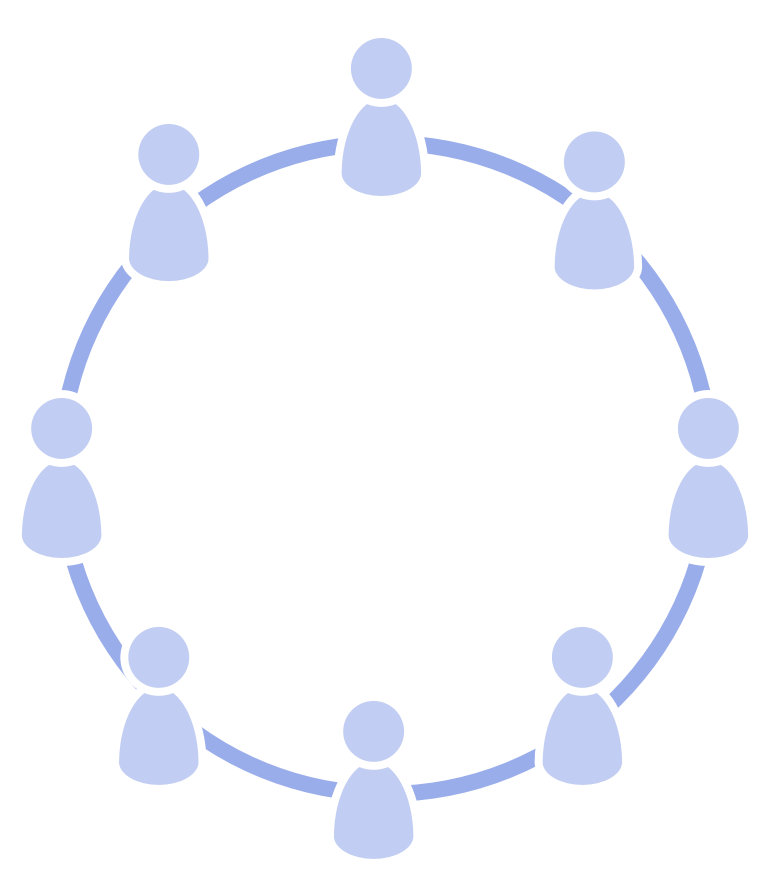

_Un **cercle** est une équipe auto-gouvernée et semi-autonome de personnes équivalentes qui collaborent pour rendre compte d'un domaine._

Un cercle:

- peut être permanent ou temporaire
- peut être <dfn data-info="Auto-organisation: Toute activité ou processus à travers lequel les gens organisent leur travail quotidien sans l&apos;influence d&apos;un agent externe, et selon les contraintes définies par la gouvernance. Dans toute organisation ou équipe, l&apos;auto-organisation et l&apos;influence externe coexistent.">auto-organisé</dfn>
- est redevable de son propre développement et de son corpus d’<dfn data-info="Entente: Une ligne directrice, un processus ou protocole établi de le but de guider le flux de valeur.">ententes</dfn>

- **semi-autonome:**
    
    - Les membres d'un cercle agissent selon les contraintes de leur <dfn data-info="Domaine: Une zone d&apos;influence, activité et prise de décisions distincte au sein d&apos;une organisation.">domaine</dfn>.
    - Chaque cercle peut créer de la <dfn data-info="Valeur: L&apos;importance ou l&apos;utilité d&apos;un élément en relation à un moteur. Aussi &quot;un principe significatif guidant le comportement&quot; (principalement utilisé au pluriel, &quot;valeurs&quot; ou &quot;valeurs organisationnelles&quot;).">valeur</dfn> en autonomie.
- **auto-gouverné:** 
    - Les membres d'un cercle décident continuellement ensemble comment gérer leur domaine, et définissent les contraintes sur comment et quand les choses seront faites.
- **équivalence des membres du cercle :** 
    - Tous les membres d'un cercle sont également responsables de la <dfn data-info="Gouvernance: L&apos;acte de fixer des objectifs et de prendre et de modifier des décisions qui guident les gens à les atteindre.">gouvernance</dfn> du domaine du cercle.

[&#9654; Rôle](role.html) [&#9664; Déléguer l'influence](delegate-influence.html) [&#9650; Construire les organisations](building-organizations.html)

