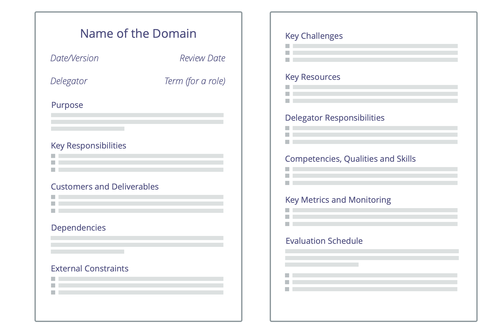

**Une compréhension claire des zones de responsabilités et de l'autonomie des personnes permet plus d'efficacité, optimise la collaboration et l'agilité dans toute une organisation.**

Un moyen simple de clarifier les <dfn data-info="Domaine: Une zone d&apos;influence, activité et prise de décisions distincte au sein d&apos;une organisation.">domaines</dfn> est d'établir une **description du domaine** qui contient :

- l'<dfn data-info="Moteur principal: L&apos;intention primaire d&apos;un domaine est l&apos;intention principale à laquelle les personnes qui s&apos;occupent de ce domaine répondent.">intention primaire</dfn> (le **besoin organisationnel** auquel le domaine doit répondre)
- les **responsabilités clés** (les livrables clés, tout risque critique à gérer, tout autre travail essentiel et les prises de décision étant délégués)
- les **contraintes sur l'autonomie et l'influence** pesant sur ceux à qui sont <dfn data-info="Délégation: L&apos;octroi d&apos;autorité par une partie (le déléguant) à une autre (le délégué) de s&apos;occuper d&apos;un domaine, (c&apos;est-à-dire de faire certaines choses et/ou de prendre certaines décisions) pour lesquelles le déléguant maintient la responsabilité globale.">délégués</dfn> le domaine (les *délégués*), souvent liées à l'organisation elle-même (dépendances, implication du <dfn data-info="Déléguant: Un individu ou groupe déléguant un domaine à d&apos;autres groupes ou individus.">déléguant</dfn>, reporting, etc.)
- des **ressources** (temps, argent, installations, privilèges, outils)
- des **critères d'évaluation** et une fréquence d'évaluation
- une durée (pour un rôle)

Les descriptions de domaine peuvent être créées pour un [rôle](role.html), une position, un [cercle](circle.html), une <dfn data-info="Équipe: Un groupe de personnes qui collaborent vers une intention commune (ou un objectif). Généralement, une équipe fait partie d&apos;une organisation, ou est formée pour la collaboration entre plusieurs organisations.">équipe</dfn>, un [domaine ouvert](open-domain.html), un département, une unité ou toute l'organisation.

Une autre façon de clarifier un domaine est de remplir un [Canevas de Délégation S3](http://s3canvas.sociocracy30.org/s3-delegation-canvas.html).

[&#9654; Clarifier le résultat attendu](clarify-intended-outcome.html) [&#9664; Développer la stratégie](develop-strategy.html) [&#9650; Élaborer des ententes](defining-agreements.html)

