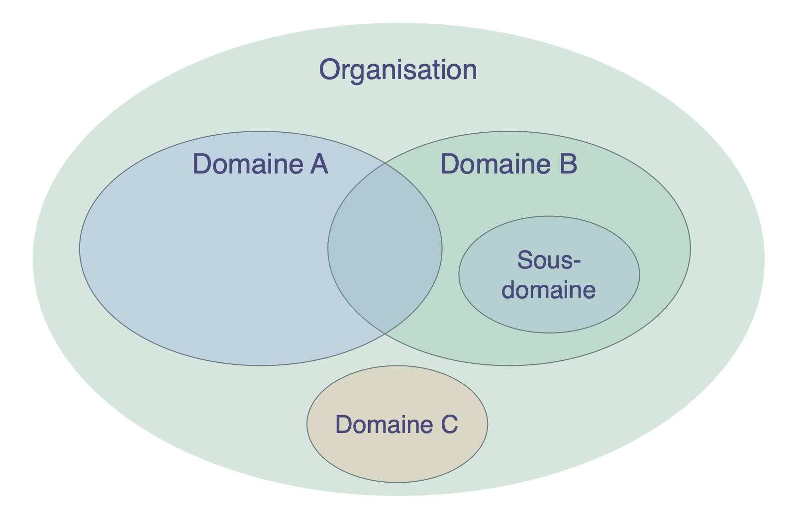
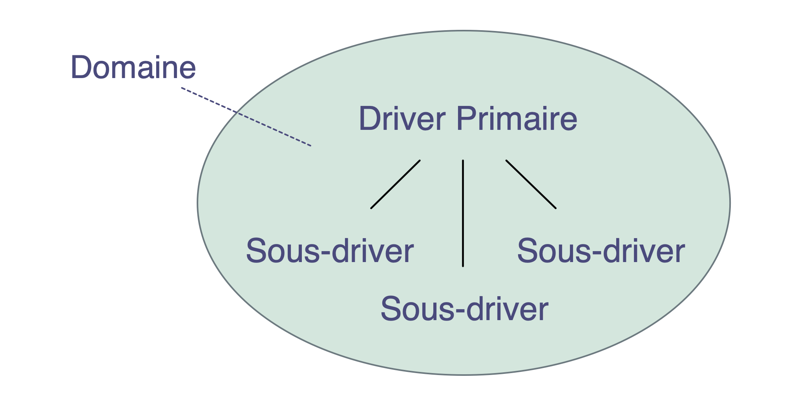

Aller à:

- [Pratiques et les Sept Principes](#patterns-and-the-seven-principles): [Pratiques](#patterns) \| [Les Sept Principes](#the-seven-principles)
- [Concepts clés pour comprendre les organisations](#key-concepts-for-making-sense-of-organizations): [Intentions](#drivers) \| [Domaines](#domains) \| [Objections](#objections) \| [Ententes](#agreements) \| [Gouvernance et Opérations](#governance-and-operations)

## Les Pratiques et les Sept Principes
### Pratiques

S3 offre une approche pratique du changement organisationnel.

Une **pratique** est un processus, une façon de faire ou une ligne directrice qui sert de modèle pour répondre avec succès à un type spécifique de défi ou d'opportunité. Les pratiques S3 sont découvertes en observant la manière dont les gens qui travaillent dans des organisations résolvent les problèmes et répondent aux opportunités qui se présentent à eux. Quand vous trouvez que vos méthodes habituelles de faire des choses ne produisent pas les résultats que vous attendiez ou espériez, vous pouvez vous tourner vers S3 pour trouver des pratiques qui pourraient vous aider.

Les pratiques sont regroupées en dix catégories pour vous aider à identifier plus facilement celles qui vous seront utiles. Elles sont modulaires et adaptables, peuvent être utilisés de manière indépendante et se renforcent mutuellement, se complétant entre elles lorsqu'elles sont combinées. Les pratiques S3 peuvent être développées et adaptées à vos besoins spécifiques.

En fournissant un menu de pratiquez à choisir en fonction des besoins, S3 encourage une **approche organique et itérative du changement sans un énorme investissement initial** . Elle prend les gens où ils se trouvent et les aide à avancer en ajoutant des pratiques à leur rythme et en fonction de leur contexte unique.

### Les sept principes

La Sociocratie est fondée sur sept principes qui façonnent la culture organisationnelle. Puisque les sept principes se reflètent dans toutes les pratiques Sociocratie 3.0, la compréhension de ces principes est utile pour les adopter et primordiale si l'on souhaite les adapter .

Pratiquer la Sociocratie 3.0 aide les gens à comprendre la valeur essentielle que ces principes fondamentaux apportent – tant aux individus qu’aux organisations – et à soutenir leur intégration dans la culture organisationnelle.

**Le Principe d'Efficacité:** *Allouer du temps seulement à ce qui vous rapproche de vos objectifs.*

**Le Principe de Consentement:** *Lever, chercher et résoudre les objections aux décisions et aux actions.*

**Le Principe d'Empirisme:** *Tester toutes les hypothèses sur lesquelles vous vous appuyez, par l'expérimentation et l'amélioration en continu.*

**Le Principe d'Amélioration Continue:** *Évoluer par incréments pour faciliter un apprentissage empirique constant.*

**Le Principe d'Equivalence:** *Impliquer les personnes impactées dans les prises de décisions et les évolutions.*

**Le Principe de Transparence:** *Enregistrer toutes les informations qui sont précieuses pour l'organisation et rendez les accessibles à tous, à moins qu'il y ait un motif de confidentialité.*

**Le Principe Redevabilité:** *Réagir lorsque c'est nécessaire, faire ce que vous avez convenu de faire et assumer la responsabilité de son bon déroulement .*
#### Le Principe de Redevabilité

*Réagir lorsque c'est nécessaire, faire ce que vous avez convenu de faire et assumer la responsabilité de son bon déroulement .*

Agir dans le cadre des ententes régissant les domaines dont vous êtes redevables, y compris l'organisation elle-même, les équipes dont vous faites partie et les rôles que vous portez.

Chaque membre de l'organisation est redevable de répondre efficacement aux intentions organisationnelles, en faisant le travail et/ou en assurant (soutenant) une collaboration efficace.

Les individus sont également redevables de leur travail, de leur apprentissage et de leur développement, et de se soutenir mutuellement.

Tout le monde dans une organisation est redevable d'aligner ses activités avec les valeurs organisationnelles.

## Concepts clés pour comprendre les organisations

Dans cette section, vous apprendrez les concepts clés suivants :

- Intention
- Domaine
- Entente
- Objection
- Gouvernance et Opérations

Vous découvrirez également comment ces concepts se rapportent à la valeur (et au gaspillage), à la délégation (et à la responsabilité), à l'auto-organisation, à l'auto-gouvernance et à la semi-autonomie.

Lorsque les gens comprennent ces concepts, cela leur donne un langage commun pour décrire clairement ce qui se passe au sein de l’organisation. Cela contribue à accroître la compréhension partagée et permet un dialogue constructif sur ce qui doit être fait.

Si vous ne comprenez pas l'un de ces termes, consultez notre glossaire à la fin.
### Intentions

_Une **intention** est la motivation d'un groupe ou d'une individu à répondre à une situation particulière._

Intentions :

- peuvent être utilisées pour formuler des buts, objectifs, aspirations, une mission, une vision, une raison d’être
- peuvent changer au fil du temps

#### Intentions, valeur et gaspillage

_La **valeur** est l'importance ou l'utilité de quelque chose lié à une intention._

_Le **gaspillage** est tout ce qui n'est pas nécessaire pour - ou qui fait obstacle à - répondre (plus) efficacement à une intention._

En adoptant les concepts de valeur et de gaspillage, de nombreuses pratiques et idées issues de la **production lean** et du **développement logiciel lean** sont applicables aux organisations pratiquant S3:

- cartographie de la chaîne de valeur
- différentes stratégies pour éliminer le gaspillage
- la méthode Kanban
### Domaines

_Un **domaine** est une zone d'influence, d’activité et de prise de décisions distincte au sein d'une organisation._

Tous les domaines d'une organisation sont contenus dans son domaine général. Ils peuvent se chevaucher et/ou être pleinement inclus au sein d'autres domaines.

#### Déléguer la responsabilité des domaines

_La délégation est l’octroi d’une autorité sur un domaine d’une partie à une autre._

Les domaines sont délégués à des personnes (p. ex. une unité, un département, une équipe ou des individus) qui assument la responsabilité du domaine dans des limites définies d'influence et d'autonomie.

Lorsqu’un domaine est délégué à un groupe de personnes, il deviennent une équipe, quand il est délégué à un individu, il devient porteur de rôle.

Ceux qui délèguent la responsabilité d'un domaine (les délégants) à d'autres gardent toujours la responsabilité globale pour ce domaine, allouent **de ressources** et définissent souvent :

- le **besoin organisationnel** auquel le domaine doit répondre
- les **responsabilités clés** (livrables, risques critiques à gérer, autre travail essentiel et prises de décision délégués)
- des **contraintes sur l'autonomie et l'influence** pour ceux à qui sont délégués le domaine (les *délégués*), et qui sont souvent liées à l'organisation elle-même (dépendances, implication du délégant, reporting, etc.)

#### Intentions et domaines

Il est également possible de comprendre un domaine par rapport aux intentions organisationnelles :

- l'**intention primaire** - l'intention principale à laquelle les gens redevables d’un domaine donné (les *délégués*) répondent
- l'ensemble des sous-intentions qu'il peut être bénéfique pour l'organisation d'adresser afin de répondre à l'intention primaire, comme : 
    - les **responsabilités clés** (n'importe quelle intention dérivant directement de l'intention primaire)
    - les motivations pour les **contraintes du domaine** (généralement lié au contexte de l'organisation globale)

### Objections

_Une **objection** est un argument relatif à une entente (proposée) ou une activité qui révèle des conséquences inattendues que vous préfèreriez éviter, ou qui pourrait être améliorée._

Les objections révèlent des informations sur  des **conséquences involontaires** (potentielles), ou sur **des moyens utiles de s'améliorer**.

Sachez que ne pas exprimer des objections peut nuire à la capacité des individus, des équipes ou de l'ensemble de l'organisation à atteindre leurs objectifs.

Il est de la responsabilité de chaque individu de lever des objections potentielles aux propositions, aux décisions, aux <dfn data-info="Entente: Une ligne directrice, un processus ou protocole établi de le but de guider le flux de valeur.">ententes</dfn> existantes ou aux activités.

Ceux qui sont redevables d'une activité ou d'un accord (proposé) en question, sont responsables de *la prise en compte des arguments et d'adresser les objections* qui sont levés en vue d'aider à atteindre les objectifs de l'organisation.

Lorsque vous cherchez des objections potentielles, considérez :

- **l'efficacité**: pourquoi le <dfn data-info="Résultat attendu: Le résultat escompté d&apos;une entente, d&apos;une action, d&apos;un projet ou d&apos;une stratégie.">résultat souhaité</dfn> ne serait pas (entièrement) atteint ?
- **l'efficience**: pourquoi ce serait un gâchis de procéder comme proposé (ou convenu précédemment) ?
- **les effets secondaires**: quelles conséquences négatives quelque chose aurait par ailleurs (dans le même <dfn data-info="Domaine: Une zone d&apos;influence, d’activité et de prise de décisions distincte au sein d&apos;une organisation.">domaine</dfn>, dans l'ensemble de l'organisation, ou au-delà)?

Les informations apportées par les objections peuvent être utilisées pour améliorer :

-   les actions en cours et planifiées
-   la façon dont les gens exécutent les décisions
-   les ententes existantes
-   les propositions
-   la compréhension commune des intentions

Créer une culture où les gens se sentent à l'aise pour lever des objections *potentielles* à tout moment, afin qu'ils puissent tranquillement prendre des décisions qui sont *suffisamment bonnes pour l'instant, et suffisamment sûres à essayer*. Cela encourage le développement d'une préférence pour essayer des choses, au lieu d'essayer d'anticiper et de tenir compte de toutes les possibilités à l'avance.

Tirez parti de la diversité des perspectives et soyez ouvert à challenger les votres, à découvrir quand et quoi changer, et appréciez d'itérer plus rapidement, eb expérimentant et en apprenant des résultats obtenus en chemin.

#### Préoccupations

**Tous les arguments invoqués ne sont pas des objections. Faites la distinction entre les objections, qui révèlent toujours des informations utiles, et d'autres arguments qui ne sont fondés que sur des hypothèses, ou sur une préférence ou une opinion personnelle.**

_Une **préoccupation** est une supposition - ou une opinion - selon laquelle faire quelque chose (même en l'absence d'objections) **pourrait** entraver une réponse (plus) efficace à une intention organisationnelle._

Dans la [Décision par Consentement](consent-decision-making.html), les préoccupations peuvent suggérer des moyens de faire avancer les ententes (y compris leurs critères et fréquence d'évaluation). Faites part de vos préoccupations si vous pensez qu’il est utile de les prendre en considération, et au moins de les enregistrer avec l'entente, et de surveiller les résultats dans le temps.

Si vous avez des doutes quant à savoir si vous avez une objection ou une vigilance, soyez proactif et vérifiez avec les autres pour voir ce qu'ils pensent aussi. (voir [Tester les Argument se Qualifiant d'Objections](test-arguments-qualify-as-objections.html)). 

### Ententes

_Une **entente** est une ligne directrice, un processus, un protocole ou une politique établis de le but de guider le flux de valeur._

Des directives partagées sur pourquoi, comment et quand agir, et ce qui est spécifiquement nécessaire, permettant une collaboration efficace.

Les ententes sont créées en réponse à des <dfn data-info="Moteur organisationnel: Une intention est le motif d’une personne ou d’un groupe à répondre à une situation particulière. Une intention est considérée comme une **intention organisationnelle** si y répondre aiderait l’organisation à générer de la valeur, à éliminer du gaspillage ou à éviter des conséquences inattendues.">intentions organisationnelles</dfn>, elles sont **régulièrement évaluées**, et évoluent si nécessaire.

**La redevabilité générale** d'une entente appartient aux personnes qui la créent.

Une entente peut inclure la **délégation de responsabilités particulières** à des individus ou à des groupes.

### Gouvernance et opérations

S3 cherche à libérer la productivité en laissant les personnes libres de faire et de décider autant que possible par elles-même, tout en collaborant de manière cohérente dans une organisation efficace et qui réussit.

Une plus grande autonomie des individus et des équipes nécessite des ententes claires (c'est-à-dire des consignes et des contraintes) qui permettent une collaboration harmonieuse entre ces équipes et ces individus, et qui soutiennent la réalisation d'objectifs à court et long terme. Des évaluations périodiques et l'évolution progressive des ententes assurent qu'elles restent adaptées à la finalité.

Bien qu'une décision ayant des conséquences à court terme puisse facilement être prise sur-le-champ, pour créer des ententes plus conséquentes qui contraignent le comportement et l’activité des gens, il est souvent bénéfique d’adopter un [processus de décision](consent-decision-making.html) plus participatif et plus délibéré.

De telles ententes doivent être documentées, à la fois pour se les rappeler mais aussi pour pouvoir les [évaluer](evaluate-and-evolve-agreements.html) efficacement, et doivent être communiquées aux personnes impactées (qui sont idéalement aussi [impliquées dans la création et l'évolution](those-affected-decide.html) de ces ententes).

Il est donc utile de distinguer deux catégories d’activités dans une organisation, l'une que nous appelons la gouvernance, et l’autre que nous appelons les opérations :

_La **Gouvernance** dans une organisation (ou l'un de ses domaines) est l'acte de fixer des objectifs, de prendre et faire évoluer des décisions qui guident les gens pour les atteindre._

_Les **Opérations** consistent à faire le travail et organiser les activités quotidiennes selon les contraintes définies par la gouvernance._

Pour chaque domaine dans une organisation il y a un *instance gouvernante*: les personnes ayant un mandat pour sceller et pour faire évoluer des ententes régissant la manière dont ceux qui font le travail dans ce domaine créent de la valeur.

Il existe de nombreuses façons de distribuer le travail et la gouvernance. Parfois, l’instance gouvernante est une personne unique, par exemple dans le cas d’un chef d’équipe, et parfois c’est un groupe de personnes, par exemple dans un cercle où tous les membres sont responsables collectivement de la gouvernance selon les contraintes du domaine.

**Les décisions de gouvernance** fixent des contraintes sur l'activité et guident les décisions futures.

Ceci inclut :

- définir les domaines
- déléguer l'influence aux gens
- allouer des ressources et des capacités
- spécifier les livrables et prioriser leur livraison.

Les décisions de gouvernance peuvent être prises à tout moment et à n'importe quel endroit, pas seulement dans des réunions spécifiques, bien qu'une [réunion régulière pour la création et l'évolution des ententes](governance-meeting.html) soit souvent une bonne idée.

#### Concepts connexes

**Auto-gouvernance**: Ensemble de personnes se gouvernant elles-mêmes selon les contraintes d'un domaine.

**Semi-autonomie**: L'autonomie des personnes à créer de la valeur dans leur domaine, contrainte par leurs propres décisions de gouvernance, et les objections (y compris celles du délégant et des représentants).

**Auto-organisation:** Toute activité ou processus à travers lequel les gens organisent leur travail quotidien sans l'influence d'un agent externe, et selon les contraintes définies par la gouvernance. Dans toute organisation ou équipe, l'auto-organisation et l'influence externe coexistent.

Selon les contraintes imposées par le délégant, les équipes ont plus ou moins de latitude à mener la gouvernance et à décider comment elles organisent leurs opérations, et sont par conséquent plus ou moins auto-gouvernées et auto-organisées.

[&#9654; Co-créer et évoluer](co-creation-and-evolution.html)

