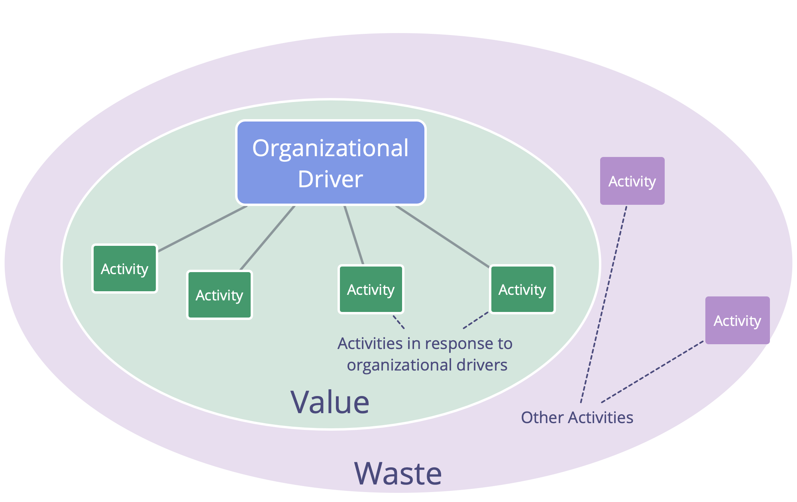

<strong>Faites apparaître les drivers et établissez in système mesurable à flux tirés pour changer l'organisation en améliorant continuellement le processus de travail.</strong>

- introduire le principe de consentement et de [Naviguer par tension](navigate-via-tension.html) pour faire évoluer les processus de travail d'une équipe
- sélectionner un facilitateur pour guider les processus de groupe, et choisir des valeurs repère pour guider le comportement
- initier un processus d'amélioration continue, ex: avec Kanban ou des [rétrospectives](retrospective.html) régulières
- les membres de l'équipe puisent dans les pratiques S3 au besoin
- si cela présente un intérêt, étendre itérativement le champ d'expérimentation à d'autres équipes
- rechercher activement les freins

## Gaspillage et amélioration continue

_Le **gaspillage** est tout ce qui n'est pas nécessaire pour - ou qui fait obstacle à  une réponse (plus) efficace à un driver._

Le gaspillage existe sous différentes formes et à différents niveaux d’abstraction (tâches, processus, structure organisationnelle, modèles mentaux...)

Mettre en place un processus continu d'élimination du gaspillage permet l'évolution naturelle d'une organisation vers une plus grande efficacité, et l'adaptation à un contexte changeant.

<a href="open-space-for-change.html" title="Retour à : Changement par forum ouvert">◀</a> <a href="bringing-in-s3.html" title="Remonter: Intégrer la S3">▲</a> <a href="defining-agreements.html" title="">▶ Lire la suite : Élaborer des accords</a>

