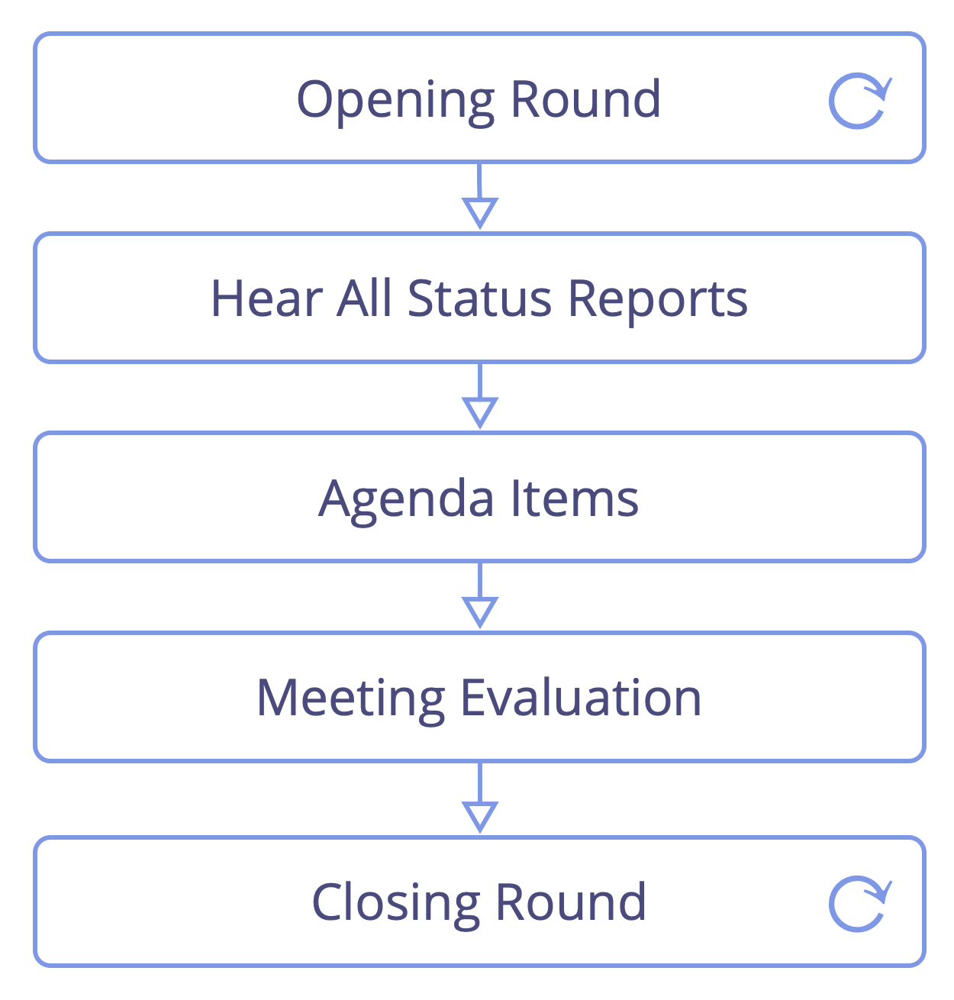

<strong>Réunissez-vous régulièrement (généralement chaque semaine) pour rendre compte et coordonner le travail dans les domaines.</strong>

- faciliter la réunion (<dfn data-info="Timebox (bloc de temps): Une période de temps fixée pour se concentrer sur une activité particulière (qui ne sera pas nécessairement terminée à la fin du temps limite).">timeboxez</dfn> le dialogue et faites des tours de table lorsque c'est pertinent)
- quand c'est utile, rédiger un ordre du jour avant la réunion et le diffuser à l'avance aux participants 
    - indiquer tous les prérequis qui peuvent aider les participants à se préparer
    - d'autres points d'agenda peuvent émerger suite à l'écoute des compte-rendus

Ordre du jour:

- synchronisation et alignement des domaines
- priorisation et distribution du travail
- adresser les difficultés

[&#9654; Pratiques de réunion](meeting-practices.html) [&#9664; Réunions de planification et d'évaluation](planning-and-review-meetings.html) [&#9650; Interactions ciblées](focused-interactions.html)

