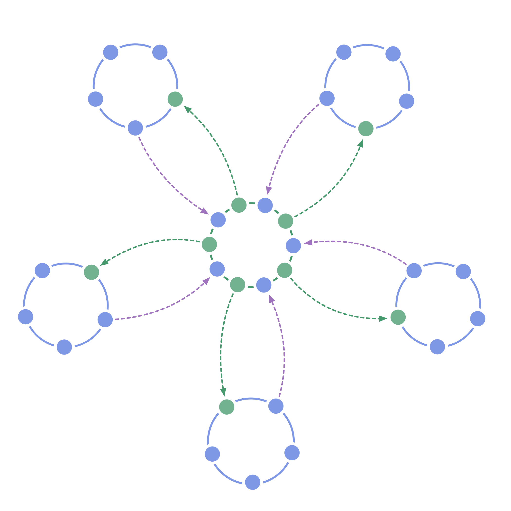

Déléguez à des cercles auto-gérés reliés par deux liens, l'autorité de prendre toutes les décisions de gouvernance. Faites ceci, à tous les niveaux de la hiérarchie, afin de transiter vers une structure plus à-même de profiter de l'intelligence collective, d'assurer l'équivalence et de générer de l'engagement.

1. Déplacez les prises de décision de gouvernance des individus vers les équipes en formant des <a href="glossary.html#entry-circle" class="glossary-tooltip" data-toggle="tooltip" title="Cercle: Une équipe autogouvernée et semi-autonome de personnes équivalentes qui collaborent pour s&#x27;occuper d&#x27;un domaine.">cercles</a> [auto-gouvernés](glossary-circle) à tous les niveaux de votre organisation.
2. Les membres de chaque cercle choisissent l'un des leurs pour représenter leurs intérêts et participer aux prises de décision de la <a href="glossary.html#entry-governance" class="glossary-tooltip" data-toggle="tooltip" title="Gouvernance: Le processus visant à fixer des objectifs et à prendre et faire évoluer des décisions qui guident les gens vers l&#x27;atteinte de ces objectifs.">gouvernance</a> du cercle du dessus, et vice versa.

Une hiérarchie à double lien :

- apporte de l'<a href="glossary.html#entry-equivalence" class="glossary-tooltip" data-toggle="tooltip" title="Equivalence (principe): **Impliquez les personnes dans la prise et l&#x27;évolution des décisions qui les affectent,** afin d&#x27;augmenter leur sens de l&#x27;engagement et de la redevabilité, et d&#x27;utiliser l&#x27;intelligence distribuée pour atteindre et faire évoluer vos objectifs.">équivalence</a> à la gouvernance
- conserve la possibilité d'avoir une hiérarchie fonctionnelle (si elle permet le flux de valeur).

**Voir aussi :** [Cercle](circle.html), [Double Lien](double-linking.html), [Représentant](representative.html)
