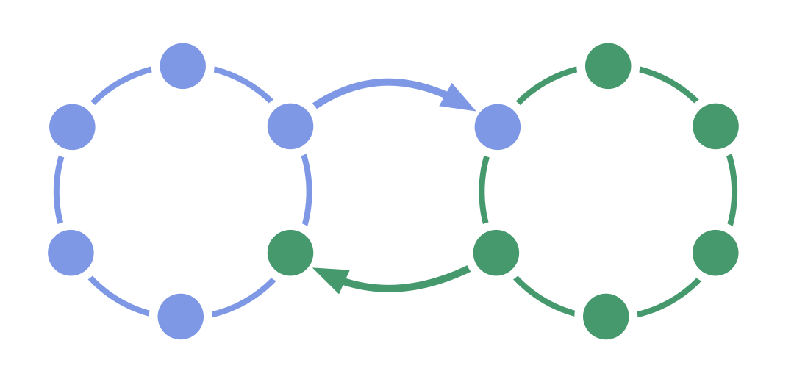

**Permet l’échange d’informations et l’influence *bi-directionnels* entre deux équipes.**

Deux équipes interdépendantes sélectionnent chacune un de leurs membres pour représenter leurs intérêts dans les décisions de <dfn data-info="Gouvernance: L&apos;acte de fixer des objectifs et de prendre et de modifier des décisions qui guident les gens à les atteindre.">gouvernance</dfn> de l’autre équipe.

Le double lien permet une équivalence entre deux équipes et peut être utilisé pour révéler des informations précieuses dans les structures hiérarchiques.

[&#9654; Représentant](representative.html) [&#9664; Lien](linking.html) [&#9650; Construire les organisations](building-organizations.html)

