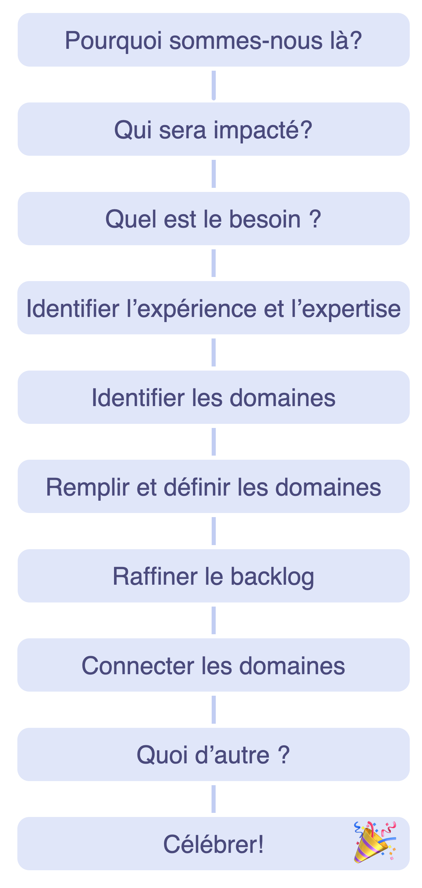
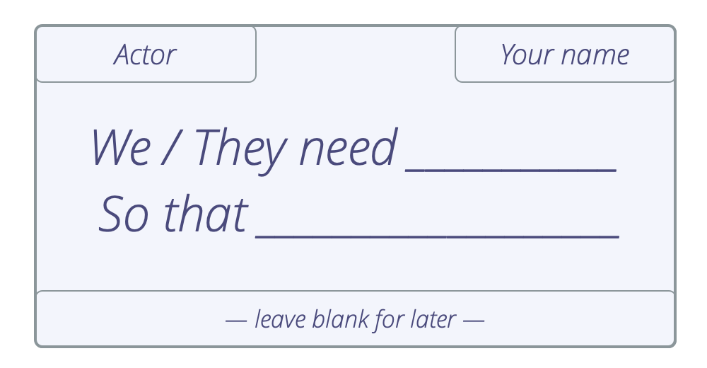

<strong>Un format d’atelier permettant aux grands groupes de cocréer et de s’organiser en réponse à une situation complexe d’envergure.</strong>

Au cours de l’atelier, les parricipants sont pleinement responsables du processus du début à la fin, à mesure qu’elles progressent rapidement du concept à une collaboration pleinement opérationnelle.

Identifiez les parties concernées, cartographiez les exigences connexes et utilisez-les pour identifier les éléments de travail et les décisions à prendre, pour répartir le travail et définir une structure initiale de collaboration.

Vous pouvez cartographier les drivers pour :

- organiser des start-ups, 
- lancer les projets, 
- adresser des obstacles majeurs ou des opportunités, 
- mettre en œuvre une stratégie
- développer une structure organisationnelle pour fluidifier le flux de valeur.

Le résultat d'un atelier de cartographie des drivers est typiquement :

- une répartition du travail, catégorisée dans plusieurs domaines, centrée sur les besoins des parties prenantes. 
- une structure organisationnelle sur mesure qui rassemble tous le monde, y compris les domaines interconnectés pour gérer les dépendances.
- une première ébauche de backlogs de gouvernance et d'opérations pour chaque sous-domaine identifié.
- la délégation d'influence et l’affectation des personnes aux sous-domaines par l'auto-sélection et nomination.

Bien que cartographier les drivers serve souvent à identifier et définir de nouveaux domaines, cette pratique permet aussi d’identifier et de distribuer la gouvernance et les drivers opérationnels parmi les domaines existants dans une organisation. Par exemple lorsqu’une initiative sera traitée par des équipes existantes dans une organisation, ou si un groupe a le sentiment qu’il est coincé dans sa structure actuelle et qu’il est à la recherche d’inspiration pour l’adapter progressivement. Le groupe peut décider de cartographier les domaines existants et déterminer quels nouveaux domaines il devrait créer, ou même créer une nouvelle structure à partir de zéro.

Dans une petite équipe ou un cercle (max. 6-8 personnes), lorsque la distribution du travail n'est pas prioritaire, l'équipe peut seulement utiliser les étapes 1-5, pour comprendre la portée et remplir le backlogs d’opérations et de gouvernance, puis utiliser "Élaborer une proposition" ou toute autre approche pour identifier la stratégie et/ou les étapes suivantes.

En préparation : 

- Invitez des personnes qui peuvent apporter une contribution pertinente à ce projet. Envoyez l'ordre du jour de l'atelier à l'avance. 
- Envoyez le driver primaire sur lequel vous travaillerez, et dans le cas d'un domaine existant, la description de domaine pour le projet/initiative à l'avance pour que les gens puissent se familiariser avec. Essayez de résoudre toute objection avant l'atelier.
- Les participants peuvent déjà se préparer en réfléchissant et en consignant des idées d'acteurs et des besoins connexes.
- Préparez un poster avec la description du domaine à présenter dans la première étape. Vous aurez également besoin de notes adhésives A5 et rectangulaires, de stylos et d'un grand mur pour travailler. 

## Le processus de cartographie des drivers:

Voici les étapes à suivre :

### 1. Pourquoi sommes-nous là?

*Présentez et consentez au driver primaire*

- Présentez le driver primaire au groupe 
- Consentement au driver – *Est-ce une description suffisamment claire du driver? Est-il pertinent que nous y répondions *?
- Clarifiez les contraintes existantes du délégant, par exemple le budget, la date d'échéance, les attentes, etc. Dans le cas d'un domaine existant, présentez la description du domaine. Invitez les participants à poser des questions mieux comprendre ce qui se passe et ce qui est nécessaire. 
- Donnez explicitement le niveau d'engagement attendu des participants. Par exemple : lea personnes sont censées être ici pour la durée de l'atelier seulement, ou pour la durée de l'initiative, etc.
- Enregistrez toutes les informations pertinentes qui apparaissent.

### 2. Qui sera impacté?

*Qui sera impacté lorsque nous répondrons au driver ? Envisagez qui peut aider / faire obstacle / bénéficier / perdre ou être négativement impacté.*

- Listez les acteurs sur les notes adhésives et les afficher sur un tableau
- Concentrez-vous sur les personnes qui seront réellement impactées par cette initiative (groupes ou individus), et évitez de faire des suppositions à propos des rôles futurs (ex. *Chef de Projet*) ou d'autres domaines (ex. *Marketing*) à ce stade.

### 3. Que faut-il faire?

*Considérez les différents acteurs et décrivez ce qui est nécessaire : de quoi ont-ils besoin dans le contexte du driver primaire, et qu'attendons-nous d'eux?*

- Écrivez chaque suggestion sur une note adhésive séparée (carte de besoin)
- Décrivez le besoin ainsi que l'impact prévu de répondre à ce besoin
- Utilisez le format *"Nous avons/ils ont besoin de … afin …"*
- Ajoutez le nom de l'acteur dans le coin supérieur gauche de la carte
- Ajoutez votre nom dans le coin supérieur droit de la carte

### 4. Identifier l'expérience et l'expertise

*Identifiez qui a une expérience ou une expertise pour répondre à ces besoins, de sorte que, plus tard, lorsque les personnes devront répondre à un besoin particulier, ils sauront qui solliciter.*

- Prenez le temps de vous familiariser avec les différents *cartes de besoins*.
- Ajoutez votre nom aux *cartes de besoins* pour lesquelles vous avez de l'expérience, ou des idées de comment aborder la chose, de sorte que, plus tard dans le processus, les gens pourront vous solliciter si nécessaire. 
- Pensez à ajouter des noms de personnes qui ne sont pas présentes si vous pensez qu'elles auraient une contribution précieuse à apporter.
- Écrivez le(s) nom(s) de ces personnes au bas de la *carte de besoin*.
- Ajouter votre nom à une carte à cette étape ne signifie pas que vous assumez la responsabilité du besoin, seulement que vous pouvez et voulez contribuer à trouver une solution si cela est utile plus tard.

### 5. Identifier les domaines

*Regroupez les acteurs et/ou les besoins en fonction de la pertinence, dans des **domaines** cohérents comme point de départ pour trier et prioriser les besoins. Réfléchissez à comment optimiser la chaîne de production de valeur pour les différents acteurs que vous avez identifiés à l'étape 2.*

Moyens pour identifier les domaines:

- Regrouper les acteurs similaires (centré sur l'acteur)
- Regrouper les besoins similaires (centré sur le besoin)
- Une combinaison des deux (besoins et acteurs) est fréquente

Considérez que cette étape est terminée, dès que vous vous êtes mis d’accord sur une première itération d’une répartition significative du travail. N'oubliez pas que vous pouvez apporter des modifications aux domaines que vous avez définis à tout moment (plus tard pendant l'atelier ou après), donc il vous suffit de chercher quelque chose qui est assez bon pour commencer.

*En tant que facilitateur, soutenez doucement le groupe dans son auto-organisation et soyez attentif à ce que certains n'abandonnent pas la conversation. Ce processus comprend souvent une phase qui semble chaotique pour certains participants, ce qui pourrait les rendre mal à l'aise. Pour tester si un résultat est atteint, demandez s'il y a des objections à ce que les domaines soient suffisamment bons pour l'instant.*

### 6. Remplir & définir des domaines

*Les participants s'organisent en plus petites équipes autour des différents domaines, puis définissent le domaine et lui donnent un nom.*

- Formez une petite équipe autour des domaines en fonction de l'expérience et de l'intérêt
- Ajoutez d'abord au moins 1 ou 2 personnes possédant une expertise en premier. Utilisez les informations sur les cartes, 
- Vérifiez que tous les domaines sont suffisamment pris en compte 
- Dans chaque groupe : 
    - accordez-vous sur un nom de domaine.
    - définissez le driver primaire du domaine (et ébauchez une brève description du domaine si nécessaire). 
- Enfin, demandez à chaque groupe de présenter brièvement son domaine, et au cours de chaque rapport, recherchez les dépendances et les chevauchements entre ces domaines.

Dans cette phase, certaines personnes peuvent errer entre les domaines jusqu'à ce qu'elles en trouvent un auquel elles ont le sentiment de pouvoir contribuer.

### 7. Affiner les backlogs

*Organisez le travail à faire dans chaque domaine, s'assurer que les choses sont priorisées et décrites clairement.*

- Pour chaque domaine, copiez le modèle ci-dessous sur un tableau papier
- Triez tous les besoins restants dans les deux backlogs sur le tableau papier : 
    - backlog des opérations : besoins actionnables
    - backlog de gouvernance : besoins qui pourraient bénéficier ou nécessiter une décision
- Combinez et reformulez les cartes si nécessaire, de sorte que la description sur chaque carte soit claire. Consultez l'auteur de la carte en cas de doute.
- Priorisez les cartes sur chaque tableau.
- Archivez toutes les cartes « besoin » qui semblent superflues.
- Considérez le domaine et décrivez et priorisez les autres besoins qui n'ont peut-être pas été identifiés.
- Passer sur les cartes qui semblent être de la responsabilité d'un autre domaine
- Ajoutez des cartes concernant plusieurs domaines à un backlog dédié à adresser plus tard.

_En tant que facilitateur du processus de cartographie des motifs, proposez un espace pour collecter des cartes concernant plusieurs domaines afin qu'ils puissent être traités plus tard. _

Faites régulièrement des pauses pour partager les rapports entre les différents domaines. Remarque : certains domaines peuvent se dissoudre, changer ou fusionner avec d'autres.

### 8. Connecter les domaines

*Créez une structure pour gérer les dépendances et traiter les questions qui vont au-delà de la portée d'un domaine ou qui concernent l'organisation au sens large*

- Pour une nouvelle organisation ou un nouveau projet, considérez des [Cercles délégués](delegate-circle.html), des [ Cercles de service](service-circle.html) ou des [Double-lien entre les domaines](double-linking.html).
- Pour une organisation existante, envisagez également de vous connecter à des domaines existants dans l'organisation.

### 9. Quoi d'autre?

*Prenez un moment pour vérifier si quelque chose est manquant.*

Que devons-nous encore examiner…

- …pour fonctionner en toute sécurité?
- …pour répondre au driver primaire ? 

### 10. Célébrez !

*Prenez un moment pour célébrer ce que vous avez accompli afin que votre organisation ou votre initiative démarre !*

<a href="role-selection.html" title="Retour à : Sélectionner les porteurs de rôles">◀</a> <a href="co-creation-and-evolution.html" title="Remonter: Cocréer et évoluer">▲</a> <a href="peer-development.html" title="Lire la suite : Se développer entre pairs">▶ Lire la suite : Se développer entre pairs</a>

