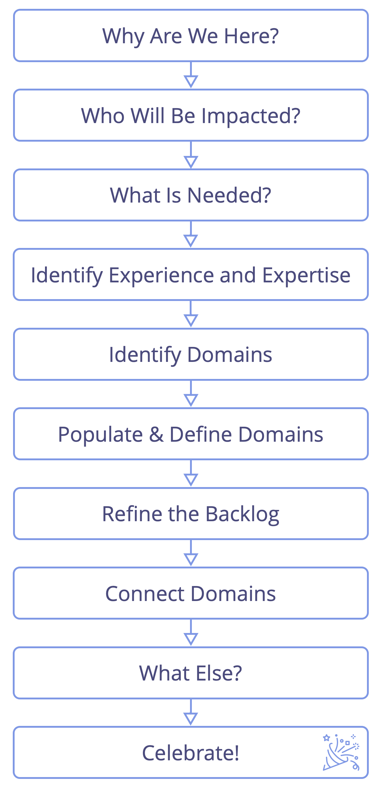

Un format d'atelier pour identifier une réponse efficace à une situation complexe : organiser des start-ups, des nouveaux projets, s'attaquer aux obstacles majeurs ou aux opportunités, développer une structure organisationnelle pour mieux permettre le <dfn data-info="Flux de valeur: Les livrables voyageant traversant une organisation vers les clients ou d'autres intervenants.">flux de valeur</dfn>.

Un groupe (petit ou grand) identifie et regroupe des <dfn data-info="Driver: Le motif d'un groupe ou d'une personne pour répondre à une situation particulière.">drivers</dfn>, pour ensuite progresser rapidement du concept à l'action dans des équipes plus petites et auto-organisées.

<a href="role-selection.html" title="Back to: Sélectionner les porteurs de rôles">◀</a> <a href="co-creation-and-evolution.html" title="Up: Cocréer et évoluer">▲</a> <a href="peer-development.html" title="">▶ Read next: Se développer entre pairs</a>

