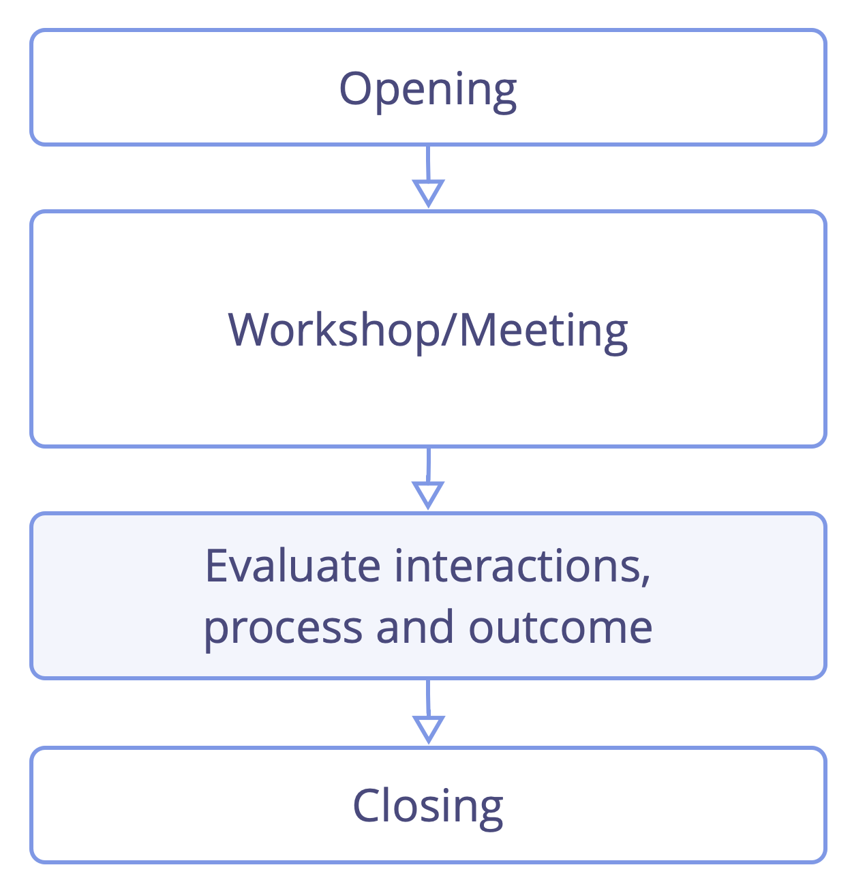

**A la fin de chaque réunion ou travail de groupe, prenez le temps d'en tirer des leçons et d'apprendre.**

Réfléchissez aux interactions, célébrez les succès et partagez vos suggestions d'amélioration.

- avant la ronde de fermeture
- garder 5 minutes pour chaque heure; 15 minutes pour un atelier d'une journée complète
- apprenez les récapitulatifs et évaluations avant la prochaine réunion
- formats courts: 
    - plus de / moins de / commencer à / arrêter de / garder
    - améliorations positives / critiques / suggérées

### Evaluer les réunions : format long

Demandez à tous les participants d'une ronde de réfléchir à n'importe lequel (ou chacun) de ces sujets durant une brève discussion :

- efficacité et format
- facilitation et participation
- le climat émotionnel
- appréciations et réussites (j'ai aimé...)
- croissance progressive et suggestions d'améliorations (j'aimerais...)
- idées débridées et suggestions radicales (et si...)

[&#9654; Hôte de la réunion](meeting-host.html) [&#9664; Faciliter les réunions](facilitate-meetings.html) [&#9650; Pratiques de réunion](meeting-practices.html)

