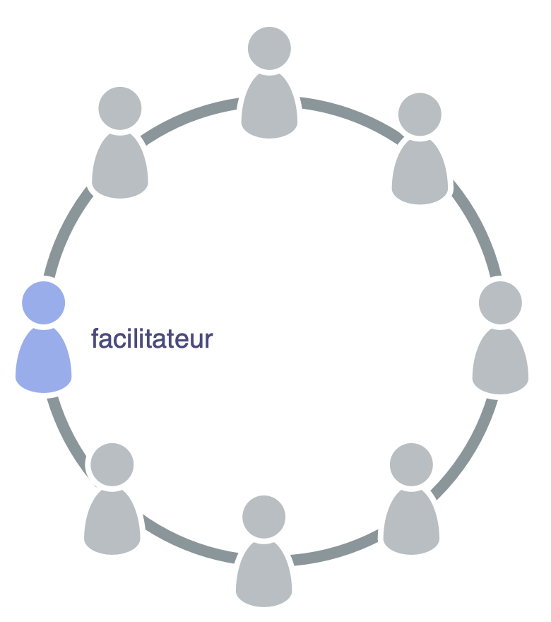

<strong>Sélectionnez quelqu'un pour faciliter les réunions de gouvernance.</strong>

Un facilitateur de <dfn data-info="Gouvernance: Le processus de fixer des objectifs et de prendre et de modifier des décisions qui guident les gens pour les atteindre.">gouvernance</dfn> :

- s'assure que les [réunions de gouvernance](governance-meeting.html) restent sur la bonne voie et sont évaluées
- est (habituellement) sélectionné par une <dfn data-info="Équipe: Un groupe de personnes qui collaborent vers un driver commun (ou un objectif). Généralement, une équipe fait partie d'une organisation, ou est formée pour la collaboration entre plusieurs organisations.">équipe</dfn> parmi ses membres (et pour une durée spécifique)
- se familiarise avec le [backlog de gouvernance](governance-backlog.html)
- invite souvent d'autres à faciliter certains points de l'ordre du jour

En tant que facilitateur de gouvernance, envisagez d'apprendre et d'utiliser les pratiques S3 suivantes pour gérer efficacement la gouvernance :

- [Tours de table](rounds.html)
- [Élaborer une proposition](proposal-forming.html)
- [Décider par consentement](consent-decision-making.html)
- [Sélectionner les porteurs de rôles](role-selection.html)
- [Évaluer les réunions](evaluate-meetings.html)
- [Intégrer les objections](resolve-objections.html)
- [Évaluation entre pairs](peer-review.html)

<a href="agree-on-values.html" title="Back to: S&apos;entendre sur les valeurs">◀</a> <a href="enablers-of-collaboration.html" title="Up: Catalyser la collaboration">▲</a> <a href="breaking-agreements.html" title="">▶ Read next: Enfreindre les accords</a>

