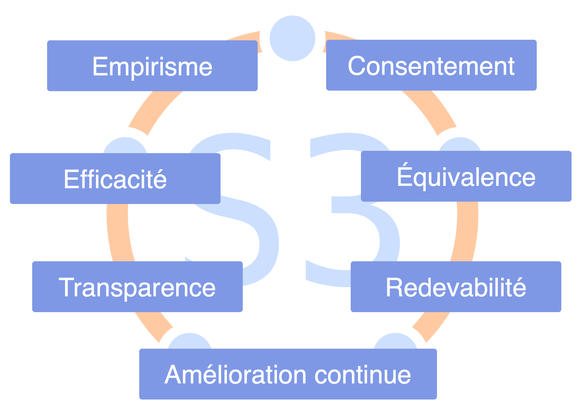

## Sociocratie 3.0 - Un guide pratique pour développer des organisations agiles et résilientes

### Collaboration efficace à toute échelle

La Sociocratie 3.0 — **ou “S3”** — est un guide pratique pour développer des organisations agiles et résilientes de toute taille, allant des petites start-ups jusqu'aux grands réseaux internationaux, et même la collaboration inter-ministerielle à l’échelle nationale. Elle fournit une manière cohérente de renforcer l'intégrité organisationnelle et **de développer une mentalité sociocratique et agile**.

S3 vous amène un large éventail de consignes et de pratiques qui ont prouvé leur utilité dans des organisations en **améliorant leur performance, leur alignement interne, le sentiment d'accomplissement et le bien-être de leurs collaborateurs**.

Ces pratiques vous aident à découvrir comment atteindre au mieux vos objectifs et à naviguer dans la complexité, une étape à la fois, **sans nécessiter de réorganisation radicale soudaine ni de planifier une initiative de changement à long terme**:

Démarrez simplement où le besoin semble le plus important, sélectionnez une ou des pratiques à essayer, **avancez à votre rythme** et développez vos compétences au fur et à mesure.

**Peu importe votre position dans l'organisation**, vous découvrirez des pratiques pertinentes et utiles pour vous-mêmes.

La Sociocratie 3.0 est :

- **flexible:** des pratiques adaptables, indépendantes et se renforçant mutuellement, pour vous aider dans tous les aspects de la collaboration
- **basée sur des principes :** sept principes fondamentaux de collaboration agile et sociocratique se reflètent dans chaque pratique
- **libre de droits :** sous licence Creative Commons Free Culture License

### Qu'est-ce que j'y gagne ?

**La Sociocratie 3.0 :**

- fournit un catalogue cohérent de pratiques de collaboration basées sur des principes, pour naviguer dans la complexité, s'adapter et évoluer.
- aide les personnes à traiter de manière incrémentale les informations disponibles en améliorant continuellement les processus de travail, les produits, les services et les compétences.
- aide les organisations à utiliser au mieux les talents déjà présents et à développer des structures organisationnelles flexibles pour aligner le flux d’informations et d’influence avec le flux de valeur.
- fournit une approche organique et itérative du changement qui répond aux organisations où elles sont et les aide à progresser à leur propre rythme et en fonction de leur contexte et de leurs besoins uniques.
- s’appuie sur l’intelligence collective du groupe.
- facilite le développement de stratégies qui sont « suffisantes pour le moment » et « suffisamment sûres à essayer ».
- favorise la redevabilité et le sens de l'engagement.
- est un mécanisme de transformation à la fois pour les individus et pour l'ensemble de l'organisation.

**La Sociocratie 3.0 peut être appliquée dans :**

- des startups
- des petites et moyennes entreprises
- de grandes organisations internationales en réseau
- des familles
- des organisations soutenues par des investisseurs
- des communautés
- et d'autres…

### Contenu de ce guide

- un petit historique et un bref aperçu de certains concepts à la base de S3
- une description de toutes les pratiques S3
- une annexe 
    - l’historique des modifications
    - des infos sur les auteurs et des remerciements
    - la licence
    - l'engagement intentionnel des praticiens et des enseignants de la Sociocratie 3.0
    - un glossaire et un index
## Influences et historique de la Sociocratie 3.0

La signification littérale du terme **sociocratie** est "la règle des compagnons": *socio* — du latin *socius* — qui signifie "companion", ou "ami", et le suffixe *-cracy* — du grec ancien κράτος (krátos) — qui signifie "puissance", ou "règle".

Le mot sociocratie peut être retracé en 1851, quand **Auguste Comte** a suggéré d'appliquer une approche scientifique à la société: les états seraient régis par un corps de scientifiques qui seraient des experts de la société (qu'il nommait "sociologues"). Selon lui, ce futur, bien qu'il ne fût pas encore réalisable, était inévitable.

Quelques décennies plus tard, **Lester Frank Ward**, utilisa le mot "sociocratie" pour décrire la loi des personnes ayant des relations entre elles. Au lieu d’avoir des sociologues au centre, il voulait donner plus de pouvoir et de responsabilité à l’individu, il imaginait les sociologues dans un rôle de chercheurs et de consultants.

En 1926, l'éducateur réformiste néerlandais et quaker **Kees Boeke**, établit un pensionnat fonctionnant sur le principe de consentement. Le personnel et les élèves étaient traités comme des participants égaux à la gouvernance de l'école, toutes les décisions devaient être acceptables par tous. Il construisit cette version de la sociocratie sur les principes et les pratiques des quakers, et décrivit la sociocratie comme une évolution de la démocratie dans son essai de 1945 "La démocratie comme elle pourrait être".

**Gerard Endenburg**, également quaker et étudiant dans l'école de Boeke, voulait appliquer la sociocratie dans son entreprise familiale, Endenburg Elektrotechniek. Il créa et développa la *méthode sociocratique d’organisation par cercles (SCM)* (qui deviendra plus tard la “méthode sociocratique”), en appliquant la sociocratie de Boeke à l'ingénierie et la cybernétique. En 1978, Endenburg fonda le Centre Sociocratique d'Utrecht (qui est maintenant le Centre Sociocratique de Rotterdam) afin de promouvoir la sociocratie aux Pays-Bas et au-delà. Depuis 1994, les organisations néerlandaises utilisant la SCM sont exemptées de l'obligation légale d'avoir un comité d’entreprise.

À la fin des années 1990 et au début des années 2000, plusieurs personnes non-néerlandaises découvrirent la sociocratie, mais ce n'est qu'en 2007 lorsque **Sharon Villines et John Buck** publièrent leur livre, "We the People", que la sociocratie devint largement accessible au monde anglophone, et qu'elle commença à migrer dans plusieurs autres langues.

La Sociocratie s'est avérée efficace pour de nombreuses organisations et communautés du monde entier, mais elle tarde encore à devenir virale.

En 2014 **James Priest et Bernhard Bockelbrink** se réunirent pour co-créer un corpus de ressources d'apprentissage sous licence Creative Commons, synthétisant les idées de la Sociocratie, de l’Agile et du Lean. Ils découvrirent que les organisations de toutes tailles ont besoin d’un menu flexible de pratiques et de structures – adaptées à leur contexte spécifique – qui permettent l’évolution d’une mentalité sociocratique et agile pour obtenir une plus grande efficacité, de l’alignement, le sentiment d’accomplissement et le bien-être. La première version de **Sociocratie 3.0.** fût lancée en mars 2015.

**Liliana David** rejoint l'équipe rapidement après et depuis, ils collaborent régulièrement pour développer le cadre et le site web.

Ensemble, ils cherchent à rendre S3 disponible et applicable au plus grand nombre d'organisations possible et publient des ressources sous une licence **Creative Commons Free Culture License** pour les gens qui veulent apprendre, appliquer et parler aux autres de la Sociocratie 3.0.

### Le mouvement Sociocratie 3.0

L’intérêt pour la Sociocratie 3.0 s'accroit, grâce à une communauté de personnes d'origines diverses qui se développe rapidement — des consultants pionniers, des coaches, des facilitateurs d’apprentissage et des personnes qui appliquent S3 dans différents contextes — tous reconnaissent le potentiel transformationnel de la Sociocratie 3.0 pour aider les organisations et leurs membres à prospérer. Beaucoup consacrent une part de leur temps à expérimenter et échanger sur S3, et collaborent pour apprendre les uns des autres et documenter leurs expériences afin de nourrir le développement et l’évolution du cadre et de ses applications diverses.
## Pourquoi la Sociocratie 3.0?

La Sociocratie comme forme de gouvernance fût évoquée dès 1851. Par la suite, elle a été développée et adaptée par de nombreuses personnes et organisations différentes, dont Gerard Endenburg, The Sociocracy Group (TSG) et Brian Robertson (HolacracyOne).

Pourtant, en dehors des Pays-Bas, la sociocratie est restée jusqu'à récemment largement inconnue.

Nous adorons la sociocratie parce que nous voyons des organisations et leurs membres prospérer lorsqu'ils en utilisent les éléments pour enrichir ou transformer leurs façons de faire.

Nous aimons aussi l'Agile, le Lean, le Kanban, les Core Protocols, la CNV, et bien d'autres idées aussi. Nous pensons que le monde sera un meilleur endroit, à mesure que plus d'organisations apprendront à puiser dans cette corne d'abondance de pratiques fantastiques qui émergent aujourd'hui dans le monde, et qu'elles apprendront à les intégrer avec ce qu'elles savent déjà.

C'est pourquoi nous avons décidé de consacrer une partie de notre temps à développer et à faire évoluer la Sociocratie, en l'intégrant avec de nombreuses autres idées puissantes, afin de la rendre accessible et applicable au plus grand nombre d'organisations possible.

À cette fin, nous croyons en l'importance d'avoir une identité forte, à une manière radicalement différente de distribuer et d'adapter la *méthode sociocratique d'organisation par cercles* afin d'améliorer son applicabilité.

### Le nom

Le nom «*Sociocratie 3.0*» montre à la fois le respect des origines et un pas en avant significatif.

Il permet également d'éviter la perception que nous dénaturons la *méthode sociocratique d'organisation par cercles* (SCM) telle que promue par The Sociocracy Group.

### Le nouveau modèle de distribution

*Sociocratie 3.0* utilise un modèle non centralisé de distribution. Il s'agit d'un changement de paradigme dans la manière dont la sociocratie est apportée aux gens et aux organisations, et qui parle à de nombreuses personnes.

Nous soutenons la distribution « virale » par deux stratégies clés :

* **La Sociocratie 3.0 est ouverte :** Nous voulons encourager la croissance d’un écosystème dynamique d’applications et de variantes de la sociocratie, où les gens partagent et discutent de leurs points de vue et des adaptations qu’ils apportent pour leur contexte spécifique. À cette fin, la Sociocratie 3.0 met l’accent sur la communication des principes sous-jacents et invite explicitement la créativité de chacun à mélanger, étendre et adapter les choses à leurs besoins.
* **La Sociocratie 3.0 est libre :** Afin de faciliter le démarrage pour les individus et les organisations, nous publions gratuitement sous licence *Creative Commons Free Culture License* des ressources permettant d'apprendre, pratiquer et enseigner *Sociocratie 3.0*. Tout le monde peut utiliser nos ressources sans notre permission explicite, même dans un contexte commercial, ou comme base pour construire ses propres ressources [^tant qu'elles partagent leurs nouvelles ressources sous la même licence]. Nous encourageons d'autres organisations, des consultants, des coachs, des facilitateurs d'apprentissage et des formateurs à suivre notre exemple et à libérer leurs ressources également.

### L'évolution de la méthode sociocratique d'organisation par cercles

Il nous faut sans doute préciser ceci explicitement : la Sociocratie 3.0 n'est pas spécifiquement destinée à la communauté existante des personnes qui explorent la *méthode sociocratique d'organisation par cercles*, ni au Sociocracy Group (TSG). La *méthode sociocratique d'organisation par cercles* (SCM) est déjà bien développée et beaucoup de personnes semblent en être globalement satisfaites.

Pourtant, d'après notre expérience directe, même pour les organisations qui ont entendu parler de sociocratie, il existe de nombreux obstacles pour s'y investir. Avec *Sociocratie 3.0* nous travaillons activement à adresser et à éliminer tout ce qui fait obstacle.

#### Réduire le risque et la résistance

La *Sociocratie 3.0* rencontre les organisations là où elles en sont et les emmène dans un voyage d’amélioration continue. Il n’y a pas de changement radical ni de réorganisation. La *Sociocratie 3.0* fournit un catalogue de pratiques indépendantes et basées sur des principes qu’une organisation peut amener une à une pour devenir plus efficace. Toutes les pratiques s’appuient sur un ensemble de principes fondamentaux, de sorte qu'elles puissent facilement être adaptées à chaque contexte.

#### Répondre au besoin plutôt qu'à l'objectif (ou la raison d'être)

La *Sociocratie 3.0* déplace la focale de la vision, la mission, les objectifs ou le but, vers la source de motivation, et aligne l’organisation vers la découverte et la résolution de ce dont elle a besoin. Les organisations qui sont déjà centrées sur les besoins, portées par des valeurs ou centrées sur leurs clients trouvent cela naturel.

En *Sociocratie 3.0*, le but est toujours implicite – faire circuler la valeur selon les intentions de l’organisation.

#### Réduite aux fondamentaux

En regardant les normes de la *méthode sociocratique d'organisation par cercles*, elle peut sembler imposante et effrayante. En se concentrant sur les fondamentaux seulement, *Sociocratie 3.0* offre un cadre léger pour s’adapter et d'où on peut construire selon ses besoins.

Cela ne veut pas dire que c’est facile : choisir de puiser dans les pratiques *Sociocratie 3.0* nécessite de s'investir pour apprendre et désapprendre. C’est pourquoi il est important de ne piocher que ce dont vous avez besoin, car il n’est pas utile de changer les choses si ce que vous faites marche suffisamment bien.

#### Intégration avec la pensée Agile et Lean

La *méthode sociocratique d'organisation par cercles* ne vous dira pas comment organiser vos activités ni comment créer une culture de collaboration étroite. De nombreuses organisations mettent déjà en œuvre ou tendent vers la pensée lean et agile dans leur fonctionnement et dans leur collaboration. Nous pensons que ce sont des idées puissantes, donc la *Sociocratie 3.0* est conçue pour une adoption facile dans les organisations lean et agiles.

#### Une nouvelle façon de développer la structure organisationnelle

La structure organisationnelle selon la *méthode sociocratique d'organisation par cercles* est structurée selon une hiérarchie de domaines. Nous constatons une émergence croissante d’environnements collaboratifs multi-parties prenantes et la nécessité d’une plus grande variété de modèles de structure organisationnelle. L'évolution de la structure organisationnelle se produit naturellement lorsque les flux d'information et l'influence au sein d'une organisation sont graduellement alignés sur le flux de valeur. La *Sociocratie 3.0* fournit une variété de modèles de structures qui peuvent être combinés pour faire évoluer la structure selon le besoin et de manière flexible.

*James Priest, Bernhard Bockelbrink, Liliana David*
## Les concepts de base

Avant d'aller plus loin, prenez le temps de vous familiariser avec des concepts de base derrière la S3 :

- Qu'est-ce qu'une pratique ?
- Les sept principes
- Comprendre les organisations : 
    - Intentions, valeur et gaspillage
    - Domaines, délégation et redevabilité
    - Gouvernance et opérations

Si vous ne comprenez pas l'un de ces termes, consultez notre glossaire à la fin.
### Pratiques

_Une **pratique** est un modèle pour traverser correctement un contexte particulier._

- Les pratiques S3 sont découvertes en observant la manière dont les organisations répondent aux problèmes et réagissent aux opportunités
- Les pratiques S3 peuvent être développées et adaptées pour convenir à différents contextes
- les pratiques sont regroupées en 10 catégories

### Les sept principes

La Sociocratie est fondée sur sept principes qui façonnent la culture organisationnelle. Puisque les sept principes se reflètent dans toutes les pratiques Sociocratie 3.0, la compréhension de ces principes est utile pour les adopter et primordiale si l'on souhaite les adapter .

La pratique de la Sociocratie 3.0 aide les gens à apprécier la valeur essentielle que ces principes fondamentaux apportent, tant aux individus qu'aux organisations.

**Le Principe d'Efficacité:** *Allouer du temps seulement à ce qui vous rapproche d'atteindre vos objectifs.*

**Le Principe de Consentement:** *Lever, chercher et résoudre les objections aux décisions et aux actions.*

**Le Principe d'Empirisme:** *Tester toutes les hypothèses grâce à l'expérimentation et l'évaluation continue.*

**Le Principe d'Amélioration Continue:** *Évoluer par incréments pour faciliter un apprentissage empirique constant.*

**Le Principe d'Equivalence:** *Impliquer les personnes impactées dans les prises de décisions et les évolutions.*

**Le Principe de Transparence:** *Rendre toutes les informations accessibles à tous les membres d'une organisation, à moins qu'il faille préserver leur confidentialité.*

**Le Principe Redevabilité:** *Réagir lorsque c'est nécessaire, faire ce que vous avez convenu de faire et assumer la responsabilité de son bon déroulement .*

#### Le Principe de Redevabilité

*Réagir lorsque c'est nécessaire, faire ce que vous avez convenu de faire et assumer la responsabilité de son bon déroulement .*

Agissez dans le cadre des contraintes des ententes régissant les domaines dont vous êtes redevables, y compris l'organisation elle-même, les équipes dont vous faites partie et les rôles que vous portez.

Chaque membre de l'organisation est redevable de répondre efficacement aux intentions organisationnelles, tant pour faire le travail que pour assurer (soutenir) une collaboration efficace.

Les individus sont également redevables de leur travail, de leur apprentissage et de leur développement, et de se soutenir mutuellement.

Tout le monde dans une organisation est redevable de l'alignement des activités avec les valeurs organisationnelles.
### Comprendre les organisations
#### Intentions

_Une **intention** est la motivation d'un groupe ou d'une individu à répondre à une situation particulière._

Intentions :

- peuvent être utilisées pour formuler des buts, objectifs, aspirations, une mission, une vision, une raison d’être
- peuvent changer au fil du temps

##### Intentions, valeur et gaspillage

_La **valeur** est l'importance ou l'utilité de quelque chose lié à une intention._

_Le **gaspillage** est tout ce qui n'est pas nécessaire pour - ou qui fait obstacle à - répondre (plus) efficacement à une intention._

En adoptant les concepts de valeur et de gaspillage, de nombreuses pratiques et idées issues de la **production lean** et du **développement de logiciel lean** sont applicables aux organisations pratiquant S3:

- cartographie de la chaîne de valeur
- différentes stratégies pour éliminer le gaspillage
- la méthode Kanban
#### Domaines

_Un **domaine** est une zone d'influence, d’activité et de prise de décisions distincte au sein d'une organisation._

Tous les domaines d'une organisation sont contenus dans son domaine général. Ils peuvent se chevaucher et/ou être pleinement inclus au sein d'autres domaines.

Les domaines sont délégués à des personnes (ex: à une unité, un département, une équipe ou des individus), qui prennent la responsabilité du domaine, et agissent selon les contraintes qu'il impose en terme d'influence et d'autonomie.

##### Déléguer les domaines

Ceux qui délèguent un domaine (les *délégants*) conservent néanmoins la redevabilité de ce domaine, allouent des **ressources** et définissent souvent :

- le **besoin organisationnel** auquel le domaine doit répondre
- les **responsabilités clés** (livrables, risques critiques à gérer, autre travail essentiel et prises de décision délégués)
- des **contraintes sur l'autonomie et l'influence** pour ceux à qui sont délégués le domaine (les *délégués*), souvent liées à l'organisation elle-même (dépendances, implication du délégant, reporting, etc.)

##### Intentions et domaines

Il est également possible de comprendre un domaine par rapport aux intentions organisationnelles :

- l'**intention primaire** - l'intention principale à laquelle les gens redevables d’un domaine donné (les *délégués*) répondent
- l'ensemble des sous-intentions qui peuvent être bénéfique pour l'organisation d'adresser afin de répondre à l'intention primaire, et comprennent : 
    - les **responsabilités clés** (n'importe quelle intention dérivant directement de l'intention primaire)
    - les motivations pour les **contraintes du domaine** (généralement lié au contexte de l'organisation globale)

### Gouvernance et opérations

S3 cherche à libérer la productivité en laissant les gens libres de faire et de décider autant que possible par eux-même, tout en assurant de la cohérence dans la collaboration pour une organisation efficace et qui réussit.

Une plus grande autonomie des individus et des équipes nécessite des ententes claires (c'est-à-dire des consignes et des contraintes) qui permettent une collaboration harmonieuse entre ces équipes et ces individus, et qui soutiennent la réalisation d'objectifs à court et long terme. Des évaluations périodiques et l'évolution progressive des ententes assurent qu'elles restent adaptées à la finalité.

Bien qu’une décision ayant des conséquences à court terme puisse facilement être prise sur-le-champ, créer des ententes plus conséquentes qui contraignent le comportement et l’activité des gens, profite souvent d’un [processus de décision](consent-decision-making.html) plus participatif et plus délibéré.

De telles ententes doivent être documentées, à la fois pour se les rappeler mais aussi pour permettre une [évaluation](evaluate-and-evolve-agreements.html) efficace, et doivent être communiquées aux personnes impactées (qui sont idéalement aussi [impliquées dans la création et l'évolution](those-affected-decide.html) de ces ententes).

Il est donc utile de distinguer deux catégories d’activités dans une organisation, l'une que nous appelons la gouvernance, et l’autre que nous appelons les opérations :

_La **Gouvernance** dans une organisation (ou l'un de ses domaines) est l'acte de fixer des objectifs, et de prendre et faire évoluer des décisions qui guident les gens pour les atteindre._

_Les **Opérations** consistent à faire le travail et organiser les activités quotidiennes selon les contraintes définies par la gouvernance._

Pour chaque domaine dans une organisation il y a un *instance gouvernante*: les personnes ayant un mandat pour sceller et pour faire évoluer des ententes régissant la manière dont ceux qui font le travail dans ce domaine créent de la valeur.

Il existe de nombreuses façons de distribuer le travail et la gouvernance. Parfois, l’instance gouvernante est une personne unique, par exemple dans le cas d’un chef d’équipe, et parfois c’est un groupe de personnes, par exemple dans un cercle où tous les membres sont responsables collectivement de la gouvernance selon les contraintes du domaine.

**Les décisions de gouvernance** fixent des contraintes sur l'activité et guident les décisions futures.

Ceci inclut :

- définir les domaines
- déléguer l'influence aux gens
- allouer des ressources et des capacités
- spécifier les livrables et prioriser leur livraison.

Les décisions de gouvernance peuvent être prises à tout moment et à n'importe quel endroit, pas seulement dans des réunions spécifiques, bien qu'une [réunion régulière pour la création et l'évolution des ententes](governance-meeting.html) soit souvent une bonne idée.

#### Concepts connexes

**Auto-gouvernance**: Ensemble de personnes se gouvernant elles-mêmes selon les contraintes d'un domaine.

**Semi-autonomie**: L'autonomie des personnes à créer de la valeur dans leur domaine, contrainte par leurs propres décisions de gouvernance, et les objections (y compris celles du délégant et des représentants).

**Auto-organisation:** Toute activité ou processus à travers lequel les gens organisent leur travail quotidien sans l'influence d'un agent externe, et selon les contraintes définies par la gouvernance. Dans toute organisation ou équipe, l'auto-organisation et l'influence externe coexistent.

Selon les contraintes imposées par le délégant, les équipes ont plus ou moins de latitude à mener la gouvernance et à décider comment elles organisent leurs opérations, et sont par conséquent plus ou moins auto-gouvernées et auto-organisées.

[&#9654; Co-création et évolution](co-creation-and-evolution.html)

