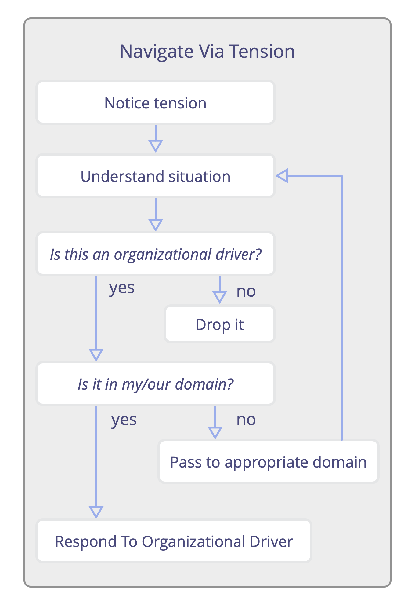
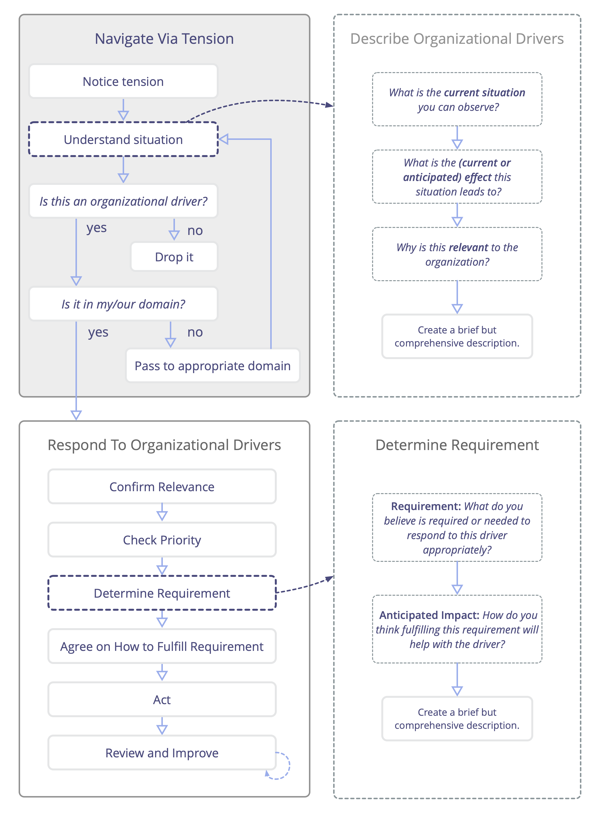

Prêtez attention aux tensions que vous ressentez par rapport à l'organisation, explorez leur cause et transmettez aux personnes redevables du domaine approprié tout moteur organisationnel que vous découvrez.

Les **défis et opportunités** pour une organisation émergent lorsque les individus réfléchissent aux raisons pour lesquelles ils ressentent une tension.

## Étape 1 : Identifier la tension

Dans ce contexte, une _tension_ est un état interne d'alerte : une expérience personnelle déclenchée lorsqu'il existe une dissonance entre la perception d’une situation par un individu et ce qu’il attend ou préférerait voir.

## Étape 2 : Comprendre la situation

Analysez la situation que vous percevez et qui génère une tension en vous. Parfois, cette enquête révèle des malentendus et la tension disparaît.

## Étape 3 : Est-ce un moteur organisationnel ?

Une manière simple de déterminer si un moteur est pertinent pour l'organisation est de se poser la question suivante :

_Répondre à cette situation aiderait-il l'organisation à créer de la valeur, éliminer du gaspillage ou éviter des conséquences indésirables ?_

-   Si la réponse est **oui**, il est probable que vous ayez identifié un moteur organisationnel qui nécessite une réponse.
-   Si la réponse est **non**, vous pouvez ignorer la situation et vous concentrer sur des éléments pertinents.
-   Si la réponse est **incertaine**, approfondissez votre analyse, y compris en consultant d'autres personnes qui pourraient avoir une vision plus claire.

## Étape 4 : Est-ce dans mon/notre domaine ?  Sinon, transmettez-le

Si le moteur relève du périmètre d'un domaine dont vous êtes responsable, vous voudrez l'ajouter à votre liste de priorités et y répondre en conséquence (voir [Répondre aux Moteurs Organisationnels](respond-to-organizational-drivers.html)). Même s'il ne relève pas directement de votre domaine de responsabilité, il se peut que vous soyez la personne la mieux placée pour y répondre ou, à tout le moins, que vous puissiez le traiter sans créer d'entraves ou de dommages.  Dans ce cas, envisagez simplement de vous en occuper. Il ne vaut peut-être pas la peine de chercher une autre personne et de lui expliquer la situation si vous pouvez la gérer vous-même rapidement.

Dans d'autres cas, vous identifierez des moteurs qui relèvent de la responsabilité d'autres personnes.  Pour que Naviguer par Tension soit efficace, il est essentiel d'avoir suffisamment de clarté sur qui est responsable de quoi dans l'organisation. Cela permet aux membres de savoir, ou de découvrir, à qui transmettre les nouveaux moteurs organisationnels qu'ils identifient, afin qu'ils soient pris en charge de manière appropriée.

