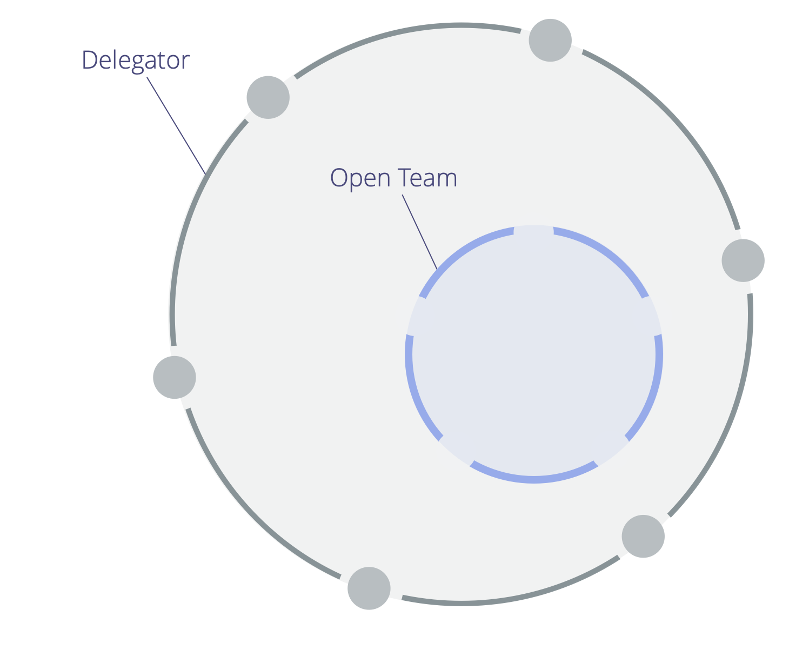

Occupez-vous délibérément d'un domaine sur invitation plutôt que par affectation et demandez que ceux qui sont invités contribuent quand ils peuvent.

_Une **équipe ouverte** est un groupe de personnes qui sont invitées à contribuer quand elles le peuvent au travail et à la gouvernance d'un domaine._

Le <a href="glossary.html#entry-delegator" class="glossary-tooltip" data-toggle="tooltip" title="Délégant: Un individu ou un groupe déléguant la responsabilité d&#x27;un domaine à autrui.">délégant</a> du domaine crée une invitation qui clarifie :

- le <a href="glossary.html#entry-primary-driver" class="glossary-tooltip" data-toggle="tooltip" title="Driver Primaire: Le driver primaire d&#x27;un domaine est le driver principal auquel les personnes responsables de ce domaine répondent.">driver primaire</a>, les responsabilités clés et les contraintes du domaine de l'équipe ouverte
- qui est invité à contribuer (les membres de l'équipe ouverte)
- les contraintes liées à la participation du délégant à la <a href="glossary.html#entry-governance" class="glossary-tooltip" data-toggle="tooltip" title="Gouvernance: Le processus visant à fixer des objectifs et à prendre et faire évoluer des décisions qui guident les gens vers l&#x27;atteinte de ces objectifs.">gouvernance</a> de l'équipe ouverte

Selon les contraintes définies par le délégant, les contributeurs peuvent simplement <a href="glossary.html#entry-operations" class="glossary-tooltip" data-toggle="tooltip" title="Opérations: Faire le travail et organiser les activités du quotidien selon les contraintes définies par la gouvernance.">organiser et faire le travail</a>, ou prendre aussi part à la gouvernance.

Le délégant est redevable de mener des examens réguliers pour soutenir l'efficacité du travail et de toute prise de décision au sein de l'équipe ouverte.

