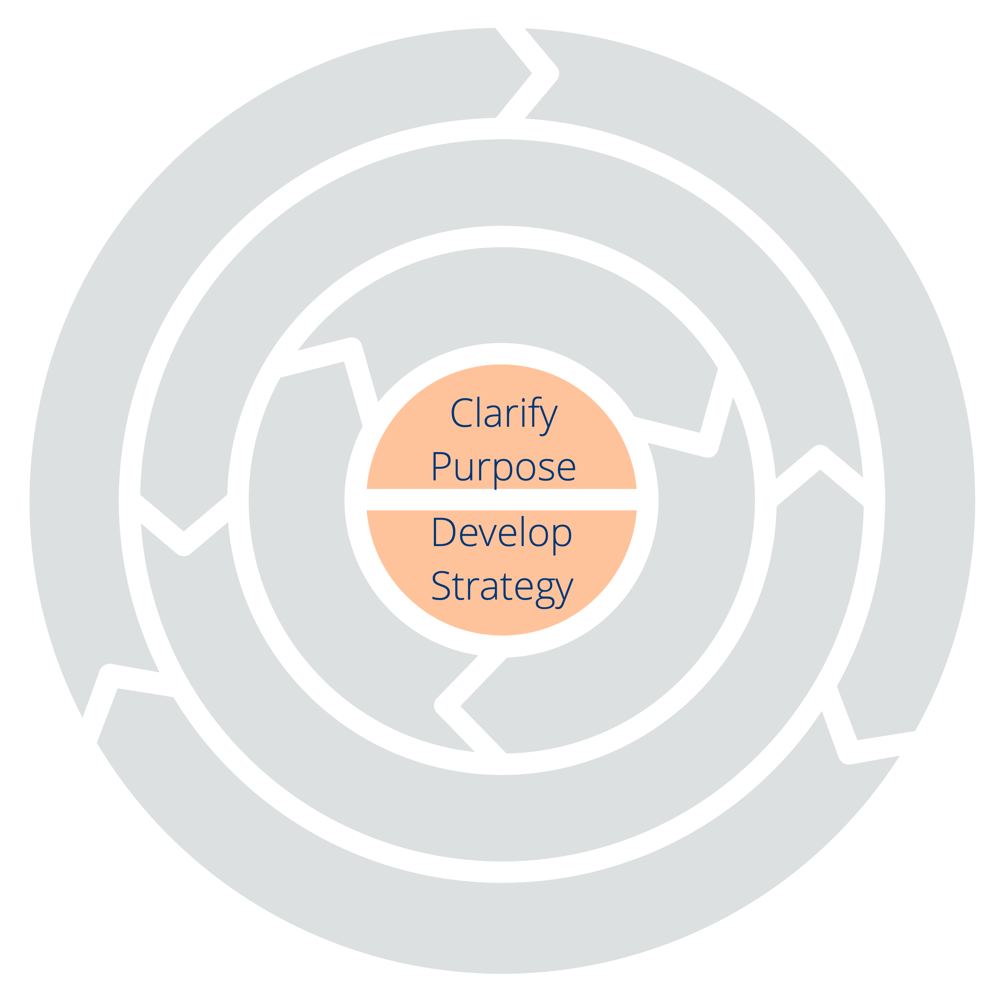

<a href="ten-principles.html" title="Back to: Dix principes pour développer les équipes et les organisations">◀</a> <a href="csf.html" title="Up: Un framework de sens commun pour les organisations et les équipes">▲</a> <a href="clarify-purpose.html" title="">▶ Read next: Principe 1 – Clarifier la raison d&apos;être</a>

