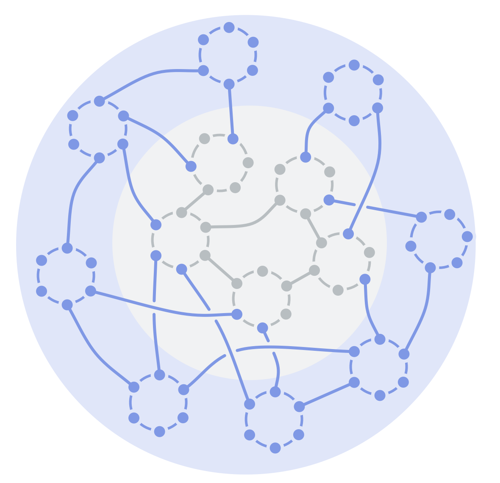

Apportez de la valeur aux environnements complexes et compétitifs à travers la <em>décentralisation</em> (des ressources et de l'influence) et <em>l'interaction directe</em> entre les créateurs de valeur et les clients qu'ils servent.

Les équipes en périphérie :

- délivrent de la valeur par des échanges directs avec le monde extérieur (clients, partenaires, communautés, municipalités, etc.)
- administrent les ressources financières et pilotent l'organisation

Le centre fournit des services internes pour soutenir l'organisation.

Les <a href="glossary.html#entry-domain" class="glossary-tooltip" data-toggle="tooltip" title="Domaine: Une zone de responsabilité et d&#x27;autorité bien délimitée au sein d&#x27;une organisation.">Domaines</a> sont liés pour permettre à l'information et l'influence de circuler, ainsi que pour soutenir la collaboration en cas de dépendances.

