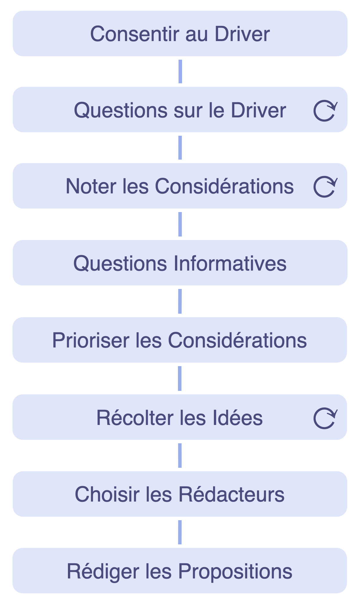

<strong>Un processus de groupe (facilité) pour co-créer une réponse à une intention.</strong>

- s’appuie sur l’intelligence collective et la diversité des perspectives au sein d’un groupe
- implique les participants dans la co-création des ententes
- encourage la redevabilité et le sens de l'appropriation

La pratique *Élaborer une proposition* peut également être utilisée par un individu.

### Étapes d'élaboration d'une proposition

**Consentir à l'intention:** Présenter brièvement l'<dfn data-info="Moteur organisationnel: Une intention est le motif d’une personne ou d’un groupe à répondre à une situation particulière. Une intention est considérée comme une **intention organisationnelle** si y répondre aiderait l’organisation à générer de la valeur, à éliminer du gaspillage ou à éviter des conséquences inattendues.">intention</dfn>. *Est-il pertinent pour nous de répondre à cette intention? Y a-t-il des amendements essentiels à ce qui a été présenté?*

**Approfondir la compréhension collective de l'intention** : recueillir les questions essentielles à une meilleure compréhension de l'intention.

**Recueillir les considérations** formulées comme des questions relatives aux solutions possibles. Les questions révèlent des contraintes (questions informatives) ou des possibilités (questions génératives).

**Répondre** à toutes les questions demandant des informations, si possible.

**Prioriser** les remarques.

**Récolter les idées** comme constituants possibles d'une proposition.

**Rédiger une proposition** pour répondre à l'intention, en prenant en compte les idées créatives et les informations récoltées jusque là. En général, c'est un groupe plus restreint de "rédacteurs" qui s'occupe de cette étape.

### Choisir les rédacteurs

Considérez :

- qui devrait participer ?
- qui veut participer ?
- qui d'autre pourrait apporter une contribution utile ?
- considérez une expertise, un point de vue ou une inspiration extérieure

Deux ou trois rédacteurs suffisent généralement. Vérifiez qu'il n'y ait pas d'objections au(x) rédacteur(s) proposé(s).

[&#9654; Sélection des rôles](role-selection.html) [&#9664; Co-créer des propositions](co-create-proposals.html) [&#9650; Co-créer et évoluer](co-creation-and-evolution.html)

