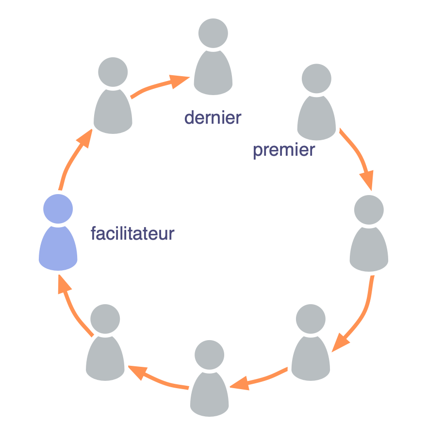

<strong>Lors d'une réunion de groupe, donnez la parole à chacun son tour.</strong>

Les tours de table sont une technique de facilitation de groupe pour maintenir l'équivalence et encourager un dialogue efficace.

Soyez clairs sur la finalité et le résultat attendu de chaque tour de table.

Asseyez-vous en cercle, commencez chaque tour de table par une personne différente, et changez le sens de rotation (horaire ou anti-horaire) pour faire varier qui parle en premier et dernier ainsi que l'ordre des contributions.

<a href="meeting-practices.html" title="Remonter: Se réunir">▲</a> <a href="facilitate-meetings.html" title="Lire la suite : Faciliter les réunions">▶ Lire la suite : Faciliter les réunions</a>

