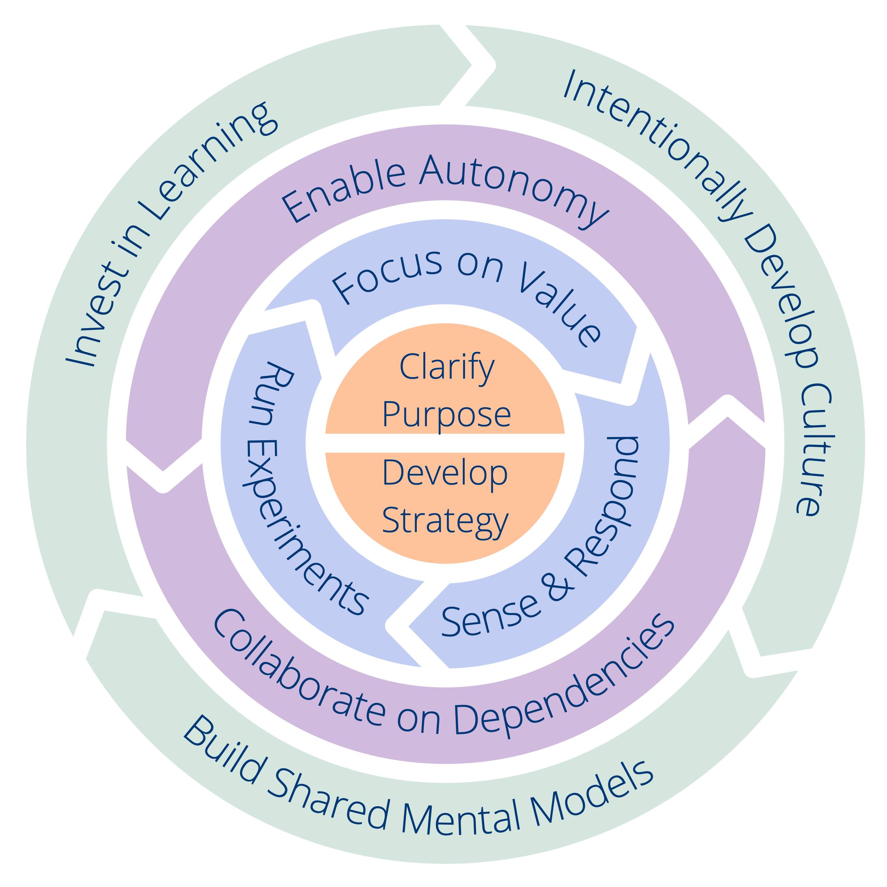

Chaque principe soutient un résultat spécifique. Pour déterminer par où commencer dans votre organisation ou votre équipe, **jetez un œil aux résultats de chaque principe** (le texte après "_ afin que_") et réfléchissez à vos plus grands besoins du moment. Dans tous les cas, **vérifiez que vous êtes suffisamment clair sur les objectifs et la stratégie de votre organisation ou de votre équipe avant de continuer**.

Dans l'illustration ci-dessous, vous pouvez voir que certains des principes sont plus étroitement liés que d'autres, ce qui pourrait vous indiquer l'endroit par où commencer.

Pour chaque principe, nous avons inclus une liste de suggestions de ce que vous pouvez essayer. Ces suggestions sont tirées du menu [des pratiques contenues dans la Sociocratie 3.0](http://patterns.sociocracy30.org). Pour l'instant, nous avons seulement ajouté les pratiques les plus essentielles qui soutiennent chaque principe, dans les versions futures de ce framework, nous inclurons encore plus de pratiques. 

<a href="shared-mental-models.html" title="Retour à : Principe 10 – Construire des modèles mentaux partagés">◀</a> <a href="csf.html" title="Remonter: Un Framework du Sens Commun pour les organisations et les équipes">▲</a> <a href="appendix.html" title="">▶ Lire la suite : Annexe</a>

